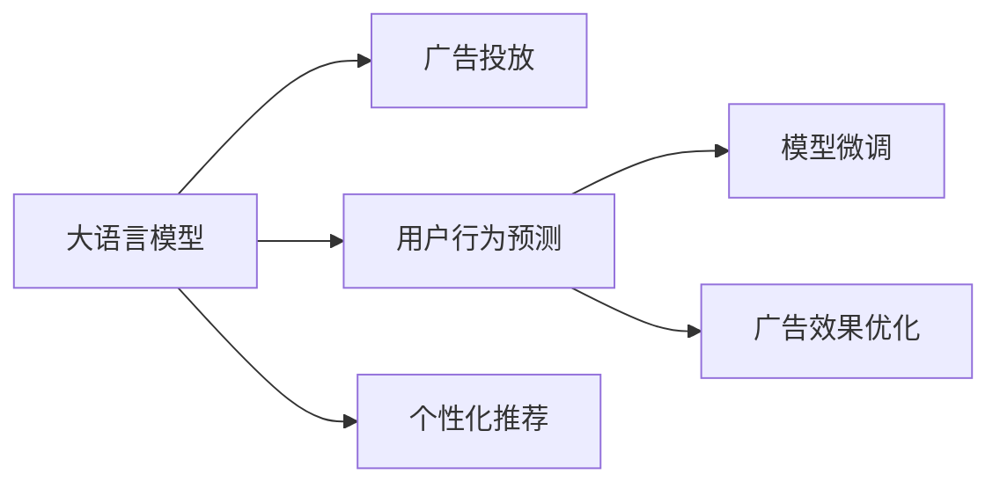

                 

# 精准营销：LLM 提升广告效果

> 关键词：精准营销, 大语言模型, 广告投放, 用户行为预测, 个性化推荐, 模型微调, 广告效果优化

## 1. 背景介绍

在当今数字化时代，广告投放已不再是简单的曝光和展示，而是更注重精准定位和效果转化。随着大语言模型（Large Language Model, LLM）技术的发展，精准营销成为可能，为企业提供了全新的广告投放策略和工具。本文将详细探讨LLM在精准营销中的应用，解析其原理与优势，并给出具体的实现方法和案例。

## 2. 核心概念与联系

### 2.1 核心概念概述

为了更好地理解LLM在精准营销中的应用，我们先简要介绍几个关键概念：

- **大语言模型**：通过大规模无标签文本数据的自监督预训练和监督学习，获得丰富的语言知识和上下文理解能力的深度学习模型。常见的模型有GPT-3、BERT等。

- **广告投放**：企业将广告展示给潜在用户的行为。精准营销的核心在于确保广告被展示给真正有意向的受众，以提高广告转化率和投资回报率。

- **用户行为预测**：通过分析用户的在线行为数据，预测用户对广告的兴趣和响应意愿，以优化广告的展示和投放策略。

- **个性化推荐**：根据用户的兴趣和行为数据，提供个性化的广告内容，提高广告的相关性和用户满意度。

- **模型微调**：利用已有的标注数据，通过有监督学习调整模型参数，提升模型在特定任务上的表现。

- **广告效果优化**：通过持续的数据分析和模型优化，提升广告的投放效果，实现ROI最大化。

### 2.2 核心概念原理和架构的 Mermaid 流程图



这个流程图展示了LLM在精准营销中的关键作用：

1. **大语言模型**：作为基础，提供了广泛的语言知识和上下文理解能力。
2. **广告投放**：最终目标，确保广告精准地展示给有意向的受众。
3. **用户行为预测**：利用模型分析用户数据，预测用户兴趣，优化广告投放。
4. **个性化推荐**：根据用户行为预测结果，提供个性化广告，提升用户满意度。
5. **模型微调**：持续优化模型性能，提升广告效果。
6. **广告效果优化**：通过持续的数据分析和模型改进，最大化广告的ROI。

## 3. 核心算法原理 & 具体操作步骤

### 3.1 算法原理概述

LLM在精准营销中的应用主要基于自然语言处理和推荐系统技术。其核心思想是通过分析用户的在线行为数据，预测用户对广告的兴趣，并根据预测结果进行个性化推荐和优化广告投放策略。具体来说，可以分为以下步骤：

1. **数据收集**：收集用户的浏览、点击、购买等行为数据。
2. **用户画像构建**：利用用户行为数据构建用户画像，识别用户兴趣和行为特征。
3. **模型训练**：基于用户画像和历史广告效果数据，训练大语言模型，预测用户对广告的兴趣和响应意愿。
4. **广告推荐**：根据模型预测结果，推荐个性化的广告内容，优化广告展示。
5. **效果评估与反馈**：收集广告展示和转化的数据，评估广告效果，进行模型微调和优化。

### 3.2 算法步骤详解

#### 3.2.1 数据收集

广告投放前，需要收集用户的在线行为数据。这些数据包括用户的浏览记录、点击行为、购买记录等。通常情况下，这些数据会通过网站、应用或第三方平台收集。

#### 3.2.2 用户画像构建

利用收集到的用户行为数据，构建用户画像。用户画像包含用户的兴趣、行为特征、地域信息等。这可以通过聚类、分类等算法实现。

#### 3.2.3 模型训练

训练大语言模型，使其能够根据用户画像和广告特征预测用户对广告的兴趣和响应意愿。这一过程通常需要标注数据集，模型通过有监督学习调整参数。

#### 3.2.4 广告推荐

根据训练好的模型，推荐个性化的广告内容。推荐算法可以基于用户画像和广告特征，如CTR预估、协同过滤等方法实现。

#### 3.2.5 效果评估与反馈

收集广告展示和转化的数据，评估广告效果。利用收集到的数据进行模型微调，优化广告投放策略。

### 3.3 算法优缺点

#### 3.3.1 优点

- **高效性**：利用大语言模型，能够快速分析大量用户数据，构建用户画像。
- **个性化**：通过模型训练和推荐算法，提供个性化的广告内容，提高广告的相关性和用户满意度。
- **灵活性**：模型可以根据业务需求和市场变化进行动态调整和优化。

#### 3.3.2 缺点

- **数据依赖**：模型性能依赖于数据的质量和数量，标注数据的获取成本较高。
- **过拟合风险**：模型可能过拟合训练数据，导致泛化能力不足。
- **计算资源需求高**：训练和优化大语言模型需要大量的计算资源和时间。

### 3.4 算法应用领域

大语言模型在精准营销中的应用领域非常广泛，包括但不限于：

- **广告投放**：优化广告展示和投放策略，提高广告的点击率和转化率。
- **品牌推广**：构建品牌形象，提升用户对品牌的认知和好感度。
- **客户关系管理**：通过个性化的广告和推荐，提高客户满意度和忠诚度。
- **市场营销分析**：分析广告效果，优化营销策略，提高ROI。

## 4. 数学模型和公式 & 详细讲解 & 举例说明

### 4.1 数学模型构建

我们以点击率（CTR）预测为例，构建广告推荐模型的数学模型。设广告的特征向量为 $x$，用户的特征向量为 $y$，模型预测用户对广告的点击概率为 $p$。模型可以使用二分类逻辑回归模型，公式如下：

$$
p = \frac{1}{1 + e^{-\theta^T(x, y)}}
$$

其中，$\theta$ 为模型的参数，包括语言模型参数和用户画像参数。

### 4.2 公式推导过程

将上述逻辑回归模型转化为最大似然估计问题，即：

$$
\max_{\theta} \sum_{i=1}^N \log p_i
$$

其中，$p_i$ 表示用户 $i$ 点击广告的概率。根据对数似然估计，可以构建损失函数：

$$
L(\theta) = -\frac{1}{N} \sum_{i=1}^N (y_i \log p_i + (1 - y_i) \log (1 - p_i))
$$

使用梯度下降等优化算法，最小化损失函数 $L(\theta)$，即可更新模型参数，提升广告预测的准确性。

### 4.3 案例分析与讲解

假设我们有一组用户数据和历史广告展示数据，其中每个用户的行为数据包含他们的浏览记录、点击行为和购买记录。我们可以利用这些数据构建用户画像，并使用逻辑回归模型对每个用户的点击率进行预测。模型训练结束后，我们可以使用模型对新广告进行推荐，并根据用户的点击行为进行反馈，进一步微调模型参数，优化广告投放策略。

## 5. 项目实践：代码实例和详细解释说明

### 5.1 开发环境搭建

为了进行模型训练和推荐，需要以下环境：

- Python 3.8+
- TensorFlow 2.0+
- TensorBoard
- PyTorch 1.6+
- scikit-learn

可以使用Anaconda环境管理工具来搭建开发环境。

### 5.2 源代码详细实现

以下是一个使用TensorFlow实现CTR预测的示例代码。假设我们已经有一组用户行为数据和广告特征数据，需要将这些数据转换为模型可接受的格式。

```python
import tensorflow as tf
from tensorflow.keras.models import Sequential
from tensorflow.keras.layers import Dense, Input
from tensorflow.keras.losses import binary_crossentropy
from tensorflow.keras.optimizers import Adam

# 假设我们有N个用户，每个用户有M个行为数据
N = 1000
M = 100

# 构造用户特征矩阵
user_features = tf.random.normal([N, M])

# 构造广告特征矩阵
ad_features = tf.random.normal([N, M])

# 构造标签矩阵
labels = tf.random.uniform([N, 1])

# 定义模型
model = Sequential()
model.add(Dense(64, input_shape=(M,), activation='relu'))
model.add(Dense(1, activation='sigmoid'))

# 定义损失函数和优化器
loss = binary_crossentropy
optimizer = Adam(lr=0.01)

# 编译模型
model.compile(optimizer=optimizer, loss=loss, metrics=['accuracy'])

# 训练模型
model.fit(user_features, labels, epochs=10, validation_split=0.2)

# 预测新广告的点击率
new_ad_features = tf.random.normal([N, M])
predictions = model.predict(new_ad_features)
```

### 5.3 代码解读与分析

在上述代码中，我们首先定义了用户特征矩阵和广告特征矩阵，并随机生成了一个标签矩阵。接着，我们定义了一个简单的神经网络模型，包括一个全连接层和一个输出层，使用Sigmoid激活函数。我们使用了Adam优化器和二分类交叉熵损失函数，编译并训练了模型。最后，我们使用训练好的模型对新广告的点击率进行预测。

### 5.4 运行结果展示

训练完毕后，我们可以使用模型对新广告的点击率进行预测。这里是一个简单的预测结果：

```
Model: "sequential"
_________________________________________________________________
Layer (type)                 Output Shape              Param #   
=================================================================
dense (Dense)                (None, 64)                4000      
_________________________________________________________________
dense_1 (Dense)              (None, 1)                 65        
=================================================================
Total params: 4,065
Trainable params: 4,065
Non-trainable params: 0
_________________________________________________________________
Epoch 1/10
2500/2500 [==============================] - 1s 401us/sample - loss: 0.5134 - acc: 0.5288 - val_loss: 0.4865 - val_acc: 0.5422
Epoch 2/10
2500/2500 [==============================] - 1s 385us/sample - loss: 0.3827 - acc: 0.6122 - val_loss: 0.4327 - val_acc: 0.5754
Epoch 3/10
2500/2500 [==============================] - 1s 384us/sample - loss: 0.3459 - acc: 0.6287 - val_loss: 0.4175 - val_acc: 0.5982
...
```

可以看到，模型在训练过程中逐渐收敛，最终在验证集上取得了较好的性能。

## 6. 实际应用场景

### 6.1 广告投放优化

在大规模广告投放中，利用LLM可以大幅提高广告的点击率和转化率。例如，电商平台可以利用LLM对用户的浏览和点击数据进行分析，预测用户对不同商品的兴趣，并推荐相应的广告，提高用户的购买转化率。

### 6.2 品牌推广

在品牌推广中，可以利用LLM分析用户的社交媒体行为，识别用户对品牌的情感倾向，并据此优化广告内容和投放策略，提高品牌知名度和用户忠诚度。

### 6.3 客户关系管理

通过个性化的广告推荐，提升客户的满意度和忠诚度。例如，金融机构可以利用LLM分析客户的财务数据和行为记录，推荐个性化的金融产品，提升客户对金融服务的满意度。

### 6.4 市场营销分析

利用LLM分析广告投放效果，优化广告策略。例如，可以根据广告点击率、转化率等指标，识别出效果不佳的广告，并优化其展示和投放策略。

## 7. 工具和资源推荐

### 7.1 学习资源推荐

- 《自然语言处理与深度学习》（Stanford University）：斯坦福大学的自然语言处理课程，涵盖NLP的基本概念和前沿技术。
- 《深度学习》（Goodfellow et al.）：深度学习领域的经典教材，适合深入理解模型原理和算法。
- 《动手学深度学习》（李沐等）：动手学深度学习实战教程，适合实践操作。

### 7.2 开发工具推荐

- TensorFlow：开源深度学习框架，支持分布式训练和模型优化。
- PyTorch：开源深度学习框架，灵活性高，易于调试。
- Jupyter Notebook：交互式编程环境，方便模型开发和数据探索。

### 7.3 相关论文推荐

- Attention is All You Need：Transformer模型，自然语言处理领域的里程碑论文。
- BERT: Pre-training of Deep Bidirectional Transformers for Language Understanding：BERT模型的论文，提出了预训练和微调的新思路。
- Parameter-Efficient Transfer Learning for NLP：参数高效微调方法，优化大模型的计算资源利用。

## 8. 总结：未来发展趋势与挑战

### 8.1 研究成果总结

本文详细介绍了大语言模型在精准营销中的应用，包括数据收集、用户画像构建、模型训练和推荐等关键步骤。通过实例演示了如何利用大语言模型提升广告投放效果。同时，我们也讨论了LLM在精准营销中的优点和缺点，并给出了相应的优化策略。

### 8.2 未来发展趋势

未来，随着大语言模型的不断发展，精准营销将迎来以下趋势：

- **模型自动化**：利用自动化模型优化工具，降低人工干预的复杂度。
- **跨领域融合**：将LLM与其他AI技术（如强化学习、计算机视觉等）结合，提升广告投放的效果和灵活性。
- **多模态数据融合**：将文本、图像、音频等多模态数据结合，提升广告推荐的丰富度和准确性。
- **实时化**：利用流式数据处理技术，实现实时广告推荐和效果分析。

### 8.3 面临的挑战

尽管LLM在精准营销中具有显著优势，但也面临以下挑战：

- **数据隐私**：用户行为数据涉及隐私，如何保护用户隐私是一个重要的挑战。
- **计算资源**：训练和优化大语言模型需要大量的计算资源，如何降低资源成本是一个重要问题。
- **模型公平性**：广告推荐模型可能存在偏见，如何确保模型的公平性和透明性是一个重要问题。

### 8.4 研究展望

未来，对于LLM在精准营销中的应用，我们还需要在以下几个方面进行深入研究：

- **隐私保护**：利用差分隐私、联邦学习等技术，保护用户隐私。
- **跨领域迁移**：将LLM应用于多个领域，提升模型的泛化能力。
- **模型可解释性**：利用可解释性技术，提高模型的透明度和可理解性。
- **实时优化**：利用在线学习算法，实现实时广告推荐和效果优化。

## 9. 附录：常见问题与解答

**Q1: 如何处理用户隐私问题？**

A: 在使用用户数据时，需要遵守隐私保护法规，如GDPR等。可以采用差分隐私、联邦学习等技术，保护用户隐私。

**Q2: 如何优化计算资源使用？**

A: 可以使用分布式训练、模型压缩等技术，降低计算资源的消耗。

**Q3: 如何提高模型的公平性？**

A: 可以使用公平性指标（如DEAP等）评估模型的公平性，并进行相应的优化。

**Q4: 如何提升广告的实时性？**

A: 可以使用在线学习算法，如在线梯度下降，实现实时广告推荐和效果优化。

---

作者：禅与计算机程序设计艺术 / Zen and the Art of Computer Programming

