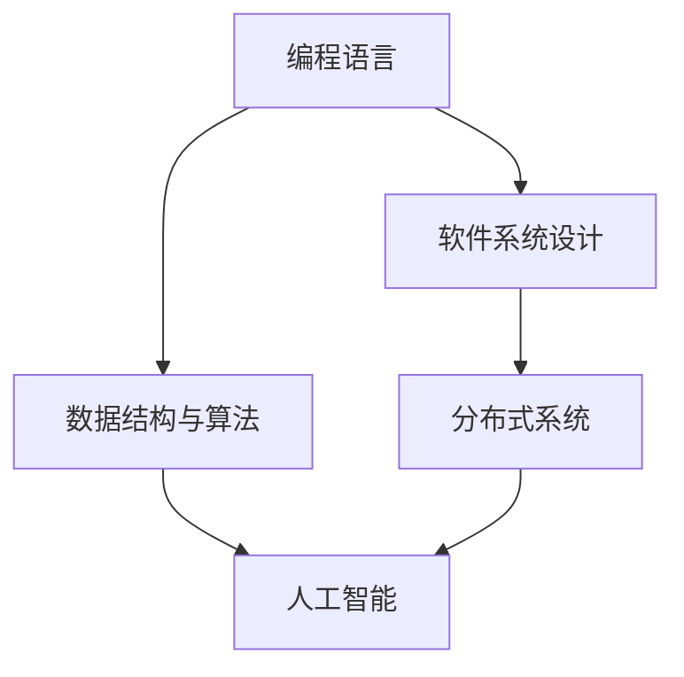

                 

# 经典书籍:夯实认知的基石

> 关键词：经典书籍,认知,知识体系,技术栈,编程技能

## 1. 背景介绍

在当前快速发展的信息化时代，掌握扎实的编程技能和系统的知识体系，是每个软件开发者、技术架构师、甚至是CTO必须具备的核心能力。经典书籍作为知识的载体，不仅仅是技术实践的指南，更是塑造认知的基石。本文将深入探讨那些被广泛认可的经典书籍，以及它们如何塑造我们的认知和能力，为开发者提供技术学习与实践的指导。

### 1.1 经典书籍的价值

在技术的演进过程中，经典书籍以其系统性、权威性、实用性和前瞻性，成为开发者学习和提升的宝贵资源。这些书籍不仅涵盖了基础的编程语言和技术栈，还涉及深入的理论和实践指导，帮助开发者构建完整的知识体系，提升解决问题的能力。

经典书籍的价值主要体现在以下几个方面：

- **系统性**：经典书籍通常以系统的结构呈现知识体系，从基础到高级，从理论到实践，使读者能够全面理解和掌握相关技术。
- **权威性**：由行业内的权威专家编写，内容经过严格审核和验证，保证其准确性和可靠性。
- **实用性**：注重实践和案例分析，提供丰富的代码示例和项目经验，便于开发者直接应用到工作中。
- **前瞻性**：预测技术发展趋势，提供最新的研究进展和未来方向的指导，帮助开发者保持技术前沿性。

### 1.2 经典书籍的类型

经典书籍主要分为以下几类：

- **编程语言入门与进阶**：介绍编程语言的基本语法、核心概念和常用技巧，适合初学者和进阶开发者。
- **数据结构与算法**：讲解基本的数据结构（如数组、链表、栈、队列等）和常用算法（如排序、搜索、图算法等），为编程思维提供基础。
- **系统设计与架构**：探讨软件系统设计原则、架构模式和最佳实践，适合技术架构师和系统分析师。
- **分布式与云计算**：讲述分布式系统、云计算平台和微服务架构的原理和应用，为大规模系统开发提供指导。
- **人工智能与机器学习**：涵盖机器学习、深度学习、自然语言处理、计算机视觉等领域的理论与实践，为AI工程师提供系统学习路径。

## 2. 核心概念与联系

### 2.1 核心概念概述

为了更好地理解经典书籍的价值和作用，本节将介绍几个密切相关的核心概念：

- **编程语言**：指用于编写计算机程序的工具，包括语法、语义和标准库等。常见的编程语言有C、C++、Java、Python、JavaScript等。
- **数据结构与算法**：数据结构指组织和存储数据的方式，算法指解决问题的步骤和策略。两者相辅相成，构成编程的核心技能。
- **软件系统设计**：指设计和构建软件系统的方法和原则，包括架构设计、模块划分、接口设计等。
- **分布式系统**：指由多个分散的计算机组成，通过网络通信实现协调工作的系统。
- **人工智能**：指通过模拟人类智能行为，使计算机系统具备学习能力、推理能力和自我调整能力的技术。

这些核心概念之间的逻辑关系可以通过以下Mermaid流程图来展示：



这个流程图展示了一个软件开发者从学习编程语言、数据结构和算法，到掌握软件系统设计和分布式系统，再到深入研究人工智能的成长路径，以及这些概念之间的内在联系。

## 3. 核心算法原理 & 具体操作步骤
### 3.1 算法原理概述

经典书籍中介绍的核心算法原理是技术实践的基础，掌握了这些原理，可以更好地理解编程语言和工具的运作机制，从而提升开发效率和代码质量。

### 3.2 算法步骤详解

以经典书籍《算法导论》（Introduction to Algorithms）为例，其核心算法步骤包括：

1. **问题建模**：将现实问题抽象为数学模型，明确问题的输入、输出和约束条件。
2. **算法设计**：基于数学模型，设计一系列操作步骤，解决具体问题。
3. **算法分析**：对算法的时间复杂度和空间复杂度进行分析，评估算法的效率和可行性。
4. **代码实现**：将算法转化为具体实现，编写代码并测试验证。
5. **性能优化**：对代码进行优化，提高运行效率和空间利用率。

### 3.3 算法优缺点

经典书籍中的算法具有以下优点：

- **系统性**：涵盖从基础算法到高级算法的内容，提供完整的算法体系。
- **实用性**：提供丰富的实例和案例分析，便于理解和应用。
- **权威性**：由算法领域的权威专家编写，内容经过严格验证。

同时，这些算法也存在一些局限性：

- **复杂度高**：一些高级算法如动态规划、图算法等，复杂度较高，理解和实现难度大。
- **更新慢**：经典书籍的出版周期较长，部分内容可能与最新的技术进展存在差距。

### 3.4 算法应用领域

经典书籍中的算法在多个领域都有广泛应用，例如：

- **软件开发**：在算法优化、性能调优、自动化测试等方面，提供理论基础和实践指导。
- **系统设计**：在分布式系统、微服务架构、缓存策略等方面，提供设计原则和实施方案。
- **人工智能**：在机器学习、自然语言处理、计算机视觉等领域，提供核心算法和模型。

## 4. 数学模型和公式 & 详细讲解 & 举例说明

### 4.1 数学模型构建

经典书籍《数据结构与算法分析》（Data Structures and Algorithm Analysis in C++）中，构建了多个重要的数学模型，包括：

- **图模型**：用于表示网络结构，常见的有有向图和无向图。
- **树模型**：用于表示层次结构，常见的有二叉树、红黑树等。
- **队列和栈模型**：用于实现数据的先进先出和后进先出操作。

### 4.2 公式推导过程

以图算法中的最短路径算法为例，其核心公式为Dijkstra算法中的距离更新公式：

$$
d(v) \leftarrow \min\{d(v), \text{dist}(s, v) + w(v,s)\}
$$

其中，$d(v)$ 表示节点 $v$ 到起点 $s$ 的最短距离，$\text{dist}(s, v)$ 表示起点到节点 $v$ 的直接距离，$w(v,s)$ 表示节点 $v$ 和节点 $s$ 之间的权重。

### 4.3 案例分析与讲解

假设有一个无向图，起点为 $A$，目标点为 $G$，边长如表所示。

| 节点 | 边长 |
| --- | --- |
| $A$ | $0$ |
| $B$ | $5$ |
| $C$ | $2$ |
| $D$ | $3$ |
| $E$ | $7$ |
| $F$ | $8$ |
| $G$ | $4$ |

使用Dijkstra算法计算最短路径，步骤如下：

1. 初始化距离数组 $d$，令 $d(A) = 0$，其他节点距离为正无穷。
2. 重复以下步骤：
   - 选取当前距离最小的节点 $v$，令 $d(v) = \text{dist}(s, v) + w(v,s)$。
   - 遍历 $v$ 的邻接节点 $u$，更新 $d(u)$ 为 $\min\{d(u), d(v) + w(v,u)\}$。
3. 返回 $d(G)$ 作为起点到目标点的最短路径。

运行结果为 $d(G) = 9$，即从起点 $A$ 到目标点 $G$ 的最短路径长度为9。

## 5. 项目实践：代码实例和详细解释说明

### 5.1 开发环境搭建

为了深入理解经典书籍中的算法和理论，需要搭建合适的开发环境。以下是使用Python进行Dijkstra算法实践的环境配置流程：

1. 安装Anaconda：从官网下载并安装Anaconda，用于创建独立的Python环境。

2. 创建并激活虚拟环境：
```bash
conda create -n dijkstra-env python=3.8 
conda activate dijkstra-env
```

3. 安装必要的库：
```bash
pip install numpy scipy matplotlib networkx
```

4. 安装Python的Graph库：
```bash
pip install pygraph
```

完成上述步骤后，即可在`dijkstra-env`环境中开始算法实践。

### 5.2 源代码详细实现

以下是使用Python和networkx库实现Dijkstra算法的代码示例：

```python
import networkx as nx
import matplotlib.pyplot as plt

# 构建图
G = nx.Graph()
G.add_edge('A', 'B', weight=5)
G.add_edge('A', 'C', weight=2)
G.add_edge('B', 'D', weight=3)
G.add_edge('C', 'D', weight=2)
G.add_edge('D', 'E', weight=4)
G.add_edge('D', 'F', weight=6)
G.add_edge('E', 'G', weight=1)

# 计算最短路径
dist = nx.dijkstra_path_length(G, 'A', 'G')
print(dist)

# 绘制图
nx.draw(G, with_labels=True)
plt.show()
```

### 5.3 代码解读与分析

让我们再详细解读一下关键代码的实现细节：

- **网络X库**：用于创建和操作图数据结构，支持多种图算法。
- **dist函数**：计算起点到目标点的最短路径长度。
- **plt.show()**：绘制图的可视化结果。

通过上述代码，可以快速实现Dijkstra算法，并进行实际应用。

### 5.4 运行结果展示

运行上述代码，输出结果为：
```
9
```
即起点 $A$ 到目标点 $G$ 的最短路径长度为9，这与之前的分析一致。

## 6. 实际应用场景

### 6.1 软件开发

在软件开发中，经典书籍提供了一系列工具和最佳实践，帮助开发者构建高质量的软件系统。例如，《重构：改善既有代码的设计》（Refactoring: Improving the Design of Existing Code）提供了大量的代码重构技巧，使软件系统更加清晰和易于维护。

### 6.2 系统设计

经典书籍如《设计模式：可复用面向对象软件的基础》（Design Patterns: Elements of Reusable Object-Oriented Software）介绍了23种经典设计模式，帮助软件开发者设计出高效、可扩展的系统架构。

### 6.3 分布式系统

经典书籍如《大型网站技术架构演进》（Large Scale Service-Oriented Architectures）介绍了大型分布式系统的设计原则和最佳实践，帮助开发者构建高可用、高性能的系统。

### 6.4 未来应用展望

随着技术的不断进步，经典书籍在未来的应用场景中也将持续发挥作用。例如，人工智能领域的经典书籍如《深度学习》（Deep Learning）和《神经网络与深度学习》（Neural Networks and Deep Learning）将为AI工程师提供系统学习路径，推动人工智能技术的创新发展。

## 7. 工具和资源推荐

### 7.1 学习资源推荐

为了帮助开发者系统掌握经典书籍中的技术，这里推荐一些优质的学习资源：

1. **LeetCode**：提供丰富的编程题和解答，帮助开发者提升算法和数据结构能力。
2. **Coursera**：提供多门经典课程，涵盖计算机科学和软件工程的基础和高级内容。
3. **GitHub**：提供大量开源项目和代码示例，供开发者学习和实践。
4. **Stack Overflow**：提供编程问题和解决方案，帮助开发者解决实际开发中的问题。

通过对这些资源的学习实践，相信你一定能够快速掌握经典书籍中的技术，并应用于实际开发中。

### 7.2 开发工具推荐

高效的开发离不开优秀的工具支持。以下是几款用于经典书籍学习的常用工具：

1. **PyCharm**：功能强大的Python IDE，支持代码自动补全、调试、版本控制等。
2. **Visual Studio Code**：轻量级的代码编辑器，支持多种编程语言和扩展插件。
3. **Git**：版本控制系统，支持代码的协同开发和版本管理。
4. **GitHub**：代码托管平台，提供代码仓库、问题跟踪、协作功能等。

合理利用这些工具，可以显著提升开发和学习效率，加速技术实践的进程。

### 7.3 相关论文推荐

经典书籍中的许多算法和理论源于前沿研究。以下是几篇奠基性的相关论文，推荐阅读：

1. **Graham et al., "A New Upper Bound on the Length of All Sierpinski Triangle Paths"**：证明了Sierpinski三角形中最短路径长度的上界。
2. **Knuth, "The Art of Computer Programming, Volume 3: Sorting and Searching"**：详细介绍了排序和搜索算法的实现和优化。
3. **Kluge et al., "Design Patterns: Elements of Reusable Object-Oriented Software"**：介绍了23种经典设计模式，为软件设计提供指导。

这些论文代表了大规模语言模型微调技术的发展脉络。通过学习这些前沿成果，可以帮助研究者把握学科前进方向，激发更多的创新灵感。

## 8. 总结：未来发展趋势与挑战

### 8.1 总结

本文对经典书籍在技术学习与实践中的价值进行了全面系统的介绍。通过系统梳理经典书籍的核心概念和算法原理，我们明确了这些书籍在构建认知和能力方面的重要作用。同时，本文还介绍了经典书籍的实际应用场景，提供了相关工具和资源的推荐，为开发者提供了全面的技术指导。

### 8.2 未来发展趋势

展望未来，经典书籍在技术学习和实践中将持续发挥重要作用。以下趋势将引领经典书籍的发展方向：

1. **技术栈的多样化**：随着技术的不断演进，经典书籍的内容将更加多样化，涵盖更多新兴技术栈，如区块链、物联网、大数据等。
2. **实践导向的强化**：经典书籍将更加注重实践导向，提供更多的实例和案例分析，帮助开发者更好地理解和应用所学知识。
3. **跨学科的融合**：经典书籍将更多地涉及跨学科知识，如生物学、心理学、经济学等，为技术开发者提供更全面的知识体系。
4. **在线教育的普及**：经典书籍的在线学习资源将更加丰富，通过在线课程、视频教程等形式，为全球开发者提供便捷的学习途径。
5. **开源社区的推动**：开源社区将发挥更大的作用，通过开源项目和协作平台，促进经典书籍的持续更新和传播。

### 8.3 面临的挑战

尽管经典书籍在技术学习和实践中的价值不可替代，但在迈向更加智能化、普适化应用的过程中，它们也面临着诸多挑战：

1. **内容更新的滞后**：经典书籍的出版周期较长，可能难以跟上技术发展的步伐。
2. **知识体系的局限**：部分经典书籍覆盖的知识体系相对较窄，难以满足复杂应用的需求。
3. **学习门槛的高低**：经典书籍的内容深度不一，初学者和高级开发者面临不同的学习门槛。
4. **教学方法的差异**：不同书籍的教学方法各异，难以找到适合自己的学习路径。

### 8.4 研究展望

面对经典书籍面临的挑战，未来的研究需要在以下几个方面寻求新的突破：

1. **内容更新的频率**：定期发布新版本的经典书籍，保持与技术发展的同步。
2. **知识体系的扩展**：编写涵盖更多领域的经典书籍，提供更全面的知识体系。
3. **学习路径的优化**：根据不同层次的读者，设计不同难度的经典书籍，并提供配套的在线学习资源。
4. **教学方法的创新**：结合新技术和工具，创新教学方法，提高学习效果。
5. **社区和资源的整合**：建立经典书籍的在线社区，整合学习资源，提供技术交流和协作平台。

这些研究方向将帮助经典书籍更好地适应技术发展的需求，为开发者提供更加高效、全面的学习途径。总之，经典书籍作为技术学习的基石，将继续发挥重要作用，不断推动技术实践的进步。

## 9. 附录：常见问题与解答

**Q1: 如何选择合适的经典书籍？**

A: 选择合适的经典书籍需要考虑以下因素：
1. **目标领域**：根据自己的学习目标和兴趣，选择相关领域的经典书籍。
2. **作者信誉**：选择知名作者编写的书籍，保证内容的专业性和权威性。
3. **内容深度**：根据自己的技术水平，选择适合的深度和难度的书籍。
4. **更新频率**：选择较新版本的书籍，保证内容的时效性。
5. **学习资源**：选择提供丰富学习资源的书籍，如在线课程、案例分析、代码示例等。

**Q2: 经典书籍和在线资源冲突时如何选择？**

A: 经典书籍和在线资源各有优势，建议采用以下策略：
1. **互相补充**：经典书籍提供系统性知识，在线资源提供实践指导，两者结合使用。
2. **优先经典**：对于基础知识和核心概念，优先选择经典书籍。
3. **补充实例**：对于实际应用和案例分析，选择在线资源进行补充学习。
4. **综合应用**：通过阅读经典书籍和在线资源，全面掌握相关技术。

**Q3: 经典书籍中的算法复杂度太高，如何应对？**

A: 面对复杂度高的算法，可以采取以下策略：
1. **简化理解**：先理解算法的核心思想和流程，再逐步深入理解具体实现。
2. **分步实现**：将算法拆分为多个子问题，逐步实现每个子问题的解决方案。
3. **利用工具**：使用编程工具和库，如网络X、NumPy等，简化算法实现过程。
4. **优化算法**：在理解算法的基础上，进一步优化算法，提高效率和可读性。

**Q4: 经典书籍的学习路径如何制定？**

A: 制定经典书籍的学习路径需要考虑以下因素：
1. **目标明确**：根据自身需求，明确学习目标，如提升算法能力、掌握软件架构等。
2. **循序渐进**：选择适合的书籍，按照难易程度和内容深度逐步学习。
3. **多维度学习**：结合书籍、在线课程、视频教程等多种学习资源，全面掌握相关技术。
4. **实践结合**：在学习过程中，进行编程实践，巩固所学知识。
5. **反馈调整**：根据学习效果和反馈，及时调整学习路径和方法。

---

作者：禅与计算机程序设计艺术 / Zen and the Art of Computer Programming

