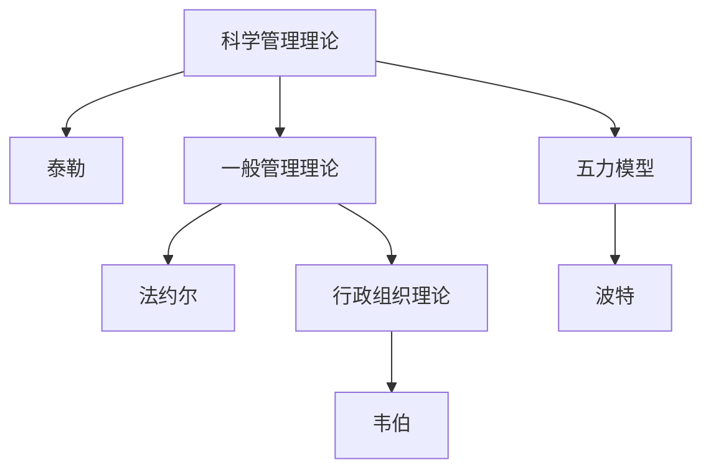

                 

# 经典管理理论的现代应用

## 1. 背景介绍

### 1.1 问题由来

现代企业的管理面临着复杂的市场环境、激烈的竞争、多元化的员工需求和快速变化的业务模式。传统的管理理论虽然在早期为企业的发展提供了有益的指导，但随着时代的发展，其局限性逐渐显现。如何结合当前的时代背景和实际情况，创新性地应用经典管理理论，成为摆在企业面前的一个重大课题。

经典管理理论主要包括泰勒的科学管理理论、法约尔的一般管理理论、韦伯的行政组织理论、波特的五力模型等。这些理论至今仍具有较高的学术价值和实践指导意义。然而，随着互联网、大数据、人工智能等技术的发展，经典管理理论也需要不断更新和完善，以适应新时代的管理需求。

### 1.2 问题核心关键点

经典管理理论的现代应用核心关键点在于：
- **理论更新**：结合现代技术和行业趋势，对经典管理理论进行创新性解读和应用。
- **技术融合**：将信息技术、数据分析、人工智能等先进技术引入管理实践中，提升管理效率和决策科学性。
- **问题导向**：聚焦企业实际管理问题，如组织架构优化、绩效考核体系、领导力发展等，提供针对性的解决方案。
- **人才建设**：培养具备现代管理思维和技能的复合型人才，满足企业对高素质管理人才的需求。

这些关键点共同构成了经典管理理论在现代应用中的核心要素，为企业在复杂多变的环境中保持竞争力和持续发展提供了重要保障。

## 2. 核心概念与联系

### 2.1 核心概念概述

为更好地理解经典管理理论的现代应用，本节将介绍几个密切相关的核心概念：

- **科学管理理论**：由泰勒提出，强调标准化作业、时间与动作研究、员工培训等，以提升生产效率和工作质量。
- **一般管理理论**：由法约尔提出，强调计划、组织、指挥、协调和控制等管理职能，以及14项管理原则，为企业提供了全面的管理框架。
- **行政组织理论**：由韦伯提出，强调理性化、官僚化管理，提出了科层制组织结构，强调权威与规则的重要性。
- **五力模型**：由波特提出，通过分析供应商议价能力、买家议价能力、替代品威胁、新进入者威胁、现有竞争者的竞争强度，帮助企业进行战略规划和市场分析。

这些核心概念之间的逻辑关系可以通过以下Mermaid流程图来展示：



这个流程图展示了几大经典管理理论的核心概念及其之间的关系：

1. 科学管理理论由泰勒提出，着重于生产效率的提升。
2. 一般管理理论由法约尔提出，强调全面的管理职能和管理原则。
3. 行政组织理论由韦伯提出，强调理性化管理和科层制组织结构。
4. 五力模型由波特提出，用于市场分析和战略规划。

这些理论相互补充，共同构成了经典管理理论的框架，为企业提供了系统的管理指导。

## 3. 核心算法原理 & 具体操作步骤

### 3.1 算法原理概述

经典管理理论的现代应用，其核心算法原理主要包括以下几个方面：

- **数据驱动**：结合现代信息技术，利用大数据、云计算、人工智能等技术，收集和分析海量数据，为企业决策提供科学依据。
- **智能决策**：应用先进的算法模型，如机器学习、深度学习等，对企业运营数据进行建模和分析，提升决策的智能化水平。
- **持续优化**：通过不断迭代优化算法模型，以及实时监控和调整管理策略，实现企业的持续改进和创新。
- **系统集成**：将经典管理理论与现代技术手段进行整合，构建集成化的管理平台，提升企业管理的效率和效果。

这些算法原理共同构成了经典管理理论在现代应用中的基本框架，为企业提供了有效的技术支持和管理工具。

### 3.2 算法步骤详解

基于经典管理理论的现代应用主要包括以下几个关键步骤：

**Step 1: 数据收集与清洗**

1. 利用大数据技术，从企业运营的各个环节（如生产、销售、客户服务、财务等）收集海量数据。
2. 对数据进行预处理，包括数据去重、格式统一、异常值处理等，确保数据的准确性和一致性。

**Step 2: 数据分析与建模**

1. 对清洗后的数据进行探索性分析，如描述性统计、相关性分析等，理解数据的特征和趋势。
2. 应用机器学习和深度学习算法，构建预测模型，如回归模型、分类模型、聚类模型等，对企业运营情况进行预测和分析。
3. 应用数据可视化技术，将分析结果以图表形式呈现，方便企业领导和员工理解和管理。

**Step 3: 策略制定与执行**

1. 结合数据分析结果，制定具体的管理策略，如优化生产流程、改进销售策略、提升客户服务质量等。
2. 在企业内部推广实施这些策略，通过信息化手段进行执行，确保策略落地。
3. 定期评估策略效果，根据实际情况进行调整和优化，实现持续改进。

**Step 4: 绩效评估与反馈**

1. 应用KPI（关键绩效指标）等工具，对企业运营情况进行评估和监控，如生产效率、客户满意度、员工满意度等。
2. 根据评估结果，进行绩效反馈，及时发现问题并进行整改。
3. 建立绩效改进机制，持续优化企业运营管理。

### 3.3 算法优缺点

经典管理理论的现代应用具有以下优点：
1. **科学决策**：利用数据分析和建模技术，提升决策的科学性和准确性，减少人为错误。
2. **效率提升**：通过数据驱动和智能决策，优化管理流程，提升企业的运营效率。
3. **灵活应对**：结合现代技术手段，实时监控和调整管理策略，增强企业对市场变化的适应能力。

同时，该方法也存在一些局限性：
1. **数据依赖**：数据质量和数据的全面性直接影响分析结果和决策的准确性。
2. **技术门槛**：数据处理和模型构建需要一定的技术基础，对企业技术团队的要求较高。
3. **人机协作**：机器学习模型和算法无法完全替代人工决策，需要结合人工经验和判断。

尽管存在这些局限性，经典管理理论的现代应用在企业管理的实践中仍然具有重要的意义和价值。

### 3.4 算法应用领域

经典管理理论的现代应用已经广泛应用于多个领域，包括但不限于：

- **生产管理**：通过大数据和智能算法优化生产流程，提升生产效率和质量。
- **市场营销**：利用数据分析和机器学习模型，优化营销策略，提升市场竞争力。
- **人力资源管理**：应用人工智能技术进行人才招聘、培训、绩效评估等，提升人力资源管理水平。
- **财务管理**：利用数据分析和模型预测，进行财务风险管理、成本控制等，提升财务决策的科学性。
- **客户服务**：通过智能客服和客户行为分析，提升客户体验和服务满意度。

## 4. 数学模型和公式 & 详细讲解 & 举例说明

### 4.1 数学模型构建

本节将使用数学语言对经典管理理论的现代应用进行更加严格的刻画。

假设企业运营数据为 $D=\{x_1, x_2, ..., x_n\}$，其中 $x_i$ 表示第 $i$ 个运营指标的观测值。设 $y_i$ 为第 $i$ 个指标的理想值，即企业期望达到的目标状态。我们的目标是构建一个数学模型，将 $D$ 映射到 $y$，即 $f(D) \approx y$。

### 4.2 公式推导过程

以生产管理中的生产效率预测为例，我们可以构建如下的线性回归模型：

$$
y_i = \beta_0 + \beta_1 x_{i1} + \beta_2 x_{i2} + ... + \beta_k x_{ik} + \epsilon_i
$$

其中 $y_i$ 为第 $i$ 个产品的生产效率，$\beta_0$ 为截距项，$\beta_1, \beta_2, ..., \beta_k$ 为各个自变量的系数，$x_{i1}, x_{i2}, ..., x_{ik}$ 为第 $i$ 个产品的各个生产指标，$\epsilon_i$ 为随机误差项。

对上式进行最小二乘法求解，得到：

$$
\hat{\beta} = (X^T X)^{-1} X^T y
$$

其中 $X$ 为自变量矩阵，$y$ 为因变量向量，$\hat{\beta}$ 为求解得到的回归系数向量。

### 4.3 案例分析与讲解

以某制造业企业的生产效率预测为例，利用上文构建的线性回归模型进行案例分析：

1. **数据收集**：收集企业近一年的生产数据，包括工时、设备故障率、原材料质量、工人技能等级等。
2. **模型建立**：利用历史数据建立线性回归模型，求解回归系数 $\hat{\beta}$。
3. **模型验证**：利用最近三个月的生产数据进行模型验证，计算预测值与实际值之间的均方误差。
4. **应用决策**：根据预测结果，优化生产流程，提高生产效率。

通过上述案例分析，可以看到经典管理理论在现代应用中的具体实践过程，以及如何通过数据驱动和科学建模提升管理决策的科学性和精确性。

## 5. 项目实践：代码实例和详细解释说明

### 5.1 开发环境搭建

在进行经典管理理论的现代应用开发前，我们需要准备好开发环境。以下是使用Python进行数据分析和模型构建的环境配置流程：

1. 安装Anaconda：从官网下载并安装Anaconda，用于创建独立的Python环境。

2. 创建并激活虚拟环境：
```bash
conda create -n data-env python=3.8 
conda activate data-env
```

3. 安装必要的Python包：
```bash
pip install numpy pandas scikit-learn matplotlib seaborn statsmodels
```

完成上述步骤后，即可在`data-env`环境中进行数据处理和模型构建。

### 5.2 源代码详细实现

下面我们以生产管理中的生产效率预测为例，给出使用Python进行线性回归模型的实现代码。

首先，定义数据集和目标变量：

```python
import pandas as pd
import numpy as np

# 读取数据集
data = pd.read_csv('production_data.csv')

# 定义目标变量和自变量
target = 'production_efficiency'
features = ['working_hours', 'machine_utilization', 'material_quality', 'worker_skill']
```

然后，构建模型并进行训练：

```python
from sklearn.linear_model import LinearRegression
from sklearn.metrics import mean_squared_error

# 将数据集分为训练集和测试集
train_data = data[:80]
test_data = data[80:]

# 构建线性回归模型
model = LinearRegression()

# 训练模型
model.fit(train_data[features], train_data[target])

# 在测试集上进行预测
predictions = model.predict(test_data[features])
```

最后，评估模型并进行决策：

```python
# 计算均方误差
mse = mean_squared_error(test_data[target], predictions)
print(f"Mean Squared Error: {mse:.2f}")

# 应用决策
optimize_production_efficiency(model)
```

### 5.3 代码解读与分析

让我们再详细解读一下关键代码的实现细节：

**线性回归模型**：
- 使用Scikit-learn库中的`LinearRegression`类，构建线性回归模型。
- 通过`fit`方法训练模型，使用训练集的特征和目标变量进行模型拟合。
- 通过`predict`方法对测试集进行预测，得到生产效率的预测值。

**均方误差评估**：
- 使用Scikit-learn库中的`mean_squared_error`函数，计算预测值与真实值之间的均方误差。
- 均方误差越小，说明模型的预测精度越高。

**决策优化**：
- 根据预测结果，对生产流程进行优化，如调整工时分配、提高设备利用率、改进原材料质量、提升工人技能等。
- 定期重复上述过程，实现持续改进。

可以看到，利用Python进行经典管理理论的现代应用，可以高效地实现数据处理、模型构建和决策优化，大大提高了管理决策的科学性和效率。

## 6. 实际应用场景

### 6.1 智能制造

经典管理理论的现代应用在智能制造领域具有重要价值。通过数据分析和智能算法，可以实现生产流程的优化和智能化管理，提升生产效率和质量。

具体而言，可以收集和分析生产过程中的各种数据，如设备状态、工人行为、原材料消耗等，构建生产效率预测模型，实时监控和优化生产流程。例如，通过预测设备故障率，提前进行设备维护，避免生产中断；通过优化生产排程，提高设备利用率；通过分析工人操作数据，提升生产技能和劳动效率。

### 6.2 供应链管理

经典管理理论在供应链管理中的应用，可以提升供应链的透明度、效率和响应能力，优化库存管理和物流调度。

例如，可以利用数据分析模型对供应链数据进行实时监控和分析，如供应商绩效、库存水平、物流成本等。通过预测供应商的交货时间、库存水平的变化趋势，优化采购计划和库存管理，减少库存成本和缺货风险。同时，通过实时调度算法，优化物流路线和运输方式，提高物流效率。

### 6.3 客户关系管理

经典管理理论在客户关系管理中的应用，可以提升客户满意度、忠诚度和市场份额，提升企业的市场竞争力。

例如，可以通过数据分析模型对客户行为和反馈进行预测和分析，如购买行为、客户流失率、客户满意度等。通过预测客户流失风险，及时采取措施进行客户挽留，提升客户忠诚度。同时，通过个性化营销策略，提升客户满意度和品牌认知度。

### 6.4 未来应用展望

随着数据技术和人工智能的不断进步，经典管理理论的现代应用也将不断拓展，为企业的管理实践带来更多创新和突破。

在智能制造领域，结合物联网、人工智能等技术，可以实现更智能、更灵活的生产管理。例如，通过智能传感器采集实时数据，进行实时监控和优化，提升生产效率和质量。

在供应链管理领域，通过区块链技术，可以实现供应链各环节的数据透明和可追溯性，提升供应链的信任度和透明度。

在客户关系管理领域，通过人工智能和大数据分析，可以实现更精准的客户画像和个性化营销，提升客户满意度和市场竞争力。

## 7. 工具和资源推荐

### 7.1 学习资源推荐

为了帮助开发者系统掌握经典管理理论的现代应用，这里推荐一些优质的学习资源：

1. 《管理学原理》系列书籍：由著名管理学家撰写的管理学经典教材，涵盖管理的各个方面，包括经典管理理论的现代应用。

2. 《数据驱动的管理决策》课程：由知名大学开设的在线课程，系统讲解数据分析和决策支持系统在管理中的应用。

3. 《人工智能与企业战略》书籍：探讨人工智能技术在企业管理中的应用，包括智能制造、供应链管理、客户关系管理等。

4. 《数据分析与商业智能》书籍：介绍数据分析和商业智能在企业决策中的应用，帮助管理者利用数据驱动决策。

5. 《Python数据分析与统计》书籍：全面介绍Python在数据分析和统计中的应用，包括数据处理、数据可视化、机器学习等。

通过对这些资源的学习实践，相信你一定能够快速掌握经典管理理论在现代应用中的精髓，并用于解决实际的业务问题。

### 7.2 开发工具推荐

高效的开发离不开优秀的工具支持。以下是几款用于经典管理理论现代应用开发的常用工具：

1. Jupyter Notebook：一个基于Web的交互式笔记本环境，方便进行数据分析和模型构建。

2. PyTorch：基于Python的开源深度学习框架，适合快速迭代研究。

3. Scikit-learn：基于Python的数据挖掘和机器学习库，提供了大量的算法和工具，适用于数据处理和模型构建。

4. Tableau：一款流行的数据可视化工具，可以将数据分析结果以图表形式呈现，方便企业领导和员工理解和管理。

5. Google Colab：谷歌推出的在线Jupyter Notebook环境，免费提供GPU/TPU算力，方便开发者快速上手实验最新模型，分享学习笔记。

合理利用这些工具，可以显著提升经典管理理论现代应用的开发效率，加快创新迭代的步伐。

### 7.3 相关论文推荐

经典管理理论的现代应用源于学界的持续研究。以下是几篇奠基性的相关论文，推荐阅读：

1. "The Science of Management" by Frederick Winslow Taylor：泰勒的科学管理理论奠定了现代管理学的基础。

2. "The Principles of Management" by Henri Fayol：法约尔的一般管理理论为企业提供了全面的管理框架。

3. "The Theory of the Ideal Organization" by Max Weber：韦伯的行政组织理论提出了科层制组织结构。

4. "Competitive Strategy: Techniques for Analyzing Industries and Competitors" by Michael Porter：波特的五力模型提供了市场分析的框架。

这些论文代表了大管理理论的发展脉络。通过学习这些前沿成果，可以帮助研究者把握学科前进方向，激发更多的创新灵感。

## 8. 总结：未来发展趋势与挑战

### 8.1 总结

本文对经典管理理论的现代应用进行了全面系统的介绍。首先阐述了经典管理理论的研究背景和意义，明确了在现代技术背景下对经典管理理论进行创新性解读和应用的重要性。其次，从原理到实践，详细讲解了经典管理理论在现代应用中的数学模型和算法步骤，给出了具体案例的实现过程。同时，本文还广泛探讨了经典管理理论在智能制造、供应链管理、客户关系管理等多个领域的应用前景，展示了其广阔的实践价值。此外，本文精选了经典管理理论现代应用的学习资源，力求为读者提供全方位的技术指引。

通过本文的系统梳理，可以看到，经典管理理论在现代应用中的核心要素和基本框架，为企业在复杂多变的环境中保持竞争力和持续发展提供了重要保障。经典管理理论的现代应用，正成为企业管理中不可或缺的一部分，将继续为企业的创新和进步贡献力量。

### 8.2 未来发展趋势

展望未来，经典管理理论的现代应用将呈现以下几个发展趋势：

1. **技术与理论融合**：经典管理理论与现代信息技术（如大数据、人工智能）的深度融合，将使管理决策更加科学和高效。
2. **跨学科发展**：经典管理理论将与更多学科（如工程学、经济学、心理学等）相结合，形成跨学科的管理研究范式。
3. **个性化管理**：结合人工智能技术，实现对员工和客户的行为进行深入分析，提供个性化的管理方案和策略。
4. **全球化管理**：经典管理理论在跨国企业和全球化管理中的应用，将提升企业的国际竞争力。
5. **可持续发展**：经典管理理论在可持续发展领域的应用，如绿色制造、节能减排、环境保护等，将为企业提供新的发展方向。

这些趋势凸显了经典管理理论在现代应用中的重要性和时代价值，为企业在全球化竞争中保持领先地位提供了新的思路和方法。

### 8.3 面临的挑战

尽管经典管理理论在现代应用中取得了显著成效，但在迈向更加智能化、普适化应用的过程中，仍面临诸多挑战：

1. **数据隐私与安全**：在数据驱动的管理中，如何保障数据的隐私和安全，防止数据泄露和滥用，是一个重要的课题。
2. **模型复杂性**：经典管理理论的现代应用需要构建复杂的算法模型，如何在保证模型精度的同时，提高模型的可解释性和可操作性，是一个重要的研究方向。
3. **技术实施成本**：现代技术的应用需要高成本的硬件设备和软件工具，如何降低技术实施成本，提升企业的技术投入产出比，是一个重要的实际问题。
4. **人才缺口**：现代管理技术的实施需要具备技术背景和业务知识的双重人才，如何培养和吸引这样的复合型人才，是一个重要的挑战。
5. **管理变革阻力**：企业在应用现代管理技术时，可能面临传统管理文化和流程的阻力，如何推进管理变革，实现技术与管理的深度融合，是一个重要的课题。

这些挑战凸显了经典管理理论在现代应用中的复杂性和复杂性。企业需要在技术、组织、人才、文化等多个层面进行综合考虑，才能顺利推进经典管理理论的现代应用。

### 8.4 研究展望

面对经典管理理论现代应用所面临的种种挑战，未来的研究需要在以下几个方面寻求新的突破：

1. **数据治理**：建立健全的数据治理机制，保障数据的隐私和安全，提升数据的质量和可用性。
2. **模型简化**：简化算法模型，提高模型的可解释性和可操作性，降低技术实施的门槛。
3. **低成本技术**：开发低成本、高效能的技术解决方案，降低技术实施成本，提升企业的技术投入产出比。
4. **复合型人才培养**：培养具备技术背景和业务知识的双重人才，提升企业的技术实力和创新能力。
5. **文化变革**：推进企业的文化变革，营造开放、包容、创新的企业文化，促进技术与管理的深度融合。

这些研究方向的探索，必将引领经典管理理论的现代应用迈向更高的台阶，为企业在复杂多变的环境中保持竞争力和持续发展提供新的动力。

## 9. 附录：常见问题与解答

**Q1：经典管理理论的现代应用是否适用于所有企业？**

A: 经典管理理论的现代应用适用于大多数企业，但具体应用的效果和范围需要根据企业的实际情况进行评估和优化。例如，对于数据基础较弱、技术实施难度大的企业，可以先从小范围试点开始，逐步推广应用。

**Q2：如何选择经典管理理论的现代应用工具？**

A: 选择经典管理理论的现代应用工具需要考虑企业的数据规模、技术实力、业务需求等多个因素。一般建议选择经过实战检验、易于上手、功能全面的工具，如Python、Scikit-learn、Tableau等。

**Q3：经典管理理论的现代应用是否需要重新学习？**

A: 经典管理理论的现代应用需要结合现代技术手段进行创新，因此需要掌握一些新的技术和工具。但经典管理理论的核心思想和方法仍然是企业管理的基石，需要与现代技术手段相结合，才能发挥最大的管理效用。

**Q4：经典管理理论的现代应用是否需要持续更新？**

A: 经典管理理论的现代应用需要结合最新的行业趋势和技术发展进行持续更新和优化。例如，随着数据技术和人工智能的发展，经典管理理论的现代应用也需要不断引入新的算法模型和方法，以保持其科学性和先进性。

**Q5：经典管理理论的现代应用是否需要跨部门合作？**

A: 经典管理理论的现代应用需要跨部门合作，形成合力。例如，数据分析部门需要与生产部门、人力资源部门、销售部门等紧密合作，共同推进管理优化和决策支持。

通过本文的系统梳理，可以看到经典管理理论在现代应用中的核心要素和基本框架，为企业在复杂多变的环境中保持竞争力和持续发展提供了重要保障。经典管理理论的现代应用，正成为企业管理中不可或缺的一部分，将继续为企业的创新和进步贡献力量。

---

作者：禅与计算机程序设计艺术 / Zen and the Art of Computer Programming

