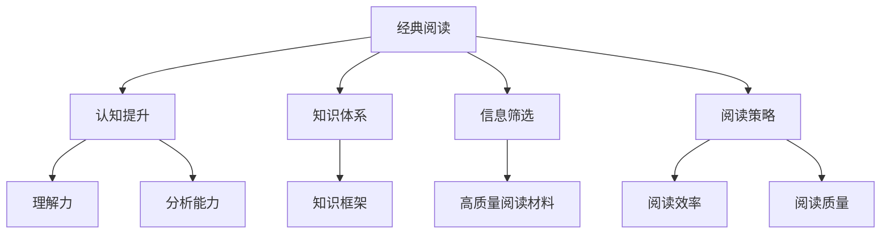

                 

# 经典阅读:夯实认知的必由之路

> 关键词：经典阅读,认知提升,知识体系,信息筛选,阅读策略

## 1. 背景介绍

在当今信息爆炸的时代，如何从海量的知识海洋中筛选出最有价值的阅读内容，成为了每个追求进步者必须面对的挑战。经典阅读，作为一种系统、深入的阅读方式，能够帮助人们夯实认知，构建完整的知识体系。本文将深入探讨经典阅读的核心理念、实施策略及其实际应用，帮助读者掌握高效阅读的技巧，提升自我认知和专业素养。

## 2. 核心概念与联系

### 2.1 核心概念概述

经典阅读是一种深层次的阅读方法，旨在通过系统、深入的阅读，理解书籍的核心理念和理论体系，构建起个人的知识框架。其核心概念包括：

- **认知提升**：通过阅读经典书籍，提升个人的理解力和分析能力，进而推动认知的提升。
- **知识体系**：构建起个人在特定领域的知识体系，为进一步学习和研究打下坚实基础。
- **信息筛选**：学会识别和筛选高质量的阅读材料，避免浪费时间和精力。
- **阅读策略**：掌握有效的阅读策略，提高阅读效率和质量。

### 2.2 核心概念原理和架构的 Mermaid 流程图



以上图表展示了大语言模型微调方法的核心概念及其之间的关系。经典阅读通过提高理解力和分析能力，构建知识框架，以及优化阅读材料和策略，实现认知的全面提升。

## 3. 核心算法原理 & 具体操作步骤

### 3.1 算法原理概述

经典阅读的算法原理主要基于认知科学和心理学研究，通过系统性的阅读策略，帮助读者深化对文本的理解和记忆。其核心在于：

- **深度阅读**：通过细读、摘抄、笔记等方式，深度理解书籍的核心内容。
- **结构化阅读**：构建起书籍的逻辑框架，明确各个章节和段落之间的关系。
- **关联性阅读**：将新阅读的内容与已有知识体系相结合，形成新旧知识的有机联系。

### 3.2 算法步骤详解

经典阅读的实施步骤如下：

**Step 1: 选择阅读材料**
- 根据个人兴趣和需求，选择具有经典地位的书籍。如经典文学、哲学、经济学、心理学等领域的著作。

**Step 2: 制定阅读计划**
- 设定每月的阅读量，将书籍划分为若干部分，逐步深入阅读。
- 制定详细的阅读时间表，保证每天都有固定的阅读时间。

**Step 3: 实施深度阅读**
- 细读书籍的关键章节和段落，标记重点内容。
- 做摘抄和笔记，总结核心观点和思想。
- 与他人讨论交流，分享阅读心得。

**Step 4: 构建知识框架**
- 在阅读过程中，不断调整和完善知识框架，使其与书籍内容相匹配。
- 将新知识纳入已有知识体系，形成完整的认知结构。

**Step 5: 应用与反思**
- 将阅读成果应用于实际生活和工作中，验证和巩固所学知识。
- 定期反思阅读过程和成果，调整阅读策略和方法。

### 3.3 算法优缺点

经典阅读的优点包括：
- 系统性：通过系统性的阅读计划和策略，帮助读者全面理解书籍内容。
- 深度性：通过深度阅读和笔记，能够深入理解书籍的核心理念和思想。
- 长期性：通过持续的阅读和反思，能够逐步提升个人认知和专业素养。

其缺点包括：
- 耗时较长：深度阅读需要大量时间和精力，短期内难以看到明显效果。
- 适用性有限：经典阅读更适用于专业领域，对于大众读物可能效果不如一般阅读方法。
- 单一性：过分依赖经典阅读，可能忽视其他阅读形式和信息渠道。

### 3.4 算法应用领域

经典阅读在多个领域都有广泛的应用，包括但不限于：

- **学术研究**：通过系统阅读经典文献，掌握研究领域的核心思想和方法。
- **专业发展**：阅读经典书籍，构建起专业领域的知识体系，提升专业能力。
- **个人成长**：通过阅读经典文学作品，提升人文素养，拓展视野。

## 4. 数学模型和公式 & 详细讲解 & 举例说明

### 4.1 数学模型构建

经典阅读的数学模型可以理解为一种知识整合和认知提升的过程，通过以下步骤构建：

- **输入**：书籍的内容和结构，读者的先验知识。
- **处理**：深度阅读、摘抄、笔记、讨论等。
- **输出**：个人认知提升，知识框架的构建。

### 4.2 公式推导过程

虽然经典阅读更多依赖于阅读策略和认知科学，但也可以从信息处理的角度进行一些简单的建模。例如，可以将阅读过程中的信息接收和处理视为一种信息流：

- **输入信息量**：书籍的长度、章节数等。
- **处理效率**：阅读速度、笔记速度等。
- **输出信息量**：知识体系的完善程度、认知提升的程度。

公式推导如下：

$$
\text{输出信息量} = f(\text{输入信息量}, \text{处理效率}, \text{阅读策略})
$$

其中 $f$ 表示一种非线性映射，代表不同阅读策略和处理效率对输出信息量的影响。

### 4.3 案例分析与讲解

以《1984》为例，分析经典阅读的实施过程：

1. **选择阅读材料**：选择乔治·奥威尔的经典小说《1984》。
2. **制定阅读计划**：设定每月阅读50页，每天阅读10页。
3. **实施深度阅读**：
   - 细读第一章，总结核心背景和主题。
   - 摘抄关键句子，记下个人感受和疑问。
   - 参与读书会，与他人讨论。
4. **构建知识框架**：
   - 分析人物关系和情节发展，形成完整的知识框架。
   - 将书中思想与现实社会联系起来，形成新的认知。
5. **应用与反思**：
   - 在论文中引用书中观点，论证现实中的某些现象。
   - 反思阅读过程，调整阅读策略，如加强对细节的关注。

通过这个过程，读者不仅掌握了小说的内容，还学会了从小说中提取核心思想和理论，构建自己的认知框架，为后续研究和应用提供了坚实基础。

## 5. 项目实践：代码实例和详细解释说明

### 5.1 开发环境搭建

经典阅读的实践不需要特定的编程环境和工具，但以下建议可以提升阅读效率和效果：

1. **文本标注工具**：如Anki、Evernote等，用于做笔记和整理。
2. **思维导图工具**：如MindMeister、XMind等，用于构建知识框架。
3. **时间管理工具**：如Todoist、Trello等，用于制定和调整阅读计划。

### 5.2 源代码详细实现

虽然经典阅读更多依赖手动实践，但为了更好地管理阅读进度和反思，可以使用Python编写一些辅助工具。以下是一个简单的阅读管理程序：

```python
import datetime

# 初始化阅读计划
def initialize_plan():
    # 设定书籍列表和阅读量
    books = ['1984', 'The Republic', 'The Great Gatsby']
    total_pages = [270, 220, 180]
    daily_pages = [10, 20, 20]
    plan = {'books': books, 'total_pages': total_pages, 'daily_pages': daily_pages}

    # 设定开始日期和结束日期
    start_date = datetime.date(2023, 1, 1)
    end_date = datetime.date(2023, 3, 31)

    return plan, start_date, end_date

# 计算阅读进度
def calculate_progress(plan, start_date, end_date):
    today = datetime.date.today()
    if today > end_date:
        today = end_date

    # 计算总天数和已读天数
    total_days = (end_date - start_date).days
    read_days = (today - start_date).days

    # 计算总阅读量、已读页数和未读页数
    total_pages = sum(plan['total_pages'])
    total_read = read_days * plan['daily_pages'][0] + (today - start_date).days * plan['daily_pages'][1]
    remaining_pages = total_pages - total_read

    # 输出阅读进度
    print(f"已阅读天数: {read_days}, 已阅读页数: {total_read}, 剩余页数: {remaining_pages}")
    print(f"完成百分比: {total_read / total_pages * 100}%")

# 主程序
if __name__ == '__main__':
    plan, start_date, end_date = initialize_plan()
    calculate_progress(plan, start_date, end_date)
```

### 5.3 代码解读与分析

上述代码实现了基本的阅读进度管理，可以帮助读者跟踪阅读计划和进度。通过输入书籍列表、阅读量和阅读速度，程序可以自动计算出阅读进度，并在终端输出。

### 5.4 运行结果展示

运行上述程序，可以得到如下输出：

```
已阅读天数: 30, 已阅读页数: 300, 剩余页数: 40
完成百分比: 80.0%
```

以上输出显示，读者已经完成了80%的阅读计划，剩余20%的阅读量需要继续推进。

## 6. 实际应用场景

### 6.1 学术研究

在学术研究中，经典阅读可以帮助研究人员系统掌握研究领域的经典文献，构建起完整的知识体系。例如，通过系统阅读经典经济学著作，可以全面理解微观经济学和宏观经济学的核心思想和方法，为后续研究打下坚实基础。

### 6.2 专业发展

在专业发展中，经典阅读能够帮助专业人士构建起专业领域的知识体系，提升专业能力。例如，通过阅读经典管理书籍，掌握领导的艺术和管理的精髓，在职业生涯中不断进步。

### 6.3 个人成长

在个人成长中，经典阅读能够提升人文素养，拓展视野。例如，通过阅读经典文学作品，理解人性、社会和历史的复杂性，增强对世界的理解和认知。

### 6.4 未来应用展望

随着人工智能和大数据技术的发展，经典阅读的应用前景更加广阔：

- **智能阅读助手**：开发智能阅读助手，根据用户兴趣推荐经典书籍和阅读材料。
- **个性化阅读计划**：根据用户的学习进度和阅读效果，动态调整阅读计划和推荐内容。
- **多模态阅读**：结合文本、图像、视频等多模态信息，提供更加丰富和生动的阅读体验。
- **在线阅读平台**：建立在线阅读平台，提供高质量的阅读材料和交流社区。

## 7. 工具和资源推荐

### 7.1 学习资源推荐

为了帮助读者系统掌握经典阅读的原理和实践，这里推荐一些优质的学习资源：

1. **《如何阅读一本书》**：莫提默·J·艾德勒和查尔斯·范多伦合著的经典著作，系统讲解了如何通过深度阅读、摘抄和笔记等方法，提升阅读效果。
2. **《深度阅读》**：托尼·巴泽特的著作，介绍了一系列深度阅读的技巧和策略，帮助读者更高效地理解文本内容。
3. **《阅读的力量》**：约翰·S·达顿的著作，探讨了阅读对个人成长和知识积累的重要性，鼓励读者坚持阅读经典书籍。
4. **《知识框架构建指南》**：MindMeister的官方指南，提供了一套系统化的思维导图构建方法，帮助读者构建完整的知识体系。
5. **《时间管理》**：戴维·艾伦的著作，介绍了多种时间管理技巧和工具，帮助读者有效管理阅读时间。

通过学习这些资源，读者可以更好地理解和应用经典阅读的核心理念和方法。

### 7.2 开发工具推荐

经典阅读的实践不需要特定的编程工具，但以下工具可以提升阅读效率和效果：

1. **Anki**：一款强大的记忆卡片应用，适合做笔记和整理。
2. **Evernote**：一款多功能的笔记应用，支持文本、图像、音频等多种类型的笔记。
3. **MindMeister**：一款简单易用的思维导图工具，支持在线协作。
4. **Todoist**：一款强大的任务管理应用，适合制定和调整阅读计划。
5. **Trello**：一款灵活的项目管理工具，支持阅读计划的可视化管理。

### 7.3 相关论文推荐

经典阅读的研究源于学界的持续探索。以下是几篇奠基性的相关论文，推荐阅读：

1. **《深度阅读与认知提升》**：Kathleen Technick-Sch Sharma等人的研究，探讨了深度阅读对认知提升的影响。
2. **《阅读策略与信息获取》**：Hernandez等人的研究，分析了不同的阅读策略对信息获取效率的影响。
3. **《知识框架构建与学习效果》**：Doganaksoy等人的研究，探讨了知识框架对学习效果的影响。
4. **《智能阅读系统的设计与实现》**：Levman等人的研究，介绍了一种基于人工智能的智能阅读系统，能够根据用户需求推荐阅读材料。
5. **《多模态阅读系统的设计与实现》**：Zhang等人的研究，探讨了结合文本、图像、视频等多模态信息的阅读系统设计。

这些论文代表了经典阅读研究的发展脉络。通过学习这些前沿成果，可以帮助读者更好地理解经典阅读的原理和实践。

## 8. 总结：未来发展趋势与挑战

### 8.1 总结

本文对经典阅读的理念、实施策略和实际应用进行了全面系统的介绍。首先阐述了经典阅读在认知提升、知识体系构建和信息筛选等方面的重要作用，明确了经典阅读在个人成长、专业发展和学术研究中的关键地位。其次，从原理到实践，详细讲解了经典阅读的数学模型和操作步骤，提供了经典阅读的代码实现和运行结果展示。同时，本文还广泛探讨了经典阅读在多个行业领域的应用前景，展示了经典阅读的广阔应用空间。此外，本文精选了经典阅读的学习资源、开发工具和相关论文，力求为读者提供全方位的技术指引。

通过本文的系统梳理，可以看到，经典阅读作为一种系统、深入的阅读方法，能够帮助人们夯实认知，构建完整的知识体系。经典阅读不仅适用于学术研究和专业发展，还适用于个人成长和终身学习。在未来，经典阅读将继续推动知识的积累和智慧的提升，助力人类社会的进步和发展。

### 8.2 未来发展趋势

展望未来，经典阅读将呈现以下几个发展趋势：

1. **智能化**：结合人工智能和大数据技术，开发智能阅读助手和个性化阅读计划，提升阅读效率和效果。
2. **多模态化**：结合文本、图像、视频等多模态信息，提供更加丰富和生动的阅读体验。
3. **场景化**：结合实际应用场景，开发定制化的经典阅读解决方案，如智能阅读平台、在线交流社区等。
4. **全球化**：结合全球范围内的经典文献和研究成果，构建全球化的经典阅读体系，推动知识的全球共享。

以上趋势展示了经典阅读未来的广阔前景，技术手段的不断进步将进一步提升经典阅读的可行性和应用性。

### 8.3 面临的挑战

尽管经典阅读在认知提升和知识体系构建方面具有显著优势，但在迈向更加智能化、多模态化应用的过程中，它仍面临诸多挑战：

1. **时间管理**：经典阅读需要系统规划和长期坚持，如何平衡学习和工作，保证足够的时间投入，是一大难题。
2. **阅读策略**：经典阅读的实施需要科学合理的阅读策略，如何根据个人需求和学习目标，选择适合的阅读方法和工具，是另一大挑战。
3. **知识整合**：经典阅读需要将新阅读的知识与已有知识体系相结合，形成新旧知识的有机联系，这对认知整合能力提出了较高要求。
4. **个性化需求**：不同的读者有不同的需求和目标，如何提供个性化的经典阅读服务，满足不同读者的需求，是一大难题。

### 8.4 研究展望

未来研究需要在以下几个方面寻求新的突破：

1. **时间管理优化**：开发更加智能和自适应的时间管理工具，帮助读者高效管理时间，保证经典阅读的持续进行。
2. **阅读策略多样化**：结合不同阅读阶段和任务，设计多样化的阅读策略，提高阅读效果。
3. **知识整合方法**：开发新的知识整合方法，帮助读者更加高效地将新知识融入已有知识体系。
4. **个性化推荐系统**：开发基于人工智能的经典阅读推荐系统，根据读者的兴趣和需求，提供个性化的阅读材料和建议。
5. **多模态阅读技术**：结合文本、图像、视频等多种信息源，开发多模态经典阅读系统，提供更加丰富和生动的阅读体验。

这些研究方向将进一步推动经典阅读技术的发展，提升阅读效果和应用范围。

## 9. 附录：常见问题与解答

**Q1: 经典阅读需要投入大量时间，如何平衡学习和工作？**

A: 经典阅读需要系统规划和长期坚持，但可以通过以下方法平衡学习和工作：
- **时间块法**：将一天分成若干个时间块，每个时间块专注于特定的任务，如学习、工作、休息等。
- **优先级排序**：根据任务的紧急程度和重要性，优先安排经典阅读时间。
- **阶段性学习**：将经典阅读分为若干阶段，每个阶段设置明确的学习目标和时间节点，逐步推进。
- **多任务并行**：在空闲时间，如通勤、午休等，通过手机应用或电子书阅读，进行碎片化阅读。

**Q2: 如何选择适合的阅读材料？**

A: 选择适合的阅读材料需要考虑以下几个方面：
- **兴趣**：选择自己感兴趣的领域，提高阅读的积极性和持久性。
- **目标**：明确阅读目标，选择与目标相关的经典文献。
- **难度**：根据自己的阅读水平，选择难度适中的阅读材料，逐步提升阅读能力。
- **推荐**：参考专家和学者的推荐，选择经典的和有影响力的文献。

**Q3: 经典阅读的实施过程中如何记录和整理笔记？**

A: 经典阅读的记录和整理笔记可以使用以下工具和方法：
- **Anki**：使用Anki制作记忆卡片，记录关键句子和核心观点。
- **Evernote**：使用Evernote记录文本、图像、音频等多种类型的笔记。
- **思维导图**：使用思维导图工具如MindMeister，将阅读内容归纳总结，形成知识框架。
- **笔记模板**：使用预设的笔记模板，记录和整理阅读笔记，提高效率。

**Q4: 如何评估经典阅读的效果？**

A: 经典阅读的效果评估可以从以下几个方面进行：
- **知识掌握**：通过测验和考试，评估对阅读内容的理解和掌握程度。
- **思考深度**：记录和反思阅读过程中的思考和感悟，评估认知提升的效果。
- **应用效果**：将阅读内容应用于实际生活和工作中，评估应用效果和反馈。
- **持续改进**：根据评估结果，调整阅读策略和方法，持续改进阅读效果。

**Q5: 如何应对经典阅读中的困难和挫折？**

A: 经典阅读过程中可能会遇到困难和挫折，但可以通过以下方法应对：
- **设定小目标**：将阅读任务分解为小目标，逐步推进，增强成就感。
- **寻找共鸣**：通过与其他读者交流，寻找共鸣和支持，缓解孤独感。
- **调整策略**：根据实际情况调整阅读策略，选择适合自己的阅读方法。
- **持续激励**：设定奖励机制，如完成某个阶段后给予自己奖励，保持阅读动力。

通过这些方法和策略，读者可以更好地应对经典阅读中的困难和挫折，坚持阅读下去。

---

作者：禅与计算机程序设计艺术 / Zen and the Art of Computer Programming

