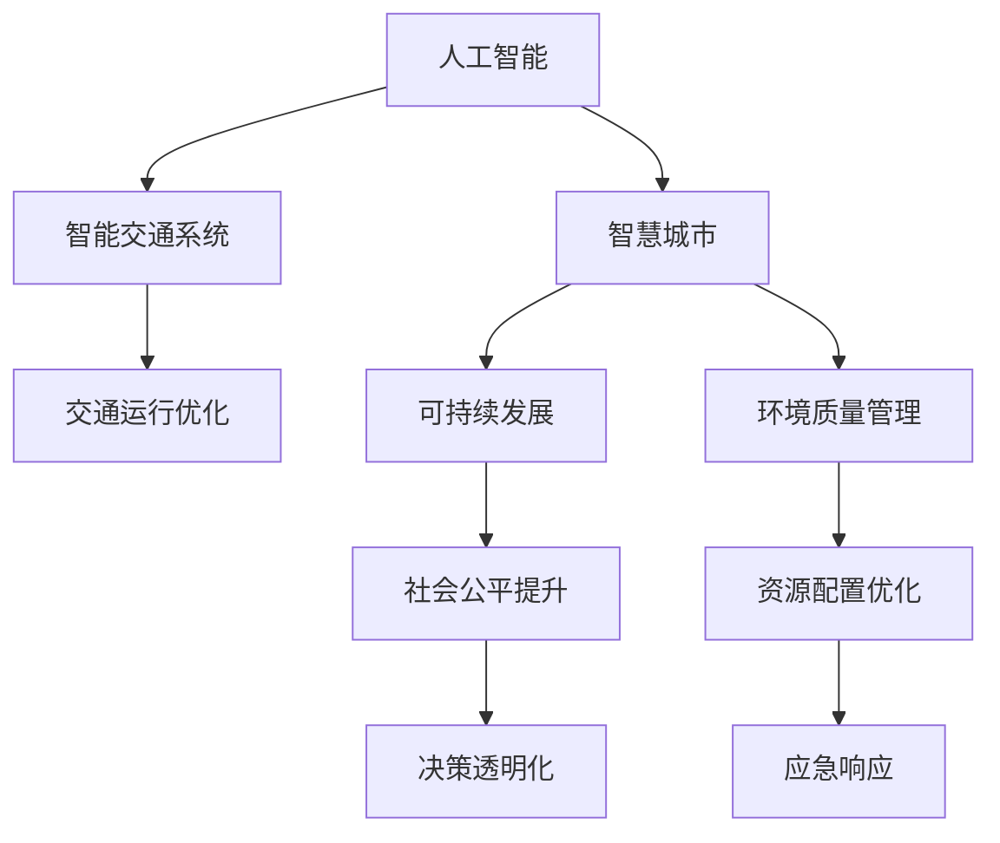

                 

# AI与人类计算：打造可持续发展的城市生活与交通

## 1. 背景介绍

### 1.1 问题由来
随着人口密集的城市化进程不断推进，交通拥堵、环境污染、资源短缺等城市问题日益凸显。传统的人类计算模式，以单中心集中式计算为特征，难以有效应对这些复杂且动态变化的城市挑战。随着人工智能技术的发展，AI与人类计算的深度融合，为城市的可持续发展提供了新的方向和工具。

### 1.2 问题核心关键点
AI与人类计算的融合，关键在于构建智能化的城市基础设施与管理系统，提升交通运行效率和城市环境治理能力。AI可以通过模型预测、智能调度、自动控制等手段，实现对城市系统的高效管理。而人类计算则通过参与、监督、反馈等环节，形成AI与人的双向互动，进一步优化系统性能，实现人机协同。

### 1.3 问题研究意义
AI与人类计算的融合，对于提升城市运行效率、保障居民生活质量、促进绿色可持续发展具有重要意义：

1. **提高交通运行效率**：通过AI辅助的智能交通系统，优化车辆调度和路线规划，减少拥堵，提升出行效率。
2. **改善环境质量**：利用AI预测和管理城市空气质量、垃圾处理等环境数据，实现环境污染的早期预警和治理。
3. **优化资源配置**：AI可以预测人口流动、能源需求等，帮助城市管理者更好地进行资源分配和管理。
4. **增强应急响应**：通过实时数据分析和AI模型预测，提升城市对灾害和紧急情况的响应速度和处理能力。
5. **促进社会公平**：AI与人类计算结合，使得资源和服务更加透明公平，增强公众参与感和满意度。

## 2. 核心概念与联系

### 2.1 核心概念概述

为更好地理解AI与人类计算在城市生活和交通中的应用，本节将介绍几个核心概念：

- **AI（人工智能）**：通过算法和数据驱动，实现智能决策和自动执行的技术体系。
- **人类计算（Human-in-the-loop）**：将人的参与、监督、反馈等环节融入AI决策和执行过程，形成人机协同的计算模式。
- **智能交通系统（ITS）**：以信息与通信技术为基础，集成AI和人类计算的交通管理系统，实现交通流的高效优化。
- **智慧城市（Smart City）**：利用AI与人类计算，实现城市基础设施、公共服务、环境治理等领域的智能化管理。
- **可持续发展（Sustainability）**：通过技术手段和政策引导，促进城市发展的经济、社会、环境等多维度均衡。

这些核心概念之间的逻辑关系可以通过以下Mermaid流程图来展示：



这个流程图展示了AI与人类计算在城市生活与交通中的核心应用场景：

1. AI通过智能交通系统优化交通运行，智慧城市管理环境质量，优化资源配置，提升应急响应能力。
2. 人类计算通过参与、监督、反馈，形成AI与人的双向互动，增强系统的透明度和公平性。
3. 最终目标是通过人机协同，实现城市的可持续发展。

## 3. 核心算法原理 & 具体操作步骤
### 3.1 算法原理概述

AI与人类计算在城市生活和交通中的应用，本质上是基于数据驱动和算法驱动的复杂系统。其核心算法原理包括以下几个方面：

1. **数据采集与预处理**：通过传感器、摄像头、气象站等设备，实时收集交通流量、天气情况、空气质量等数据。数据经过清洗、标注、归一化等预处理步骤，用于后续的AI模型训练和预测。

2. **模型训练与预测**：通过深度学习、强化学习、知识图谱等算法，训练AI模型，预测交通流、环境污染、能源需求等数据。模型输出作为决策依据，供人类计算进行监督和干预。

3. **决策与执行**：人类计算参与AI模型的输出分析与决策，形成综合方案。执行方案由城市管理系统执行，如交通信号灯控制、垃圾桶自动清洁、路灯自动调节等。

4. **反馈与优化**：通过居民反馈、系统监测等途径，获取决策执行效果，进行数据分析和模型优化，不断提升系统性能。

### 3.2 算法步骤详解

AI与人类计算在城市生活和交通中的应用，一般包括以下几个关键步骤：

**Step 1: 数据收集与预处理**

1. 部署各类传感器和监测设备，收集交通流量、天气、空气质量等实时数据。
2. 数据清洗，去除噪声、异常值等，确保数据质量。
3. 数据标注，将实时数据转化为模型训练所需格式。
4. 数据归一化，将不同量级的数据转换为统一尺度。

**Step 2: 模型训练与优化**

1. 选择合适的算法，如深度学习、强化学习、知识图谱等，构建模型。
2. 使用历史数据进行模型训练，优化模型参数。
3. 应用正则化技术，防止过拟合。
4. 使用验证集评估模型性能，调整模型结构。

**Step 3: 决策与执行**

1. 将模型输出作为决策依据，由人类计算进行综合分析与决策。
2. 将决策结果转化为可执行的命令，由城市管理系统执行。
3. 实时监测决策执行效果，调整优化决策方案。

**Step 4: 反馈与迭代**

1. 收集居民反馈、系统监测数据，评估决策效果。
2. 分析数据，识别系统问题，更新优化算法和模型。
3. 不断迭代模型和算法，提升系统性能和稳定性。

### 3.3 算法优缺点

AI与人类计算在城市生活和交通中的应用，具有以下优点：

1. **高效优化**：AI能够快速处理海量数据，提供实时决策支持，优化交通运行和环境治理。
2. **系统协同**：人类计算的参与，确保决策过程透明、公平，形成人机协同。
3. **灵活适应**：基于数据驱动，系统能够灵活适应不同环境条件和突发情况。

同时，该方法也存在一定的局限性：

1. **数据依赖**：模型的效果很大程度上依赖数据质量，数据缺失或不准确会影响决策效果。
2. **模型复杂**：大模型和高精度模型需要大量计算资源，维护成本较高。
3. **隐私风险**：实时数据收集与存储可能涉及隐私保护问题。
4. **决策透明度**：复杂算法和模型决策过程较难解释，需要透明化措施。
5. **人类信任**：系统需要人类计算的信任和配合，否则难以有效运行。

尽管存在这些局限性，但AI与人类计算的结合，已在大规模交通管理和环境治理中取得显著成效，成为城市可持续发展的有力工具。

### 3.4 算法应用领域

AI与人类计算在城市生活和交通中的应用，涵盖了以下多个领域：

- **智能交通系统**：利用AI优化交通信号灯控制、车辆调度、路线规划，提升道路通行效率。
- **环境质量监测**：通过AI分析气象、水质等数据，实现环境污染的早期预警和治理。
- **资源配置管理**：AI预测能源需求、人口流动等，帮助城市管理者优化资源配置。
- **应急响应系统**：利用AI模型预测灾害和紧急情况，优化应急资源调度。
- **城市综合治理**：结合AI与人类计算，实现城市基础设施的智能化管理。

除了上述这些领域，AI与人类计算的应用还在智慧社区、智能医疗、城市物流等诸多方面展现出巨大潜力，为城市的可持续发展提供了新的可能性。

## 4. 数学模型和公式 & 详细讲解  
### 4.1 数学模型构建

本节将使用数学语言对AI与人类计算在城市生活和交通中的应用进行更加严格的刻画。

设城市交通系统由 $N$ 个路口、$M$ 辆车组成，车辆在各个路口以概率 $p_i$ 经过。城市环境质量由 $K$ 个指标 $z_k$ 表示，指标变化率为 $r_k$。

定义交通流模型为 $T(t) = \sum_{i=1}^N t_i(t)$，其中 $t_i(t)$ 为路口 $i$ 在时间 $t$ 的通过车辆数。环境质量变化模型为 $Z(t) = \sum_{k=1}^K z_k(t)$，其中 $z_k(t)$ 为时间 $t$ 的指标值。

目标是最小化城市交通运行效率和环境质量指标的损失函数：

$$
\mathcal{L} = \alpha \mathcal{L}_{\text{交通}} + \beta \mathcal{L}_{\text{环境}}
$$

其中 $\alpha$ 为交通指标权重，$\beta$ 为环境指标权重。交通损失函数定义为：

$$
\mathcal{L}_{\text{交通}} = \sum_{i=1}^N \frac{(t_i(t) - t_i^*)^2}{2\sigma_i^2}
$$

环境损失函数定义为：

$$
\mathcal{L}_{\text{环境}} = \sum_{k=1}^K \frac{(z_k(t) - z_k^*)^2}{2\sigma_k^2}
$$

### 4.2 公式推导过程

以下是交通流模型和环境质量模型在实际应用中的推导过程：

1. **交通流模型**：
   - 定义车辆到达率 $\lambda_i(t)$ 为单位时间内到达路口 $i$ 的车辆数。
   - 定义通过率 $\eta_i(t)$ 为单位时间内通过路口 $i$ 的车辆数。
   - 根据交通流量守恒原理，有 $\sum_{i=1}^N t_i(t) = \sum_{i=1}^N \lambda_i(t) - \sum_{i=1}^N \eta_i(t)$。
   - 通过率 $\eta_i(t)$ 可以表示为 $\eta_i(t) = \eta_i^0 + \sum_{j=1}^N \eta_{ij}(t) p_j(t)$，其中 $\eta_i^0$ 为常数，$\eta_{ij}(t)$ 为单位时间内通过路口 $i$ 的车辆数，$j$ 为经过路口 $i$ 的下一路口。
   - 结合以上模型，可以得到交通流方程：
   $$
   \frac{\partial t_i(t)}{\partial t} = \lambda_i(t) - \eta_i(t) = \lambda_i(t) - \eta_i^0 - \sum_{j=1}^N \eta_{ij}(t) p_j(t)
   $$

2. **环境质量模型**：
   - 定义环境指标变化率 $\delta_k(t)$ 为单位时间内指标 $k$ 的变化量。
   - 定义环境质量模型为 $Z(t) = Z_0 + \int_0^t \sum_{k=1}^K \delta_k(t) dt$，其中 $Z_0$ 为初始环境质量指标值。
   - 环境指标变化率 $\delta_k(t)$ 可以表示为 $\delta_k(t) = \delta_k^0 + \sum_{j=1}^K r_{jk}(t) z_j(t)$，其中 $\delta_k^0$ 为常数，$r_{jk}(t)$ 为指标 $k$ 在单位时间内对指标 $j$ 的影响。
   - 结合以上模型，可以得到环境质量方程：
   $$
   \frac{\partial z_k(t)}{\partial t} = r_k(t)
   $$

通过上述推导，我们得到了城市交通和环境质量的数学模型，可以通过AI模型进行预测和优化，为人类计算提供决策依据。

## 5. 项目实践：代码实例和详细解释说明
### 5.1 开发环境搭建

在进行AI与人类计算的实践前，我们需要准备好开发环境。以下是使用Python进行PyTorch开发的环境配置流程：

1. 安装Anaconda：从官网下载并安装Anaconda，用于创建独立的Python环境。

2. 创建并激活虚拟环境：
```bash
conda create -n ai-env python=3.8 
conda activate ai-env
```

3. 安装PyTorch：根据CUDA版本，从官网获取对应的安装命令。例如：
```bash
conda install pytorch torchvision torchaudio cudatoolkit=11.1 -c pytorch -c conda-forge
```

4. 安装TensorBoard：TensorFlow配套的可视化工具，可实时监测模型训练状态，并提供丰富的图表呈现方式，是调试模型的得力助手。
```bash
pip install tensorboard
```

5. 安装各类工具包：
```bash
pip install numpy pandas scikit-learn matplotlib tqdm jupyter notebook ipython
```

完成上述步骤后，即可在`ai-env`环境中开始AI与人类计算的实践。

### 5.2 源代码详细实现

下面我们以智能交通系统为例，给出使用PyTorch对交通流进行预测的PyTorch代码实现。

首先，定义交通流模型：

```python
import torch
import torch.nn as nn
import torch.optim as optim

class TrafficFlowModel(nn.Module):
    def __init__(self, num_lanes):
        super(TrafficFlowModel, self).__init__()
        self.fc1 = nn.Linear(num_lanes, 32)
        self.fc2 = nn.Linear(32, 32)
        self.fc3 = nn.Linear(32, num_lanes)
        
    def forward(self, x):
        x = torch.relu(self.fc1(x))
        x = torch.relu(self.fc2(x))
        x = self.fc3(x)
        return x
```

然后，定义训练和评估函数：

```python
def train_epoch(model, optimizer, criterion, data_loader, device):
    model.train()
    epoch_loss = 0
    for batch in data_loader:
        inputs, targets = batch[0].to(device), batch[1].to(device)
        optimizer.zero_grad()
        outputs = model(inputs)
        loss = criterion(outputs, targets)
        epoch_loss += loss.item()
        loss.backward()
        optimizer.step()
    return epoch_loss / len(data_loader)

def evaluate(model, data_loader, device):
    model.eval()
    epoch_loss = 0
    with torch.no_grad():
        for batch in data_loader:
            inputs, targets = batch[0].to(device), batch[1].to(device)
            outputs = model(inputs)
            loss = criterion(outputs, targets)
            epoch_loss += loss.item()
    return epoch_loss / len(data_loader)
```

最后，启动训练流程并在测试集上评估：

```python
epochs = 100
batch_size = 32
learning_rate = 0.001

device = torch.device('cuda') if torch.cuda.is_available() else torch.device('cpu')
model = TrafficFlowModel(num_lanes).to(device)
criterion = nn.MSELoss()
optimizer = optim.Adam(model.parameters(), lr=learning_rate)

train_loader = ...
test_loader = ...

for epoch in range(epochs):
    loss = train_epoch(model, optimizer, criterion, train_loader, device)
    print(f"Epoch {epoch+1}, train loss: {loss:.3f}")
    
    print(f"Epoch {epoch+1}, test loss: {evaluate(model, test_loader, device):.3f}")
```

以上就是使用PyTorch对交通流进行预测的完整代码实现。可以看到，通过PyTorch构建交通流模型，可以方便地进行模型训练和评估。

### 5.3 代码解读与分析

让我们再详细解读一下关键代码的实现细节：

**TrafficFlowModel类**：
- `__init__`方法：初始化模型结构，包括全连接层。
- `forward`方法：定义前向传播计算，通过多层线性变换，预测交通流量。

**train_epoch和evaluate函数**：
- 训练函数`train_epoch`：对数据集进行迭代，在每个批次上前向传播计算损失并反向传播更新模型参数，最后返回该epoch的平均loss。
- 评估函数`evaluate`：与训练类似，不同点在于不更新模型参数，在每个batch结束后将预测和标签结果存储下来，最后计算平均loss。

**训练流程**：
- 定义总的epoch数和batch size，开始循环迭代
- 每个epoch内，先在训练集上训练，输出平均loss
- 在测试集上评估，输出模型表现

可以看到，PyTorch提供了强大的自动微分和优化功能，使得构建和训练AI模型变得非常简单。同时，TensorBoard可以实时可视化训练过程，方便调试和优化模型。

## 6. 实际应用场景

### 6.1 智能交通系统

智能交通系统是AI与人类计算在城市生活与交通中的重要应用。通过实时监测和预测交通流量，优化交通信号灯控制和车辆调度，可以显著提升城市交通的运行效率。

在技术实现上，可以部署各类传感器和摄像头，实时收集交通数据。利用AI模型预测交通流量，生成最优的交通信号灯控制策略，并通过人类计算对策略进行调整和监督。实时监测交通运行状态，反馈优化模型，实现动态调整。

### 6.2 环境质量监测

环境质量监测是AI与人类计算在城市生活和交通中的另一个关键应用。通过实时监测空气质量、水质等环境指标，预测环境污染趋势，实现环境污染的早期预警和治理。

在技术实现上，可以部署各类传感器和监测设备，实时收集环境数据。利用AI模型预测环境指标变化，生成预警和治理方案，并通过人类计算对方案进行综合分析和决策。实时监测环境状态，反馈优化模型，提升治理效果。

### 6.3 资源配置管理

资源配置管理是AI与人类计算在城市生活和交通中的重要手段。通过预测人口流动、能源需求等，帮助城市管理者优化资源配置，提升城市运行效率。

在技术实现上，可以收集历史数据和实时数据，构建AI模型进行预测。生成资源配置方案，并通过人类计算进行综合分析和决策。实时监测资源使用情况，反馈优化模型，实现资源的高效利用。

### 6.4 应急响应系统

应急响应系统是AI与人类计算在城市生活和交通中的重要保障。通过实时数据分析和AI模型预测，优化应急资源调度，提升灾害和紧急情况的响应速度和处理能力。

在技术实现上，可以收集各类应急数据，构建AI模型进行预测。生成应急响应方案，并通过人类计算进行综合分析和决策。实时监测应急状态，反馈优化模型，提升应急响应效果。

## 7. 工具和资源推荐

### 7.1 学习资源推荐

为了帮助开发者系统掌握AI与人类计算的理论基础和实践技巧，这里推荐一些优质的学习资源：

1. 《Deep Learning for Self-Driving Cars》系列书籍：系统讲解自动驾驶中的AI与人类计算，涵盖感知、决策、控制等多个环节。

2. 《Practical AI for Traffic Management》课程：介绍AI在智能交通中的应用，包含交通流预测、信号灯控制等多个实际案例。

3. 《Human-in-the-Loop Machine Learning》书籍：详细介绍人类计算与AI融合的技术原理和实践方法，涵盖数据收集、模型训练、决策执行等多个方面。

4. TensorFlow官方文档：提供了丰富的AI开发工具和教程，适合快速上手AI开发。

5. PyTorch官方文档：提供了丰富的深度学习框架和模型库，适合进行复杂的AI开发和优化。

通过对这些资源的学习实践，相信你一定能够快速掌握AI与人类计算的精髓，并用于解决实际的AI开发问题。

### 7.2 开发工具推荐

高效的开发离不开优秀的工具支持。以下是几款用于AI与人类计算开发的常用工具：

1. PyTorch：基于Python的开源深度学习框架，灵活动态的计算图，适合快速迭代研究。

2. TensorFlow：由Google主导开发的开源深度学习框架，生产部署方便，适合大规模工程应用。

3. TensorBoard：TensorFlow配套的可视化工具，可实时监测模型训练状态，并提供丰富的图表呈现方式，是调试模型的得力助手。

4. Weights & Biases：模型训练的实验跟踪工具，可以记录和可视化模型训练过程中的各项指标，方便对比和调优。

5. Scikit-learn：Python机器学习库，提供丰富的数据处理和模型评估工具，适合进行基础数据预处理和模型评估。

6. Jupyter Notebook：交互式编程环境，适合进行动态调试和快速原型开发。

合理利用这些工具，可以显著提升AI与人类计算的开发效率，加快创新迭代的步伐。

### 7.3 相关论文推荐

AI与人类计算的发展源于学界的持续研究。以下是几篇奠基性的相关论文，推荐阅读：

1. A Survey of Human-in-the-loop Machine Learning: Challenges, Methods and Applications：系统回顾了人类计算与AI融合的挑战、方法和应用，为AI与人类计算的实践提供了理论指导。

2. AI-based Traffic Signal Control in Intelligent Transportation System：介绍了一种基于AI的交通信号控制方法，结合人类计算进行优化。

3. Predicting Urban Air Quality with Deep Learning：使用深度学习模型预测城市空气质量，结合人类计算进行决策优化。

4. Resource Optimization for Smart Cities Using AI and IoT：利用AI和IoT技术优化城市资源配置，提升城市运行效率。

5. Modeling Urban Stormwater Management Systems with Deep Learning and Human-in-the-Loop Modeling：结合AI和人类计算建模城市雨洪管理系统，优化资源配置。

这些论文代表了大规模交通管理和环境治理中AI与人类计算的最新研究方向，通过学习这些前沿成果，可以帮助研究者把握学科前进方向，激发更多的创新灵感。

## 8. 总结：未来发展趋势与挑战

### 8.1 总结

本文对AI与人类计算在城市生活和交通中的应用进行了全面系统的介绍。首先阐述了AI与人类计算的研究背景和意义，明确了其在提升城市运行效率、保障居民生活质量、促进绿色可持续发展方面的独特价值。其次，从原理到实践，详细讲解了AI与人类计算的数学模型和核心算法，给出了完整的代码实例。同时，本文还广泛探讨了AI与人类计算在智能交通、环境监测、资源配置等多个领域的应用前景，展示了其在城市可持续发展中的巨大潜力。此外，本文精选了AI与人类计算的学习资源、开发工具和相关论文，力求为读者提供全方位的技术指引。

通过本文的系统梳理，可以看到，AI与人类计算正在成为城市生活与交通的重要计算模式，其人机协同的特性，为解决复杂的城市问题提供了新的手段。通过智能决策和实时优化，AI与人类计算将极大提升城市运行效率和环境治理能力，实现绿色可持续发展。

### 8.2 未来发展趋势

展望未来，AI与人类计算在城市生活和交通中的应用将呈现以下几个发展趋势：

1. **模型精度与效率的提升**：随着计算资源和算法技术的进步，AI与人类计算模型将越来越精准、高效，提升城市系统运行的实时性和可靠性。

2. **多模态数据的融合**：AI与人类计算将融合多模态数据，如视频、音频、文本等，实现更全面、多维度的环境监测和交通管理。

3. **边缘计算的引入**：随着5G和物联网技术的发展，AI与人类计算将越来越多地采用边缘计算，提升数据处理的实时性和隐私保护水平。

4. **人类计算角色的强化**：人类计算将不仅是监督者和反馈者，更是城市系统的重要参与者和设计者，提升系统的透明性和公平性。

5. **跨领域应用的拓展**：AI与人类计算将拓展到更多领域，如智慧农业、智能医疗、智能制造等，推动各行业智能化升级。

6. **数据隐私与安全**：AI与人类计算将更加注重数据隐私和安全，引入区块链、加密等技术，确保数据的透明性和安全性。

以上趋势凸显了AI与人类计算在城市生活和交通中的广阔前景。这些方向的探索发展，必将进一步提升城市系统的智能水平，为构建人机协同的智能城市奠定基础。

### 8.3 面临的挑战

尽管AI与人类计算在城市生活和交通中的应用取得了显著成效，但在迈向更加智能化、普适化应用的过程中，仍面临诸多挑战：

1. **数据质量与隐私保护**：数据的准确性和隐私保护是AI与人类计算的重大挑战，数据的缺失、异常和隐私泄露将严重影响模型效果。

2. **模型复杂性与计算资源**：大规模城市系统的复杂性要求模型具有极高的计算效率和实时性，对计算资源提出了更高要求。

3. **系统可靠性与安全性**：AI与人类计算系统需要高度可靠和安全，系统故障和恶意攻击可能导致严重后果。

4. **跨领域知识整合**：城市系统涉及多个领域，如何有效整合不同领域知识，形成统一的知识图谱，将是未来研究的重要方向。

5. **决策透明性与可解释性**：AI与人类计算决策过程的透明性和可解释性，对居民信任和系统稳定性至关重要。

6. **伦理与法规约束**：AI与人类计算的应用涉及伦理和法规问题，如何在决策过程中引入伦理导向，确保系统符合社会价值观，也是重要的挑战。

正视AI与人类计算面临的这些挑战，积极应对并寻求突破，将是大规模智能系统走向成熟的必由之路。相信随着学界和产业界的共同努力，这些挑战终将一一被克服，AI与人类计算必将在构建智能城市中扮演越来越重要的角色。

### 8.4 研究展望

面向未来，AI与人类计算的研究需要在以下几个方面寻求新的突破：

1. **数据增强与合成**：开发数据增强和合成技术，弥补数据缺失和异常，提升模型泛化能力。

2. **模型简化与优化**：研究模型简化和优化技术，提升模型的计算效率和实时性，适应边缘计算等新型计算环境。

3. **知识图谱与知识整合**：构建跨领域知识图谱，整合不同领域知识，提升系统的综合决策能力。

4. **伦理与法规引导**：引入伦理与法规导向，确保AI与人类计算的应用符合社会价值观和法律法规，保障系统公正性。

5. **透明性与可解释性**：研究透明性与可解释性技术，确保系统决策过程透明可解释，提升居民信任和满意度。

6. **隐私保护与安全性**：引入隐私保护和安全技术，确保数据隐私和系统安全，保障城市运行安全稳定。

这些研究方向的探索，必将引领AI与人类计算技术迈向更高的台阶，为构建智能城市提供更加坚实的技术基础。

## 9. 附录：常见问题与解答

**Q1：AI与人类计算是否适用于所有城市应用场景？**

A: AI与人类计算在大多数城市应用场景中都能取得不错的效果，特别是在数据量充足、计算资源丰富的场景下。但对于一些特定领域的应用，如历史悠久的文化街区、生态环境保护的特定区域等，可能需要结合人类专家的知识和经验，进行更精细化的系统设计。

**Q2：AI与人类计算模型是否需要大量的标注数据？**

A: AI与人类计算模型的效果很大程度上依赖数据质量，数据缺失或不准确会影响模型效果。但在某些特定应用场景中，如交通信号灯控制、垃圾处理等，可以利用合成数据或小样本学习技术，优化模型性能。

**Q3：AI与人类计算的决策过程如何保证透明性和公平性？**

A: 引入人类计算的监督和反馈环节，通过人工审核和干预，确保AI决策过程透明和公平。此外，定期发布模型决策依据和决策结果，增加公众信任。

**Q4：AI与人类计算系统如何应对突发事件？**

A: AI与人类计算系统可以通过实时监测和预测，及时发现突发事件。结合人类计算，快速生成应急响应方案，并通过反馈优化模型，提升应急响应效果。

**Q5：AI与人类计算如何保护用户隐私？**

A: 采用匿名化、去标识化等技术，保护用户隐私。严格限制数据的使用范围，确保数据只用于模型训练和决策，不泄露用户个人信息。

通过本文的系统梳理，可以看到，AI与人类计算正在成为城市生活与交通的重要计算模式，其人机协同的特性，为解决复杂的城市问题提供了新的手段。通过智能决策和实时优化，AI与人类计算将极大提升城市运行效率和环境治理能力，实现绿色可持续发展。面向未来，AI与人类计算的研究需要在数据、模型、伦理等多个维度进行全面探索，才能真正实现智能城市的建设目标。

