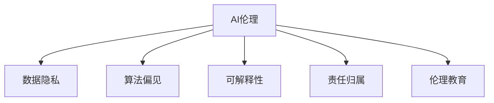

                 

# AI伦理的产业联盟:共建负责任的AI生态

在人工智能(AI)技术日益成熟的今天，其应用场景和影响范围已经渗透到社会生活的各个角落。然而，AI技术的发展也伴随着一系列伦理问题，如数据隐私、算法偏见、决策透明度等，这些问题如果不能得到妥善解决，将对公众信任和社会稳定构成严重威胁。本文旨在探讨AI伦理的产业联盟建设，旨在构建负责任的AI生态，推动AI技术的健康发展。

## 1. 背景介绍

### 1.1 问题的由来
随着深度学习、机器学习和自然语言处理等技术的发展，AI在医疗、金融、教育、交通等领域的应用日益广泛，为社会带来了巨大的经济和社会效益。但与此同时，AI也暴露出了一些严重的伦理问题：

- **数据隐私**：AI系统通常依赖于大规模数据进行训练，这些数据往往包含大量的个人隐私信息，如何保护这些数据不被滥用是一个重大挑战。
- **算法偏见**：AI系统中的算法设计存在隐性偏见，可能加剧社会不平等，甚至导致对某些群体的歧视。
- **决策透明度**：AI系统的内部机制通常是"黑箱"，难以解释其决策过程，这使得用户和监管者难以理解和监督。

这些问题不仅影响了AI技术的公信力和接受度，还可能带来严重的社会后果。因此，构建负责任的AI生态，推动AI伦理治理，成为了业界的共识。

### 1.2 问题核心关键点
构建负责任的AI生态，主要包括以下几个核心关键点：

- **数据隐私保护**：确保数据在收集、存储、传输和使用过程中的安全性。
- **算法公平性**：设计和优化AI算法，消除隐性偏见，提升系统对各类群体的公平性。
- **决策透明度**：增强AI系统的可解释性，使其决策过程透明、可追溯。
- **责任归属明确**：明确AI系统的责任归属，防止出现责任真空。
- **伦理教育和宣传**：普及AI伦理知识，提高公众对AI技术的理解和接受度。

这些关键点共同构成了负责任的AI生态的基本框架，旨在保护用户权益，提升AI系统的信任度和公信力。

## 2. 核心概念与联系

### 2.1 核心概念概述

为更好地理解AI伦理的产业联盟建设，本节将介绍几个密切相关的核心概念：

- **AI伦理**：涉及AI系统的设计、开发、应用和监管过程中的伦理问题，旨在提升AI技术的社会价值和公信力。
- **数据隐私**：指保护个人数据不被未授权访问、使用或泄露的权利。
- **算法偏见**：指AI系统中存在的隐性偏见，可能对特定群体造成不公平待遇。
- **可解释性**：指AI系统决策过程的透明性和可理解性，使其能够被用户和监管者解释和审查。
- **责任归属**：指在AI系统出现错误或误用时，确定谁应当承担责任。
- **伦理教育**：指通过教育普及AI伦理知识，提高公众对AI技术的认知和接受度。

这些核心概念之间的逻辑关系可以通过以下Mermaid流程图来展示：



这个流程图展示了这个AI伦理框架的核心概念及其之间的关系：

1. AI伦理是整个框架的基石，决定了AI系统在设计和应用中的伦理标准。
2. 数据隐私和算法偏见是AI伦理的重要组成部分，涉及到数据和算法的设计和使用。
3. 可解释性和责任归属是确保AI系统透明和公正的重要保障。
4. 伦理教育则是普及AI知识，提高公众理解和接受度的关键环节。

## 3. 核心算法原理 & 具体操作步骤

### 3.1 算法原理概述

构建负责任的AI生态，本质上是一个多学科交叉的复杂系统工程。其中，数据隐私保护、算法公平性和决策透明度是核心技术，而伦理教育和责任归属是辅助手段。本文将分别探讨这些核心算法的原理和具体操作步骤。

### 3.2 算法步骤详解

**数据隐私保护**：

1. **数据匿名化**：对数据进行去标识化处理，使其无法直接关联到个人身份。常见的技术包括数据屏蔽、数据泛化、数据加密等。
2. **差分隐私**：通过添加噪声，使得对数据进行特定查询时无法反推原始数据。常见的差分隐私算法包括拉普拉斯机制、高斯机制等。
3. **联邦学习**：通过分布式训练，各参与方在不共享原始数据的情况下，共同训练出一个全局模型。

**算法公平性**：

1. **公平性度量**：定义公平性指标，如平等机会、等效效用等，用于评估和优化算法。
2. **算法优化**：通过算法设计或数据增强，减少算法的隐性偏见，提升系统对各类群体的公平性。
3. **公平性检测**：定期对算法进行公平性检测，发现和纠正存在的偏见。

**可解释性**：

1. **特征重要性分析**：通过模型特征分析，确定对预测结果有重要影响的特征。
2. **模型可视化**：使用图形、图表等方式，展示模型内部的决策路径和权重分布。
3. **交互式解释**：设计交互式界面，允许用户输入特定数据，查看模型输出的解释。

**责任归属**：

1. **责任分配框架**：制定责任分配规则，明确各参与方的责任和义务。
2. **法律责任**：通过立法和司法手段，明确AI系统在特定情况下的法律责任。
3. **内部审计**：定期进行内部审计，确保责任分配和执行的合规性。

**伦理教育**：

1. **课程开发**：设计和开发AI伦理相关的教育课程，涵盖数据隐私、算法偏见、可解释性等主题。
2. **培训普及**：组织培训和讲座，普及AI伦理知识，提升公众对AI技术的认知和接受度。
3. **公众参与**：通过公开透明的方式，鼓励公众参与AI伦理问题的讨论和决策。

### 3.3 算法优缺点

**数据隐私保护**：

优点：
- 保障个人数据安全，防止数据泄露和滥用。
- 增强用户对AI系统的信任度。

缺点：
- 技术复杂，实施成本高。
- 可能影响数据质量，影响模型性能。

**算法公平性**：

优点：
- 提升AI系统对各类群体的公平性。
- 减少隐性偏见，提升社会公信力。

缺点：
- 实现难度大，需要多学科合作。
- 可能引入新的不公平因素。

**可解释性**：

优点：
- 增强决策透明度，提升用户信任度。
- 便于监管和审查。

缺点：
- 可能增加系统复杂度，影响性能。
- 解释结果可能不完全准确。

**责任归属**：

优点：
- 明确责任归属，避免责任真空。
- 增强系统可靠性。

缺点：
- 法律和责任分配规则复杂，执行难度大。
- 可能引发责任纠纷。

**伦理教育**：

优点：
- 提高公众对AI技术的认知和接受度。
- 促进AI伦理问题的透明化。

缺点：
- 普及教育需要时间和资源投入。
- 公众教育效果可能有限。

### 3.4 算法应用领域

基于AI伦理的产业联盟，已经在多个领域得到了广泛应用，包括但不限于：

- **医疗健康**：确保患者数据隐私，提升医疗决策的透明性和公平性。
- **金融服务**：保护用户数据隐私，减少算法偏见，增强金融决策的透明度。
- **教育培训**：普及AI伦理知识，提升教师和学生的AI技术素养。
- **公共安全**：确保数据隐私，提升监控系统的公平性和透明度。
- **环境保护**：保护环境数据隐私，减少算法的隐性偏见，促进可持续发展。

## 4. 数学模型和公式 & 详细讲解 & 举例说明

### 4.1 数学模型构建

本节将使用数学语言对AI伦理的核心算法进行更加严格的刻画。

**差分隐私**：

差分隐私的目标是在保护数据隐私的同时，尽可能地保留数据的有用信息。差分隐私的数学模型如下：

$$
\mathcal{L}(D) = \mathbb{E}_{\epsilon \sim \text{Laplace}(1/\epsilon)} \left[ f(D') + \epsilon \right]
$$

其中，$D$ 为原始数据集，$D'$ 为加入噪声后的数据集，$f(D')$ 为在数据集$D'$上的函数计算结果，$\epsilon$ 为添加的噪声量，通常服从拉普拉斯分布。

**拉普拉斯机制**：

拉普拉斯机制是一种常见的差分隐私算法，其数学公式如下：

$$
p(x'|x) = \frac{1}{2\epsilon}e^{-\frac{|x' - x|}{\epsilon}}
$$

其中，$x$ 为原始数据，$x'$ 为加入噪声后的数据，$\epsilon$ 为噪声强度，$|x' - x|$ 表示两者之间的距离。

### 4.2 公式推导过程

以拉普拉斯机制为例，推导其数学公式。

设原始数据为 $x$，噪声为 $N \sim \text{Laplace}(1/\epsilon)$，则加入噪声后的数据为 $x' = x + N$。根据拉普拉斯分布的性质，噪声 $N$ 的概率密度函数为：

$$
p(N) = \frac{1}{2\epsilon}e^{-\frac{|N|}{\epsilon}}
$$

对于任意数据 $x'$，拉普拉斯机制的条件概率为：

$$
p(x'|x) = \frac{p(x' - N)}{p(N)} = \frac{e^{-\frac{|x' - x|}{\epsilon}}}{\int_{-\infty}^{\infty} e^{-\frac{|x' - x|}{\epsilon}} dN}
$$

根据拉普拉斯分布的性质，上述积分可以化简为：

$$
\int_{-\infty}^{\infty} e^{-\frac{|x' - x|}{\epsilon}} dN = 2\epsilon e^{\frac{|x' - x|}{\epsilon}}
$$

因此，条件概率公式可以进一步化简为：

$$
p(x'|x) = \frac{e^{-\frac{|x' - x|}{\epsilon}}}{2\epsilon e^{\frac{|x' - x|}{\epsilon}}} = \frac{1}{2\epsilon}e^{-\frac{|x' - x|}{\epsilon}}
$$

这就是拉普拉斯机制的数学公式。

### 4.3 案例分析与讲解

假设某金融公司希望在用户数据上进行差分隐私处理，以保护用户隐私。公司拥有用户的历史消费数据 $D = \{(x_1, y_1), (x_2, y_2), \ldots, (x_n, y_n)\}$，其中 $x_i$ 为用户的消费记录，$y_i$ 为用户的消费金额。公司希望在保留部分有用信息的同时，对数据进行差分隐私处理。

首先，根据拉普拉斯机制，公司选定噪声强度 $\epsilon = 0.1$。然后，对每个用户的消费记录 $x_i$ 加入噪声 $N \sim \text{Laplace}(1/\epsilon)$，得到处理后的消费记录 $x'_i = x_i + N$。

处理后的数据集 $D'$ 可以用于模型的训练和预测，同时噪声的添加保证了原始数据的隐私性。例如，公司可以使用处理后的数据集 $D'$ 训练一个线性回归模型，用于预测用户的未来消费金额。

在模型训练和预测过程中，公司可以确保每个用户的数据都被保护在隐私范围内，而模型仍然能够从数据中学习有用的特征和规律。

## 5. 项目实践：代码实例和详细解释说明

### 5.1 开发环境搭建

在进行差分隐私处理的项目实践前，我们需要准备好开发环境。以下是使用Python进行差分隐私处理的开发环境配置流程：

1. 安装Anaconda：从官网下载并安装Anaconda，用于创建独立的Python环境。

2. 创建并激活虚拟环境：
```bash
conda create -n diff_priv_env python=3.8 
conda activate diff_priv_env
```

3. 安装相关库：
```bash
pip install numpy pandas sklearn laplace-noise
```

4. 配置差分隐私参数：
```python
from laplace_noise import LaplaceNoise
eps = 0.1
delta = 0.1  # 最大数据泄露概率
noises = LaplaceNoise(eps, delta)
```

完成上述步骤后，即可在`diff_priv_env`环境中开始差分隐私处理的项目实践。

### 5.2 源代码详细实现

下面我们以处理用户消费数据为例，给出使用LaplaceNoise库进行差分隐私处理的Python代码实现。

```python
import pandas as pd
from laplace_noise import LaplaceNoise

# 读取原始数据
data = pd.read_csv('consumption_data.csv')

# 定义差分隐私参数
eps = 0.1
delta = 0.1  # 最大数据泄露概率

# 初始化差分隐私处理器
noises = LaplaceNoise(eps, delta)

# 处理数据
for i in range(len(data)):
    # 生成噪声
    noise = noises.sample()
    # 加入噪声
    data.loc[i, 'consumption'] += noise

# 保存处理后的数据
data.to_csv('consumption_data_priv.csv', index=False)
```

在这个代码中，我们首先使用Pandas库读取原始数据，然后定义差分隐私参数 $\epsilon$ 和 $\delta$。接着，使用LaplaceNoise库初始化差分隐私处理器，对每个用户的消费记录 $x_i$ 添加拉普拉斯噪声 $N \sim \text{Laplace}(1/\epsilon)$，生成处理后的数据集 $D'$，并保存到文件中。

### 5.3 代码解读与分析

让我们再详细解读一下关键代码的实现细节：

- **LaplaceNoise库**：这是一个用于差分隐私处理的Python库，提供了拉普拉斯噪声的生成和采样功能。
- **差分隐私参数**：$\epsilon$ 表示噪声的强度，$\delta$ 表示最大数据泄露概率，这两个参数需要根据具体应用场景进行调整。
- **处理数据**：对每个用户的消费记录 $x_i$ 加入噪声，生成处理后的数据集 $D'$。

这个代码展示了如何使用差分隐私技术保护用户数据隐私，同时保留数据的有用信息。需要注意的是，差分隐私处理虽然能够保护数据隐私，但可能会引入一定的噪声，影响数据的质量和模型的性能。因此，需要在隐私保护和数据质量之间进行权衡。

## 6. 实际应用场景

### 6.1 医疗健康

在医疗健康领域，差分隐私可以应用于病历数据的保护和匿名化，确保患者隐私不受侵害。例如，某医院拥有患者的病历数据，希望在公开病历数据时保护患者隐私。

医院可以使用差分隐私技术，对病历数据进行匿名化处理。处理后的病历数据可以用于医学研究和公共健康监测，而原始病历数据仍可存储在医疗系统中，确保数据的安全性和隐私性。

### 6.2 金融服务

在金融服务领域，差分隐私可以应用于客户数据的保护，防止数据泄露和滥用。例如，某金融公司拥有客户的消费记录和信用评分，希望在公开数据时保护客户隐私。

公司可以使用差分隐私技术，对客户数据进行匿名化处理。处理后的数据可以用于数据分析和产品开发，而原始数据仍可存储在系统中，确保数据的完整性和可用性。

### 6.3 教育培训

在教育培训领域，差分隐私可以应用于学生的成绩数据保护。例如，某教育机构拥有学生的成绩数据，希望在公开成绩时保护学生隐私。

教育机构可以使用差分隐私技术，对成绩数据进行匿名化处理。处理后的数据可以用于教学评估和研究，而原始数据仍可存储在系统内，确保数据的完整性和安全性。

## 7. 工具和资源推荐

### 7.1 学习资源推荐

为了帮助开发者系统掌握差分隐私等AI伦理技术的理论基础和实践技巧，这里推荐一些优质的学习资源：

1. 《差分隐私理论基础》系列博文：由差分隐私领域的专家撰写，深入浅出地介绍了差分隐私的基本概念和应用场景。
2. 《联邦学习与差分隐私》课程：由斯坦福大学开设的在线课程，涵盖了联邦学习与差分隐私的理论和实践。
3. 《AI伦理》书籍：全面介绍了AI伦理的基本概念和伦理困境，适合入门和进阶读者。
4. 《机器学习中的差分隐私》书籍：介绍了差分隐私在机器学习中的具体应用和实践，适合技术开发者。
5. Kaggle上的差分隐私竞赛数据集：提供了丰富的差分隐私实践案例，方便开发者进行实践学习。

通过对这些资源的学习实践，相信你一定能够快速掌握差分隐私等AI伦理技术的精髓，并用于解决实际的隐私保护问题。

### 7.2 开发工具推荐

高效的开发离不开优秀的工具支持。以下是几款用于差分隐私处理开发的常用工具：

1. Python：广泛使用的编程语言，适合进行差分隐私处理的数据处理和模型训练。
2. LaplaceNoise库：提供了拉普拉斯噪声的生成和采样功能，适合进行差分隐私处理。
3. PyTorch：开源深度学习框架，支持分布式训练，适合进行差分隐私处理的模型训练。
4. TensorFlow：由Google主导开发的深度学习框架，支持分布式训练，适合进行差分隐私处理的模型训练。
5. Weights & Biases：模型训练的实验跟踪工具，可以记录和可视化模型训练过程中的各项指标，方便调试和优化。

合理利用这些工具，可以显著提升差分隐私处理的开发效率，加快创新迭代的步伐。

### 7.3 相关论文推荐

差分隐私作为AI伦理中的重要技术，其研究热度一直在持续。以下是几篇奠基性的相关论文，推荐阅读：

1. Differential Privacy: Definition and Hardness (Tandon, et al., 2008)：定义了差分隐私的概念和形式化定义，奠定了差分隐私理论基础。
2. Differential Privacy via the Gaussian Mechanism (Dwork, et al., 2006)：提出高斯机制的差分隐私算法，是差分隐私的经典算法之一。
3. Privacy-Preserving Data Release: The Probabilistic Model (Chaudhuri, et al., 2007)：提出概率模型差分隐私算法，适用于分布式数据处理。
4. Privacy-Preserving Clustering via Differential Privacy (Borgida, et al., 2006)：提出差分隐私聚类算法，适用于分布式数据处理。
5. On the Composite Data-Processing Inequality and Related Differential Privacy Bounds (Balle, et al., 2021)：提出复合数据处理不等式，提供了更加严格的差分隐私界定。

这些论文代表了差分隐私技术的发展脉络。通过学习这些前沿成果，可以帮助研究者把握学科前进方向，激发更多的创新灵感。

## 8. 总结：未来发展趋势与挑战

### 8.1 总结

本文对AI伦理的产业联盟建设进行了全面系统的介绍。首先阐述了AI伦理的必要性和紧迫性，明确了差分隐私保护、算法公平性和决策透明度等核心技术的重要性。其次，从原理到实践，详细讲解了差分隐私处理的数学原理和具体操作步骤，给出了代码实现和解释分析。同时，本文还广泛探讨了差分隐私在医疗健康、金融服务、教育培训等多个领域的应用前景，展示了差分隐私技术的广阔前景。

通过本文的系统梳理，可以看到，差分隐私技术作为AI伦理中的重要手段，对于保护用户隐私、提升AI系统的可信度和透明度具有重要意义。未来，伴随差分隐私技术的不断演进，相信AI系统将更加安全、透明和公正，为构建负责任的AI生态做出更大贡献。

### 8.2 未来发展趋势

展望未来，差分隐私技术将呈现以下几个发展趋势：

1. **差分隐私技术的集成化**：差分隐私技术将与其他隐私保护技术，如联邦学习、同态加密等进行深度融合，形成更加综合的隐私保护方案。
2. **差分隐私算法的优化**：未来的差分隐私算法将更加注重效率和性能，以适应大规模数据处理的需要。
3. **差分隐私的普及化**：差分隐私技术将被广泛应用于各类AI系统，提升系统可信度和透明度。
4. **差分隐私理论的完善**：未来的差分隐私理论将更加严密和全面，涵盖更多隐私保护目标和应用场景。

这些趋势凸显了差分隐私技术的广阔前景，未来将有更多的应用场景和更加丰富的解决方案，为AI系统的可信度和透明度提供更强保障。

### 8.3 面临的挑战

尽管差分隐私技术已经取得了瞩目成就，但在迈向更加智能化、普适化应用的过程中，它仍面临着诸多挑战：

1. **隐私保护的平衡**：如何在隐私保护和数据质量之间进行平衡，是一个难题。差分隐私处理可能引入一定的噪声，影响数据的质量和模型的性能。
2. **隐私保护机制的复杂性**：差分隐私机制复杂，实现和维护成本高，需要专业知识支持。
3. **隐私保护的实际效果**：在某些实际应用场景中，差分隐私可能无法完全消除数据泄露风险，需要与其他隐私保护手段结合使用。
4. **隐私保护的多样性**：不同的应用场景可能需要不同的隐私保护机制，如何统一标准是一个挑战。

解决这些挑战，需要从技术、法规、文化等多个维度进行全面考虑，推动差分隐私技术的不断进步。

### 8.4 研究展望

面对差分隐私技术面临的挑战，未来的研究需要在以下几个方面寻求新的突破：

1. **隐私保护机制的简化**：简化差分隐私机制，降低实施难度，提高实际应用效果。
2. **隐私保护的普适性**：设计适用于多种应用场景的隐私保护机制，增强差分隐私的通用性。
3. **隐私保护与数据利用的平衡**：在隐私保护和数据利用之间找到平衡点，确保数据价值最大化。
4. **隐私保护与可解释性的结合**：增强差分隐私算法的可解释性，提升系统的透明度和可信度。

这些研究方向将推动差分隐私技术在实际应用中的落地，为构建负责任的AI生态提供坚实的技术保障。

## 9. 附录：常见问题与解答

**Q1：差分隐私和联邦学习有什么区别？**

A: 差分隐私和联邦学习都是隐私保护技术，但它们的应用场景和具体实现方式有所不同。

差分隐私主要通过添加噪声，使得对数据进行特定查询时无法反推原始数据。差分隐私适用于单一数据集的保护，适用于集中式数据处理场景。

联邦学习则通过分布式训练，各参与方在不共享原始数据的情况下，共同训练出一个全局模型。联邦学习适用于分布式数据处理，各参与方不直接交换数据，保护了数据的隐私性和完整性。

因此，差分隐私和联邦学习各有优缺点，适用于不同的隐私保护场景。

**Q2：差分隐私处理是否会影响数据质量？**

A: 差分隐私处理可能会引入一定的噪声，影响数据的质量和模型的性能。具体来说，差分隐私处理会使得模型在处理真实数据时，无法完全拟合数据的真实分布，导致模型性能下降。

为了解决这一问题，可以采用以下方法：
1. 选择合适的噪声强度：在隐私保护和数据质量之间进行权衡，选择合适的噪声强度。
2. 优化模型结构：通过增加模型复杂度，弥补噪声带来的影响。
3. 数据增强：通过数据增强技术，提高模型的鲁棒性和泛化能力。

通过这些方法，可以在一定程度上减轻差分隐私处理对数据质量的影响。

**Q3：差分隐私是否适用于所有数据类型？**

A: 差分隐私主要适用于数值型数据和文本型数据，不适用于图像、视频等复杂数据类型。

对于图像和视频数据，由于数据复杂度高，差分隐私处理的效果可能不佳。此时，可以采用其他隐私保护技术，如同态加密、多方安全计算等，以实现更好的隐私保护效果。

**Q4：差分隐私是否会影响算法的公平性？**

A: 差分隐私本身不会直接影响算法的公平性，但算法设计中可能存在隐性偏见，影响算法的公平性。

在差分隐私处理中，通过添加噪声保护隐私，可能使得某些数据点被错误地标记为噪声，从而影响模型的公平性。因此，在差分隐私处理过程中，需要对算法进行公平性检测，确保算法的公平性不受影响。

**Q5：差分隐私是否会影响算法的性能？**

A: 差分隐私处理可能会引入一定的噪声，影响算法的性能。具体来说，差分隐私处理会使得模型在处理真实数据时，无法完全拟合数据的真实分布，导致模型性能下降。

为了解决这一问题，可以采用以下方法：
1. 选择合适的噪声强度：在隐私保护和数据质量之间进行权衡，选择合适的噪声强度。
2. 优化模型结构：通过增加模型复杂度，弥补噪声带来的影响。
3. 数据增强：通过数据增强技术，提高模型的鲁棒性和泛化能力。

通过这些方法，可以在一定程度上减轻差分隐私处理对模型性能的影响。

---

作者：禅与计算机程序设计艺术 / Zen and the Art of Computer Programming

