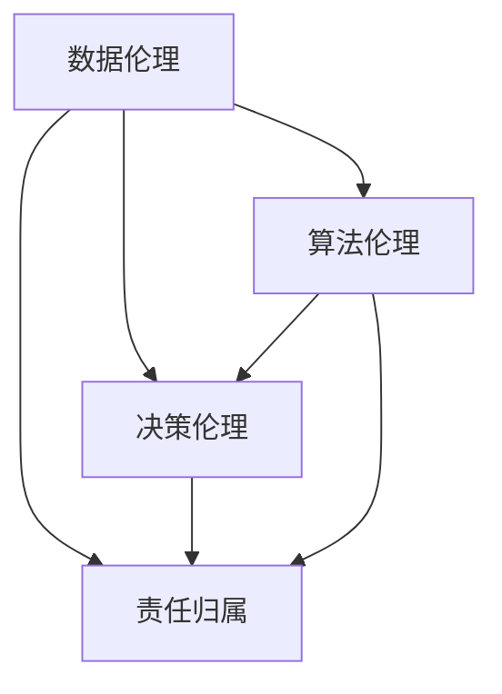

                 

# AI伦理的技术内在化:将伦理考量融入AI系统设计

> 关键词：AI伦理,技术内在化,系统设计,道德计算,人工智能

## 1. 背景介绍

### 1.1 问题由来
近年来，人工智能（AI）技术的发展迅猛，在医疗、金融、教育等诸多领域取得了显著进展。然而，AI系统的广泛应用也带来了诸多伦理问题，如数据隐私、算法偏见、决策透明性等，亟需引起关注。如何在大规模部署AI系统的过程中，将伦理考量纳入技术设计，成为当前研究的重要课题。

### 1.2 问题核心关键点
AI伦理的技术内在化，即在设计AI系统时，充分考虑其伦理影响，并将这些伦理考量转化为系统的核心组成部分。其核心在于：

1. **数据伦理**：确保数据采集、处理和使用过程的透明性和公平性，防止数据滥用和隐私泄露。
2. **算法伦理**：开发公正、可解释的算法模型，避免算法偏见和误判。
3. **决策伦理**：设计伦理化的决策框架，确保AI系统的决策过程符合人类价值观和社会规范。
4. **责任归属**：明确AI系统在行为结果中的责任归属，建立问责机制。

本文将从数据伦理、算法伦理、决策伦理和责任归属四个方面，深入探讨如何将伦理考量融入AI系统设计，提出具体的操作方法和策略。

### 1.3 问题研究意义
AI伦理的技术内在化研究具有重要意义：

1. **提升AI系统可靠性**：将伦理考量融入系统设计，有助于避免伦理风险，提高AI系统的可靠性和安全性。
2. **促进社会公平**：确保AI系统在数据、算法、决策等关键环节的公平性，有助于消除社会不公现象，推动社会公平进步。
3. **增强公众信任**：通过透明、公正的设计理念，增强公众对AI技术的信任和接受度。
4. **推动技术规范**：为AI技术的规范化发展提供伦理指导，促进AI技术健康、可持续的发展。

## 2. 核心概念与联系

### 2.1 核心概念概述

为更好地理解将伦理考量融入AI系统设计的方法，本节将介绍几个关键概念及其相互联系：

- **数据伦理（Data Ethics）**：涉及数据的收集、存储、处理和使用过程中的伦理问题，如数据隐私、数据泄露、数据偏见等。
- **算法伦理（Algorithm Ethics）**：关注算法模型的设计、训练和应用中的伦理问题，如算法偏见、算法透明性、算法公平性等。
- **决策伦理（Decision Ethics）**：探讨AI系统在决策过程中如何体现伦理价值，如决策透明性、可解释性、责任归属等。
- **责任归属（Accountability）**：确定AI系统在行动结果中的责任归属，确保在出现伦理问题时，能明确责任主体，追究相关责任。

这些概念之间的联系可以通过以下Mermaid流程图来展示：



这个流程图展示了数据伦理、算法伦理、决策伦理和责任归属之间的相互关系：

1. 数据伦理直接影响算法的设计和训练过程。
2. 算法伦理影响决策的公平性和透明性。
3. 决策伦理确保AI系统的行为符合伦理标准。
4. 责任归属确保在伦理问题发生时，能明确责任主体。

## 3. 核心算法原理 & 具体操作步骤
### 3.1 算法原理概述

将伦理考量融入AI系统设计的核心在于构建伦理计算框架。该框架将伦理原则转化为具体的算法和技术手段，确保系统在各个环节都能体现伦理价值。

### 3.2 算法步骤详解

构建伦理计算框架的一般步骤如下：

**Step 1: 伦理目标设定**
- 明确系统的伦理目标，如保护用户隐私、避免算法偏见、确保决策透明性等。

**Step 2: 伦理评估与监控**
- 设计伦理评估指标，监控系统在各个环节的伦理表现，确保其符合伦理目标。

**Step 3: 伦理技术融合**
- 将伦理技术手段融入系统设计，如数据匿名化、算法公平性约束、决策透明化等。

**Step 4: 伦理培训与测试**
- 对系统进行伦理培训和测试，确保其各项伦理功能正常运行。

**Step 5: 伦理反馈与优化**
- 根据伦理评估和用户反馈，持续优化系统设计，提升伦理表现。

### 3.3 算法优缺点

将伦理考量融入AI系统设计具有以下优点：

1. **提升系统可靠性**：通过伦理设计，避免伦理风险，提高系统可靠性。
2. **促进社会公平**：确保AI系统在关键环节的公平性，消除社会不公现象。
3. **增强公众信任**：透明、公正的设计理念，增强公众对AI系统的信任。
4. **推动技术规范**：为AI技术的规范化发展提供伦理指导。

然而，该方法也存在一些局限性：

1. **复杂性增加**：伦理考量增加了系统设计的复杂性，可能影响系统性能。
2. **伦理标准多样**：不同文化和地区对伦理有不同的理解和标准，难以统一。
3. **伦理评估困难**：伦理评估往往依赖主观判断，难以量化和自动化。

尽管存在这些局限性，但将伦理考量融入AI系统设计是确保AI技术健康发展的必要步骤。

### 3.4 算法应用领域

伦理计算框架已经在诸多领域得到应用，如医疗、金融、司法等。以下是几个典型的应用场景：

**医疗领域**：确保患者数据隐私，避免算法偏见，提高医疗决策的公平性和透明性。

**金融领域**：确保金融产品设计的公平性，防止算法偏见，确保金融决策的透明性和可解释性。

**司法领域**：确保司法决策的公正性和透明性，防止算法偏见，提升司法系统的公平性。

## 4. 数学模型和公式 & 详细讲解
### 4.1 数学模型构建

伦理计算框架的数学模型构建，涉及将伦理原则转化为具体的算法和技术手段。以下以数据隐私保护为例，构建一个简单的数学模型。

**隐私保护模型**：
- **目标**：保护用户隐私，确保数据匿名化。
- **输入**：原始数据集 $D=\{x_i\}_{i=1}^N$。
- **输出**：匿名化数据集 $D^*$。

**隐私保护模型的构建**：

1. **数据预处理**：对原始数据进行标准化、归一化等处理。
2. **差分隐私约束**：引入差分隐私机制，确保数据处理过程对个体隐私的影响最小。
3. **数据匿名化**：使用k-匿名化或t-参与者匿名化技术，确保数据集中个体不可识别。

### 4.2 公式推导过程

以差分隐私机制为例，推导隐私保护模型的数学公式。

**差分隐私机制**：
- **目标**：在保护用户隐私的同时，确保数据分析结果的可用性。
- **输入**：原始数据集 $D=\{x_i\}_{i=1}^N$，隐私参数 $\epsilon$。
- **输出**：差分隐私处理的匿名化数据集 $D^*$。

差分隐私的目标是在保证数据分析结果的可用性的同时，确保数据处理的隐私性。通过在数据分析过程中引入噪声，确保每个数据点对结果的影响可以被忽视，从而保护用户隐私。

**差分隐私的数学公式**：

$$
\hat{f}(x) = \mathop{\arg\min}_{f} \|f(D^*)-f(D)\|^2 + \frac{\epsilon}{2\delta}\ln\frac{2}{\delta}
$$

其中，$\hat{f}(x)$ 表示差分隐私处理的分析函数，$f(D)$ 表示原始数据集 $D$ 的分析结果，$D^*$ 表示差分隐私处理后的匿名化数据集，$\epsilon$ 表示隐私参数，$\delta$ 表示结果偏差容忍度。

### 4.3 案例分析与讲解

以金融信用评分为例，分析如何构建伦理计算框架，确保评分系统的公平性和透明性。

**数据隐私保护**：
- **目标**：保护客户数据隐私，防止数据滥用。
- **输入**：客户数据集 $D=\{x_i,y_i\}_{i=1}^N$。
- **输出**：匿名化数据集 $D^*$。

**差分隐私约束**：
- **目标**：确保数据处理对个体隐私的影响最小。
- **输入**：差分隐私参数 $\epsilon$。
- **输出**：差分隐私处理的匿名化数据集 $D^*$。

**算法公平性约束**：
- **目标**：确保评分系统的公平性，防止算法偏见。
- **输入**：评分模型 $f(x)$。
- **输出**：公平性约束后的评分模型 $f^*(x)$。

**决策透明性**：
- **目标**：确保评分过程透明，可解释。
- **输入**：评分模型 $f^*(x)$。
- **输出**：透明评分结果 $y^*$。

## 5. 项目实践：代码实例和详细解释说明
### 5.1 开发环境搭建

在进行伦理计算框架的开发时，需要准备相应的开发环境。以下是使用Python进行PyTorch开发的环境配置流程：

1. 安装Anaconda：从官网下载并安装Anaconda，用于创建独立的Python环境。

2. 创建并激活虚拟环境：
```bash
conda create -n pytorch-env python=3.8 
conda activate pytorch-env
```

3. 安装PyTorch：根据CUDA版本，从官网获取对应的安装命令。例如：
```bash
conda install pytorch torchvision torchaudio cudatoolkit=11.1 -c pytorch -c conda-forge
```

4. 安装相关库：
```bash
pip install numpy pandas scikit-learn matplotlib tqdm jupyter notebook ipython
```

5. 安装差分隐私库：
```bash
pip install pydp
```

完成上述步骤后，即可在`pytorch-env`环境中开始伦理计算框架的开发。

### 5.2 源代码详细实现

以下是一个简单的差分隐私保护的Python代码实现，用于保护用户隐私，确保数据分析结果的可用性。

```python
from pydp.datasets import SensitiveDataset
from pydp.anon import Anonymizer
from pydp.anon.flip import GaussianMechanism
from pydp.anon.laplace import LaplaceMechanism
from pydp.privacy import DP, ExactDP
from pydp.privacy.contrib import report, report_sample_rate
from pydp.fairness import CompFairness

# 创建敏感数据集
data = SensitiveDataset()

# 设置隐私参数
epsilon = 1.0
delta = 1e-5

# 设置差分隐私机制
mech = LaplaceMechanism(epsilon=epsilon)

# 创建匿名化器
anon = Anonymizer(data, mech)

# 进行差分隐私处理
data_anon = anon.anonymize()

# 输出匿名化结果
print(data_anon)
```

### 5.3 代码解读与分析

让我们再详细解读一下关键代码的实现细节：

**SensitiveDataset类**：
- 用于创建敏感数据集，支持常见的NLP数据集类型。

**Anonymizer类**：
- 用于对敏感数据进行匿名化处理，支持多种匿名化技术，如差分隐私、k-匿名化等。

**LaplaceMechanism类**：
- 用于实现拉普拉斯差分隐私机制，通过在数据处理过程中引入噪声，确保数据处理的隐私性。

**CompFairness类**：
- 用于确保算法的公平性，支持公平性约束的建模和评估。

**DP类**：
- 用于实现差分隐私，通过设置隐私参数 $\epsilon$ 和 $\delta$，确保数据处理对个体隐私的影响最小。

通过以上代码实现，我们展示了如何利用差分隐私技术，对敏感数据进行保护，确保数据处理的隐私性。

## 6. 实际应用场景
### 6.1 医疗领域

在医疗领域，AI伦理计算框架的应用主要集中在数据隐私保护和算法公平性约束。

**数据隐私保护**：
- **目标**：保护患者数据隐私，防止数据滥用。
- **实现方式**：通过差分隐私技术，对患者数据进行匿名化处理。
- **效果**：确保患者数据在数据分析过程中不会被识别，保护患者隐私。

**算法公平性约束**：
- **目标**：确保医疗决策的公平性，防止算法偏见。
- **实现方式**：通过公平性约束技术，对医疗算法进行优化。
- **效果**：确保医疗决策对不同患者群体的公平性，消除算法偏见。

**决策透明性**：
- **目标**：确保医疗决策透明，可解释。
- **实现方式**：通过可解释性技术，提供医疗决策的详细解释。
- **效果**：增强患者对医疗决策的理解和信任，提升医疗服务质量。

### 6.2 金融领域

在金融领域，AI伦理计算框架的应用主要集中在信用评分系统的公平性和透明性。

**数据隐私保护**：
- **目标**：保护客户数据隐私，防止数据滥用。
- **实现方式**：通过差分隐私技术，对客户数据进行匿名化处理。
- **效果**：确保客户数据在信用评分过程中不会被识别，保护客户隐私。

**算法公平性约束**：
- **目标**：确保信用评分系统的公平性，防止算法偏见。
- **实现方式**：通过公平性约束技术，对信用评分算法进行优化。
- **效果**：确保信用评分对不同客户群体的公平性，消除算法偏见。

**决策透明性**：
- **目标**：确保信用评分透明，可解释。
- **实现方式**：通过可解释性技术，提供信用评分的详细解释。
- **效果**：增强客户对信用评分结果的理解和信任，提升信用评分系统的公平性。

## 7. 工具和资源推荐
### 7.1 学习资源推荐

为了帮助开发者系统掌握伦理计算框架的理论基础和实践技巧，这里推荐一些优质的学习资源：

1. 《人工智能伦理与法律》系列课程：由人工智能伦理专家主讲，涵盖人工智能伦理的基本原理、法律规范和实践应用。

2. 《AI伦理计算框架》书籍：系统介绍如何在大规模AI系统中融入伦理考量，确保系统的可靠性和公平性。

3. 《差分隐私：保护隐私的技术基础》：介绍差分隐私的基本概念和技术手段，确保数据处理的隐私性。

4. 《公平性约束与可解释性》：探讨如何实现算法的公平性和可解释性，确保AI系统的透明性和可理解性。

5. AI伦理相关论文和报告：深入研究AI伦理的最新动态和技术进展，提供丰富的实践案例和理论指导。

通过对这些资源的学习实践，相信你一定能够快速掌握伦理计算框架的精髓，并用于解决实际的伦理问题。

### 7.2 开发工具推荐

高效的开发离不开优秀的工具支持。以下是几款用于伦理计算框架开发的常用工具：

1. PyTorch：基于Python的开源深度学习框架，灵活动态的计算图，适合快速迭代研究。大部分AI伦理计算框架都有PyTorch版本的实现。

2. TensorFlow：由Google主导开发的开源深度学习框架，生产部署方便，适合大规模工程应用。同样有丰富的AI伦理计算框架资源。

3. PyDP：用于差分隐私计算的Python库，支持多种差分隐私技术，方便实现隐私保护。

4. Scikit-learn：用于数据预处理和分析的Python库，支持多种数据处理技术，确保数据处理的公平性和隐私性。

5. Jupyter Notebook：轻量级的交互式编程环境，支持多种编程语言和库，方便开发者进行实验和协作。

合理利用这些工具，可以显著提升伦理计算框架的开发效率，加快创新迭代的步伐。

### 7.3 相关论文推荐

伦理计算框架的发展源于学界的持续研究。以下是几篇奠基性的相关论文，推荐阅读：

1. Privacy-Preserving Deep Learning：探讨如何在深度学习中实现隐私保护，确保数据处理的隐私性。

2. Fairness in Machine Learning：研究如何实现算法的公平性，防止算法偏见。

3. Explainable Artificial Intelligence：探讨如何实现算法的可解释性，增强AI系统的透明性和可理解性。

4. AI伦理计算框架：介绍如何在大规模AI系统中融入伦理考量，确保系统的可靠性和公平性。

这些论文代表了大规模AI系统中伦理计算框架的发展脉络。通过学习这些前沿成果，可以帮助研究者把握学科前进方向，激发更多的创新灵感。

## 8. 总结：未来发展趋势与挑战
### 8.1 总结

本文对将伦理考量融入AI系统设计的方法进行了全面系统的介绍。首先阐述了伦理计算框架的研究背景和意义，明确了伦理计算框架在确保AI系统可靠性、促进社会公平、增强公众信任等方面的价值。其次，从数据隐私保护、算法公平性约束、决策透明性和责任归属四个方面，详细讲解了伦理计算框架的具体实现方法和策略。

通过本文的系统梳理，可以看到，伦理计算框架在AI系统设计中具有重要地位。将伦理考量融入AI系统设计，有助于避免伦理风险，提高AI系统的可靠性和公平性。未来，伴随伦理计算框架的不断优化，AI系统将在各个领域中发挥更加积极的社会作用。

### 8.2 未来发展趋势

展望未来，伦理计算框架将呈现以下几个发展趋势：

1. **技术融合加速**：随着AI技术的发展，伦理计算框架将与其他AI技术（如自然语言处理、计算机视觉等）进行更深入的融合，提升AI系统的综合表现。

2. **伦理标准统一**：不同文化和地区对伦理有不同的理解和标准，未来将进一步推动伦理标准的统一，为伦理计算框架提供更一致的指导。

3. **伦理计算自动化**：随着技术的发展，伦理计算框架将逐渐实现自动化，通过算法自动进行伦理评估和优化，提升伦理计算的效率和精度。

4. **伦理计算平台化**：将伦理计算框架集成到AI开发平台中，为开发者提供一站式的伦理计算解决方案，降低伦理计算的复杂度。

这些趋势凸显了伦理计算框架在AI系统设计中的重要性，未来的研究将进一步推动伦理计算的规范化、自动化和平台化。

### 8.3 面临的挑战

尽管伦理计算框架已经取得了一定的进展，但在迈向更加智能化、普适化应用的过程中，仍面临诸多挑战：

1. **伦理评估复杂性**：伦理评估往往依赖主观判断，难以量化和自动化，增加了伦理计算的复杂性。

2. **伦理标准多样性**：不同文化和地区对伦理有不同的理解和标准，难以统一伦理标准。

3. **伦理计算资源消耗**：伦理计算需要在数据预处理、算法设计等方面进行额外投入，增加了计算资源消耗。

4. **伦理计算平台化困难**：将伦理计算集成到AI开发平台中，需要克服技术上的复杂性和实现上的挑战。

尽管存在这些挑战，但伦理计算框架的研究仍在不断进步，未来有望在更广泛的领域中发挥作用。

### 8.4 研究展望

未来，伦理计算框架的研究方向将在以下几个方面继续深入：

1. **伦理计算自动化**：通过算法和技术手段，实现伦理计算的自动化，降低伦理评估和优化的复杂性。

2. **伦理计算平台化**：将伦理计算集成到AI开发平台中，提供一站式的伦理计算解决方案。

3. **伦理计算多模态融合**：将伦理计算与视觉、语音等多模态数据融合，提升AI系统的综合表现。

4. **伦理计算跨领域应用**：将伦理计算框架应用于更多领域，如金融、医疗、教育等，提升各行业的伦理水平。

这些研究方向的探索，必将推动伦理计算框架的规范化、自动化和平台化，为AI系统的伦理化发展提供更坚实的技术基础。面向未来，伦理计算框架将在AI系统的设计中扮演越来越重要的角色。

## 9. 附录：常见问题与解答

**Q1：伦理计算框架在实际应用中是否具有可行性？**

A: 伦理计算框架在实际应用中具有可行性。通过在AI系统的各个环节融入伦理考量，可以有效避免伦理风险，提高系统的可靠性和公平性。虽然伦理计算增加了系统的复杂性，但通过合理设计和管理，可以在不影响系统性能的前提下，确保系统的伦理表现。

**Q2：如何平衡伦理计算和系统性能？**

A: 伦理计算和系统性能的平衡是一个复杂的问题，需要根据具体应用场景进行优化。一般来说，可以通过以下方法平衡伦理计算和系统性能：

1. 合理设计伦理目标：明确系统的伦理目标，确保在关键环节体现伦理价值。

2. 选择合适的伦理技术：根据应用场景选择合适的伦理技术，如差分隐私、公平性约束等。

3. 优化系统设计：通过优化系统设计，降低伦理计算对系统性能的影响。

4. 持续评估和优化：根据伦理评估和用户反馈，持续优化系统设计，提升伦理表现。

**Q3：如何确保伦理计算的透明度和可解释性？**

A: 确保伦理计算的透明度和可解释性是伦理计算框架的关键。可以通过以下方法实现：

1. 引入可解释性技术：使用可解释性技术，提供伦理计算的详细解释，确保用户和开发者对系统的理解。

2. 设计透明接口：通过设计透明的API接口，方便用户和开发者进行伦理计算。

3. 记录伦理日志：记录伦理计算的详细过程，方便审计和评估。

**Q4：伦理计算框架在实现过程中需要注意哪些问题？**

A: 在实现伦理计算框架时，需要注意以下问题：

1. 伦理评估标准：确保伦理评估标准的公正性和合理性，避免伦理评估的主观性和不公正性。

2. 数据隐私保护：确保数据隐私在处理和传输过程中得到充分保护，防止数据泄露。

3. 算法公平性约束：确保算法的公平性，防止算法偏见。

4. 决策透明性：确保决策过程透明，可解释，方便用户和开发者理解和信任系统。

**Q5：伦理计算框架在AI系统的各个环节如何体现？**

A: 伦理计算框架在AI系统的各个环节主要体现在以下几个方面：

1. **数据采集**：确保数据采集过程符合伦理标准，保护数据隐私。

2. **数据预处理**：通过差分隐私技术，确保数据处理的隐私性。

3. **模型训练**：通过公平性约束技术，确保模型训练的公平性，防止算法偏见。

4. **决策过程**：确保决策过程透明，可解释，符合伦理标准。

通过在各个环节融入伦理考量，伦理计算框架可以有效提升AI系统的可靠性和公平性，确保系统的伦理表现。

---

作者：禅与计算机程序设计艺术 / Zen and the Art of Computer Programming

