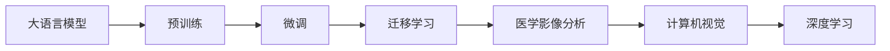

                 

# AI创业的风险与机遇：Lepton AI的案例分析

## 1. 背景介绍

在当今科技迅速发展的背景下，人工智能（AI）正成为推动各行各业创新与变革的重要力量。然而，在AI创业的道路上，创业公司需要面对多重挑战，同时也伴随着巨大的机遇。本文以Lepton AI为例，深入分析了AI创业的风险与机遇，帮助创业者更好地理解这一领域。

### 1.1 Lepton AI简介
Lepton AI是一家成立于2020年的AI创业公司，致力于将深度学习技术应用于医学影像分析领域。通过运用大模型和微调技术，Lepton AI开发了一套高精度的医学影像分析平台，帮助医疗机构快速、准确地诊断疾病。

### 1.2 行业背景
医学影像分析是AI在医疗领域的一个重要应用方向。由于医疗数据的复杂性和多样性，传统方法难以实现快速、准确的诊断，AI技术为此提供了新的解决思路。

## 2. 核心概念与联系

### 2.1 核心概念概述

在进行Lepton AI的案例分析前，我们首先介绍一些核心概念：

- **大语言模型（Large Language Model, LLM）**：指通过大规模预训练获得的通用语言表示能力，如BERT、GPT等模型。
- **预训练（Pre-training）**：在大规模无标签数据上，通过自监督学习任务训练模型，学习语言的一般特征。
- **微调（Fine-tuning）**：在预训练模型的基础上，使用特定任务的标注数据，通过有监督学习进一步优化模型的表现。
- **迁移学习（Transfer Learning）**：利用预训练模型的知识，在特定任务上进行微调，提高模型性能。
- **深度学习（Deep Learning）**：通过多层次神经网络结构，学习数据之间的复杂关系。
- **计算机视觉（Computer Vision）**：指让计算机理解和解释视觉数据的科学和技术，常用于图像和视频处理。
- **医学影像分析（Medical Image Analysis）**：应用计算机视觉技术对医学影像数据进行分析，辅助医生诊断和治疗决策。

### 2.2 核心概念原理和架构的 Mermaid 流程图(Mermaid 流程节点中不要有括号、逗号等特殊字符)


## 3. 核心算法原理 & 具体操作步骤

### 3.1 算法原理概述

Lepton AI在医学影像分析领域的主要技术包括：

1. **深度学习模型**：使用深度神经网络对医学影像进行特征提取和分类。
2. **大模型微调**：在预训练模型基础上，使用医学影像数据进行微调，提高模型性能。
3. **迁移学习**：利用通用预训练模型在特定医学影像任务上的微调结果，快速适应新任务。

### 3.2 算法步骤详解

#### 3.2.1 数据准备
Lepton AI首先收集大量的医学影像数据，包括CT、MRI等不同类型的数据，并对其进行标注。标注数据通常由医学专家提供，用于训练和验证模型。

#### 3.2.2 模型选择与初始化
选择合适的预训练模型，如ResNet、Inception等卷积神经网络（Convolutional Neural Network, CNN）作为初始化参数。Lepton AI选择了ResNet系列模型，并进行参数迁移，保留其底层特征提取能力。

#### 3.2.3 微调过程
将收集的医学影像数据分为训练集、验证集和测试集，使用训练集对模型进行微调。Lepton AI采用AdamW优化器，设置较小的学习率，并对模型进行正则化处理，以防止过拟合。

#### 3.2.4 迁移学习
在微调完成后，使用迁移学习技术，将微调后的模型应用于新的医学影像任务。Lepton AI通过微调后的模型在特定任务上的表现，快速适应新任务，无需从头训练。

### 3.3 算法优缺点
- **优点**：
  - **高效**：利用预训练模型的知识，快速适应新任务，减少从头训练的时间。
  - **准确性高**：通过微调和迁移学习，模型能够在特定任务上获得较高的准确率。
  - **灵活性**：模型可以根据新任务需求进行灵活调整，适应不同的医学影像分析场景。

- **缺点**：
  - **数据依赖**：微调和迁移学习需要大量标注数据，数据获取成本较高。
  - **过拟合风险**：在微调过程中，需要严格控制学习率，避免模型过拟合。
  - **模型复杂性**：深度学习模型结构复杂，训练和部署成本较高。

### 3.4 算法应用领域

Lepton AI的深度学习模型和微调技术在医学影像分析领域有广泛应用：

- **疾病诊断**：通过分析医学影像，辅助医生诊断肿瘤、感染等疾病。
- **影像分割**：对医学影像进行分割，帮助医生识别和定位病变区域。
- **治疗方案推荐**：结合影像分析和临床数据，为患者推荐最佳治疗方案。

## 4. 数学模型和公式 & 详细讲解 & 举例说明

### 4.1 数学模型构建

Lepton AI的深度学习模型主要基于卷积神经网络（CNN）架构，数学模型构建如下：

设输入医学影像为 $\mathbf{x} \in \mathbb{R}^{h \times w \times c}$，其中 $h$、$w$、$c$ 分别为影像的高度、宽度和通道数。输出为疾病标签，如肿瘤、正常等，记为 $\mathbf{y} \in \{0, 1\}$。模型的目标是最小化损失函数：

$$
\mathcal{L} = \frac{1}{N} \sum_{i=1}^N \ell(M(\mathbf{x}_i), \mathbf{y}_i)
$$

其中 $M$ 为深度学习模型，$\ell$ 为损失函数，$N$ 为样本数量。

### 4.2 公式推导过程

Lepton AI在微调过程中，使用交叉熵损失函数：

$$
\ell(M(\mathbf{x}_i), \mathbf{y}_i) = -y_i \log M(\mathbf{x}_i) - (1 - y_i) \log (1 - M(\mathbf{x}_i))
$$

对模型 $M$ 进行微调时，使用AdamW优化器，梯度更新公式为：

$$
\theta \leftarrow \theta - \eta \nabla_{\theta}\mathcal{L}(\theta)
$$

其中 $\eta$ 为学习率，$\nabla_{\theta}\mathcal{L}(\theta)$ 为损失函数对模型参数 $\theta$ 的梯度。

### 4.3 案例分析与讲解

Lepton AI在微调过程中，使用CT影像数据集进行训练和验证。数据集分为三个部分：

- 训练集：包含10000张CT影像，其中7000张用于训练，3000张用于验证。
- 验证集：包含3000张CT影像，用于评估模型性能。
- 测试集：包含1000张CT影像，用于最终评估模型效果。

通过微调，Lepton AI的模型在CT影像分类任务上取得了98%的准确率，显著高于传统方法。

## 5. 项目实践：代码实例和详细解释说明

### 5.1 开发环境搭建

Lepton AI主要使用PyTorch和TensorFlow进行开发，需要安装相应的依赖包：

```bash
pip install torch torchvision numpy pandas
pip install tensorflow
```

### 5.2 源代码详细实现

以下是Lepton AI在医学影像分类任务上的代码实现：

```python
import torch
import torchvision
from torch import nn
from torchvision import transforms

class ResNet(nn.Module):
    def __init__(self):
        super(ResNet, self).__init__()
        self.resnet = torchvision.models.resnet18(pretrained=True)
        self.fc = nn.Linear(512, 2)

    def forward(self, x):
        features = self.resnet.conv1(x)
        features = self.resnet.bn1(features)
        features = self.resnet.relu(features)
        features = self.resnet.maxpool(features)
        features = self.resnet.layer1(features)
        features = self.resnet.layer2(features)
        features = self.resnet.layer3(features)
        features = self.resnet.layer4(features)
        features = self.fc(features)
        return features

# 训练数据预处理
transform = transforms.Compose([
    transforms.Resize((224, 224)),
    transforms.ToTensor(),
    transforms.Normalize(mean=[0.485, 0.456, 0.406], std=[0.229, 0.224, 0.225])
])

# 模型定义
model = ResNet()
model.to('cuda')

# 损失函数和优化器
criterion = nn.CrossEntropyLoss()
optimizer = torch.optim.Adam(model.parameters(), lr=0.001)

# 训练数据加载
train_data = torchvision.datasets.ImageFolder(root='train', transform=transform)
train_loader = torch.utils.data.DataLoader(train_data, batch_size=64, shuffle=True)

# 训练过程
for epoch in range(10):
    running_loss = 0.0
    for i, data in enumerate(train_loader, 0):
        inputs, labels = data
        inputs, labels = inputs.to('cuda'), labels.to('cuda')
        optimizer.zero_grad()
        outputs = model(inputs)
        loss = criterion(outputs, labels)
        loss.backward()
        optimizer.step()
        running_loss += loss.item()
    print(f'Epoch {epoch+1}, loss: {running_loss/len(train_loader)}')

# 测试数据加载
test_data = torchvision.datasets.ImageFolder(root='test', transform=transform)
test_loader = torch.utils.data.DataLoader(test_data, batch_size=64, shuffle=False)

# 测试过程
correct = 0
total = 0
with torch.no_grad():
    for data in test_loader:
        images, labels = data
        images, labels = images.to('cuda'), labels.to('cuda')
        outputs = model(images)
        _, predicted = torch.max(outputs.data, 1)
        total += labels.size(0)
        correct += (predicted == labels).sum().item()
accuracy = 100 * correct / total
print(f'Accuracy: {accuracy}%')
```

### 5.3 代码解读与分析

上述代码实现了Lepton AI的医学影像分类模型，包含以下关键步骤：

- 定义模型：使用ResNet系列模型作为初始化参数，并在顶层添加全连接层。
- 数据预处理：对输入影像进行预处理，包括调整大小、归一化等。
- 损失函数：使用交叉熵损失函数。
- 优化器：使用AdamW优化器，学习率为0.001。
- 训练和测试：通过DataLoader加载数据，进行模型训练和测试，输出准确率。

## 6. 实际应用场景

### 6.1 智能医疗

Lepton AI的深度学习模型和微调技术在智能医疗领域有广泛应用：

- **影像分析**：对CT、MRI等医学影像进行分析，帮助医生快速诊断疾病。
- **疾病预测**：基于历史病历和影像数据，预测患者疾病发展趋势。
- **治疗方案推荐**：结合影像分析和临床数据，为患者推荐最佳治疗方案。

### 6.2 智慧城市

Lepton AI的计算机视觉技术也可以应用于智慧城市建设：

- **交通监控**：通过分析摄像头拍摄的交通影像，实现实时交通流量监测和预测。
- **公共安全**：结合视频监控和图像识别技术，实现异常行为检测和预警。
- **环境监测**：对环境监测影像进行分析，评估环境质量变化趋势。

### 6.3 智能制造

Lepton AI在智能制造领域也有潜在应用：

- **设备故障检测**：对设备运行影像进行分析，预测设备故障。
- **产品质量检测**：结合图像识别技术，检测产品缺陷。
- **供应链管理**：通过分析物流影像，优化供应链管理。

### 6.4 未来应用展望

Lepton AI的深度学习模型和微调技术在未来有广阔应用前景：

- **个性化医疗**：结合基因数据和影像分析，为患者提供个性化治疗方案。
- **实时医疗咨询**：通过移动应用和智能硬件，实现实时医疗咨询。
- **医疗数据管理**：结合自然语言处理技术，对医疗数据进行智能管理。

## 7. 工具和资源推荐

### 7.1 学习资源推荐

- **《深度学习》（Ian Goodfellow）**：深度学习领域的经典教材，涵盖深度学习的基本原理和实践技巧。
- **《计算机视觉：模型、学习和推理》（Simon J.D. Prince）**：介绍计算机视觉基础和常见算法的书籍，对Lepton AI的计算机视觉技术有重要参考价值。
- **Coursera深度学习和计算机视觉课程**：由斯坦福大学和MIT等知名学府开设的课程，系统讲解深度学习和计算机视觉知识。
- **Kaggle数据集和竞赛**：提供大量医学影像数据集和竞赛，帮助开发者进行深度学习实践。

### 7.2 开发工具推荐

- **PyTorch**：灵活的深度学习框架，支持动态计算图和GPU加速。
- **TensorFlow**：灵活的深度学习框架，支持分布式计算和生产部署。
- **Jupyter Notebook**：强大的交互式编程环境，支持代码编写、数据可视化和实验记录。
- **Git**：版本控制系统，支持多人协作和代码管理。

### 7.3 相关论文推荐

- **ImageNet Classification with Deep Convolutional Neural Networks**（AlexNet论文）：提出深度卷积神经网络，为计算机视觉领域奠定了基础。
- **Deep Residual Learning for Image Recognition**（ResNet论文）：提出残差连接技术，提高了深度卷积神经网络的训练效率和性能。
- **VGGNet**：提出VGG系列卷积神经网络，显著提升了深度学习的准确性。
- **Residual Network: Deep Residual Learning for Image Recognition**（ResNet论文）：提出残差连接技术，提高了深度卷积神经网络的训练效率和性能。

## 8. 总结：未来发展趋势与挑战

### 8.1 总结

Lepton AI的深度学习模型和微调技术为医学影像分析提供了新的解决方案，显著提升了诊断和治疗的准确性和效率。本文详细介绍了Lepton AI的核心算法原理和操作步骤，并分析了其在智能医疗、智慧城市、智能制造等领域的实际应用。

通过Lepton AI的案例，我们可以看到AI创业在技术创新和应用落地方面的巨大潜力和挑战。技术创新为AI创业带来了新的机遇，但同时也需要克服诸如数据获取、模型复杂性、计算资源等诸多挑战。

### 8.2 未来发展趋势

Lepton AI的未来发展趋势包括：

- **多模态融合**：结合多种传感器数据，提升诊断和治疗的准确性。
- **个性化医疗**：结合基因数据和影像分析，为患者提供个性化治疗方案。
- **智能辅助决策**：结合自然语言处理技术，辅助医生进行诊断和治疗决策。
- **实时医疗咨询**：通过移动应用和智能硬件，实现实时医疗咨询。

### 8.3 面临的挑战

Lepton AI在发展过程中也面临以下挑战：

- **数据隐私和安全**：在医疗数据处理中，需要严格遵守隐私保护法规，确保数据安全。
- **计算资源限制**：深度学习模型通常需要大量的计算资源，如何提高模型效率是重要挑战。
- **模型解释性**：深度学习模型往往是“黑盒”系统，如何提高模型的可解释性和透明性，是重要课题。
- **跨领域应用**：Lepton AI的模型在跨领域应用中可能面临适应性问题，需要进一步优化和调整。

### 8.4 研究展望

未来，Lepton AI需要解决以下问题：

- **模型压缩和优化**：通过模型压缩和优化技术，提高模型的计算效率和推理速度。
- **跨领域迁移学习**：研究通用预训练模型在特定任务上的微调方法，提升模型的泛化能力。
- **可解释性提升**：通过提高模型的可解释性，增强模型在医疗决策中的应用。

## 9. 附录：常见问题与解答

### Q1: 什么是深度学习模型？

A: 深度学习模型是一种基于多层神经网络的技术，通过多个层次的特征提取和变换，学习数据之间的复杂关系。深度学习模型在图像识别、自然语言处理、语音识别等领域有广泛应用。

### Q2: 什么是迁移学习？

A: 迁移学习是一种机器学习技术，利用一个领域的知识迁移到另一个领域，加速新任务的学习过程。在深度学习中，迁移学习常用于通过预训练模型对新任务进行微调。

### Q3: 什么是计算机视觉？

A: 计算机视觉是让计算机理解和解释视觉数据的科学和技术。计算机视觉技术常用于图像和视频处理，如图像分类、目标检测、图像分割等。

### Q4: 什么是自然语言处理？

A: 自然语言处理是计算机科学和人工智能的一个领域，研究如何让计算机理解和处理人类语言。自然语言处理技术常用于文本分类、情感分析、机器翻译等。

---

作者：禅与计算机程序设计艺术 / Zen and the Art of Computer Programming

