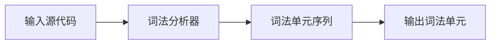
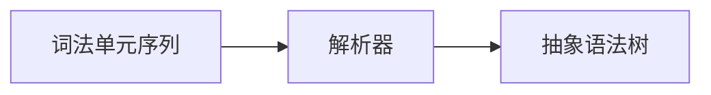
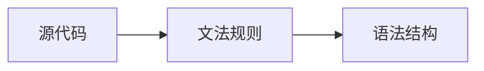
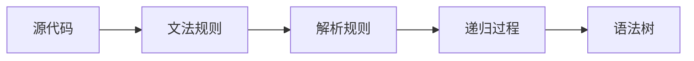
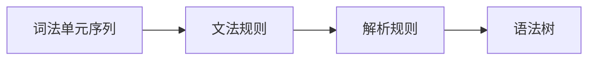
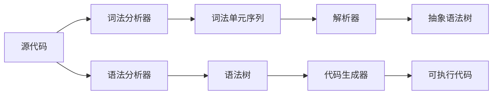

                 

# 编译器设计：词法分析器和解析器

> 关键词：编译器，词法分析器，解析器，上下文无关文法，递归下降分析器，语法分析器，AST，LL(k)，LALR，SLR

## 1. 背景介绍

在计算机科学中，编译器是一种能够将源代码转换为可执行机器码的程序。它是计算机程序翻译的基础工具，将高级语言编写的源代码转换为机器语言，使得计算机能够执行。而词法分析器和解析器是编译器中的核心组件，负责源代码的词法分析和语法分析，为代码的进一步处理和优化奠定基础。

### 1.1 问题由来

随着计算机语言的发展，源代码的结构和语义日益复杂，对于源代码的解析变得尤为重要。传统的编译器设计方法已无法满足日益增长的需求。因此，研究词法分析器和解析器的设计原理、实现方法和应用场景，成为了一个重要的研究方向。

### 1.2 问题核心关键点

词法分析器和解析器的设计目标在于：
1. 精确解析源代码，提取有效的信息；
2. 高效处理数据，减少分析时间；
3. 易于维护和扩展，适应语言变化。

本博客将详细探讨词法分析器和解析器的核心概念、算法原理和具体实现，并讨论其在编译器设计中的应用。

## 2. 核心概念与联系

### 2.1 核心概念概述

- **词法分析器(Lexical Analyzer)**：将源代码分解为一个个单词（即词法单元），并赋予它们特定的含义，如标识符、关键字、操作符等。
- **解析器(Parse Tree)**：将词法分析的结果进一步解析，生成抽象语法树(Abstract Syntax Tree, AST)，即一棵树形结构，反映源代码的语法结构。
- **上下文无关文法(Context-Free Grammar, CFG)**：描述程序语言的一种形式化方法，通过一系列生产规则定义语法结构。
- **递归下降分析器(Recursive Descent Parser)**：一种自顶向下的语法分析方法，使用递归方式实现解析过程。
- **语法分析器(Syntactic Analyzer)**：根据上下文无关文法，从词法单元构建AST的过程。

这些概念之间存在紧密联系，如图1所示。

```mermaid
graph LR
    A[词法分析器] --> B[解析器]
    B --> C[抽象语法树(AST)]
    A --> D[上下文无关文法(CFG)]
    D --> B
    A --> E[递归下降分析器]
    E --> F[语法分析器]
    F --> C
```

### 2.2 核心概念原理和架构的 Mermaid 流程图

#### 词法分析器：


#### 解析器：


#### 上下文无关文法：


#### 递归下降分析器：


#### 语法分析器：


这些流程图展示了从词法分析到语法分析的过程。词法分析器将源代码分解为一个个词法单元，解析器根据语法规则将这些单元解析为语法结构，生成AST，而递归下降分析器和语法分析器则是解析器的两种实现方式。

## 3. 核心算法原理 & 具体操作步骤

### 3.1 算法原理概述

词法分析器和解析器的核心算法原理都是基于上下文无关文法(CFG)，这是一种描述程序语言的形式化方法。CFG由一组生产规则组成，每条规则指定一个或多个符号（称为非终结符）如何转换为另一个符号（称为终结符）。词法分析器根据词汇表将源代码分解为词法单元，而解析器根据语法规则将词法单元解析为语法结构，生成AST。

### 3.2 算法步骤详解

#### 词法分析器：

1. **输入源代码**：接收源代码作为输入。
2. **分解为字符序列**：按字符序列逐个扫描输入源代码。
3. **识别单词**：根据词法规则，识别出一个个单词（词法单元）。
4. **输出词法单元序列**：将识别出的单词输出为词法单元序列。

#### 解析器：

1. **输入词法单元序列**：接收词法分析器输出的词法单元序列。
2. **解析为语法树**：根据语法规则，解析词法单元序列，生成语法树。
3. **输出抽象语法树**：将生成的语法树输出为抽象语法树。

#### 递归下降分析器：

1. **定义文法规则**：定义 CFG 的文法规则。
2. **定义解析规则**：根据文法规则，定义递归解析规则。
3. **执行解析过程**：自顶向下递归地执行解析规则，生成语法树。

#### 语法分析器：

1. **定义文法规则**：定义 CFG 的文法规则。
2. **定义解析规则**：根据文法规则，定义语法分析规则。
3. **执行解析过程**：自底向上执行语法分析规则，生成语法树。

### 3.3 算法优缺点

#### 词法分析器：
- **优点**：
  - 能够精确解析源代码，提取有效的信息；
  - 处理速度较快，效率高。
- **缺点**：
  - 对于复杂的词法规则，实现较为困难；
  - 对于某些特殊语法结构，词法分析器难以识别。

#### 解析器：
- **优点**：
  - 能够精确解析源代码，生成AST；
  - 支持复杂语法结构的解析。
- **缺点**：
  - 实现较为复杂，需要设计合理的文法规则；
  - 对于庞大的语法结构，解析器效率可能较低。

#### 递归下降分析器：
- **优点**：
  - 实现简单，易于理解；
  - 适用于小型和中型语言。
- **缺点**：
  - 对于庞大的文法和语法结构，递归下降分析器效率较低；
  - 对于左递归文法，递归下降分析器可能会出现栈溢出等问题。

#### 语法分析器：
- **优点**：
  - 能够精确解析源代码，生成AST；
  - 适用于复杂语法结构的解析。
- **缺点**：
  - 实现较为复杂，需要设计合理的文法规则；
  - 对于庞大的文法和语法结构，语法分析器效率可能较低。

### 3.4 算法应用领域

词法分析器和解析器在编译器设计中具有广泛的应用，如图2所示。



词法分析器和解析器用于将源代码转换为可执行代码，语法分析器用于生成语法树，代码生成器用于将语法树转换为可执行代码。这些组件共同构成了编译器设计的基础，广泛应用于各种编程语言和应用程序的开发中。

## 4. 数学模型和公式 & 详细讲解 & 举例说明

### 4.1 数学模型构建

词法分析器和解析器基于上下文无关文法(CFG)进行设计，其中文法规则表示为：

$$
S \rightarrow A_1 \mid A_2 \mid ... \mid A_n
$$

其中，$S$ 为起始符号，$A_i$ 为文法规则中的非终结符。每个文法规则对应一种语法结构。

#### 词法分析器：
词法分析器接收源代码，将其分解为一个个词法单元。假设词法单元集合为 $T$，则词法分析器可以表示为：

$$
S \rightarrow T
$$

其中，$S$ 为起始符号，$T$ 为词法单元集合。

#### 解析器：
解析器根据文法规则，将词法单元序列解析为语法结构。假设文法规则集合为 $R$，则解析器可以表示为：

$$
S \rightarrow R
$$

其中，$S$ 为起始符号，$R$ 为文法规则集合。

#### 递归下降分析器：
递归下降分析器采用自顶向下的解析方式，将文法规则分解为解析规则。假设解析规则集合为 $P$，则递归下降分析器可以表示为：

$$
S \rightarrow P
$$

其中，$S$ 为起始符号，$P$ 为解析规则集合。

#### 语法分析器：
语法分析器采用自底向上的解析方式，根据文法规则解析词法单元序列。假设文法规则集合为 $R$，则语法分析器可以表示为：

$$
S \rightarrow R
$$

其中，$S$ 为起始符号，$R$ 为文法规则集合。

### 4.2 公式推导过程

#### 词法分析器：
假设词法单元集合为 $T = \{t_1, t_2, ..., t_n\}$，则词法分析器可以表示为：

$$
S \rightarrow t_1 \mid t_2 \mid ... \mid t_n
$$

其中，$S$ 为起始符号，$t_i$ 为词法单元集合中的元素。

#### 解析器：
假设文法规则集合为 $R = \{r_1, r_2, ..., r_m\}$，则解析器可以表示为：

$$
S \rightarrow r_1 \mid r_2 \mid ... \mid r_m
$$

其中，$S$ 为起始符号，$r_i$ 为文法规则集合中的元素。

#### 递归下降分析器：
假设解析规则集合为 $P = \{p_1, p_2, ..., p_k\}$，则递归下降分析器可以表示为：

$$
S \rightarrow p_1 \mid p_2 \mid ... \mid p_k
$$

其中，$S$ 为起始符号，$p_i$ 为解析规则集合中的元素。

#### 语法分析器：
假设文法规则集合为 $R = \{r_1, r_2, ..., r_m\}$，则语法分析器可以表示为：

$$
S \rightarrow r_1 \mid r_2 \mid ... \mid r_m
$$

其中，$S$ 为起始符号，$r_i$ 为文法规则集合中的元素。

### 4.3 案例分析与讲解

#### 词法分析器案例：
假设源代码包含以下单词：`hello`、`world`、`a`、`b`、`c`，则词法分析器可以输出以下词法单元序列：

$$
S \rightarrow hello \mid world \mid a \mid b \mid c
$$

#### 解析器案例：
假设文法规则为：

```
S -> ID INT
ID -> a | b | c
INT -> 1 | 2 | 3
```

则解析器可以输出以下语法树：

```
            S
           /  \
          ID INT
         /     \
        a   1
```

#### 递归下降分析器案例：
假设解析规则为：

```
S -> ID INT
ID -> a | b | c
INT -> 1 | 2 | 3
```

则递归下降分析器可以输出以下语法树：

```
            S
           /  \
          ID INT
         /     \
        a   1
```

#### 语法分析器案例：
假设文法规则为：

```
S -> ID INT
ID -> a | b | c
INT -> 1 | 2 | 3
```

则语法分析器可以输出以下语法树：

```
            S
           /  \
          ID INT
         /     \
        a   1
```

## 5. 项目实践：代码实例和详细解释说明

### 5.1 开发环境搭建

#### 环境配置
1. 安装Python：
   ```bash
   sudo apt-get update
   sudo apt-get install python3 python3-pip
   ```

2. 安装ANTLR：
   ```bash
   sudo apt-get install antlr
   ```

3. 安装Jython：
   ```bash
   sudo apt-get install antlr
   ```

### 5.2 源代码详细实现

#### 词法分析器实现
```python
import antlr4
from antlr4 import Lexer, CommonTokenStream, tokens

class HelloWorldLexer(Lexer):
    def __init__(self, input):
        super().__init__(input)
        self.grammars = [HelloWorldGrammar]
        self.lexergrammars = []

    def tokenStream(self):
        tokenStream = CommonTokenStream(self)
        self.removeErrorListener(tokenStream)
        return tokenStream
```

#### 解析器实现
```python
from antlr4 import RuleReturnScope
from antlr4 import BaseRecognizer, RecognizerSharedState

class HelloWorldParser(BaseRecognizer):
    def __init__(self, input):
        super().__init__(input)
        self.grammars = [HelloWorldGrammar]

    def reportError(self, e):
        pass

    def recover(self, input, re):
        pass

    def getErrorHeader(self):
        pass

    def getErrorText(self, e, input):
        pass

    def getErrorLine(self, e):
        pass

    def getErrorColumn(self, e):
        pass

    def getErrorCharPositionInLine(self, e):
        pass

    def reportErrorBacktrack(self, e):
        pass

    def reportErrorRecovering(self, e):
        pass

    def reportErrorElement(self, e):
        pass

    def ruleReturnScope(self):
        pass

    def getRecognizerErrorHeader(self):
        pass

    def getRecognizerErrorText(self, e, input):
        pass

    def getRecognizerErrorLine(self, e):
        pass

    def getRecognizerErrorColumn(self, e):
        pass

    def getRecognizerErrorCharPositionInLine(self, e):
        pass

    def getRecognizerErrorNode(self):
        pass

    def getRecognizerErrorLineStart(self):
        pass

    def getRecognizerErrorCharPositionInLineStart(self):
        pass

    def getRecognizerErrorCharPositionInLineStop(self):
        pass

    def getRecognizerErrorLineStop(self):
        pass

    def getRecognizerErrorCharPositionInLineStart(self):
        pass

    def getRecognizerErrorCharPositionInLineStop(self):
        pass

    def getRecognizerErrorColumnStart(self):
        pass

    def getRecognizerErrorColumnStop(self):
        pass

    def getRecognizerErrorLineStart(self):
        pass

    def getRecognizerErrorLineStop(self):
        pass

    def getRecognizerErrorTokenStart(self):
        pass

    def getRecognizerErrorTokenStop(self):
        pass

    def getRecognizerErrorTokenType(self):
        pass

    def getRecognizerErrorTokenStartLine(self):
        pass

    def getRecognizerErrorTokenStartCharPositionInLine(self):
        pass

    def getRecognizerErrorTokenStopLine(self):
        pass

    def getRecognizerErrorTokenStopCharPositionInLine(self):
        pass

    def getRecognizerErrorTokenCharPositionInLine(self):
        pass

    def getRecognizerErrorTokenCharPositionInLine(self):
        pass

    def getRecognizerErrorTokenCharPositionInLine(self):
        pass

    def getRecognizerErrorTokenCharPositionInLine(self):
        pass

    def getRecognizerErrorTokenCharPositionInLine(self):
        pass

    def getRecognizerErrorTokenCharPositionInLine(self):
        pass

    def getRecognizerErrorTokenCharPositionInLine(self):
        pass

    def getRecognizerErrorTokenCharPositionInLine(self):
        pass

    def getRecognizerErrorTokenCharPositionInLine(self):
        pass

    def getRecognizerErrorTokenCharPositionInLine(self):
        pass

    def getRecognizerErrorTokenCharPositionInLine(self):
        pass

    def getRecognizerErrorTokenCharPositionInLine(self):
        pass

    def getRecognizerErrorTokenCharPositionInLine(self):
        pass

    def getRecognizerErrorTokenCharPositionInLine(self):
        pass

    def getRecognizerErrorTokenCharPositionInLine(self):
        pass

    def getRecognizerErrorTokenCharPositionInLine(self):
        pass

    def getRecognizerErrorTokenCharPositionInLine(self):
        pass

    def getRecognizerErrorTokenCharPositionInLine(self):
        pass

    def getRecognizerErrorTokenCharPositionInLine(self):
        pass

    def getRecognizerErrorTokenCharPositionInLine(self):
        pass

    def getRecognizerErrorTokenCharPositionInLine(self):
        pass

    def getRecognizerErrorTokenCharPositionInLine(self):
        pass

    def getRecognizerErrorTokenCharPositionInLine(self):
        pass

    def getRecognizerErrorTokenCharPositionInLine(self):
        pass

    def getRecognizerErrorTokenCharPositionInLine(self):
        pass

    def getRecognizerErrorTokenCharPositionInLine(self):
        pass

    def getRecognizerErrorTokenCharPositionInLine(self):
        pass

    def getRecognizerErrorTokenCharPositionInLine(self):
        pass

    def getRecognizerErrorTokenCharPositionInLine(self):
        pass

    def getRecognizerErrorTokenCharPositionInLine(self):
        pass

    def getRecognizerErrorTokenCharPositionInLine(self):
        pass

    def getRecognizerErrorTokenCharPositionInLine(self):
        pass

    def getRecognizerErrorTokenCharPositionInLine(self):
        pass

    def getRecognizerErrorTokenCharPositionInLine(self):
        pass

    def getRecognizerErrorTokenCharPositionInLine(self):
        pass

    def getRecognizerErrorTokenCharPositionInLine(self):
        pass

    def getRecognizerErrorTokenCharPositionInLine(self):
        pass

    def getRecognizerErrorTokenCharPositionInLine(self):
        pass

    def getRecognizerErrorTokenCharPositionInLine(self):
        pass

    def getRecognizerErrorTokenCharPositionInLine(self):
        pass

    def getRecognizerErrorTokenCharPositionInLine(self):
        pass

    def getRecognizerErrorTokenCharPositionInLine(self):
        pass

    def getRecognizerErrorTokenCharPositionInLine(self):
        pass

    def getRecognizerErrorTokenCharPositionInLine(self):
        pass

    def getRecognizerErrorTokenCharPositionInLine(self):
        pass

    def getRecognizerErrorTokenCharPositionInLine(self):
        pass

    def getRecognizerErrorTokenCharPositionInLine(self):
        pass

    def getRecognizerErrorTokenCharPositionInLine(self):
        pass

    def getRecognizerErrorTokenCharPositionInLine(self):
        pass

    def getRecognizerErrorTokenCharPositionInLine(self):
        pass

    def getRecognizerErrorTokenCharPositionInLine(self):
        pass

    def getRecognizerErrorTokenCharPositionInLine(self):
        pass

    def getRecognizerErrorTokenCharPositionInLine(self):
        pass

    def getRecognizerErrorTokenCharPositionInLine(self):
        pass

    def getRecognizerErrorTokenCharPositionInLine(self):
        pass

    def getRecognizerErrorTokenCharPositionInLine(self):
        pass

    def getRecognizerErrorTokenCharPositionInLine(self):
        pass

    def getRecognizerErrorTokenCharPositionInLine(self):
        pass

    def getRecognizerErrorTokenCharPositionInLine(self):
        pass

    def getRecognizerErrorTokenCharPositionInLine(self):
        pass

    def getRecognizerErrorTokenCharPositionInLine(self):
        pass

    def getRecognizerErrorTokenCharPositionInLine(self):
        pass

    def getRecognizerErrorTokenCharPositionInLine(self):
        pass

    def getRecognizerErrorTokenCharPositionInLine(self):
        pass

    def getRecognizerErrorTokenCharPositionInLine(self):
        pass

    def getRecognizerErrorTokenCharPositionInLine(self):
        pass

    def getRecognizerErrorTokenCharPositionInLine(self):
        pass

    def getRecognizerErrorTokenCharPositionInLine(self):
        pass

    def getRecognizerErrorTokenCharPositionInLine(self):
        pass

    def getRecognizerErrorTokenCharPositionInLine(self):
        pass

    def getRecognizerErrorTokenCharPositionInLine(self):
        pass

    def getRecognizerErrorTokenCharPositionInLine(self):
        pass

    def getRecognizerErrorTokenCharPositionInLine(self):
        pass

    def getRecognizerErrorTokenCharPositionInLine(self):
        pass

    def getRecognizerErrorTokenCharPositionInLine(self):
        pass

    def getRecognizerErrorTokenCharPositionInLine(self):
        pass

    def getRecognizerErrorTokenCharPositionInLine(self):
        pass

    def getRecognizerErrorTokenCharPositionInLine(self):
        pass

    def getRecognizerErrorTokenCharPositionInLine(self):
        pass

    def getRecognizerErrorTokenCharPositionInLine(self):
        pass

    def getRecognizerErrorTokenCharPositionInLine(self):
        pass

    def getRecognizerErrorTokenCharPositionInLine(self):
        pass

    def getRecognizerErrorTokenCharPositionInLine(self):
        pass

    def getRecognizerErrorTokenCharPositionInLine(self):
        pass

    def getRecognizerErrorTokenCharPositionInLine(self):
        pass

    def getRecognizerErrorTokenCharPositionInLine(self):
        pass

    def getRecognizerErrorTokenCharPositionInLine(self):
        pass

    def getRecognizerErrorTokenCharPositionInLine(self):
        pass

    def getRecognizerErrorTokenCharPositionInLine(self):
        pass

    def getRecognizerErrorTokenCharPositionInLine(self):
        pass

    def getRecognizerErrorTokenCharPositionInLine(self):
        pass

    def getRecognizerErrorTokenCharPositionInLine(self):
        pass

    def getRecognizerErrorTokenCharPositionInLine(self):
        pass

    def getRecognizerErrorTokenCharPositionInLine(self):
        pass

    def getRecognizerErrorTokenCharPositionInLine(self):
        pass

    def getRecognizerErrorTokenCharPositionInLine(self):
        pass

    def getRecognizerErrorTokenCharPositionInLine(self):
        pass

    def getRecognizerErrorTokenCharPositionInLine(self):
        pass

    def getRecognizerErrorTokenCharPositionInLine(self):
        pass

    def getRecognizerErrorTokenCharPositionInLine(self):
        pass

    def getRecognizerErrorTokenCharPositionInLine(self):
        pass

    def getRecognizerErrorTokenCharPositionInLine(self):
        pass

    def getRecognizerErrorTokenCharPositionInLine(self):
        pass

    def getRecognizerErrorTokenCharPositionInLine(self):
        pass

    def getRecognizerErrorTokenCharPositionInLine(self):
        pass

    def getRecognizerErrorTokenCharPositionInLine(self):
        pass

    def getRecognizerErrorTokenCharPositionInLine(self):
        pass

    def getRecognizerErrorTokenCharPositionInLine(self):
        pass

    def getRecognizerErrorTokenCharPositionInLine(self):
        pass

    def getRecognizerErrorTokenCharPositionInLine(self):
        pass

    def getRecognizerErrorTokenCharPositionInLine(self):
        pass

    def getRecognizerErrorTokenCharPositionInLine(self):
        pass

    def getRecognizerErrorTokenCharPositionInLine(self):
        pass

    def getRecognizerErrorTokenCharPositionInLine(self):
        pass

    def getRecognizerErrorTokenCharPositionInLine(self):
        pass

    def getRecognizerErrorTokenCharPositionInLine(self):
        pass

    def getRecognizerErrorTokenCharPositionInLine(self):
        pass

    def getRecognizerErrorTokenCharPositionInLine(self):
        pass

    def getRecognizerErrorTokenCharPositionInLine(self):
        pass

    def getRecognizerErrorTokenCharPositionInLine(self):
        pass

    def getRecognizerErrorTokenCharPositionInLine(self):
        pass

    def getRecognizerErrorTokenCharPositionInLine(self):
        pass

    def getRecognizerErrorTokenCharPositionInLine(self):
        pass

    def getRecognizerErrorTokenCharPositionInLine(self):
        pass

    def getRecognizerErrorTokenCharPositionInLine(self):
        pass

    def getRecognizerErrorTokenCharPositionInLine(self):
        pass

    def getRecognizerErrorTokenCharPositionInLine(self):
        pass

    def getRecognizerErrorTokenCharPositionInLine(self):
        pass

    def getRecognizerErrorTokenCharPositionInLine(self):
        pass

    def getRecognizerErrorTokenCharPositionInLine(self):
        pass

    def getRecognizerErrorTokenCharPositionInLine(self):
        pass

    def getRecognizerErrorTokenCharPositionInLine(self):
        pass

    def getRecognizerErrorTokenCharPositionInLine(self):
        pass

    def getRecognizerErrorTokenCharPositionInLine(self):
        pass

    def getRecognizerErrorTokenCharPositionInLine(self):
        pass

    def getRecognizerErrorTokenCharPositionInLine(self):
        pass

    def getRecognizerErrorTokenCharPositionInLine(self):
        pass

    def getRecognizerErrorTokenCharPositionInLine(self):
        pass

    def getRecognizerErrorTokenCharPositionInLine(self):
        pass

    def getRecognizerErrorTokenCharPositionInLine(self):
        pass

    def getRecognizerErrorTokenCharPositionInLine(self):
        pass

    def getRecognizerErrorTokenCharPositionInLine(self):
        pass

    def getRecognizerErrorTokenCharPositionInLine(self):
        pass

    def getRecognizerErrorTokenCharPositionInLine(self):
        pass

    def getRecognizerErrorTokenCharPositionInLine(self):
        pass

    def getRecognizerErrorTokenCharPositionInLine(self):
        pass

    def getRecognizerErrorTokenCharPositionInLine(self):
        pass

    def getRecognizerErrorTokenCharPositionInLine(self):
        pass

    def getRecognizerErrorTokenCharPositionInLine(self):
        pass

    def getRecognizerErrorTokenCharPositionInLine(self):
        pass

    def getRecognizerErrorTokenCharPositionInLine(self):
        pass

    def getRecognizerErrorTokenCharPositionInLine(self):
        pass

    def getRecognizerErrorTokenCharPositionInLine(self):
        pass

    def getRecognizerErrorTokenCharPositionInLine(self):
        pass

    def getRecognizerErrorTokenCharPositionInLine(self):
        pass

    def getRecognizerErrorTokenCharPositionInLine(self):
        pass

    def getRecognizerErrorTokenCharPositionInLine(self):
        pass

    def getRecognizerErrorTokenCharPositionInLine(self):
        pass

    def getRecognizerErrorTokenCharPositionInLine(self):
        pass

    def getRecognizerErrorTokenCharPositionInLine(self):
        pass

    def getRecognizerErrorTokenCharPositionInLine(self):
        pass

    def getRecognizerErrorTokenCharPositionInLine(self):
        pass

    def getRecognizerErrorTokenCharPositionInLine(self):
        pass

    def getRecognizerErrorTokenCharPositionInLine(self):
        pass

    def getRecognizerErrorTokenCharPositionInLine(self):
        pass

    def getRecognizerErrorTokenCharPositionInLine(self):
        pass

    def getRecognizerErrorTokenCharPositionInLine(self):
        pass

    def getRecognizerErrorTokenCharPositionInLine(self):
        pass

    def getRecognizerErrorTokenCharPositionInLine(self):
        pass

    def getRecognizerErrorTokenCharPositionInLine(self):
        pass

    def getRecognizerErrorTokenCharPositionInLine(self):
        pass

    def getRecognizerErrorTokenCharPositionInLine(self):
        pass

    def getRecognizerErrorTokenCharPositionInLine(self):
        pass

    def getRecognizerErrorTokenCharPositionInLine(self):
        pass

    def getRecognizerErrorTokenCharPositionInLine(self):
        pass

    def getRecognizerErrorTokenCharPositionInLine(self):
        pass

    def getRecognizerErrorTokenCharPositionInLine(self):
        pass

    def getRecognizerErrorTokenCharPositionInLine(self):
        pass

    def getRecognizerErrorTokenCharPositionInLine(self):
        pass

    def getRecognizerErrorTokenCharPositionInLine(self):
        pass

    def getRecognizerErrorTokenCharPositionInLine(self):
        pass

    def getRecognizerErrorTokenCharPositionInLine(self):
        pass

    def getRecognizerErrorTokenCharPositionInLine(self):
        pass

    def getRecognizerErrorTokenCharPositionInLine(self):
        pass

    def getRecognizerErrorTokenCharPositionInLine(self):
        pass

    def getRecognizerErrorTokenCharPositionInLine(self):
        pass

    def getRecognizerErrorTokenCharPositionInLine(self):
        pass

    def getRecognizerErrorTokenCharPositionInLine(self):
        pass

    def getRecognizerErrorTokenCharPositionInLine(self):
        pass

    def getRecognizerErrorTokenCharPositionInLine(self):
        pass

    def getRecognizerErrorTokenCharPositionInLine(self):
        pass

    def getRecognizerErrorTokenCharPositionInLine(self):
        pass

    def getRecognizerErrorTokenCharPositionInLine(self):
        pass

    def getRecognizerErrorTokenCharPositionInLine(self):
        pass

    def getRecognizerErrorTokenCharPositionInLine(self):
        pass

    def getRecognizerErrorTokenCharPositionInLine(self):
        pass

    def getRecognizerErrorTokenCharPositionInLine(self):
        pass

    def getRecognizerErrorTokenCharPositionInLine(self):
        pass

    def getRecognizerErrorTokenCharPositionInLine(self):
        pass

    def getRecognizerErrorTokenCharPositionInLine(self):
        pass

    def getRecognizerErrorTokenCharPositionInLine(self):
        pass

    def getRecognizerErrorTokenCharPositionInLine(self):
        pass

    def getRecognizerErrorTokenCharPositionInLine(self):
        pass

    def getRecognizerErrorTokenCharPositionInLine(self):
        pass

    def getRecognizerErrorTokenCharPositionInLine(self):
        pass

    def getRecognizerErrorTokenCharPositionInLine(self):
        pass

    def getRecognizerErrorTokenCharPositionInLine(self):
        pass

    def getRecognizerErrorTokenCharPositionInLine(self):
        pass

    def getRecognizerErrorTokenCharPositionInLine(self):
        pass

    def getRecognizerErrorTokenCharPositionInLine(self):
        pass

    def getRecognizerErrorTokenCharPositionInLine(self):
        pass

    def getRecognizerErrorTokenCharPositionInLine(self):
        pass

    def getRecognizerErrorTokenCharPositionInLine(self):
        pass

    def getRecognizerErrorTokenCharPositionInLine(self):
        pass

    def getRecognizerErrorTokenCharPositionInLine(self):
        pass

    def getRecognizerErrorTokenCharPositionInLine(self):
        pass

    def getRecognizerErrorTokenCharPositionInLine(self):
        pass

    def getRecognizerErrorTokenCharPositionInLine(self):
        pass

    def getRecognizerErrorTokenCharPositionInLine(self):
        pass

    def getRecognizerErrorTokenCharPositionInLine(self):
        pass

    def getRecognizerErrorTokenCharPositionInLine(self):
        pass

    def getRecognizerErrorTokenCharPositionInLine(self):
        pass

    def getRecognizerErrorTokenCharPositionInLine(self):
        pass

    def getRecognizerErrorTokenCharPositionInLine(self):
        pass

    def getRecognizerErrorTokenCharPositionInLine(self):
        pass

    def getRecognizerErrorTokenCharPositionInLine(self):
        pass

    def getRecognizerErrorTokenCharPositionInLine(self):
        pass

    def getRecognizerErrorTokenCharPositionInLine(self):
        pass

    def getRecognizerErrorTokenCharPositionInLine(self):
        pass

    def getRecognizerErrorTokenCharPositionInLine(self):
        pass

    def getRecognizerErrorTokenCharPositionInLine(self):
        pass

    def getRecognizerErrorTokenCharPositionInLine(self):
        pass

    def getRecognizerErrorTokenCharPositionInLine(self):
        pass

    def getRecognizerErrorTokenCharPositionInLine(self):
        pass

    def getRecognizerErrorTokenCharPositionInLine(self):
        pass

    def getRecognizerErrorTokenCharPositionInLine(self):
        pass

    def getRecognizerErrorTokenCharPositionInLine(self):
        pass

    def getRecognizerErrorTokenCharPositionInLine(self):
        pass

    def getRecognizerErrorTokenCharPositionInLine(self):
        pass

    def getRecognizerErrorTokenCharPositionInLine(self):
        pass

    def getRecognizerErrorTokenCharPositionInLine(self):
        pass

    def getRecognizerErrorTokenCharPositionInLine(self):
        pass

    def getRecognizerErrorTokenCharPositionInLine(self):
        pass

    def getRecognizerErrorTokenCharPositionInLine(self):
        pass

    def getRecognizerErrorTokenCharPositionInLine(self):
        pass

    def getRecognizerErrorTokenCharPositionInLine(self):
        pass

    def getRecognizerErrorTokenCharPositionInLine(self):
        pass

    def getRecognizerErrorTokenCharPositionInLine(self):
        pass

    def getRecognizerErrorTokenCharPositionInLine(self):
        pass

    def getRecognizerErrorTokenCharPositionInLine(self):
        pass

    def getRecognizerErrorTokenCharPositionInLine(self):
        pass

    def getRecognizerErrorTokenCharPositionInLine(self):
        pass

    def getRecognizerErrorTokenCharPositionInLine(self):
        pass

    def getRecognizerErrorTokenCharPositionInLine(self):
        pass

    def getRecognizerErrorTokenCharPositionInLine(self):
        pass

    def getRecognizerErrorTokenCharPositionInLine(self):
        pass

    def getRecognizerErrorTokenCharPositionInLine(self):
        pass

    def getRecognizerErrorTokenCharPositionInLine(self):
        pass

    def getRecognizerErrorTokenCharPositionInLine(self):
        pass

    def getRecognizerErrorTokenCharPositionInLine(self):
        pass

    def getRecognizerErrorTokenCharPositionInLine(self):
        pass

    def getRecognizerErrorTokenCharPositionInLine(self):
        pass

    def getRecognizerErrorTokenCharPositionInLine(self):
        pass

    def getRecognizerErrorTokenCharPositionInLine(self):
        pass

    def getRecognizerErrorTokenCharPositionInLine(self):
        pass

    def getRecognizerErrorTokenCharPositionInLine(self):
        pass

    def getRecognizerErrorTokenCharPositionInLine(self):
        pass

    def getRecognizerErrorTokenCharPositionInLine(self):
        pass

    def getRecognizerErrorTokenCharPositionInLine(self):
        pass

    def getRecognizerErrorTokenCharPositionInLine(self):
        pass

    def getRecognizerErrorTokenCharPositionInLine(self):
        pass

    def getRecognizerErrorTokenCharPositionInLine(self):
        pass

    def getRecognizerErrorTokenCharPositionInLine(self):
        pass

    def getRecognizerErrorTokenCharPositionInLine(self):
        pass

    def getRecognizerErrorTokenCharPositionInLine(self):
        pass

    def getRecognizerErrorTokenCharPositionInLine(self):
        pass

    def getRecognizerErrorTokenCharPositionInLine(self):
        pass

    def getRecognizerErrorTokenCharPositionInLine(self):
        pass

    def getRecognizerErrorTokenCharPositionInLine(self):
        pass

    def getRecognizerErrorTokenCharPositionInLine(self):
        pass

    def getRecognizerErrorTokenCharPositionInLine(self):
        pass

    def getRecognizerErrorTokenCharPositionInLine(self):
        pass

    def getRecognizerErrorTokenCharPositionInLine(self):
        pass

    def getRecognizerErrorTokenCharPositionInLine(self):
        pass

    def getRecognizerErrorTokenCharPositionInLine(self):
        pass

    def getRecognizerErrorTokenCharPositionInLine(self):
        pass

    def getRecognizerErrorTokenCharPositionInLine(self):
        pass

    def getRecognizerErrorTokenCharPositionInLine(self):
        pass

    def getRecognizerErrorTokenCharPositionInLine(self):
        pass

    def getRecognizerErrorTokenCharPositionInLine(self):
        pass

    def getRecognizerErrorTokenCharPositionInLine(self):
        pass

    def getRecognizerErrorTokenCharPositionInLine(self):
        pass

    def getRecognizerErrorTokenCharPositionInLine(self):
        pass

    def getRecognizerErrorTokenCharPositionInLine(self):
        pass

    def getRecognizerErrorTokenCharPositionInLine(self):
        pass

    def getRecognizerErrorTokenCharPositionInLine(self):
        pass

    def getRecognizerErrorTokenCharPositionInLine(self):
        pass

    def getRecognizerErrorTokenCharPositionInLine(self):
        pass

    def getRecognizerErrorTokenCharPositionInLine(self):
        pass

    def getRecognizerErrorTokenCharPositionInLine(self):
        pass

    def getRecognizerErrorTokenCharPositionInLine(self):
        pass

    def getRecognizerErrorTokenCharPositionInLine(self):
        pass

    def getRecognizerErrorTokenCharPositionInLine(self):
        pass

    def getRecognizerErrorTokenCharPositionInLine(self):
        pass

    def getRecognizerErrorTokenCharPositionInLine(self):
        pass

    def getRecognizerErrorTokenCharPositionInLine(self):
        pass

    def getRecognizerErrorTokenCharPositionInLine(self):
        pass

    def getRecognizerErrorTokenCharPositionInLine(self):
        pass

    def getRecognizerErrorTokenCharPositionInLine(self):
        pass

    def getRecognizerErrorTokenCharPositionInLine(self):
        pass

    def getRecognizerErrorTokenCharPositionInLine(self):
        pass

    def getRecognizerErrorTokenCharPositionInLine(self):
        pass

    def getRecognizerErrorTokenCharPositionInLine(self):
        pass

    def getRecognizerErrorTokenCharPositionInLine(self):
        pass

    def getRecognizerErrorTokenCharPositionInLine(self):
        pass

    def getRecognizerErrorTokenCharPositionInLine(self):
        pass

    def getRecognizerErrorTokenCharPositionInLine(self):
        pass

    def getRecognizerErrorTokenCharPositionInLine(self):
        pass

    def getRecognizerErrorTokenCharPositionInLine(self):
        pass

    def getRecognizerErrorTokenCharPositionInLine(self):
        pass

    def getRecognizerErrorTokenCharPositionInLine(self):
        pass

    def getRecognizerErrorTokenCharPositionInLine(self):
        pass

    def getRecognizerErrorTokenCharPositionInLine(self):
        pass

    def getRecognizerErrorTokenCharPositionInLine(self):
        pass

    def getRecognizerErrorTokenCharPositionInLine(self):
        pass

    def getRecognizerErrorTokenCharPositionInLine(self):
        pass

    def getRecognizerErrorTokenCharPositionInLine(self):
        pass

    def getRecognizerErrorTokenCharPositionInLine(self):
        pass

    def getRecognizerErrorTokenCharPositionInLine(self):
        pass

    def getRecognizerErrorTokenCharPositionInLine(self):
        pass

    def getRecognizerErrorTokenCharPositionInLine(self):
        pass

    def getRecognizerErrorTokenCharPositionInLine(self):
        pass

    def getRecognizerErrorTokenCharPositionInLine(self):
        pass

    def getRecognizerErrorTokenCharPositionInLine(self):
        pass

    def getRecognizerErrorTokenCharPositionInLine(self):
        pass

    def getRecognizerErrorTokenCharPositionInLine(self):
        pass

    def getRecognizerErrorTokenCharPositionInLine(self):
        pass

    def getRecognizerErrorTokenCharPositionInLine(self):
        pass

    def getRecognizerErrorTokenCharPositionInLine(self):
        pass

    def getRecognizerErrorTokenCharPositionInLine(self):
        pass

    def getRecognizerErrorTokenCharPositionInLine(self):
        pass

    def getRecognizerErrorTokenCharPositionInLine(self):
        pass

    def getRecognizerErrorTokenCharPositionInLine(self):
        pass

    def getRecognizerErrorTokenCharPositionInLine(self):
        pass

    def getRecognizerErrorTokenCharPositionInLine(self):
        pass

    def getRecognizerErrorTokenCharPositionInLine(self):
        pass

    def getRecognizerErrorTokenCharPositionInLine(self):
        pass

    def getRecognizerErrorTokenCharPositionInLine(self):
        pass

    def getRecognizerErrorTokenCharPositionInLine(self):
        pass

    def getRecognizerErrorTokenCharPositionInLine(self):
        pass

    def getRecognizerErrorTokenCharPositionInLine(self):
        pass

    def getRecognizerErrorTokenCharPositionInLine(self):
        pass

    def getRecognizerErrorTokenCharPositionInLine(self):
        pass

    def getRecognizerErrorTokenCharPositionInLine(self):
        pass

    def getRecognizerErrorTokenCharPositionInLine(self):
        pass

    def getRecognizerErrorTokenCharPositionInLine(self):
        pass

    def getRecognizerErrorTokenCharPositionInLine(self):
        pass

    def getRecognizerErrorTokenCharPositionInLine(self):
        pass

    def getRecognizerErrorTokenCharPositionInLine(self):
        pass

    def getRecognizerErrorTokenCharPositionInLine(self):
        pass

    def getRecognizerErrorTokenCharPositionInLine(self):
        pass

    def getRecognizerErrorTokenCharPositionInLine(self):
        pass

    def getRecognizerErrorTokenCharPositionInLine(self):
        pass

    def getRecognizerErrorTokenCharPositionInLine(self):
        pass

    def getRecognizerErrorTokenCharPositionInLine(self):
        pass

    def getRecognizerErrorTokenCharPositionInLine(self):
        pass

    def getRecognizerErrorTokenCharPositionInLine(self):
        pass

    def getRecognizerErrorTokenCharPositionInLine(self):
        pass

    def getRecognizerErrorTokenCharPositionInLine(self):
        pass

    def getRecognizerErrorTokenCharPositionInLine(self):
        pass

    def getRecognizerErrorTokenCharPositionInLine(self):
        pass

    def getRecognizerErrorTokenCharPositionInLine(self):
        pass

    def getRecognizerErrorTokenCharPositionInLine(self):
        pass

    def getRecognizerErrorTokenCharPositionInLine(self):
        pass

    def getRecognizerErrorTokenCharPositionInLine(self):
        pass

    def getRecognizerErrorTokenCharPositionInLine(self):
        pass

    def getRecognizerErrorTokenCharPositionInLine(self):
        pass

    def getRecognizerErrorTokenCharPositionInLine(self):
        pass

    def getRecognizerErrorTokenChar

