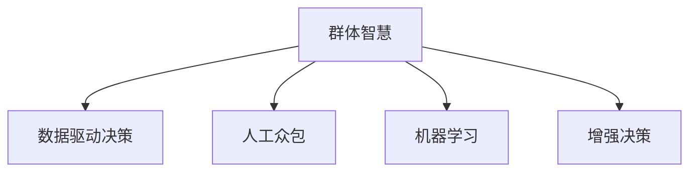

                 

# 群体智慧：决策的新利器

> 关键词：群体智慧,决策优化,人工众包,人工智能,数据科学,算法优化

## 1. 背景介绍

### 1.1 问题由来

随着互联网和信息技术的发展，社会对数据和决策的需求日益增长。传统的人工决策方式面临成本高、效率低、难以规模化等挑战。如何在数据海洋中找到价值，辅助人类进行高效决策，成为新时代的重大课题。群体智慧（Collective Intelligence），通过聚合个体智能，形成更强大的群体智能，为这一问题提供了新的解决思路。

群体智慧强调利用大规模、多来源、多形态的数据，借助先进的算法和计算技术，整合和分析来自不同领域、不同背景的人们的意见和智慧，从而形成更具普适性、可靠性和创新性的决策方案。

### 1.2 问题核心关键点

群体智慧的本质是通过数据驱动的方式，汇聚和整合个体的知识与智慧，形成高效、创新、灵活的决策能力。其核心在于：

- **数据源多样性**：包括结构化数据（如数据库、传感器等）和非结构化数据（如社交媒体、视频等）。
- **算法多样性**：包括统计学习、机器学习、深度学习等算法。
- **决策多样性**：包括个人意见、专家知识、自动化决策等多种决策形式。

这些关键点构成了群体智慧的完整框架，使其能够广泛应用于各个领域。

## 2. 核心概念与联系

### 2.1 核心概念概述

为更好地理解群体智慧，本节将介绍几个关键概念：

- **群体智慧（Collective Intelligence, CI）**：通过汇聚个体智慧，形成更具普适性和可靠性的决策能力。
- **数据驱动决策（Data-Driven Decision Making）**：利用数据进行科学决策，减少人为偏差。
- **人工众包（Crowdsourcing）**：将任务分解，通过平台聚集大量用户，借助其智慧和技能完成任务。
- **机器学习（Machine Learning, ML）**：通过数据训练模型，形成预测和决策能力。
- **增强决策（Augmented Decision Making）**：结合人类和机器的智能，形成更高效、更可靠的决策能力。

这些概念之间的逻辑关系可以通过以下Mermaid流程图来展示：



这个流程图展示了个体智慧向群体智慧的演进路径：

1. 个体智慧通过数据和算法聚合，形成群体智慧。
2. 数据驱动决策利用数据辅助决策，减少人为偏差。
3. 人工众包借助用户智慧，提供多样化的数据和解决方案。
4. 机器学习通过模型训练，提升决策的精确性和自动化水平。
5. 增强决策结合人类和机器的智慧，实现高效、可靠、创新的决策。

## 3. 核心算法原理 & 具体操作步骤

### 3.1 算法原理概述

群体智慧的算法原理主要基于数据驱动、机器学习和增强决策。其核心思想是：

1. **数据驱动**：通过整合和分析大量数据，形成基于数据的决策支持。
2. **机器学习**：利用模型进行预测和决策，提升决策的准确性和自动化水平。
3. **增强决策**：结合人类和机器的智慧，形成更高效、更创新的决策能力。

### 3.2 算法步骤详解

群体智慧的算法步骤通常包括以下几个关键环节：

1. **数据采集与预处理**：收集和整理各种形式的数据，包括结构化数据、非结构化数据、时序数据等。通过清洗和归一化，准备可用于分析的数据。
2. **特征工程与模型训练**：从数据中提取特征，选择合适的模型进行训练。常用模型包括线性回归、决策树、随机森林、深度学习等。
3. **模型评估与优化**：通过交叉验证、留一法等方法评估模型性能，优化模型参数，提升模型的泛化能力。
4. **决策生成与验证**：利用训练好的模型进行决策，通过A/B测试、多轮迭代等方式验证决策效果。

### 3.3 算法优缺点

群体智慧的算法具有以下优点：

- **数据源多样性**：整合多种数据源，提供更全面、多角度的信息支持。
- **决策自动化**：通过机器学习自动化决策过程，提高决策效率。
- **优化决策质量**：通过模型评估和优化，提升决策的准确性和可靠性。

同时，该算法也存在一定的局限性：

- **数据质量要求高**：数据质量和完整性对算法效果有很大影响。
- **模型复杂性**：机器学习模型设计复杂，需要专业知识。
- **结果解释性差**：黑箱模型难以解释决策过程，影响用户信任。

### 3.4 算法应用领域

群体智慧的应用领域广泛，包括但不限于：

- **商业决策**：市场分析、客户画像、推荐系统等。
- **公共管理**：政策制定、城市规划、资源配置等。
- **医疗健康**：疾病预测、药物研发、患者管理等。
- **教育培训**：个性化教学、学习路径推荐、知识图谱构建等。
- **金融风险**：信用评估、风险控制、反欺诈检测等。
- **环境保护**：气候预测、环境监测、资源管理等。

这些领域利用群体智慧进行决策优化，可以大幅提升决策效率和质量，促进社会和经济的发展。

## 4. 数学模型和公式 & 详细讲解 & 举例说明

### 4.1 数学模型构建

群体智慧的数学模型通常基于统计学习、机器学习和深度学习的框架，用于描述和预测决策结果。以下以线性回归模型为例，介绍其基本构建过程。

假设决策结果 $y$ 与多个特征 $x_1, x_2, ..., x_n$ 之间存在线性关系，则线性回归模型的表达式为：

$$
y = \beta_0 + \sum_{i=1}^{n} \beta_i x_i + \epsilon
$$

其中，$\beta_0$ 为截距，$\beta_i$ 为特征系数，$\epsilon$ 为误差项。

### 4.2 公式推导过程

在线性回归模型的推导过程中，通过最小二乘法求解系数 $\beta$。

$$
\hat{\beta} = (X^TX)^{-1}X^Ty
$$

其中，$X$ 为特征矩阵，$y$ 为决策结果向量。通过求解上述方程，即可得到最优的系数估计值 $\hat{\beta}$。

### 4.3 案例分析与讲解

以销售预测为例，假设有一个电商平台的销售数据，其中包含时间、广告投放、产品价格等信息。通过收集和预处理这些数据，构建线性回归模型进行销售预测。

假设销售量 $y$ 与广告投放 $x_1$、产品价格 $x_2$ 和季节性因素 $x_3$ 之间存在线性关系，则线性回归模型的表达式为：

$$
y = \beta_0 + \beta_1 x_1 + \beta_2 x_2 + \beta_3 x_3 + \epsilon
$$

通过最小二乘法求解系数 $\beta$，即可得到销售预测模型。利用训练好的模型对新数据进行预测，可以辅助电商平台制定更科学的营销策略。

## 5. 项目实践：代码实例和详细解释说明

### 5.1 开发环境搭建

在进行群体智慧项目实践前，需要准备好开发环境。以下是使用Python进行Scikit-Learn开发的配置流程：

1. 安装Anaconda：从官网下载并安装Anaconda，用于创建独立的Python环境。

2. 创建并激活虚拟环境：
```bash
conda create -n sk-env python=3.8 
conda activate sk-env
```

3. 安装Scikit-Learn：
```bash
pip install scikit-learn
```

4. 安装各类工具包：
```bash
pip install numpy pandas scikit-learn matplotlib tqdm jupyter notebook ipython
```

完成上述步骤后，即可在`sk-env`环境中开始项目实践。

### 5.2 源代码详细实现

以下是一个基于Scikit-Learn库的线性回归模型训练和预测的代码实现：

```python
from sklearn.linear_model import LinearRegression
from sklearn.model_selection import train_test_split
import pandas as pd
import numpy as np

# 读取数据
data = pd.read_csv('sales_data.csv')

# 数据预处理
X = data[['ad_spending', 'product_price', 'seasonality']]
y = data['sales']

# 分割训练集和测试集
X_train, X_test, y_train, y_test = train_test_split(X, y, test_size=0.2, random_state=42)

# 训练模型
model = LinearRegression()
model.fit(X_train, y_train)

# 预测结果
y_pred = model.predict(X_test)

# 评估模型
from sklearn.metrics import mean_squared_error
mse = mean_squared_error(y_test, y_pred)
print(f"Mean Squared Error: {mse}")
```

以上代码实现了线性回归模型的训练和预测。

### 5.3 代码解读与分析

让我们再详细解读一下关键代码的实现细节：

**数据读取**：
- `pd.read_csv('sales_data.csv')`：读取销售数据，存储为Pandas DataFrame。

**数据预处理**：
- `X = data[['ad_spending', 'product_price', 'seasonality']]`：选择广告投放、产品价格、季节性因素作为特征。
- `y = data['sales']`：选择销售量作为决策结果。

**模型训练**：
- `model = LinearRegression()`：创建线性回归模型。
- `model.fit(X_train, y_train)`：在训练集上训练模型。

**模型预测**：
- `y_pred = model.predict(X_test)`：对测试集进行预测。

**模型评估**：
- `from sklearn.metrics import mean_squared_error`：导入均方误差函数。
- `mse = mean_squared_error(y_test, y_pred)`：计算均方误差。

可以看到，利用Scikit-Learn库，我们可以用相对简洁的代码完成线性回归模型的实现。

## 6. 实际应用场景

### 6.1 商业决策

在商业决策领域，群体智慧可以应用于市场分析、客户画像、推荐系统等任务。

以市场分析为例，通过收集和分析用户行为数据，利用群体智慧算法识别市场趋势，提供决策支持。具体流程如下：

1. **数据采集**：收集用户浏览、购买、评价等数据。
2. **数据预处理**：清洗和归一化数据，提取特征。
3. **模型训练**：构建机器学习模型，训练预测用户偏好。
4. **决策生成**：根据预测结果，生成个性化推荐和市场策略。

通过群体智慧的市场分析，电商平台可以提升销售转化率和用户满意度，优化营销资源配置。

### 6.2 公共管理

在公共管理领域，群体智慧可以应用于政策制定、城市规划、资源配置等任务。

以城市规划为例，通过收集和分析交通流量、人口分布、资源利用等数据，利用群体智慧算法优化城市布局，提高居民生活质量。具体流程如下：

1. **数据采集**：收集交通流量、人口分布、资源利用等数据。
2. **数据预处理**：清洗和归一化数据，提取特征。
3. **模型训练**：构建机器学习模型，训练预测资源需求。
4. **决策生成**：根据预测结果，优化城市规划布局。

通过群体智慧的城市规划，政府可以提升公共服务质量，优化资源配置，改善城市环境。

### 6.3 医疗健康

在医疗健康领域，群体智慧可以应用于疾病预测、药物研发、患者管理等任务。

以疾病预测为例，通过收集和分析患者病历、基因数据、生活习惯等数据，利用群体智慧算法预测疾病风险，提供个性化诊疗方案。具体流程如下：

1. **数据采集**：收集患者病历、基因数据、生活习惯等数据。
2. **数据预处理**：清洗和归一化数据，提取特征。
3. **模型训练**：构建机器学习模型，训练预测疾病风险。
4. **决策生成**：根据预测结果，提供个性化诊疗方案。

通过群体智慧的疾病预测，医疗机构可以提升诊断准确率，制定个性化治疗方案，改善患者健康状况。

### 6.4 未来应用展望

随着群体智慧技术的不断发展，其在各个领域的应用前景广阔，有望大幅提升决策效率和质量。

在智慧城市治理中，群体智慧可以应用于城市事件监测、舆情分析、应急指挥等环节，提高城市管理的自动化和智能化水平，构建更安全、高效的未来城市。

在企业生产中，群体智慧可以应用于生产调度、资源管理、质量控制等环节，优化生产流程，提高企业竞争力。

在农业领域，群体智慧可以应用于气象预测、作物管理、病虫害防治等环节，提升农业生产效率和产量。

未来，伴随群体智慧技术的持续演进，其将在更多领域得到应用，为社会和经济的发展提供新的动力。

## 7. 工具和资源推荐

### 7.1 学习资源推荐

为了帮助开发者系统掌握群体智慧的理论基础和实践技巧，这里推荐一些优质的学习资源：

1. 《群体智慧：技术、市场与商业》系列博文：由群体智慧专家撰写，深入浅出地介绍了群体智慧的基本概念、核心算法和典型应用。

2. Coursera《Data Mining and Statistical Learning》课程：由斯坦福大学开设的数据挖掘课程，涵盖了群体智慧、机器学习等多个相关内容，适合深入学习。

3. 《群体智慧与协同系统》书籍：详细介绍了群体智慧的理论基础和应用案例，是群体智慧领域的经典著作。

4. Kaggle竞赛平台：提供丰富的群体智慧应用场景和数据集，适合实践练习。

通过学习这些资源，相信你一定能够快速掌握群体智慧的理论和实践方法，并应用于实际项目中。

### 7.2 开发工具推荐

高效的开发离不开优秀的工具支持。以下是几款用于群体智慧项目开发的常用工具：

1. Jupyter Notebook：基于Web的交互式编程环境，支持Python、R等多种语言，适合数据处理和模型开发。

2. Scikit-Learn：基于Python的机器学习库，提供丰富的算法实现，适合快速原型开发。

3. TensorFlow：由Google主导开发的深度学习框架，生产部署方便，适合大规模工程应用。

4. Weights & Biases：模型训练的实验跟踪工具，可以记录和可视化模型训练过程中的各项指标，方便对比和调优。

5. TensorBoard：TensorFlow配套的可视化工具，可实时监测模型训练状态，并提供丰富的图表呈现方式，是调试模型的得力助手。

6. Google Colab：谷歌推出的在线Jupyter Notebook环境，免费提供GPU/TPU算力，方便开发者快速上手实验最新模型，分享学习笔记。

合理利用这些工具，可以显著提升群体智慧项目开发效率，加快创新迭代的步伐。

### 7.3 相关论文推荐

群体智慧的研究源于学界的持续探索。以下是几篇奠基性的相关论文，推荐阅读：

1. Group Intelligence: The Secret to Success in Dynamic Markets（群体智慧：动态市场成功的秘密）：研究了群体智慧在市场决策中的应用，提出了基于群体智慧的动态市场优化模型。

2. Crowdsourcing and the Future of Work（众包与未来工作）：讨论了众包在商业、科学、艺术等多个领域的应用，强调了群体智慧在创新和效率提升中的作用。

3. Augmenting Human and Machine Decision Making（增强人类和机器的决策）：研究了群体智慧在决策系统中的应用，提出了结合人类和机器的决策模型。

4. Data-Driven Decision Making in Public Administration（公共管理中的数据驱动决策）：探讨了群体智慧在公共管理中的应用，提出了基于数据驱动的决策优化模型。

这些论文代表了大规模群体智慧的研究方向，通过学习这些前沿成果，可以帮助研究者把握学科前进方向，激发更多的创新灵感。

## 8. 总结：未来发展趋势与挑战

### 8.1 总结

本文对群体智慧的理论基础和实践方法进行了全面系统的介绍。首先阐述了群体智慧的基本概念和核心算法，明确了其在工作、管理、健康等领域的应用价值。其次，从原理到实践，详细讲解了群体智慧的数学模型和算法实现，给出了群体智慧项目开发的完整代码实例。同时，本文还广泛探讨了群体智慧在多个行业领域的应用前景，展示了群体智慧技术的广阔前景。

通过本文的系统梳理，可以看到，群体智慧作为数据驱动、多源融合的决策技术，正在成为各个领域的重要工具。其借助先进算法和计算技术，整合和分析来自不同领域、不同背景的人们的智慧，形成高效、创新、灵活的决策能力。

### 8.2 未来发展趋势

展望未来，群体智慧技术将呈现以下几个发展趋势：

1. **数据源多样化**：随着物联网、传感器、社交媒体等数据来源的扩展，群体智慧的数据源将更加多样化，能够提供更全面、多角度的信息支持。
2. **算法多样化**：除了机器学习、深度学习等常用算法，未来将涌现更多新颖的群体智慧算法，如迁移学习、增强学习等，提升决策的准确性和创新性。
3. **决策自动化**：通过自动化决策技术，群体智慧将能够更加灵活、高效地辅助人类决策，提高决策效率和质量。
4. **智能集成**：将群体智慧与其他人工智能技术进行深度融合，如自然语言处理、计算机视觉等，提升决策系统的综合能力。
5. **伦理和隐私保护**：在决策过程中，重视数据隐私和用户隐私保护，构建透明、可信的决策体系。

这些趋势凸显了群体智慧技术的广阔前景，其在各个领域的应用将不断拓展，为社会和经济的发展提供新的动力。

### 8.3 面临的挑战

尽管群体智慧技术已经取得了瞩目成就，但在迈向更加智能化、普适化应用的过程中，它仍面临着诸多挑战：

1. **数据质量要求高**：数据质量和完整性对群体智慧效果有很大影响。低质量的数据可能导致模型效果不佳，甚至产生误导性结果。
2. **模型复杂性**：群体智慧模型的设计和实现复杂，需要跨学科知识和专业技能。
3. **结果解释性差**：群体智慧模型通常是黑箱模型，难以解释决策过程，影响用户信任。
4. **隐私和安全风险**：在群体智慧应用中，数据隐私和用户隐私保护至关重要。不当的数据处理可能导致隐私泄露和安全风险。

### 8.4 研究展望

面对群体智慧面临的挑战，未来的研究需要在以下几个方面寻求新的突破：

1. **数据治理与质量提升**：研究如何从源头提升数据质量，构建可信的数据治理体系。
2. **模型简化与解释性增强**：开发更加简单、易于解释的群体智慧模型，提升用户信任度。
3. **隐私保护与伦理设计**：构建隐私保护机制，设计伦理导向的决策模型，确保数据使用的透明和公平。
4. **智能集成与协同优化**：研究如何将群体智慧与其他人工智能技术进行深度融合，实现多源数据协同优化。
5. **动态优化与自适应决策**：研究如何在动态环境中，实现群体智慧的动态优化和自适应决策。

这些研究方向将推动群体智慧技术的发展，解决实际应用中的问题，提升决策系统的效能和可靠性。

## 9. 附录：常见问题与解答

**Q1：群体智慧技术是否适用于所有决策场景？**

A: 群体智慧技术适用于多种决策场景，包括但不限于商业决策、公共管理、医疗健康等。但需要注意，群体智慧的效果依赖于数据质量和模型设计，对于特定领域，可能需要结合领域知识进行定制化设计和优化。

**Q2：群体智慧的算法如何保证决策的公正性和透明性？**

A: 群体智慧算法的设计需要考虑公正性和透明性，可以通过以下几个方法保证：

1. 数据来源多样化：通过汇聚不同来源、不同背景的数据，减少单一数据源带来的偏见。
2. 模型解释性增强：使用可解释性较强的算法，如线性回归、决策树等，提升模型解释能力。
3. 用户反馈机制：在决策过程中引入用户反馈，实时调整模型参数，保证决策的公正性和透明性。
4. 隐私保护机制：严格遵守数据隐私法规，构建隐私保护体系，确保用户数据安全。

通过这些方法，可以在决策过程中保证群体智慧的公正性和透明性。

**Q3：如何构建高效、可靠的群体智慧决策系统？**

A: 构建高效、可靠的群体智慧决策系统需要考虑以下几个方面：

1. 数据采集与预处理：收集和预处理高质量数据，提取有用的特征。
2. 模型选择与设计：选择合适的算法，设计有效的模型结构，避免过拟合和欠拟合。
3. 结果验证与优化：通过多轮迭代和验证，优化模型参数，提升决策效果。
4. 系统集成与部署：将群体智慧系统集成到实际业务中，进行测试和部署，确保系统的稳定性和可靠性。
5. 用户反馈与改进：收集用户反馈，持续改进系统，提升用户体验。

通过以上步骤，可以构建高效、可靠的群体智慧决策系统，实现数据驱动的智能决策。

**Q4：群体智慧技术在实际应用中面临哪些技术挑战？**

A: 群体智慧技术在实际应用中面临以下技术挑战：

1. 数据质量要求高：数据质量和完整性对群体智慧效果有很大影响，需要严格的数据治理和质量控制。
2. 模型复杂性：群体智慧模型通常较为复杂，需要跨学科知识和专业技能。
3. 结果解释性差：群体智慧模型通常是黑箱模型，难以解释决策过程，影响用户信任。
4. 隐私和安全风险：在群体智慧应用中，数据隐私和用户隐私保护至关重要，不当的数据处理可能导致隐私泄露和安全风险。

面对这些挑战，需要从数据治理、模型设计、隐私保护等多个方面进行优化，提升群体智慧技术的应用效果。

---

作者：禅与计算机程序设计艺术 / Zen and the Art of Computer Programming

