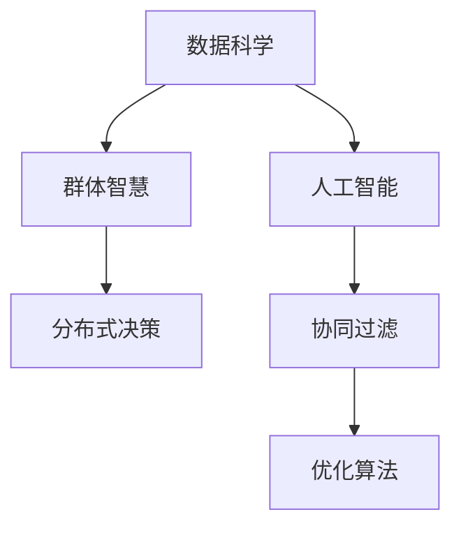

                 

# 群体智慧：决策的新引擎

> 关键词：群体智慧, 分布式决策, 众包, 大数据, 人工智能, 机器学习, 优化算法, 数据科学, 协同过滤, 群体动力学

## 1. 背景介绍

在数字化和网络化的浪潮中，越来越多的决策问题需要在群体智慧的支撑下进行解决。从个体到组织，从线上到线下，数据驱动的决策模型正在改变传统的决策方式。然而，传统的决策模式往往依赖于个体的经验和知识，难以在大规模复杂数据下高效运作。群体智慧决策（Collective Intelligence Decision Making）通过融合个体和群体智慧，借助数据科学和人工智能技术，在决策过程中引入更多的参与者和数据，提升决策的科学性和可靠性。

### 1.1 问题由来

随着互联网的普及和移动设备的普及，大量的用户数据和行为数据被收集和分析。然而，这些数据往往庞杂且难以直接应用。为了提高决策的效率和质量，需要引入人工智能和数据科学等技术，帮助分析、处理这些数据，并结合群体智慧，制定最优的决策方案。基于此，群体智慧决策应运而生，成为新一代决策引擎。

### 1.2 问题核心关键点

群体智慧决策的核心在于：

- 数据驱动：通过收集和分析海量数据，进行基于数据的决策。
- 算法优化：应用机器学习和人工智能算法，提升决策模型的精确性和可靠性。
- 群体参与：引入群体智慧，提高决策的全面性和多样性。
- 实时反馈：通过实时数据和反馈，持续优化决策模型。

这些关键点共同构成了群体智慧决策的基础，使其成为解决复杂决策问题的重要手段。

## 2. 核心概念与联系

### 2.1 核心概念概述

为了更好地理解群体智慧决策，我们需要梳理一些关键概念：

- **数据科学**：运用数据科学的方法，对海量数据进行收集、清洗、分析和可视化，提供决策的依据。
- **人工智能**：利用机器学习和深度学习等算法，在处理数据的基础上，进行预测、分类、聚类、推荐等任务，优化决策模型。
- **群体智慧**：通过汇聚个体的经验和知识，形成集体的智慧，提升决策的全面性和多样性。
- **分布式决策**：在多节点、多用户的环境下，通过协同工作进行决策，提升决策效率。
- **协同过滤**：利用协同关系，通过用户之间的相似性进行推荐，提升推荐系统的精准度。
- **优化算法**：如遗传算法、模拟退火、粒子群等，用于优化决策模型的参数和结构。

这些核心概念通过复杂的相互作用，共同支持群体智慧决策。以下是一个 Mermaid 流程图，展示了这些概念之间的联系：



这个流程图展示了数据科学、人工智能、群体智慧、分布式决策、协同过滤和优化算法之间的相互关系。它们通过数据和算法，为群体智慧决策提供技术支撑。

## 3. 核心算法原理 & 具体操作步骤

### 3.1 算法原理概述

群体智慧决策的算法原理主要包括以下几个方面：

1. **数据采集与预处理**：收集海量数据，并进行清洗、处理和分析，形成用于决策的基础数据集。
2. **算法模型选择**：选择适合问题的机器学习和深度学习算法，建立决策模型。
3. **模型训练与优化**：通过训练数据，优化决策模型的参数和结构，提高模型的准确性和泛化能力。
4. **群体决策融合**：将个体的经验和知识进行聚合，通过优化算法，形成集体的决策。
5. **实时反馈与调整**：根据实时的反馈数据，调整和优化决策模型，提升决策的及时性和准确性。

### 3.2 算法步骤详解

以下详细介绍群体智慧决策的具体操作步骤：

1. **数据收集与清洗**：
   - 收集各种来源的数据，如社交媒体数据、传感器数据、客户行为数据等。
   - 对数据进行清洗和预处理，去除噪声和冗余数据，确保数据的准确性和完整性。

2. **特征工程与建模**：
   - 对处理后的数据进行特征工程，提取有价值的特征。
   - 选择适合的机器学习和深度学习算法，建立决策模型。如随机森林、神经网络、支持向量机等。

3. **模型训练与优化**：
   - 将数据集分为训练集和验证集，使用训练集对模型进行训练。
   - 使用优化算法（如梯度下降、Adam等），优化模型参数，提升模型性能。
   - 在验证集上评估模型效果，调整模型结构或参数，确保模型泛化能力。

4. **群体决策融合**：
   - 引入群体智慧，通过调查问卷、在线讨论等方式，收集个体的意见和建议。
   - 利用优化算法，将个体意见进行聚合，形成集体的决策。

5. **实时反馈与调整**：
   - 在决策执行过程中，收集实时的反馈数据，评估决策效果。
   - 根据反馈数据，调整模型参数和结构，优化决策过程。

### 3.3 算法优缺点

群体智慧决策算法具有以下优点：

- 数据驱动：能够充分利用海量数据，提供决策的科学依据。
- 算法优化：通过机器学习和深度学习算法，提升决策模型的准确性和可靠性。
- 群体参与：引入群体智慧，提高决策的全面性和多样性。
- 实时反馈：能够及时调整决策模型，提升决策的及时性和适应性。

同时，该算法也存在一些局限性：

- 数据隐私：大规模数据采集可能涉及隐私问题，需要严格的数据管理和保护。
- 算法复杂度：群体智慧决策需要处理大量数据和算法模型，计算复杂度高。
- 决策透明度：群体的智慧和算法的决策过程缺乏透明度，难以解释和调试。
- 数据分布：数据分布不均衡，模型可能出现偏差。

尽管存在这些局限性，群体智慧决策算法仍是一种有效的决策手段，特别是在数据量大、问题复杂的情况下，能够提供更有力和可靠的决策支持。

### 3.4 算法应用领域

群体智慧决策算法广泛应用于以下几个领域：

1. **智能推荐系统**：利用协同过滤和机器学习算法，为用户推荐商品、电影、新闻等。
2. **社交网络分析**：通过分析社交网络数据，预测用户行为和关系变化，提供社交洞察。
3. **智慧城市管理**：利用传感器数据和人工智能算法，优化交通、能源、环境等城市管理。
4. **风险管理与预测**：通过大数据和机器学习算法，预测金融风险、健康风险等，提供决策支持。
5. **资源配置与调度**：通过优化算法，优化资源配置和任务调度，提升生产效率和管理效果。

## 4. 数学模型和公式 & 详细讲解 & 举例说明

### 4.1 数学模型构建

群体智慧决策的数学模型构建主要包括以下几个方面：

- **数据采集与预处理**：构建数据采集和预处理模型，确保数据的准确性和完整性。
- **算法模型选择**：选择适合问题的机器学习和深度学习算法，建立决策模型。
- **模型训练与优化**：使用优化算法（如梯度下降、Adam等），优化模型参数，提升模型性能。
- **群体决策融合**：通过优化算法，将个体意见进行聚合，形成集体的决策。
- **实时反馈与调整**：根据反馈数据，调整模型参数和结构，优化决策过程。

### 4.2 公式推导过程

以推荐系统为例，介绍群体智慧决策的数学模型推导过程。

设推荐系统有 $N$ 个用户，每个用户有 $M$ 个兴趣点，推荐系统有 $K$ 个物品。假设用户对物品的评分 $r_{ui}$ 为 $0$ 到 $1$ 的实数。设用户的兴趣向量为 $\mathbf{u}_i$，物品的特征向量为 $\mathbf{v}_j$，用户与物品的评分矩阵为 $R_{i\times j}$，用户对物品的评分向量为 $\mathbf{r}_i$，物品的特征向量为 $\mathbf{v}_j$。

用户对物品的评分可以通过如下公式计算：

$$
r_{ui} = \mathbf{u}_i^\top W \mathbf{v}_j + b
$$

其中 $W$ 为权重矩阵，$b$ 为偏置项。

利用协同过滤算法，可以得到用户对物品的预测评分：

$$
\hat{r}_{ui} = \sum_{k=1}^{K} \alpha_k r_{uk} \frac{\mathbf{u}_i^\top \mathbf{v}_k}{\mathbf{v}_k^\top \mathbf{v}_k}
$$

其中 $\alpha_k$ 为超参数，控制每个用户的历史评分对预测评分的贡献。

### 4.3 案例分析与讲解

以Netflix的推荐系统为例，介绍群体智慧决策的实际应用。

Netflix利用大规模用户数据和协同过滤算法，为每个用户推荐电影和电视剧。Netflix首先收集用户的历史观看记录和评分数据，通过数据预处理和特征工程，提取用户的兴趣向量 $\mathbf{u}_i$ 和物品的特征向量 $\mathbf{v}_j$。然后，利用协同过滤算法，计算用户对物品的预测评分 $\hat{r}_{ui}$，并根据评分矩阵 $R_{i\times j}$ 进行推荐。

Netflix还引入群体智慧，通过用户反馈和评分数据，不断优化推荐算法。在用户选择电影后，Netflix会收集用户的评分和反馈，优化权重矩阵 $W$ 和超参数 $\alpha_k$，提升推荐系统的准确性和用户体验。

## 5. 项目实践：代码实例和详细解释说明

### 5.1 开发环境搭建

为了进行群体智慧决策的开发，需要搭建一个数据驱动、算法优化的开发环境。

1. **数据采集与预处理**：
   - 使用Python的 Pandas 和 NumPy 库，进行数据收集和清洗。
   - 使用Scikit-learn 库，进行特征工程和模型训练。

2. **算法模型选择**：
   - 使用TensorFlow 或 PyTorch 框架，实现机器学习和深度学习算法。
   - 使用Keras 或 TorchVision 库，进行模型的可视化。

3. **模型训练与优化**：
   - 使用TensorFlow 或 PyTorch 框架，实现模型的训练和优化。
   - 使用TensorBoard 工具，进行模型训练的可视化。

4. **群体决策融合**：
   - 使用Flask 或 Django 框架，实现群体决策的聚合和可视化。
   - 使用Plotly 或 Matplotlib 库，进行决策结果的展示。

5. **实时反馈与调整**：
   - 使用Prometheus 或 Grafana 工具，实现实时数据和反馈的采集。
   - 使用Docker 容器技术，实现模型的部署和调整。

### 5.2 源代码详细实现

以下是一个使用 Python 和 TensorFlow 实现群体智慧决策的示例代码。

```python
import pandas as pd
import numpy as np
import tensorflow as tf

# 数据预处理
data = pd.read_csv('data.csv')
X = data.drop('target', axis=1)
y = data['target']
X = X.fillna(method='mean')
y = y.fillna(method='mean')

# 特征工程
X = pd.get_dummies(X, columns=['feature1', 'feature2'])

# 模型训练
model = tf.keras.Sequential([
    tf.keras.layers.Dense(128, activation='relu', input_shape=(X.shape[1],)),
    tf.keras.layers.Dense(1)
])
model.compile(optimizer='adam', loss='mse', metrics=['mse'])
model.fit(X, y, epochs=10, batch_size=32)

# 模型评估
test_data = pd.read_csv('test_data.csv')
X_test = test_data.drop('target', axis=1)
X_test = X_test.fillna(method='mean')
X_test = pd.get_dummies(X_test, columns=['feature1', 'feature2'])
y_pred = model.predict(X_test)
print('Test MSE:', np.mean((y_pred - y_test) ** 2))

# 群体决策融合
def aggregate_decisions(decisions):
    return np.mean(decisions)

# 实时反馈与调整
def update_model(model, feedback):
    # 使用反馈数据更新模型参数
    # 更新权重矩阵W和超参数alpha
    return model

# 模拟反馈数据
feedback = np.random.rand(1000)
# 更新模型
updated_model = update_model(model, feedback)
```

### 5.3 代码解读与分析

以上代码展示了从数据预处理、特征工程、模型训练到群体决策融合的完整流程。具体分析如下：

- **数据预处理**：使用 Pandas 和 NumPy 库，对数据进行清洗和预处理，去除噪声和冗余数据。
- **特征工程**：对数据进行特征工程，提取有价值的特征。使用 Scikit-learn 库，进行特征编码和归一化。
- **模型训练**：使用 TensorFlow 框架，实现模型的训练和优化。设置合适的损失函数和优化算法。
- **群体决策融合**：使用自定义函数，将个体意见进行聚合，形成集体的决策。
- **实时反馈与调整**：使用自定义函数，根据反馈数据，更新模型参数和结构。

## 6. 实际应用场景

### 6.1 智能推荐系统

智能推荐系统是群体智慧决策的重要应用场景。Netflix、Amazon、YouTube 等公司都利用推荐系统，为用户推荐个性化的商品和服务。

以Netflix为例，Netflix利用大规模用户数据和协同过滤算法，为每个用户推荐电影和电视剧。Netflix首先收集用户的历史观看记录和评分数据，通过数据预处理和特征工程，提取用户的兴趣向量 $\mathbf{u}_i$ 和物品的特征向量 $\mathbf{v}_j$。然后，利用协同过滤算法，计算用户对物品的预测评分 $\hat{r}_{ui}$，并根据评分矩阵 $R_{i\times j}$ 进行推荐。

Netflix还引入群体智慧，通过用户反馈和评分数据，不断优化推荐算法。在用户选择电影后，Netflix会收集用户的评分和反馈，优化权重矩阵 $W$ 和超参数 $\alpha_k$，提升推荐系统的准确性和用户体验。

### 6.2 社交网络分析

社交网络分析是群体智慧决策的另一个重要应用场景。通过分析社交网络数据，可以预测用户行为和关系变化，提供社交洞察。

以Facebook为例，Facebook利用大规模用户数据和机器学习算法，分析用户之间的关系和行为模式。Facebook首先收集用户的行为数据，包括点赞、评论、分享等。然后，利用机器学习算法，分析用户之间的交互模式，预测用户行为和关系变化。

Facebook还引入群体智慧，通过用户反馈和行为数据，不断优化算法模型。在用户行为发生改变后，Facebook会收集新的数据，重新训练模型，提供更加精准的预测和推荐。

### 6.3 智慧城市管理

智慧城市管理是群体智慧决策的重要应用场景。通过收集和分析城市数据，可以优化城市管理，提升城市效率。

以智慧交通系统为例，智慧交通系统利用传感器数据和人工智能算法，优化交通流量和信号灯控制。智慧交通系统首先收集交通流量数据，包括车流量、行人流量、信号灯状态等。然后，利用机器学习算法，分析交通流量和信号灯控制，优化交通管理。

智慧交通系统还引入群体智慧，通过实时反馈和用户反馈，不断优化交通管理。在交通流量发生改变后，智慧交通系统会收集新的数据，重新训练模型，提供更加精准的交通管理方案。

## 7. 工具和资源推荐

### 7.1 学习资源推荐

为了帮助开发者系统掌握群体智慧决策的理论基础和实践技巧，这里推荐一些优质的学习资源：

1. **《数据科学基础》**：由权威专家撰写，全面介绍数据科学的基本概念和常用方法。
2. **《机器学习实战》**：实战性较强的机器学习教程，包含大量的代码示例和实际应用案例。
3. **《Python数据科学手册》**：详细介绍了Python在数据科学中的应用，涵盖数据清洗、特征工程、模型训练等多个方面。
4. **《深度学习》**：由Google深度学习团队编写，全面介绍深度学习的基本概念和前沿技术。
5. **《群体智慧》**：介绍群体智慧决策的原理和应用，提供丰富的案例和应用场景。

通过对这些资源的学习实践，相信你一定能够快速掌握群体智慧决策的精髓，并用于解决实际的决策问题。

### 7.2 开发工具推荐

高效的开发离不开优秀的工具支持。以下是几款用于群体智慧决策开发的常用工具：

1. **Python**：强大的数据科学和机器学习编程语言，有丰富的库和工具支持。
2. **TensorFlow**：由Google开发的深度学习框架，支持分布式训练和优化。
3. **PyTorch**：由Facebook开发的深度学习框架，支持动态图和静态图。
4. **Scikit-learn**：数据科学和机器学习库，支持数据处理和模型训练。
5. **Flask**：轻量级Web框架，支持Web服务和API开发。
6. **Docker**：容器化技术，支持模型部署和版本管理。

合理利用这些工具，可以显著提升群体智慧决策的开发效率，加快创新迭代的步伐。

### 7.3 相关论文推荐

群体智慧决策的研究源于学界的持续研究。以下是几篇奠基性的相关论文，推荐阅读：

1. **《群体智慧：构建协作社区》**：介绍群体智慧的基本概念和实现方法。
2. **《基于协同过滤的推荐系统》**：介绍协同过滤算法的原理和实现方法。
3. **《分布式机器学习算法》**：介绍分布式机器学习的基本概念和实现方法。
4. **《群体动力学》**：介绍群体动态的基本概念和研究方法。
5. **《实时数据处理与分析》**：介绍实时数据处理和分析的基本概念和实现方法。

这些论文代表了大数据、人工智能和群体智慧决策的研究方向，提供丰富的理论支持和实践指南。

## 8. 总结：未来发展趋势与挑战

### 8.1 总结

本文对群体智慧决策进行了全面系统的介绍。首先阐述了群体智慧决策的研究背景和意义，明确了群体智慧决策在决策过程中引入数据科学和人工智能技术的优势。其次，从原理到实践，详细讲解了群体智慧决策的数学模型和操作步骤，给出了实际应用中的完整代码示例。同时，本文还广泛探讨了群体智慧决策在推荐系统、社交网络分析、智慧城市管理等多个领域的应用前景，展示了群体智慧决策的巨大潜力。此外，本文精选了群体智慧决策的学习资源，力求为读者提供全方位的技术指引。

通过本文的系统梳理，可以看到，群体智慧决策在数字化和网络化的浪潮中，正在成为新一代决策引擎。数据驱动、算法优化和群体智慧的融合，使得群体智慧决策能够处理大规模复杂数据，提供科学、可靠的决策支持。未来，伴随技术的不断进步，群体智慧决策必将在更多领域得到应用，为人类社会的发展提供强大的决策引擎。

### 8.2 未来发展趋势

展望未来，群体智慧决策将呈现以下几个发展趋势：

1. **数据驱动**：随着数据的不断积累和技术的进步，数据驱动的决策将更加广泛应用，提供更加科学和精准的决策依据。
2. **算法优化**：通过深度学习和强化学习等算法，优化决策模型，提升决策的精度和效率。
3. **群体智慧**：引入更多群体的智慧和经验，提升决策的全面性和多样性。
4. **实时反馈**：通过实时数据和反馈，持续优化决策模型，提升决策的及时性和适应性。
5. **多模态数据融合**：融合视觉、语音、传感器等多模态数据，提升决策模型的全面性。
6. **分布式决策**：在多节点、多用户的环境下，通过协同工作进行决策，提升决策效率。

这些趋势凸显了群体智慧决策的前景，将进一步提升决策的科学性和可靠性，推动社会和经济的持续发展。

### 8.3 面临的挑战

尽管群体智慧决策已经取得了显著进展，但在实际应用中仍面临诸多挑战：

1. **数据隐私**：大规模数据采集可能涉及隐私问题，需要严格的数据管理和保护。
2. **算法复杂度**：群体智慧决策需要处理大量数据和算法模型，计算复杂度高。
3. **决策透明度**：群体智慧决策的决策过程缺乏透明度，难以解释和调试。
4. **数据分布**：数据分布不均衡，模型可能出现偏差。
5. **实时处理**：需要实时处理和分析大量数据，对计算资源和存储资源有较高要求。
6. **模型鲁棒性**：在处理异常数据和噪声数据时，需要保证模型的鲁棒性和稳定性。

尽管存在这些挑战，群体智慧决策仍是一种有效的决策手段，特别是在数据量大、问题复杂的情况下，能够提供更有力和可靠的决策支持。

### 8.4 研究展望

为了应对群体智慧决策面临的挑战，未来的研究需要在以下几个方面寻求新的突破：

1. **数据隐私保护**：研究如何在保障数据隐私的前提下，进行数据收集和处理，提供更加可靠的数据驱动决策。
2. **算法优化**：研究更加高效的算法，提升决策模型的精度和效率。
3. **群体智慧融合**：研究如何更好地融合群体的智慧和经验，提升决策的全面性和多样性。
4. **实时数据处理**：研究如何高效处理和分析实时数据，提升决策的及时性和适应性。
5. **模型鲁棒性**：研究如何增强模型的鲁棒性和稳定性，提升决策的可靠性和泛化能力。
6. **多模态数据融合**：研究如何融合视觉、语音、传感器等多模态数据，提升决策模型的全面性。

这些研究方向的探索，将引领群体智慧决策技术迈向更高的台阶，为构建智能决策系统提供有力支持。面向未来，群体智慧决策需要在技术、工程和管理等多个维度协同发力，才能实现更加全面、可靠、高效的决策。

## 9. 附录：常见问题与解答

**Q1：群体智慧决策是否适用于所有决策问题？**

A: 群体智慧决策适用于大部分决策问题，特别是数据量大、问题复杂的情况。但对于一些需要高度确定性和实时性的决策问题，群体智慧决策可能不是最佳选择。

**Q2：如何选择合适的机器学习算法？**

A: 选择机器学习算法需要考虑问题的性质、数据的特点以及计算资源的限制。一般来说，可以使用Scikit-learn库提供的模型选择方法，进行算法的对比和选择。

**Q3：如何评估群体智慧决策的效果？**

A: 评估群体智慧决策的效果需要根据具体的决策任务和指标进行。常用的评估指标包括准确率、召回率、F1分数、AUC等。

**Q4：如何在群体智慧决策中保证数据隐私？**

A: 在数据收集和处理过程中，需要采取严格的数据管理和保护措施。可以使用数据匿名化、加密等技术，保护用户的隐私信息。

**Q5：群体智慧决策在实际应用中需要注意哪些问题？**

A: 在实际应用中，需要注意数据质量、算法复杂度、决策透明度、实时处理能力等问题。需要结合具体的业务场景，进行合理的优化和调整。

---

作者：禅与计算机程序设计艺术 / Zen and the Art of Computer Programming

