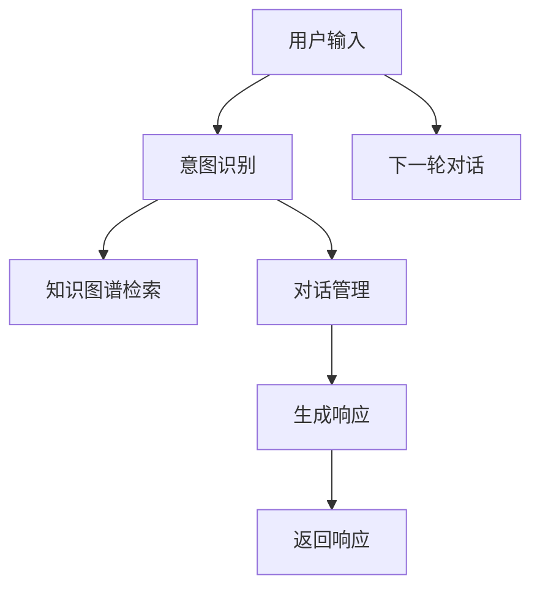

                 

# 聊天机器人开发：对话AI 入门

## 1. 背景介绍

### 1.1 问题由来

随着人工智能技术的发展，聊天机器人(Chatbot)逐渐成为了各行各业提高客户服务效率、改善用户体验的重要工具。然而，构建一个能够进行自然流畅对话、理解复杂语义的聊天机器人，对于普通开发者来说仍然是一个不小的挑战。本文旨在通过系统介绍聊天机器人开发的核心概念和关键技术，为读者提供入门的指南和实用的建议。

### 1.2 问题核心关键点

聊天机器人开发的核心在于构建一个能够自动生成响应、理解用户意图的对话模型。这一过程通常涉及以下几个关键点：

- **对话生成**：生成自然流畅的对话文本，能够准确捕捉用户意图并生成合适的回答。
- **意图理解**：理解用户输入的自然语言，识别出其背后的真正意图。
- **知识管理**：通过知识库或外部数据源，获取和维护与对话内容相关的知识。
- **多轮对话管理**：处理对话上下文，确保机器人能够进行多轮对话，保持对话的连贯性和一致性。

本文将从这些关键点出发，深入讲解聊天机器人开发的原理与实践。

## 2. 核心概念与联系

### 2.1 核心概念概述

为了更好地理解聊天机器人开发的本质，我们先介绍几个核心概念：

- **自然语言处理(Natural Language Processing, NLP)**：利用计算机技术处理和分析人类语言，包括文本预处理、分词、词性标注、句法分析、语义理解、机器翻译等。聊天机器人正是在NLP的基础上实现的。

- **对话系统**：由对话管理(DM)和自然语言理解(NLU)、自然语言生成(NLG)两个核心组件组成的系统，能够根据用户输入生成响应。

- **知识图谱(Knowledge Graph)**：一种用于组织和表示知识的数据结构，通常用于提升聊天机器人的响应准确性和上下文一致性。

- **意图识别**：通过分析用户输入的语义信息，识别出用户想要实现的目标或需求。

- **多轮对话管理**：记录和维护对话上下文，确保机器人能够理解并记忆对话历史，从而生成连贯的响应。

这些概念之间的联系可以通过以下Mermaid流程图来展示：



这个流程图展示了聊天机器人系统的工作流程：

1. 用户输入自然语言。
2. 意图识别模块识别用户意图。
3. 知识图谱检索模块从知识库中检索相关信息。
4. 对话管理模块维护对话历史。
5. 自然语言生成模块生成响应。
6. 返回响应并等待下一轮对话。

### 2.2 核心概念原理和架构

聊天机器人的核心架构可以简单地表示为一个带有上下文状态的对话生成器。对话生成器由对话管理器和语言模型两部分组成，其中对话管理器负责记录和管理对话历史，语言模型则负责根据对话历史生成自然语言响应。

**对话管理器**：通常采用状态机或递归神经网络(RNN)等机制，维护对话上下文状态。状态机通过维护对话状态，能够保证多轮对话的连贯性；RNN通过记忆单元捕捉对话历史信息，提高生成响应的连贯性和一致性。

**语言模型**：用于生成自然语言响应。常见的方法包括基于规则的语言生成、基于模板的语言生成、基于统计的语言生成、基于神经网络的自然语言生成等。

## 3. 核心算法原理 & 具体操作步骤

### 3.1 算法原理概述

聊天机器人的核心算法包括意图识别、知识检索、对话管理、自然语言生成等。以下对每个核心模块的算法原理进行概述：

- **意图识别**：基于监督学习的方法，如分类、序列标注、序列到序列模型等，对用户输入进行语义分析，识别出意图类别。
- **知识检索**：通过文本检索、知识图谱检索等方法，从知识库中获取与对话内容相关的信息。
- **对话管理**：使用序列到序列模型或状态转移系统，维护对话历史状态，生成连贯的响应。
- **自然语言生成**：采用模板填充、规则生成、统计生成、神经网络生成等方法，生成自然流畅的对话文本。

### 3.2 算法步骤详解

接下来，我们详细讲解每个核心算法步骤：

**意图识别**：
1. 收集并标注用户输入和意图的数据集。
2. 使用分类算法(如逻辑回归、SVM、神经网络等)训练意图识别模型。
3. 对用户输入进行预处理，提取特征向量。
4. 输入特征向量到意图识别模型，输出意图类别。

**知识检索**：
1. 构建知识图谱或预构建好知识库。
2. 将用户意图映射到知识图谱或知识库中的实体和属性。
3. 使用文本检索算法(如倒排索引、向量空间模型等)在知识库中检索相关信息。
4. 根据检索结果生成响应。

**对话管理**：
1. 初始化对话状态。
2. 对用户输入进行分词、词性标注、句法分析等处理。
3. 更新对话状态，保存对话历史。
4. 根据对话历史和知识库信息生成响应。

**自然语言生成**：
1. 确定生成任务和目标。
2. 使用模板、规则、统计模型或神经网络模型进行文本生成。
3. 对生成的文本进行后处理，如分词、标点添加等。

### 3.3 算法优缺点

聊天机器人开发的算法具有以下优点：

- **灵活性**：算法可以根据具体任务进行调整和优化，适用于各种对话场景。
- **高效性**：基于监督学习的方法可以快速训练模型，适用于数据标注相对容易的场景。
- **可解释性**：部分算法如规则生成、模板填充等，具有较好的可解释性，易于理解和调试。

同时，这些算法也存在一些缺点：

- **数据依赖**：模型的性能依赖于训练数据的质量和数量，数据标注成本较高。
- **复杂度**：部分算法如神经网络生成，模型结构复杂，训练和推理成本较高。
- **鲁棒性**：面对噪声数据或新领域数据，模型的泛化能力可能较弱。

### 3.4 算法应用领域

聊天机器人技术广泛应用于多个领域，包括但不限于：

- **客户服务**：如在线客服、自动问答等，提高客户服务效率和满意度。
- **教育**：如虚拟助教、智能学习助手等，辅助教学和学习。
- **医疗**：如健康咨询、疾病诊断等，提供便捷的医疗服务。
- **金融**：如智能客服、金融顾问等，提升金融服务的便捷性和个性化。
- **娱乐**：如游戏助手、虚拟助手等，增强用户互动体验。

## 4. 数学模型和公式 & 详细讲解 & 举例说明

### 4.1 数学模型构建

聊天机器人开发的数学模型通常包括以下几个部分：

- **意图识别模型**：$P(y|x)$，给定用户输入$x$，意图识别的概率分布。
- **知识检索模型**：$P(k|q)$，给定查询$q$，从知识库中检索知识$k$的概率分布。
- **对话管理模型**：$P(s_{t+1}|s_t,k)$，给定对话历史$s_t$和知识$k$，生成下一个对话状态$s_{t+1}$的概率分布。
- **自然语言生成模型**：$P(r|s)$，给定对话状态$s$，生成响应$r$的概率分布。

### 4.2 公式推导过程

以意图识别模型为例，我们采用监督学习中的分类算法进行推导：

设$x$为输入特征，$y$为意图类别，则意图识别模型的概率分布为：

$$
P(y|x) = \frac{e^{\boldsymbol{\theta}^\top f(x)}}{\sum_{y' \in \mathcal{Y}} e^{\boldsymbol{\theta}^\top f(x)}}
$$

其中$f(x)$为特征提取函数，$\boldsymbol{\theta}$为模型参数，$\mathcal{Y}$为意图类别集合。

### 4.3 案例分析与讲解

以知识检索模型为例，我们采用向量空间模型进行讲解：

设查询$q$为$n$维向量，知识库中的每个知识$k$也为$n$维向量，则知识检索模型的目标是最小化知识库中每个知识的匹配程度。具体地，可以采用余弦相似度计算匹配度：

$$
sim(q,k) = \frac{\boldsymbol{q}^\top \boldsymbol{k}}{\|\boldsymbol{q}\|\|\boldsymbol{k}\|}
$$

在知识库中找到与查询$q$匹配度最高的$k$作为检索结果。

## 5. 项目实践：代码实例和详细解释说明

### 5.1 开发环境搭建

要进行聊天机器人的开发，首先需要搭建好开发环境。以下是使用Python进行开发的环境配置流程：

1. 安装Anaconda：从官网下载并安装Anaconda，用于创建独立的Python环境。

2. 创建并激活虚拟环境：
```bash
conda create -n chatbot-env python=3.8 
conda activate chatbot-env
```

3. 安装Python依赖：
```bash
pip install tensorflow pytorch sklearn spacy transformers
```

4. 下载预训练模型：
```bash
git clone https://github.com/huggingface/transformers.git
```

完成上述步骤后，即可在`chatbot-env`环境中进行聊天机器人的开发。

### 5.2 源代码详细实现

以下是一个使用TensorFlow和Transformers库实现意图识别的示例代码：

```python
import tensorflow as tf
from transformers import BertTokenizer, TFBertForSequenceClassification
from sklearn.model_selection import train_test_split

# 加载数据集
train_data, test_data = ...

# 分词和构建输入
tokenizer = BertTokenizer.from_pretrained('bert-base-uncased')
train_encodings = tokenizer(train_data, padding=True, truncation=True)
test_encodings = tokenizer(test_data, padding=True, truncation=True)

# 构建模型
model = TFBertForSequenceClassification.from_pretrained('bert-base-uncased', num_labels=num_labels)

# 定义训练和评估函数
@tf.function
def train_step(encodings, labels):
    model.trainable = True
    with tf.GradientTape() as tape:
        outputs = model(encodings['input_ids'], attention_mask=encodings['attention_mask'], labels=labels)
        loss = outputs.loss
    loss_gradients = tape.gradient(loss, model.trainable_variables)
    optimizer.apply_gradients(zip(loss_gradients, model.trainable_variables))

@tf.function
def evaluate_step(encodings, labels):
    model.trainable = False
    outputs = model(encodings['input_ids'], attention_mask=encodings['attention_mask'])
    loss = outputs.loss
    predictions = tf.argmax(outputs.logits, axis=-1)
    return loss, predictions

# 训练模型
epochs = 3
batch_size = 16

for epoch in range(epochs):
    for encodings, labels in train_dataset:
        train_step(encodings, labels)
    for encodings, labels in test_dataset:
        loss, predictions = evaluate_step(encodings, labels)
        print('Epoch {}: Loss = {:.4f}'.format(epoch+1, loss))
```

### 5.3 代码解读与分析

让我们再详细解读一下关键代码的实现细节：

**数据处理**：
- `tokenizer`函数用于对文本进行分词和编码，返回模型所需的输入格式。
- `train_encodings`和`test_encodings`用于保存分词后的输入和标签。

**模型构建**：
- `TFBertForSequenceClassification`用于构建意图识别模型，支持TensorFlow后端。
- `num_labels`为意图类别的数量。

**训练和评估**：
- `train_step`函数定义了一个训练步骤，包括前向传播和反向传播。
- `evaluate_step`函数定义了一个评估步骤，仅前向传播，返回损失和预测结果。
- 使用`@tf.function`装饰器进行性能优化，减少模型创建和销毁的开销。
- 在每个epoch结束后，在测试集上评估模型性能。

## 6. 实际应用场景

### 6.1 智能客服

智能客服是聊天机器人最常见的应用场景之一。传统的客服系统需要大量人力进行人工处理，而智能客服系统能够7x24小时不间断服务，响应客户咨询，提升客户满意度。

具体实现上，可以收集企业的历史客服对话记录，将问题和最佳答复构建成监督数据，在此基础上对预训练模型进行微调。微调后的模型能够自动理解用户意图，匹配最合适的答案模板进行回复。对于客户提出的新问题，还可以接入检索系统实时搜索相关内容，动态组织生成回答。

### 6.2 智能教育

智能教育中，聊天机器人可以充当虚拟助教，辅助教学和学习。学生可以在聊天机器人中输入学习问题，获取解答和指导。聊天机器人可以根据学生的反馈和行为，调整教学策略和内容，提升教学效果。

具体实现上，可以收集学生的学习行为数据，如提问、作业提交、测试成绩等，构建监督数据集。在此基础上，对预训练模型进行微调，使其能够理解学生的意图和需求，生成个性化的学习建议和指导。

### 6.3 智能医疗

智能医疗中，聊天机器人可以提供健康咨询、疾病诊断等服务。通过接入医疗知识库，聊天机器人能够解答患者的健康问题，提供医疗建议，甚至初步诊断疾病。

具体实现上，可以收集医生的诊断记录和常见疾病知识，构建医疗知识库。在此基础上，对预训练模型进行微调，使其能够识别和理解患者的症状描述，推荐相应的医疗建议和诊断结果。

### 6.4 未来应用展望

未来，随着技术的不断发展，聊天机器人在更多领域将得到广泛应用：

- **智慧城市**：聊天机器人可以用于城市事件监测、舆情分析、应急指挥等环节，提高城市管理的自动化和智能化水平。
- **金融服务**：聊天机器人可以用于智能客服、金融顾问等，提升金融服务的便捷性和个性化。
- **娱乐与文化**：聊天机器人可以用于游戏助手、虚拟助手等，增强用户互动体验。

## 7. 工具和资源推荐

### 7.1 学习资源推荐

为了帮助开发者系统掌握聊天机器人开发的技术，这里推荐一些优质的学习资源：

1. **《深度学习与自然语言处理》**：由斯坦福大学开设的课程，介绍了NLP的基础理论和常用算法，包括意图识别、对话系统等。

2. **《TensorFlow实战自然语言处理》**：详细讲解了TensorFlow在NLP中的应用，包括文本分类、序列标注、对话系统等。

3. **《Transformers从原理到实践》**：深入讲解了Transformer模型及其应用，包括预训练模型、微调技术等。

4. **《自然语言处理实战》**：介绍了NLP的实际应用案例，包括意图识别、对话系统、文本生成等。

5. **《自然语言处理中的深度学习》**：详细介绍了深度学习在NLP中的应用，包括卷积神经网络、循环神经网络等。

### 7.2 开发工具推荐

以下是几款用于聊天机器人开发的常用工具：

1. **TensorFlow**：Google开发的深度学习框架，支持TensorFlow和TensorFlow Serving，便于部署和扩展。

2. **PyTorch**：Facebook开发的深度学习框架，支持Python和C++，易于研究和调试。

3. **Hugging Face Transformers**：提供了众多预训练语言模型，支持TensorFlow和PyTorch，便于微调和应用。

4. **NLTK**：Python中的自然语言处理库，提供了分词、词性标注、句法分析等功能。

5. **Spacy**：Python中的自然语言处理库，提供了高效的文本处理和分词功能。

### 7.3 相关论文推荐

聊天机器人技术的发展源于学界的持续研究。以下是几篇奠基性的相关论文，推荐阅读：

1. **《Sequence to Sequence Learning with Neural Networks》**：提出了基于序列到序列的机器翻译方法，为对话系统的研究奠定了基础。

2. **《A Neural Conversation Model》**：提出了基于RNN的对话模型，能够生成连贯的对话文本。

3. **《Attention Is All You Need》**：提出了Transformer结构，极大地提升了序列到序列模型的效率和效果。

4. **《Generating Sequences with Recurrent Neural Networks》**：介绍了基于RNN的序列生成方法，为对话系统提供了重要的理论支持。

5. **《Neural Responding Machine for Short-Text Dialogue Generation》**：提出了基于Transformer的对话生成模型，能够生成自然流畅的对话文本。

## 8. 总结：未来发展趋势与挑战

### 8.1 总结

本文对聊天机器人开发的核心概念和技术进行了系统介绍，包括意图识别、知识检索、对话管理、自然语言生成等。通过分析这些核心模块的算法原理和具体操作步骤，展示了聊天机器人开发的全流程。

通过本文的系统梳理，可以看到，聊天机器人开发正在成为NLP领域的重要范式，极大地拓展了预训练语言模型的应用边界，催生了更多的落地场景。受益于大规模语料的预训练和算法研究的不断深入，聊天机器人技术必将在更多领域大放异彩。

### 8.2 未来发展趋势

展望未来，聊天机器人开发将呈现以下几个发展趋势：

1. **多模态融合**：聊天机器人将融合视觉、语音等多模态信息，提升对现实世界的理解和交互能力。
2. **上下文理解**：聊天机器人将更注重上下文信息的理解，提高多轮对话的连贯性和一致性。
3. **个性化推荐**：聊天机器人将利用用户行为数据，提供个性化的推荐和服务。
4. **自然语言生成**：聊天机器人将利用先进的神经网络生成技术，生成更加自然流畅的对话文本。
5. **跨领域应用**：聊天机器人将应用于更多领域，如医疗、金融、教育等，提升各行业的服务质量和效率。

### 8.3 面临的挑战

尽管聊天机器人开发已经取得了显著进展，但在迈向更加智能化、普适化应用的过程中，仍面临诸多挑战：

1. **数据质量**：数据标注成本较高，难以获取高质量的数据集。
2. **模型泛化**：面对新领域和新场景，模型的泛化能力较弱。
3. **系统稳定性**：系统的稳定性和鲁棒性需要进一步提升。
4. **可解释性**：系统的可解释性和可审计性需要进一步增强。
5. **伦理和隐私**：系统需要考虑伦理和隐私问题，避免有害信息传播。

### 8.4 研究展望

未来，聊天机器人开发需要在以下几个方面寻求新的突破：

1. **无监督学习**：开发无监督学习方法和技术，降低数据标注成本。
2. **模型压缩**：研究模型压缩和优化技术，提高系统的实时性和资源利用率。
3. **多任务学习**：开发多任务学习技术，提升模型的多领域适应能力。
4. **跨模态融合**：研究跨模态融合技术，提升系统的多感官理解能力。
5. **伦理和隐私保护**：研究伦理和隐私保护技术，确保系统的安全和合法性。

通过在这些方面的深入研究，聊天机器人开发将迈向更加智能化、普适化和可控化的新阶段，为构建人机协同的智能时代贡献力量。

## 9. 附录：常见问题与解答

### Q1：如何训练一个高效的聊天机器人？

A: 训练一个高效的聊天机器人需要考虑以下几个方面：

1. 选择合适的模型和预训练方法。常用的模型包括基于RNN、Transformer的对话生成模型，预训练方法包括语言模型预训练、任务特定预训练等。
2. 构建高质量的数据集。数据集应该涵盖多种对话场景和问题类型，同时保证数据的多样性和代表性。
3. 优化训练策略。采用合适的损失函数、优化器、学习率等训练策略，同时考虑正则化、梯度裁剪等优化技术。
4. 进行多轮实验和调优。通过不断的实验和调整，找到最优的模型和参数组合。

### Q2：聊天机器人如何处理多轮对话？

A: 聊天机器人处理多轮对话的关键在于对话管理模块的设计。具体实现上，可以采用以下几种方法：

1. 状态机方法。通过设计状态转移图，维护对话上下文，确保多轮对话的连贯性。
2 RNN方法。使用RNN等递归神经网络模型，通过记忆单元捕捉对话历史信息。
3. 记忆网络方法。通过构建记忆网络，记录对话上下文和相关知识，生成连贯的响应。

### Q3：聊天机器人的知识库如何构建？

A: 聊天机器人的知识库可以采用以下几种方法构建：

1. 手动构建。根据领域知识，手动构建知识库，适用于小规模领域或特定任务。
2. 自动构建。利用自然语言处理技术，自动从大规模文本数据中抽取知识，适用于大规模领域或通用任务。
3. 知识图谱方法。利用知识图谱技术，构建知识库，适用于需要结构化知识的任务。

### Q4：如何提升聊天机器人的可解释性？

A: 提升聊天机器人的可解释性可以采用以下几种方法：

1. 基于规则的方法。通过设计规则，解释聊天机器人的决策过程。
2. 模型可视化。使用可视化工具，展示模型内部的关键特征和参数变化。
3. 生成可解释的输出。通过生成可解释的输出，解释聊天机器人的决策过程。

### Q5：如何处理聊天机器人中的噪声数据？

A: 处理聊天机器人中的噪声数据可以采用以下几种方法：

1 数据清洗。通过数据清洗技术，去除噪声数据，提高数据质量。
2 异常检测。通过异常检测算法，识别和处理噪声数据。
3 鲁棒性训练。通过训练鲁棒性模型，提升模型对噪声数据的抵抗能力。

通过这些方法的综合应用，可以有效地处理聊天机器人中的噪声数据，提升系统的稳定性和可靠性。

