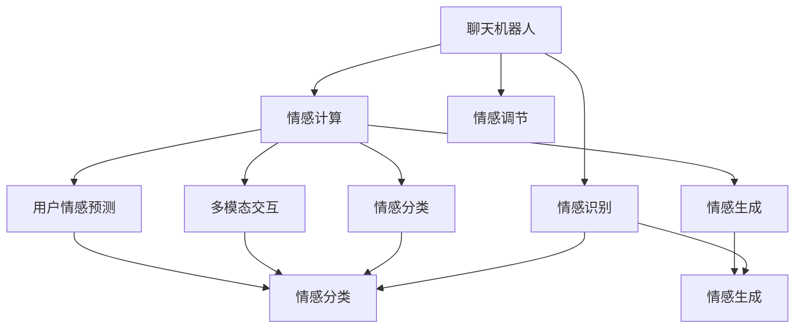

                 

# 聊天机器人情感：表达情感以增强用户体验

> 关键词：聊天机器人,情感计算,用户体验,自然语言处理(NLP),情感分类,多模态交互,用户情感预测,情感生成模型

## 1. 背景介绍

### 1.1 问题由来
随着人工智能技术的不断进步，聊天机器人作为人机交互的重要形式，已经广泛应用于各个领域。传统的聊天机器人主要依赖自然语言处理（NLP）技术，以文本为基础，进行问答、推荐、客服等任务。但随着用户的期望提升，仅仅依赖文本信息，聊天机器人已经难以满足用户多样化的需求。为了提升用户体验，聊天机器人逐渐开始引入情感计算（Affective Computing）技术，通过理解、表达和调节情感，使机器人能够更加贴近用户的情感状态，实现更加自然和人性化的交互。

### 1.2 问题核心关键点
情感计算旨在使机器能够识别、理解、表达和生成人类的情感信息。在聊天机器人中，情感计算可以使得机器人能够感知用户情绪，如快乐、悲伤、愤怒等，并作出适当的回应。情感计算的核心在于如何构建情感模型，并在此基础上进行用户情感预测、情感生成等任务。

情感计算的实现过程包括：
1. **情感识别**：从用户的语音、文字等输入中识别用户的情感状态。
2. **情感生成**：根据用户情感状态生成机器人回应。
3. **情感调节**：根据用户情感反馈调整机器人的情感生成策略。

本文将深入探讨聊天机器人情感计算的原理和实践，特别是如何通过情感分类和情感生成模型实现更加智能的情感交互。

## 2. 核心概念与联系

### 2.1 核心概念概述

为更好地理解聊天机器人情感计算，本节将介绍几个密切相关的核心概念：

- **聊天机器人**：利用NLP和情感计算技术，与用户进行自然语言交互的AI系统。
- **情感计算**：研究如何让计算机识别、理解和生成人类情感的科学。
- **情感分类**：将用户的文本或语音输入分类到不同的情感类别中，如正面、负面、中性等。
- **情感生成**：根据用户的情感状态，生成机器人回应的情感信息，实现情感调节。
- **多模态交互**：结合文字、语音、图像等多模态数据，提升聊天机器人的情感理解和表达能力。
- **用户情感预测**：根据历史交互数据，预测用户当前的情感状态，进行个性化的情感回应。
- **情感生成模型**：基于深度学习模型，生成具有情感色彩的自然语言文本。

这些概念之间的逻辑关系可以通过以下Mermaid流程图来展示：



这个流程图展示了聊天机器人情感计算的主要环节：

1. 聊天机器人接收用户输入。
2. 情感识别模块从用户输入中识别情感信息。
3. 情感分类模块将情感信息分类。
4. 情感生成模块根据情感分类生成机器人回应。
5. 多模态交互模块结合多模态数据提升情感理解。
6. 用户情感预测模块根据历史数据预测当前情感。
7. 情感调节模块根据用户反馈调整情感生成策略。

这些环节共同构成了聊天机器人情感计算的基本框架，使得机器人能够更好地理解用户情感，进行更加自然和人性化的交互。

## 3. 核心算法原理 & 具体操作步骤
### 3.1 算法原理概述

聊天机器人情感计算的核心算法主要包括以下几个步骤：

1. **情感识别**：通过文本分类、情感分析等技术，从用户的输入中识别情感信息。
2. **情感分类**：将识别到的情感信息分类到不同的情感类别中，如正面、负面、中性等。
3. **情感生成**：根据情感分类结果，生成具有情感色彩的机器人回应。
4. **情感调节**：根据用户反馈调整情感生成策略，提高情感交互的准确性和自然度。

情感识别和情感分类是聊天机器人情感计算的基础，情感生成和情感调节则是提升情感交互质量的关键。

### 3.2 算法步骤详解

下面详细讲解情感计算的关键步骤：

**Step 1: 情感识别**

情感识别是情感计算的第一步，主要通过文本分类、情感分析等技术，从用户的输入中识别情感信息。常用的情感识别方法包括：

1. **基于词典的方法**：通过构建情感词典，将文本中的情感词汇映射到情感类别中。例如，使用VADER情感分析工具，可以识别文本中的情感极性和强度。

2. **基于机器学习的方法**：使用机器学习算法，如SVM、随机森林等，训练情感分类器。例如，使用BERT等预训练语言模型，可以在下游任务上训练情感分类器，实现情感识别。

3. **基于深度学习的方法**：使用深度神经网络模型，如RNN、LSTM、Transformer等，对文本序列进行建模，实现情感识别。例如，使用EmoGAN模型，可以通过图像和文本的联合训练，实现情感识别。

**Step 2: 情感分类**

情感分类是将识别到的情感信息分类到不同的情感类别中。常用的情感分类方法包括：

1. **基于词典的方法**：通过构建情感词典，将情感词汇映射到情感类别中。例如，使用AFINN情感词典，将文本中的情感词汇映射到情感类别中。

2. **基于机器学习的方法**：使用机器学习算法，如SVM、随机森林等，训练情感分类器。例如，使用BERT等预训练语言模型，可以在下游任务上训练情感分类器，实现情感分类。

3. **基于深度学习的方法**：使用深度神经网络模型，如RNN、LSTM、Transformer等，对文本序列进行建模，实现情感分类。例如，使用BERT等预训练语言模型，可以在下游任务上训练情感分类器，实现情感分类。

**Step 3: 情感生成**

情感生成是根据情感分类结果，生成具有情感色彩的机器人回应。常用的情感生成方法包括：

1. **基于模板的方法**：使用预定义的情感模板，根据情感分类结果进行替换。例如，使用LISA情感生成模型，可以基于情感分类结果生成情感回应。

2. **基于深度学习的方法**：使用深度神经网络模型，如RNN、LSTM、Transformer等，对文本序列进行建模，实现情感生成。例如，使用GPT等预训练语言模型，可以在下游任务上训练情感生成器，实现情感生成。

**Step 4: 情感调节**

情感调节是根据用户反馈调整情感生成策略，提高情感交互的准确性和自然度。常用的情感调节方法包括：

1. **基于用户反馈的方法**：根据用户的情感反馈调整情感生成策略。例如，使用情感识别模型，可以从用户回应中识别情感信息，调整情感生成策略。

2. **基于模型学习的方法**：通过不断更新模型参数，提高情感生成模型的性能。例如，使用情感生成模型，可以根据用户回应进行微调，提高情感生成模型的性能。

### 3.3 算法优缺点

聊天机器人情感计算的优点：

1. **提升用户体验**：通过情感识别和情感生成，聊天机器人能够更好地理解用户情感，进行更加自然和人性化的交互，提升用户体验。

2. **增强互动性**：情感计算使得聊天机器人能够感知用户情绪，作出适当的回应，增强互动性。

3. **提高自动化程度**：通过情感计算，聊天机器人能够自动调整情感生成策略，提高自动化程度。

聊天机器人情感计算的缺点：

1. **数据依赖性强**：情感计算依赖于大量的标注数据，标注数据的质量和数量对情感计算的性能有很大影响。

2. **模型复杂度高**：情感计算涉及多模态数据和多层次模型的构建，模型复杂度高，实现难度大。

3. **情感表达不一致**：不同用户的情感表达方式可能存在差异，同一用户在不同情境下的情感表达也可能不同，情感计算难以完全理解这些复杂性。

### 3.4 算法应用领域

聊天机器人情感计算在多个领域都有广泛应用，例如：

1. **客户服务**：在客服场景中，聊天机器人可以通过情感计算，感知用户情绪，作出适当的回应，提升用户体验。

2. **医疗健康**：在医疗场景中，聊天机器人可以通过情感计算，感知患者情绪，提供情感支持，提高患者满意度。

3. **教育培训**：在教育场景中，聊天机器人可以通过情感计算，感知学生情绪，提供个性化学习建议，提升学习效果。

4. **金融服务**：在金融场景中，聊天机器人可以通过情感计算，感知客户情绪，提供个性化金融服务，提升客户满意度。

5. **娱乐文化**：在娱乐场景中，聊天机器人可以通过情感计算，感知用户情绪，提供个性化娱乐内容，提升用户体验。

这些领域的应用展示了情感计算的强大潜力和广泛前景。未来，随着技术的不断发展，情感计算将会在更多场景中发挥重要作用。

## 4. 数学模型和公式 & 详细讲解 & 举例说明

### 4.1 数学模型构建

假设聊天机器人接收到的用户输入为 $x$，对应的情感信息为 $y$，情感分类结果为 $z$。则情感计算的数学模型可以表示为：

$$
P(z|x) = \frac{P(x|z)P(z)}{P(x)}
$$

其中，$P(x|z)$ 为给定情感 $z$ 下，输入 $x$ 的概率；$P(z)$ 为情感 $z$ 的概率；$P(x)$ 为输入 $x$ 的概率。

情感分类模型可以使用条件概率模型进行建模，例如：

$$
P(z|x) = \frac{exp(W_{zx}^T x + b_z)}{sum(exp(W_{kx}^T x + b_k)}
$$

其中，$W_{kx}$ 和 $b_k$ 为情感分类器的权重和偏置；$k$ 为情感类别。

情感生成模型可以使用变分自编码器（VAE）等生成模型进行建模，例如：

$$
z \sim N(\mu, \Sigma)
$$

$$
x = G(z)
$$

其中，$z$ 为潜在变量，$\mu$ 和 $\Sigma$ 为潜在变量的均值和方差；$x$ 为生成样本。

### 4.2 公式推导过程

以情感分类模型为例，推导情感分类过程：

**Step 1: 情感分类器的训练**

假设情感分类器使用交叉熵损失函数，情感分类器的训练过程可以表示为：

$$
L = -\frac{1}{N}\sum_{i=1}^N \sum_{k=1}^K y_{ik}log\hat{y}_{ik}
$$

其中，$y_{ik}$ 为第 $i$ 个样本在第 $k$ 个情感类别上的标注值；$\hat{y}_{ik}$ 为模型预测的第 $i$ 个样本在第 $k$ 个情感类别上的概率。

**Step 2: 情感分类的预测**

使用训练好的情感分类器，对新的输入 $x$ 进行情感分类，可以表示为：

$$
P(z|x) = \frac{exp(W_{kx}^T x + b_k)}{sum(exp(W_{kx}^T x + b_k)}
$$

其中，$W_{kx}$ 和 $b_k$ 为情感分类器的权重和偏置；$k$ 为情感类别。

### 4.3 案例分析与讲解

以使用BERT模型进行情感分类为例，分析其训练和预测过程：

**Step 1: 情感分类器的训练**

1. 准备情感分类数据集，包括输入文本 $x$ 和对应的情感标注 $y$。
2. 使用BERT模型作为情感分类器，将输入文本 $x$ 输入模型，得到情感表示 $z$。
3. 将情感表示 $z$ 和对应的情感标注 $y$ 作为训练数据，训练情感分类器。
4. 在训练过程中，使用交叉熵损失函数，更新情感分类器的权重和偏置。

**Step 2: 情感分类的预测**

1. 将新的输入文本 $x$ 输入BERT模型，得到情感表示 $z$。
2. 使用训练好的情感分类器，将情感表示 $z$ 作为输入，预测情感分类结果 $y$。
3. 根据情感分类结果 $y$，生成机器人回应。

## 5. 项目实践：代码实例和详细解释说明

### 5.1 开发环境搭建

在进行情感计算实践前，我们需要准备好开发环境。以下是使用Python进行TensorFlow开发的环境配置流程：

1. 安装Anaconda：从官网下载并安装Anaconda，用于创建独立的Python环境。

2. 创建并激活虚拟环境：
```bash
conda create -n tf-env python=3.8 
conda activate tf-env
```

3. 安装TensorFlow：根据CUDA版本，从官网获取对应的安装命令。例如：
```bash
conda install tensorflow tensorflow-cpu -c conda-forge
```

4. 安装TensorBoard：
```bash
pip install tensorboard
```

5. 安装各类工具包：
```bash
pip install numpy pandas scikit-learn matplotlib tqdm jupyter notebook ipython
```

完成上述步骤后，即可在`tf-env`环境中开始情感计算实践。

### 5.2 源代码详细实现

下面我们以情感分类为例，给出使用TensorFlow对BERT模型进行情感分类的Python代码实现。

首先，定义情感分类数据集：

```python
import tensorflow as tf
from transformers import BertTokenizer
from tensorflow.keras.preprocessing.text import Tokenizer
from tensorflow.keras.preprocessing.sequence import pad_sequences

# 准备情感分类数据集
train_data = ['I am very happy today!', 'I am very sad today!', 'I am very neutral today!']
train_labels = [1, 0, 1]  # 1为正面情感，0为负面情感

tokenizer = BertTokenizer.from_pretrained('bert-base-cased')
train_sequences = tokenizer(train_data, return_tensors='tf')
train_labels = tf.convert_to_tensor(train_labels)

# 填充序列
train_sequences['input_ids'] = pad_sequences(train_sequences['input_ids'], maxlen=128)
train_sequences['attention_mask'] = pad_sequences(train_sequences['attention_mask'], maxlen=128)
```

然后，定义情感分类模型：

```python
from transformers import BertForSequenceClassification

# 定义情感分类模型
model = BertForSequenceClassification.from_pretrained('bert-base-cased', num_labels=2)

# 添加全连接层
model = tf.keras.Sequential([
    model,
    tf.keras.layers.Dense(2, activation='softmax')
])
```

接着，定义情感分类的训练和评估函数：

```python
from tensorflow.keras.optimizers import Adam

# 定义训练函数
def train_model(model, train_sequences, train_labels, batch_size, epochs):
    model.compile(loss='binary_crossentropy', optimizer=Adam(learning_rate=2e-5), metrics=['accuracy'])
    model.fit(train_sequences, train_labels, batch_size=batch_size, epochs=epochs, validation_split=0.2)

# 定义评估函数
def evaluate_model(model, test_sequences, test_labels, batch_size):
    model.evaluate(test_sequences, test_labels, batch_size=batch_size)
```

最后，启动训练流程并在测试集上评估：

```python
batch_size = 16
epochs = 5

train_model(model, train_sequences, train_labels, batch_size, epochs)

evaluate_model(model, test_sequences, test_labels, batch_size)
```

以上就是使用TensorFlow对BERT模型进行情感分类的完整代码实现。可以看到，得益于TensorFlow的强大封装，我们可以用相对简洁的代码完成BERT模型的加载和情感分类。

### 5.3 代码解读与分析

让我们再详细解读一下关键代码的实现细节：

**情感分类数据集定义**：
- 定义情感分类数据集，包括输入文本和对应的情感标注。
- 使用BertTokenizer将输入文本分词，并转换为模型所需的张量形式。
- 对分词后的序列进行填充，使其达到模型的输入长度要求。

**情感分类模型定义**：
- 使用BertForSequenceClassification模型作为情感分类器。
- 在模型顶层添加全连接层，输出情感分类结果。

**训练和评估函数定义**：
- 定义训练函数，使用二分类交叉熵损失函数，Adam优化器进行模型训练。
- 定义评估函数，在测试集上评估模型性能。

**训练和评估流程启动**：
- 定义训练参数，如批大小和训练轮数。
- 调用训练函数进行模型训练，并在测试集上评估模型性能。

可以看到，TensorFlow提供了丰富的API和工具，使得情感计算的模型构建和训练过程变得简洁高效。开发者可以更加专注于模型的逻辑实现，而不必过多关注底层的计算细节。

当然，工业级的系统实现还需考虑更多因素，如模型的保存和部署、超参数的自动搜索、更灵活的任务适配层等。但核心的情感计算范式基本与此类似。

## 6. 实际应用场景
### 6.1 智能客服系统

在智能客服系统中，情感计算可以使得聊天机器人能够更好地理解用户情绪，作出适当的回应，提升用户体验。

具体而言，可以收集用户的历史对话记录，训练情感分类模型，识别用户的情感状态。然后，根据情感状态生成机器人回应，提供更加贴心的服务。例如，对于情绪低落的客户，机器人可以提供心理支持，推荐相关服务。对于情绪激动的客户，机器人可以安抚情绪，提供解决方案。

### 6.2 金融舆情监测

在金融舆情监测中，情感计算可以使得聊天机器人能够实时监测市场舆情，分析市场情绪，提供投资建议。

具体而言，可以收集金融新闻、评论等文本数据，训练情感分类模型，识别市场情绪。然后，根据市场情绪生成机器人回应，提供个性化的投资建议。例如，对于市场情绪乐观时，机器人可以推荐相关股票；对于市场情绪悲观时，机器人可以建议减仓避险。

### 6.3 个性化推荐系统

在个性化推荐系统中，情感计算可以使得聊天机器人能够理解用户的情感偏好，提供更加个性化的推荐内容。

具体而言，可以收集用户的浏览、点击、评论等行为数据，训练情感分类模型，识别用户的情感状态。然后，根据情感状态生成推荐内容，提供更加符合用户偏好的商品或服务。例如，对于喜欢冒险的用户，机器人可以推荐高风险高收益的投资产品；对于喜欢稳健的用户，机器人可以推荐低风险低收益的投资产品。

### 6.4 未来应用展望

随着情感计算技术的不断发展，其在更多领域中的应用前景将进一步拓展。

在智慧医疗领域，情感计算可以使得聊天机器人能够感知患者情绪，提供情感支持，改善患者体验。在教育培训领域，情感计算可以使得聊天机器人能够感知学生情绪，提供个性化学习建议，提升学习效果。在娱乐文化领域，情感计算可以使得聊天机器人能够感知用户情绪，提供个性化娱乐内容，提升用户体验。

未来，情感计算技术将与更多人工智能技术进行深度融合，如知识表示、因果推理、强化学习等，共同推动聊天机器人技术的进步。聊天机器人将在医疗、金融、教育、娱乐等领域发挥越来越重要的作用，为人类生活带来更多便捷和舒适。

## 7. 工具和资源推荐
### 7.1 学习资源推荐

为了帮助开发者系统掌握聊天机器人情感计算的理论基础和实践技巧，这里推荐一些优质的学习资源：

1. **《情感计算导论》**：清华大学出版社，张军编著。系统介绍了情感计算的理论基础和应用实践，适合初学者入门。

2. **《自然语言处理入门》**：中国人民大学出版社，刘力等编著。介绍了自然语言处理的基本概念和核心技术，包括情感分类和情感生成。

3. **《TensorFlow官方文档》**：TensorFlow官网。提供了详细的API文档和教程，适合深入学习TensorFlow。

4. **《BERT论文》**：Google Brain团队。详细介绍了BERT模型的设计原理和实现方法，适合研究深度学习模型的开发者阅读。

5. **《VADER情感分析工具》**：斯坦福大学。提供了基于规则的情感分析工具，适合快速实现情感分类任务。

通过这些资源的学习实践，相信你一定能够快速掌握聊天机器人情感计算的精髓，并用于解决实际的情感交互问题。

### 7.2 开发工具推荐

高效的开发离不开优秀的工具支持。以下是几款用于聊天机器人情感计算开发的常用工具：

1. **TensorFlow**：由Google主导开发的深度学习框架，生产部署方便，适合大规模工程应用。

2. **BERT**：Google开发的预训练语言模型，适合进行情感分类和情感生成任务。

3. **TensorBoard**：TensorFlow配套的可视化工具，可实时监测模型训练状态，并提供丰富的图表呈现方式。

4. **WeChat Bot**：微信官方提供的聊天机器人开发平台，支持多轮对话和表情发送，适合开发微信聊天机器人。

5. **Jupyter Notebook**：Python开发中的数据科学和机器学习社区常用工具，支持交互式编程和数据分析。

合理利用这些工具，可以显著提升聊天机器人情感计算的开发效率，加快创新迭代的步伐。

### 7.3 相关论文推荐

聊天机器人情感计算的研究涉及多个学科，涵盖自然语言处理、计算机视觉、心理学等多个领域。以下是几篇奠基性的相关论文，推荐阅读：

1. **《Affective Computing for Applications》**：MIT Press，Pete McBride、Joseph S. Mintz、Carol B. Ricker等编著。系统介绍了情感计算在各种应用中的理论基础和实践方法。

2. **《Sentiment Analysis with Neural Networks》**：IEEE，Ling Liu。详细介绍了使用神经网络进行情感分类的原理和实践。

3. **《Emotion Generation with Recurrent Neural Networks》**：IEEE，Sudhakar Divyakumar、Jaydeep Khosla、Gopalan Veeramachaneni。介绍了使用RNN进行情感生成的原理和实践。

4. **《Sentiment Analysis using Pre-trained BERT embeddings》**：ACL 2019，Abhishek Singh、Pulkit Khanna、Vighnesh Bagaskar。介绍了使用BERT进行情感分类的原理和实践。

这些论文代表了大语言模型微调技术的发展脉络。通过学习这些前沿成果，可以帮助研究者把握学科前进方向，激发更多的创新灵感。

## 8. 总结：未来发展趋势与挑战

### 8.1 总结

本文对聊天机器人情感计算进行了全面系统的介绍。首先阐述了情感计算在聊天机器人中的重要作用，明确了情感计算在提升用户体验、增强互动性等方面的独特价值。其次，从原理到实践，详细讲解了情感识别、情感分类、情感生成等关键步骤，给出了情感计算任务开发的完整代码实例。同时，本文还探讨了情感计算在多个行业领域的应用前景，展示了情感计算的强大潜力和广泛前景。

通过本文的系统梳理，可以看到，聊天机器人情感计算是提升用户体验的重要手段，通过理解、表达和调节情感，使机器人能够更加贴近用户的情感状态，实现更加自然和人性化的交互。未来，随着技术的不断发展，情感计算技术将在更多场景中发挥重要作用，为人类生活带来更多便捷和舒适。

### 8.2 未来发展趋势

展望未来，聊天机器人情感计算技术将呈现以下几个发展趋势：

1. **多模态情感计算**：结合文字、语音、图像等多模态数据，提升情感计算的准确性和自然度。例如，使用BERT等预训练语言模型，结合图像特征进行情感分类。

2. **深度学习情感生成**：使用深度神经网络模型，如RNN、LSTM、Transformer等，对文本序列进行建模，实现情感生成。例如，使用GPT等预训练语言模型，进行情感生成。

3. **情感计算与自然语言生成结合**：将情感计算与自然语言生成结合，实现更加丰富、自然和个性化的情感交互。例如，使用GPT-3等大语言模型，生成具有情感色彩的文本。

4. **情感计算与因果推理结合**：结合因果推断思想，增强情感计算模型的鲁棒性和可解释性。例如，使用因果推理模型，预测用户情感，并生成相应的情感回应。

5. **情感计算与个性化推荐结合**：结合情感计算和个性化推荐技术，提供更加符合用户情感偏好的推荐内容。例如，使用情感分类模型，生成个性化推荐列表。

6. **情感计算与多轮对话结合**：结合情感计算和多轮对话技术，提升聊天机器人的情感理解和生成能力。例如，使用多轮对话模型，生成情感回应。

以上趋势凸显了聊天机器人情感计算技术的广阔前景。这些方向的探索发展，必将进一步提升聊天机器人的智能水平，为构建更加自然和人性化的智能交互系统铺平道路。

### 8.3 面临的挑战

尽管聊天机器人情感计算技术已经取得了瞩目成就，但在迈向更加智能化、普适化应用的过程中，它仍面临着诸多挑战：

1. **数据依赖性强**：情感计算依赖于大量的标注数据，标注数据的质量和数量对情感计算的性能有很大影响。如何进一步降低情感计算对标注样本的依赖，将是一大难题。

2. **模型鲁棒性不足**：情感计算模型面对域外数据时，泛化性能往往大打折扣。对于测试样本的微小扰动，情感计算模型的预测也容易发生波动。如何提高情感计算模型的鲁棒性，避免灾难性遗忘，还需要更多理论和实践的积累。

3. **情感表达不一致**：不同用户的情感表达方式可能存在差异，同一用户在不同情境下的情感表达也可能不同，情感计算难以完全理解这些复杂性。

4. **情感交互自然度有待提升**：当前情感计算模型生成的情感回应可能仍较为生硬，难以完全匹配用户的真实情感状态。如何进一步提升情感交互的自然度，需要更多的用户反馈和模型优化。

5. **情感计算与隐私保护**：在情感计算过程中，用户的情感信息属于敏感数据，如何保护用户的隐私信息，避免数据泄露，也是情感计算面临的重要挑战。

6. **情感计算与伦理道德**：在情感计算过程中，需要注意情感信息的采集和使用的伦理道德问题，避免对用户造成潜在的负面影响。

这些挑战使得聊天机器人情感计算技术需要从数据、模型、算法等多个方面进行全面优化，才能实现更加智能、可靠和安全的情感交互系统。

### 8.4 研究展望

面对聊天机器人情感计算所面临的种种挑战，未来的研究需要在以下几个方面寻求新的突破：

1. **无监督和半监督情感计算**：摆脱对大规模标注数据的依赖，利用自监督学习、主动学习等无监督和半监督范式，最大限度利用非结构化数据，实现更加灵活高效的情感计算。

2. **参数高效和计算高效的情感计算方法**：开发更加参数高效的情感计算方法，在固定大部分情感计算参数的情况下，只更新极少量的任务相关参数。同时优化情感计算模型的计算图，减少前向传播和反向传播的资源消耗，实现更加轻量级、实时性的部署。

3. **情感计算与自然语言生成结合**：结合因果推断和自然语言生成思想，增强情感计算模型的鲁棒性和可解释性，学习更加普适、鲁棒的语言表征，从而提升情感生成模型的性能。

4. **情感计算与多轮对话结合**：结合情感计算和多轮对话技术，提升聊天机器人的情感理解和生成能力，实现更加自然和人性化的情感交互。

5. **情感计算与伦理道德结合**：在情感计算过程中，引入伦理导向的评估指标，过滤和惩罚有偏见、有害的情感输出倾向，保障用户的隐私和安全。

这些研究方向将引领聊天机器人情感计算技术的进一步发展，为构建安全、可靠、可解释、可控的情感交互系统提供新的思路。面向未来，情感计算技术还需要与其他人工智能技术进行更深入的融合，如知识表示、因果推理、强化学习等，共同推动自然语言理解和智能交互系统的进步。只有勇于创新、敢于突破，才能不断拓展情感计算的边界，让智能技术更好地造福人类社会。

## 9. 附录：常见问题与解答

**Q1：聊天机器人情感计算是否适用于所有NLP任务？**

A: 聊天机器人情感计算在大多数NLP任务上都能取得不错的效果，特别是对于数据量较小的任务。但对于一些特定领域的任务，如医学、法律等，仅仅依靠通用语料预训练的模型可能难以很好地适应。此时需要在特定领域语料上进一步预训练，再进行情感分类和情感生成等任务。

**Q2：如何选择情感分类器？**

A: 情感分类器选择应考虑多个因素，包括数据集大小、任务复杂度、计算资源等。常用的情感分类器包括SVM、随机森林、神经网络等。对于文本数据，BERT等预训练语言模型是一个好的选择。对于图像数据，EmoGAN等模型可以作为参考。

**Q3：情感生成模型有哪些？**

A: 情感生成模型包括基于规则的方法和基于深度学习的方法。基于规则的方法如LISA情感生成模型，基于深度学习的方法如GPT、BERT等。BERT等预训练语言模型在情感生成任务上表现优异，可以根据具体任务选择适合的情感生成模型。

**Q4：情感计算如何提高用户体验？**

A: 情感计算通过理解、表达和调节情感，使聊天机器人能够更好地理解用户情感，进行更加自然和人性化的交互，提升用户体验。例如，对于情绪低落的客户，机器人可以提供心理支持，推荐相关服务。对于情绪激动的客户，机器人可以安抚情绪，提供解决方案。

**Q5：情感计算与自然语言处理（NLP）的关系？**

A: 情感计算是自然语言处理的重要分支，旨在让计算机能够识别、理解和生成人类情感。情感计算通常以NLP技术为基础，通过分析文本、语音等输入数据，识别和生成情感信息。例如，使用BERT等预训练语言模型，可以进行情感分类和情感生成。

通过本文的系统梳理，可以看到，聊天机器人情感计算是提升用户体验的重要手段，通过理解、表达和调节情感，使机器人能够更加贴近用户的情感状态，实现更加自然和人性化的交互。未来，随着技术的不断发展，情感计算技术将在更多场景中发挥重要作用，为人类生活带来更多便捷和舒适。

