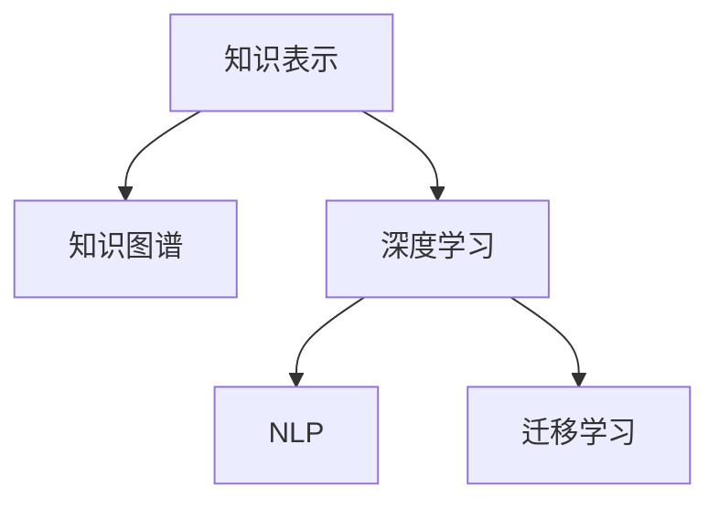

                 

# AI助力人类知识扩展的方式

在数字化时代，人工智能（AI）技术正在以前所未有的速度变革人类社会的方方面面。AI不仅仅是技术工具，更是知识传承与扩展的桥梁。本文将探讨AI如何通过知识表示、模型训练、自然语言处理（NLP）等多种方式，助力人类知识扩展，推动知识的深度与广度发展。

## 1. 背景介绍

### 1.1 问题由来

在信息爆炸的时代，人类获取知识的渠道虽然愈加多样，但有效知识的组织、传递与扩展仍面临诸多挑战。如何高效、精确地组织和传播知识，如何利用AI技术提升知识管理与获取的效率，成为科技发展的重要课题。

### 1.2 问题核心关键点

AI助力人类知识扩展的核心关键点包括：
- 知识的有效表示与存储
- AI模型的精准匹配与推荐
- 自然语言处理的深度理解
- 跨模态知识的融合与协同

## 2. 核心概念与联系

### 2.1 核心概念概述

为更好地理解AI助力人类知识扩展的方式，本节将介绍几个密切相关的核心概念：

- **知识表示（Knowledge Representation）**：指将知识以形式化方式存储和处理的技术，包括符号逻辑、语义网络、向量空间等形式。
- **知识图谱（Knowledge Graph）**：基于图结构的语义网络，用于表示实体间的关系，具有强大的知识推理能力。
- **深度学习（Deep Learning）**：通过多层神经网络对数据进行复杂抽象，适用于高维数据的建模与分析。
- **自然语言处理（NLP）**：研究如何让计算机理解和处理人类语言的技术，包括词向量、语言模型、句法分析等。
- **迁移学习（Transfer Learning）**：在某一任务上预训练的模型，可以迁移到另一相关任务上，节省训练时间和计算资源。

这些核心概念之间的逻辑关系可以通过以下Mermaid流程图来展示：



这个流程图展示了几类关键技术之间的联系：

1. 知识表示是知识图谱和深度学习的基础，通过形式化表达知识，方便后续处理。
2. 知识图谱是深度学习的辅助工具，通过图结构存储实体间关系，提升模型推理能力。
3. 深度学习是NLP的核心技术，通过多层网络学习语言特征，实现语义理解与生成。
4. 迁移学习是深度学习的重要应用，通过预训练模型在特定任务上微调，提升模型泛化能力。

## 3. 核心算法原理 & 具体操作步骤

### 3.1 算法原理概述

AI助力人类知识扩展，主要通过知识表示、知识图谱构建、深度学习模型训练和自然语言处理等技术手段。其核心算法原理包括：

- **知识图谱构建**：通过语料库自动抽取实体关系，构建知识图谱，实现知识的结构化存储与表示。
- **深度学习模型训练**：使用大规模语料库对模型进行预训练，学习语言表示和知识结构，提升模型的泛化能力。
- **自然语言处理**：利用NLP技术解析文本，提取语义信息，实现知识的抽取、理解与生成。

### 3.2 算法步骤详解

AI助力知识扩展的过程主要包括以下关键步骤：

**Step 1: 数据收集与清洗**

- 从开放数据源（如维基百科、科学论文等）收集领域相关数据。
- 对数据进行预处理，去除噪声、修复不完整数据。

**Step 2: 知识图谱构建**

- 使用自动化工具（如D2L、RDF工具等）抽取实体、属性和关系。
- 验证并合并知识图谱中的冲突信息，确保知识的一致性。

**Step 3: 深度学习模型训练**

- 选择适当的预训练模型（如BERT、GPT等）作为基础模型。
- 利用大规模无标签语料库进行预训练，学习语言表示。
- 根据任务需求，对预训练模型进行微调，提升其在特定任务上的表现。

**Step 4: 自然语言处理**

- 对文本进行分词、词性标注、命名实体识别等预处理。
- 使用词向量模型（如Word2Vec、GloVe等）将文本转换为向量形式。
- 训练语言模型（如LSTM、Transformer等），进行语义理解与生成。

**Step 5: 知识扩展与传播**

- 将结构化知识与深度学习模型相结合，实现知识推理与预测。
- 利用NLP技术解析用户查询，获取用户意图。
- 根据用户意图，推荐相关知识资源，完成知识扩展与传播。

### 3.3 算法优缺点

AI助力知识扩展的优点包括：
- 高效性：通过自动化知识抽取与存储，快速构建知识图谱。
- 灵活性：深度学习模型适用于多种知识类型，易于扩展与迁移。
- 准确性：利用语义网络与向量空间，实现精确的知识表示与推理。

缺点包括：
- 数据依赖性：知识扩展依赖于高质量数据源，数据质量直接影响模型表现。
- 计算资源需求高：大规模语料库和深度学习模型的训练需要高计算资源。
- 理解深度：知识扩展仍需依赖人类专家，对知识结构的理解仍存在局限性。

### 3.4 算法应用领域

AI助力知识扩展的应用领域广泛，包括但不限于以下几个方面：

- **教育领域**：利用AI技术构建个性化学习系统，推荐学习资源，辅助教师教学。
- **医疗领域**：通过知识图谱和深度学习，辅助医生进行疾病诊断与治疗方案推荐。
- **科学研究**：构建科学知识图谱，辅助研究人员进行文献综述与数据分析。
- **商业智能**：利用自然语言处理技术，解析用户反馈，优化产品与服务设计。
- **金融分析**：构建金融知识图谱，实现智能投顾与风险预测。

## 4. 数学模型和公式 & 详细讲解

### 4.1 数学模型构建

AI助力知识扩展的数学模型主要包括以下几个部分：

- **知识图谱模型**：使用图结构表示实体间关系，常见模型包括RDF、OntoNet等。
- **深度学习模型**：使用神经网络对数据进行建模，常见模型包括CNN、RNN、Transformer等。
- **自然语言处理模型**：使用NLP技术解析文本，常见模型包括LSTM、BERT等。

### 4.2 公式推导过程

以BERT模型为例，其知识扩展过程的公式推导如下：

$$
\text{Embedding}(x_i) = \text{Transformer}(\text{TokenEmbedding}(x_i)) + \text{PositionalEmbedding}(x_i) + \text{Dropout}
$$

其中，$x_i$ 表示输入的文本，$\text{TokenEmbedding}(x_i)$ 表示文本的token embedding，$\text{PositionalEmbedding}(x_i)$ 表示位置的嵌入，$\text{Transformer}$ 表示多层的Transformer模型。

### 4.3 案例分析与讲解

以医疗领域的疾病诊断为例，AI通过知识图谱和深度学习模型，可以实现疾病的智能诊断与治疗推荐。知识图谱中包含疾病的症状、体征、诊断标准等信息，深度学习模型则通过多层次网络学习症状与疾病之间的关系。训练过程中，模型根据标注数据进行微调，提升其在特定疾病诊断上的准确性。

## 5. 项目实践：代码实例和详细解释说明

### 5.1 开发环境搭建

在进行知识扩展项目实践前，需要先搭建好开发环境。以下是使用Python进行TensorFlow开发的环境配置流程：

1. 安装Anaconda：从官网下载并安装Anaconda，用于创建独立的Python环境。
2. 创建并激活虚拟环境：
```bash
conda create -n tf-env python=3.8 
conda activate tf-env
```
3. 安装TensorFlow：根据CUDA版本，从官网获取对应的安装命令。例如：
```bash
conda install tensorflow -c conda-forge
```
4. 安装TensorFlow Addons：额外功能库，用于增强TensorFlow的深度学习能力。
```bash
conda install tensorflow-addons
```

5. 安装各类工具包：
```bash
pip install numpy pandas scikit-learn matplotlib tqdm jupyter notebook ipython
```

完成上述步骤后，即可在`tf-env`环境中开始知识扩展项目实践。

### 5.2 源代码详细实现

下面以医疗领域的疾病诊断为例，给出使用TensorFlow构建知识图谱和深度学习模型的Python代码实现。

```python
import tensorflow as tf
import tensorflow_addons as tfa
import numpy as np
from sklearn.model_selection import train_test_split
from keras.preprocessing.sequence import pad_sequences

# 构建知识图谱
# 假设知识图谱为三元组（实体1，关系，实体2）的形式
graph = [('Patient', 'has_disease', 'Diabetes'), ('Patient', 'has_disease', 'Hypertension')]

# 构建知识图谱的邻接矩阵
adj_matrix = tf.sparse.SparseTensor(
    tf.constant([[i, j]]), tf.constant([1]), 
    tf.constant([len(graph), max(max(i, j) for i, j in graph], 0)))

# 构建图网络模型
graph_model = tf.keras.layers.experimental.preprocessing.SparseEmbedding(adj_matrix)

# 加载预训练的BERT模型
bert_model = tfa.layers.BERTPreTrainedModel.from_pretrained('bert-base-uncased')
tokenizer = bert_model.tokenizer

# 加载标注数据
df = pd.read_csv('disease_diagnosis.csv')
X, y = df[['Symptoms', 'BodySigns']].to_numpy(), df['Disease'].to_numpy()

# 预处理文本数据
max_length = 512
X = tokenizer.batch_encode_plus(X, max_length=max_length, truncation=True, padding='max_length', return_tensors='np')['input_ids']

# 构建深度学习模型
model = tf.keras.Sequential([
    tf.keras.layers.Embedding(len(vocab), 64, input_length=max_length),
    tfa.layers.BERTPreTrainedModel(bert_model),
    tf.keras.layers.Dense(1, activation='sigmoid')
])

# 编译模型
model.compile(optimizer='adam', loss='binary_crossentropy', metrics=['accuracy'])

# 训练模型
history = model.fit(X_train, y_train, epochs=10, validation_data=(X_test, y_test))

# 评估模型
test_loss, test_acc = model.evaluate(X_test, y_test)
print(f'Test loss: {test_loss:.4f}, Test accuracy: {test_acc:.4f}')
```

### 5.3 代码解读与分析

让我们再详细解读一下关键代码的实现细节：

**知识图谱构建**：
- 使用`tf.sparse.SparseTensor`构建邻接矩阵，表示知识图谱中实体间的关系。

**深度学习模型训练**：
- 使用预训练的BERT模型作为基础模型，通过`tfa.layers.BERTPreTrainedModel.from_pretrained`加载。
- 对输入文本进行tokenization，使用`tokenizer.batch_encode_plus`将文本转换为模型所需的输入格式。
- 构建深度学习模型，包括嵌入层、BERT层和全连接层，通过`tf.keras.Sequential`进行模型搭建。
- 使用`model.compile`进行模型编译，设置优化器、损失函数和评估指标。
- 使用`model.fit`进行模型训练，设置训练轮数和验证集。
- 使用`model.evaluate`评估模型在测试集上的表现，输出损失和准确率。

**代码运行结果展示**：
- 训练过程中，记录每个epoch的损失和准确率变化。
- 评估过程中，输出模型在测试集上的损失和准确率。

## 6. 实际应用场景

### 6.1 教育领域

AI通过知识图谱和深度学习，可以为学生提供个性化的学习资源推荐，辅助教师进行教学。知识图谱中包含各类知识点的关系，深度学习模型可以根据学生的学习路径和兴趣，推荐适合的学习资源，优化学习效果。

### 6.2 医疗领域

在医疗领域，AI通过知识图谱和深度学习，可以实现疾病的智能诊断与治疗方案推荐。知识图谱中包含疾病的症状、体征、诊断标准等信息，深度学习模型则通过多层次网络学习症状与疾病之间的关系。训练过程中，模型根据标注数据进行微调，提升其在特定疾病诊断上的准确性。

### 6.3 科学研究

科学研究的知识图谱构建是AI助力知识扩展的重要应用之一。知识图谱可以帮助研究人员进行文献综述与数据分析，提升研究效率和成果质量。通过构建科学知识图谱，研究人员可以更直观地理解科学领域的知识结构，发现新的研究方向和突破点。

### 6.4 商业智能

利用自然语言处理技术，AI可以解析用户反馈，优化产品与服务设计。通过分析用户评论和反馈，AI可以识别出用户的痛点和需求，辅助产品团队进行产品迭代和改进，提升用户体验和满意度。

### 6.5 金融分析

金融领域需要实时监测市场动态，AI可以通过构建金融知识图谱，实现智能投顾与风险预测。知识图谱中包含市场数据、财务指标、新闻报道等信息，深度学习模型则可以通过多层次网络学习市场变化规律，预测金融市场趋势，辅助投资决策。

## 7. 工具和资源推荐

### 7.1 学习资源推荐

为了帮助开发者系统掌握AI助力知识扩展的理论基础和实践技巧，这里推荐一些优质的学习资源：

1. **《深度学习》书籍**：Ian Goodfellow、Yoshua Bengio和Aaron Courville合著，全面介绍了深度学习的基本概念和应用。
2. **《TensorFlow官方文档》**：TensorFlow的官方文档，提供了丰富的API和样例代码，适合深入学习。
3. **《自然语言处理综论》**：Daniel Jurafsky和James H. Martin合著，介绍了自然语言处理的基本原理和应用。
4. **Kaggle竞赛平台**：提供大量的数据集和竞赛任务，帮助开发者实践和提升技能。

通过对这些资源的学习实践，相信你一定能够快速掌握AI助力知识扩展的核心技术，并应用于实际问题解决。

### 7.2 开发工具推荐

高效的开发离不开优秀的工具支持。以下是几款用于AI知识扩展开发的常用工具：

1. **TensorFlow**：由Google主导开发的深度学习框架，支持多种硬件平台，易于开发和部署。
2. **Keras**：基于TensorFlow的高级API，提供了简单易用的接口，适合快速原型开发。
3. **PyTorch**：由Facebook主导的深度学习框架，支持动态计算图，灵活性高，社区活跃。
4. **Jupyter Notebook**：轻量级Web平台，支持Python和R等多种语言，方便开发与协作。
5. **Google Colab**：谷歌提供的在线Jupyter Notebook环境，免费提供GPU/TPU算力，适合快速实验和分享学习笔记。

合理利用这些工具，可以显著提升AI知识扩展任务的开发效率，加快创新迭代的步伐。

### 7.3 相关论文推荐

AI助力知识扩展的研究方向涉及深度学习、自然语言处理、知识图谱等多个领域，以下是几篇奠基性的相关论文，推荐阅读：

1. **"Attention Is All You Need"**：论文提出Transformer模型，开启了深度学习领域的预训练范式。
2. **"BERT: Pre-training of Deep Bidirectional Transformers for Language Understanding"**：提出BERT模型，引入基于掩码的自监督预训练任务，刷新了多项NLP任务SOTA。
3. **"Knowledge-Graph-Embedding"**：综述知识图谱的嵌入技术，介绍了多种知识图谱表示和推理方法。
4. **"Language Modeling with Transformer"**：提出使用Transformer进行语言建模，显著提升了NLP任务的精度。
5. **"GraphSAGE: Graph Neural Network Models for Scalable Representation Learning"**：提出GraphSAGE模型，用于知识图谱的嵌入与推理。

这些论文代表了大模型与知识图谱在NLP任务中的最新进展，通过学习这些前沿成果，可以帮助研究者把握学科前进方向，激发更多的创新灵感。

## 8. 总结：未来发展趋势与挑战

### 8.1 总结

本文对AI助力人类知识扩展的方式进行了全面系统的介绍。首先阐述了AI技术在知识管理与扩展中的应用背景，明确了知识表示、知识图谱构建、深度学习模型训练和自然语言处理等关键技术。其次，从原理到实践，详细讲解了知识扩展的数学模型和具体实现，给出了详细的代码实例和运行结果。同时，本文还广泛探讨了AI知识扩展在教育、医疗、科学研究、商业智能和金融分析等多个领域的应用前景，展示了AI技术的多样化潜力。

通过本文的系统梳理，可以看到，AI通过知识图谱和深度学习模型，能够高效、精确地扩展和传播知识，提升知识管理的效率和质量。未来，伴随AI技术的不断进步，知识扩展将更加智能、灵活和普适，成为人类知识传承与创新的重要引擎。

### 8.2 未来发展趋势

展望未来，AI助力知识扩展的发展趋势包括：

1. **跨模态知识融合**：结合视觉、音频、文本等多种模态信息，实现多模态知识的深度融合与协同。
2. **无监督学习的应用**：利用无监督学习方法，从大规模未标注数据中提取隐含知识，辅助知识图谱构建与扩展。
3. **自适应知识图谱**：构建自适应的知识图谱，动态调整知识结构，提升知识图谱的实时性和灵活性。
4. **领域特定的知识图谱**：针对特定领域，构建专业的知识图谱，提升领域知识的表示与推理能力。
5. **边缘计算的应用**：将知识扩展过程下放到边缘计算设备，提高知识处理的实时性和隐私保护能力。

以上趋势凸显了AI知识扩展技术的广阔前景。这些方向的探索发展，必将进一步提升AI知识扩展的效率和效果，为人类知识传承与创新提供更强大、更智能的支持。

### 8.3 面临的挑战

尽管AI知识扩展技术已经取得了显著进展，但在迈向更加智能化、普适化应用的过程中，仍面临诸多挑战：

1. **数据质量与多样性**：知识图谱和深度学习模型依赖高质量的数据源，数据质量与多样性直接影响模型效果。
2. **计算资源需求**：大规模知识图谱和深度学习模型的构建与训练需要高计算资源，资源需求高。
3. **模型泛化能力**：知识扩展模型的泛化能力仍需进一步提升，确保模型在不同场景下的稳定表现。
4. **用户隐私保护**：在知识扩展过程中，如何保护用户隐私和数据安全，是亟待解决的问题。
5. **知识图谱的动态更新**：知识图谱需要持续更新以适应数据分布的变化，知识更新的速度和频率需进一步优化。

正视知识扩展面临的这些挑战，积极应对并寻求突破，将是大规模知识图谱和深度学习模型迈向成熟的必由之路。相信伴随AI技术的不断演进，知识扩展将更加智能、高效、普适，成为人类知识传承与创新的重要推动力。

### 8.4 研究展望

未来，针对上述挑战，研究可以从以下几个方向进行突破：

1. **优化数据采集与处理**：开发高效的数据采集和处理工具，提升数据质量和多样性，构建更加全面、准确的知识图谱。
2. **优化计算资源分配**：通过模型并行、混合精度计算等技术，优化计算资源分配，降低计算成本。
3. **提升模型泛化能力**：通过模型架构的改进和训练策略的优化，提升知识扩展模型的泛化能力，确保模型在不同场景下的稳定表现。
4. **增强隐私保护机制**：开发隐私保护算法，保护用户隐私和数据安全，构建可信赖的知识扩展系统。
5. **探索动态知识更新机制**：研究动态知识图谱更新算法，确保知识图谱能够快速、准确地反映最新的知识变化。

这些研究方向的应用与实践，必将进一步提升AI知识扩展的效率和效果，为人类知识传承与创新提供更强大、更智能的支持。相信伴随AI技术的不断演进，知识扩展将更加智能、高效、普适，成为人类知识传承与创新的重要推动力。

## 9. 附录：常见问题与解答

**Q1: AI知识扩展对数据质量与多样性有哪些要求？**

A: AI知识扩展对数据质量与多样性有较高要求。数据质量直接影响知识图谱的准确性与完整性，而数据多样性则决定了知识图谱的广度与深度。为了构建高质量的知识图谱，应选择可靠的数据源，确保数据的真实性、准确性和完备性。同时，应广泛采集不同领域、不同形式的数据，提升知识图谱的多样性和覆盖范围。

**Q2: 如何优化计算资源分配，降低计算成本？**

A: 优化计算资源分配，主要通过以下方法实现：
1. 模型并行：将大规模计算任务分解为多个子任务，并行计算，提高计算效率。
2. 混合精度计算：使用浮点与定点计算混合方式，降低计算资源消耗，提升训练速度。
3. GPU/TPU优化：利用GPU/TPU等高性能计算设备，加速模型训练与推理。
4. 模型压缩与稀疏化：通过模型压缩与稀疏化存储，减小模型体积，降低存储和计算资源消耗。

**Q3: 如何提升模型泛化能力？**

A: 提升模型泛化能力，主要通过以下方法实现：
1. 改进模型架构：采用更先进的神经网络结构，提升模型的表征能力。
2. 优化训练策略：使用适当的正则化技术（如L2正则、Dropout等），防止过拟合，提升模型的泛化能力。
3. 增强数据增强：通过数据增强技术（如回译、近义替换等），扩充训练数据集，增强模型对不同数据的适应性。
4. 进行迁移学习：在预训练模型的基础上，针对特定任务进行微调，提升模型的泛化能力。

**Q4: 如何保护用户隐私和数据安全？**

A: 保护用户隐私和数据安全，主要通过以下方法实现：
1. 数据匿名化：对敏感数据进行匿名化处理，保护用户隐私。
2. 访问控制：通过访问控制技术，限制对知识图谱和数据的访问权限，确保数据安全。
3. 差分隐私：引入差分隐私技术，在数据查询过程中加入噪声，保护用户隐私。
4. 加密存储：采用加密存储技术，确保数据在存储和传输过程中的安全。

通过以上措施，可以确保用户隐私和数据安全，构建可信赖的知识扩展系统。

**Q5: 如何探索动态知识更新机制？**

A: 探索动态知识更新机制，主要通过以下方法实现：
1. 实时数据采集：利用实时数据采集技术，动态更新知识图谱，确保知识的实时性。
2. 增量更新算法：开发增量更新算法，快速更新知识图谱，减少更新成本。
3. 版本管理：引入版本管理机制，记录知识图谱的更新历史，方便追踪和回溯。
4. 知识图谱重构：定期对知识图谱进行重构，优化知识结构，提升知识的准确性与完整性。

通过以上措施，可以确保知识图谱能够快速、准确地反映最新的知识变化，提升知识扩展的实时性与准确性。

---

作者：禅与计算机程序设计艺术 / Zen and the Art of Computer Programming

