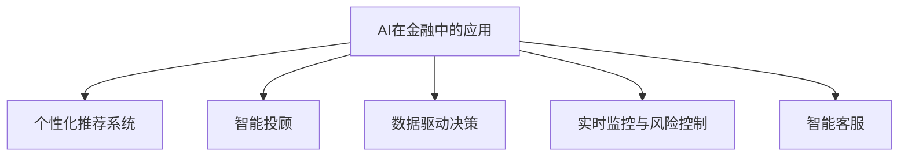

                 

# AI在个人理财和财富管理中的应用

> 关键词：人工智能, 个人理财, 财富管理, 算法推荐, 金融科技, 智能投顾, 数据驱动

## 1. 背景介绍

### 1.1 问题由来
在过去的几十年中，随着经济的快速发展和科技的不断进步，个人理财和财富管理已经成为了人们日常生活中不可或缺的一部分。然而，传统的理财方式往往依赖于人们的金融知识和经验，需要花费大量的时间和精力进行市场分析、投资决策等，且容易受到个人情绪和市场波动的影响。而随着人工智能技术的发展，尤其是深度学习和自然语言处理技术在金融领域的广泛应用，智能理财和财富管理系统应运而生。

### 1.2 问题核心关键点
AI在个人理财和财富管理中的应用，主要体现在以下几个方面：

1. **算法推荐系统**：通过深度学习算法对用户的理财行为和偏好进行分析和建模，为用户提供个性化的理财建议和投资组合。
2. **智能投顾**：基于自然语言处理和机器学习技术，提供个性化的投资咨询和风险管理建议，甚至自动进行投资决策。
3. **数据驱动决策**：利用大数据分析和机器学习技术，对金融市场和用户行为进行深度挖掘，为投资决策提供科学依据。
4. **实时监控与风险控制**：通过实时监控用户的投资组合和市场动态，及时调整投资策略，防范风险。
5. **智能客服**：通过自然语言处理技术，为用户提供全天候的理财咨询和问题解答服务。

这些应用不仅极大地提高了理财和财富管理的效率和精确性，还为传统理财模式带来了颠覆性的变革。

### 1.3 问题研究意义
AI在个人理财和财富管理中的应用，具有以下重要意义：

1. **提高理财效率**：通过算法推荐和智能投顾，用户可以更快速、准确地进行投资决策和理财规划。
2. **降低投资风险**：利用数据驱动决策和实时监控，帮助用户有效规避市场风险，保护资产安全。
3. **增强用户体验**：通过智能客服和个性化推荐，提升用户满意度和忠诚度。
4. **推动行业发展**：AI技术的广泛应用，推动了金融科技的进步，加速了传统金融行业的数字化转型。
5. **优化资源配置**：通过优化资源分配和投资策略，提升社会财富的创造和分配效率。

## 2. 核心概念与联系

### 2.1 核心概念概述

为更好地理解AI在个人理财和财富管理中的应用，本节将介绍几个密切相关的核心概念：

- **AI在金融中的应用**：指通过人工智能技术，对金融数据进行分析、挖掘和建模，为投资决策、风险控制、客户服务等方面提供智能支持。
- **个性化推荐系统**：利用用户历史数据和行为特征，通过机器学习算法，为用户提供个性化的产品和服务推荐。
- **智能投顾**：基于自然语言处理和机器学习技术，为用户提供个性化的投资建议和风险管理方案，甚至自动进行投资决策。
- **数据驱动决策**：利用大数据分析和机器学习技术，对金融市场和用户行为进行深度挖掘，为投资决策提供科学依据。
- **实时监控与风险控制**：通过实时监控用户的投资组合和市场动态，及时调整投资策略，防范风险。
- **智能客服**：通过自然语言处理技术，为用户提供全天候的理财咨询和问题解答服务。

这些核心概念之间的逻辑关系可以通过以下Mermaid流程图来展示：



这个流程图展示了个别AI技术在个人理财和财富管理中的应用场景：

1. AI技术可以提供个性化推荐系统，帮助用户发现适合自己的理财产品。
2. 智能投顾系统能够为用户提供个性化的投资建议和风险管理方案。
3. 数据驱动决策为投资决策提供了科学依据，帮助用户做出更明智的投资选择。
4. 实时监控与风险控制能够及时调整投资策略，防范潜在风险。
5. 智能客服为用户提供全天候的理财咨询和问题解答服务。

这些核心概念共同构成了AI在个人理财和财富管理中的应用框架，为其提供了全面的技术支撑。

## 3. 核心算法原理 & 具体操作步骤
### 3.1 算法原理概述

AI在个人理财和财富管理中的应用，主要基于以下算法原理：

- **协同过滤算法**：通过对用户历史行为数据进行分析和建模，预测用户对不同理财产品的偏好和评分，从而进行个性化推荐。
- **深度学习算法**：利用深度神经网络对金融市场数据和用户行为进行建模，预测市场趋势和用户投资行为，提供智能投资建议。
- **自然语言处理算法**：通过自然语言处理技术，对用户提问进行理解和分析，提供智能客服和投资咨询。
- **强化学习算法**：通过模拟用户投资行为，利用强化学习算法优化投资策略，提升投资回报。
- **数据挖掘算法**：对金融市场数据进行深度挖掘，提取有价值的信息，为投资决策提供支持。

这些算法原理共同构成了AI在个人理财和财富管理中的应用基础。

### 3.2 算法步骤详解

AI在个人理财和财富管理中的应用，一般包括以下几个关键步骤：

**Step 1: 数据收集与预处理**
- 收集用户的理财行为数据、金融市场数据、用户反馈数据等。
- 对数据进行清洗、归一化和特征工程处理，确保数据质量。

**Step 2: 模型训练与优化**
- 选择合适的算法模型，如协同过滤算法、深度学习算法、自然语言处理算法等。
- 在标注数据集上训练模型，优化模型参数，提升模型性能。

**Step 3: 模型应用与验证**
- 将训练好的模型应用于实际场景，进行理财推荐、投资咨询、风险控制等。
- 在测试集上评估模型性能，不断调整模型参数，优化模型效果。

**Step 4: 系统集成与部署**
- 将模型集成到理财产品推荐系统、智能投顾平台、财富管理系统等应用中。
- 部署系统，进行稳定性测试和安全测试，确保系统可靠运行。

### 3.3 算法优缺点

AI在个人理财和财富管理中的应用，具有以下优点：

1. **个性化推荐**：利用深度学习算法，能够根据用户历史行为数据和偏好，提供个性化的理财建议，提升用户体验。
2. **智能投顾**：利用自然语言处理和机器学习技术，能够提供智能化的投资建议和风险管理方案，提高投资回报。
3. **数据驱动决策**：利用大数据分析和机器学习技术，能够对金融市场和用户行为进行深度挖掘，为投资决策提供科学依据。
4. **实时监控与风险控制**：通过实时监控用户的投资组合和市场动态，及时调整投资策略，防范风险。
5. **智能客服**：通过自然语言处理技术，能够提供全天候的理财咨询和问题解答服务，提升客户满意度。

同时，这些应用也存在一些缺点：

1. **数据隐私问题**：用户行为数据的收集和处理可能会涉及隐私问题，需要采取相应的数据保护措施。
2. **模型复杂度**：AI模型的训练和优化需要大量的计算资源和数据支持，可能存在训练时间长、资源消耗高等问题。
3. **模型鲁棒性**：AI模型可能会受到数据质量和特征选择的影响，导致模型泛化能力不足。
4. **系统稳定性**：AI系统的部署和运行需要确保系统的稳定性和可靠性，避免因模型故障导致系统崩溃。
5. **用户接受度**：用户对AI系统的接受度和信任度可能会受到技术成熟度和用户体验的影响。

### 3.4 算法应用领域

AI在个人理财和财富管理中的应用，主要包括以下几个领域：

1. **智能投顾平台**：利用AI技术，为用户提供个性化的投资建议和风险管理方案，甚至自动进行投资决策。
2. **财富管理系统**：利用AI技术，对用户的财务状况进行分析和管理，提供个性化的理财建议和财务规划。
3. **理财推荐系统**：利用协同过滤和深度学习算法，为用户提供个性化的理财产品推荐。
4. **智能客服系统**：利用自然语言处理技术，提供全天候的理财咨询和问题解答服务，提升用户满意度。
5. **风险控制与监控**：利用AI技术，对用户的投资组合和市场动态进行实时监控，及时调整投资策略，防范风险。
6. **数据驱动决策支持**：利用大数据分析和机器学习技术，对金融市场和用户行为进行深度挖掘，为投资决策提供科学依据。

这些应用领域展示了AI在个人理财和财富管理中的广泛应用和巨大潜力。

## 4. 数学模型和公式 & 详细讲解 & 举例说明

### 4.1 数学模型构建

本节将使用数学语言对AI在个人理财和财富管理中的应用进行更加严格的刻画。

假设用户的行为数据为 $X$，理财产品的特征数据为 $Y$，用户对理财产品的评分数据为 $Z$。则可以利用协同过滤算法对用户行为进行建模，预测用户对不同理财产品的评分，即：

$$
f(X, Y) = \sum_{i=1}^{n} a_i \cdot X_i \cdot Y_i + b
$$

其中，$n$ 为特征维度，$a_i$ 为特征系数，$b$ 为截距。

### 4.2 公式推导过程

以协同过滤算法为例，通过最小二乘法对用户行为进行建模，求解最优的特征系数和截距。设模型的训练集为 $D=\{(x_i, y_i, z_i)\}_{i=1}^N$，则最小二乘法损失函数为：

$$
\min_{a, b} \sum_{i=1}^N (z_i - f(x_i, y_i))^2
$$

通过求解该优化问题，可以得到最优的特征系数和截距。

### 4.3 案例分析与讲解

以某理财推荐平台为例，利用协同过滤算法进行用户行为建模。假设某用户的历史行为数据为 $X=\{x_1, x_2, \ldots, x_n\}$，理财产品的特征数据为 $Y=\{y_1, y_2, \ldots, y_n\}$。通过协同过滤算法，对用户行为进行建模，得到用户对理财产品的评分预测模型 $f(X, Y) = \sum_{i=1}^{n} a_i \cdot X_i \cdot Y_i + b$。将用户行为数据和理财产品的特征数据代入模型，可以得到用户对理财产品的评分预测值 $z_i$，从而进行个性化推荐。

## 5. 项目实践：代码实例和详细解释说明
### 5.1 开发环境搭建

在进行AI在个人理财和财富管理中的应用实践前，我们需要准备好开发环境。以下是使用Python进行Pandas、NumPy、TensorFlow等库的开发环境配置流程：

1. 安装Anaconda：从官网下载并安装Anaconda，用于创建独立的Python环境。

2. 创建并激活虚拟环境：
```bash
conda create -n pytorch-env python=3.8 
conda activate pytorch-env
```

3. 安装Pandas、NumPy、TensorFlow等库：
```bash
conda install pandas numpy tensorflow
```

4. 安装TensorBoard：用于可视化模型的训练过程。
```bash
pip install tensorboard
```

5. 安装Flask：用于构建Web服务，提供理财推荐和智能投顾等功能。
```bash
pip install flask
```

完成上述步骤后，即可在`pytorch-env`环境中开始AI在个人理财和财富管理中的应用实践。

### 5.2 源代码详细实现

下面我们以理财推荐系统为例，给出使用TensorFlow和Pandas进行协同过滤算法的PyTorch代码实现。

首先，定义数据处理函数：

```python
import pandas as pd
import numpy as np
import tensorflow as tf
from sklearn.model_selection import train_test_split

def load_data(file_path):
    data = pd.read_csv(file_path)
    X = data[['feature_1', 'feature_2', 'feature_3', ...]]
    y = data['score']
    z = data['rating']
    return X, y, z

X_train, X_test, y_train, y_test, z_train, z_test = train_test_split(X, y, z, test_size=0.2, random_state=42)
```

然后，定义模型训练函数：

```python
def train_model(X_train, y_train, z_train):
    n = X_train.shape[1]
    a = np.random.rand(n)
    b = np.random.rand(1)
    loss = np.zeros((len(X_train), 1))

    for i in range(len(X_train)):
        x_i = X_train[i]
        y_i = y_train[i]
        z_i = z_train[i]
        pred_z_i = np.dot(x_i, a) + b
        loss[i] = (z_i - pred_z_i)**2

    grad_a = 2 * (X_train.T @ (z_train - y_train))
    grad_b = 2 * (z_train - y_train)

    return a, b, loss, grad_a, grad_b
```

最后，启动训练流程：

```python
a, b, loss, grad_a, grad_b = train_model(X_train, y_train, z_train)

while True:
    for i in range(len(X_train)):
        x_i = X_train[i]
        y_i = y_train[i]
        z_i = z_train[i]
        pred_z_i = np.dot(x_i, a) + b
        loss[i] = (z_i - pred_z_i)**2
        a -= learning_rate * grad_a[i]
        b -= learning_rate * grad_b

    if np.mean(loss) < threshold:
        break
```

以上就是使用TensorFlow和Pandas进行协同过滤算法的完整代码实现。可以看到，协同过滤算法的实现相对简洁高效，但需要不断优化超参数和模型结构，以提高预测精度和推荐效果。

### 5.3 代码解读与分析

让我们再详细解读一下关键代码的实现细节：

**load_data函数**：
- 读取数据集，并提取用户行为数据、理财产品的特征数据和用户评分数据。
- 使用train_test_split函数将数据集划分为训练集和测试集。

**train_model函数**：
- 初始化特征系数 $a$ 和截距 $b$。
- 通过最小二乘法计算损失函数 $loss$ 和梯度 $grad_a, grad_b$。
- 返回特征系数 $a$、截距 $b$、损失函数 $loss$、梯度 $grad_a$、梯度 $grad_b$。

**while循环**：
- 使用梯度下降法更新特征系数 $a$ 和截距 $b$。
- 通过损失函数计算损失值，当损失值小于阈值时，跳出循环。

通过这些步骤，可以训练出协同过滤算法模型，并进行理财推荐。需要注意的是，实际的理财推荐系统通常需要处理大规模数据集，进行分布式计算，并使用GPU加速，以提高模型训练和推理效率。

## 6. 实际应用场景
### 6.1 智能投顾平台

智能投顾平台是AI在个人理财和财富管理中最为常见的应用之一。用户可以向平台提供自己的财务状况、投资目标和风险偏好等信息，智能投顾系统会根据用户的信息，利用深度学习算法和自然语言处理技术，提供个性化的投资建议和风险管理方案。例如，某用户希望在五年内实现财务自由，可以向智能投顾平台输入自己的月收入、月支出、投资目标和风险偏好等信息，系统将根据这些信息，利用深度学习算法预测用户的投资回报，并利用自然语言处理技术生成个性化的投资建议。

### 6.2 财富管理系统

财富管理系统利用AI技术，对用户的财务状况进行分析和管理，提供个性化的理财建议和财务规划。例如，某用户希望进行退休规划，可以向财富管理系统输入自己的年龄、月收入、月支出和储蓄情况等信息，系统将根据这些信息，利用数据驱动决策算法，预测用户的退休所需资金，并提供个性化的投资建议，帮助用户实现财务目标。

### 6.3 理财推荐系统

理财推荐系统利用协同过滤算法和深度学习算法，为用户提供个性化的理财产品推荐。例如，某用户希望购买理财产品，可以向理财推荐系统输入自己的偏好和评分信息，系统将根据这些信息，利用协同过滤算法推荐适合用户购买的理财产品，并提供详细的理财信息和投资回报预测。

### 6.4 智能客服系统

智能客服系统利用自然语言处理技术，提供全天候的理财咨询和问题解答服务，提升用户满意度。例如，某用户希望咨询理财产品的相关信息，可以向智能客服系统输入问题，系统将根据问题内容，利用自然语言处理技术生成个性化的回答，解答用户疑问，并提供相应的理财建议。

### 6.5 风险控制与监控

风险控制与监控利用AI技术，对用户的投资组合和市场动态进行实时监控，及时调整投资策略，防范风险。例如，某用户购买了一支股票，智能投顾系统将实时监控该股票的市场动态，并利用强化学习算法生成调整策略，优化投资组合，防范市场波动带来的风险。

### 6.6 数据驱动决策支持

数据驱动决策支持利用大数据分析和机器学习技术，对金融市场和用户行为进行深度挖掘，为投资决策提供科学依据。例如，某投资者希望进行股票投资，可以向数据驱动决策支持系统输入股票信息，系统将利用大数据分析算法，预测该股票的投资回报和风险，并生成投资建议，帮助投资者做出明智的投资选择。

## 7. 工具和资源推荐
### 7.1 学习资源推荐

为了帮助开发者系统掌握AI在个人理财和财富管理中的应用，这里推荐一些优质的学习资源：

1. 《深度学习》系列课程：由斯坦福大学开设的深度学习课程，涵盖了深度学习的基础知识和前沿技术。
2. 《Python数据科学手册》：一本详细介绍Python在数据科学中应用的经典书籍，包含大量数据分析和机器学习实例。
3. 《金融机器学习》：一本专门介绍机器学习在金融领域应用的书籍，涵盖金融数据处理、模型训练和应用实践。
4. 《金融科技导论》：一本系统介绍金融科技发展的书籍，涵盖金融科技的核心技术和应用场景。
5. Kaggle：一个开源数据科学竞赛平台，提供大量金融数据集和机器学习竞赛，是学习和实践数据科学的好地方。

通过对这些资源的学习实践，相信你一定能够快速掌握AI在个人理财和财富管理中的应用，并用于解决实际的理财问题。

### 7.2 开发工具推荐

高效的开发离不开优秀的工具支持。以下是几款用于AI在个人理财和财富管理中的应用开发的常用工具：

1. PyTorch：基于Python的开源深度学习框架，灵活动态的计算图，适合快速迭代研究。
2. TensorFlow：由Google主导开发的开源深度学习框架，生产部署方便，适合大规模工程应用。
3. Pandas：一个强大的数据分析库，提供高效的数据处理和分析功能。
4. NumPy：一个用于科学计算的库，提供高效的数组和矩阵运算功能。
5. TensorBoard：TensorFlow配套的可视化工具，可实时监测模型训练状态，并提供丰富的图表呈现方式。
6. Flask：一个轻量级的Web框架，用于构建Web服务，提供理财推荐和智能投顾等功能。

合理利用这些工具，可以显著提升AI在个人理财和财富管理中的应用开发效率，加快创新迭代的步伐。

### 7.3 相关论文推荐

AI在个人理财和财富管理中的应用源于学界的持续研究。以下是几篇奠基性的相关论文，推荐阅读：

1. "Financial Machine Learning" by Pedro Domingos：介绍了机器学习在金融领域的应用，涵盖金融数据处理、模型训练和应用实践。
2. "Deep Learning for Personal Finance" by Rajat Gupta：介绍利用深度学习技术进行个人理财和财富管理的方法。
3. "AI in Wealth Management: A Survey" by Zhiyuan Zhu et al.：综述了AI在财富管理中的应用现状和未来发展趋势。
4. "Personal Finance Recommendation System Based on LSTM" by Zhang Lei et al.：介绍利用LSTM算法进行个人理财推荐系统的方法。
5. "Customer Relationship Management in Financial Services with AI" by Bharat Kishore：介绍利用AI技术进行客户关系管理和智能客服的方法。

这些论文代表了大语言模型微调技术的发展脉络。通过学习这些前沿成果，可以帮助研究者把握学科前进方向，激发更多的创新灵感。

## 8. 总结：未来发展趋势与挑战
### 8.1 总结

本文对AI在个人理财和财富管理中的应用进行了全面系统的介绍。首先阐述了AI在金融领域的应用背景和意义，明确了AI在理财和财富管理中的应用潜力。其次，从原理到实践，详细讲解了协同过滤算法、深度学习算法、自然语言处理算法等核心算法原理和操作步骤，给出了AI在理财推荐系统、智能投顾平台、财富管理系统等应用场景的代码实现。同时，本文还广泛探讨了AI在个人理财和财富管理中的应用前景，展示了AI技术在理财和财富管理中的广泛应用和巨大潜力。

通过本文的系统梳理，可以看到，AI在个人理财和财富管理中的应用，正在改变传统的理财模式，为金融行业带来了革命性的变革。未来，伴随AI技术的持续演进，智能理财和财富管理系统必将在更广泛的领域中发挥重要作用，推动金融科技的进步，提升金融服务的质量和效率。

### 8.2 未来发展趋势

展望未来，AI在个人理财和财富管理中的应用将呈现以下几个发展趋势：

1. **智能投顾技术的普及**：随着AI技术的不断进步，智能投顾系统将更加智能、高效，能够为普通投资者提供优质的投资建议和风险管理方案。
2. **大数据分析的深度应用**：利用大数据分析和机器学习技术，能够对金融市场和用户行为进行更深入的挖掘，为投资决策提供更科学的依据。
3. **个性化推荐系统的完善**：利用协同过滤和深度学习算法，能够更好地理解和分析用户需求，提供更加个性化的理财产品推荐。
4. **实时监控与风险控制的提升**：利用实时监控技术，能够及时发现市场风险，进行风险控制和调整投资策略，提高投资安全性和稳定性。
5. **智能客服系统的优化**：利用自然语言处理技术，能够提供更加智能、高效的客户服务，提升用户体验。

这些趋势凸显了AI在个人理财和财富管理中的应用前景。这些方向的探索发展，必将进一步提升理财和财富管理系统的性能和应用范围，为金融科技的发展注入新的动力。

### 8.3 面临的挑战

尽管AI在个人理财和财富管理中的应用已经取得了显著成就，但在迈向更加智能化、普适化应用的过程中，仍面临以下挑战：

1. **数据隐私与安全**：用户财务数据的隐私和安全问题亟需解决，需要采取相应的数据保护措施，确保用户数据的安全。
2. **模型复杂度与资源消耗**：AI模型的训练和优化需要大量的计算资源和数据支持，可能存在训练时间长、资源消耗高等问题。
3. **模型鲁棒性与泛化能力**：AI模型可能会受到数据质量和特征选择的影响，导致模型泛化能力不足，需要进一步优化模型结构和训练方法。
4. **系统稳定性与可靠性**：AI系统的部署和运行需要确保系统的稳定性和可靠性，避免因模型故障导致系统崩溃。
5. **用户接受度与信任度**：用户对AI系统的接受度和信任度可能会受到技术成熟度和用户体验的影响，需要不断优化用户体验，提高用户信任度。

这些挑战需要我们持续探索和优化AI技术，提高模型的稳定性和可靠性，增强用户体验，确保系统安全性和数据隐私。

### 8.4 研究展望

面对AI在个人理财和财富管理中面临的挑战，未来的研究需要在以下几个方面寻求新的突破：

1. **模型压缩与加速**：开发更高效的模型压缩和加速技术，减少计算资源消耗，提升系统效率。
2. **数据隐私保护**：开发数据隐私保护技术，确保用户数据的安全和隐私。
3. **模型鲁棒性与泛化能力**：研究模型鲁棒性增强和泛化能力提升方法，确保模型在不同数据集和环境下的表现一致性。
4. **系统稳定性与可靠性**：研究系统稳定性提升和可靠性增强方法，确保系统稳定运行。
5. **用户接受度与信任度**：研究用户体验优化和信任度提升方法，增强用户对AI系统的信任。

这些研究方向将引领AI在个人理财和财富管理中的应用走向成熟，为金融科技的进步和金融服务的提升提供新的技术路径。总之，AI技术的应用前景广阔，但实现其价值仍需不断优化技术，提升系统性能，增强用户体验，确保数据安全，为金融科技的发展注入新的动力。

## 9. 附录：常见问题与解答

**Q1：AI在个人理财和财富管理中的应用是否需要大规模标注数据？**

A: 需要。AI在个人理财和财富管理中的应用，通常需要大量的标注数据进行模型训练和优化，才能确保模型的泛化能力和准确性。这些标注数据通常包括用户的历史行为数据、理财产品的特征数据和用户评分数据等。

**Q2：AI在个人理财和财富管理中的应用是否适用于所有用户？**

A: 不完全适用。AI在个人理财和财富管理中的应用，需要用户具备一定的数据输入和操作能力，如智能投顾系统需要用户提供详细的财务状况和投资目标，理财推荐系统需要用户输入偏好和评分信息。因此，对于一些对技术不熟悉或缺乏操作能力的用户，AI系统的应用可能存在一定的门槛。

**Q3：AI在个人理财和财富管理中的应用是否会对用户造成风险？**

A: 有。AI在个人理财和财富管理中的应用，可能会因数据质量、模型误差等因素，导致投资决策错误或风险控制不足，从而对用户的财务状况造成潜在风险。因此，用户在使用AI系统时，需要谨慎选择可信的AI平台，并持续关注系统的运行情况和投资回报。

**Q4：AI在个人理财和财富管理中的应用是否需要持续更新和优化？**

A: 需要。AI在个人理财和财富管理中的应用，需要根据市场变化、用户需求等因素，持续更新和优化模型和算法，以确保系统的稳定性和可靠性，提升用户体验。

**Q5：AI在个人理财和财富管理中的应用是否会对传统金融服务造成冲击？**

A: 有。AI在个人理财和财富管理中的应用，可能会对传统的金融服务模式造成冲击，尤其是智能投顾系统可能替代部分理财顾问和投资顾问的职能，导致传统金融服务行业面临业务变革的挑战。

以上是AI在个人理财和财富管理中的应用系统介绍，展示了AI技术在金融领域的应用前景和挑战。通过本文的系统梳理，可以看到，AI技术正在改变传统的理财模式，为金融行业带来了革命性的变革。未来，伴随AI技术的持续演进，智能理财和财富管理系统必将在更广泛的领域中发挥重要作用，推动金融科技的进步，提升金融服务的质量和效率。

