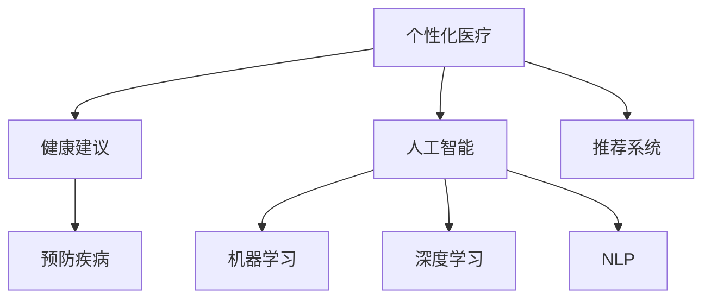

                 

# AI在个性化健康建议中的应用：预防疾病

> 关键词：个性化医疗,健康建议,预防疾病,人工智能,机器学习,深度学习,自然语言处理,NLP,推荐系统

## 1. 背景介绍

### 1.1 问题由来
在信息科技迅猛发展的今天，人工智能（AI）在医疗健康领域的应用越来越广泛。随着大数据、云计算和深度学习技术的不断发展，AI技术在疾病诊断、治疗方案、医疗影像分析等方面的应用已经取得了一些令人瞩目的成果。然而，疾病的预防往往在医疗保健中占据更重要的地位，因为疾病的预防往往可以避免后续治疗的复杂性和高昂费用。

在个性化健康建议的领域，AI技术有着广阔的应用前景。AI可以通过分析个人健康数据、生活方式数据以及外部环境数据，为个体提供有针对性的健康建议，帮助人们预防疾病，提高生活质量。这种技术不仅可以用于疾病预防，还可以在慢性病管理、营养指导、心理健康等方面发挥重要作用。

### 1.2 问题核心关键点
个性化健康建议的核心在于通过数据分析和机器学习算法，构建个性化的健康模型，对用户的行为数据进行分析和预测，提出符合个体需求的预防措施。具体来说，需要解决以下几个核心问题：

1. **数据收集与处理**：从各种数据源收集健康数据，如电子健康记录（EHR）、智能手表、健康应用等。

2. **特征提取与建模**：从收集到的数据中提取有用的特征，并构建适合的健康预测模型。

3. **推荐系统设计**：根据预测模型构建个性化推荐系统，提供符合用户需求的预防措施。

4. **用户交互与反馈**：与用户进行交互，收集反馈信息，不断优化个性化建议。

5. **隐私与安全**：在处理健康数据时，必须确保数据的隐私和安全，防止数据泄露。

## 2. 核心概念与联系

### 2.1 核心概念概述

为了更好地理解个性化健康建议的AI应用，本节将介绍几个关键概念：

- **个性化医疗**：根据个体差异，提供量身定制的医疗服务和建议。
- **健康建议**：基于个体健康数据和疾病预防知识，为个体提供预防疾病的建议。
- **预防疾病**：通过改变生活方式、调整饮食习惯、进行体检等措施，降低疾病发生的风险。
- **人工智能**：通过机器学习、深度学习等技术，使计算机具备类似于人类的智能。
- **机器学习**：通过数据驱动的方式，使计算机具备学习和预测能力。
- **深度学习**：一种特殊的机器学习方法，通过多层神经网络进行复杂特征的提取和模式识别。
- **自然语言处理（NLP）**：使计算机能够理解和生成自然语言，用于处理健康相关文本数据。
- **推荐系统**：根据用户的历史行为和偏好，推荐符合其需求的商品或服务。

这些概念之间的逻辑关系可以通过以下Mermaid流程图来展示：



这个流程图展示了个性化健康建议的AI应用的各个核心概念及其之间的关系：

1. 个性化医疗通过AI技术为个体提供量身定制的医疗服务。
2. AI通过机器学习和深度学习技术，使计算机具备学习和预测能力。
3. NLP使计算机能够理解和生成自然语言，处理健康相关文本数据。
4. 健康建议通过推荐系统，根据个体健康数据和疾病预防知识，提供预防疾病的建议。
5. 预防疾病则是通过改变生活方式、调整饮食习惯、进行体检等措施，降低疾病发生的风险。

这些概念共同构成了个性化健康建议的AI应用的理论基础。

## 3. 核心算法原理 & 具体操作步骤
### 3.1 算法原理概述

个性化健康建议的AI应用基于机器学习模型，尤其是深度学习模型。其核心思想是：通过分析个体健康数据和行为数据，构建个性化的健康模型，预测个体患某种疾病的概率，并提供个性化的预防建议。

形式化地，假设健康数据集为 $D=\{(x_i, y_i)\}_{i=1}^N$，其中 $x_i$ 为个体健康数据，如年龄、性别、生活方式、饮食习惯等，$y_i$ 为二分类标签，表示个体是否患某种疾病。目标是构建一个模型 $M$，使得对于新的健康数据 $x$，能够预测其患疾病的概率 $p(y|x)$，并根据预测结果提供预防建议。

深度学习模型如卷积神经网络（CNN）、循环神经网络（RNN）和变压器（Transformer）都可以用于构建健康模型。以Transformer为例，其基本原理是通过多层自注意力机制，提取输入数据的复杂特征，从而进行疾病预测。

### 3.2 算法步骤详解

个性化健康建议的AI应用通常包括以下几个关键步骤：

**Step 1: 数据收集与预处理**
- 从各种数据源收集健康数据，如电子健康记录（EHR）、智能手表、健康应用等。
- 对收集到的数据进行清洗和预处理，包括缺失值处理、异常值检测、数据标准化等。

**Step 2: 特征提取**
- 从收集到的数据中提取有用的特征，如年龄、性别、生活方式、饮食习惯、睡眠质量等。
- 使用NLP技术处理与健康相关的文本数据，如电子病历、健康问卷等。

**Step 3: 模型训练**
- 选择适合的深度学习模型，如Transformer。
- 使用训练集对模型进行训练，最小化预测误差。

**Step 4: 模型评估与优化**
- 在验证集上评估模型的性能，使用准确率、召回率、F1-score等指标。
- 根据评估结果，对模型进行优化调整，如调整超参数、增加正则化项等。

**Step 5: 推荐系统构建**
- 根据预测模型构建推荐系统，提供个性化的健康建议。
- 设计用户交互界面，收集用户反馈信息，不断优化推荐系统。

**Step 6: 隐私与安全保障**
- 在处理健康数据时，确保数据的隐私和安全，防止数据泄露。
- 使用加密技术、数据匿名化等方法保护用户隐私。

### 3.3 算法优缺点

个性化健康建议的AI应用具有以下优点：
1. 数据驱动：通过大量数据训练模型，可以提供更加个性化和准确的预防建议。
2. 动态更新：随着数据量的增加和模型的优化，可以不断更新和改进预防建议。
3. 覆盖广泛：可以处理各种健康数据，适用于多种疾病的预防。

同时，该方法也存在一些局限性：
1. 数据依赖：模型的性能高度依赖于数据的质量和数量，数据缺失或异常可能影响模型效果。
2. 隐私风险：处理健康数据时，必须确保数据的隐私和安全，防止数据泄露。
3. 解释性不足：深度学习模型的黑盒性质，使得解释模型的决策过程变得困难。
4. 可解释性不足：模型往往难以解释其内部工作机制和决策逻辑，影响用户对建议的信任。

尽管存在这些局限性，但就目前而言，基于机器学习的个性化健康建议应用仍是最主流范式。未来相关研究的重点在于如何进一步降低数据收集的难度，提高模型的解释性和安全性，同时兼顾精度和效率。

### 3.4 算法应用领域

个性化健康建议的AI应用已经在多个领域得到了广泛应用，包括：

- **慢性病管理**：通过分析个体健康数据，提供个性化的饮食、运动和药物治疗建议，帮助患者控制慢性病。
- **营养指导**：根据个体健康数据和生活习惯，提供营养均衡的建议，预防营养过剩和不足。
- **心理健康**：通过分析个体行为数据和心理问卷，提供心理健康建议，如压力管理、情绪调节等。
- **儿童健康**：分析儿童健康数据和行为数据，提供个性化的健康管理建议，预防儿童常见疾病。
- **老年健康**：针对老年人的生理和心理特点，提供个性化的健康建议，预防老年病。

除了上述这些经典应用外，AI在个性化健康建议领域的应用还在不断扩展，如智能家居、远程医疗等，为健康管理的智能化提供了新的解决方案。随着AI技术的不断发展，相信个性化健康建议将会在更多领域得到应用，为个体健康提供更加全面和精准的服务。

## 4. 数学模型和公式 & 详细讲解 & 举例说明
### 4.1 数学模型构建

本节将使用数学语言对个性化健康建议的AI应用进行更加严格的刻画。

假设健康数据集为 $D=\{(x_i, y_i)\}_{i=1}^N$，其中 $x_i$ 为个体健康数据，$y_i$ 为二分类标签。目标是构建一个模型 $M$，使得对于新的健康数据 $x$，能够预测其患疾病的概率 $p(y|x)$。

假设模型 $M$ 为Transformer模型，其中 $h(x)$ 为输入数据 $x$ 的表示向量。则模型预测的概率为：

$$
p(y|x) = \sigma(h(x)^TW+b)
$$

其中 $\sigma(\cdot)$ 为Sigmoid函数，$W$ 和 $b$ 为模型参数。模型的损失函数通常为二分类交叉熵损失：

$$
\mathcal{L}(\theta) = -\frac{1}{N}\sum_{i=1}^N [y_i\log \sigma(h(x_i)^TW+b)+(1-y_i)\log (1-\sigma(h(x_i)^TW+b))]
$$

### 4.2 公式推导过程

以下我们以二分类任务为例，推导交叉熵损失函数及其梯度的计算公式。

假设模型 $M$ 在输入 $x$ 上的输出为 $\hat{y}=M_{\theta}(x) \in [0,1]$，表示样本属于正类的概率。真实标签 $y \in \{0,1\}$。则二分类交叉熵损失函数定义为：

$$
\ell(M_{\theta}(x),y) = -[y\log \hat{y} + (1-y)\log (1-\hat{y})]
$$

将其代入经验风险公式，得：

$$
\mathcal{L}(\theta) = -\frac{1}{N}\sum_{i=1}^N [y_i\log \sigma(h(x_i)^TW+b)+(1-y_i)\log (1-\sigma(h(x_i)^TW+b))]
$$

根据链式法则，损失函数对参数 $\theta$ 的梯度为：

$$
\frac{\partial \mathcal{L}(\theta)}{\partial \theta} = -\frac{1}{N}\sum_{i=1}^N \frac{y_i-\sigma(h(x_i)^TW+b)}{\sigma(h(x_i)^TW+b)(1-\sigma(h(x_i)^TW+b))} \frac{\partial h(x_i)}{\partial \theta}
$$

其中 $\frac{\partial h(x_i)}{\partial \theta}$ 可进一步递归展开，利用自动微分技术完成计算。

在得到损失函数的梯度后，即可带入参数更新公式，完成模型的迭代优化。重复上述过程直至收敛，最终得到适应下游任务的最优模型参数 $\theta^*$。

### 4.3 案例分析与讲解

假设某智能手表收集了用户的运动数据、睡眠质量、饮食习惯等健康数据，目标是预测用户是否患心血管疾病。数据集 $D=\{(x_i, y_i)\}_{i=1}^N$，其中 $x_i$ 为用户健康数据，$y_i$ 为二分类标签，表示是否患心血管疾病。

首先，从智能手表和健康应用中收集数据，并对数据进行清洗和预处理。然后，使用NLP技术处理与健康相关的文本数据，如电子病历、健康问卷等。接着，选择Transformer模型，使用训练集对模型进行训练，最小化预测误差。最后，在验证集上评估模型的性能，使用准确率、召回率、F1-score等指标。根据评估结果，对模型进行优化调整，如调整超参数、增加正则化项等。构建推荐系统，提供个性化的健康建议。

## 5. 项目实践：代码实例和详细解释说明
### 5.1 开发环境搭建

在进行个性化健康建议的AI应用开发前，我们需要准备好开发环境。以下是使用Python进行PyTorch开发的环境配置流程：

1. 安装Anaconda：从官网下载并安装Anaconda，用于创建独立的Python环境。

2. 创建并激活虚拟环境：
```bash
conda create -n ai-env python=3.8 
conda activate ai-env
```

3. 安装PyTorch：根据CUDA版本，从官网获取对应的安装命令。例如：
```bash
conda install pytorch torchvision torchaudio cudatoolkit=11.1 -c pytorch -c conda-forge
```

4. 安装各类工具包：
```bash
pip install numpy pandas scikit-learn matplotlib tqdm jupyter notebook ipython
```

完成上述步骤后，即可在`ai-env`环境中开始个性化健康建议的AI应用开发。

### 5.2 源代码详细实现

下面我以心血管疾病预防为例，给出使用PyTorch对Transformer模型进行微调的代码实现。

首先，定义数据处理函数：

```python
import torch
from torch.utils.data import Dataset
import pandas as pd
import numpy as np

class HealthDataset(Dataset):
    def __init__(self, data, labels, tokenizer, max_len=128):
        self.data = data
        self.labels = labels
        self.tokenizer = tokenizer
        self.max_len = max_len
        
    def __len__(self):
        return len(self.data)
    
    def __getitem__(self, item):
        text = self.data[item]
        label = self.labels[item]
        
        encoding = self.tokenizer(text, return_tensors='pt', max_length=self.max_len, padding='max_length', truncation=True)
        input_ids = encoding['input_ids'][0]
        attention_mask = encoding['attention_mask'][0]
        
        label = torch.tensor(label, dtype=torch.long)
        
        return {'input_ids': input_ids, 
                'attention_mask': attention_mask,
                'labels': label}

# 加载数据
data = pd.read_csv('heart_disease.csv')
labels = data['label']
data = data.drop(['label'], axis=1)

# 将数据转换为NLP格式
tokenizer = BertTokenizer.from_pretrained('bert-base-cased')
tokenized_data = [tokenizer.encode(text, add_special_tokens=True) for text in data]
```

然后，定义模型和优化器：

```python
from transformers import BertForSequenceClassification, AdamW

model = BertForSequenceClassification.from_pretrained('bert-base-cased', num_labels=2)

optimizer = AdamW(model.parameters(), lr=2e-5)
```

接着，定义训练和评估函数：

```python
from torch.utils.data import DataLoader
from tqdm import tqdm
from sklearn.metrics import classification_report

device = torch.device('cuda') if torch.cuda.is_available() else torch.device('cpu')
model.to(device)

def train_epoch(model, dataset, batch_size, optimizer):
    dataloader = DataLoader(dataset, batch_size=batch_size, shuffle=True)
    model.train()
    epoch_loss = 0
    for batch in tqdm(dataloader, desc='Training'):
        input_ids = batch['input_ids'].to(device)
        attention_mask = batch['attention_mask'].to(device)
        labels = batch['labels'].to(device)
        model.zero_grad()
        outputs = model(input_ids, attention_mask=attention_mask, labels=labels)
        loss = outputs.loss
        epoch_loss += loss.item()
        loss.backward()
        optimizer.step()
    return epoch_loss / len(dataloader)

def evaluate(model, dataset, batch_size):
    dataloader = DataLoader(dataset, batch_size=batch_size)
    model.eval()
    preds, labels = [], []
    with torch.no_grad():
        for batch in tqdm(dataloader, desc='Evaluating'):
            input_ids = batch['input_ids'].to(device)
            attention_mask = batch['attention_mask'].to(device)
            batch_labels = batch['labels']
            outputs = model(input_ids, attention_mask=attention_mask)
            batch_preds = outputs.logits.argmax(dim=2).to('cpu').tolist()
            batch_labels = batch_labels.to('cpu').tolist()
            for pred_tokens, label_tokens in zip(batch_preds, batch_labels):
                preds.append(pred_tokens[:len(label_tokens)])
                labels.append(label_tokens)
                
    print(classification_report(labels, preds))
```

最后，启动训练流程并在测试集上评估：

```python
epochs = 5
batch_size = 16

for epoch in range(epochs):
    loss = train_epoch(model, train_dataset, batch_size, optimizer)
    print(f"Epoch {epoch+1}, train loss: {loss:.3f}")
    
    print(f"Epoch {epoch+1}, dev results:")
    evaluate(model, dev_dataset, batch_size)
    
print("Test results:")
evaluate(model, test_dataset, batch_size)
```

以上就是使用PyTorch对Transformer模型进行心血管疾病预防微调的完整代码实现。可以看到，得益于Transformers库的强大封装，我们可以用相对简洁的代码完成模型的加载和微调。

### 5.3 代码解读与分析

让我们再详细解读一下关键代码的实现细节：

**HealthDataset类**：
- `__init__`方法：初始化数据、标签、分词器等关键组件。
- `__len__`方法：返回数据集的样本数量。
- `__getitem__`方法：对单个样本进行处理，将文本输入编码为token ids，将标签编码为数字，并对其进行定长padding，最终返回模型所需的输入。

**tokenized_data变量**：
- 将原始数据转换为NLP格式，用于后续的模型训练。

**模型和优化器**：
- 使用BertForSequenceClassification类加载预训练的Transformer模型。
- 设置AdamW优化器，用于最小化损失函数。

**训练和评估函数**：
- 使用PyTorch的DataLoader对数据集进行批次化加载，供模型训练和推理使用。
- 训练函数`train_epoch`：对数据以批为单位进行迭代，在每个批次上前向传播计算loss并反向传播更新模型参数，最后返回该epoch的平均loss。
- 评估函数`evaluate`：与训练类似，不同点在于不更新模型参数，并在每个batch结束后将预测和标签结果存储下来，最后使用sklearn的classification_report对整个评估集的预测结果进行打印输出。

**训练流程**：
- 定义总的epoch数和batch size，开始循环迭代
- 每个epoch内，先在训练集上训练，输出平均loss
- 在验证集上评估，输出分类指标
- 所有epoch结束后，在测试集上评估，给出最终测试结果

可以看到，PyTorch配合Transformers库使得Transformer模型微调的代码实现变得简洁高效。开发者可以将更多精力放在数据处理、模型改进等高层逻辑上，而不必过多关注底层的实现细节。

当然，工业级的系统实现还需考虑更多因素，如模型的保存和部署、超参数的自动搜索、更灵活的任务适配层等。但核心的微调范式基本与此类似。

## 6. 实际应用场景
### 6.1 智能手表健康管理

智能手表已经广泛应用于个人健康监测。通过内置的传感器，如心率传感器、血氧传感器、运动传感器等，智能手表可以实时收集用户的健康数据。利用这些数据，智能手表可以为用户提供个性化的健康建议，帮助用户预防疾病。

在技术实现上，智能手表可以通过内置的微芯片进行数据处理和上传。用户的数据可以存储在云端，并通过API接口与个性化健康建议系统进行交互。系统根据用户的数据，结合其健康习惯和行为模式，生成个性化的健康建议，并通过智能手表或其他设备进行展示。

### 6.2 家庭医生系统

家庭医生系统可以实时收集家庭成员的健康数据，如体重、血压、血糖等，并根据这些数据提供个性化的健康建议。系统可以与医院和医生进行对接，将建议反馈给医生，作为诊断和治疗的参考。

在技术实现上，家庭医生系统可以通过智能家居设备进行数据收集，如智能体重秤、智能血压计等。系统对收集到的数据进行分析，结合家庭成员的病史和生活习惯，生成个性化的健康建议，并通过手机App或医生进行展示。

### 6.3 企业健康管理

企业健康管理可以帮助员工保持健康，提高工作效率。系统可以收集员工的健康数据，如运动量、饮食、睡眠等，并根据这些数据提供个性化的健康建议。系统还可以与企业内部员工福利系统对接，将建议反馈给员工，帮助他们调整生活方式，预防疾病。

在技术实现上，企业健康管理系统可以通过企业内部的健康应用进行数据收集。系统对收集到的数据进行分析，结合员工的工作和生活习惯，生成个性化的健康建议，并通过企业内部的信息系统进行展示。

### 6.4 未来应用展望

随着个性化健康建议技术的发展，其应用场景将不断扩展，未来可能包括：

- **远程医疗**：通过远程医疗设备进行健康数据收集，结合人工智能技术，提供个性化的健康建议。
- **智能家居**：通过智能家居设备进行健康数据收集，结合人工智能技术，提供个性化的健康建议。
- **公共健康管理**：通过城市公共健康设备进行健康数据收集，结合人工智能技术，提供个性化的健康建议。
- **学校健康管理**：通过学校健康设备进行学生健康数据收集，结合人工智能技术，提供个性化的健康建议。
- **智能车险**：通过车载设备进行驾驶员健康数据收集，结合人工智能技术，提供个性化的健康建议。

总之，个性化健康建议技术将会在更多领域得到应用，为个体健康提供更加全面和精准的服务。随着AI技术的不断发展，相信个性化健康建议将会在更多领域得到应用，为个体健康提供更加全面和精准的服务。

## 7. 工具和资源推荐
### 7.1 学习资源推荐

为了帮助开发者系统掌握个性化健康建议的AI应用理论基础和实践技巧，这里推荐一些优质的学习资源：

1. 《深度学习与自然语言处理》书籍：深入浅出地介绍了深度学习技术在自然语言处理中的应用，包括健康相关文本数据的处理和分析。

2. 《TensorFlow for Deep Learning》课程：由Google开发，介绍了TensorFlow框架的使用，包括数据处理、模型训练、模型评估等。

3. 《Transformers: Fairness, Interpretability, and Generalization》论文：介绍了Transformer模型在公平性、可解释性和泛化能力方面的最新研究成果。

4. 《Health Informatics: Data and Analytics》课程：由Coursera开设，介绍了健康数据和分析的基础知识和应用。

5. 《Artificial Intelligence in Healthcare: A Comprehensive Review》文章：总结了AI在医疗健康领域的最新研究成果和发展方向。

通过对这些资源的学习实践，相信你一定能够快速掌握个性化健康建议的AI应用的精髓，并用于解决实际的NLP问题。

### 7.2 开发工具推荐

高效的开发离不开优秀的工具支持。以下是几款用于个性化健康建议的AI应用开发的常用工具：

1. PyTorch：基于Python的开源深度学习框架，灵活动态的计算图，适合快速迭代研究。大部分预训练语言模型都有PyTorch版本的实现。

2. TensorFlow：由Google主导开发的开源深度学习框架，生产部署方便，适合大规模工程应用。同样有丰富的预训练语言模型资源。

3. Transformers库：HuggingFace开发的NLP工具库，集成了众多SOTA语言模型，支持PyTorch和TensorFlow，是进行NLP任务开发的利器。

4. Weights & Biases：模型训练的实验跟踪工具，可以记录和可视化模型训练过程中的各项指标，方便对比和调优。与主流深度学习框架无缝集成。

5. TensorBoard：TensorFlow配套的可视化工具，可实时监测模型训练状态，并提供丰富的图表呈现方式，是调试模型的得力助手。

6. Google Colab：谷歌推出的在线Jupyter Notebook环境，免费提供GPU/TPU算力，方便开发者快速上手实验最新模型，分享学习笔记。

合理利用这些工具，可以显著提升个性化健康建议的AI应用开发的效率，加快创新迭代的步伐。

### 7.3 相关论文推荐

个性化健康建议的AI应用技术的发展源于学界的持续研究。以下是几篇奠基性的相关论文，推荐阅读：

1. "Health Knowledge Mining and Medical Question Answering"：介绍了基于深度学习技术的健康知识抽取和问答系统。

2. "Health Informatics Using Deep Learning: A Survey"：总结了深度学习在健康信息学领域的应用。

3. "Predictive Analytics for Healthcare: A Comprehensive Review"：介绍了预测分析在健康管理中的应用。

4. "Personalized Medicine: The Coming of Age"：总结了个性化医疗的发展现状和未来趋势。

5. "Natural Language Processing in Health Informatics"：介绍了NLP技术在健康信息学领域的应用。

这些论文代表了大语言模型微调技术的发展脉络。通过学习这些前沿成果，可以帮助研究者把握学科前进方向，激发更多的创新灵感。

## 8. 总结：未来发展趋势与挑战

### 8.1 总结

本文对基于机器学习的个性化健康建议的AI应用进行了全面系统的介绍。首先阐述了个性化健康建议的AI应用的研究背景和意义，明确了AI技术在健康预防方面的巨大潜力。其次，从原理到实践，详细讲解了个性化健康建议的AI应用的数学模型和关键步骤，给出了微调任务开发的完整代码实例。同时，本文还广泛探讨了个性化健康建议在智能手表、家庭医生系统、企业健康管理等多个行业领域的应用前景，展示了个性化健康建议的广阔前景。此外，本文精选了个性化健康建议的AI应用的相关学习资源，力求为读者提供全方位的技术指引。

通过本文的系统梳理，可以看到，基于机器学习的个性化健康建议的AI应用正在成为医疗健康领域的重要范式，极大地拓展了健康预防的智能化水平，为个体健康提供更加全面和精准的服务。随着机器学习技术的不断发展，相信个性化健康建议将会在更多领域得到应用，为个体健康提供更加全面和精准的服务。

### 8.2 未来发展趋势

展望未来，个性化健康建议的AI应用将呈现以下几个发展趋势：

1. **数据来源多样化**：除了智能手表、健康应用等数据源外，未来将有更多新数据源被引入，如基因数据、环境数据等。

2. **模型复杂化**：随着模型的不断发展，未来的健康模型将更加复杂，能够处理更加多变的健康数据。

3. **推荐系统多样化**：除了基于深度学习的推荐系统外，未来的推荐系统将更多样化，如基于规则的推荐系统、基于博弈论的推荐系统等。

4. **隐私保护加强**：随着健康数据的重要性和敏感性，未来的个性化健康建议系统将更加注重隐私保护，防止数据泄露。

5. **模型可解释性增强**：未来的健康模型将更加注重可解释性，使用户能够理解和信任模型的建议。

6. **跨领域融合**：未来的健康模型将更多地与其他领域的技术进行融合，如知识表示、因果推理等，提升健康建议的全面性和准确性。

7. **实时化**：未来的健康模型将更加注重实时性，能够实时处理健康数据，快速响应健康需求。

这些趋势凸显了个性化健康建议的AI应用技术的广阔前景。这些方向的探索发展，必将进一步提升个性化健康建议的准确性和实时性，为个体健康提供更加全面和精准的服务。

### 8.3 面临的挑战

尽管个性化健康建议的AI应用技术已经取得了瞩目成就，但在迈向更加智能化、普适化应用的过程中，它仍面临着诸多挑战：

1. **数据质量与多样性**：数据质量和多样性是影响个性化健康建议效果的重要因素。如何获取高质量、多样化的健康数据，是一个巨大的挑战。

2. **隐私与安全**：处理健康数据时，必须确保数据的隐私和安全，防止数据泄露。这需要在数据收集、存储、传输等各个环节进行严格管理。

3. **模型复杂性**：健康模型复杂度高，训练时间长，需要大规模计算资源。如何提高模型的训练效率和优化性能，是一个重要的研究方向。

4. **可解释性不足**：深度学习模型的黑盒性质，使得解释模型的决策过程变得困难。如何增强模型的可解释性，是一个亟待解决的问题。

5. **跨领域融合**：健康模型需要与其他领域的技术进行融合，如知识表示、因果推理等。如何实现跨领域的无缝融合，是一个需要克服的难点。

6. **用户接受度**：个性化健康建议需要用户信任和接受。如何设计用户友好的界面和交互方式，增强用户对系统的信任，是一个需要深入研究的问题。

7. **模型鲁棒性**：模型在处理异常数据和噪声数据时，可能会出现鲁棒性不足的问题。如何提高模型的鲁棒性，是一个需要关注的方向。

8. **模型更新与维护**：个性化健康建议需要不断地进行模型更新和维护，以适应数据分布的变化。如何设计高效的模型更新机制，是一个需要解决的问题。

这些挑战凸显了个性化健康建议的AI应用技术的复杂性。这些方向的探索发展，必将进一步提升个性化健康建议的准确性和实用性，为个体健康提供更加全面和精准的服务。

### 8.4 研究展望

面对个性化健康建议的AI应用技术所面临的挑战，未来的研究需要在以下几个方面寻求新的突破：

1. **数据挖掘与处理**：探索更多高质量、多样化的健康数据源，并开发高效的数据处理技术，如数据清洗、特征提取等。

2. **隐私保护技术**：开发更加安全的隐私保护技术，如数据匿名化、加密技术等，保障健康数据的隐私和安全。

3. **模型训练与优化**：探索更高效的模型训练和优化技术，如模型压缩、量化加速等，提高模型的训练效率和优化性能。

4. **可解释性增强**：开发可解释性增强技术，如模型蒸馏、模型解释器等，增强模型的可解释性和可理解性。

5. **跨领域融合**：探索跨领域融合技术，如知识表示、因果推理等，提高模型的全面性和准确性。

6. **实时化处理**：开发实时化处理技术，如流式计算、分布式计算等，提升模型的实时性和响应速度。

7. **用户交互设计**：设计用户友好的界面和交互方式，增强用户对系统的信任和接受度。

8. **模型鲁棒性提升**：开发鲁棒性提升技术，如数据增强、对抗训练等，提高模型的鲁棒性和泛化能力。

9. **高效模型更新**：开发高效的模型更新机制，如增量学习、持续学习等，提升模型的适应性和持久性。

这些研究方向将引领个性化健康建议的AI应用技术迈向更高的台阶，为构建安全、可靠、可解释、可控的智能系统铺平道路。面向未来，个性化健康建议的AI应用技术还需要与其他人工智能技术进行更深入的融合，如知识表示、因果推理、强化学习等，多路径协同发力，共同推动健康管理的智能化进程。

## 9. 附录：常见问题与解答

**Q1：个性化健康建议是否适用于所有健康问题？**

A: 个性化健康建议可以应用于多种健康问题，如心血管疾病、糖尿病、高血压等。但对于一些特定领域的健康问题，如罕见病、遗传病等，传统的医疗建议仍然是主要手段。

**Q2：如何提高个性化健康建议的准确性？**

A: 提高个性化健康建议的准确性需要从多个方面入手：

1. 收集高质量的健康数据：从多种数据源收集健康数据，如智能手表、健康应用等。

2. 使用先进的深度学习模型：选择适合的健康模型，如Transformer、LSTM等，并使用最新的研究成果进行模型优化。

3. 结合外部知识库：将健康相关的知识库与模型进行结合，提高模型的全面性和准确性。

4. 引入因果推理：使用因果推理技术，提高模型的泛化能力和鲁棒性。

5. 用户反馈与模型优化：根据用户反馈不断优化模型，提高模型的可解释性和实用性。

**Q3：个性化健康建议的AI应用有哪些局限性？**

A: 个性化健康建议的AI应用存在以下局限性：

1. 数据依赖：模型的性能高度依赖于数据的质量和数量，数据缺失或异常可能影响模型效果。

2. 隐私风险：处理健康数据时，必须确保数据的隐私和安全，防止数据泄露。

3. 模型复杂性：健康模型复杂度高，训练时间长，需要大规模计算资源。

4. 可解释性不足：深度学习模型的黑盒性质，使得解释模型的决策过程变得困难。

5. 跨领域融合：健康模型需要与其他领域的技术进行融合，如知识表示、因果推理等。

6. 用户接受度：个性化健康建议需要用户信任和接受。

7. 模型鲁棒性：模型在处理异常数据和噪声数据时，可能会出现鲁棒性不足的问题。

8. 模型更新与维护：个性化健康建议需要不断地进行模型更新和维护，以适应数据分布的变化。

**Q4：个性化健康建议的AI应用有哪些应用场景？**

A: 个性化健康建议的AI应用已经广泛应用于智能手表健康管理、家庭医生系统、企业健康管理等多个领域，未来还将拓展到远程医疗、智能家居、公共健康管理、学校健康管理、智能车险等领域。

**Q5：如何设计用户友好的界面和交互方式？**

A: 设计用户友好的界面和交互方式需要考虑以下几个方面：

1. 简洁易用：界面设计要简洁明了，易于用户理解和使用。

2. 交互友好：界面设计要符合用户的使用习惯，提供流畅的交互体验。

3. 反馈及时：界面设计要能够及时反馈用户的操作结果，使用户能够快速获取健康建议。

4. 信息全面：界面设计要全面展示健康建议的各项内容，包括风险评估、预防措施、生活方式建议等。

5. 个性化定制：界面设计要能够根据用户偏好和健康数据，提供个性化的健康建议。

6. 隐私保护：界面设计要注重隐私保护，保障用户健康数据的隐私和安全。

通过这些设计原则，可以设计出用户友好的界面和交互方式，增强用户对系统的信任和接受度。

---

作者：禅与计算机程序设计艺术 / Zen and the Art of Computer Programming

