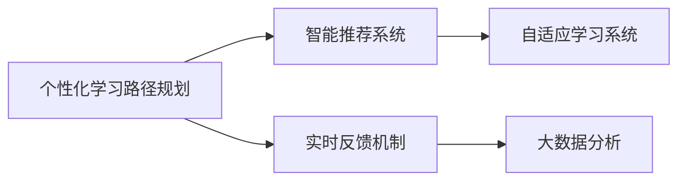

                 

# AI在个性化职场技能培训中的应用：促进职业发展

> 关键词：AI，个性化，职场技能培训，职业发展，智能推荐，学习路径规划，实时反馈，自适应学习

## 1. 背景介绍

### 1.1 问题由来
在当今快速变化的职场环境中，员工需要不断学习和提升技能，以应对新挑战和抓住新机会。然而，传统的培训方式往往存在一些局限性：

1. **大规模定制化难度大**：传统的培训模式主要依赖于课程设计者和授课教师的经验，难以根据每个员工的具体情况进行定制化设计。
2. **反馈周期长**：学员的进度反馈通常需要等待课程结束后的测评，反馈的滞后性影响了学习的及时性。
3. **知识更新滞后**：培训课程的更新周期较长，难以跟上行业发展速度。
4. **资源利用率低**：许多培训课程资源并未得到充分利用，未能根据学员的具体需求进行精准推送。

面对这些挑战，AI技术提供了一种解决方案，通过个性化学习和实时反馈，帮助员工更高效地提升职场技能，从而促进其职业发展。

### 1.2 问题核心关键点
AI在个性化职场技能培训中的应用，主要集中在以下几个关键点上：

- **个性化学习路径规划**：利用AI技术分析学员的学习习惯、技能水平、兴趣偏好等数据，为其定制个性化的学习路径。
- **智能推荐系统**：基于学员的历史学习数据和实时反馈，动态调整学习内容和推荐资源，优化学习效率。
- **实时反馈机制**：通过AI技术实现即时评估和反馈，帮助学员及时调整学习策略，提升学习效果。
- **自适应学习系统**：根据学员的学习进度和理解情况，动态调整学习难度和进度，适应学员的个体差异。
- **大数据分析**：通过分析大规模学习数据，洞察行业趋势和学员需求，优化培训课程设计和资源配置。

这些关键点共同构成了AI在职场技能培训中的核心价值，极大地提升了培训效果和学习效率。

### 1.3 问题研究意义
AI在个性化职场技能培训中的应用，对于提升员工职业发展具有重要意义：

1. **促进职业发展**：通过定制化的学习路径和智能推荐，帮助员工快速掌握所需技能，提高其职场竞争力。
2. **提升培训效率**：实时反馈和自适应学习系统，保证了学习过程的有效性和高效性。
3. **降低培训成本**：优化资源配置，减少不必要的重复学习，提高培训资源的利用率。
4. **增强学习动机**：个性化的学习路径和智能推荐，增加了学习的趣味性和动机，促进持续学习。
5. **推动行业进步**：大数据分析可以洞察行业趋势，优化培训课程设计，推动整个行业的人才素质提升。

通过AI技术的引入，职场技能培训可以更精准、高效地满足员工需求，促进其职业发展，同时也为企业的知识管理与人才培养提供了新的工具和方法。

## 2. 核心概念与联系

### 2.1 核心概念概述

为了更好地理解AI在个性化职场技能培训中的应用，本节将介绍几个关键概念：

- **AI（人工智能）**：通过模拟人类的智能行为，如感知、推理、学习等，实现任务自动化和智能化处理的技术。
- **个性化学习（Personalized Learning）**：根据个体需求和特性，量身定制学习内容和路径，以提高学习效果和满意度。
- **职场技能培训（Career Skill Training）**：旨在提升员工职业技能，帮助其适应和胜任工作岗位的培训活动。
- **智能推荐系统（Recommendation System）**：利用AI技术对用户行为进行分析和预测，推荐符合其兴趣和需求的内容。
- **自适应学习系统（Adaptive Learning System）**：根据学员的学习进度和理解情况，动态调整学习内容和难度，以适应其学习节奏。

这些核心概念之间存在紧密的联系，共同构成了AI在个性化职场技能培训中的技术框架。

### 2.2 核心概念原理和架构的 Mermaid 流程图



这个流程图展示了AI在个性化职场技能培训中的核心流程：从个性化学习路径规划到智能推荐系统，再到实时反馈机制和自适应学习系统，最后通过大数据分析优化培训效果，形成一个闭环。

### 2.3 核心概念的逻辑关系

- **个性化学习路径规划**：是AI应用的基础，通过分析学员的个性化需求和特性，定制学习路径，确保学习的针对性和有效性。
- **智能推荐系统**：在个性化学习路径的基础上，利用AI技术分析学员的学习数据，动态调整推荐内容，优化学习效果。
- **实时反馈机制**：通过即时评估和反馈，帮助学员及时调整学习策略，提高学习效率。
- **自适应学习系统**：根据学员的学习进度和理解情况，动态调整学习内容和难度，适应学员的个体差异。
- **大数据分析**：通过对大规模学习数据的分析，洞察行业趋势和学员需求，优化培训课程设计和资源配置，进一步提升培训效果。

这些核心概念共同构建了一个完整的AI在个性化职场技能培训中的应用框架，实现了从学习路径规划到实时反馈和自适应学习的全流程智能化管理。

## 3. 核心算法原理 & 具体操作步骤
### 3.1 算法原理概述

AI在个性化职场技能培训中的应用，主要基于以下算法原理：

- **机器学习（Machine Learning）**：通过分析学员的历史学习数据，构建个性化学习模型，优化推荐系统。
- **深度学习（Deep Learning）**：利用深度神经网络模型处理大规模非结构化数据，提高推荐系统的准确性和个性化程度。
- **自然语言处理（NLP）**：通过文本分析技术，理解学员的学习内容和反馈信息，实现智能推荐和实时评估。
- **强化学习（Reinforcement Learning）**：通过智能反馈机制，动态调整学习策略和资源配置，提升学习效果。
- **协同过滤（Collaborative Filtering）**：基于学员之间的相似性，推荐相关课程和学习内容，增强个性化学习的深度和广度。

这些算法原理共同支撑了AI在职场技能培训中的个性化和智能化应用，提升了培训的针对性和效果。

### 3.2 算法步骤详解

AI在个性化职场技能培训中的应用，主要包括以下几个关键步骤：

**Step 1: 数据收集与预处理**
- 收集学员的学习历史数据、学习内容、反馈信息等，进行数据清洗和预处理，构建学习数据集。
- 分析学员的学习行为特征，如学习时间、学习频率、学习完成度等，用于后续建模和推荐。

**Step 2: 个性化学习路径规划**
- 利用机器学习算法（如决策树、随机森林等），分析学员的学习行为和需求，构建个性化学习路径。
- 考虑学员的职业目标和岗位需求，为其推荐相关课程和学习内容。

**Step 3: 智能推荐系统构建**
- 利用深度学习模型（如RNN、LSTM、Transformer等），对学员的学习数据进行建模，预测其感兴趣的学习内容和推荐资源。
- 考虑学员的学习历史、兴趣偏好和实时反馈，动态调整推荐算法，提高推荐的准确性和个性化程度。

**Step 4: 实时反馈机制设计**
- 设计实时评估和反馈机制，通过自然语言处理技术，分析学员的反馈信息，评估学习效果。
- 根据反馈结果，动态调整学习路径和推荐内容，优化学习策略。

**Step 5: 自适应学习系统实现**
- 利用强化学习算法（如Q-learning、SARSA等），根据学员的学习进度和理解情况，动态调整学习难度和进度。
- 通过实时评估和反馈，不断优化学习策略，提高学习效果。

**Step 6: 大数据分析与优化**
- 通过分析大规模学习数据，利用大数据技术（如Hadoop、Spark等），洞察行业趋势和学员需求。
- 根据分析结果，优化培训课程设计和资源配置，提升培训效果和学习体验。

### 3.3 算法优缺点

AI在个性化职场技能培训中的应用，具有以下优点：

- **个性化学习**：通过大数据分析和个性化推荐，满足不同学员的学习需求，提高学习效果。
- **高效学习**：实时反馈和自适应学习系统，保证了学习过程的有效性和高效性。
- **成本低廉**：相较于传统培训方式，AI应用能够降低培训成本，提高资源利用率。
- **灵活性高**：根据行业发展趋势和学员需求，动态调整培训内容，提升培训的灵活性和适应性。

同时，该方法也存在一些局限性：

- **数据隐私问题**：学员的学习数据和反馈信息可能涉及个人隐私，需要采取严格的隐私保护措施。
- **技术复杂度**：构建和维护个性化推荐系统和自适应学习系统，需要一定的技术实力和数据支持。
- **算法偏差**：推荐算法可能存在算法偏差，需要持续优化和调整，避免对某些学员的歧视。
- **学习效果难以保证**：尽管技术手段丰富，但学习效果仍受多种因素影响，如学员的动机和环境等。

尽管存在这些局限性，但AI在个性化职场技能培训中的应用，已经展现出了巨大的潜力和价值。未来相关研究将进一步优化算法，提升学习效果，同时保障学员的隐私和安全。

### 3.4 算法应用领域

AI在个性化职场技能培训中的应用，已经广泛应用于多个领域，例如：

- **企业培训**：利用AI技术，帮助企业员工定制化学习路径，提升职业技能，促进职业发展。
- **在线教育**：通过个性化推荐和实时反馈，提高在线学习的吸引力和效果。
- **职业发展平台**：构建基于AI的职业发展平台，提供个性化的职业规划和技能提升服务。
- **职业认证考试**：利用AI技术，为职业认证考试提供个性化的学习资源和评估系统。
- **远程办公**：通过智能推荐和自适应学习，提升远程办公人员的工作效率和技能水平。

除了上述这些领域，AI在个性化职场技能培训中的应用还在不断拓展，未来将覆盖更多的场景，提升整体培训效果。

## 4. 数学模型和公式 & 详细讲解

### 4.1 数学模型构建

为了更好地理解AI在个性化职场技能培训中的应用，本节将使用数学语言对关键算法进行严格刻画。

设学员集合为 $U$，课程集合为 $C$，学习行为特征集合为 $X$。学员的个性化学习路径规划和智能推荐系统可以建模为以下优化问题：

$$
\min_{\theta} \sum_{u \in U} \ell(u, f_\theta(x_u))
$$

其中 $\ell$ 为损失函数，$f_\theta(x)$ 为推荐模型的预测函数，$x_u$ 为学员 $u$ 的学习行为特征，$\theta$ 为模型参数。

### 4.2 公式推导过程

以下我们以深度学习模型为例，推导智能推荐系统的损失函数及其梯度计算公式。

假设推荐模型为深度神经网络 $f_\theta(x)$，其中 $x$ 为学员的学习行为特征向量，$\theta$ 为模型参数。推荐模型的输出 $y$ 为推荐资源的评分或概率，用于衡量学员对该资源的兴趣程度。

定义损失函数 $\ell(y, \hat{y})$ 为推荐系统预测输出与真实标签 $y$ 之间的差异。在实际应用中，通常使用交叉熵损失或均方误差损失，例如：

$$
\ell(y, \hat{y}) = -\log \hat{y} \quad \text{或} \quad \ell(y, \hat{y}) = (y - \hat{y})^2
$$

其中 $\hat{y}$ 为模型的预测输出，$y$ 为真实标签。

根据链式法则，损失函数对模型参数 $\theta$ 的梯度为：

$$
\nabla_\theta \ell(y, f_\theta(x)) = -\nabla_\theta \log f_\theta(x)
$$

其中 $\nabla_\theta \log f_\theta(x)$ 为对数似然梯度，可以通过反向传播算法高效计算。

在得到损失函数的梯度后，即可带入优化算法，完成模型的迭代优化。重复上述过程直至收敛，最终得到适应学员需求的推荐模型。

### 4.3 案例分析与讲解

以推荐系统为例，假设有100名学员，每人每月有5次学习行为记录，每次记录包括学习时间、学习内容、学习效果等特征。通过收集这些数据，可以构建一个100x5的学员行为特征矩阵。

利用深度学习模型，对学员行为特征进行建模，预测其对不同课程的兴趣程度。以交叉熵损失为例，可以构建如下损失函数：

$$
\ell = -\frac{1}{N} \sum_{i=1}^N \sum_{j=1}^5 \sum_{k=1}^K \ell(y_{ikj}, \hat{y}_{ikj})
$$

其中 $N$ 为学员总数，$K$ 为课程总数。$y_{ikj}$ 为学员 $i$ 在第 $k$ 门课程上的学习效果，$\hat{y}_{ikj}$ 为模型对课程 $k$ 的推荐评分。

通过梯度下降等优化算法，不断更新模型参数 $\theta$，最小化损失函数 $\ell$，使得模型输出逼近真实兴趣标签。重复上述过程直至收敛，最终得到适应学员需求的推荐模型。

## 5. 项目实践：代码实例和详细解释说明

### 5.1 开发环境搭建

在进行项目实践前，我们需要准备好开发环境。以下是使用Python进行TensorFlow开发的环境配置流程：

1. 安装Anaconda：从官网下载并安装Anaconda，用于创建独立的Python环境。

2. 创建并激活虚拟环境：
```bash
conda create -n tf-env python=3.8 
conda activate tf-env
```

3. 安装TensorFlow：根据CUDA版本，从官网获取对应的安装命令。例如：
```bash
conda install tensorflow-gpu=2.7.0
```

4. 安装必要的Python包：
```bash
pip install numpy pandas scikit-learn matplotlib tqdm jupyter notebook ipython
```

完成上述步骤后，即可在`tf-env`环境中开始项目实践。

### 5.2 源代码详细实现

这里我们以基于TensorFlow的推荐系统为例，给出完整的源代码实现。

```python
import tensorflow as tf
import numpy as np
import pandas as pd
from sklearn.model_selection import train_test_split
from tensorflow.keras.layers import Input, Dense, Embedding, Concatenate, Dropout
from tensorflow.keras.models import Model

# 加载数据
data = pd.read_csv('user_course_data.csv')

# 数据预处理
user_id = data['user_id']
course_id = data['course_id']
features = data[['learning_time', 'learning_frequency', 'learning_completed']]
features = features.fillna(features.mean())
features = (features - features.mean()) / features.std()

# 划分训练集和测试集
train_data, test_data = train_test_split(data, test_size=0.2, random_state=42)

# 构建模型
input_user = Input(shape=(1,))
input_course = Input(shape=(1,))
features_user = tf.keras.layers.Dense(10, activation='relu')(input_user)
features_course = tf.keras.layers.Dense(10, activation='relu')(input_course)
concat = Concatenate()([features_user, features_course])
features = Dropout(0.2)(concat)
output = Dense(1, activation='sigmoid')(features)
model = Model(inputs=[input_user, input_course], outputs=output)

# 编译模型
model.compile(optimizer='adam', loss='binary_crossentropy', metrics=['accuracy'])

# 训练模型
model.fit([train_data['user_id'], train_data['course_id']], train_data['is_enrolled'], epochs=10, batch_size=32, validation_split=0.2)

# 评估模型
test_loss, test_accuracy = model.evaluate([test_data['user_id'], test_data['course_id']], test_data['is_enrolled'])
print(f'Test Loss: {test_loss}, Test Accuracy: {test_accuracy}')
```

### 5.3 代码解读与分析

让我们再详细解读一下关键代码的实现细节：

**数据预处理**：
- 通过Pandas加载学员行为数据，并进行预处理，去除缺失值，标准化数据。

**模型构建**：
- 利用TensorFlow的Keras API，构建基于用户ID和课程ID的双输入模型。
- 分别对用户ID和课程ID进行嵌入处理，并将其与特征向量进行拼接。
- 通过全连接层和Dropout层对拼接后的特征进行处理，最后输出一个二分类结果。

**模型编译与训练**：
- 使用Adam优化器和二元交叉熵损失函数进行模型编译。
- 在训练集上使用指定参数训练模型，并在验证集上进行验证，评估模型效果。

**模型评估**：
- 在测试集上评估模型性能，输出测试损失和准确率。

可以看到，TensorFlow的Keras API使得模型构建和训练过程简洁高效，开发者可以专注于模型设计和算法优化。

## 6. 实际应用场景

### 6.1 智能培训平台

基于AI的个性化职场技能培训，可以构建智能培训平台，帮助员工定制化学习路径，提升职业技能，从而促进职业发展。平台通过分析学员的学习历史和兴趣偏好，推荐相关课程和资源，提供实时反馈和评估，实现高效、个性化的学习体验。

### 6.2 在线职业认证考试

利用AI技术，为职业认证考试提供个性化的学习资源和评估系统。系统根据学员的学习行为和知识掌握情况，动态调整学习路径和内容，确保学员能够高效掌握考试所需的技能和知识。

### 6.3 远程办公培训

通过智能推荐和自适应学习，提升远程办公人员的工作效率和技能水平。平台根据学员的远程办公需求和学习进度，推荐相关课程和资源，动态调整学习难度和进度，确保学员能够快速适应远程办公环境。

### 6.4 未来应用展望

随着AI技术的不断进步，基于个性化学习和智能推荐的应用场景将进一步扩展，带来更加丰富和高效的学习体验。未来，AI在个性化职场技能培训中的应用将涵盖更多领域，如远程协作、虚拟现实培训等，为职业发展提供更强大的支持。

## 7. 工具和资源推荐

### 7.1 学习资源推荐

为了帮助开发者系统掌握AI在个性化职场技能培训中的应用，这里推荐一些优质的学习资源：

1. **《深度学习基础》课程**：斯坦福大学开设的深度学习课程，系统讲解深度学习的基本概念和应用，适合初学者入门。

2. **《个性化推荐系统》书籍**：详细介绍了个性化推荐系统的原理和实现，涵盖多种推荐算法和技术。

3. **《TensorFlow实战》书籍**：TensorFlow官方推荐书籍，深入浅出地介绍了TensorFlow的使用方法和实践案例。

4. **Kaggle竞赛**：参与Kaggle推荐系统竞赛，实战练习推荐算法，积累实际经验。

5. **Google Colab平台**：谷歌提供的免费Jupyter Notebook环境，支持GPU计算，方便开发者快速测试和分享代码。

通过这些资源的学习和实践，相信你一定能够掌握AI在个性化职场技能培训中的关键技术和方法，提升开发和应用能力。

### 7.2 开发工具推荐

高效的开发离不开优秀的工具支持。以下是几款用于AI开发和个性化推荐系统开发的常用工具：

1. **TensorFlow**：由Google主导开发的深度学习框架，生产部署方便，适合大规模工程应用。

2. **PyTorch**：Facebook开发的深度学习框架，灵活性高，支持动态计算图，适合研究和原型开发。

3. **Scikit-learn**：开源机器学习库，提供简单易用的机器学习算法和工具，适合快速实现推荐系统。

4. **Jupyter Notebook**：支持Python代码的交互式开发，提供丰富的可视化功能，适合数据探索和模型验证。

5. **Kaggle平台**：提供大规模数据集和竞赛，方便开发者进行数据探索和算法实现。

合理利用这些工具，可以显著提升AI在个性化职场技能培训中的开发效率，加快创新迭代的步伐。

### 7.3 相关论文推荐

AI在个性化职场技能培训中的应用，涉及多个前沿研究领域。以下是几篇奠基性的相关论文，推荐阅读：

1. **《个性化推荐系统》**：介绍了个性化推荐系统的基本概念和算法，涵盖了协同过滤、内容过滤等多种推荐方法。

2. **《深度学习在推荐系统中的应用》**：详细讲解了深度神经网络在推荐系统中的应用，包括基于RNN、CNN等架构的推荐模型。

3. **《强化学习在推荐系统中的应用》**：介绍了强化学习在推荐系统中的应用，展示了利用强化学习提升推荐效果的方法。

4. **《深度学习与NLP结合的推荐系统》**：结合深度学习和NLP技术，提出了基于文本的推荐方法，提高了推荐系统的个性化程度。

5. **《自适应学习系统》**：研究了自适应学习系统的基本原理和实现方法，通过动态调整学习策略，提升学习效果。

这些论文代表了AI在个性化职场技能培训中的研究方向，通过学习这些前沿成果，可以帮助研究者把握学科前进方向，激发更多的创新灵感。

## 8. 总结：未来发展趋势与挑战

### 8.1 研究成果总结

本文对AI在个性化职场技能培训中的应用进行了全面系统的介绍。首先阐述了AI应用的背景和意义，明确了个性化学习路径规划、智能推荐系统、实时反馈机制和自适应学习系统等关键技术，为个性化职场技能培训提供了重要的理论支持。其次，从原理到实践，详细讲解了AI在推荐系统、自适应学习中的数学模型和算法流程，并给出了代码实例和详细解释。最后，结合实际应用场景，展示了AI在培训平台、职业认证考试、远程办公培训等方面的广泛应用前景。

### 8.2 未来发展趋势

展望未来，AI在个性化职场技能培训中的应用将呈现以下几个发展趋势：

1. **多模态数据融合**：结合文本、图像、视频等多种模态数据，提高推荐系统的丰富性和准确性。

2. **实时动态优化**：通过实时数据收集和动态调整，实现推荐系统的持续优化和个性化提升。

3. **增强现实技术**：利用增强现实技术，提升远程培训的互动性和沉浸感，增强学习体验。

4. **多智能体协同**：通过多智能体协同学习，实现知识共享和高效协作，提升整体培训效果。

5. **跨领域应用拓展**：将AI技术应用于更多领域，如医疗、教育、金融等，推动跨领域人才的培养和成长。

6. **伦理和安全考量**：在AI应用过程中，加强数据隐私保护和算法伦理，确保培训系统的安全和公平性。

以上趋势凸显了AI在个性化职场技能培训中的广阔前景，为未来技术发展提供了新的方向。

### 8.3 面临的挑战

尽管AI在个性化职场技能培训中的应用已经取得了一定进展，但在迈向更加智能化、普适化应用的过程中，仍面临诸多挑战：

1. **数据隐私和安全**：学员的学习数据和反馈信息可能涉及个人隐私，需要采取严格的隐私保护措施。

2. **算法公平性和透明性**：推荐算法可能存在算法偏差，需要持续优化和调整，避免对某些学员的歧视。

3. **模型复杂性和可解释性**：深度学习模型复杂度高，难以解释其内部工作机制，需要加强模型的可解释性。

4. **计算资源需求**：构建和维护大规模推荐系统，需要较高的计算资源，需要优化模型结构和算法。

5. **学习动机和持续性**：个性化学习系统需要考虑学员的学习动机和持续性，避免过度干预，保持学习的自主性。

6. **跨领域应用适应性**：将AI技术应用于不同领域时，需要考虑领域特性和数据特点，优化应用效果。

正视这些挑战，积极应对并寻求突破，将是大规模AI应用走向成熟的重要步骤。相信随着学界和产业界的共同努力，这些挑战终将一一被克服，AI在个性化职场技能培训中的潜力将进一步释放。

### 8.4 研究展望

面对个性化职场技能培训中的挑战，未来的研究需要在以下几个方面寻求新的突破：

1. **数据隐私保护**：开发数据加密和匿名化技术，确保学员隐私安全。

2. **算法公平性**：引入公平性约束和验证机制，减少算法偏见，提高算法透明性。

3. **模型可解释性**：利用可解释AI技术，增强模型的可解释性，提高其可信度和可靠性。

4. **跨领域应用**：将AI技术应用于更多领域，推动跨领域人才的培养和成长。

5. **计算资源优化**：通过模型压缩、分布式计算等方法，优化推荐系统的计算资源需求。

6. **学习动机和持续性**：结合行为心理学和认知科学，研究学习动机和持续性，设计更有效的个性化学习系统。

这些研究方向的探索，必将引领AI在个性化职场技能培训中的技术进步，为构建智能、高效、公平的学习平台提供新的工具和方法。面向未来，AI技术在职场技能培训中的应用将不断拓展，推动职业发展迈向新高度。

## 9. 附录：常见问题与解答

**Q1：如何衡量AI在个性化职场技能培训中的效果？**

A: 评估AI在个性化职场技能培训中的效果，主要通过以下几个指标：

1. **个性化学习效果**：通过对比个性化推荐系统前后的学习效果，评估推荐系统对学员的个性化提升程度。

2. **学习效率提升**：通过统计学习时间和学习完成度，评估个性化推荐系统对学习效率的提升效果。

3. **学习动机保持**：通过调查学员对个性化推荐系统的反馈，评估其对学习动机和持续性的影响。

4. **知识掌握度**：通过考试和测评等手段，评估学员对推荐内容的学习效果和知识掌握程度。

5. **用户体验满意度**：通过用户调查和满意度问卷，评估学员对个性化推荐系统的使用体验和满意度。

这些指标综合反映了AI在个性化职场技能培训中的实际效果，有助于进一步优化和改进系统设计。

**Q2：构建个性化推荐系统需要哪些关键数据？**

A: 构建个性化推荐系统需要收集和分析以下关键数据：

1. **用户行为数据**：包括学习时间、学习频率、学习内容、学习效果等，用于建模和推荐。

2. **用户特征数据**：包括年龄、职业、兴趣、需求等，用于个性化推荐。

3. **课程和资源数据**：包括课程内容、难度、时长、评分等，用于推荐和评估。

4. **反馈数据**：包括学员对推荐资源的反馈和评分，用于动态调整推荐算法。

5. **外部数据**：包括行业趋势、技能需求等，用于优化推荐内容和路径。

这些数据共同构成了个性化推荐系统的数据基础，通过数据挖掘和分析，可以构建更加精准、高效、个性化的推荐模型。

**Q3：如何构建自适应学习系统？**

A: 构建自适应学习系统主要包括以下几个步骤：

1. **学习路径规划**：根据学员的学习进度和理解情况，动态调整学习路径和内容，确保学员能够高效掌握所需技能。

2. **学习效果评估**：通过即时评估和反馈，实时监控学员的学习效果，及时发现学习瓶颈。

3. **学习策略调整**：根据评估结果，动态调整学习难度和进度，适应学员的个体差异。

4. **推荐资源优化**：通过自然语言处理技术，分析学员的学习内容和反馈信息，推荐相关资源和内容。

5. **持续优化和学习**：通过实时反馈和评估，不断优化学习策略，提高学习效果和满意度。

自适应学习系统需要综合考虑学习者的认知水平、学习动机和个性化需求，通过动态调整和学习策略，实现高效、个性化的学习体验。

**Q4：如何保障AI在个性化培训中的应用数据安全？**

A: 保障AI在个性化培训中的应用数据安全，主要通过以下几个措施：

1. **数据加密**：采用数据加密技术，确保数据在传输和存储过程中的安全性。

2. **匿名化处理**：通过数据匿名化和去标识化，保护学员的个人隐私信息。

3. **访问控制**：设置严格的数据访问权限，确保只有授权人员能够访问和处理数据。

4. **数据审计**：定期进行数据审计，检查数据访问和处理记录，确保合规性。

5. **安全监控**：部署安全监控系统，实时监测数据访问和处理行为，及时发现和应对潜在威胁。

通过这些措施，可以有效地保障AI在个性化培训中的应用数据安全，避免数据泄露和滥用。

**Q5：如何处理AI推荐系统中的算法偏差问题？**

A: 处理AI推荐系统中的算法偏差问题，主要通过以下几个方法：

1. **数据多样性**：确保训练数据的多样性和代表性，避免数据偏见。

2. **公平性约束**：引入公平性约束和验证机制，减少算法偏见，提高算法透明性。

3. **算法优化**：通过优化推荐算法，平衡不同用户和课程的推荐结果，避免对某些学员的歧视。

4. **人工干预**：在推荐算法中加入人工干预，如专家评审和反馈，及时发现和纠正算法偏见。

5. **持续评估**：通过实时监控和评估，及时发现和修正推荐系统的偏差问题，保持系统的公平性。

通过这些方法，可以有效地处理AI推荐系统中的算法偏差问题，确保推荐结果的公平性和透明性。

---

作者：禅与计算机程序设计艺术 / Zen and the Art of Computer Programming

