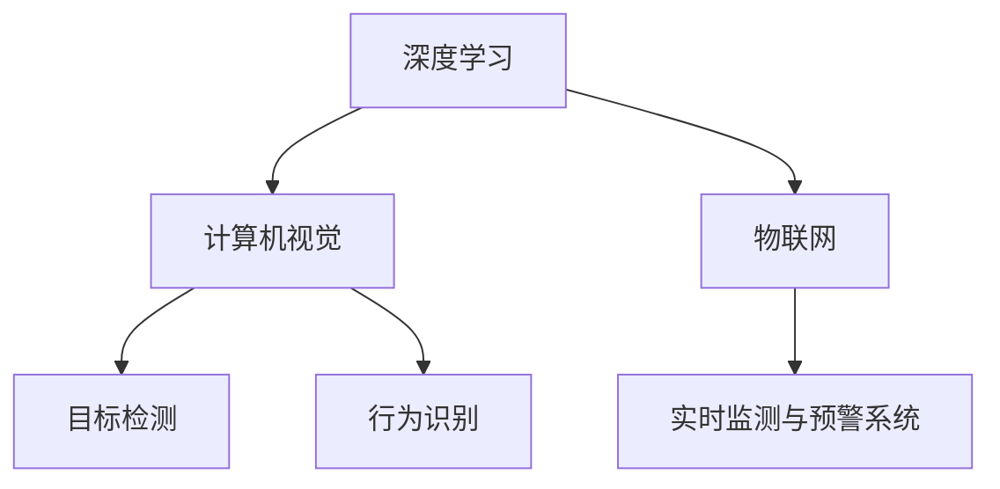

                 

# AI在动物保护中的应用：监测与反偷猎

## 1. 背景介绍

### 1.1 问题由来
近年来，全球范围内，野生动物偷猎和非法贸易活动日益猖獗，许多珍稀物种面临灭绝风险。偷猎者往往在偏远区域进行非法猎捕，导致执法和监管难以实施，给野生动物的生存带来巨大威胁。而随着数字技术的发展，利用AI技术进行动物保护的监测和反偷猎工作，逐渐成为新兴的解决方案。

### 1.2 问题核心关键点
利用AI技术进行动物保护监测与反偷猎，主要依赖于以下几个关键点：

- **数据收集与标注**：获取高质量的动物观测数据和标注信息，是AI系统训练和应用的前提。
- **图像识别与行为分析**：通过深度学习模型，自动识别人类和动物的图像，并分析其行为模式。
- **实时监测与预警**：结合物联网设备和AI系统，实现对特定区域的实时监测，及时发现偷猎行为。
- **反偷猎策略优化**：通过AI技术分析偷猎数据，制定针对性的反偷猎策略，提高执法效率。

### 1.3 问题研究意义
AI技术在动物保护中的应用，对提升野生动物保护成效具有重要意义：

- **减少执法成本**：AI系统可以在不增加大量人员的情况下，提供精准的监测和预警，减少执法成本。
- **提升保护精度**：通过自动化的图像识别和行为分析，提高数据处理效率和保护精度。
- **实时响应能力**：AI系统能够在发现异常行为后，立即生成报警，提高执法和反应的及时性。
- **数据驱动决策**：利用AI技术分析大量数据，辅助制定科学的保护和反偷猎策略，优化保护措施。

## 2. 核心概念与联系

### 2.1 核心概念概述

在动物保护中的应用场景中，涉及多个关键技术概念，包括：

- **深度学习(Deep Learning)**：基于神经网络模型，通过大量标注数据训练得到模型，实现图像识别、行为分析等功能。
- **计算机视觉(Computer Vision)**：利用图像和视频处理技术，自动识别人类和动物的特征。
- **目标检测(Object Detection)**：通过深度学习模型，识别出图像中的目标物体及其位置信息。
- **行为识别(Animal Behavior Recognition)**：基于图像或视频数据，自动识别动物的行为模式。
- **物联网(IoT)**：利用传感器和网络设备，实现实时数据的收集和传输。
- **实时监测与预警系统(Real-time Monitoring and Alert System)**：结合AI技术和物联网设备，实现对特定区域的实时监测和预警。

这些概念之间的联系如下：



## 3. 核心算法原理 & 具体操作步骤

### 3.1 算法原理概述

AI在动物保护中的应用，主要通过以下步骤实现：

1. **数据收集与标注**：收集野生动物的图像、视频和行为数据，并进行人工标注。
2. **模型训练**：使用深度学习模型对标注数据进行训练，得到用于图像识别和行为分析的AI模型。
3. **实时监测与预警**：在特定保护区域部署物联网设备，实时收集图像和位置数据，并使用AI模型进行分析和预警。
4. **反偷猎策略优化**：利用AI系统分析偷猎数据，生成最优的执法和保护策略。

### 3.2 算法步骤详解

#### 步骤1：数据收集与标注

1. **数据来源**：收集野生动物的图像、视频和行为数据，包括野生动物的视频监控、红外相机捕获、无人机航拍等。
2. **数据标注**：通过人工标注工具，对数据进行分类和标注。例如，将图像标注为“人类”、“动物”、“植物”等类别，并记录时间、位置等信息。

#### 步骤2：模型训练

1. **模型选择**：选择适合的深度学习模型，如卷积神经网络(CNN)、循环神经网络(RNN)或Transformer模型。
2. **数据预处理**：对收集到的数据进行预处理，如裁剪、缩放、归一化等，以便模型训练。
3. **模型训练**：使用训练数据对模型进行训练，调整超参数，优化损失函数。例如，使用交叉熵损失函数进行分类任务训练。
4. **模型评估**：使用验证集对模型进行评估，选择最优的模型参数。例如，通过准确率、召回率、F1-score等指标评估模型性能。

#### 步骤3：实时监测与预警

1. **物联网设备部署**：在保护区域内部署各种物联网设备，如摄像头、传感器、GPS定位器等。
2. **数据收集与传输**：实时收集设备传回的图像、视频和位置数据，通过网络传输到中央服务器。
3. **模型推理**：使用训练好的模型对收集到的数据进行推理，自动识别人类和动物的特征，并判断其行为模式。
4. **预警生成**：根据推理结果生成预警信息，及时发现异常行为，如非法猎捕、盗猎者进入等。

#### 步骤4：反偷猎策略优化

1. **数据整合与分析**：收集历史偷猎数据，整合分析，找出偷猎行为的模式和规律。
2. **策略制定与优化**：根据分析结果，制定反偷猎策略，如加强巡逻、设置障碍、监控重点区域等。
3. **策略实施与评估**：实施反偷猎策略，通过AI系统监测效果，并根据反馈调整策略，以提高效果。

### 3.3 算法优缺点

**优点**：

- **自动化与高效性**：AI系统可以自动处理大量数据，提高监测效率。
- **实时性与预警能力**：实时监测系统能快速响应异常行为，提高执法和保护的效果。
- **成本降低**：减少人工监控成本，提升保护工作的可持续性。

**缺点**：

- **数据依赖**：高质量的数据是AI系统训练和应用的基础，获取和标注成本较高。
- **模型复杂性**：深度学习模型训练和优化复杂，需要丰富的计算资源。
- **环境适应性**：AI模型在特定环境下可能出现识别错误或误报。
- **隐私与安全问题**：需要保护数据隐私和安全，避免数据泄露或滥用。

### 3.4 算法应用领域

AI在动物保护中的应用，涵盖了以下几个主要领域：

- **野生动物监测**：通过AI系统实现对特定区域的实时监测，自动识别人类和动物的图像，并分析其行为模式。
- **盗猎预警**：结合物联网设备，实时收集图像和位置数据，自动发现并生成预警信息。
- **反偷猎执法**：利用AI系统分析偷猎数据，制定最优的执法和保护策略，提高执法效率。
- **生物多样性保护**：通过图像识别和行为分析，评估生态系统健康状况，制定保护措施。
- **生态旅游管理**：结合AI和物联网技术，实现对生态旅游区域的实时管理和监测，保护野生动物。

## 4. 数学模型和公式 & 详细讲解 & 举例说明

### 4.1 数学模型构建

基于深度学习模型的动物保护监测与反偷猎系统，主要涉及以下几个数学模型：

- **图像识别模型**：用于自动识别人类和动物的图像，其目标函数为：
$$
\min_{\theta} \mathcal{L}(\theta) = -\frac{1}{N} \sum_{i=1}^N \log p(y_i | x_i; \theta)
$$
其中，$y_i$为图像标签，$x_i$为图像数据，$\theta$为模型参数，$p(y_i | x_i; \theta)$为模型预测概率。

- **行为识别模型**：用于自动识别动物的行为模式，其目标函数为：
$$
\min_{\theta} \mathcal{L}(\theta) = -\frac{1}{N} \sum_{i=1}^N \log p(y_i | x_i; \theta)
$$
其中，$y_i$为行为标签，$x_i$为行为数据，$\theta$为模型参数，$p(y_i | x_i; \theta)$为模型预测概率。

### 4.2 公式推导过程

以图像识别模型为例，推导其目标函数和梯度计算过程：

1. **目标函数**：
$$
\min_{\theta} \mathcal{L}(\theta) = -\frac{1}{N} \sum_{i=1}^N \log p(y_i | x_i; \theta)
$$
其中，$p(y_i | x_i; \theta)$为模型在图像$x_i$上预测为$y_i$的概率，可表示为：
$$
p(y_i | x_i; \theta) = \frac{e^{\log p(y_i, x_i; \theta)}}{\sum_{j=1}^K e^{\log p(y_j, x_i; \theta)}}
$$
其中，$K$为类别数，$\log p(y_i, x_i; \theta)$为模型对图像$x_i$的输出，可通过反向传播计算。

2. **梯度计算**：
$$
\frac{\partial \mathcal{L}(\theta)}{\partial \theta} = -\frac{1}{N} \sum_{i=1}^N \nabla_{\theta} \log p(y_i | x_i; \theta)
$$
其中，$\nabla_{\theta} \log p(y_i | x_i; \theta)$为交叉熵损失函数的梯度，可通过链式法则和反向传播计算。

### 4.3 案例分析与讲解

假设我们训练一个用于识别人类和动物的图像分类模型。我们收集了1000张图像，其中500张标注为“人类”，500张标注为“动物”。我们将数据划分为训练集和测试集，训练集占总数据的80%，测试集占20%。使用深度学习框架PyTorch实现模型训练和测试。

1. **数据预处理**：对图像进行裁剪、缩放、归一化等预处理操作，以便模型训练。
2. **模型选择与训练**：选择适合的目标检测模型，如YOLO或Faster R-CNN，并进行训练。
3. **模型评估**：使用测试集对模型进行评估，计算准确率、召回率、F1-score等指标，选择最优模型。
4. **应用部署**：将训练好的模型部署到实时监测系统中，自动识别人类和动物的图像，并生成预警信息。

## 5. 项目实践：代码实例和详细解释说明

### 5.1 开发环境搭建

以下是使用Python进行AI系统开发的开发环境配置流程：

1. 安装Anaconda：从官网下载并安装Anaconda，用于创建独立的Python环境。
2. 创建并激活虚拟环境：
```bash
conda create -n ai-env python=3.8 
conda activate ai-env
```
3. 安装相关库：
```bash
pip install numpy pandas scikit-learn torch torchvision transformers opencv-python==4.5.1.48
```
4. 安装PyTorch：
```bash
conda install pytorch torchvision torchaudio -c pytorch -c conda-forge
```
5. 安装TensorBoard：
```bash
pip install tensorboard
```
6. 安装相关数据处理库：
```bash
pip install Pillow
```

### 5.2 源代码详细实现

#### 5.2.1 数据加载与预处理

```python
import cv2
import numpy as np
from torch.utils.data import Dataset, DataLoader
from torchvision import transforms

class AnimalDataset(Dataset):
    def __init__(self, images, labels):
        self.images = images
        self.labels = labels
        self.transform = transforms.Compose([
            transforms.Resize(256),
            transforms.CenterCrop(224),
            transforms.ToTensor(),
            transforms.Normalize(mean=[0.485, 0.456, 0.406],
                                std=[0.229, 0.224, 0.225])
        ])
        
    def __len__(self):
        return len(self.images)
    
    def __getitem__(self, idx):
        img = self.images[idx]
        label = self.labels[idx]
        img = self.transform(img)
        return img, label
```

#### 5.2.2 模型训练与评估

```python
import torch.nn as nn
import torch.optim as optim
import torchvision.models as models
from torch.utils.data import DataLoader
from torchvision.datasets import ImageFolder
from torch.utils.tensorboard import SummaryWriter

# 定义模型
model = models.resnet50(pretrained=True)
model.fc = nn.Linear(2048, 2)

# 定义损失函数
criterion = nn.CrossEntropyLoss()

# 定义优化器
optimizer = optim.Adam(model.parameters(), lr=0.001)

# 加载数据集
train_dataset = ImageFolder("train", transform=transforms.Compose([
    transforms.Resize(256),
    transforms.CenterCrop(224),
    transforms.ToTensor(),
    transforms.Normalize(mean=[0.485, 0.456, 0.406],
                        std=[0.229, 0.224, 0.225])
]))

# 定义数据加载器
train_loader = DataLoader(train_dataset, batch_size=16, shuffle=True)

# 定义TensorBoard记录器
writer = SummaryWriter()

# 训练过程
for epoch in range(10):
    model.train()
    running_loss = 0.0
    for i, data in enumerate(train_loader, 0):
        inputs, labels = data
        optimizer.zero_grad()
        outputs = model(inputs)
        loss = criterion(outputs, labels)
        loss.backward()
        optimizer.step()
        
        writer.add_scalar("Loss", loss.item(), i)
        
        running_loss += loss.item()
        if i % 100 == 99:
            writer.add_scalar("Loss", running_loss / 100, epoch)
            running_loss = 0.0
        
    # 评估模型
    model.eval()
    correct = 0
    total = 0
    with torch.no_grad():
        for data in test_loader:
            inputs, labels = data
            outputs = model(inputs)
            _, predicted = torch.max(outputs.data, 1)
            total += labels.size(0)
            correct += (predicted == labels).sum().item()
    
    print("Epoch [%d/%d], Acc: %.3f%%" % (epoch+1, 10, 100 * correct / total))
```

#### 5.2.3 实时监测与预警

```python
import cv2
import numpy as np
import time
import requests
from concurrent.futures import ThreadPoolExecutor

# 实时监测函数
def monitor():
    cap = cv2.VideoCapture(0)
    
    while True:
        ret, frame = cap.read()
        if not ret:
            break
        
        # 调用模型进行推理
        _, prediction = model(frame)
        
        # 生成预警信息
        if prediction[0] > 0.5:
            print("Detected human! Alert!")
            # 发送报警信息到指定接口
            url = "http://your-api-endpoint/alert"
            data = {"action": "alert", "description": "Human detected"}
            requests.post(url, data=data)
        
        cv2.imshow("Frame", frame)
        if cv2.waitKey(1) & 0xFF == ord('q'):
            break
    
    cap.release()
    cv2.destroyAllWindows()

# 启动实时监测线程
executor = ThreadPoolExecutor(max_workers=1)
executor.submit(monitor)
```

### 5.3 代码解读与分析

#### 5.3.1 数据加载与预处理

我们定义了一个名为`AnimalDataset`的数据集类，用于加载和预处理图像数据。该类继承自`Dataset`，实现了`__len__`和`__getitem__`方法。其中，`transform`属性定义了数据预处理的流程，包括缩放、裁剪、归一化等操作。`__len__`方法返回数据集的大小，`__getitem__`方法返回指定索引的图像和标签。

#### 5.3.2 模型训练与评估

我们定义了一个基于ResNet50的分类模型，用于识别人类和动物。模型包括一个全连接层，用于将2048维特征映射到2个类别。损失函数为交叉熵损失，优化器为Adam。我们使用`ImageFolder`加载训练集数据，定义数据加载器，并在每个epoch中训练模型。同时，使用TensorBoard记录训练过程中的损失和精度变化。

#### 5.3.3 实时监测与预警

我们定义了一个`monitor`函数，用于实现实时监测。该函数通过摄像头捕获实时视频，调用训练好的模型进行推理，判断是否检测到人类，并生成预警信息。我们使用`ThreadPoolExecutor`启动一个监测线程，实时运行`monitor`函数。

## 6. 实际应用场景

### 6.1 智能监控系统

智能监控系统在野生动物保护中得到了广泛应用，通过摄像头和传感器设备，实时监测保护区域内的人类和动物活动，自动生成预警信息。例如，在非洲大草原保护区，安装高清摄像头和红外传感器，实时监控野生动物和盗猎者的活动，一旦检测到异常行为，立即生成预警信息，及时通知执法人员。

### 6.2 反偷猎无人机

反偷猎无人机结合了AI技术和无人机技术，通过高清摄像头和热成像仪，对广阔的森林和草原进行实时监控和数据采集。无人机可以飞行数小时，覆盖大面积区域，并自动分析采集到的图像和视频数据，判断是否存在盗猎行为。一旦发现异常，立即生成预警信息，并通知地面执法人员。

### 6.3 动物行为分析

动物行为分析系统可以自动识别和分析野生动物的行为模式，评估生态系统的健康状况。例如，通过摄像头和声音传感器，记录大象的叫声、行为和社交关系，分析其行为模式，评估其健康状况和生存状态。这种系统可以为动物保护提供科学依据，帮助制定更加有效的保护措施。

### 6.4 未来应用展望

未来，AI在动物保护中的应用将更加广泛和深入，主要体现在以下几个方面：

1. **数据融合与分析**：结合卫星遥感、无人机、地面传感器等多种数据源，进行数据融合与分析，提升监测效果和预警能力。
2. **多模态监测**：结合图像、声音、气味等多模态数据，提升监测的全面性和准确性。
3. **智能决策与优化**：通过AI技术分析大量数据，辅助制定最优的执法和保护策略，提高保护效果。
4. **生物多样性保护**：利用AI技术评估生态系统健康状况，保护生物多样性。
5. **社会行为分析**：结合AI技术和心理学研究，分析野生动物和人类的行为模式，理解其社会关系和互动方式。

## 7. 工具和资源推荐

### 7.1 学习资源推荐

为了帮助开发者系统掌握AI技术在动物保护中的应用，这里推荐一些优质的学习资源：

1. **《深度学习》课程**：斯坦福大学开设的深度学习课程，涵盖了深度学习的基本概念和核心技术。
2. **《计算机视觉：模型、学习和推理》书籍**：计算机视觉领域的经典教材，详细介绍了计算机视觉的基本概念和深度学习模型。
3. **TensorFlow官方文档**：TensorFlow的官方文档，提供了丰富的教程和样例代码，适合学习深度学习模型的训练和部署。
4. **Transformers库官方文档**：Transformers库的官方文档，介绍了多种预训练语言模型的使用方法和微调方法。
5. **Pillow库官方文档**：Pillow库的官方文档，提供了图像处理的丰富功能，适合处理动物保护中的图像数据。

### 7.2 开发工具推荐

高效的开发离不开优秀的工具支持。以下是几款用于AI系统开发的常用工具：

1. **PyTorch**：基于Python的开源深度学习框架，提供了丰富的深度学习模型和优化器，适合快速迭代研究。
2. **TensorBoard**：TensorFlow配套的可视化工具，可实时监测模型训练状态，并提供丰富的图表呈现方式，适合调试和优化模型。
3. **TensorFlow**：由Google主导开发的开源深度学习框架，生产部署方便，适合大规模工程应用。
4. **Jupyter Notebook**：免费的开源笔记本环境，支持代码执行、数据可视化、版本控制等功能，适合快速开发和实验。
5. **Google Colab**：谷歌推出的在线Jupyter Notebook环境，免费提供GPU/TPU算力，适合实验最新模型，分享学习笔记。

### 7.3 相关论文推荐

AI在动物保护中的应用，涉及多个前沿研究方向。以下是几篇奠基性的相关论文，推荐阅读：

1. **ImageNet Large Scale Visual Recognition Challenge**：介绍大规模图像识别任务，通过深度学习模型进行图像分类、目标检测等任务。
2. **Learning a Reverse Search Engine for Finding People in Unorganized Video**：提出基于CNN的目标检测模型，用于在无序视频中查找人类和动物。
3. **Animal Behavior Recognition with Deep Learning Models**：介绍深度学习模型在动物行为识别中的应用，评估不同模型的性能。
4. **Remote Sensing Data for Conservation: A Review**：介绍遥感技术在野生动物保护中的应用，结合AI技术提升监测效果。
5. **AI-based Anti-Poaching: A Survey and Outlook**：总结AI技术在反偷猎中的应用，展望未来发展方向。

## 8. 总结：未来发展趋势与挑战

### 8.1 总结

本文对AI在动物保护中的应用进行了全面系统的介绍。首先阐述了动物保护中的主要问题和挑战，明确了AI技术的应用前景和核心关键点。其次，从原理到实践，详细讲解了AI系统在数据收集、模型训练、实时监测和预警等方面的具体操作步骤，给出了代码实例和详细解释。同时，本文还探讨了AI技术在实际应用场景中的具体应用，展望了未来发展趋势。

通过本文的系统梳理，可以看到，AI技术在动物保护中的应用，通过自动化的图像识别、行为分析和实时监测，大大提升了保护的效率和效果。未来，伴随AI技术的不断进步，其在动物保护中的应用将更加广泛和深入，为野生动物的生存和保护带来新的希望。

### 8.2 未来发展趋势

未来，AI在动物保护中的应用将呈现以下几个发展趋势：

1. **多模态数据融合**：结合图像、声音、气味等多模态数据，提升监测的全面性和准确性。
2. **智能决策系统**：通过AI技术分析大量数据，辅助制定最优的执法和保护策略，提高保护效果。
3. **实时监测与预警**：结合物联网设备，实现对特定区域的实时监测和预警，及时发现异常行为。
4. **跨学科融合**：结合心理学、生物学、生态学等学科，深入理解动物行为和生态系统，制定科学保护措施。
5. **全球合作**：各国政府和组织加强合作，共享数据和资源，提升全球野生动物保护水平。

以上趋势凸显了AI技术在动物保护中的广阔前景。这些方向的探索发展，必将进一步提升野生动物保护成效，为地球生态系统的可持续发展做出贡献。

### 8.3 面临的挑战

尽管AI技术在动物保护中的应用已经取得了显著成果，但在迈向更加智能化、普适化应用的过程中，仍面临诸多挑战：

1. **数据获取与标注**：高质量的数据是AI系统训练和应用的基础，获取和标注成本较高。
2. **模型复杂性**：深度学习模型训练和优化复杂，需要丰富的计算资源。
3. **环境适应性**：AI模型在特定环境下可能出现识别错误或误报。
4. **隐私与安全问题**：需要保护数据隐私和安全，避免数据泄露或滥用。
5. **法律与伦理问题**：需要考虑AI系统在动物保护中的应用，避免伦理风险和法律问题。

### 8.4 研究展望

面对AI在动物保护中面临的挑战，未来的研究需要在以下几个方面寻求新的突破：

1. **无监督与半监督学习**：摆脱对大规模标注数据的依赖，利用自监督学习、主动学习等无监督和半监督范式，最大限度利用非结构化数据，实现更加灵活高效的微调。
2. **计算效率优化**：开发更加参数高效的微调方法，在固定大部分预训练参数的同时，只更新极少量的任务相关参数。同时优化模型的计算图，减少前向传播和反向传播的资源消耗，实现更加轻量级、实时性的部署。
3. **跨模态融合**：结合视觉、声音、气味等多模态数据，提升监测的全面性和准确性。
4. **智能决策支持**：结合AI技术和专家知识，制定更加科学合理的保护策略，提升保护效果。
5. **隐私保护与安全防范**：设计隐私保护机制，确保数据安全，避免伦理风险和法律问题。

这些研究方向的探索，必将引领AI技术在动物保护中的应用走向更高的台阶，为野生动物的生存和保护带来新的希望。

## 9. 附录：常见问题与解答

**Q1：AI技术在动物保护中的应用效果如何？**

A: AI技术在动物保护中的应用，已经取得了显著的效果。通过自动化的图像识别、行为分析和实时监测，大大提升了保护的效率和效果。例如，在非洲大草原保护区，通过AI系统实时监控野生动物和盗猎者的活动，大大提高了执法和保护的效果。

**Q2：如何评估AI系统在动物保护中的性能？**

A: AI系统在动物保护中的性能评估，可以通过以下几个指标进行衡量：

1. **准确率**：模型正确识别人类和动物的概率。
2. **召回率**：模型正确识别的正样本占总正样本的比例。
3. **F1-score**：准确率和召回率的调和平均数，综合衡量模型的性能。
4. **监测覆盖率**：AI系统覆盖保护区域的面积和时长，评估监测的全面性和持续性。
5. **预警及时性**：模型生成预警信息的及时性，评估响应的速度和效率。

**Q3：AI技术在动物保护中可能面临哪些伦理问题？**

A: AI技术在动物保护中的应用，可能面临以下几个伦理问题：

1. **数据隐私**：需要保护数据隐私和安全，避免数据泄露或滥用。
2. **公平性与偏见**：AI模型可能学习到数据中的偏见，导致对某些群体或物种的保护不足。
3. **决策透明度**：AI系统的决策过程缺乏可解释性，难以理解其内部工作机制和推理逻辑。
4. **生态影响**：AI系统对生态系统的干预可能带来新的生态问题，需要慎重考虑。

## 总结

通过本文的系统梳理，可以看到，AI技术在动物保护中的应用，通过自动化的图像识别、行为分析和实时监测，大大提升了保护的效率和效果。未来，伴随AI技术的不断进步，其在动物保护中的应用将更加广泛和深入，为野生动物的生存和保护带来新的希望。同时，我们也需要注意解决AI系统面临的挑战，确保其应用的科学性、公正性和可持续性。相信通过多学科的合作和技术的不断进步，AI技术将在野生动物保护中发挥更大的作用，为地球生态系统的可持续发展做出贡献。

