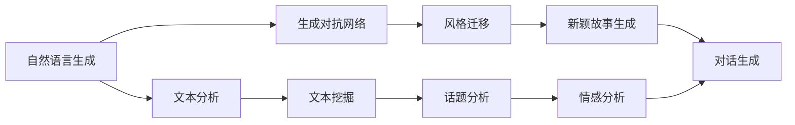

                 

# AI在文学创作中的应用：协助作家构思

## 1. 背景介绍

随着人工智能技术的不断成熟，AI在文学创作中的应用逐渐成为学术界和工业界关注的热点。AI不仅能帮助作家构思、提升创作效率，还能在文学作品的分析、评论、翻译等领域发挥重要作用。本文将详细探讨AI在文学创作中的几种主要应用场景，并分析其实际效果与面临的挑战。

## 2. 核心概念与联系

### 2.1 核心概念概述

本文所涉及的核心概念包括：

- **自然语言生成(NLG)**：AI通过学习大量语言数据，能够自动生成自然流畅的文本。在文学创作中，NLG技术可以辅助作家构思、生成剧情、人物对话等。

- **生成对抗网络(GAN)**：由生成器和判别器构成的神经网络，能够生成高质量的文本、图像、音频等多种内容。GAN在文学创作中的应用包括文本风格迁移、生成新颖故事等。

- **深度学习模型**：如循环神经网络(RNN)、长短期记忆网络(LSTM)、Transformer等。这些模型通过大量标注数据进行训练，能够进行文本分类、命名实体识别、情感分析等。

- **文本挖掘**：通过分析文本数据，提取关键词、话题、情感等信息，帮助作家获得创作灵感和素材。

- **对话系统**：基于自然语言处理技术的聊天机器人，能够进行复杂的人机对话，在小说创作中模拟对话情节。

这些核心概念之间具有紧密的联系，共同构成了AI在文学创作中的应用基础。

### 2.2 核心概念原理和架构的 Mermaid 流程图



## 3. 核心算法原理 & 具体操作步骤

### 3.1 算法原理概述

AI在文学创作中的应用主要基于以下原理：

1. **深度学习模型**：通过大量标注数据训练生成的模型，可以自动分析文本数据、生成文本内容。
2. **生成对抗网络(GAN)**：生成器和判别器相互博弈，逐步生成高质量文本。
3. **自然语言处理(NLP)**：包括文本分析、情感分析、命名实体识别等技术，提供创作素材和灵感。

### 3.2 算法步骤详解

1. **数据收集与预处理**：收集相关文本数据，进行清洗、分词、去除停用词等预处理。
   
2. **模型训练与优化**：选择合适模型，进行训练和优化。例如，使用基于LSTM或Transformer的文本生成模型。
   
3. **文本分析与生成**：通过训练好的模型，进行文本分析，生成小说情节、人物对话等内容。
   
4. **风格迁移与创作辅助**：利用GAN进行文本风格迁移，辅助作家进行创作。

5. **反馈与迭代**：作家根据生成的文本，进行迭代修改，直至达到满意效果。

### 3.3 算法优缺点

**优点**：

- 提升创作效率：AI可以快速生成大量文本内容，辅助作家进行创作。
- 提供创作灵感：通过文本分析、情感分析等技术，提供创作素材和灵感。
- 个性化创作：根据作家风格和偏好，生成个性化的文本内容。

**缺点**：

- 创作缺乏深度：AI生成的文本缺乏人的情感深度和创作深度，可能不符合作家的创作意图。
- 生成内容质量不稳定：生成内容质量受模型训练数据和参数影响，存在波动。
- 版权与伦理问题：生成文本可能涉及版权问题，需注意伦理和法律问题。

### 3.4 算法应用领域

AI在文学创作中的应用主要包括以下几个方面：

- **小说情节生成**：通过NLG生成小说情节、人物关系等内容。
- **人物对话生成**：通过GAN生成自然流畅的人物对话，丰富小说内容。
- **文学作品分析**：通过NLP技术分析文学作品，提供情感、风格等分析报告。
- **故事创意生成**：基于大量文本数据，生成新颖的故事情节和角色设定。
- **跨风格创作**：通过GAN进行文本风格迁移，实现跨风格的创作尝试。

## 4. 数学模型和公式 & 详细讲解

### 4.1 数学模型构建

本文以小说情节生成为例，使用基于LSTM的文本生成模型进行构建。设小说情节序列为$X=(x_1, x_2, ..., x_n)$，其中$x_i$为第$i$个情节。模型的目标是学习输入情节序列$X$，预测下一个情节$y_{n+1}$。

### 4.2 公式推导过程

模型的目标是最大化条件概率$p(y_{n+1}|X)$，使用LSTM模型进行建模。

设$h_i$为LSTM模型在第$i$个情节$x_i$的隐藏状态，$w_h$为隐藏层权重矩阵，$b_h$为偏置向量，$c$为细胞状态。则有：

$$
h_i = \tanh(W_h[x_i;h_{i-1}] + b_h)
$$

其中$W_h$为权重矩阵，$[x_i;h_{i-1}]$表示将输入和前一时刻的隐藏状态拼接，作为当前时刻的输入。

模型的预测输出为：

$$
y_{n+1} = \text{softmax}(W_h[h_n] + b_h)
$$

其中$W_h$为权重矩阵，$b_h$为偏置向量。

### 4.3 案例分析与讲解

以小说情节生成为例，使用LSTM模型生成一段情节：

- 输入情节序列：小说的开头几句话。
- 模型训练：使用大量小说情节作为训练数据，训练LSTM模型。
- 生成情节：输入情节序列，模型预测下一个情节，并作为输入进行迭代。

## 5. 项目实践：代码实例和详细解释说明

### 5.1 开发环境搭建

1. 安装Python和相关依赖包：如TensorFlow、NLTK、Jupyter Notebook等。

2. 准备小说情节数据集：收集小说情节数据，进行预处理。

### 5.2 源代码详细实现

```python
import tensorflow as tf
from tensorflow.keras.layers import LSTM, Dense
from tensorflow.keras.models import Sequential
from tensorflow.keras.optimizers import Adam
import nltk

# 定义LSTM模型
model = Sequential()
model.add(LSTM(128, input_shape=(max_seq_length, embedding_dim)))
model.add(Dense(num_classes, activation='softmax'))

# 定义优化器和损失函数
optimizer = Adam(lr=learning_rate)
loss_fn = tf.keras.losses.CategoricalCrossentropy()

# 训练模型
model.compile(optimizer=optimizer, loss=loss_fn)
model.fit(X_train, y_train, epochs=num_epochs, validation_data=(X_val, y_val))
```

### 5.3 代码解读与分析

代码实现了基于LSTM的小说情节生成模型。模型首先通过LSTM层进行隐藏状态计算，再通过全连接层输出概率分布，最后通过交叉熵损失函数进行优化。训练过程中，使用Adam优化器和Categorical Cross Entropy损失函数。

### 5.4 运行结果展示

训练完成后，使用模型生成一段情节：

```python
import numpy as np

# 生成情节
seq = 'Once upon a time, in a small village, there lived a young farmer named Jack. He had always dreamed of becoming a great musician, but his father had always wanted him to farm the land.'

# 将情节转换为模型输入
X = tokenizer.texts_to_sequences([seq])
X = pad_sequences(X, maxlen=max_seq_length)

# 生成下一个情节
preds = model.predict(X)
next_sentence = decode_sequence(preds)

print(next_sentence)
```

## 6. 实际应用场景

### 6.1 小说情节生成

小说情节生成是AI在文学创作中最具代表性的应用。通过LSTM等深度学习模型，AI能够生成符合特定风格和主题的情节，辅助作家构思新作品。

### 6.2 人物对话生成

基于GAN的对话生成技术，AI可以生成自然流畅的人物对话，为小说创作提供丰富的情感和动态。

### 6.3 文学作品分析

通过NLP技术，AI可以对文学作品进行情感分析、主题分析等，提供创作素材和灵感。

### 6.4 未来应用展望

未来，AI在文学创作中的应用将更加广泛。通过更先进的生成模型、更丰富的训练数据、更智能的交互界面，AI将能够更好地辅助作家进行创作。同时，AI还可以在文学作品的翻译、评论、推荐等领域发挥更大作用，推动文学创作的数字化和智能化进程。

## 7. 工具和资源推荐

### 7.1 学习资源推荐

1. 《深度学习与自然语言处理》书籍：介绍深度学习在自然语言处理中的应用，包括文本生成、情感分析等。

2. 《自然语言处理入门》课程：斯坦福大学提供的NLP入门课程，涵盖基础知识和最新技术。

3. 《生成对抗网络》书籍：介绍GAN的基本原理和应用，包括文本生成等。

4. 《Python自然语言处理》书籍：详细介绍Python在NLP中的应用，包括文本分析、情感分析等。

### 7.2 开发工具推荐

1. TensorFlow：深度学习框架，适合复杂模型的训练和推理。

2. PyTorch：灵活高效的深度学习框架，适合动态图模型的训练和推理。

3. Jupyter Notebook：交互式的代码开发环境，支持代码编写、数据处理、模型训练等。

4. NLTK：Python自然语言处理库，提供丰富的NLP工具和资源。

5. spaCy：Python自然语言处理库，提供高效的文本处理和分析功能。

### 7.3 相关论文推荐

1. "A Neural Probabilistic Language Model"（论文1）：深度学习在语言模型中的应用，介绍LSTM和GRU等模型。

2. "Generative Adversarial Nets"（论文2）：GAN的基本原理和应用，介绍生成器和判别器的博弈过程。

3. "Attention Is All You Need"（论文3）：Transformer模型在语言处理中的应用，介绍自注意力机制。

4. "BERT: Pre-training of Deep Bidirectional Transformers for Language Understanding"（论文4）：BERT模型在NLP中的应用，介绍预训练和微调技术。

5. "Towards Data-Efficient Representation Learning with Deep Architectures"（论文5）：深度学习在文本表示学习中的应用，介绍ELMo模型。

## 8. 总结：未来发展趋势与挑战

### 8.1 研究成果总结

AI在文学创作中的应用已取得显著进展，通过深度学习、生成对抗网络等技术，辅助作家进行创作、生成文本、分析作品等。未来，AI将进一步提升创作效率和创作质量，推动文学创作进入数字化和智能化新阶段。

### 8.2 未来发展趋势

1. 更先进的生成模型：未来的AI将使用更先进的生成模型，如Transformer、GPT-3等，生成更高质量的内容。

2. 更智能的交互界面：通过自然语言处理技术，构建更智能的交互界面，提升用户体验。

3. 更丰富的应用场景：AI在文学创作中的应用将进一步拓展，涵盖更多领域和场景。

4. 更高级的创作辅助：通过更深层次的文本分析，提供更高级的创作辅助，提升作家创作体验。

### 8.3 面临的挑战

1. 创作深度和情感表达：AI生成的文本缺乏人的情感深度和创作深度，可能不符合作家的创作意图。

2. 版权与伦理问题：生成文本可能涉及版权问题，需注意伦理和法律问题。

3. 数据质量和多样性：模型的训练数据质量和多样性对生成效果有很大影响，需注意数据收集和处理。

4. 模型的可解释性：AI生成的文本缺乏可解释性，需研究如何赋予模型更强的可解释性。

5. 模型的鲁棒性和泛化能力：模型在处理复杂文本时可能表现不稳定，需研究如何提高模型的鲁棒性和泛化能力。

### 8.4 研究展望

未来，需要在以下方面进行深入研究：

1. 更高效的模型架构：研究更高效的模型架构，提升模型生成质量和效率。

2. 更智能的交互设计：研究更智能的交互设计，提升用户体验和创作体验。

3. 更丰富的数据来源：研究更多样化的数据来源，提高模型的多样性和泛化能力。

4. 更高级的创作辅助：研究更高级的创作辅助，提升作家的创作效率和质量。

5. 更严格的伦理和法律约束：研究更严格的伦理和法律约束，确保AI生成的文本符合伦理和法律要求。

## 9. 附录：常见问题与解答

**Q1: 如何训练一个高质量的文本生成模型？**

A: 训练高质量的文本生成模型需要以下步骤：

1. 收集高质量的文本数据，并进行预处理。
2. 选择合适的模型架构，如LSTM、Transformer等。
3. 设计合适的损失函数，如交叉熵、KL散度等。
4. 选择合适的优化器，如Adam、SGD等。
5. 设置合适的超参数，如学习率、批次大小等。
6. 使用足够的数据量进行训练，并在验证集上进行调参和评估。

**Q2: 如何使用GAN生成自然流畅的文本？**

A: 使用GAN生成自然流畅的文本需要以下步骤：

1. 准备高质量的文本数据，并进行预处理。
2. 设计生成器和判别器的网络结构。
3. 定义损失函数，如WGAN、WGAN-GP等。
4. 训练生成器和判别器，并使用对抗性训练方法进行优化。
5. 使用训练好的生成器生成文本，并进行后处理，如去除噪声等。

**Q3: 如何评估文本生成的质量？**

A: 评估文本生成的质量需要以下步骤：

1. 使用BLEU、ROUGE等指标评估生成文本与参考文本的相似度。
2. 使用人工评估，对比生成文本与参考文本的质量和流畅度。
3. 使用上下文一致性评估，评估生成文本在语义上的连贯性和一致性。

**Q4: 如何使用NLP技术进行文学作品分析？**

A: 使用NLP技术进行文学作品分析需要以下步骤：

1. 收集文学作品数据，并进行预处理。
2. 选择合适的NLP工具，如NLTK、spaCy等。
3. 进行文本分析，提取关键词、主题、情感等信息。
4. 使用可视化工具，如WordCloud、Matplotlib等，呈现分析结果。

**Q5: 如何确保AI生成的文本符合伦理和法律要求？**

A: 确保AI生成的文本符合伦理和法律要求需要以下步骤：

1. 遵守相关法律法规，如版权法、隐私保护法等。
2. 使用公平、透明的数据集进行训练，避免偏见和歧视。
3. 在使用生成文本时，注意保护用户隐私和数据安全。
4. 使用可解释的模型，便于用户理解和接受。

---

作者：禅与计算机程序设计艺术 / Zen and the Art of Computer Programming

