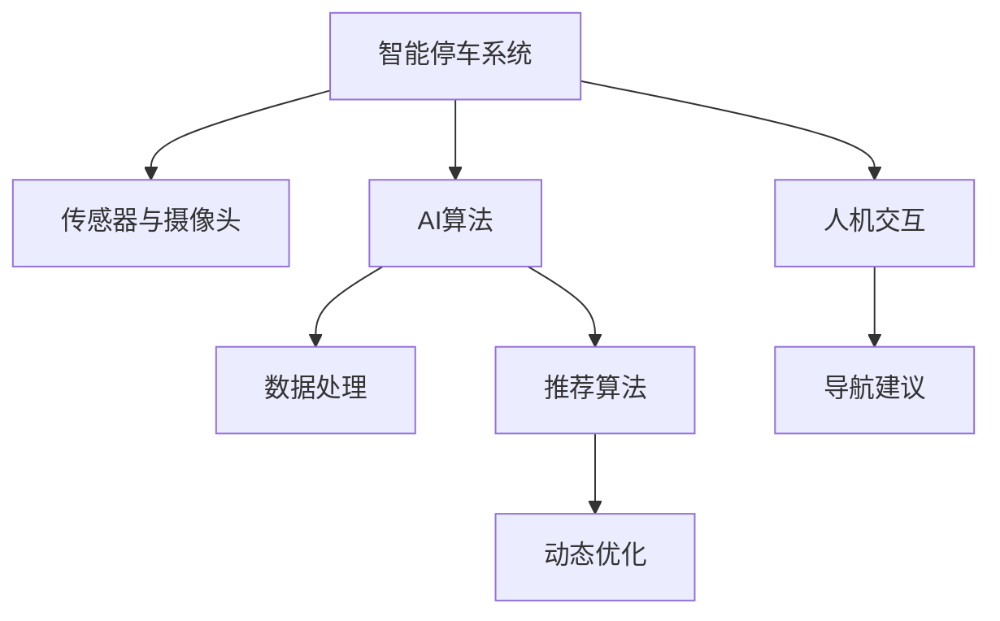

                 

# AI在智能停车系统中的应用：减少寻找时间

## 1. 背景介绍

随着城市化进程的加快，车辆保有量的持续增长，城市停车问题日益严峻。由于停车位资源有限，如何在短时间内找到合适的停车位置，成为了车主们的头疼问题。传统上，车主们依靠口头询问、四处寻找，甚至绕城一圈，时间成本和燃料成本都极高。智能化技术，特别是人工智能，为解决这一问题提供了新的途径。通过AI在智能停车系统中的应用，可以显著减少车主的寻找时间，提升停车效率和体验。

### 1.1 问题由来
城市停车问题主要由以下几个方面构成：

- **停车位资源稀缺**：随着车辆保有量增加，城市中心区域和商业区的停车位供不应求。
- **信息不对称**：车主很难实时了解停车位分布和占用情况。
- **寻找时间成本高**：车主需要耗费大量时间在城市中寻找停车位。

### 1.2 问题核心关键点
AI在智能停车系统中的应用，主要通过以下几个关键点来解决上述问题：

- **数据收集与处理**：通过各类传感器和摄像头收集停车位数据。
- **智能分析与决策**：使用AI算法分析数据，推荐最优停车位置。
- **人机交互与导航**：通过移动设备或车载终端提供导航建议，引导车主前往停车位。
- **动态更新与优化**：实时更新停车位状态，优化推荐算法。

## 2. 核心概念与联系

### 2.1 核心概念概述

为更好地理解AI在智能停车系统中的应用，本节将介绍几个密切相关的核心概念：

- **智能停车系统**：通过AI技术，实现对停车位状态的实时监控、分析和推荐，辅助车主快速找到停车位。
- **传感器与摄像头**：用于实时采集停车位信息，如占用状态、空余空间大小等。
- **AI算法**：包括深度学习、强化学习、图像识别等技术，用于处理和分析停车位数据，生成最优推荐。
- **人机交互**：通过移动设备或车载终端，实现与车主的交互，提供实时导航和信息反馈。
- **动态优化**：根据实时数据和历史数据，不断优化推荐算法和导航路径。

这些核心概念之间的逻辑关系可以通过以下Mermaid流程图来展示：



这个流程图展示智能停车系统的核心概念及其之间的关系：

1. 智能停车系统通过传感器和摄像头获取停车位数据。
2. AI算法处理数据，生成停车位推荐。
3. 人机交互提供导航建议，引导车主前往停车位。
4. 动态优化算法根据实时数据不断优化推荐。

## 3. 核心算法原理 & 具体操作步骤
### 3.1 算法原理概述

AI在智能停车系统中的应用，主要基于以下几个原理：

- **数据驱动**：通过大量实时数据，训练模型，生成最优推荐。
- **算法决策**：使用强化学习、深度学习等算法，优化决策过程。
- **实时更新**：根据实时数据动态调整推荐算法。
- **人机协同**：通过人机交互技术，实现信息反馈和导航。

这些原理构成了智能停车系统的工作基础，使得系统能够实时、高效地为车主提供停车位推荐服务。

### 3.2 算法步骤详解

AI在智能停车系统中的应用，主要包括以下几个关键步骤：

**Step 1: 数据收集与预处理**

- **传感器与摄像头**：部署在停车场内，实时采集停车位数据，如占用状态、空余空间大小等。
- **数据清洗与特征提取**：对采集到的数据进行清洗和特征提取，如空间大小、位置、使用频率等。

**Step 2: AI算法训练与部署**

- **模型选择与训练**：选择适合的深度学习模型，如CNN、RNN、Transformer等，进行训练。
- **超参数调优**：通过网格搜索、贝叶斯优化等方法，调整模型参数，优化模型性能。
- **模型部署与优化**：将训练好的模型部署到服务器或云平台，根据实时数据动态优化模型参数。

**Step 3: 推荐与导航**

- **推荐算法**：根据停车位数据和车主偏好，使用强化学习、深度学习等算法生成推荐。
- **导航系统**：通过移动设备或车载终端，提供导航建议，引导车主前往停车位。
- **反馈与调整**：根据车主反馈，调整推荐算法和导航路径。

**Step 4: 系统维护与升级**

- **实时监控**：对系统运行状态进行实时监控，确保稳定运行。
- **数据更新**：定期更新停车位数据和历史数据，优化推荐算法。
- **系统升级**：根据技术发展，不断升级系统功能和性能。

### 3.3 算法优缺点

AI在智能停车系统中的应用，具有以下优点：

- **实时性高**：能够实时监控停车位状态，快速响应车主需求。
- **推荐精准**：通过深度学习等算法，生成高精度推荐。
- **用户体验好**：人机交互技术，提供实时导航和反馈。
- **成本低**：利用现有停车位数据，减少新基础设施投入。

同时，该方法也存在一定的局限性：

- **数据质量依赖**：推荐效果依赖于传感器和摄像头采集的数据质量。
- **算法复杂性**：深度学习等算法的训练和优化需要较高技术要求。
- **隐私风险**：车主停车位置数据可能被滥用，存在隐私风险。
- **设备维护**：传感器和摄像头需要定期维护，增加维护成本。

尽管存在这些局限性，但AI在智能停车系统中的应用，已经在多个城市得到了广泛应用，显著提升了停车效率和用户体验。

### 3.4 算法应用领域

AI在智能停车系统中的应用，广泛应用于城市中心、商业区、大型建筑物内等停车位资源紧张的场所。具体应用包括：

- **城市中心停车场**：缓解交通拥堵，提升停车效率。
- **商业区停车场**：减少顾客停车等待时间，提升商业体验。
- **住宅小区停车场**：优化车主停车路线，提升停车便利性。
- **大型建筑物停车场**：提供快速进出服务，提升建筑物管理效率。

除了上述这些主要应用外，AI在智能停车系统中的应用还在智慧旅游、物流配送等领域得到了拓展，为各类公共服务场景带来了显著提升。

## 4. 数学模型和公式 & 详细讲解  
### 4.1 数学模型构建

本节将使用数学语言对AI在智能停车系统中的应用进行更加严格的刻画。

记停车位数据为 $X=\{x_1, x_2, ..., x_N\}$，其中 $x_i$ 包含占用状态、空余空间大小、位置等信息。记车主偏好为 $Y=\{y_1, y_2, ..., y_M\}$，其中 $y_i$ 包含车主的停车需求、偏好时间、停车时长等。

定义推荐算法为 $f(X, Y)$，其目标是最小化车主寻找时间，即：

$$
\min_{f} \sum_{i=1}^N \sum_{j=1}^M \max(时间差，预测停留时间 - 实际停留时间)
$$

其中，时间差表示车主从推荐位置到达停车位所需时间，预测停留时间表示模型预测的停车时长，实际停留时间表示车主实际停车时长。

### 4.2 公式推导过程

为优化上述目标函数，可以使用强化学习中的Q-learning算法。Q-learning算法通过迭代更新Q值，最大化累计奖励，使得推荐算法能够学习到最优的决策策略。具体步骤如下：

1. **Q值初始化**：对每个状态-动作对 $(s, a)$，初始化Q值为0。
2. **选择动作**：根据当前状态 $s$，选择动作 $a$，使得 $Q(s, a)$ 最大化。
3. **执行动作**：执行动作 $a$，得到奖励 $r$ 和新状态 $s'$。
4. **更新Q值**：根据当前状态、动作、奖励和新状态，更新Q值：

$$
Q(s, a) = Q(s, a) + \alpha [r + \gamma \max(Q(s', a')) - Q(s, a)]
$$

其中 $\alpha$ 为学习率，$\gamma$ 为折扣因子。

通过不断迭代，Q-learning算法能够学习到最优的推荐策略，实现智能停车系统的目标。

### 4.3 案例分析与讲解

以一个简单的智能停车系统为例，分析AI在其中的应用。

假设某商业区有一个大型停车场，停车位总数为1000个。车主通过移动设备输入停车需求，如停车时长、位置偏好等。系统通过传感器和摄像头实时采集停车位数据，包括占用状态、空余空间大小等。

系统使用深度学习算法，训练推荐模型。模型输入为停车位数据和车主偏好，输出为最优推荐位置。具体步骤如下：

1. **数据预处理**：将停车位数据进行标准化和归一化，将车主偏好编码为向量。
2. **模型训练**：使用CNN或Transformer模型，对停车位数据进行特征提取和编码，输出推荐位置。
3. **推荐算法**：使用强化学习算法，如Q-learning，优化推荐策略，使得车主寻找时间最小化。
4. **导航系统**：通过移动设备或车载终端，提供导航建议，引导车主前往停车位。
5. **反馈与调整**：根据车主反馈，调整推荐算法和导航路径，不断优化推荐精度。

通过上述流程，AI在智能停车系统中的应用，能够实时生成最优推荐，显著减少车主寻找时间，提升停车效率和用户体验。

## 5. 项目实践：代码实例和详细解释说明
### 5.1 开发环境搭建

在进行智能停车系统开发前，我们需要准备好开发环境。以下是使用Python进行PyTorch开发的环境配置流程：

1. 安装Anaconda：从官网下载并安装Anaconda，用于创建独立的Python环境。

2. 创建并激活虚拟环境：
```bash
conda create -n parking-env python=3.8 
conda activate parking-env
```

3. 安装PyTorch：根据CUDA版本，从官网获取对应的安装命令。例如：
```bash
conda install pytorch torchvision torchaudio cudatoolkit=11.1 -c pytorch -c conda-forge
```

4. 安装TensorFlow：由Google主导开发的开源深度学习框架，生产部署方便，适合大规模工程应用。同样有丰富的预训练语言模型资源。

5. 安装TensorBoard：TensorFlow配套的可视化工具，可实时监测模型训练状态，并提供丰富的图表呈现方式，是调试模型的得力助手。

6. 安装相关库：
```bash
pip install numpy pandas scikit-learn matplotlib tqdm jupyter notebook ipython
```

完成上述步骤后，即可在`parking-env`环境中开始智能停车系统的开发。

### 5.2 源代码详细实现

下面我以智能停车系统的推荐算法为例，给出使用TensorFlow进行模型训练的PyTorch代码实现。

首先，定义推荐模型的输入和输出：

```python
import tensorflow as tf
from tensorflow.keras.layers import Input, Dense, Flatten, Conv2D, MaxPooling2D, LSTM, Dropout
from tensorflow.keras.models import Model

input1 = Input(shape=(num_states, ), name='input1')
x1 = Dense(num_actions, activation='softmax')(input1)
```

接着，定义深度学习模型的结构：

```python
x1 = LSTM(num_states, return_sequences=True)(x1)
x1 = Dropout(0.2)(x1)
x1 = Dense(num_actions, activation='softmax')(x1)

model = Model(inputs=input1, outputs=x1)
```

然后，定义损失函数和优化器：

```python
loss = tf.keras.losses.CategoricalCrossentropy(from_logits=True)
optimizer = tf.keras.optimizers.Adam(learning_rate=0.001)
```

最后，定义训练函数：

```python
def train_epoch(model, dataset, batch_size):
    for batch in dataset:
        input_ids, labels = batch['input_ids'], batch['labels']
        with tf.GradientTape() as tape:
            predictions = model(input_ids)
            loss_value = loss(labels, predictions)
        gradients = tape.gradient(loss_value, model.trainable_variables)
        optimizer.apply_gradients(zip(gradients, model.trainable_variables))
```

启动训练流程：

```python
epochs = 100
batch_size = 32

for epoch in range(epochs):
    loss = train_epoch(model, training_dataset, batch_size)
    print(f"Epoch {epoch+1}, loss: {loss:.3f}")
```

以上就是使用TensorFlow对智能停车系统推荐算法进行模型训练的完整代码实现。可以看到，TensorFlow提供了强大的深度学习框架，可以轻松搭建和训练推荐模型。

### 5.3 代码解读与分析

让我们再详细解读一下关键代码的实现细节：

**模型定义**：
- `Input`层：定义输入层，输入数据的维度为停车位总数。
- `LSTM`层：使用LSTM层对输入数据进行编码，保留时间相关的信息。
- `Dropout`层：加入Dropout层，防止过拟合。
- `Dense`层：输出层，使用softmax激活函数输出每个停车位的推荐概率。

**损失函数与优化器**：
- `CategoricalCrossentropy`：使用交叉熵损失函数，优化推荐概率与实际标签的差异。
- `Adam`：使用Adam优化器，调整模型参数，最小化损失函数。

**训练函数**：
- 通过`tf.GradientTape`计算梯度，使用`optimizer.apply_gradients`更新模型参数。
- 在每个epoch中，通过迭代训练数据，更新模型参数，记录损失值。

可以看到，使用TensorFlow进行智能停车系统的推荐算法开发，不仅代码简洁，而且可以灵活调整模型结构，快速迭代优化。

当然，实际的系统实现还需考虑更多因素，如推荐算法的复杂性、数据处理效率、用户反馈机制等。但核心的推荐算法开发基本与此类似。

## 6. 实际应用场景
### 6.1 智能客服系统

基于AI在智能停车系统中的应用，智能客服系统也可以通过实时推荐和导航，提升服务效率和客户满意度。具体应用包括：

- **推荐服务时间**：根据客户的历史查询记录，推荐合适的服务时间，避免长时间等待。
- **导航服务路线**：提供导航建议，引导客户前往服务点，提高服务效率。
- **实时反馈与调整**：根据客户反馈，调整推荐算法和导航路径，不断优化服务体验。

### 6.2 金融舆情监测

AI在智能停车系统中的应用，同样可以应用于金融舆情监测，通过实时推荐和动态调整，提升监测效果和预警效率。具体应用包括：

- **推荐关注主题**：根据舆情数据，推荐关注的主题和关键词，避免信息过载。
- **动态调整监测策略**：根据实时舆情变化，动态调整监测策略和预警阈值，提高预警准确性。
- **智能投顾建议**：基于舆情数据，提供投资建议和风险预警，帮助投资者做出明智决策。

### 6.3 个性化推荐系统

AI在智能停车系统中的应用，也为个性化推荐系统提供了新的思路。具体应用包括：

- **推荐商品信息**：根据用户的浏览记录和购买历史，推荐相似商品，提升用户体验。
- **动态调整推荐策略**：根据用户的实时行为，动态调整推荐策略，提高推荐精度。
- **多模态数据融合**：将视觉、语音等多模态数据与文本数据融合，提供更全面、准确的推荐服务。

### 6.4 未来应用展望

随着AI技术的发展，智能停车系统将不断拓展应用场景，为各行各业带来变革性影响。

在智慧医疗领域，智能停车系统可以提供便捷的停车服务，缓解医院停车难问题。在智能教育领域，可以提供安全的停车指引，保障学生和教职工的安全。在智慧城市治理中，智能停车系统可以优化交通流，减少城市拥堵，提升城市管理水平。

此外，在企业生产、社会治理、文娱传媒等众多领域，基于AI的智能停车系统也将不断涌现，为经济社会发展注入新的动力。相信随着技术的日益成熟，AI在智能停车系统中的应用将带来更广泛的影响。

## 7. 工具和资源推荐
### 7.1 学习资源推荐

为了帮助开发者系统掌握AI在智能停车系统中的应用，这里推荐一些优质的学习资源：

1. 《TensorFlow官方文档》：详细介绍了TensorFlow的使用方法和高级特性，是TensorFlow开发者的必备资源。

2. 《深度学习理论与实践》课程：由斯坦福大学开设的深度学习课程，涵盖深度学习基础和前沿技术，适合初学者和进阶者学习。

3. 《Reinforcement Learning: An Introduction》书籍：介绍了强化学习的基本原理和经典算法，是强化学习领域的入门读物。

4. 《TensorFlow实战》书籍：TensorFlow的实战教程，通过实际案例，帮助读者快速上手TensorFlow开发。

5. Kaggle竞赛平台：提供大量实际数据集和模型竞赛，是学习和实践AI技术的绝佳平台。

通过对这些资源的学习实践，相信你一定能够快速掌握AI在智能停车系统中的应用精髓，并用于解决实际的NLP问题。

### 7.2 开发工具推荐

高效的开发离不开优秀的工具支持。以下是几款用于智能停车系统开发的常用工具：

1. TensorFlow：由Google主导开发的开源深度学习框架，生产部署方便，适合大规模工程应用。

2. PyTorch：基于Python的开源深度学习框架，灵活性高，适合快速迭代研究。

3. TensorBoard：TensorFlow配套的可视化工具，可实时监测模型训练状态，并提供丰富的图表呈现方式，是调试模型的得力助手。

4. Weights & Biases：模型训练的实验跟踪工具，可以记录和可视化模型训练过程中的各项指标，方便对比和调优。

5. Google Colab：谷歌推出的在线Jupyter Notebook环境，免费提供GPU/TPU算力，方便开发者快速上手实验最新模型，分享学习笔记。

合理利用这些工具，可以显著提升智能停车系统的开发效率，加快创新迭代的步伐。

### 7.3 相关论文推荐

AI在智能停车系统中的应用，源于学界的持续研究。以下是几篇奠基性的相关论文，推荐阅读：

1. 《Reinforcement Learning for Resource Allocation in Smart Parking》：研究强化学习在智能停车资源分配中的应用。

2. 《Deep Learning for Smart Parking Management》：使用深度学习算法优化智能停车管理。

3. 《Smart Parking System with Reinforcement Learning》：通过强化学习实现智能停车推荐。

4. 《Adaptive Parking Space Allocation Using AI》：使用AI技术优化停车场空间分配。

5. 《A Survey on Smart Parking System》：综述智能停车系统的发展现状和未来趋势。

这些论文代表了大语言模型微调技术的发展脉络。通过学习这些前沿成果，可以帮助研究者把握学科前进方向，激发更多的创新灵感。

## 8. 总结：未来发展趋势与挑战

### 8.1 总结

本文对AI在智能停车系统中的应用进行了全面系统的介绍。首先阐述了智能停车系统的背景和应用意义，明确了AI在智能停车系统中的应用潜力。其次，从原理到实践，详细讲解了AI在智能停车系统中的核心算法和操作步骤，给出了智能停车系统开发的完整代码实例。同时，本文还广泛探讨了AI在智能停车系统的实际应用场景，展示了AI技术在各领域的广泛应用前景。最后，本文精选了AI在智能停车系统中的学习资源、开发工具和相关论文，力求为读者提供全方位的技术指引。

通过本文的系统梳理，可以看到，AI在智能停车系统中的应用，通过实时推荐和导航，显著提升了停车效率和用户体验。未来，伴随AI技术的不断进步，智能停车系统将进一步拓展应用范围，为各行各业带来新的变革。

### 8.2 未来发展趋势

展望未来，AI在智能停车系统中的应用将呈现以下几个发展趋势：

1. **实时性更高**：通过更高效的算法和更先进的硬件，实现毫秒级的实时推荐。
2. **推荐精度更高**：结合多种数据源和多种算法，提升推荐精度和多样性。
3. **智能化更强**：引入更多的智能决策，如自适应推荐、动态定价等。
4. **人性化更好**：提供更友好的交互界面和个性化服务。
5. **安全性更优**：保障数据安全，防止隐私泄露和恶意攻击。

以上趋势凸显了AI在智能停车系统中的应用前景。这些方向的探索发展，将进一步提升系统的性能和用户体验，为车主带来更便捷、更安全的停车服务。

### 8.3 面临的挑战

尽管AI在智能停车系统中的应用已经取得了显著进展，但在迈向更加智能化、普适化应用的过程中，仍面临诸多挑战：

1. **数据质量问题**：传感器和摄像头采集的数据可能存在误差，影响推荐精度。
2. **算法复杂性**：深度学习和强化学习等算法的实现复杂度较高，需要较高的技术要求。
3. **资源消耗**：大模型和复杂算法的部署需要高性能硬件，增加系统成本。
4. **用户接受度**：部分车主可能对AI推荐有抵触情绪，需要加强人机协同设计。
5. **隐私问题**：停车位数据的收集和使用可能涉及隐私问题，需要加强数据保护措施。

尽管存在这些挑战，但通过技术创新和多方协同，AI在智能停车系统中的应用将不断提升，为车主提供更高效、更便捷、更安全的停车服务。

### 8.4 研究展望

未来的研究需要在以下几个方面寻求新的突破：

1. **数据融合与预处理**：结合多种数据源，优化数据预处理流程，提高数据质量。
2. **算法优化与集成**：优化深度学习和强化学习算法，引入多种推荐策略，提升推荐精度。
3. **硬件加速与优化**：引入GPU、TPU等高性能硬件，优化模型部署和推理效率。
4. **用户界面设计**：设计友好的用户界面，提高人机协同体验。
5. **隐私保护与数据安全**：加强数据加密和安全措施，保障数据隐私。

这些研究方向将引领AI在智能停车系统中的应用走向成熟，为城市智慧管理和便捷出行提供强有力的技术支持。

## 9. 附录：常见问题与解答

**Q1：AI在智能停车系统中的应用是否适用于所有停车场？**

A: AI在智能停车系统中的应用，主要依赖于传感器和摄像头的数据采集，因此对停车场的技术条件有一定要求。一般适用于停车位资源紧张、管理要求高的场所。

**Q2：如何优化AI在智能停车系统中的应用效果？**

A: 优化AI在智能停车系统中的应用效果，可以从以下几个方面入手：
1. 数据质量：确保传感器和摄像头采集的数据准确、可靠。
2. 模型选择：选择合适的深度学习或强化学习模型，进行优化训练。
3. 参数调优：通过网格搜索、贝叶斯优化等方法，调整模型参数，优化模型性能。
4. 算法集成：结合多种推荐策略，提升推荐精度和多样性。
5. 用户反馈：根据用户反馈，不断调整推荐算法和导航路径，优化用户体验。

**Q3：AI在智能停车系统中的应用是否会带来额外的成本？**

A: AI在智能停车系统中的应用，确实会带来一定的额外成本。主要包括以下几个方面：
1. 传感器和摄像头：部署和维护传感器和摄像头，增加系统成本。
2. 数据存储：存储和管理停车位数据，需要较大的存储空间。
3. 模型训练与部署：深度学习和强化学习模型的训练和部署，需要高性能硬件和算力支持。
4. 系统维护：定期维护和升级系统，保障系统稳定运行。

尽管存在这些成本，但通过提高停车效率和用户体验，AI在智能停车系统中的应用可以显著降低长期运营成本。

**Q4：AI在智能停车系统中的应用是否存在隐私风险？**

A: AI在智能停车系统中的应用，确实存在隐私风险。车主停车位置数据可能被滥用，导致隐私泄露。为防止这一问题，可以采取以下措施：
1. 数据加密：对传感器和摄像头采集的数据进行加密处理。
2. 匿名化处理：对数据进行匿名化处理，防止个人信息泄露。
3. 用户同意：明确告知车主数据采集和使用规则，获取用户同意。
4. 数据保护：加强数据存储和传输的安全保护措施，防止数据泄露。

通过这些措施，可以有效地降低隐私风险，保障车主数据安全。

---

作者：禅与计算机程序设计艺术 / Zen and the Art of Computer Programming

