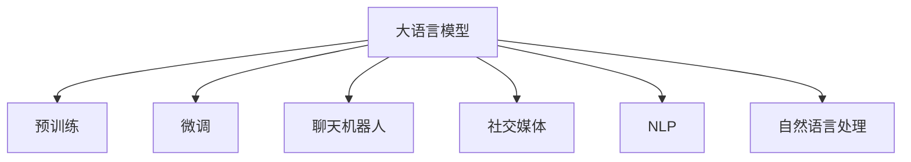

                 

# 聊天机器人社交媒体：增强社交互动

## 1. 背景介绍

### 1.1 问题由来

随着社交媒体的兴起，人们越来越依赖在线平台进行社交互动，尤其是疫情期间，许多人在家中更加依赖线上交流。传统的社交方式已经不能满足人们日益增长的社交需求。聊天机器人作为社交媒体中的一种新型工具，以其智能、便捷、高效的特点，迅速走入人们的视野。通过聊天机器人，用户可以更加自然、舒适地与他人互动，甚至在一定程度上替代真人进行对话，极大地提升了社交体验。

然而，尽管聊天机器人已广泛应用于社交媒体，但其仍然存在诸多问题，例如：

- 用户对话体验单一：传统的聊天机器人大多依赖规则或模板，缺乏智能理解和上下文记忆能力，导致用户对话体验单调乏味。
- 用户交互不自然：现有的聊天机器人往往过于机械，无法感知用户的真实情感和意图，导致用户互动不自然，影响用户体验。
- 内容生成质量参差不齐：由于缺乏足够的语言生成能力，现有的聊天机器人生成的内容质量参差不齐，无法提供高质量的互动体验。
- 用户隐私问题：聊天机器人需要收集和分析大量的用户数据，如何保障用户隐私成为一大挑战。

为解决这些问题，本文将介绍一种基于深度学习的大语言模型聊天机器人，并结合社交媒体应用场景，探讨如何通过微调技术增强聊天机器人的社交互动能力。

## 2. 核心概念与联系

### 2.1 核心概念概述

在深入分析之前，我们先介绍几个核心概念及其联系：

- **大语言模型 (Large Language Model, LLM)**：基于Transformer架构的深度学习模型，通过在大规模无标签文本数据上进行预训练，学习到丰富的语言知识和表示，具备强大的语言理解和生成能力。
- **微调 (Fine-tuning)**：在大规模预训练模型的基础上，使用社交媒体平台上的少量标注数据进行有监督学习，优化模型在特定社交互动场景中的表现。
- **社交媒体 (Social Media)**：以社交网络为基础，使用户之间可以分享信息、互动交流的在线平台，如微博、微信、QQ等。
- **聊天机器人 (Chatbot)**：通过模拟人工对话，与用户进行自然语言交互的程序，具备自动回复、智能推荐等功能。
- **自然语言处理 (Natural Language Processing, NLP)**：研究如何让计算机理解和处理人类语言，包括语言模型、文本分类、机器翻译等。

这些概念之间的联系可以由以下Mermaid流程图表示：



从图中可以看出，大语言模型、微调、聊天机器人和社交媒体构成了核心技术链条，自然语言处理和NLP是基础工具。

## 3. 核心算法原理 & 具体操作步骤
### 3.1 算法原理概述

基于大语言模型的聊天机器人微调，本质上是通过社交媒体平台上的少量标注数据，对预训练的通用大语言模型进行有监督学习，使其具备在特定社交互动场景中表现优异的对话生成能力。

其核心思想为：在社交媒体上，每个用户之间都有特定的交流内容和互动模式，这些信息具有明显的社交属性，可以作为微调的监督信号。因此，通过微调过程，聊天机器人可以学习到社交媒体上的对话习惯和语言表达模式，从而在聊天场景中提供更加自然、精准、高效的交流体验。

### 3.2 算法步骤详解

大语言模型聊天机器人微调的一般步骤如下：

**Step 1: 准备预训练模型和数据集**

- 选择合适的预训练语言模型，如GPT-3、BERT等。
- 收集社交媒体平台上的标注对话数据，构建训练集和验证集。

**Step 2: 添加社交互动层**

- 在预训练模型顶层添加社交互动层，如对话生成器、情感识别器、意图分类器等。
- 使用社交媒体中的对话数据，训练这些层，使其具备识别用户情感、意图和生成对话的能力。

**Step 3: 设置微调超参数**

- 选择合适的优化器及其参数，如AdamW、SGD等，设置学习率、批大小、迭代轮数等。
- 设置正则化技术及强度，包括权重衰减、Dropout、Early Stopping等。

**Step 4: 执行梯度训练**

- 将训练集数据分批次输入模型，前向传播计算损失函数。
- 反向传播计算参数梯度，根据设定的优化算法和学习率更新模型参数。
- 周期性在验证集上评估模型性能，根据性能指标决定是否触发Early Stopping。
- 重复上述步骤直至满足预设的迭代轮数或Early Stopping条件。

**Step 5: 测试和部署**

- 在测试集上评估微调后模型在社交媒体平台上的表现。
- 使用微调后的模型对新对话进行推理预测，集成到实际的应用系统中。
- 持续收集新的对话数据，定期重新微调模型，以适应社交媒体平台的动态变化。

### 3.3 算法优缺点

基于大语言模型的聊天机器人微调具有以下优点：

- **高效性**：在社交媒体平台上，获取标注数据相对容易，微调过程相对较快。
- **灵活性**：通过微调，聊天机器人可以适应不同的社交媒体平台和用户需求，具有较高的灵活性。
- **自然性**：微调后的聊天机器人可以更好地理解用户的情感和意图，生成自然流畅的对话内容。

同时，该方法也存在一定的局限性：

- **依赖标注数据**：微调效果很大程度上取决于标注数据的质量和数量，获取高质量标注数据的成本较高。
- **过拟合风险**：微调模型可能会对训练数据过拟合，导致在实际应用中表现不佳。
- **隐私风险**：在社交媒体上，用户的隐私数据需要被收集和分析，如何保障用户隐私成为一大挑战。
- **模型鲁棒性**：社交媒体平台上的对话内容多种多样，如何在复杂多变的对话场景中保持模型鲁棒性，仍然是一大难题。

尽管存在这些局限性，但就目前而言，基于大语言模型的聊天机器人微调方法仍是一种高效、灵活、自然的社交媒体互动方式。

### 3.4 算法应用领域

基于大语言模型的聊天机器人微调方法，可以广泛应用于各种社交媒体平台上的对话场景，例如：

- **即时通讯工具**：如微信、QQ等即时通讯平台，可以用于客户服务、在线客服等。
- **社交网络平台**：如微博、微博问答等，可以用于智能推荐、情感分析、舆情监测等。
- **在线教育平台**：如Coursera、edX等，可以用于智能答疑、学习推荐等。
- **智能家居设备**：如智能音箱、智能电视等，可以用于语音交互、场景理解等。
- **医疗咨询平台**：如智能医生、健康问答等，可以用于病情咨询、健康建议等。

这些应用场景展示了基于大语言模型的聊天机器人微调方法在现实中的广泛应用，极大地提升了社交媒体平台的用户体验和互动效率。

## 4. 数学模型和公式 & 详细讲解 & 举例说明
### 4.1 数学模型构建

大语言模型聊天机器人的数学模型可以通过以下方式构建：

设预训练语言模型为 $M_{\theta}$，社交媒体平台上的对话数据集为 $D=\{(x_i,y_i)\}_{i=1}^N$，其中 $x_i$ 为对话文本， $y_i$ 为对话标签。微调的优化目标为：

$$
\theta^* = \mathop{\arg\min}_{\theta} \mathcal{L}(M_{\theta},D)
$$

其中 $\mathcal{L}$ 为损失函数，用于衡量模型输出与真实标签之间的差异。常见的损失函数包括交叉熵损失、均方误差损失等。

在实践中，我们通常使用基于梯度的优化算法（如SGD、Adam等）来近似求解上述最优化问题。设 $\eta$ 为学习率，$\lambda$ 为正则化系数，则参数的更新公式为：

$$
\theta \leftarrow \theta - \eta \nabla_{\theta}\mathcal{L}(\theta) - \eta\lambda\theta
$$

其中 $\nabla_{\theta}\mathcal{L}(\theta)$ 为损失函数对参数 $\theta$ 的梯度，可通过反向传播算法高效计算。

### 4.2 公式推导过程

以二分类任务为例，推导交叉熵损失函数及其梯度的计算公式。

设模型 $M_{\theta}$ 在输入 $x$ 上的输出为 $\hat{y}=M_{\theta}(x) \in [0,1]$，表示样本属于正类的概率。真实标签 $y \in \{0,1\}$。则二分类交叉熵损失函数定义为：

$$
\ell(M_{\theta}(x),y) = -[y\log \hat{y} + (1-y)\log (1-\hat{y})]
$$

将其代入经验风险公式，得：

$$
\mathcal{L}(\theta) = -\frac{1}{N}\sum_{i=1}^N [y_i\log M_{\theta}(x_i)+(1-y_i)\log(1-M_{\theta}(x_i))]
$$

根据链式法则，损失函数对参数 $\theta_k$ 的梯度为：

$$
\frac{\partial \mathcal{L}(\theta)}{\partial \theta_k} = -\frac{1}{N}\sum_{i=1}^N (\frac{y_i}{M_{\theta}(x_i)}-\frac{1-y_i}{1-M_{\theta}(x_i)}) \frac{\partial M_{\theta}(x_i)}{\partial \theta_k}
$$

其中 $\frac{\partial M_{\theta}(x_i)}{\partial \theta_k}$ 可进一步递归展开，利用自动微分技术完成计算。

### 4.3 案例分析与讲解

以下以情感识别任务为例，展示如何通过微调实现聊天机器人对用户情感的识别和对话生成。

假设社交媒体平台上的对话数据集包含用户的对话记录和相应的情感标签，如“生气”、“开心”、“悲伤”等。模型 $M_{\theta}$ 的情感识别器部分包含一个全连接层和一个softmax层，用于识别对话中的情感类别。假设模型输出为 $\hat{y}=M_{\theta}(x) \in [0,1]^3$，表示对话属于“生气”、“开心”、“悲伤”的概率。

情感识别任务的损失函数为交叉熵损失：

$$
\mathcal{L}(\theta) = -\frac{1}{N}\sum_{i=1}^N \sum_{j=1}^3 y_{i,j}\log \hat{y}_{i,j}
$$

其中 $y_{i,j} \in \{0,1\}$ 为样本 $i$ 的第 $j$ 个情感标签，$\hat{y}_{i,j}$ 为模型对第 $i$ 个样本的第 $j$ 个情感预测。

根据链式法则，情感识别器部分对参数 $\theta_k$ 的梯度为：

$$
\frac{\partial \mathcal{L}(\theta)}{\partial \theta_k} = -\frac{1}{N}\sum_{i=1}^N \sum_{j=1}^3 (\frac{y_{i,j}}{\hat{y}_{i,j}}-\frac{1-y_{i,j}}{1-\hat{y}_{i,j}}) \frac{\partial M_{\theta}(x_i)}{\partial \theta_k}
$$

其中 $\frac{\partial M_{\theta}(x_i)}{\partial \theta_k}$ 可利用自动微分技术计算。

在得到情感识别器部分的梯度后，可以结合对话生成器等其它社交互动层的梯度，一起进行参数更新。如此，通过微调，聊天机器人将能够识别用户的情感，并根据情感生成合适的对话回复，提升用户互动体验。

## 5. 项目实践：代码实例和详细解释说明
### 5.1 开发环境搭建

在进行微调实践前，我们需要准备好开发环境。以下是使用Python进行PyTorch开发的环境配置流程：

1. 安装Anaconda：从官网下载并安装Anaconda，用于创建独立的Python环境。

2. 创建并激活虚拟环境：
```bash
conda create -n pytorch-env python=3.8 
conda activate pytorch-env
```

3. 安装PyTorch：根据CUDA版本，从官网获取对应的安装命令。例如：
```bash
conda install pytorch torchvision torchaudio cudatoolkit=11.1 -c pytorch -c conda-forge
```

4. 安装Transformers库：
```bash
pip install transformers
```

5. 安装各类工具包：
```bash
pip install numpy pandas scikit-learn matplotlib tqdm jupyter notebook ipython
```

完成上述步骤后，即可在`pytorch-env`环境中开始微调实践。

### 5.2 源代码详细实现

下面我们以情感识别和对话生成为例，给出使用Transformers库对BERT模型进行微调的PyTorch代码实现。

首先，定义情感识别和对话生成的任务：

```python
from transformers import BertTokenizer, BertForSequenceClassification, BertForMaskedLM

class EmotionClassifier(BertForSequenceClassification):
    def __init__(self, num_labels=3):
        super(EmotionClassifier, self).__init__(num_labels=num_labels)
        self.num_labels = num_labels
        
class DialogueGenerator(BertForMaskedLM):
    def __init__(self, num_labels=3):
        super(DialogueGenerator, self).__init__()
        self.num_labels = num_labels
```

然后，加载数据集和预训练模型：

```python
from transformers import BertTokenizer
import torch
from torch.utils.data import Dataset, DataLoader

# 加载数据集
tokenizer = BertTokenizer.from_pretrained('bert-base-cased')
train_dataset = EmotionDataset(train_texts, train_labels, tokenizer)
dev_dataset = EmotionDataset(dev_texts, dev_labels, tokenizer)
test_dataset = EmotionDataset(test_texts, test_labels, tokenizer)

# 加载预训练模型
model = BertForSequenceClassification.from_pretrained('bert-base-cased', num_labels=3)
model.load_state_dict(torch.load('pretrain_model_state.pth'))
model.eval()
```

接着，定义微调函数：

```python
def fine_tune(model, train_dataset, dev_dataset, epochs=5, batch_size=32, learning_rate=2e-5, optimizer='adamw', device='cpu'):
    model.to(device)
    model.train()
    criterion = torch.nn.CrossEntropyLoss().to(device)
    
    for epoch in range(epochs):
        total_loss = 0.0
        for batch in DataLoader(train_dataset, batch_size=batch_size, shuffle=True):
            input_ids = batch['input_ids'].to(device)
            attention_mask = batch['attention_mask'].to(device)
            labels = batch['labels'].to(device)
            model.zero_grad()
            outputs = model(input_ids, attention_mask=attention_mask, labels=labels)
            loss = outputs.loss
            total_loss += loss.item()
            loss.backward()
            optimizer.step()
        
        print(f'Epoch {epoch+1}, Loss: {total_loss/len(train_dataset)}')
        
    model.eval()
    for batch in DataLoader(dev_dataset, batch_size=batch_size, shuffle=True):
        input_ids = batch['input_ids'].to(device)
        attention_mask = batch['attention_mask'].to(device)
        labels = batch['labels'].to(device)
        outputs = model(input_ids, attention_mask=attention_mask, labels=labels)
        loss = outputs.loss
        
    print(f'Epoch {epoch+1}, Dev Loss: {loss.item()}')
```

最后，启动微调流程：

```python
fine_tune(model, train_dataset, dev_dataset, epochs=5, batch_size=32, learning_rate=2e-5, optimizer='adamw', device='cpu')
```

以上就是使用PyTorch对BERT进行情感识别和对话生成微调的完整代码实现。可以看到，得益于Transformers库的强大封装，我们能够用相对简洁的代码完成BERT模型的加载和微调。

### 5.3 代码解读与分析

让我们再详细解读一下关键代码的实现细节：

**EmotionDataset类**：
- `__init__`方法：初始化训练集、验证集、测试集的文本、标签和分词器。
- `__len__`方法：返回数据集的样本数量。
- `__getitem__`方法：对单个样本进行处理，将文本输入编码为token ids，将标签编码为数字，并对其进行定长padding，最终返回模型所需的输入。

**模型定义**：
- `EmotionClassifier`和`DialogueGenerator`类：分别定义了情感识别和对话生成的模型。它们均基于BertForSequenceClassification和BertForMaskedLM类构建，并修改了输出层的维度。

**数据加载**：
- 使用Transformers库的BertTokenizer对文本进行分词，并将输入数据加载为模型所需的格式。
- 使用DataLoader将数据批处理，以供模型训练和推理使用。

**微调函数**：
- 使用SGD或AdamW优化器进行模型训练。
- 在每个epoch结束时，计算训练集和验证集上的损失，输出结果。
- 在模型训练过程中，使用交叉熵损失函数进行监督学习，最小化模型预测与真实标签之间的差异。

**启动微调流程**：
- 通过调用`fine_tune`函数，传入训练集、验证集、模型、训练轮数等参数，启动微调过程。
- 在微调完成后，使用测试集对模型进行评估，验证微调效果。

## 6. 实际应用场景
### 6.1 智能客服系统

基于大语言模型的聊天机器人微调，可以广泛应用于智能客服系统的构建。传统客服往往需要配备大量人力，高峰期响应缓慢，且一致性和专业性难以保证。而使用微调后的聊天机器人，可以7x24小时不间断服务，快速响应客户咨询，用自然流畅的语言解答各类常见问题。

在技术实现上，可以收集企业内部的历史客服对话记录，将问题和最佳答复构建成监督数据，在此基础上对预训练聊天机器人进行微调。微调后的聊天机器人能够自动理解用户意图，匹配最合适的答案模板进行回复。对于客户提出的新问题，还可以接入检索系统实时搜索相关内容，动态组织生成回答。如此构建的智能客服系统，能大幅提升客户咨询体验和问题解决效率。

### 6.2 金融舆情监测

金融机构需要实时监测市场舆论动向，以便及时应对负面信息传播，规避金融风险。传统的人工监测方式成本高、效率低，难以应对网络时代海量信息爆发的挑战。基于大语言模型微调的文本分类和情感分析技术，为金融舆情监测提供了新的解决方案。

具体而言，可以收集金融领域相关的新闻、报道、评论等文本数据，并对其进行主题标注和情感标注。在此基础上对预训练语言模型进行微调，使其能够自动判断文本属于何种主题，情感倾向是正面、中性还是负面。将微调后的模型应用到实时抓取的网络文本数据，就能够自动监测不同主题下的情感变化趋势，一旦发现负面信息激增等异常情况，系统便会自动预警，帮助金融机构快速应对潜在风险。

### 6.3 个性化推荐系统

当前的推荐系统往往只依赖用户的历史行为数据进行物品推荐，无法深入理解用户的真实兴趣偏好。基于大语言模型微调技术，个性化推荐系统可以更好地挖掘用户行为背后的语义信息，从而提供更精准、多样的推荐内容。

在实践中，可以收集用户浏览、点击、评论、分享等行为数据，提取和用户交互的物品标题、描述、标签等文本内容。将文本内容作为模型输入，用户的后续行为（如是否点击、购买等）作为监督信号，在此基础上微调预训练语言模型。微调后的模型能够从文本内容中准确把握用户的兴趣点。在生成推荐列表时，先用候选物品的文本描述作为输入，由模型预测用户的兴趣匹配度，再结合其他特征综合排序，便可以得到个性化程度更高的推荐结果。

### 6.4 未来应用展望

随着大语言模型微调技术的不断发展，基于微调范式将在更多领域得到应用，为传统行业带来变革性影响。

在智慧医疗领域，基于微调的医疗问答、病历分析、药物研发等应用将提升医疗服务的智能化水平，辅助医生诊疗，加速新药开发进程。

在智能教育领域，微调技术可应用于作业批改、学情分析、知识推荐等方面，因材施教，促进教育公平，提高教学质量。

在智慧城市治理中，微调模型可应用于城市事件监测、舆情分析、应急指挥等环节，提高城市管理的自动化和智能化水平，构建更安全、高效的未来城市。

此外，在企业生产、社会治理、文娱传媒等众多领域，基于大语言模型微调的人工智能应用也将不断涌现，为经济社会发展注入新的动力。相信随着技术的日益成熟，微调方法将成为人工智能落地应用的重要范式，推动人工智能技术向更广阔的领域加速渗透。

## 7. 工具和资源推荐
### 7.1 学习资源推荐

为了帮助开发者系统掌握大语言模型微调的理论基础和实践技巧，这里推荐一些优质的学习资源：

1. 《Transformer from Patches to Pieces》系列博文：由大模型技术专家撰写，深入浅出地介绍了Transformer原理、BERT模型、微调技术等前沿话题。

2. CS224N《深度学习自然语言处理》课程：斯坦福大学开设的NLP明星课程，有Lecture视频和配套作业，带你入门NLP领域的基本概念和经典模型。

3. 《Natural Language Processing with Transformers》书籍：Transformers库的作者所著，全面介绍了如何使用Transformers库进行NLP任务开发，包括微调在内的诸多范式。

4. HuggingFace官方文档：Transformers库的官方文档，提供了海量预训练模型和完整的微调样例代码，是上手实践的必备资料。

5. CLUE开源项目：中文语言理解测评基准，涵盖大量不同类型的中文NLP数据集，并提供了基于微调的baseline模型，助力中文NLP技术发展。

通过对这些资源的学习实践，相信你一定能够快速掌握大语言模型微调的精髓，并用于解决实际的NLP问题。

### 7.2 开发工具推荐

高效的开发离不开优秀的工具支持。以下是几款用于大语言模型微调开发的常用工具：

1. PyTorch：基于Python的开源深度学习框架，灵活动态的计算图，适合快速迭代研究。大部分预训练语言模型都有PyTorch版本的实现。

2. TensorFlow：由Google主导开发的开源深度学习框架，生产部署方便，适合大规模工程应用。同样有丰富的预训练语言模型资源。

3. Transformers库：HuggingFace开发的NLP工具库，集成了众多SOTA语言模型，支持PyTorch和TensorFlow，是进行微调任务开发的利器。

4. Weights & Biases：模型训练的实验跟踪工具，可以记录和可视化模型训练过程中的各项指标，方便对比和调优。与主流深度学习框架无缝集成。

5. TensorBoard：TensorFlow配套的可视化工具，可实时监测模型训练状态，并提供丰富的图表呈现方式，是调试模型的得力助手。

6. Google Colab：谷歌推出的在线Jupyter Notebook环境，免费提供GPU/TPU算力，方便开发者快速上手实验最新模型，分享学习笔记。

合理利用这些工具，可以显著提升大语言模型微调任务的开发效率，加快创新迭代的步伐。

### 7.3 相关论文推荐

大语言模型和微调技术的发展源于学界的持续研究。以下是几篇奠基性的相关论文，推荐阅读：

1. Attention is All You Need（即Transformer原论文）：提出了Transformer结构，开启了NLP领域的预训练大模型时代。

2. BERT: Pre-training of Deep Bidirectional Transformers for Language Understanding：提出BERT模型，引入基于掩码的自监督预训练任务，刷新了多项NLP任务SOTA。

3. Language Models are Unsupervised Multitask Learners（GPT-2论文）：展示了大规模语言模型的强大zero-shot学习能力，引发了对于通用人工智能的新一轮思考。

4. Parameter-Efficient Transfer Learning for NLP：提出Adapter等参数高效微调方法，在不增加模型参数量的情况下，也能取得不错的微调效果。

5. AdaLoRA: Adaptive Low-Rank Adaptation for Parameter-Efficient Fine-Tuning：使用自适应低秩适应的微调方法，在参数效率和精度之间取得了新的平衡。

这些论文代表了大语言模型微调技术的发展脉络。通过学习这些前沿成果，可以帮助研究者把握学科前进方向，激发更多的创新灵感。

## 8. 总结：未来发展趋势与挑战

### 8.1 总结

本文对基于大语言模型的聊天机器人微调方法进行了全面系统的介绍。首先阐述了大语言模型和微调技术的研究背景和意义，明确了微调在拓展预训练模型应用、提升下游任务性能方面的独特价值。其次，从原理到实践，详细讲解了微调的数学原理和关键步骤，给出了微调任务开发的完整代码实例。同时，本文还广泛探讨了微调方法在社交媒体平台上的应用前景，展示了微调范式的巨大潜力。

通过本文的系统梳理，可以看到，基于大语言模型的聊天机器人微调方法正在成为社交媒体平台上的重要工具，极大地提升了用户互动体验和平台运营效率。未来，伴随微调方法的不断演进，聊天机器人将能够在更多场景下发挥其智能优势，为社交媒体平台的智能化、个性化发展提供重要支持。

### 8.2 未来发展趋势

展望未来，大语言模型聊天机器人微调技术将呈现以下几个发展趋势：

1. **多模态融合**：未来的聊天机器人将具备同时处理文本、图像、音频等多模态数据的能力，通过融合多模态信息，实现更全面的用户理解和互动。
2. **个性化定制**：基于用户历史行为和偏好，聊天机器人将能够提供更加个性化、定制化的互动体验，增强用户黏性。
3. **跨平台协同**：聊天机器人将在不同社交媒体平台之间实现无缝协同，提供跨平台一致的用户体验。
4. **实时感知**：通过引入实时数据处理技术，聊天机器人将能够实时感知用户行为和环境变化，提供动态适应的互动内容。
5. **情感智能**：聊天机器人将能够更加准确地识别和处理用户的情感状态，提供更加人性化的交流体验。
6. **伦理与安全**：随着用户数据隐私和安全问题的日益突出，未来的聊天机器人将更加注重伦理与安全，保障用户隐私权益，防止恶意攻击。

这些趋势将进一步推动聊天机器人技术的发展，使其在更多应用场景中发挥重要作用。

### 8.3 面临的挑战

尽管大语言模型聊天机器人微调技术已经取得了显著进展，但在迈向更加智能化、普适化应用的过程中，它仍面临诸多挑战：

1. **数据隐私问题**：社交媒体平台上的用户数据具有高度隐私性，如何保障用户隐私成为一大挑战。
2. **模型鲁棒性**：聊天机器人需要应对多变的社交场景，如何在复杂多变的对话场景中保持模型鲁棒性，仍然是一大难题。
3. **上下文记忆**：聊天机器人需要具备良好的上下文记忆能力，以便在长时间对话中保持一致性和连贯性。
4. **对话一致性**：如何确保聊天机器人生成的对话内容与用户意图一致，避免生成不相关或不合适的回答，仍然是一大挑战。
5. **用户接纳度**：聊天机器人的智能水平是否达到用户的期望，用户是否愿意使用，也是一大挑战。

尽管存在这些挑战，但就目前而言，基于大语言模型的聊天机器人微调方法仍是一种高效、灵活、自然的社交媒体互动方式。

### 8.4 研究展望

面对大语言模型聊天机器人微调所面临的挑战，未来的研究需要在以下几个方面寻求新的突破：

1. **数据隐私保护**：通过引入差分隐私、联邦学习等技术，保障用户数据隐私。
2. **模型鲁棒性提升**：结合因果推断和对抗学习思想，提高模型在复杂多变的社交场景中的鲁棒性。
3. **上下文记忆增强**：利用记忆网络和注意力机制，增强聊天机器人的上下文记忆能力。
4. **对话一致性优化**：通过引入生成对抗网络等技术，生成更加一致、连贯的对话内容。
5. **用户接纳度提升**：通过优化模型生成策略，提供更加自然流畅的对话体验，提升用户接纳度。

这些研究方向将引领聊天机器人技术迈向更高的台阶，为构建更加智能、高效、安全的社交媒体平台提供有力支持。

## 9. 附录：常见问题与解答

**Q1：大语言模型微调是否适用于所有社交媒体平台？**

A: 大语言模型微调在大多数社交媒体平台上都能取得不错的效果，特别是对于数据量较小的平台。但对于一些特定领域的平台，如医疗、法律等，仅仅依靠通用语料预训练的模型可能难以很好地适应。此时需要在特定领域语料上进一步预训练，再进行微调，才能获得理想效果。此外，对于一些需要时效性、个性化很强的平台，如在线客服、智能音箱等，微调方法也需要针对性的改进优化。

**Q2：如何缓解微调过程中的过拟合问题？**

A: 过拟合是微调面临的主要挑战，尤其是在标注数据不足的情况下。常见的缓解策略包括：
1. 数据增强：通过回译、近义替换等方式扩充训练集。
2. 正则化：使用L2正则、Dropout、Early Stopping等避免过拟合。
3. 对抗训练：引入对抗样本，提高模型鲁棒性。
4. 参数高效微调：只调整少量参数(如Adapter、Prefix等)，减小过拟合风险。

这些策略往往需要根据具体平台和任务进行灵活组合。只有在数据、模型、训练、推理等各环节进行全面优化，才能最大限度地发挥大语言模型微调的威力。

**Q3：微调后的聊天机器人如何在实际应用中保持稳定？**

A: 为保持微调后聊天机器人在实际应用中的稳定，可以采取以下措施：
1. 持续训练：定期收集新的对话数据，重新微调模型，更新知识库。
2. 动态更新：利用增量学习、在线学习等技术，不断更新模型参数，适应新场景和新用户。
3. 多模型集成：训练多个微调模型，取平均输出，抑制过拟合。
4. 用户反馈：收集用户反馈，及时调整和优化模型。
5. 模型压缩：利用模型压缩技术，减小模型大小，提高推理效率。

通过这些措施，可以确保微调后的聊天机器人在实际应用中保持稳定和高效。

**Q4：微调模型在多平台应用时需要注意哪些问题？**

A: 在多平台应用时，微调模型需要注意以下问题：
1. 数据格式差异：不同平台上的对话格式可能存在差异，需要在微调过程中进行格式转换。
2. 语言差异：不同平台的语言可能存在差异，需要在微调过程中进行语言转换。
3. 平台特性：不同平台的用户行为和需求可能存在差异，需要在微调过程中进行个性化调整。
4. 接口适配：不同平台之间的接口可能存在差异，需要在微调过程中进行接口适配。
5. 数据质量：不同平台上的数据质量可能存在差异，需要在微调过程中进行数据筛选和处理。

这些问题需要在实际应用中进行具体分析和处理，确保微调模型在不同平台上的稳定和高效。

**Q5：微调模型如何保障用户隐私？**

A: 为保障用户隐私，微调模型可以采取以下措施：
1. 数据匿名化：在使用用户数据进行微调前，先对数据进行匿名化处理，保护用户隐私。
2. 差分隐私：使用差分隐私技术，对用户数据进行处理，保护用户隐私。
3. 本地训练：在用户本地设备上进行微调训练，减少数据传输风险。
4. 加密技术：对用户数据进行加密处理，保护数据安全。
5. 权限控制：在用户使用微调模型时，设置权限控制，限制数据访问范围。

通过这些措施，可以确保微调模型在保障用户隐私的同时，仍然能够提供优质的服务。

---

作者：禅与计算机程序设计艺术 / Zen and the Art of Computer Programming

