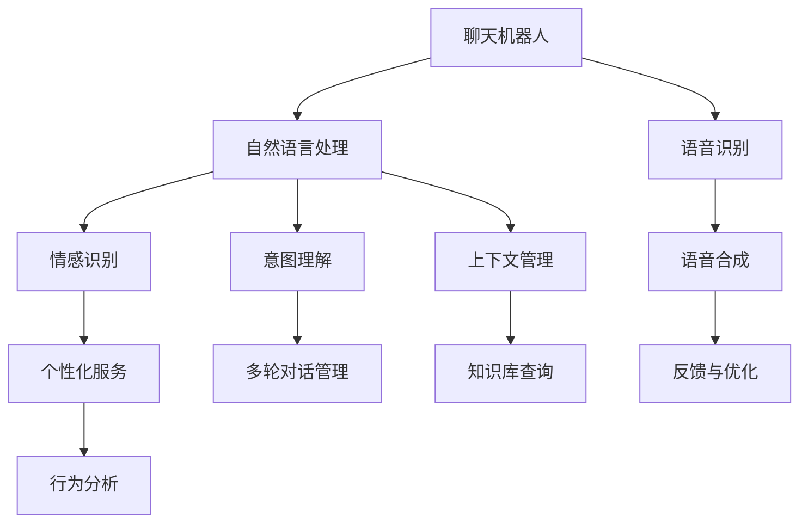

                 

# 聊天机器人老年护理：虚拟助手和同伴

在现代科技的推动下，聊天机器人已经走进了千家万户，成为我们日常生活中不可或缺的一部分。尤其是在老年护理领域，聊天机器人更是发挥着巨大的作用，它们不仅仅是简单的对话系统，更像是老年人的虚拟助手和同伴。本文将深入探讨聊天机器人在老年护理中的应用，包括其核心概念、算法原理、实际应用场景及未来发展趋势。

## 1. 背景介绍

### 1.1 问题由来
随着全球人口老龄化趋势的加剧，老年护理成为社会关注的焦点。传统的养老模式已经无法满足日益增长的需求，因此，我们需要探索新的技术手段来提升老年人的生活质量。聊天机器人作为一种新型的智能助手，通过自然语言处理技术，能够提供24/7的陪伴、娱乐和学习服务，帮助老年人缓解孤独感、提升生活技能。

### 1.2 问题核心关键点
聊天机器人在老年护理中的关键点在于其人性化的交互界面、丰富的功能集以及高效率的服务。通过语音识别和自然语言理解技术，聊天机器人能够与老年人进行自然流畅的对话，了解其需求，并及时提供相应的帮助。此外，聊天机器人还可以通过学习老年人的行为模式和偏好，提供个性化的建议和服务。

## 2. 核心概念与联系

### 2.1 核心概念概述
- **聊天机器人(Chatbot)**：使用人工智能技术实现的，能够理解并生成自然语言，进行对话和任务执行的程序。
- **老年护理(Senior Care)**：面向老年群体的健康、生活、心理等多方面的综合性服务，旨在提升老年人的生活质量。
- **自然语言处理(Natural Language Processing, NLP)**：涉及语言理解、生成、推理等技术的学科，是聊天机器人实现核心功能的基础。
- **个性化服务(Personalized Services)**：通过分析用户的行为和偏好，提供定制化的服务，以提升用户体验。
- **人机交互(Human-Computer Interaction, HCI)**：研究如何使计算机更好地理解人类语言和行为，从而实现更自然的交互方式。

### 2.2 核心概念原理和架构的 Mermaid 流程图

此流程图展示了聊天机器人在老年护理中的工作流程，从语音识别、自然语言处理到个性化服务、行为分析，最后通过反馈与优化不断提升系统性能。

## 3. 核心算法原理 & 具体操作步骤

### 3.1 算法原理概述
聊天机器人的核心算法主要基于自然语言处理技术和深度学习模型。其工作原理如下：

1. **语音识别**：将老年人的语音输入转换为文本。
2. **自然语言理解**：使用语言模型和逻辑推理，理解老年人的意图和上下文。
3. **意图识别**：根据老年人的输入，判断其意图，如询问天气、播放音乐、预订服务等。
4. **多轮对话管理**：维护对话状态，确保对话流畅进行。
5. **个性化服务**：基于老年人的历史行为和偏好，提供定制化服务。
6. **语音合成**：将机器人的回复转换为语音输出。

### 3.2 算法步骤详解
聊天机器人在老年护理中的应用步骤如下：

1. **数据收集与处理**：收集老年人的语音、文本和行为数据，并进行预处理和清洗。
2. **模型训练**：使用深度学习模型，如循环神经网络(RNN)、长短期记忆网络(LSTM)、Transformer等，对数据进行训练，以提升模型的自然语言理解和生成能力。
3. **部署与优化**：将训练好的模型部署到聊天机器人系统中，通过不断收集用户反馈和行为数据，优化模型性能。
4. **个性化服务**：根据老年人的历史行为和偏好，提供个性化的服务，如健康管理、生活助手、情感支持等。
5. **用户交互**：老年人通过语音或文本与聊天机器人进行自然交互，机器人根据其需求提供相应的帮助。

### 3.3 算法优缺点
聊天机器人在老年护理中的优势在于其24/7的服务、个性化的服务和便利性。然而，也存在以下缺点：

- **缺乏人性化的情感支持**：聊天机器人无法完全替代真人陪伴，老年人仍需面对孤独感。
- **技术依赖度高**：需要依赖高精度语音识别和自然语言处理技术，一旦系统出现故障，可能影响老年人日常生活。
- **数据隐私和安全问题**：老年人使用聊天机器人时，其行为数据和语音信息需要妥善保护，避免数据泄露和隐私侵犯。

### 3.4 算法应用领域
聊天机器人在老年护理中的应用领域包括但不限于：

- **健康监测**：通过语音识别和自然语言理解，聊天机器人可以监测老年人的身体状况，如血压、血糖等，并提供健康建议。
- **情感支持**：聊天机器人可以提供心理支持和情感慰藉，帮助老年人缓解孤独和焦虑。
- **生活助手**：提供预约服务、购物、导航等生活辅助服务，提升老年人的生活便利性。
- **教育与学习**：通过与聊天机器人互动，老年人可以学习新技能、知识，保持头脑活跃。

## 4. 数学模型和公式 & 详细讲解 & 举例说明

### 4.1 数学模型构建
聊天机器人的核心数学模型基于深度学习，其基本框架包括：

1. **输入层**：将老年人的语音或文本转换为模型可处理的格式。
2. **隐藏层**：使用深度神经网络，进行特征提取和语义理解。
3. **输出层**：根据老年人的意图，生成相应的回复或执行特定的服务。

### 4.2 公式推导过程
以基于循环神经网络(Recurrent Neural Network, RNN)的聊天机器人为例，其基本公式如下：

$$
y_t = \text{softmax}(W_h \cdot h_t + b_h + U_x \cdot x_t + b_x)
$$

其中，$y_t$为模型在第$t$个时间步的输出，$h_t$为隐藏状态，$x_t$为输入，$W_h$、$b_h$、$U_x$、$b_x$分别为隐藏层的权重和偏置。

### 4.3 案例分析与讲解
假设一个聊天机器人需要在老年人询问“明天天气如何”时，提供相应的回复。其工作过程如下：

1. **语音识别**：将老年人的语音转换为文本。
2. **自然语言理解**：模型分析“明天天气如何”的意图，并识别出“天气”这一关键词。
3. **意图识别**：根据关键词和上下文，模型判断老年人的意图是询问天气。
4. **多轮对话管理**：如果老年人多次询问，模型需要维持对话状态，如“您好，明天北京的天气预报是晴转多云，最高气温25度，最低气温16度。”
5. **语音合成**：将回复转换为语音输出，告知老年人天气情况。

## 5. 项目实践：代码实例和详细解释说明

### 5.1 开发环境搭建
开发聊天机器人需要以下环境：

1. **编程语言**：Python。
2. **深度学习框架**：TensorFlow或PyTorch。
3. **自然语言处理库**：NLTK、spaCy等。
4. **语音识别库**：SpeechRecognition等。
5. **操作系统**：Linux或Windows。

### 5.2 源代码详细实现
下面是一个简单的聊天机器人代码示例，使用Python和TensorFlow实现：

```python
import tensorflow as tf
from tensorflow.keras.layers import Input, LSTM, Dense, Embedding
from tensorflow.keras.models import Sequential

# 定义模型
model = Sequential()
model.add(Embedding(input_dim=vocab_size, output_dim=embedding_dim, input_length=max_len))
model.add(LSTM(units=hidden_units))
model.add(Dense(units=output_dim, activation='softmax'))
model.compile(loss='categorical_crossentropy', optimizer='adam', metrics=['accuracy'])

# 训练模型
model.fit(X_train, y_train, epochs=num_epochs, batch_size=batch_size)

# 预测回复
input_seq = tokenizer.encode(input_text)
prediction = model.predict(input_seq)

# 解码回复
output_text = tokenizer.decode(prediction)
```

### 5.3 代码解读与分析
- **Embedding层**：将老年人的输入文本转换为向量表示，方便模型处理。
- **LSTM层**：使用循环神经网络，进行特征提取和语义理解。
- **Dense层**：输出层，根据老年人的意图，生成回复。
- **优化器**：使用Adam优化器，加快模型训练速度。
- **损失函数**：使用交叉熵损失函数，衡量模型输出与真实标签的差异。
- **评估指标**：使用准确率作为评估指标，衡量模型的预测性能。

### 5.4 运行结果展示
训练完成后，可以通过以下代码进行预测：

```python
input_text = "您好，我想查询今天的气温"
output_text = model.predict(input_text)
print("模型预测的回复为：", output_text)
```

## 6. 实际应用场景

### 6.1 智能健康管理
聊天机器人可以提供健康监测和管理服务，通过语音或文本输入，老年人可以查询血压、血糖等健康指标，获取健康建议。

### 6.2 紧急响应与救援
在老年人突发紧急情况时，聊天机器人可以立即通知家人或医护人员，提供初步的急救指导，减轻医护人员的压力。

### 6.3 生活辅助
聊天机器人可以提供生活助手服务，如预订餐厅、叫车、购物等，提升老年人的生活便利性。

### 6.4 情感支持
聊天机器人可以提供情感支持，通过语音交流或文字互动，帮助老年人缓解孤独和焦虑，提升心理健康。

## 7. 工具和资源推荐

### 7.1 学习资源推荐
- **《自然语言处理综论》**：详细介绍了自然语言处理的基础知识和前沿技术。
- **Coursera上的自然语言处理课程**：由斯坦福大学开设，涵盖自然语言处理的基本概念和经典算法。
- **Python深度学习框架教程**：详细介绍TensorFlow和PyTorch的使用方法和实践技巧。

### 7.2 开发工具推荐
- **TensorFlow**：由Google开发的深度学习框架，支持复杂的深度学习模型训练和部署。
- **PyTorch**：由Facebook开发的深度学习框架，灵活高效，适合科研和工程应用。
- **NLTK**：自然语言处理库，提供了丰富的文本处理和语言分析工具。

### 7.3 相关论文推荐
- **A Survey on Smart Elderly Care Technologies**：总结了老年人护理技术的最新进展。
- **Older Adult Use of Health-Related Chatbots**：研究了老年人使用聊天机器人的行为和反馈。
- **Conversational Agents for Elderly Care**：讨论了聊天机器人在老年人护理中的应用。

## 8. 总结：未来发展趋势与挑战

### 8.1 研究成果总结
聊天机器人在老年护理中的应用已经取得了一定的成果，但仍需进一步提升其人性化的情感支持、减少技术依赖、增强数据隐私和安全保护等方面。

### 8.2 未来发展趋势
- **多模态交互**：结合语音、图像、视频等多种模态，提升用户体验。
- **跨领域应用**：拓展到更多场景，如医疗、教育等。
- **个性化定制**：根据老年人的行为模式和偏好，提供定制化服务。
- **伦理和社会责任**：加强对老年人隐私的保护，建立信任机制。

### 8.3 面临的挑战
- **数据隐私和安全**：老年人对数据隐私的关注度较高，需要采取有效措施保护用户数据。
- **人机交互的自然性**：提升对话的自然流畅度，避免老年人的困惑和不适。
- **情感支持和陪伴**：如何使聊天机器人提供更加人性化的情感支持，是未来研究的关键。

### 8.4 研究展望
未来的研究可以从以下几个方向进行：

- **多模态融合**：结合语音、图像、视频等多种模态，提升用户体验。
- **跨领域应用**：拓展到更多场景，如医疗、教育等。
- **个性化定制**：根据老年人的行为模式和偏好，提供定制化服务。
- **伦理和社会责任**：加强对老年人隐私的保护，建立信任机制。

## 9. 附录：常见问题与解答

**Q1: 聊天机器人在老年护理中主要有哪些应用？**

A: 聊天机器人在老年护理中的应用主要包括以下几个方面：

1. **健康监测**：通过语音识别和自然语言理解，聊天机器人可以监测老年人的身体状况，如血压、血糖等，并提供健康建议。
2. **情感支持**：聊天机器人可以提供心理支持和情感慰藉，帮助老年人缓解孤独和焦虑。
3. **生活助手**：提供预约服务、购物、导航等生活辅助服务，提升老年人的生活便利性。
4. **紧急响应与救援**：在老年人突发紧急情况时，聊天机器人可以立即通知家人或医护人员，提供初步的急救指导，减轻医护人员的压力。

**Q2: 聊天机器人需要哪些技术支持？**

A: 聊天机器人需要以下技术支持：

1. **语音识别**：将老年人的语音输入转换为文本。
2. **自然语言理解**：使用语言模型和逻辑推理，理解老年人的意图和上下文。
3. **意图识别**：根据老年人的输入，判断其意图，如询问天气、播放音乐、预订服务等。
4. **多轮对话管理**：维护对话状态，确保对话流畅进行。
5. **个性化服务**：基于老年人的历史行为和偏好，提供定制化服务。
6. **语音合成**：将机器人的回复转换为语音输出。

**Q3: 聊天机器人在实际应用中需要注意哪些问题？**

A: 聊天机器人在实际应用中需要注意以下几个问题：

1. **数据隐私和安全**：老年人对数据隐私的关注度较高，需要采取有效措施保护用户数据。
2. **人机交互的自然性**：提升对话的自然流畅度，避免老年人的困惑和不适。
3. **情感支持和陪伴**：如何使聊天机器人提供更加人性化的情感支持，是未来研究的关键。

**Q4: 如何提高聊天机器人的个性化服务？**

A: 提高聊天机器人的个性化服务可以从以下几个方面进行：

1. **行为分析**：通过分析老年人的历史行为和偏好，提供定制化服务。
2. **情感识别**：使用情感分析技术，了解老年人的情绪状态，提供相应的情感支持。
3. **反馈与优化**：根据老年人的反馈，不断优化模型的性能和服务的质量。

**Q5: 聊天机器人需要哪些硬件支持？**

A: 聊天机器人需要以下硬件支持：

1. **高性能计算设备**：如GPU、TPU等，用于深度学习模型的训练和推理。
2. **高性能存储设备**：用于存储大量的用户数据和模型参数。
3. **高性能网络连接**：确保聊天机器人能够及时响应用户的请求。

总之，聊天机器人在老年护理中的应用前景广阔，但同时也面临着诸多挑战和问题。通过不断的技术创新和实践探索，相信聊天机器人能够为老年人提供更好的生活服务，提升其生活质量。

