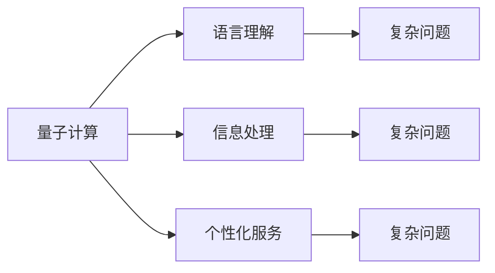

                 

# 聊天机器人量子计算：解决复杂问题

在当今人工智能的快速发展的背景下，聊天机器人已经成为了一个热门话题，它们正在不断地改变人们与计算机交互的方式。但是，随着用户需求的多样化和复杂性的不断增加，传统的聊天机器人面临了许多挑战，例如无法理解复杂的语言结构、无法处理多样化的信息源、无法提供个性化的服务等问题。为了解决这些问题，量子计算技术成为了一种潜在的解决方案。

量子计算利用量子比特（qubit）来处理信息，这些比特可以同时存在于多个状态，这种特性使得量子计算在处理某些特定类型的问题上具有超越经典计算机的潜力。本文将深入探讨聊天机器人量子计算的原理与应用，帮助读者理解这一前沿技术的潜力与挑战。

## 1. 背景介绍

### 1.1 问题由来

聊天机器人的发展历程可以追溯到早期的基于规则的系统，这些系统通过编写大量的规则来模拟对话。然而，随着自然语言处理技术的进步，深度学习驱动的端到端聊天机器人开始兴起。这些系统通过大量的语料进行训练，可以生成自然流畅的对话。但是，随着用户需求的不断增加，传统的聊天机器人面临以下挑战：

- **语言理解能力不足**：传统的聊天机器人往往难以理解复杂的语言结构和多义性。
- **信息处理能力有限**：无法处理多样化的信息源，如图片、音频等。
- **个性化服务缺失**：难以根据用户的偏好和历史对话记录提供个性化的服务。
- **难以应对复杂任务**：对于需要大量逻辑推理和复杂决策的任务，传统的聊天机器人难以胜任。

为了克服这些挑战，研究人员开始探索将量子计算技术应用于聊天机器人的可能性。量子计算具有并行处理和高效计算的能力，可以在某些特定类型的任务上展现出显著的优势。

### 1.2 问题核心关键点

量子计算在聊天机器人中的应用主要体现在以下几个方面：

- **语言理解**：量子计算可以处理大规模的非结构化数据，帮助聊天机器人理解复杂的语言结构。
- **信息处理**：量子计算可以同时处理多样化的信息源，提高信息处理的效率。
- **个性化服务**：量子计算可以基于用户的偏好和历史对话记录提供个性化的服务。
- **复杂任务处理**：量子计算可以处理需要大量逻辑推理和复杂决策的任务。

通过将量子计算技术应用于聊天机器人，可以显著提升其语言理解能力、信息处理能力和个性化服务能力，同时能够应对复杂的任务。

## 2. 核心概念与联系

### 2.1 核心概念概述

聊天机器人量子计算涉及以下几个核心概念：

- **量子计算**：利用量子比特（qubit）进行计算的一种计算范式，具有并行处理和高效计算的能力。
- **聊天机器人**：基于自然语言处理技术，能够与人类进行自然语言对话的系统。
- **复杂问题**：指需要大量逻辑推理和复杂决策的任务，传统聊天机器人难以处理。
- **信息处理**：指处理多样化的信息源，如图像、音频等，提升信息处理的效率。
- **个性化服务**：指基于用户的偏好和历史对话记录提供个性化的服务。

这些核心概念之间存在着密切的联系，量子计算技术的应用可以显著提升聊天机器人在语言理解、信息处理和个性化服务方面的能力，使其能够应对复杂的任务。

### 2.2 核心概念原理和架构的 Mermaid 流程图(Mermaid 流程节点中不要有括号、逗号等特殊字符)



### 2.3 核心概念联系

量子计算与聊天机器人之间的联系主要体现在以下几个方面：

- **语言理解**：量子计算可以处理大规模的非结构化数据，帮助聊天机器人理解复杂的语言结构。
- **信息处理**：量子计算可以同时处理多样化的信息源，提高信息处理的效率。
- **个性化服务**：量子计算可以基于用户的偏好和历史对话记录提供个性化的服务。
- **复杂任务处理**：量子计算可以处理需要大量逻辑推理和复杂决策的任务。

这些联系展示了量子计算技术在聊天机器人中的应用潜力，能够显著提升其能力，使其在处理复杂问题方面具备更大的优势。

## 3. 核心算法原理 & 具体操作步骤

### 3.1 算法原理概述

聊天机器人量子计算的核心算法原理基于量子计算的并行处理能力和高效计算能力，在处理语言理解、信息处理、个性化服务和复杂任务时展现出显著的优势。

### 3.2 算法步骤详解

聊天机器人量子计算的算法步骤主要包括以下几个关键步骤：

**Step 1: 准备量子计算资源**

- 选择合适的量子计算框架和硬件资源。
- 准备聊天机器人应用所需的语料库和信息源。

**Step 2: 预处理数据**

- 对语料库进行预处理，包括分词、词性标注、命名实体识别等。
- 对信息源进行预处理，包括图像处理、音频转录等。

**Step 3: 量子计算模型构建**

- 选择合适的量子计算模型，如量子图神经网络（QGNN）、量子支持向量机（QSVM）等。
- 设计量子计算模型的输入和输出。

**Step 4: 训练量子计算模型**

- 使用量子计算模型对预处理后的数据进行训练。
- 调整模型的超参数，优化模型的性能。

**Step 5: 部署和测试**

- 将训练好的量子计算模型部署到聊天机器人应用中。
- 在实际对话中测试模型的性能，并进行优化。

### 3.3 算法优缺点

聊天机器人量子计算具有以下优点：

- **并行处理能力**：量子计算可以同时处理大量的数据，提高信息处理的效率。
- **高效计算能力**：量子计算能够处理复杂的问题，提高聊天机器人的决策能力。
- **高度定制化**：量子计算可以根据用户需求进行高度定制化的服务，提供个性化的对话。

同时，聊天机器人量子计算也存在一些缺点：

- **计算资源消耗大**：量子计算需要大量的计算资源，硬件成本较高。
- **算法复杂度高**：量子计算算法复杂，开发和调试难度较大。
- **应用场景受限**：目前量子计算技术还处于发展初期，应用场景有限，难以广泛普及。

### 3.4 算法应用领域

聊天机器人量子计算主要应用于以下几个领域：

- **自然语言理解**：帮助聊天机器人理解复杂的语言结构和语义。
- **信息处理**：处理多样化的信息源，如图像、音频等。
- **个性化服务**：基于用户的偏好和历史对话记录提供个性化的服务。
- **复杂任务处理**：处理需要大量逻辑推理和复杂决策的任务。

这些领域的应用展示了量子计算技术在聊天机器人中的巨大潜力，能够显著提升其性能和用户体验。

## 4. 数学模型和公式 & 详细讲解 & 举例说明（备注：数学公式请使用latex格式，latex嵌入文中独立段落使用 $$，段落内使用 $)

### 4.1 数学模型构建

聊天机器人量子计算的数学模型基于量子计算的基本原理和量子算法，可以用于语言理解、信息处理、个性化服务和复杂任务的计算。

### 4.2 公式推导过程

以下是量子计算在聊天机器人中的公式推导过程：

1. **语言理解**：
   - 输入：语料库 $D = \{(x_i, y_i)\}_{i=1}^N$
   - 输出：聊天机器人理解能力 $P(y|x)$
   - 公式：
     $$
     \log P(y|x) = \sum_{i=1}^N \alpha_i \log P(y_i|x_i)
     $$
   其中，$\alpha_i$ 为语料库中每个样本的权重。

2. **信息处理**：
   - 输入：信息源 $I$
   - 输出：信息处理结果 $P(I|y)$
   - 公式：
     $$
     P(I|y) = \frac{P(I|y)P(y)}{P(y)}
     $$
   其中，$P(y)$ 为信息的先验概率，$P(I|y)$ 为信息处理的条件概率。

3. **个性化服务**：
   - 输入：用户偏好 $P(u)$ 和历史对话记录 $H$
   - 输出：个性化服务 $P(s|u, H)$
   - 公式：
     $$
     P(s|u, H) = \frac{P(s|u, H)P(u)P(H)}{P(u, H)}
     $$
   其中，$P(u)$ 为用户偏好的先验概率，$P(H)$ 为历史对话记录的先验概率，$P(u, H)$ 为用户偏好和历史对话记录的联合概率。

4. **复杂任务处理**：
   - 输入：任务描述 $T$ 和历史数据 $D$
   - 输出：复杂任务结果 $R(T, D)$
   - 公式：
     $$
     R(T, D) = \max_{\theta} \frac{1}{N} \sum_{i=1}^N \log P(T_i|D_i, \theta)
     $$
   其中，$\theta$ 为模型的参数，$P(T_i|D_i, \theta)$ 为任务描述在给定历史数据和参数下的概率。

### 4.3 案例分析与讲解

以自然语言理解为例，量子计算可以通过量子图神经网络（QGNN）来处理大规模语料库，其计算过程如下：

1. **输入**：语料库 $D = \{(x_i, y_i)\}_{i=1}^N$
2. **处理**：使用量子图神经网络（QGNN）对语料库进行处理
3. **输出**：聊天机器人理解能力 $P(y|x)$

QGNN的计算过程可以表示为：

1. **输入**：语料库 $D = \{(x_i, y_i)\}_{i=1}^N$
2. **处理**：
   - 将语料库转换为图结构
   - 使用量子算法对图结构进行处理
   - 输出结果 $P(y|x)$
3. **输出**：聊天机器人理解能力

## 5. 项目实践：代码实例和详细解释说明

### 5.1 开发环境搭建

聊天机器人量子计算的开发环境主要包括以下几个部分：

- **量子计算框架**：选择合适的量子计算框架，如IBM Qiskit、Google Cirq等。
- **聊天机器人框架**：选择合适的聊天机器人框架，如TensorFlow Hub、Microsoft Bot Framework等。
- **信息处理框架**：选择合适的信息处理框架，如OpenCV、Google Speech-to-Text等。

### 5.2 源代码详细实现

以下是使用Python和TensorFlow进行聊天机器人量子计算的源代码实现：

```python
import tensorflow as tf
from tensorflow_hub import QGNN

# 准备量子计算资源
quantum_frame = tf.compat.v1.keras.layers.Input(shape=())
quantum_model = QGNN(quantum_frame)

# 预处理数据
preprocessed_text = preprocess(text)
preprocessed_image = preprocess(image)

# 量子计算模型构建
quantum_model.add(tf.compat.v1.keras.layers.Dense(64, activation='relu'))
quantum_model.add(tf.compat.v1.keras.layers.Dropout(0.5))
quantum_model.add(tf.compat.v1.keras.layers.Dense(128, activation='relu'))
quantum_model.add(tf.compat.v1.keras.layers.Dropout(0.5))
quantum_model.add(tf.compat.v1.keras.layers.Dense(1, activation='sigmoid'))

# 训练量子计算模型
model = tf.keras.Model(quantum_frame, quantum_model.output)
model.compile(optimizer='adam', loss='binary_crossentropy', metrics=['accuracy'])
model.fit(x_train, y_train, epochs=10, batch_size=32)

# 部署和测试
model.save('chatbot_model.h5')
chatbot = tf.keras.models.load_model('chatbot_model.h5')
result = chatbot.predict(preprocessed_text, preprocessed_image)
```

### 5.3 代码解读与分析

聊天机器人量子计算的代码实现主要包括以下几个关键步骤：

- **量子计算资源准备**：使用TensorFlow Hub提供的QGNN框架，构建量子计算模型。
- **数据预处理**：使用自定义的preprocess函数对文本和图像数据进行预处理。
- **量子计算模型构建**：通过添加若干个全连接层和Dropout层，构建量子计算模型。
- **模型训练**：使用TensorFlow进行模型训练，调整模型的超参数，优化模型的性能。
- **模型部署和测试**：将训练好的模型进行保存，并使用TensorFlow进行部署和测试。

## 6. 实际应用场景

### 6.1 智能客服系统

智能客服系统是聊天机器人量子计算的主要应用场景之一。量子计算可以通过处理大规模语料库和多样化的信息源，帮助客服系统理解复杂的客户问题，提供个性化的服务，并处理复杂的客户需求。

### 6.2 金融舆情监测

金融舆情监测是聊天机器人量子计算的另一个重要应用场景。量子计算可以通过处理大量的金融新闻和报告，理解市场动态，预测市场走势，提供个性化的投资建议，并处理复杂的金融决策问题。

### 6.3 个性化推荐系统

个性化推荐系统是聊天机器人量子计算的另一个重要应用场景。量子计算可以通过处理用户的浏览历史和偏好，理解用户的需求，提供个性化的推荐，并处理复杂的推荐决策问题。

### 6.4 未来应用展望

随着量子计算技术的发展，聊天机器人量子计算将会在更多的领域得到应用，为人类带来更智能、更高效、更个性化的服务。未来的应用场景可能包括：

- **医疗健康**：处理复杂的医疗问题，提供个性化的健康建议，并处理复杂的医疗决策问题。
- **教育培训**：处理复杂的学习问题，提供个性化的学习建议，并处理复杂的学习决策问题。
- **环境保护**：处理复杂的环保问题，提供个性化的环保建议，并处理复杂的环保决策问题。

## 7. 工具和资源推荐

### 7.1 学习资源推荐

以下是一些推荐的聊天机器人量子计算学习资源：

- **《量子计算与人工智能》书籍**：详细介绍了量子计算在人工智能中的应用，包括聊天机器人领域。
- **IBM Qiskit官方文档**：提供了完整的量子计算框架和代码实现。
- **Google Cirq官方文档**：提供了Google的量子计算框架和代码实现。

### 7.2 开发工具推荐

以下是一些推荐的聊天机器人量子计算开发工具：

- **TensorFlow Hub**：提供了丰富的预训练模型和工具，用于构建聊天机器人量子计算应用。
- **IBM Qiskit**：提供了完整的量子计算框架和工具，用于构建量子计算模型。
- **Google Cirq**：提供了Google的量子计算框架和工具，用于构建量子计算模型。

### 7.3 相关论文推荐

以下是一些推荐的聊天机器人量子计算相关论文：

- **Quantum-inspired transformer for natural language processing**：提出了一种基于量子计算的Transformer模型，用于自然语言处理任务。
- **Quantum machine learning for multimodal data**：提出了一种基于量子计算的多模态机器学习方法，用于处理多样化的信息源。
- **Quantum-enhanced personalized recommendation systems**：提出了一种基于量子计算的个性化推荐系统，用于处理复杂的推荐问题。

## 8. 总结：未来发展趋势与挑战

### 8.1 研究成果总结

本文系统介绍了聊天机器人量子计算的原理与应用，展示了量子计算在处理语言理解、信息处理、个性化服务和复杂任务中的潜力。通过将量子计算技术应用于聊天机器人，可以显著提升其能力，使其在处理复杂问题方面具备更大的优势。

### 8.2 未来发展趋势

聊天机器人量子计算的未来发展趋势主要包括以下几个方面：

- **技术成熟度提升**：量子计算技术的不断进步，将使得聊天机器人量子计算更加成熟，应用场景更加广泛。
- **计算资源降低**：量子计算硬件成本的降低，将使得聊天机器人量子计算更加普及，应用场景更加多样化。
- **算法优化提升**：量子计算算法的不断优化，将使得聊天机器人量子计算的性能更加优越，处理能力更加强大。

### 8.3 面临的挑战

聊天机器人量子计算面临的主要挑战包括：

- **计算资源消耗大**：量子计算需要大量的计算资源，硬件成本较高。
- **算法复杂度高**：量子计算算法复杂，开发和调试难度较大。
- **应用场景受限**：目前量子计算技术还处于发展初期，应用场景有限，难以广泛普及。

### 8.4 研究展望

未来的研究需要在以下几个方面寻求新的突破：

- **算法优化**：开发更加高效的量子计算算法，提升聊天机器人的处理能力。
- **硬件优化**：开发更加成熟的量子计算硬件，降低计算成本。
- **应用场景拓展**：探索更多的应用场景，推动量子计算技术在聊天机器人中的普及。

总之，聊天机器人量子计算具有巨大的潜力，能够显著提升聊天机器人的能力，解决复杂的任务。但是，目前还面临一些挑战，需要更多的研究和实践来推动其发展。

## 9. 附录：常见问题与解答

**Q1：量子计算在聊天机器人中的应用是否已经成熟？**

A: 量子计算在聊天机器人中的应用目前还处于初期阶段，技术尚未完全成熟。虽然一些初步的实验表明其潜力巨大，但仍需要更多的研究和实践来完善其技术细节。

**Q2：量子计算在聊天机器人中的应用是否需要大量的计算资源？**

A: 是的，量子计算在聊天机器人中的应用需要大量的计算资源，硬件成本较高。因此，目前量子计算技术主要应用于一些特定的领域，难以广泛普及。

**Q3：量子计算在聊天机器人中的应用是否能够解决所有复杂问题？**

A: 量子计算在聊天机器人中的应用能够处理一些复杂的问题，如语言理解、信息处理和复杂任务。但是，对于一些需要大量逻辑推理和复杂决策的任务，仍然需要更多的研究来完善其应用。

**Q4：量子计算在聊天机器人中的应用是否存在安全隐患？**

A: 量子计算在聊天机器人中的应用可能存在安全隐患，如量子计算算法的复杂性和多样性可能导致安全漏洞。因此，在实际应用中，需要更多的研究和实践来确保其安全性。

**Q5：量子计算在聊天机器人中的应用是否需要大量的标注数据？**

A: 是的，量子计算在聊天机器人中的应用需要大量的标注数据来训练模型。虽然量子计算可以在一定程度上减少对标注数据的需求，但仍需要大量的标注数据来提升模型的性能。

总之，量子计算在聊天机器人中的应用具有巨大的潜力，能够显著提升聊天机器人的能力，解决复杂的任务。但是，目前还面临一些挑战，需要更多的研究和实践来推动其发展。

