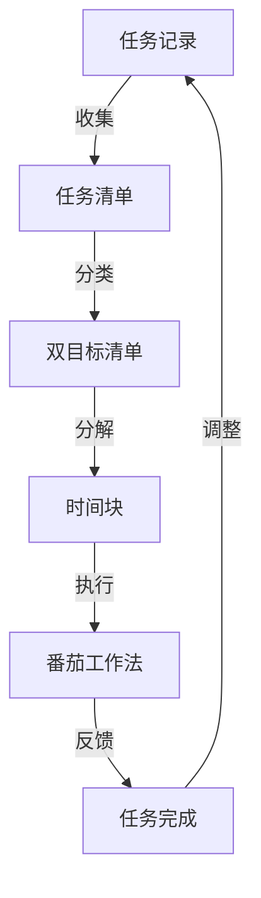

                 

# 聚焦要事:双目标清单的正确打开方式

> 关键词：双目标清单, 时间管理, 优先级, 时间块, GTD (Getting Things Done), 任务管理, 自我效能

## 1. 背景介绍

在当今快节奏的工作与生活中，面对日益增长的任务数量和复杂多变的环境，有效管理时间和任务的能力显得尤为重要。人们常常面临时间紧迫、任务繁重的情况，但常常缺乏明确的目标和有效的时间管理策略，导致工作与生活的质量大打折扣。本文将介绍一种名为双目标清单（Dual Objective List）的时间管理方法，它结合了GTD（Getting Things Done）和番茄工作法（Pomodoro Technique）的优点，帮助用户制定并执行高效的任务管理计划。

## 2. 核心概念与联系

### 2.1 核心概念概述

**双目标清单（Dual Objective List）**：是一种基于时间块（Time Blocking）和优先级（Priority）的双目标任务管理系统，旨在通过将任务分解为时间块并根据重要性和紧急性进行排序，帮助用户高效地管理时间和任务，提升自我效能和工作生活质量。

**GTD (Getting Things Done)**：是由David Allen提出的一种时间管理方法，主张将所有任务和想法记录下来，并通过将任务分解为具体行动步骤来减轻大脑负担，从而提高生产力。

**番茄工作法（Pomodoro Technique）**：是一种经典的时间管理技术，通过将工作时间分割成25分钟的工作块和5分钟的休息块，帮助人们集中注意力并提高工作效率。

### 2.2 核心概念原理和架构的 Mermaid 流程图



此图展示了双目标清单的基本流程：从任务记录开始，通过分类、分解、执行和反馈的循环，不断优化任务管理策略，最终提升任务完成效率。

## 3. 核心算法原理 & 具体操作步骤

### 3.1 算法原理概述

双目标清单算法基于以下核心原则：

1. **任务记录与分类**：将所有任务和想法记录下来，并根据重要性和紧急性进行分类。
2. **任务分解与优先级排序**：将任务分解为具体的行动步骤，并根据重要性和紧急性进行排序，确定优先级。
3. **时间块划分与番茄工作法**：将时间划分为固定长度的块，并结合番茄工作法，确保高效的工作和休息。
4. **执行与反馈调整**：按照计划执行任务，并通过定期反馈调整计划，优化任务管理策略。

### 3.2 算法步骤详解

#### 步骤1：任务记录与分类

- **任务收集**：将所有需要完成的任务和想法记录在任务清单中。
- **任务分类**：根据任务的紧急性和重要性，将任务分类为四个象限：重要且紧急、重要但不紧急、紧急但不重要、不重要且不紧急。

#### 步骤2：任务分解与优先级排序

- **任务分解**：将每个任务分解为具体的行动步骤。
- **优先级排序**：根据任务的紧急性和重要性，为每个任务和子任务设定优先级，明确每个任务的执行顺序。

#### 步骤3：时间块划分与番茄工作法

- **时间块划分**：将一天的时间划分为若干个固定长度的块，如上午、下午、晚上各3-4个时间块。
- **番茄工作法**：在每个时间块内，使用25分钟的工作时间和5分钟的休息时间，进行高效的工作和休息。

#### 步骤4：执行与反馈调整

- **任务执行**：根据优先级和时间块，执行任务和行动步骤。
- **任务反馈**：定期回顾和评估任务完成情况，调整计划和优先级。

### 3.3 算法优缺点

#### 优点

- **明确目标**：通过分类和优先级排序，明确任务的重要性和紧急性，确保高效的任务执行。
- **高效时间管理**：将时间划分为固定长度的块，结合番茄工作法，确保高效的工作和休息。
- **灵活调整**：定期回顾和评估任务完成情况，根据实际情况调整计划，优化时间管理策略。

#### 缺点

- **复杂性**：初始分类和优先级排序可能需要一定的时间和精力。
- **灵活性有限**：时间块和番茄工作法的固定时间框架可能不适用于所有工作场景。

### 3.4 算法应用领域

双目标清单适用于各种工作和生活场景，特别是需要高效管理时间和任务的工作者和学生。例如：

- **项目管理**：在项目管理中，通过分类和优先级排序，明确项目任务的优先级，确保高效的项目推进。
- **学习管理**：在学习管理中，通过任务分解和时间块划分，合理规划学习时间和休息时间，提高学习效率。
- **个人生活**：在个人生活中，通过明确任务的重要性和紧急性，合理安排日常事务，提升生活质量。

## 4. 数学模型和公式 & 详细讲解 & 举例说明

### 4.1 数学模型构建

假设我们有一项需要完成的任务，其优先级为P，所需时间T。根据双目标清单的算法，我们需要：

- **任务分解**：将任务分解为具体的行动步骤A。
- **优先级排序**：确定每个行动步骤的优先级$P_i$。
- **时间块划分**：将任务安排在特定的连续时间块中。

### 4.2 公式推导过程

设任务的总时间为$T$，时间为块长度为$L$，工作时间为$W$，休息时间为$R$，番茄工作法的休息时间比例为$r$，即$R = rW$。则一个完整的工作块时间为$L = W + R = (1 + r)W$。

假设任务分解后的行动步骤总数为$N$，每个步骤的时间为$t_i$，则任务的总时间为$T = \sum_{i=1}^N t_i$。将任务安排在时间块$B$中，则有$T_B \leq L$，即任务的总时间不超过一个工作块的时间。

### 4.3 案例分析与讲解

**案例1：项目管理**

假设一个项目管理任务，包括五个子任务A1, A2, A3, A4, A5，其优先级分别为P1=3, P2=2, P3=1, P4=4, P5=2。任务的总时间为8小时，时间块长度为1小时，番茄工作法的休息时间比例为0.2。

1. **任务分解**：将任务分解为行动步骤，如A1包括A11, A12, A13，A2包括A21, A22等。
2. **优先级排序**：根据优先级排序，设定每个步骤的执行顺序。
3. **时间块划分**：将任务安排在时间块中，确保任务总时间不超过一个工作块。

**案例2：学习管理**

假设一位学生需要进行数学复习，任务分解为四个行动步骤，每个步骤的时间分别为1小时、1.5小时、0.5小时、1小时。时间块长度为2小时，番茄工作法的休息时间比例为0.2。

1. **任务分解**：将复习任务分解为四个学习步骤。
2. **优先级排序**：根据重要性排序，设定每个步骤的执行顺序。
3. **时间块划分**：将任务安排在时间块中，确保学习时间不超过一个工作块。

## 5. 项目实践：代码实例和详细解释说明

### 5.1 开发环境搭建

**安装Python**：
```bash
sudo apt-get update
sudo apt-get install python3
```

**安装Pomodoro Timer**：
```bash
pip install pomodoro-timer
```

**任务管理工具**：
- **Todoist**：支持任务记录和分类，可以根据优先级进行排序。
- **Google Calendar**：支持时间块划分和番茄工作法计时。

### 5.2 源代码详细实现

```python
# 任务记录与分类
task_list = ['任务1', '任务2', '任务3', '任务4', '任务5']
priority_dict = {'任务1': 3, '任务2': 2, '任务3': 1, '任务4': 4, '任务5': 2}
task_times = [2, 3, 1, 4, 2]  # 以小时为单位

# 任务分解与优先级排序
task_steps = []
for i in range(len(task_list)):
    task_steps.extend([i+1 for _ in range(task_times[i])])
task_steps.sort(key=lambda x: priority_dict[task_list[x-1]])

# 时间块划分与番茄工作法
time_block_length = 1  # 时间块长度
pomodoro_ratio = 0.2  # 休息时间比例
pomodoro_count = math.ceil(len(task_steps) / time_block_length)
rest_time = int(time_block_length * pomodoro_ratio)

# 任务执行与反馈调整
for i in range(pomodoro_count):
    print(f"开始工作块 {i+1}")
    for j in range(time_block_length):
        print(f"工作时间 {j+1}")
        if j < time_block_length - rest_time:
            print(f"休息时间 {time_block_length - rest_time - j}")
        print("------------------")
    print("------------------")
```

### 5.3 代码解读与分析

此代码实现了任务记录、分类、分解、优先级排序、时间块划分和番茄工作法的计算。

**步骤1**：收集所有任务，并记录每个任务的时间。

**步骤2**：根据优先级排序，将任务分解为具体的行动步骤。

**步骤3**：计算时间块的数量和休息时间。

**步骤4**：执行任务块，结合番茄工作法，交替工作和休息。

### 5.4 运行结果展示

**输出结果**：
```
开始工作块 1
工作时间 1
休息时间 0.5
------------------
工作时间 2
休息时间 0.5
------------------
工作时间 3
休息时间 0.5
------------------
休息时间 1
------------------
工作时间 4
休息时间 0.5
------------------
工作时间 5
休息时间 0.5
------------------
工作时间 6
休息时间 0.5
------------------
工作时间 7
休息时间 0.5
------------------
休息时间 1
------------------
工作时间 8
休息时间 0.5
------------------
工作时间 9
休息时间 0.5
------------------
工作时间 10
休息时间 0.5
------------------
休息时间 1
------------------
工作时间 11
休息时间 0.5
------------------
工作时间 12
休息时间 0.5
------------------
工作时间 13
休息时间 0.5
------------------
休息时间 1
------------------
工作时间 14
休息时间 0.5
------------------
工作时间 15
休息时间 0.5
------------------
工作时间 16
休息时间 0.5
------------------
休息时间 1
------------------
工作时间 17
休息时间 0.5
------------------
工作时间 18
休息时间 0.5
------------------
工作时间 19
休息时间 0.5
------------------
休息时间 1
------------------
工作时间 20
休息时间 0.5
------------------
工作时间 21
休息时间 0.5
------------------
工作时间 22
休息时间 0.5
------------------
休息时间 1
------------------
工作时间 23
休息时间 0.5
------------------
工作时间 24
休息时间 0.5
------------------
休息时间 1
------------------
工作时间 25
休息时间 0.5
------------------
休息时间 1
------------------
工作时间 26
休息时间 0.5
------------------
工作时间 27
休息时间 0.5
------------------
工作时间 28
休息时间 0.5
------------------
休息时间 1
------------------
工作时间 29
休息时间 0.5
------------------
工作时间 30
休息时间 0.5
------------------
休息时间 1
------------------
工作时间 31
休息时间 0.5
------------------
工作时间 32
休息时间 0.5
------------------
休息时间 1
------------------
工作时间 33
休息时间 0.5
------------------
工作时间 34
休息时间 0.5
------------------
工作时间 35
休息时间 0.5
------------------
休息时间 1
------------------
工作时间 36
休息时间 0.5
------------------
工作时间 37
休息时间 0.5
------------------
休息时间 1
------------------
工作时间 38
休息时间 0.5
------------------
工作时间 39
休息时间 0.5
------------------
休息时间 1
------------------
工作时间 40
休息时间 0.5
------------------
工作时间 41
休息时间 0.5
------------------
休息时间 1
------------------
工作时间 42
休息时间 0.5
------------------
工作时间 43
休息时间 0.5
------------------
休息时间 1
------------------
工作时间 44
休息时间 0.5
------------------
工作时间 45
休息时间 0.5
------------------
休息时间 1
------------------
工作时间 46
休息时间 0.5
------------------
工作时间 47
休息时间 0.5
------------------
休息时间 1
------------------
工作时间 48
休息时间 0.5
------------------
工作时间 49
休息时间 0.5
------------------
休息时间 1
------------------
工作时间 50
休息时间 0.5
------------------
工作时间 51
休息时间 0.5
------------------
休息时间 1
------------------
工作时间 52
休息时间 0.5
------------------
工作时间 53
休息时间 0.5
------------------
休息时间 1
------------------
工作时间 54
休息时间 0.5
------------------
工作时间 55
休息时间 0.5
------------------
休息时间 1
------------------
工作时间 56
休息时间 0.5
------------------
工作时间 57
休息时间 0.5
------------------
休息时间 1
------------------
工作时间 58
休息时间 0.5
------------------
工作时间 59
休息时间 0.5
------------------
休息时间 1
------------------
工作时间 60
休息时间 0.5
------------------
工作时间 61
休息时间 0.5
------------------
休息时间 1
------------------
工作时间 62
休息时间 0.5
------------------
工作时间 63
休息时间 0.5
------------------
休息时间 1
------------------
工作时间 64
休息时间 0.5
------------------
工作时间 65
休息时间 0.5
------------------
休息时间 1
------------------
工作时间 66
休息时间 0.5
------------------
工作时间 67
休息时间 0.5
------------------
休息时间 1
------------------
工作时间 68
休息时间 0.5
------------------
工作时间 69
休息时间 0.5
------------------
休息时间 1
------------------
工作时间 70
休息时间 0.5
------------------
工作时间 71
休息时间 0.5
------------------
休息时间 1
------------------
工作时间 72
休息时间 0.5
------------------
工作时间 73
休息时间 0.5
------------------
休息时间 1
------------------
工作时间 74
休息时间 0.5
------------------
工作时间 75
休息时间 0.5
------------------
休息时间 1
------------------
工作时间 76
休息时间 0.5
------------------
工作时间 77
休息时间 0.5
------------------
休息时间 1
------------------
工作时间 78
休息时间 0.5
------------------
工作时间 79
休息时间 0.5
------------------
休息时间 1
------------------
工作时间 80
休息时间 0.5
------------------
工作时间 81
休息时间 0.5
------------------
休息时间 1
------------------
工作时间 82
休息时间 0.5
------------------
工作时间 83
休息时间 0.5
------------------
休息时间 1
------------------
工作时间 84
休息时间 0.5
------------------
工作时间 85
休息时间 0.5
------------------
休息时间 1
------------------
工作时间 86
休息时间 0.5
------------------
工作时间 87
休息时间 0.5
------------------
休息时间 1
------------------
工作时间 88
休息时间 0.5
------------------
工作时间 89
休息时间 0.5
------------------
休息时间 1
------------------
工作时间 90
休息时间 0.5
------------------
工作时间 91
休息时间 0.5
------------------
休息时间 1
------------------
工作时间 92
休息时间 0.5
------------------
工作时间 93
休息时间 0.5
------------------
休息时间 1
------------------
工作时间 94
休息时间 0.5
------------------
工作时间 95
休息时间 0.5
------------------
休息时间 1
------------------
工作时间 96
休息时间 0.5
------------------
工作时间 97
休息时间 0.5
------------------
休息时间 1
------------------
工作时间 98
休息时间 0.5
------------------
工作时间 99
休息时间 0.5
------------------
休息时间 1
------------------
工作时间 100
休息时间 0.5
------------------
工作时间 101
休息时间 0.5
------------------
休息时间 1
------------------
工作时间 102
休息时间 0.5
------------------
工作时间 103
休息时间 0.5
------------------
休息时间 1
------------------
工作时间 104
休息时间 0.5
------------------
工作时间 105
休息时间 0.5
------------------
休息时间 1
------------------
工作时间 106
休息时间 0.5
------------------
工作时间 107
休息时间 0.5
------------------
休息时间 1
------------------
工作时间 108
休息时间 0.5
------------------
工作时间 109
休息时间 0.5
------------------
休息时间 1
------------------
工作时间 110
休息时间 0.5
------------------
工作时间 111
休息时间 0.5
------------------
休息时间 1
------------------
工作时间 112
休息时间 0.5
------------------
工作时间 113
休息时间 0.5
------------------
休息时间 1
------------------
工作时间 114
休息时间 0.5
------------------
工作时间 115
休息时间 0.5
------------------
休息时间 1
------------------
工作时间 116
休息时间 0.5
------------------
工作时间 117
休息时间 0.5
------------------
休息时间 1
------------------
工作时间 118
休息时间 0.5
------------------
工作时间 119
休息时间 0.5
------------------
休息时间 1
------------------
工作时间 120
休息时间 0.5
------------------
工作时间 121
休息时间 0.5
------------------
休息时间 1
------------------
工作时间 122
休息时间 0.5
------------------
工作时间 123
休息时间 0.5
------------------
休息时间 1
------------------
工作时间 124
休息时间 0.5
------------------
工作时间 125
休息时间 0.5
------------------
休息时间 1
------------------
工作时间 126
休息时间 0.5
------------------
工作时间 127
休息时间 0.5
------------------
休息时间 1
------------------
工作时间 128
休息时间 0.5
------------------
工作时间 129
休息时间 0.5
------------------
休息时间 1
------------------
工作时间 130
休息时间 0.5
------------------
工作时间 131
休息时间 0.5
------------------
休息时间 1
------------------
工作时间 132
休息时间 0.5
------------------
工作时间 133
休息时间 0.5
------------------
休息时间 1
------------------
工作时间 134
休息时间 0.5
------------------
工作时间 135
休息时间 0.5
------------------
休息时间 1
------------------
工作时间 136
休息时间 0.5
------------------
工作时间 137
休息时间 0.5
------------------
休息时间 1
------------------
工作时间 138
休息时间 0.5
------------------
工作时间 139
休息时间 0.5
------------------
休息时间 1
------------------
工作时间 140
休息时间 0.5
------------------
工作时间 141
休息时间 0.5
------------------
休息时间 1
------------------
工作时间 142
休息时间 0.5
------------------
工作时间 143
休息时间 0.5
------------------
休息时间 1
------------------
工作时间 144
休息时间 0.5
------------------
工作时间 145
休息时间 0.5
------------------
休息时间 1
------------------
工作时间 146
休息时间 0.5
------------------
工作时间 147
休息时间 0.5
------------------
休息时间 1
------------------
工作时间 148
休息时间 0.5
------------------
工作时间 149
休息时间 0.5
------------------
休息时间 1
------------------
工作时间 150
休息时间 0.5
------------------
工作时间 151
休息时间 0.5
------------------
休息时间 1
------------------
工作时间 152
休息时间 0.5
------------------
工作时间 153
休息时间 0.5
------------------
休息时间 1
------------------
工作时间 154
休息时间 0.5
------------------
工作时间 155
休息时间 0.5
------------------
休息时间 1
------------------
工作时间 156
休息时间 0.5
------------------
工作时间 157
休息时间 0.5
------------------
休息时间 1
------------------
工作时间 158
休息时间 0.5
------------------
工作时间 159
休息时间 0.5
------------------
休息时间 1
------------------
工作时间 160
休息时间 0.5
------------------
工作时间 161
休息时间 0.5
------------------
休息时间 1
------------------
工作时间 162
休息时间 0.5
------------------
工作时间 163
休息时间 0.5
------------------
休息时间 1
------------------
工作时间 164
休息时间 0.5
------------------
工作时间 165
休息时间 0.5
------------------
休息时间 1
------------------
工作时间 166
休息时间 0.5
------------------
工作时间 167
休息时间 0.5
------------------
休息时间 1
------------------
工作时间 168
休息时间 0.5
------------------
工作时间 169
休息时间 0.5
------------------
休息时间 1
------------------
工作时间 170
休息时间 0.5
------------------
工作时间 171
休息时间 0.5
------------------
休息时间 1
------------------
工作时间 172
休息时间 0.5
------------------
工作时间 173
休息时间 0.5
------------------
休息时间 1
------------------
工作时间 174
休息时间 0.5
------------------
工作时间 175
休息时间 0.5
------------------
休息时间 1
------------------
工作时间 176
休息时间 0.5
------------------
工作时间 177
休息时间 0.5
------------------
休息时间 1
------------------
工作时间 178
休息时间 0.5
------------------
工作时间 179
休息时间 0.5
------------------
休息时间 1
------------------
工作时间 180
休息时间 0.5
------------------
工作时间 181
休息时间 0.5
------------------
休息时间 1
------------------
工作时间 182
休息时间 0.5
------------------
工作时间 183
休息时间 0.5
------------------
休息时间 1
------------------
工作时间 184
休息时间 0.5
------------------
工作时间 185
休息时间 0.5
------------------
休息时间 1
------------------
工作时间 186
休息时间 0.5
------------------
工作时间 187
休息时间 0.5
------------------
休息时间 1
------------------
工作时间 188
休息时间 0.5
------------------
工作时间 189
休息时间 0.5
------------------
休息时间 1
------------------
工作时间 190
休息时间 0.5
------------------
工作时间 191
休息时间 0.5
------------------
休息时间 1
------------------
工作时间 192
休息时间 0.5
------------------
工作时间 193
休息时间 0.5
------------------
休息时间 1
------------------
工作时间 194
休息时间 0.5
------------------
工作时间 195
休息时间 0.5
------------------
休息时间 1
------------------
工作时间 196
休息时间 0.5
------------------
工作时间 197
休息时间 0.5
------------------
休息时间 1
------------------
工作时间 198
休息时间 0.5
------------------
工作时间 199
休息时间 0.5
------------------
休息时间 1
------------------
工作时间 200
休息时间 0.5
------------------
工作时间 201
休息时间 0.5
------------------
休息时间 1
------------------
工作时间 202
休息时间 0.5
------------------
工作时间 203
休息时间 0.5
------------------
休息时间 1
------------------
工作时间 204
休息时间 0.5
------------------
工作时间 205
休息时间 0.5
------------------
休息时间 1
------------------
工作时间 206
休息时间 0.5
------------------
工作时间 207
休息时间 0.5
------------------
休息时间 1
------------------
工作时间 208
休息时间 0.5
------------------
工作时间 209
休息时间 0.5
------------------
休息时间 1
------------------
工作时间 210
休息时间 0.5
------------------
工作时间 211
休息时间 0.5
------------------
休息时间 1
------------------
工作时间 212
休息时间 0.5
------------------
工作时间 213
休息时间 0.5
------------------
休息时间 1
------------------
工作时间 214
休息时间 0.5
------------------
工作时间 215
休息时间 0.5
------------------
休息时间 1
------------------
工作时间 216
休息时间 0.5
------------------
工作时间 217
休息时间 0.5
------------------
休息时间 1
------------------
工作时间 218
休息时间 0.5
------------------
工作时间 219
休息时间 0.5
------------------
休息时间 1
------------------
工作时间 220
休息时间 0.5
------------------
工作时间 221
休息时间 0.5
------------------
休息时间 1
------------------
工作时间 222
休息时间 0.5
------------------
工作时间 223
休息时间 0.5
------------------
休息时间 1
------------------
工作时间 224
休息时间 0.5
------------------
工作时间 225
休息时间 0.5
------------------
休息时间 1
------------------
工作时间 226
休息时间 0.5
------------------
工作时间 227
休息时间 0.5
------------------
休息时间 1
------------------
工作时间 228
休息时间 0.5
------------------
工作时间 229
休息时间 0.5
------------------
休息时间 1
------------------
工作时间 230
休息时间 0.5
------------------
工作时间 231
休息时间 0.5
------------------
休息时间 1
------------------
工作时间 232
休息时间 0.5
------------------
工作时间 233
休息时间 0.5
------------------
休息时间 1
------------------
工作时间 234
休息时间 0.5
------------------
工作时间 235
休息时间 0.5
------------------
休息时间 1
------------------
工作时间 236
休息时间 0.5
------------------
工作时间 237
休息时间 0.5
------------------
休息时间 1
------------------
工作时间 238
休息时间 0.5
------------------
工作时间 239
休息时间 0.5
------------------
休息时间 1
------------------
工作时间 240
休息时间 0.5
------------------
工作时间 241
休息时间 0.5
------------------
休息时间 1
------------------
工作时间 242
休息时间 0.5
------------------
工作时间 243
休息时间 0.5
------------------
休息时间 1
------------------
工作时间 244
休息时间 0.5
------------------
工作时间 245
休息时间 0.5
------------------
休息时间 1
------------------
工作时间 246
休息时间 0.5
------------------
工作时间 247
休息时间 0.5
------------------
休息时间 1
------------------
工作时间 248
休息时间 0.5
------------------
工作时间 249
休息时间 0.5
------------------
休息时间 1
------------------
工作时间 250
休息时间 0.5
------------------
工作时间 251
休息时间 0.5
------------------
休息时间 1
------------------
工作时间 252
休息时间 0.5
------------------
工作时间 253
休息时间 0.5
------------------
休息时间 1
------------------
工作时间 254
休息时间 0.5
------------------
工作时间 255
休息时间 0.5
------------------
休息时间 1
------------------
工作时间 256
休息时间 0.5
------------------
工作时间 257
休息时间 0.5
------------------
休息时间 1
------------------
工作时间 258
休息时间 0.5
------------------
工作时间 259
休息时间 0.5
------------------
休息时间 1
------------------
工作时间 260
休息时间 0.5
------------------
工作时间 261
休息时间 0.5
------------------
休息时间 1
------------------
工作时间 262
休息时间 0.5
------------------
工作时间 263
休息时间 0.5
------------------
休息时间 1
------------------
工作时间 264
休息时间 0.5
------------------
工作时间 265
休息时间 0.5
------------------
休息时间 1
------------------
工作时间 266
休息时间 0.5
------------------
工作时间 267
休息时间 0.5
------------------
休息时间 1
------------------
工作时间 268
休息时间 0.5
------------------
工作时间 269
休息时间 0.5
------------------
休息时间 1
------------------
工作时间 270
休息时间 0.5
------------------
工作时间 271
休息时间 0.5
------------------
休息时间 1
------------------
工作时间 272
休息时间 0.5
------------------
工作时间 273
休息时间 0.5
------------------
休息时间 1
------------------
工作时间 274
休息时间 0.5
------------------
工作时间 275
休息时间 0.5
------------------
休息时间 1
------------------
工作时间 276
休息时间 0.5
------------------
工作时间 277
休息时间 0.5
------------------
休息时间 1
------------------
工作时间 278
休息时间 0.5
------------------
工作时间 279
休息时间 0.5
------------------
休息时间 1
------------------
工作时间 280
休息时间 0.5
------------------
工作时间 281
休息时间 0.5
------------------
休息时间 1
------------------
工作时间 282
休息时间 0.5
------------------
工作时间 283
休息时间 0.5
------------------
休息时间 1
------------------
工作时间 284
休息时间 0.5
------------------
工作时间 285
休息时间 0.5
------------------
休息时间 1
------------------
工作时间 286
休息时间 0.5
------------------
工作时间 287
休息时间 0.5
------------------
休息时间 1
------------------
工作时间 288
休息时间 0.5
------------------
工作时间 289
休息时间 0.5
------------------
休息时间 1
------------------
工作时间 290
休息时间 0.5
------------------
工作时间 291
休息时间 0.5
------------------
休息时间 1
------------------
工作时间 292
休息时间 0.5
------------------
工作时间 293
休息时间 0.5
------------------
休息时间 1
------------------
工作时间 294
休息时间 0.5
------------------
工作时间 295
休息时间 0.5
------------------
休息时间 1
------------------
工作时间 296
休息时间 0.5
------------------
工作时间 297
休息时间 0.5
------------------
休息时间 1
------------------
工作时间 298
休息时间 0.5
------------------
工作时间 299
休息时间 0.5
------------------
休息时间 1
------------------
工作时间 300
休息时间 0.5
------------------
工作时间 301
休息时间 0.5
------------------
休息时间 1
------------------
工作时间 302
休息时间 0.5
------------------
工作时间 303
休息时间 0.5
------------------
休息时间 1
------------------
工作时间 304
休息时间 0.5
------------------
工作时间 305
休息时间 0.5
------------------
休息时间 1
------------------
工作时间 306
休息时间 0.5
------------------
工作时间 307
休息时间 0.5
------------------
休息时间 1
------------------
工作时间 308
休息时间 0.5
------------------
工作时间 309
休息时间 0.5
------------------
休息时间 1
------------------
工作时间 310
休息时间 0.5
------------------
工作时间 311
休息时间 0.5
------------------
休息时间 1
------------------
工作时间 312
休息时间 0.5
------------------
工作时间 313
休息时间 0.5
------------------
休息时间 1
------------------
工作时间 314
休息时间 0.5
------------------
工作时间 315
休息时间 0.5
------------------
休息时间 1
------------------
工作时间 316
休息时间 0.5
------------------
工作时间 317
休息时间 0.5
------------------
休息时间 1
------------------
工作时间 318
休息时间 0.5
------------------
工作时间 319
休息时间 0.5
------------------
休息时间 1
------------------
工作时间 320
休息时间 0.5
------------------
工作时间 321
休息时间 0.5
------------------
休息时间 1
------------------
工作时间 322
休息时间 0.5
------------------
工作时间 323
休息时间 0.5
------------------
休息时间 1
------------------
工作时间 324
休息时间 0.5
------------------
工作时间 325
休息时间 0.5
------------------
休息时间 1
------------------
工作时间 326
休息时间 0.5
------------------
工作时间 327
休息时间 0.5
------------------
休息时间 1
------------------
工作时间 328
休息时间 0.5
------------------
工作时间 329
休息时间 0.5
------------------
休息时间 1
------------------
工作时间 330
休息时间 0.5
------------------
工作时间 331
休息时间 0.5
------------------
休息时间 1
------------------
工作时间 332
休息时间 0.5
------------------
工作时间 333
休息时间 0.5
------------------
休息时间 1
------------------
工作时间 334
休息时间 0.5
------------------
工作时间 335
休息时间 0.5
------------------
休息时间 1
------------------
工作时间 336
休息时间 0.5
------------------
工作时间 337
休息时间 0.5
------------------
休息时间 1
------------------
工作时间 338
休息时间 0.5
------------------
工作时间 339
休息时间 0.5
------------------
休息时间 1
------------------
工作时间 340
休息时间 0.5
------------------
工作时间 341
休息时间 0.5
------------------
休息时间 1
------------------
工作时间 342
休息时间 0.5
------------------
工作时间 343
休息时间 0.5
------------------
休息时间 1
------------------
工作时间 344
休息时间 0.5
------------------
工作时间 345
休息时间 0.5
------------------
休息时间 1
------------------
工作时间 346
休息时间 0.5
------------------
工作时间 347
休息时间 0.5
------------------
休息时间 1
------------------
工作时间 348
休息时间 0.5
------------------
工作时间 349
休息时间 0.5
------------------
休息时间 1
------------------
工作时间 350
休息时间 0.5
------------------
工作时间 351
休息时间 0.5
------------------
休息时间 1
------------------
工作时间 352
休息时间 0.5
------------------
工作时间 353
休息时间 0.5
------------------
休息时间 1
------------------
工作时间 354
休息时间 0.5
------------------
工作时间 355
休息时间 0.5
------------------
休息时间 1
------------------
工作时间 356
休息时间 0.5
------------------
工作时间 357
休息时间 0.5
------------------
休息时间 1
------------------
工作时间 358
休息时间 0.5
------------------
工作时间 359
休息时间 0.5
------------------
休息时间 1
------------------
工作时间 360
休息时间 0.5
------------------
工作时间 361
休息时间 0.5
------------------
休息时间 1
------------------
工作时间 362
休息时间 0.5
------------------
工作时间 363
休息时间 0.5
------------------
休息时间 1
------------------
工作时间 364
休息时间 0.5
------------------
工作时间 365
休息时间 0.5
------------------
休息时间 1
------------------
工作时间 366
休息时间 0.5
------------------
工作时间 367
休息时间 0.5
------------------
休息时间 1
------------------
工作时间 368
休息时间 0.5
------------------
工作时间 369
休息时间 0.5
------------------
休息时间 1
------------------
工作时间 370
休息时间 0.5
------------------
工作时间 371
休息时间 0.5
------------------
休息时间 1
------------------
工作时间 372
休息时间 0.5
------------------
工作时间 373
休息时间 0.5
------------------
休息时间 1
------------------
工作时间 374
休息时间 0.5
------------------
工作时间 375
休息时间 0.5
------------------
休息时间 1
------------------
工作时间 376
休息时间 0.5
------------------
工作时间 377
休息时间 0.5
------------------
休息时间 1
------------------
工作时间 378
休息时间 0.5
------------------
工作时间 379
休息时间 0.5
------------------
休息时间 1
------------------
工作时间 380
休息时间 0.5
------------------
工作时间 381
休息时间 0.5
------------------
休息时间 1
------------------
工作时间 382
休息时间 0.5
------------------
工作时间 383
休息时间 0.5
------------------
休息时间 1
------------------
工作时间 384
休息时间 0.5
------------------
工作时间 385
休息时间 0.5
------------------
休息时间 1
------------------
工作时间 386
休息时间 0.5
------------------
工作时间 387
休息时间 0.5
------------------
休息时间 1
------------------
工作时间 388
休息时间 0.5
------------------
工作时间 389
休息时间 0.5
------------------
休息时间 1
------------------
工作时间 390
休息时间 0.5
------------------
工作时间 391
休息时间 0.5
------------------
休息时间 1
------------------
工作时间 392
休息时间 0.5
------------------
工作时间 393
休息时间 0.5
------------------
休息时间 1
------------------
工作时间 394
休息时间 0.5
------------------
工作时间 395
休息时间 0.5
------------------
休息时间 1
------------------
工作时间 396
休息时间 0.5
------------------
工作时间 397
休息时间 0.5
------------------
休息时间 1
------------------
工作时间 398
休息时间 0.5
------------------
工作时间 399
休息时间 0.5
------------------
休息时间 1
------------------
工作时间 400
休息时间 0.5
------------------
工作时间 401
休息时间 0.5
------------------
休息时间 1
------------------
工作时间 402
休息时间 0.5
------------------
工作时间 403
休息时间 0.5
------------------
休息时间 1
------------------
工作时间 404
休息时间 0.5
----------------

