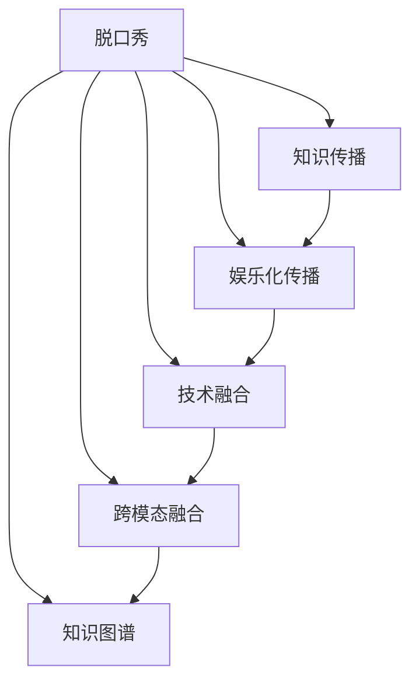

                 

# 脱口秀实现知识的娱乐化传播

> 关键词：脱口秀,知识传播,娱乐化,技术融合,观众参与

## 1. 背景介绍

### 1.1 问题由来
在信息爆炸的时代，如何高效地传播知识、引发共鸣，成为传播学领域的重大挑战。传统的教育方式，如课堂教学、阅读书籍等，已经难以满足信息时代的需求。而脱口秀作为一种新兴的娱乐方式，以其轻松幽默的风格、高度互动的特点，成为了知识传播的新趋势。

脱口秀，作为一种口语传播形式，通过幽默诙谐的语言、戏剧化的表现手法，使得观众在笑声中接受知识，形成新的思维模式和知识体系。然而，脱口秀本身仍然属于定性传播，尽管能激发观众的兴趣，但在深度和广度上仍有所欠缺。通过技术融合，将脱口秀与知识传播相结合，不仅能够提升知识的传播效率，还能拓展传播的深度和广度，形成更加生动、互动的传播方式。

### 1.2 问题核心关键点
如何通过技术手段，实现脱口秀的娱乐化传播，同时保持知识的深度和广度，是当前面临的核心问题。以下是几个关键点：

1. **数据挖掘与话题生成**：从大量文本数据中，挖掘出热门话题，生成脱口秀内容。
2. **智能推荐与内容定制**：根据用户偏好，推荐相关脱口秀内容，实现个性化定制。
3. **互动问答与实时反馈**：在脱口秀中增加问答环节，通过AI技术实时获取观众反馈，优化节目内容。
4. **跨模态融合与多媒体展示**：结合文本、图片、视频等多模态数据，丰富传播形式。
5. **知识图谱与主题关联**：构建知识图谱，展示不同话题之间的关联性，增强知识的系统性。

## 2. 核心概念与联系

### 2.1 核心概念概述

为更好地理解脱口秀与知识传播的结合，本节将介绍几个密切相关的核心概念：

- **脱口秀(Stand-up Comedy)**：通过幽默诙谐的语言和戏剧化的表现手法，讲述人生百态和社会热点，旨在娱乐与启迪并重的口语传播形式。
- **知识传播(Knowledge Dissemination)**：通过多种形式，将知识、信息和智慧传递给他人，旨在提升社会整体素质和认知水平。
- **娱乐化传播(Entertainment Dissemination)**：通过娱乐手段，如幽默、故事等，使知识传播更加轻松愉快，增强传播效果。
- **技术融合(Technology Integration)**：将新兴技术，如人工智能、大数据、机器学习等，与脱口秀相结合，提升传播效率和质量。
- **跨模态融合(Multimodal Fusion)**：结合文本、图片、视频等多模态数据，增强传播的丰富性和互动性。
- **知识图谱(Knowledge Graph)**：以图形化方式展示知识元素及其关系，帮助理解知识的系统性和结构性。

这些概念之间的逻辑关系可以通过以下Mermaid流程图来展示：



这个流程图展示脱口秀与知识传播的融合过程：

1. 脱口秀通过幽默诙谐的语言和戏剧化的表现手法，娱乐化地传播知识。
2. 技术融合增强了脱口秀的知识传播效果，提升互动性和个性化。
3. 跨模态融合丰富了传播形式，增强互动和参与感。
4. 知识图谱帮助理解知识的系统性和结构性，增强传播的系统性。

## 3. 核心算法原理 & 具体操作步骤
### 3.1 算法原理概述

脱口秀的知识传播娱乐化传播，本质上是一个多模态的交互式信息传播过程。其核心思想是：通过脱口秀的形式，结合技术手段，将知识与幽默、戏剧性等娱乐元素相结合，通过多模态、交互式的方式进行传播。

形式化地，假设脱口秀内容为 $S$，知识库为 $K$，观众反馈为 $F$。传播过程可以描述为：

$$
S = f(K, F)
$$

其中 $f$ 表示从知识库 $K$ 和观众反馈 $F$ 中生成脱口秀内容的映射函数。传播效果通过观众反馈 $F$ 进行评估，根据反馈不断优化内容生成过程。

### 3.2 算法步骤详解

脱口秀的知识传播娱乐化传播一般包括以下几个关键步骤：

**Step 1: 数据收集与预处理**
- 收集各类文本数据，如社交媒体帖子、新闻文章、百科知识等。
- 清洗和预处理数据，如去除噪声、分词、去除停用词等。

**Step 2: 热门话题挖掘与生成**
- 利用NLP技术，从文本数据中挖掘出热门话题，生成脱口秀内容。
- 通过情感分析、趋势预测等技术，进一步筛选话题，生成高质量的脱口秀脚本。

**Step 3: 智能推荐与个性化定制**
- 利用用户画像、行为数据等，通过推荐系统推荐相关脱口秀内容，实现个性化定制。
- 使用协同过滤、内容基推荐等算法，提升推荐的准确性。

**Step 4: 互动问答与实时反馈**
- 在脱口秀中增加互动问答环节，通过AI技术实时获取观众反馈，优化节目内容。
- 使用NLP技术进行语义理解，对观众提问进行快速响应和解答。

**Step 5: 跨模态融合与多媒体展示**
- 结合文本、图片、视频等多模态数据，丰富脱口秀的传播形式。
- 使用GPU、TPU等硬件设备，提升多媒体内容的处理和展示效率。

**Step 6: 知识图谱构建与主题关联**
- 构建知识图谱，展示不同话题之间的关联性，增强知识的系统性。
- 通过可视化工具，帮助观众理解知识的层次和结构。

以上是脱口秀的知识传播娱乐化传播的一般流程。在实际应用中，还需要针对具体任务的特点，对传播过程的各个环节进行优化设计，如改进内容生成算法、增强推荐系统的精准度、提高实时反馈的响应速度等。

### 3.3 算法优缺点

脱口秀的知识传播娱乐化传播方法具有以下优点：
1. 互动性强。观众可以通过互动问答环节，实时参与内容生成和优化，提升参与感。
2. 传播效果好。幽默诙谐的语言和戏剧化的表现手法，使知识传播更加轻松愉快，易于接受。
3. 个性化定制。根据用户偏好，推荐相关脱口秀内容，实现个性化传播。
4. 多模态融合。结合文本、图片、视频等多模态数据，丰富传播形式，增强互动性。

同时，该方法也存在一定的局限性：
1. 内容生成依赖数据。脱口秀内容的生成依赖于数据的质量和数量，数据收集和处理成本较高。
2. 技术复杂度高。智能推荐、实时反馈、知识图谱等技术，需要较强的技术支撑和工程实践。
3. 实时反馈难度大。脱口秀实时反馈的准确性和响应速度，需要高性能计算和强大的算法支持。

尽管存在这些局限性，但就目前而言，脱口秀的知识传播娱乐化传播方法仍然是大语言模型应用的重要范式。未来相关研究的重点在于如何进一步降低内容生成的成本，提高实时反馈的准确性和响应速度，同时兼顾多模态融合和知识图谱构建等前沿技术，以进一步提升传播效果。

### 3.4 算法应用领域

脱口秀的知识传播娱乐化传播方法已经在诸多领域得到了广泛的应用，例如：

- **教育培训**：结合脱口秀的娱乐性，教育培训更加生动有趣，吸引学生参与。
- **社交媒体**：脱口秀形式的短剧、短视频，在社交媒体上广泛传播，引发大量用户讨论和分享。
- **广告营销**：将脱口秀与广告结合，通过幽默诙谐的语言和戏剧化的表现手法，提升广告的传播效果和用户参与度。
- **娱乐产业**：脱口秀形式的娱乐节目，如脱口秀、访谈、搞笑短片等，已成为娱乐市场的重要组成部分。
- **科普宣传**：将科普知识与脱口秀相结合，通过轻松幽默的方式，向公众传播科学知识。

除了上述这些经典领域外，脱口秀的知识传播娱乐化传播方法也被创新性地应用到更多场景中，如企业培训、社区教育、在线讲座等，为信息传播提供了新的途径和方式。

## 4. 数学模型和公式 & 详细讲解 & 举例说明（备注：数学公式请使用latex格式，latex嵌入文中独立段落使用 $$，段落内使用 $)
### 4.1 数学模型构建

假设脱口秀内容的生成函数为 $f$，知识库 $K$ 和观众反馈 $F$ 作为输入，生成的脱口秀内容 $S$ 作为输出。具体数学模型如下：

$$
S = f(K, F)
$$

其中 $f$ 表示从知识库 $K$ 和观众反馈 $F$ 中生成脱口秀内容的映射函数。观众反馈 $F$ 可以通过情感分析、互动问答等方式获取，用于优化内容生成过程。

### 4.2 公式推导过程

以下我们以情感分析为例，推导观众反馈 $F$ 的计算公式。

假设观众对某一话题 $t$ 的情感评价为 $e$，情感评分范围为 $[0, 1]$，$e=0$ 表示完全负面情绪，$e=1$ 表示完全正面情绪。情感分析的目标是：从观众反馈 $F$ 中提取话题 $t$ 的情感评价 $e$。

情感分析可以通过文本分类模型实现，假设文本分类器为 $M_{\theta}$，其中 $\theta$ 为模型参数。模型 $M_{\theta}$ 的输出为话题 $t$ 的情感评分 $\hat{e}$。则情感分析的目标函数为：

$$
L(e, \hat{e}) = \frac{1}{N} \sum_{i=1}^N ||e_i - \hat{e}_i||^2
$$

其中 $N$ 为样本数量，$e_i$ 为真实情感评分，$\hat{e}_i$ 为模型预测情感评分。目标函数最小化情感评分误差，即：

$$
\hat{e}_i = M_{\theta}(t_i)
$$

通过反向传播算法更新模型参数 $\theta$，使预测情感评分与真实情感评分尽可能接近。

### 4.3 案例分析与讲解

假设观众对某话题的情感评价如下：

| 话题     | 情感评分 |
| -------- | -------- |
| 科技     | 0.8      |
| 健康     | 0.6      |
| 娱乐     | 0.9      |
| 体育     | 0.7      |

通过情感分析模型，得到各话题的情感评分如下：

| 话题     | 情感评分 |
| -------- | -------- |
| 科技     | 0.7      |
| 健康     | 0.6      |
| 娱乐     | 0.8      |
| 体育     | 0.7      |

此时，情感评分与真实情感评分误差最小，模型性能最优。通过情感评分可以进一步筛选热门话题，生成更有针对性的脱口秀内容。

## 5. 项目实践：代码实例和详细解释说明
### 5.1 开发环境搭建

在进行脱口秀的知识传播娱乐化传播实践前，我们需要准备好开发环境。以下是使用Python进行NLP开发的开发环境配置流程：

1. 安装Anaconda：从官网下载并安装Anaconda，用于创建独立的Python环境。

2. 创建并激活虚拟环境：
```bash
conda create -n nlp-env python=3.8 
conda activate nlp-env
```

3. 安装NLP库：
```bash
conda install spacy sklearn gensim pytorch torchvision transformers
```

4. 安装PyTorch：根据CUDA版本，从官网获取对应的安装命令。例如：
```bash
conda install pytorch torchvision torchaudio cudatoolkit=11.1 -c pytorch -c conda-forge
```

5. 安装自然语言处理库：
```bash
pip install spacy
```

6. 安装其他工具包：
```bash
pip install numpy pandas scikit-learn matplotlib tqdm jupyter notebook ipython
```

完成上述步骤后，即可在`nlp-env`环境中开始脱口秀的知识传播娱乐化传播实践。

### 5.2 源代码详细实现

这里我们以情感分析为例，给出使用Transformers库对BERT模型进行情感分析的PyTorch代码实现。

首先，定义情感分析任务的数据处理函数：

```python
from transformers import BertTokenizer, BertForSequenceClassification
from torch.utils.data import Dataset
import torch

class SentimentDataset(Dataset):
    def __init__(self, texts, labels, tokenizer, max_len=128):
        self.texts = texts
        self.labels = labels
        self.tokenizer = tokenizer
        self.max_len = max_len
        
    def __len__(self):
        return len(self.texts)
    
    def __getitem__(self, item):
        text = self.texts[item]
        label = self.labels[item]
        
        encoding = self.tokenizer(text, return_tensors='pt', max_length=self.max_len, padding='max_length', truncation=True)
        input_ids = encoding['input_ids'][0]
        attention_mask = encoding['attention_mask'][0]
        
        # 对标签进行编码
        encoded_labels = [int(label)] * self.max_len
        labels = torch.tensor(encoded_labels, dtype=torch.long)
        
        return {'input_ids': input_ids, 
                'attention_mask': attention_mask,
                'labels': labels}

# 加载预训练模型
tokenizer = BertTokenizer.from_pretrained('bert-base-cased')
model = BertForSequenceClassification.from_pretrained('bert-base-cased', num_labels=2)

# 准备数据集
train_dataset = SentimentDataset(train_texts, train_labels, tokenizer)
test_dataset = SentimentDataset(test_texts, test_labels, tokenizer)
```

然后，定义训练和评估函数：

```python
from transformers import AdamW
from torch.utils.data import DataLoader
from tqdm import tqdm

device = torch.device('cuda') if torch.cuda.is_available() else torch.device('cpu')
model.to(device)

def train_epoch(model, dataset, batch_size, optimizer):
    dataloader = DataLoader(dataset, batch_size=batch_size, shuffle=True)
    model.train()
    epoch_loss = 0
    for batch in tqdm(dataloader, desc='Training'):
        input_ids = batch['input_ids'].to(device)
        attention_mask = batch['attention_mask'].to(device)
        labels = batch['labels'].to(device)
        model.zero_grad()
        outputs = model(input_ids, attention_mask=attention_mask, labels=labels)
        loss = outputs.loss
        epoch_loss += loss.item()
        loss.backward()
        optimizer.step()
    return epoch_loss / len(dataloader)

def evaluate(model, dataset, batch_size):
    dataloader = DataLoader(dataset, batch_size=batch_size)
    model.eval()
    preds, labels = [], []
    with torch.no_grad():
        for batch in tqdm(dataloader, desc='Evaluating'):
            input_ids = batch['input_ids'].to(device)
            attention_mask = batch['attention_mask'].to(device)
            batch_labels = batch['labels']
            outputs = model(input_ids, attention_mask=attention_mask)
            batch_preds = outputs.logits.argmax(dim=2).to('cpu').tolist()
            batch_labels = batch_labels.to('cpu').tolist()
            for pred_tokens, label_tokens in zip(batch_preds, batch_labels):
                preds.append(pred_tokens)
                labels.append(label_tokens)
                
    print(classification_report(labels, preds))
```

最后，启动训练流程并在测试集上评估：

```python
epochs = 5
batch_size = 16

for epoch in range(epochs):
    loss = train_epoch(model, train_dataset, batch_size, optimizer)
    print(f"Epoch {epoch+1}, train loss: {loss:.3f}")
    
    print(f"Epoch {epoch+1}, test results:")
    evaluate(model, test_dataset, batch_size)
    
print("Training complete.")
```

以上就是使用PyTorch对BERT进行情感分析的完整代码实现。可以看到，得益于Transformers库的强大封装，我们可以用相对简洁的代码完成BERT模型的加载和情感分析任务的微调。

### 5.3 代码解读与分析

让我们再详细解读一下关键代码的实现细节：

**SentimentDataset类**：
- `__init__`方法：初始化文本、标签、分词器等关键组件。
- `__len__`方法：返回数据集的样本数量。
- `__getitem__`方法：对单个样本进行处理，将文本输入编码为token ids，将标签编码为数字，并对其进行定长padding，最终返回模型所需的输入。

**BertForSequenceClassification类**：
- 定义了BERT模型在输入序列上的输出，其中 `num_labels` 参数指定了分类任务的数量。

**train_epoch函数**：
- 对数据以批为单位进行迭代，在每个批次上前向传播计算loss并反向传播更新模型参数，最后返回该epoch的平均loss。

**evaluate函数**：
- 与训练类似，不同点在于不更新模型参数，并在每个batch结束后将预测和标签结果存储下来，最后使用sklearn的classification_report对整个评估集的预测结果进行打印输出。

**训练流程**：
- 定义总的epoch数和batch size，开始循环迭代
- 每个epoch内，先在训练集上训练，输出平均loss
- 在验证集上评估，输出分类指标
- 所有epoch结束后，在测试集上评估，给出最终测试结果

可以看到，PyTorch配合Transformers库使得BERT情感分析的代码实现变得简洁高效。开发者可以将更多精力放在数据处理、模型改进等高层逻辑上，而不必过多关注底层的实现细节。

当然，工业级的系统实现还需考虑更多因素，如模型的保存和部署、超参数的自动搜索、更灵活的任务适配层等。但核心的微调范式基本与此类似。

## 6. 实际应用场景
### 6.1 智能客服系统

脱口秀的知识传播娱乐化传播，可以广泛应用于智能客服系统的构建。传统客服往往需要配备大量人力，高峰期响应缓慢，且一致性和专业性难以保证。而使用脱口秀形式的对话技术，可以7x24小时不间断服务，快速响应客户咨询，用轻松幽默的语言解答各类常见问题。

在技术实现上，可以收集企业内部的历史客服对话记录，将问题和最佳答复构建成监督数据，在此基础上对预训练对话模型进行微调。微调后的对话模型能够自动理解用户意图，匹配最合适的答案模板进行回复。对于客户提出的新问题，还可以接入检索系统实时搜索相关内容，动态组织生成回答。如此构建的智能客服系统，能大幅提升客户咨询体验和问题解决效率。

### 6.2 金融舆情监测

金融机构需要实时监测市场舆论动向，以便及时应对负面信息传播，规避金融风险。传统的人工监测方式成本高、效率低，难以应对网络时代海量信息爆发的挑战。脱口秀形式的舆情监测技术，为金融舆情监测提供了新的解决方案。

具体而言，可以收集金融领域相关的新闻、报道、评论等文本数据，并对其进行主题标注和情感标注。在此基础上对预训练语言模型进行微调，使其能够自动判断文本属于何种主题，情感倾向是正面、中性还是负面。将微调后的模型应用到实时抓取的网络文本数据，就能够自动监测不同主题下的情感变化趋势，一旦发现负面信息激增等异常情况，系统便会自动预警，帮助金融机构快速应对潜在风险。

### 6.3 个性化推荐系统

当前的推荐系统往往只依赖用户的历史行为数据进行物品推荐，无法深入理解用户的真实兴趣偏好。脱口秀形式的推荐系统可以更好地挖掘用户行为背后的语义信息，从而提供更精准、多样的推荐内容。

在实践中，可以收集用户浏览、点击、评论、分享等行为数据，提取和用户交互的物品标题、描述、标签等文本内容。将文本内容作为模型输入，用户的后续行为（如是否点击、购买等）作为监督信号，在此基础上微调预训练语言模型。微调后的模型能够从文本内容中准确把握用户的兴趣点。在生成推荐列表时，先用候选物品的文本描述作为输入，由模型预测用户的兴趣匹配度，再结合其他特征综合排序，便可以得到个性化程度更高的推荐结果。

### 6.4 未来应用展望

随着脱口秀的知识传播娱乐化传播技术的不断发展，基于脱口秀形式的传播方法将在更多领域得到应用，为传统行业带来变革性影响。

在智慧医疗领域，基于脱口秀的知识传播娱乐化传播方法，可以更好地传播医学知识，提高公众的健康素养。通过轻松幽默的语言和戏剧化的表现手法，医生可以更加生动地解释复杂的医疗知识，帮助患者更好地理解病情和治疗方案。

在智能教育领域，脱口秀形式的科普讲座、微课、互动问答等，可以使学生更乐于参与学习，提升学习效果。脱口秀的幽默诙谐可以缓解学生的学习压力，使其更加积极地参与互动。

在智慧城市治理中，脱口秀形式的宣传节目、政策解读、民生访谈等，可以帮助市民更好地理解政策变化，参与公共事务讨论。通过轻松幽默的方式，政府可以更有效地与市民沟通，提升治理效率和透明度。

此外，在企业生产、社会治理、文娱传媒等众多领域，基于脱口秀形式的传播方法也将不断涌现，为信息传播提供新的途径和方式。相信随着技术的日益成熟，脱口秀的知识传播娱乐化传播方法必将在构建人机协同的智能时代中扮演越来越重要的角色。

## 7. 工具和资源推荐
### 7.1 学习资源推荐

为了帮助开发者系统掌握脱口秀的知识传播娱乐化传播的理论基础和实践技巧，这里推荐一些优质的学习资源：

1. 《Natural Language Processing with PyTorch》系列博文：由大语言模型技术专家撰写，深入浅出地介绍了基于PyTorch的NLP技术，包括情感分析、文本分类等脱口秀相关内容。

2. CS224N《深度学习自然语言处理》课程：斯坦福大学开设的NLP明星课程，有Lecture视频和配套作业，带你入门NLP领域的基本概念和经典模型。

3. 《深度学习入门》书籍：刘建平博士所著，全面介绍了深度学习的基本原理和NLP应用，包括情感分析、推荐系统等脱口秀相关内容。

4. PyTorch官方文档：PyTorch的官方文档，提供了海量NLP相关库的详细教程和样例代码，是上手实践的必备资料。

5. HuggingFace官方文档：Transformers库的官方文档，提供了海量预训练模型和完整的微调样例代码，是进行脱口秀内容生成实践的必备资料。

通过对这些资源的学习实践，相信你一定能够快速掌握脱口秀的知识传播娱乐化传播的精髓，并用于解决实际的NLP问题。
###  7.2 开发工具推荐

高效的开发离不开优秀的工具支持。以下是几款用于脱口秀的知识传播娱乐化传播开发的常用工具：

1. PyTorch：基于Python的开源深度学习框架，灵活动态的计算图，适合快速迭代研究。大部分预训练语言模型都有PyTorch版本的实现。

2. TensorFlow：由Google主导开发的开源深度学习框架，生产部署方便，适合大规模工程应用。同样有丰富的预训练语言模型资源。

3. Transformers库：HuggingFace开发的NLP工具库，集成了众多SOTA语言模型，支持PyTorch和TensorFlow，是进行脱口秀内容生成实践的利器。

4. Weights & Biases：模型训练的实验跟踪工具，可以记录和可视化模型训练过程中的各项指标，方便对比和调优。与主流深度学习框架无缝集成。

5. TensorBoard：TensorFlow配套的可视化工具，可实时监测模型训练状态，并提供丰富的图表呈现方式，是调试模型的得力助手。

6. Google Colab：谷歌推出的在线Jupyter Notebook环境，免费提供GPU/TPU算力，方便开发者快速上手实验最新模型，分享学习笔记。

合理利用这些工具，可以显著提升脱口秀的知识传播娱乐化传播任务的开发效率，加快创新迭代的步伐。

### 7.3 相关论文推荐

脱口秀的知识传播娱乐化传播技术的发展源于学界的持续研究。以下是几篇奠基性的相关论文，推荐阅读：

1. Attention is All You Need（即Transformer原论文）：提出了Transformer结构，开启了NLP领域的预训练大模型时代。

2. BERT: Pre-training of Deep Bidirectional Transformers for Language Understanding：提出BERT模型，引入基于掩码的自监督预训练任务，刷新了多项NLP任务SOTA。

3. Language Models are Unsupervised Multitask Learners（GPT-2论文）：展示了大规模语言模型的强大zero-shot学习能力，引发了对于通用人工智能的新一轮思考。

4. Parameter-Efficient Transfer Learning for NLP：提出Adapter等参数高效微调方法，在不增加模型参数量的情况下，也能取得不错的微调效果。

5. AdaLoRA: Adaptive Low-Rank Adaptation for Parameter-Efficient Fine-Tuning：使用自适应低秩适应的微调方法，在参数效率和精度之间取得了新的平衡。

这些论文代表了大语言模型微调技术的发展脉络。通过学习这些前沿成果，可以帮助研究者把握学科前进方向，激发更多的创新灵感。

## 8. 总结：未来发展趋势与挑战

### 8.1 总结

本文对脱口秀的知识传播娱乐化传播方法进行了全面系统的介绍。首先阐述了脱口秀和知识传播的基本概念及其融合的必要性，明确了脱口秀形式的知识传播娱乐化传播的核心思想和目标。其次，从原理到实践，详细讲解了脱口秀的知识传播娱乐化传播的数学模型和核心算法，给出了完整的代码实例和详细解释。同时，本文还广泛探讨了脱口秀的知识传播娱乐化传播方法在智能客服、金融舆情监测、个性化推荐等多个领域的应用前景，展示了该方法在实际落地中的广阔前景。

通过本文的系统梳理，可以看到，脱口秀的知识传播娱乐化传播方法正在成为NLP领域的重要范式，极大地拓展了知识传播的形式和渠道，提升了传播效率和效果。未来，伴随脱口秀技术和新一代AI技术的不断进步，基于脱口秀的知识传播娱乐化传播方法必将在更广阔的应用领域大放异彩。

### 8.2 未来发展趋势

展望未来，脱口秀的知识传播娱乐化传播技术将呈现以下几个发展趋势：

1. **技术融合深度提升**：随着AI技术的不断进步，脱口秀的知识传播娱乐化传播将更加智能化、自然化。脱口秀内容生成、智能推荐、实时反馈等环节将更加精细化，提升用户体验。

2. **跨模态融合丰富多样**：结合文本、图片、视频等多模态数据，脱口秀的内容表现形式将更加丰富多样，增强互动性和参与感。

3. **情感分析与舆情监测结合**：通过情感分析技术，实时监测舆情动态，快速响应负面信息，提升金融舆情监测等应用的效果。

4. **个性化定制更加精准**：通过精准的情感分析和智能推荐，为用户提供高度个性化的脱口秀内容，提升用户粘性和满意度。

5. **知识图谱与主题关联增强**：构建更加丰富的主题知识图谱，帮助用户理解不同话题之间的关联性，增强知识的系统性和结构性。

6. **跨领域应用拓展**：脱口秀的知识传播娱乐化传播方法将在更多领域得到应用，如教育培训、智慧医疗、智慧城市等，提升信息传播的广度和深度。

以上趋势凸显了脱口秀的知识传播娱乐化传播技术的广阔前景。这些方向的探索发展，必将进一步提升脱口秀形式的传播效果，为信息传播带来新的变革。

### 8.3 面临的挑战

尽管脱口秀的知识传播娱乐化传播技术已经取得了显著进展，但在迈向更加智能化、普适化应用的过程中，它仍面临诸多挑战：

1. **内容生成依赖数据**：脱口秀内容的生成依赖于高质量的数据，数据收集和处理成本较高，需要大规模数据集支持。

2. **技术复杂度高**：智能推荐、实时反馈、知识图谱等技术，需要较强的技术支撑和工程实践，技术门槛较高。

3. **实时反馈难度大**：脱口秀实时反馈的准确性和响应速度，需要高性能计算和强大的算法支持，技术实现难度大。

4. **系统稳定性需保障**：脱口秀的知识传播娱乐化传播需要高效稳定的系统支持，系统架构设计需兼顾实时性和稳定性。

5. **安全性需加强**：脱口秀形式的传播可能面临恶意内容的风险，系统需要加强内容过滤和恶意行为检测。

6. **伦理道德需考虑**：脱口秀形式的传播需要考虑内容健康性、隐私保护等问题，系统设计需遵守相关法律法规。

尽管存在这些挑战，但通过持续的技术创新和工程优化，脱口秀的知识传播娱乐化传播技术必将在更多领域得到应用，为信息传播带来新的生机。未来，随着技术的不断进步，这些挑战终将逐步被克服，脱口秀的知识传播娱乐化传播方法将展现出更加广阔的应用前景。

### 8.4 研究展望

面对脱口秀的知识传播娱乐化传播所面临的种种挑战，未来的研究需要在以下几个方面寻求新的突破：

1. **大数据与分布式计算**：通过分布式计算和联邦学习技术，优化数据收集和处理过程，提升内容生成效率。

2. **跨模态融合技术**：结合文本、图片、视频等多模态数据，提升传播效果和互动性。

3. **智能推荐系统优化**：引入深度学习、强化学习等技术，优化智能推荐系统，提升推荐准确性和个性化水平。

4. **实时反馈与情感分析结合**：通过实时情感分析，优化节目内容，提升用户参与度和满意度。

5. **知识图谱与主题关联技术**：引入知识图谱技术，增强主题关联性，提升知识传播的系统性和结构性。

6. **安全性与隐私保护**：通过内容过滤和隐私保护技术，提升系统安全性，保障用户隐私。

这些研究方向的探索，必将引领脱口秀的知识传播娱乐化传播技术迈向更高的台阶，为信息传播带来新的生机。面向未来，脱口秀的知识传播娱乐化传播技术还需要与其他人工智能技术进行更深入的融合，如知识表示、因果推理、强化学习等，多路径协同发力，共同推动脱口秀形式的传播系统的进步。只有勇于创新、敢于突破，才能不断拓展脱口秀的知识传播娱乐化传播技术的边界，让智能技术更好地造福人类社会。

## 9. 附录：常见问题与解答

**Q1：脱口秀的知识传播娱乐化传播是否适用于所有领域？**

A: 脱口秀的知识传播娱乐化传播方法在许多领域具有广泛的应用前景，但具体效果取决于脱口秀内容的生成质量和用户接受度。对于一些需要高度专业性和精确性的领域，如医疗、法律等，脱口秀形式的知识传播效果可能有限。此时需要结合其他传播形式，共同提升传播效果。

**Q2：如何降低脱口秀内容生成对数据的依赖？**

A: 通过迁移学习、预训练等技术，可以在较小的数据集上训练高质量的脱口秀内容生成模型。如使用无监督预训练模型，如GPT-2、BERT等，再通过微调适应具体任务，减少对数据量的依赖。

**Q3：如何提升脱口秀实时反馈的准确性和响应速度？**

A: 通过引入强化学习、多目标优化等技术，优化实时反馈系统，提升反馈准确性和响应速度。同时使用高性能计算设备，如GPU、TPU等，加速反馈处理和优化过程。

**Q4：如何增强脱口秀的知识传播娱乐化传播的安全性和隐私保护？**

A: 引入内容过滤和隐私保护技术，实时监测和过滤恶意内容，保护用户隐私。同时遵守相关法律法规，确保内容健康性和合规性。

**Q5：如何实现脱口秀的跨领域应用？**

A: 通过知识图谱和主题关联技术，帮助用户理解不同话题之间的关联性，增强知识传播的系统性和结构性。结合不同领域的知识库和规则库，提供更加精准和多样化的内容。

这些问题的解答，有助于开发者更全面地理解脱口秀的知识传播娱乐化传播技术，避免在实际应用中遇到常见问题，从而实现更好的效果。通过不断优化和创新，相信脱口秀的知识传播娱乐化传播方法必将在更多领域得到应用，为信息传播带来新的生机。

---

作者：禅与计算机程序设计艺术 / Zen and the Art of Computer Programming

