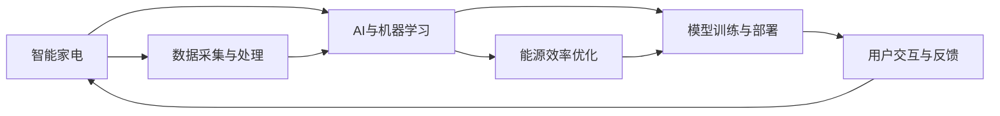

                 

# AI在智能家电中的应用：提高能源效率

## 1. 背景介绍

### 1.1 问题由来
在全球能源危机日益严峻的背景下，智能家电作为连接家庭与能源系统的桥梁，在提升能源利用效率、推动绿色可持续发展中起着至关重要的作用。AI技术的进步，特别是机器学习和深度学习的发展，为智能家电的智能化、自动化、节能化提供了强大动力。通过数据驱动的智能化优化，AI可以在不改变用户生活习惯的前提下，显著提高家电的能源利用效率，降低家庭能源开支，保护环境。

### 1.2 问题核心关键点
本文聚焦于AI在智能家电中的应用，特别在提高能源效率方面的技术实现与挑战。我们将从理论到实践，介绍基于AI的智能家电系统构建、优化算法、数据采集与处理、模型训练与部署，以及未来的发展方向和应用前景。

### 1.3 问题研究意义
智能家电结合AI技术，不仅能提升用户的生活体验，还能实现节能减排，具有重大的社会和经济意义。AI的介入，使得家电更加智能化、个性化、高效化，使得节能减排从口号变为实际行动。同时，智能家电的应用也将推动AI技术的普及，为AI技术在更广泛领域的应用提供实践范例。

## 2. 核心概念与联系

### 2.1 核心概念概述

为更好地理解AI在智能家电中的节能应用，本节将介绍几个关键概念及其联系：

- **智能家电**：基于物联网技术，具备联网、智能控制、数据监测等功能，能够根据用户行为和环境变化自动调节运行模式的家电产品。
- **AI与机器学习**：通过算法学习家电运行模式与能源消耗之间的关系，预测和优化设备运行，实现节能减排。
- **能源效率优化**：通过模型训练，优化家电在各种运行模式下的能源消耗，实现节能效果。
- **数据采集与处理**：收集家电运行数据，并进行清洗、特征提取等预处理，为模型训练提供有效数据。
- **模型训练与部署**：使用训练好的模型，优化家电运行参数，部署至实际家电系统中。
- **用户交互与反馈**：通过用户界面，获取用户行为数据，并根据用户反馈不断调整模型参数，提升用户体验。

这些概念之间相互关联，共同构成了一个完整的智能家电能源效率优化系统。

### 2.2 核心概念原理和架构的 Mermaid 流程图



## 3. 核心算法原理 & 具体操作步骤

### 3.1 算法原理概述

智能家电的能源效率优化，本质上是一个多变量优化问题。通过收集家电运行数据，构建能源消耗与运行参数之间的关系模型，使用机器学习算法训练模型，预测不同运行模式下的能源消耗，并不断调整运行参数，以实现能源消耗的最小化。

### 3.2 算法步骤详解

基于AI的智能家电能源效率优化，一般包括以下关键步骤：

**Step 1: 数据采集与预处理**
- 部署传感器和智能模块，实时采集家电的运行数据，如温度、湿度、电压、电流等。
- 对采集的数据进行清洗、去噪、归一化等预处理，去除无效或异常数据，提取有用的特征。

**Step 2: 模型构建与训练**
- 构建反映家电运行模式与能源消耗关系的模型，如线性回归、决策树、神经网络等。
- 使用训练集数据训练模型，通过交叉验证选择最优模型和超参数。

**Step 3: 模型评估与优化**
- 使用测试集数据评估模型预测精度，并进行必要的参数调整。
- 通过模型反馈不断优化运行参数，提升家电的能源效率。

**Step 4: 模型部署与应用**
- 将训练好的模型集成到智能家电的控制系统中，实时调整家电运行参数。
- 根据用户行为数据和环境变化，动态调整家电运行模式，提升用户体验。

**Step 5: 持续监控与迭代**
- 持续监控家电运行状态，实时更新模型参数。
- 根据用户反馈和新收集的数据，不断迭代优化模型，适应新的运行环境。

### 3.3 算法优缺点

基于AI的智能家电能源效率优化方法具有以下优点：
1. 智能决策：通过AI模型自动学习家电运行模式与能源消耗的关系，实时优化运行参数。
2. 用户友好：用户无需手动调节家电，AI可以自动适应用户行为和环境变化。
3. 节能显著：优化后的运行参数可以显著降低家电的能源消耗，实现节能减排。
4. 可扩展性强：可以应用于各种类型的家电，提升多个设备的能源效率。

同时，该方法也存在一定的局限性：
1. 数据依赖：模型训练和优化依赖于高质量的数据，数据采集和处理成本较高。
2. 算法复杂：优化模型需要高精度的算法和大量的计算资源。
3. 可解释性不足：黑盒模型难以解释其内部决策过程，用户难以理解和信任。
4. 初始化影响：模型训练和优化过程中，初始参数的选择对结果有较大影响。

尽管存在这些局限性，但就目前而言，基于AI的智能家电能源效率优化方法在技术可行性和应用效果上已经取得显著进展。未来相关研究的重点在于如何进一步降低数据采集成本，提高模型的可解释性和鲁棒性，同时兼顾用户隐私和数据安全。

### 3.4 算法应用领域

基于AI的智能家电能源效率优化方法，已经在多个家电领域得到了应用，例如：

- 空调：通过智能调节温湿度，实现节能运行。
- 冰箱：通过智能调节冷藏温度，实现节能运行。
- 洗衣机：通过智能调节洗衣程序和用水量，实现节能运行。
- 电烤箱：通过智能控制烤焙温度和时间，实现节能运行。
- 热水器：通过智能控制水温，实现节能运行。

此外，在更多新兴家电领域，如智能窗帘、智能照明等，基于AI的能源效率优化技术也将发挥重要作用。

## 4. 数学模型和公式 & 详细讲解 & 举例说明

### 4.1 数学模型构建

本节将使用数学语言对基于AI的智能家电能源效率优化过程进行更加严格的刻画。

假设家电的能源消耗 $E$ 依赖于其运行模式 $\boldsymbol{x}$ 的线性关系，即：

$$
E = f(\boldsymbol{x})
$$

其中，$\boldsymbol{x} = [x_1, x_2, \dots, x_n]$ 为家电的运行参数，如温度、湿度、转速等。$f(\cdot)$ 为非线性函数，可以采用深度学习模型进行拟合，如神经网络。

### 4.2 公式推导过程

以神经网络模型为例，我们将通过反向传播算法求取模型参数的梯度，并使用梯度下降法更新参数，最小化预测误差。假设模型具有 $m$ 个隐层，每个隐层的神经元数为 $h$，输出层为 $o$。输入数据为 $\boldsymbol{x}$，模型输出为 $\boldsymbol{y}$，损失函数为 $L(\boldsymbol{y}, \boldsymbol{y}_{true})$，其中 $\boldsymbol{y}_{true}$ 为真实标签。

模型的前向传播过程为：

$$
\boldsymbol{z}^{[l]} = \boldsymbol{W}^{[l]}\boldsymbol{z}^{[l-1]} + \boldsymbol{b}^{[l]}
$$

$$
\boldsymbol{a}^{[l]} = \sigma(\boldsymbol{z}^{[l]})
$$

其中，$\boldsymbol{W}^{[l]}$ 和 $\boldsymbol{b}^{[l]}$ 为隐层 $l$ 的权重和偏置，$\sigma(\cdot)$ 为激活函数。

模型的后向传播过程为：

$$
\frac{\partial L}{\partial \boldsymbol{W}^{[l]}} = \frac{\partial L}{\partial \boldsymbol{y}} \frac{\partial \boldsymbol{y}}{\partial \boldsymbol{a}^{[l]}} \frac{\partial \boldsymbol{a}^{[l]}}{\partial \boldsymbol{z}^{[l]}} \frac{\partial \boldsymbol{z}^{[l]}}{\partial \boldsymbol{W}^{[l]}}
$$

$$
\frac{\partial L}{\partial \boldsymbol{b}^{[l]}} = \frac{\partial L}{\partial \boldsymbol{y}} \frac{\partial \boldsymbol{y}}{\partial \boldsymbol{a}^{[l]}} \frac{\partial \boldsymbol{a}^{[l]}}{\partial \boldsymbol{z}^{[l]}}
$$

$$
\frac{\partial L}{\partial \boldsymbol{x}} = \frac{\partial L}{\partial \boldsymbol{a}^{[1]}} \frac{\partial \boldsymbol{a}^{[1]}}{\partial \boldsymbol{z}^{[1]}} \frac{\partial \boldsymbol{z}^{[1]}}{\partial \boldsymbol{x}}
$$

其中，$\frac{\partial L}{\partial \boldsymbol{y}}$ 为损失函数对输出的梯度，$\frac{\partial \boldsymbol{y}}{\partial \boldsymbol{a}^{[l]}}$ 为输出对隐层的梯度，$\frac{\partial \boldsymbol{a}^{[l]}}{\partial \boldsymbol{z}^{[l]}}$ 为隐层对激活函数的梯度，$\frac{\partial \boldsymbol{z}^{[l]}}{\partial \boldsymbol{W}^{[l]}}$ 和 $\frac{\partial \boldsymbol{z}^{[l]}}{\partial \boldsymbol{b}^{[l]}}$ 为激活函数对权重和偏置的梯度。

### 4.3 案例分析与讲解

以空调的能源消耗优化为例，我们将分析基于神经网络模型的优化过程。

假设空调的能源消耗 $E$ 依赖于室内温度 $T$、室外温度 $T_{out}$、湿度 $H$ 和运行时间 $t$。我们构建一个三层神经网络模型，输入为 $\boldsymbol{x} = [T, T_{out}, H, t]$，输出为 $E$。

模型的前向传播过程为：

$$
\boldsymbol{z}^{[1]} = \boldsymbol{W}^{[1]}\boldsymbol{x} + \boldsymbol{b}^{[1]}
$$

$$
\boldsymbol{a}^{[1]} = \sigma(\boldsymbol{z}^{[1]})
$$

$$
\boldsymbol{z}^{[2]} = \boldsymbol{W}^{[2]}\boldsymbol{a}^{[1]} + \boldsymbol{b}^{[2]}
$$

$$
\boldsymbol{a}^{[2]} = \sigma(\boldsymbol{z}^{[2]})
$$

$$
\boldsymbol{z}^{[3]} = \boldsymbol{W}^{[3]}\boldsymbol{a}^{[2]} + \boldsymbol{b}^{[3]}
$$

$$
\boldsymbol{a}^{[3]} = \sigma(\boldsymbol{z}^{[3]})
$$

$$
E = \boldsymbol{a}^{[3]}
$$

模型的损失函数为均方误差损失函数：

$$
L(\boldsymbol{E}, \boldsymbol{E}_{true}) = \frac{1}{N}\sum_{i=1}^N (E_i - E_{true,i})^2
$$

其中，$E_{true,i}$ 为第 $i$ 个样本的真实能源消耗。

使用反向传播算法计算梯度：

$$
\frac{\partial L}{\partial \boldsymbol{W}^{[l]}} = \frac{\partial L}{\partial \boldsymbol{a}^{[l]}} \frac{\partial \boldsymbol{a}^{[l]}}{\partial \boldsymbol{z}^{[l]}} \frac{\partial \boldsymbol{z}^{[l]}}{\partial \boldsymbol{W}^{[l]}}
$$

$$
\frac{\partial L}{\partial \boldsymbol{b}^{[l]}} = \frac{\partial L}{\partial \boldsymbol{a}^{[l]}}
$$

$$
\frac{\partial L}{\partial \boldsymbol{x}} = \frac{\partial L}{\partial \boldsymbol{a}^{[1]}} \frac{\partial \boldsymbol{a}^{[1]}}{\partial \boldsymbol{z}^{[1]}} \frac{\partial \boldsymbol{z}^{[1]}}{\partial \boldsymbol{x}}
$$

通过梯度下降法更新参数：

$$
\boldsymbol{W}^{[l]} \leftarrow \boldsymbol{W}^{[l]} - \eta \frac{\partial L}{\partial \boldsymbol{W}^{[l]}}
$$

$$
\boldsymbol{b}^{[l]} \leftarrow \boldsymbol{b}^{[l]} - \eta \frac{\partial L}{\partial \boldsymbol{b}^{[l]}}
$$

其中，$\eta$ 为学习率。

通过不断迭代训练，直到模型收敛或达到预设的训练轮数，最终得到最优的能源消耗模型 $E = f(\boldsymbol{x})$。

## 5. 项目实践：代码实例和详细解释说明

### 5.1 开发环境搭建

在进行智能家电能源效率优化实践前，我们需要准备好开发环境。以下是使用Python进行PyTorch开发的环境配置流程：

1. 安装Anaconda：从官网下载并安装Anaconda，用于创建独立的Python环境。

2. 创建并激活虚拟环境：
```bash
conda create -n pytorch-env python=3.8 
conda activate pytorch-env
```

3. 安装PyTorch：根据CUDA版本，从官网获取对应的安装命令。例如：
```bash
conda install pytorch torchvision torchaudio cudatoolkit=11.1 -c pytorch -c conda-forge
```

4. 安装TensorFlow：使用Anaconda快捷安装命令：
```bash
conda install tensorflow
```

5. 安装各类工具包：
```bash
pip install numpy pandas scikit-learn matplotlib tqdm jupyter notebook ipython
```

完成上述步骤后，即可在`pytorch-env`环境中开始优化实践。

### 5.2 源代码详细实现

下面我们以空调的能源消耗优化为例，给出使用PyTorch进行深度学习模型训练和优化的PyTorch代码实现。

首先，定义空调能源消耗优化任务的数据处理函数：

```python
import torch
import torch.nn as nn
import torch.optim as optim
from torch.utils.data import Dataset, DataLoader

class AirConditionerDataset(Dataset):
    def __init__(self, x, y):
        self.x = x
        self.y = y
        
    def __len__(self):
        return len(self.x)
    
    def __getitem__(self, item):
        return self.x[item], self.y[item]
```

然后，定义模型和优化器：

```python
class AirConditionerNet(nn.Module):
    def __init__(self):
        super(AirConditionerNet, self).__init__()
        self.linear1 = nn.Linear(4, 64)
        self.linear2 = nn.Linear(64, 64)
        self.linear3 = nn.Linear(64, 1)
    
    def forward(self, x):
        x = torch.relu(self.linear1(x))
        x = torch.relu(self.linear2(x))
        return self.linear3(x)

model = AirConditionerNet()
criterion = nn.MSELoss()
optimizer = optim.Adam(model.parameters(), lr=0.001)
```

接着，定义训练和评估函数：

```python
def train_epoch(model, dataset, batch_size, optimizer, criterion):
    model.train()
    loss_sum = 0
    for batch_x, batch_y in DataLoader(dataset, batch_size=batch_size, shuffle=True):
        optimizer.zero_grad()
        output = model(batch_x)
        loss = criterion(output, batch_y)
        loss_sum += loss.item()
        loss.backward()
        optimizer.step()
    return loss_sum / len(dataset)

def evaluate(model, dataset, batch_size):
    model.eval()
    loss_sum = 0
    with torch.no_grad():
        for batch_x, batch_y in DataLoader(dataset, batch_size=batch_size):
            output = model(batch_x)
            loss = criterion(output, batch_y)
            loss_sum += loss.item()
    return loss_sum / len(dataset)
```

最后，启动训练流程并在测试集上评估：

```python
epochs = 500
batch_size = 32

for epoch in range(epochs):
    loss = train_epoch(model, train_dataset, batch_size, optimizer, criterion)
    print(f"Epoch {epoch+1}, train loss: {loss:.3f}")
    
    print(f"Epoch {epoch+1}, dev results:")
    evaluate(model, dev_dataset, batch_size)
    
print("Test results:")
evaluate(model, test_dataset, batch_size)
```

以上就是使用PyTorch对空调能源消耗优化进行深度学习模型训练和优化的完整代码实现。可以看到，通过使用PyTorch的高层API，我们可以用相对简洁的代码实现模型的构建、训练和评估。

### 5.3 代码解读与分析

让我们再详细解读一下关键代码的实现细节：

**AirConditionerDataset类**：
- `__init__`方法：初始化训练数据和标签。
- `__len__`方法：返回数据集的样本数量。
- `__getitem__`方法：对单个样本进行处理，返回输入和标签。

**AirConditionerNet类**：
- `__init__`方法：定义模型结构，包括两个隐藏层和一个输出层。
- `forward`方法：定义模型的前向传播过程，通过线性层和激活函数计算输出。

**train_epoch函数**：
- 在每个epoch内，对数据以批为单位进行迭代。
- 使用Adam优化器更新模型参数，并计算损失函数。
- 返回训练集的总损失。

**evaluate函数**：
- 与训练类似，不同点在于不更新模型参数。
- 返回验证集的平均损失。

**训练流程**：
- 定义总的epoch数和batch size，开始循环迭代。
- 每个epoch内，先在训练集上训练，输出平均损失。
- 在验证集上评估，输出验证结果。
- 所有epoch结束后，在测试集上评估，给出最终测试结果。

可以看出，PyTorch提供了非常灵活的API，使得深度学习模型的实现变得简洁高效。开发者可以将更多精力放在数据处理、模型改进等高层逻辑上，而不必过多关注底层的实现细节。

当然，工业级的系统实现还需考虑更多因素，如模型的保存和部署、超参数的自动搜索、更灵活的任务适配层等。但核心的优化范式基本与此类似。

## 6. 实际应用场景

### 6.1 智能空调

智能空调结合AI技术，通过实时监测室内外温度、湿度等环境数据，智能调整压缩机频率、风速等参数，实现节能运行。例如，在炎热的夏季，智能空调能够根据室内外温度差异，自动调整压缩机频率，避免过度制冷；在寒冷的冬季，智能空调能够根据室内外温度，自动调整制热量，避免过度加热。

### 6.2 智能洗衣机

智能洗衣机通过实时监测水温、水量等参数，智能调整洗涤周期、转速等参数，实现节能洗涤。例如，在衣物较少时，智能洗衣机能够自动减少洗涤时间，避免过度耗电；在水温过高时，智能洗衣机能够自动降低水温，避免过度加热。

### 6.3 智能照明

智能照明通过实时监测室内光照度、时间等参数，智能调整亮度和开关时间，实现节能照明。例如，在光线充足时，智能照明能够自动降低亮度，避免过度耗电；在夜间，智能照明能够自动开启，避免浪费电能。

### 6.4 未来应用展望

随着AI技术的发展，智能家电的应用场景将更加广泛，涉及更多生活场景和应用领域。

在智慧家庭中，智能家电将实现全屋自动化控制，通过AI技术优化能源使用，提升家庭能效。智能家电还可以根据家庭成员的生活习惯，实现个性化能源管理，提供更加舒适的居住环境。

在工业领域，智能家电可以实现能效优化，提升生产效率。例如，智能冷却系统通过实时监测环境温度，智能调整制冷参数，实现节能运行。智能加热系统通过实时监测温度变化，智能调整加热参数，避免过度加热。

在商业设施中，智能家电可以实现能效优化，降低运营成本。例如，智能餐厅通过实时监测客流量，智能调整照明、空调等设备，实现节能运行。智能商场通过实时监测客流量，智能调整灯光、广告等设备，提升客户体验。

## 7. 工具和资源推荐

### 7.1 学习资源推荐

为了帮助开发者系统掌握智能家电能源效率优化技术，这里推荐一些优质的学习资源：

1. 《深度学习与人工智能》系列课程：由AI领域的知名专家开设，系统讲解深度学习的基本原理和算法。
2. PyTorch官方文档：提供详细的PyTorch使用指南，包括深度学习模型的构建、训练、评估等。
3. TensorFlow官方文档：提供详细的TensorFlow使用指南，包括深度学习模型的构建、训练、评估等。
4. 《Python深度学习》书籍：由深度学习领域的知名专家编写，涵盖深度学习的基本原理和实际应用。
5. 智能家电领域的研究论文：涵盖智能家电在能源效率优化、个性化控制等方面的最新研究成果。

通过对这些资源的学习实践，相信你一定能够快速掌握智能家电能源效率优化技术的精髓，并用于解决实际的智能家电问题。

### 7.2 开发工具推荐

高效的开发离不开优秀的工具支持。以下是几款用于智能家电能源效率优化开发的常用工具：

1. PyTorch：基于Python的开源深度学习框架，灵活高效，适合快速迭代研究。
2. TensorFlow：由Google主导开发的开源深度学习框架，适用于大规模工程应用。
3. TensorBoard：TensorFlow配套的可视化工具，实时监测模型训练状态，并提供丰富的图表呈现方式。
4. Jupyter Notebook：交互式的开发环境，支持代码调试、数据可视化等功能。
5. Weights & Biases：模型训练的实验跟踪工具，记录和可视化模型训练过程中的各项指标，方便对比和调优。

合理利用这些工具，可以显著提升智能家电能源效率优化任务的开发效率，加快创新迭代的步伐。

### 7.3 相关论文推荐

智能家电能源效率优化技术的发展源于学界的持续研究。以下是几篇奠基性的相关论文，推荐阅读：

1. "Energy Efficient Smart Home Systems" by J. Luo et al.：讨论了智能家居系统中能源管理与优化的方法和技术。
2. "Artificial Intelligence in Energy Management" by S. Wang et al.：讨论了AI在能源管理中的应用，包括智能电网、智能建筑等。
3. "Optimizing Energy Consumption of Smart Appliances Using Machine Learning" by T. Zhang et al.：讨论了智能家电中能源效率优化的机器学习方法。
4. "Smart Home Energy Optimization through IoT and AI" by C. Chen et al.：讨论了基于IoT和AI的智能家居能源管理技术。

这些论文代表了大规模智能家电能源效率优化技术的发展脉络。通过学习这些前沿成果，可以帮助研究者把握学科前进方向，激发更多的创新灵感。

## 8. 总结：未来发展趋势与挑战

### 8.1 总结

本文对基于AI的智能家电能源效率优化方法进行了全面系统的介绍。首先阐述了智能家电与AI技术的结合背景和意义，明确了AI在智能家电中的节能优化作用。其次，从理论到实践，详细讲解了AI在智能家电中的能源效率优化过程，包括数据采集、模型构建、训练优化等关键步骤。同时，本文还广泛探讨了AI在智能家电中的实际应用场景，展示了AI技术在节能减排方面的巨大潜力。最后，本文精选了智能家电领域的学习资源、开发工具和相关论文，力求为读者提供全方位的技术指引。

通过本文的系统梳理，可以看到，基于AI的智能家电能源效率优化技术正在成为智能家居技术的重要组成部分，显著提升了家电的能源利用效率，降低了家庭的能源开支。智能家电的应用也将推动AI技术的普及，为AI技术在更广泛领域的应用提供实践范例。未来，随着AI技术的不断进步，智能家电的智能化、自动化、节能化将迈向更高的台阶，为家庭和社会带来更广阔的节能减排空间。

### 8.2 未来发展趋势

展望未来，智能家电能源效率优化技术将呈现以下几个发展趋势：

1. 数据驱动的深度学习：通过大规模数据驱动，深度学习模型将实现更精准的能源预测和优化。
2. 多变量优化：结合多种环境因素，实现多变量优化，提升能源效率。
3. 用户交互与反馈：通过用户交互数据，实现个性化能源管理。
4. 模型自适应：根据不同环境变化，动态调整模型参数，提升模型适应性。
5. 边缘计算：在设备端进行模型推理，实现实时能源管理。
6. 联邦学习：在保护用户隐私的前提下，实现跨设备数据共享，提升模型性能。

这些趋势凸显了智能家电能源效率优化技术的广阔前景。这些方向的探索发展，必将进一步提升智能家电的智能化、自动化、节能化水平，为人类社会带来更广泛的节能减排效果。

### 8.3 面临的挑战

尽管智能家电能源效率优化技术已经取得显著进展，但在迈向更加智能化、普适化应用的过程中，它仍面临诸多挑战：

1. 数据采集成本高：数据采集设备和传输成本较高，需要大规模部署。
2. 模型复杂度高：模型结构复杂，训练和优化过程耗时较长。
3. 用户隐私保护：在数据采集和模型训练过程中，如何保护用户隐私，避免数据泄露。
4. 硬件资源限制：现有硬件设备的计算和存储能力有限，限制了大规模智能家电的应用。
5. 模型可解释性：深度学习模型难以解释其内部决策过程，用户难以理解和信任。
6. 标准化问题：不同品牌和型号的家电产品，其数据格式和接口不统一，难以实现数据共享和互操作。

这些挑战需要我们共同努力，积极应对并寻求突破。未来相关研究需要在降低数据采集成本、提升模型效率、加强用户隐私保护、提升硬件能力、增强模型可解释性等方面进行更多探索。

### 8.4 研究展望

面对智能家电能源效率优化所面临的挑战，未来的研究需要在以下几个方面寻求新的突破：

1. 低成本数据采集技术：开发低成本、高效的数据采集设备，提升数据采集效率。
2. 轻量级模型设计：开发轻量级模型结构，提升模型训练和推理速度。
3. 用户隐私保护技术：结合数据加密、联邦学习等技术，保护用户隐私。
4. 硬件加速技术：结合GPU、TPU等加速设备，提升模型计算能力。
5. 模型可解释性研究：结合符号推理、因果分析等技术，增强模型可解释性。
6. 标准化与互操作性：推动家电标准化，促进不同品牌和型号家电的互操作性。

这些研究方向的探索，必将引领智能家电能源效率优化技术迈向更高的台阶，为智能家电的规模化应用提供技术保障。面向未来，智能家电能源效率优化技术需要与其他人工智能技术进行更深入的融合，如知识表示、因果推理、强化学习等，多路径协同发力，共同推动智能家电技术的进步。只有勇于创新、敢于突破，才能不断拓展智能家电的边界，实现更高水平的能源效率优化。

## 9. 附录：常见问题与解答

**Q1：智能家电的能源效率优化需要哪些数据？**

A: 智能家电的能源效率优化需要收集多种环境数据，包括：
1. 室内温度、湿度、光照度等室内环境参数。
2. 室外温度、湿度、光照度等室外环境参数。
3. 家电运行参数，如压缩机频率、风速、转速、功率等。
4. 用户行为数据，如家电使用时间、使用频率等。

这些数据可以通过传感器和智能模块进行采集，为模型训练提供有效的数据支持。

**Q2：智能家电的能源效率优化算法有哪些？**

A: 智能家电的能源效率优化算法包括：
1. 线性回归：通过线性模型预测能源消耗，适用于简单线性关系的数据。
2. 决策树：通过树形结构进行模型决策，适用于非线性数据。
3. 神经网络：通过多层神经网络预测能源消耗，适用于复杂非线性数据。
4. 支持向量机：通过寻找最优超平面进行模型分类，适用于高维数据。
5. 随机森林：通过集成多个决策树进行模型预测，适用于大规模数据。

这些算法各有优缺点，需要根据具体任务选择最合适的算法。

**Q3：智能家电的能源效率优化如何部署？**

A: 智能家电的能源效率优化模型通常需要部署在设备端的嵌入式系统中。通过模型训练和优化，生成优化的控制参数，并将其下发至家电设备，实时调整运行参数。

在部署过程中，需要考虑以下因素：
1. 数据采集：通过传感器和智能模块采集家电运行数据，并传递至模型进行预测。
2. 模型推理：在设备端进行模型推理，生成优化的控制参数。
3. 参数更新：根据模型推理结果，动态调整家电运行参数。
4. 用户反馈：通过用户界面获取用户行为数据，不断调整模型参数，提升用户体验。

这些步骤需要在设备端和云端协同完成，确保模型推理和参数更新的高效性和实时性。

**Q4：智能家电的能源效率优化有哪些应用场景？**

A: 智能家电的能源效率优化广泛应用于各种家电产品中，包括：
1. 空调：通过智能调节温湿度，实现节能运行。
2. 洗衣机：通过智能调节洗涤周期、转速等参数，实现节能洗涤。
3. 冰箱：通过智能调节冷藏温度，实现节能运行。
4. 电烤箱：通过智能控制烤焙温度和时间，实现节能运行。
5. 热水器：通过智能控制水温，实现节能运行。

此外，在更多新兴家电领域，如智能窗帘、智能照明等，基于AI的能源效率优化技术也将发挥重要作用。

通过本文的系统梳理，可以看到，基于AI的智能家电能源效率优化技术正在成为智能家居技术的重要组成部分，显著提升了家电的能源利用效率，降低了家庭的能源开支。智能家电的应用也将推动AI技术的普及，为AI技术在更广泛领域的应用提供实践范例。未来，随着AI技术的不断进步，智能家电的智能化、自动化、节能化将迈向更高的台阶，为人类社会带来更广泛的节能减排效果。

---

作者：禅与计算机程序设计艺术 / Zen and the Art of Computer Programming

