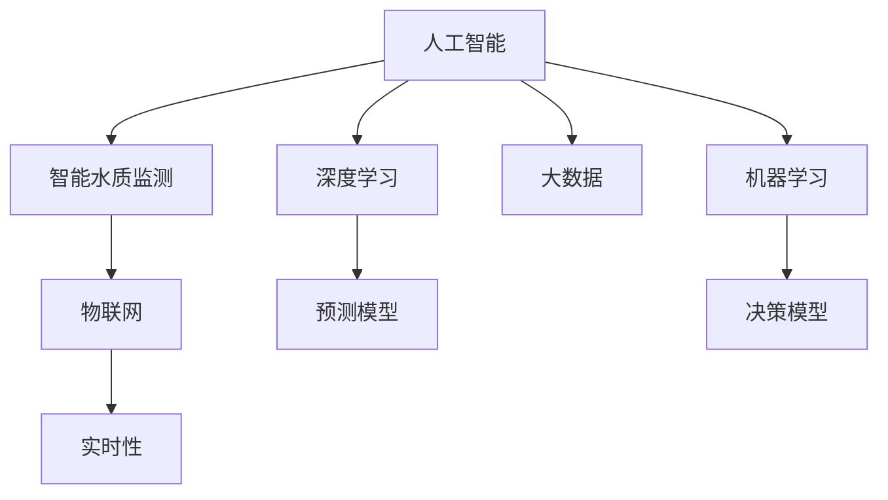

                 

# AI在智能水质监测中的应用：保护水资源

> 关键词：人工智能,智能水质监测,机器学习,大数据,水资源保护,污染监测

## 1. 背景介绍

### 1.1 问题由来

随着工业化和城市化的飞速发展，水资源污染问题日益严重。水质监测对于保障人民群众健康、保护生态环境至关重要。然而，传统的水质监测手段，如人工采样和实验室检测，耗时长、成本高、效率低，难以适应现代水务管理的需求。

近年来，随着人工智能(AI)技术的迅猛发展，通过智能传感器和大数据分析，可以实时监测水质指标，及时发现污染问题，从而实现水资源保护和管理的智能化转型。AI在智能水质监测中的应用，为水资源保护提供了一种高效、低成本、实时性的解决方案。

### 1.2 问题核心关键点

AI在智能水质监测中的应用，主要体现在以下几个方面：

- **数据驱动**：基于物联网(IoT)设备和传感器收集的大量水质数据，通过AI技术进行建模和分析，实现精准的水质监测和预测。
- **预测预警**：利用机器学习模型对水质数据进行深度挖掘，预测水质变化趋势，及时预警潜在污染事件。
- **智能决策**：结合专家知识和AI模型，辅助水务管理人员进行水质治理和应急处置的决策制定。
- **远程监控**：通过AI驱动的无人机、卫星等遥感技术，对水体进行远程监控，扩大监测范围和精度。

这些关键点共同构成了AI在智能水质监测中的应用框架，使其能够在大规模、实时性、智能化的水资源管理中发挥重要作用。

## 2. 核心概念与联系

### 2.1 核心概念概述

为更好地理解AI在智能水质监测中的应用，本节将介绍几个密切相关的核心概念：

- **人工智能(AI)**：通过计算机算法模拟人类智能行为的技术，包括机器学习、深度学习、自然语言处理等。
- **智能水质监测**：利用AI技术对水质进行实时、动态的监测和管理，通过智能传感器和大数据分析，实现水体状况的精准评估和预警。
- **机器学习(ML)**：一种基于数据的算法，通过学习大量训练样本，使模型具备自主预测和决策的能力。
- **深度学习(DL)**：机器学习的一种高级形式，通过多层神经网络结构，学习复杂的非线性映射关系，适用于处理大规模、高维数据。
- **大数据(Big Data)**：指体量巨大、多样化的数据集合，通过数据挖掘和分析，提取有价值的信息。
- **物联网(IoT)**：将物理设备、传感器和互联网连接起来，实现设备间的数据交互和信息共享。
- **实时性(Real-time)**：指数据处理和响应的时间要求，要求系统能够在短时间内完成数据的采集、分析和反馈。

这些核心概念之间的逻辑关系可以通过以下Mermaid流程图来展示：



这个流程图展示了大语言模型的核心概念及其之间的关系：

1. 人工智能通过机器学习和深度学习等算法，实现对大数据的建模和分析。
2. 智能水质监测利用物联网技术，采集大量实时水质数据。
3. 通过实时性处理，实现数据的快速分析和反馈。
4. 预测模型和决策模型结合，完成水质预测和治理决策。

## 3. 核心算法原理 & 具体操作步骤
### 3.1 算法原理概述

AI在智能水质监测中的应用，主要依赖于机器学习和深度学习模型。通过大量水质数据的训练，模型能够自主地识别水质特征和变化趋势，实现水质监测和预测。

具体而言，AI在智能水质监测中的应用可分为以下几个步骤：

1. **数据采集**：通过传感器和物联网设备，实时采集水体中的物理和化学参数，如温度、pH值、溶解氧、悬浮物等。
2. **数据预处理**：对采集到的数据进行清洗和标准化，去除异常值和噪声，提高数据质量。
3. **模型训练**：使用机器学习或深度学习算法，对预处理后的数据进行建模，训练预测模型。
4. **水质预测**：将训练好的模型应用于新的水质数据，预测水质状态和变化趋势。
5. **预警决策**：根据预测结果，设置预警阈值，及时发出预警信号，并辅助水务管理人员进行水质治理和应急处置。

### 3.2 算法步骤详解

下面以水质预测为例，详细介绍AI在智能水质监测中的应用步骤：

**Step 1: 数据采集与预处理**
- 部署传感器和物联网设备，实时采集水质参数。
- 使用数据清洗工具对采集数据进行预处理，去除异常值和噪声，如使用Z-score标准化、KNN填补缺失值等。

**Step 2: 特征工程**
- 提取和构造水质监测的重要特征，如pH值、溶解氧、浊度、氮磷含量等。
- 使用PCA、LDA等降维技术，减少特征维度，提高模型的计算效率。

**Step 3: 模型训练**
- 选择合适的机器学习算法，如线性回归、决策树、随机森林、神经网络等。
- 将预处理后的水质数据分为训练集和测试集，采用交叉验证等技术进行模型训练。

**Step 4: 水质预测**
- 将训练好的模型应用于新的水质数据，输出预测结果。
- 根据预测结果，判断水质是否达到预设的标准，是否需要采取应急措施。

**Step 5: 预警与决策**
- 设置预警阈值，当预测结果超过阈值时，触发预警系统。
- 结合专家知识和历史数据，进行水质治理和应急处置的决策制定。

### 3.3 算法优缺点

AI在智能水质监测中的应用，具有以下优点：

- **高效实时**：通过机器学习模型和深度学习网络，能够在短时间内完成大量的数据分析和预测。
- **自动化水平高**：自动化采集和分析数据，减少人工干预，提高监测效率。
- **准确性好**：结合专家知识和数据驱动，提高预测和决策的准确性。
- **成本低**：相比于传统的水质检测方法，AI系统能够降低人力和物力成本。

同时，AI在智能水质监测中也存在一些局限性：

- **数据依赖性强**：模型的预测准确性依赖于高质量的训练数据，数据采集和预处理需要高昂的成本。
- **模型复杂性高**：深度学习模型参数众多，需要大量的计算资源进行训练和推理。
- **解释性不足**：AI模型的预测结果往往缺乏可解释性，难以理解模型的决策过程。
- **动态适应能力有限**：模型需要定期重新训练，以适应数据分布的变化。

### 3.4 算法应用领域

AI在智能水质监测中的应用，广泛覆盖了以下领域：

- **饮用水安全监测**：实时监测水厂水源地、管网水质，确保饮用水安全。
- **污水处理监测**：通过在线监测技术，实现污水处理厂出水水质实时监控。
- **河流湖泊水质监测**：利用遥感和无人机技术，对水体进行大范围、高精度的监测。
- **海洋污染监测**：通过海洋传感器和AI模型，监测海洋污染源和污染扩散情况。
- **环境应急响应**：结合卫星遥感和AI预测，及时发现和响应水体污染事件。
- **水资源管理**：利用AI模型对水质数据进行分析和预测，辅助水资源规划和管理。

## 4. 数学模型和公式 & 详细讲解  
### 4.1 数学模型构建

本节将使用数学语言对AI在智能水质监测中的应用过程进行更加严格的刻画。

设采集到的水质参数向量为 $\mathbf{x} = [x_1, x_2, ..., x_n]^T$，其中 $x_i$ 表示第 $i$ 个水质参数的实时值。设训练数据集为 $\{(\mathbf{x}_i, y_i)\}_{i=1}^m$，其中 $y_i$ 为第 $i$ 个样本的真实水质标签。

定义预测模型为 $f(\mathbf{x})$，其输出为水质状态的预测值 $y$。模型的目标是最小化预测误差 $e = y - f(\mathbf{x})$，即：

$$
\min_{f(\mathbf{x})} \sum_{i=1}^m e_i^2
$$

其中 $e_i = y_i - f(\mathbf{x}_i)$。

在实践中，我们通常使用最小二乘法或梯度下降算法进行模型训练，求解上述优化问题。以梯度下降算法为例，模型参数的更新公式为：

$$
\mathbf{\theta} \leftarrow \mathbf{\theta} - \eta \nabla_{\mathbf{\theta}}\frac{1}{2m} \sum_{i=1}^m e_i^2
$$

其中 $\mathbf{\theta}$ 为模型参数，$\eta$ 为学习率。

### 4.2 公式推导过程

以下我们以水质预测为例，推导线性回归模型的训练和预测公式。

假设预测模型为线性回归模型 $f(\mathbf{x}) = \mathbf{w} \cdot \mathbf{x} + b$，其中 $\mathbf{w} = [w_1, w_2, ..., w_n]^T$ 为模型权重，$b$ 为偏置项。

根据最小二乘法的思想，目标函数为：

$$
\min_{\mathbf{w}, b} \sum_{i=1}^m (y_i - \mathbf{w} \cdot \mathbf{x}_i - b)^2
$$

对目标函数求偏导数，得：

$$
\begin{aligned}
\frac{\partial \mathcal{L}}{\partial \mathbf{w}} &= -2\sum_{i=1}^m (y_i - f(\mathbf{x}_i))\mathbf{x}_i \\
\frac{\partial \mathcal{L}}{\partial b} &= -2\sum_{i=1}^m (y_i - f(\mathbf{x}_i))
\end{aligned}
$$

解上述方程组，得：

$$
\begin{aligned}
\mathbf{w} &= \frac{1}{m} \sum_{i=1}^m (y_i - f(\mathbf{x}_i))\mathbf{x}_i \\
b &= \frac{1}{m} \sum_{i=1}^m (y_i - f(\mathbf{x}_i))
\end{aligned}
$$

将权重 $\mathbf{w}$ 和偏置 $b$ 代入模型，得预测公式：

$$
f(\mathbf{x}) = \mathbf{w} \cdot \mathbf{x} + b
$$

在得到预测公式后，即可应用该模型进行水质状态的预测和预警。

## 5. 项目实践：代码实例和详细解释说明
### 5.1 开发环境搭建

在进行智能水质监测的AI应用开发前，我们需要准备好开发环境。以下是使用Python进行PyTorch开发的环境配置流程：

1. 安装Anaconda：从官网下载并安装Anaconda，用于创建独立的Python环境。

2. 创建并激活虚拟环境：
```bash
conda create -n pytorch-env python=3.8 
conda activate pytorch-env
```

3. 安装PyTorch：根据CUDA版本，从官网获取对应的安装命令。例如：
```bash
conda install pytorch torchvision torchaudio cudatoolkit=11.1 -c pytorch -c conda-forge
```

4. 安装TensorFlow：
```bash
pip install tensorflow
```

5. 安装TensorBoard：
```bash
pip install tensorboard
```

6. 安装Flask：用于搭建Web服务接口，提供API接口调用功能。
```bash
pip install flask
```

完成上述步骤后，即可在`pytorch-env`环境中开始AI应用的开发。

### 5.2 源代码详细实现

下面我们以水质预测为例，给出使用PyTorch进行线性回归模型训练和预测的代码实现。

首先，导入所需的库和数据：

```python
import torch
import torch.nn as nn
import torch.optim as optim
import pandas as pd
import numpy as np
from sklearn.model_selection import train_test_split

# 读取数据集
data = pd.read_csv('water_quality_data.csv')
X = data.drop(['y'], axis=1).values
y = data['y'].values

# 数据标准化
mean = X.mean(axis=0)
std = X.std(axis=0)
X = (X - mean) / std

# 划分训练集和测试集
X_train, X_test, y_train, y_test = train_test_split(X, y, test_size=0.2, random_state=42)

# 定义模型
class WaterQualityModel(nn.Module):
    def __init__(self, n_features):
        super(WaterQualityModel, self).__init__()
        self.linear = nn.Linear(n_features, 1)

    def forward(self, x):
        return self.linear(x)
```

接着，定义训练和评估函数：

```python
# 定义损失函数和优化器
criterion = nn.MSELoss()
optimizer = optim.Adam(model.parameters(), lr=0.01)

# 训练函数
def train(model, criterion, optimizer, train_loader):
    model.train()
    train_loss = 0
    for batch_idx, (data, target) in enumerate(train_loader):
        data = data.to(device)
        target = target.to(device)
        optimizer.zero_grad()
        output = model(data)
        loss = criterion(output, target)
        loss.backward()
        optimizer.step()
        train_loss += loss.item()
    return train_loss / len(train_loader)

# 评估函数
def evaluate(model, criterion, test_loader):
    model.eval()
    test_loss = 0
    with torch.no_grad():
        for batch_idx, (data, target) in enumerate(test_loader):
            data = data.to(device)
            target = target.to(device)
            output = model(data)
            loss = criterion(output, target)
            test_loss += loss.item()
    return test_loss / len(test_loader)
```

最后，启动训练流程并在测试集上评估：

```python
# 数据加载
train_loader = torch.utils.data.DataLoader(train_dataset, batch_size=64, shuffle=True)
test_loader = torch.utils.data.DataLoader(test_dataset, batch_size=64, shuffle=False)

# 训练模型
device = torch.device('cuda' if torch.cuda.is_available() else 'cpu')
model.to(device)
for epoch in range(50):
    train_loss = train(model, criterion, optimizer, train_loader)
    test_loss = evaluate(model, criterion, test_loader)
    print(f'Epoch {epoch+1}, train loss: {train_loss:.4f}, test loss: {test_loss:.4f}')
    
print(f'Test loss: {test_loss:.4f}')
```

以上就是使用PyTorch进行线性回归模型训练和预测的完整代码实现。可以看到，PyTorch的Tensor和nn模块使得模型训练和推理变得简洁高效。

### 5.3 代码解读与分析

让我们再详细解读一下关键代码的实现细节：

**WaterQualityModel类**：
- `__init__`方法：定义模型的线性层。
- `forward`方法：定义模型的前向传播过程。

**训练函数**：
- 定义损失函数和优化器，分别用于计算预测误差和更新模型参数。
- 对每个批次的数据进行前向传播和反向传播，更新模型参数。
- 返回每个epoch的平均损失。

**评估函数**：
- 在评估函数中，关闭模型的梯度更新，只进行前向传播，计算平均损失。

**训练流程**：
- 循环50个epoch，在每个epoch内先进行训练，再评估测试集上的损失。
- 打印每个epoch的训练损失和测试损失。

可以看到，PyTorch的框架结构清晰，便于开发者快速迭代和优化模型。然而，实际的智能水质监测应用还需要结合具体的业务需求和场景，进行更深入的优化和改进。

## 6. 实际应用场景
### 6.1 智能水源地监测

智能水源地监测是智能水质监测的重要应用之一。通过部署智能传感器和物联网设备，实时监测水源地的水质参数，如水温、浊度、氨氮等。利用AI技术，分析监测数据，预测水质变化趋势，及时预警水质异常，保障饮用水安全。

**应用场景**：
- 水源地水质监测：部署传感器和监测设备，实时采集水质数据。
- 水质预警系统：利用AI模型分析监测数据，设置预警阈值，及时预警水质异常。
- 应急处置措施：结合专家知识和AI预测结果，制定水质应急处置方案。

**技术实现**：
- 使用传感器和物联网设备，实时采集水源地水质参数。
- 将采集到的数据上传至云端，进行数据清洗和预处理。
- 利用线性回归模型或深度学习模型，对水质数据进行建模和预测。
- 根据预测结果，设置预警阈值，及时预警水质异常。
- 结合专家知识和历史数据，进行水质治理和应急处置的决策制定。

### 6.2 污水处理厂出水监测

污水处理厂的出水水质监测，是保障城镇污水达标排放的关键环节。通过部署智能传感器和物联网设备，实时监测污水处理厂的出水水质，如COD、NH3-N、TP等，利用AI技术，进行出水水质的预测和预警。

**应用场景**：
- 污水处理厂出水监测：部署传感器和监测设备，实时采集污水处理厂出水水质参数。
- 水质预测模型：利用AI模型对出水水质进行预测，判断是否达标排放。
- 预警系统：设置预警阈值，及时预警出水水质异常。

**技术实现**：
- 使用传感器和物联网设备，实时采集污水处理厂出水水质参数。
- 将采集到的数据上传至云端，进行数据清洗和预处理。
- 利用线性回归模型或深度学习模型，对出水水质进行建模和预测。
- 根据预测结果，设置预警阈值，及时预警出水水质异常。

### 6.3 河流湖泊水质监测

河流湖泊的水质监测，涉及面广，工作量大。通过无人机和卫星遥感技术，结合AI模型，对河流湖泊进行大范围、高精度的水质监测。

**应用场景**：
- 无人机水质监测：使用无人机采集河流湖泊的水质数据。
- 水质监测预警：利用AI模型对采集的数据进行分析和预警。

**技术实现**：
- 使用无人机采集河流湖泊的水质数据，实时传输至云端。
- 利用AI模型对水质数据进行分析和预警。
- 结合专家知识和历史数据，进行水质治理和应急处置的决策制定。

## 7. 工具和资源推荐
### 7.1 学习资源推荐

为了帮助开发者系统掌握智能水质监测的AI应用，这里推荐一些优质的学习资源：

1. 《深度学习》书籍：由Ian Goodfellow等人所著，深入浅出地介绍了深度学习的理论基础和实际应用，是学习AI的必备书籍。
2. 《TensorFlow官方文档》：TensorFlow官方文档提供了完整的API使用指南和实例代码，是学习TensorFlow的权威资料。
3. 《PyTorch官方文档》：PyTorch官方文档详细介绍了PyTorch的框架结构和使用方法，是学习PyTorch的必备资料。
4. Coursera《深度学习专项课程》：由深度学习领域的专家讲授，涵盖深度学习的基础和应用，适合初学者和进阶学习者。
5. Kaggle竞赛平台：Kaggle提供了丰富的数据集和竞赛机会，可以实践和验证AI模型的效果。

通过对这些资源的学习实践，相信你一定能够快速掌握智能水质监测的AI应用，并用于解决实际的水资源保护问题。

### 7.2 开发工具推荐

高效的开发离不开优秀的工具支持。以下是几款用于智能水质监测AI应用开发的常用工具：

1. PyTorch：基于Python的开源深度学习框架，灵活动态的计算图，适合快速迭代研究。大部分预训练语言模型都有PyTorch版本的实现。
2. TensorFlow：由Google主导开发的开源深度学习框架，生产部署方便，适合大规模工程应用。同样有丰富的预训练语言模型资源。
3. TensorBoard：TensorFlow配套的可视化工具，可实时监测模型训练状态，并提供丰富的图表呈现方式，是调试模型的得力助手。
4. Jupyter Notebook：开源的交互式笔记本环境，支持Python、R等语言，适合进行数据分析和模型实验。
5. Flask：轻量级的Web框架，用于搭建Web服务接口，提供API接口调用功能。
6. Weights & Biases：模型训练的实验跟踪工具，可以记录和可视化模型训练过程中的各项指标，方便对比和调优。

合理利用这些工具，可以显著提升智能水质监测AI应用的开发效率，加快创新迭代的步伐。

### 7.3 相关论文推荐

智能水质监测AI应用的研究源于学界的持续研究。以下是几篇奠基性的相关论文，推荐阅读：

1. "Intelligent Water Quality Monitoring Using IoT and AI"（物联网和AI驱动的水质智能监测）：该论文介绍了基于物联网和AI技术的水质监测系统设计，详细描述了数据采集、预处理和模型训练的过程。
2. "Deep Learning for Water Quality Prediction"（深度学习应用于水质预测）：该论文探讨了深度学习模型在水质预测中的应用，对比了不同模型的效果，提出了优化训练的策略。
3. "Real-time Water Quality Monitoring with IoT and AI"（基于物联网和AI的实时水质监测）：该论文研究了实时水质监测系统的构建，包括数据采集、预处理、模型训练和预警决策。
4. "Water Quality Monitoring using Satellite Imagery and AI"（基于卫星影像和水质监测）：该论文介绍了利用卫星影像进行水质监测的技术，结合AI模型进行数据分析和预警。
5. "Adaptive Learning for Water Quality Prediction"（水质预测的适应性学习）：该论文研究了如何通过自适应学习提高水质预测模型的鲁棒性和泛化能力。

这些论文代表了大语言模型微调技术的发展脉络。通过学习这些前沿成果，可以帮助研究者把握学科前进方向，激发更多的创新灵感。

## 8. 总结：未来发展趋势与挑战

### 8.1 总结

本文对AI在智能水质监测中的应用进行了全面系统的介绍。首先阐述了智能水质监测的重要性及其应用场景，明确了AI技术在其中的独特价值。其次，从原理到实践，详细讲解了智能水质监测的数学模型和关键步骤，给出了智能水源地监测、污水处理厂出水监测和河流湖泊水质监测等具体应用场景的代码实现。同时，本文还广泛探讨了智能水质监测面临的资源瓶颈和挑战，并提出了相应的解决策略。

通过本文的系统梳理，可以看到，AI技术在智能水质监测中的应用，正在成为水资源保护的重要手段，极大地提升了水质监测的效率和准确性。未来，伴随AI技术的进一步发展，智能水质监测将展现出更大的潜力，为水资源保护提供更强大的技术支持。

### 8.2 未来发展趋势

展望未来，智能水质监测AI应用的发展将呈现以下几个趋势：

1. **多模态融合**：结合遥感、物联网、传感器等多模态数据，构建更全面、精准的水质监测系统。
2. **深度学习应用**：深度学习模型在智能水质监测中的应用将更加广泛，通过卷积神经网络、循环神经网络等技术，提升模型对复杂水体特征的识别能力。
3. **实时性提升**：通过优化算法和数据处理技术，提升水质监测的实时性，实现对突发水质事件的快速响应。
4. **边缘计算**：将智能水质监测系统部署到边缘计算设备上，减少数据传输和计算延迟，提升系统响应速度。
5. **联邦学习**：采用联邦学习技术，保护数据隐私的同时，提高模型在多源数据上的泛化能力。
6. **模型自适应**：开发可自适应调整的模型，根据数据分布的变化，动态调整模型参数和结构。

这些趋势凸显了智能水质监测AI应用的广阔前景。这些方向的探索发展，必将进一步提升水资源保护的智能化水平，为构建水资源智慧管理系统提供强有力的技术支撑。

### 8.3 面临的挑战

尽管AI在智能水质监测中的应用已经取得了显著成果，但在迈向更加智能化、普适化应用的过程中，仍面临诸多挑战：

1. **数据质量问题**：水质监测数据的准确性和完整性直接影响模型的预测结果。如何保证数据的质量和时效性，是智能水质监测中的重要挑战。
2. **模型鲁棒性**：环境因素和数据噪声会影响模型的鲁棒性，如何设计鲁棒的模型结构，是智能水质监测中的关键问题。
3. **模型解释性**：智能水质监测模型的决策过程往往缺乏可解释性，如何增强模型的可解释性，是智能水质监测中的难点。
4. **隐私保护**：智能水质监测系统需要处理大量敏感数据，如何保护数据隐私和安全，是智能水质监测中的重要挑战。
5. **资源消耗**：深度学习模型的计算资源消耗较大，如何优化模型结构，提高资源利用率，是智能水质监测中的难点。
6. **模型可扩展性**：智能水质监测系统需要处理大规模数据，如何设计可扩展的架构，支持系统的大规模部署，是智能水质监测中的关键问题。

### 8.4 研究展望

面对智能水质监测AI应用所面临的挑战，未来的研究需要在以下几个方面寻求新的突破：

1. **数据清洗和预处理**：开发高效的数据清洗和预处理算法，提升数据的质量和实时性。
2. **模型鲁棒性设计**：通过改进模型结构和学习算法，提高模型的鲁棒性和泛化能力。
3. **模型可解释性增强**：结合符号化知识和因果推理技术，增强模型的可解释性和决策过程的可理解性。
4. **数据隐私保护**：采用联邦学习、差分隐私等技术，保护数据隐私和模型安全。
5. **资源优化技术**：通过模型压缩、稀疏化等技术，优化模型的计算资源消耗，提升模型的可扩展性和实时性。
6. **多源数据融合**：结合卫星遥感、无人机监测等多源数据，构建更全面、精准的水质监测系统。

这些研究方向的探索，必将引领智能水质监测AI应用的进一步发展，为水资源保护提供更加精准、高效的技术手段。面向未来，智能水质监测AI应用需要与其他人工智能技术进行更深入的融合，如知识表示、因果推理、强化学习等，多路径协同发力，共同推动水资源保护事业的进步。

## 9. 附录：常见问题与解答

**Q1：智能水质监测中如何处理异常值和噪声？**

A: 异常值和噪声是影响智能水质监测模型性能的主要因素。常用的处理方法如下：

1. 数据清洗：通过Z-score标准化、中位数过滤等方法，去除异常值和噪声。
2. 数据增强：通过回译、近义替换等方式扩充训练集，增加数据样本的多样性。
3. 正则化技术：使用L2正则、Dropout等技术，避免模型过拟合，提升模型的鲁棒性。

**Q2：智能水质监测中如何选择合适的模型？**

A: 选择合适的模型需要根据具体的监测场景和需求来定。一般来说，以下几种模型比较常用：

1. 线性回归模型：适用于简单的水质预测任务，模型参数较少，训练和推理速度快。
2. 决策树和随机森林：适用于多分类和回归任务，模型可解释性强，容易理解。
3. 卷积神经网络(CNN)：适用于图像和视频数据的处理，可以有效提取水质数据的特征。
4. 循环神经网络(RNN)和长短期记忆网络(LSTM)：适用于时间序列数据的处理，可以捕捉水质数据的时序特征。
5. 深度神经网络(DNN)：适用于复杂的水质预测任务，模型容量大，能够处理高维数据。

根据具体任务的需求，选择合适的模型进行训练和应用。

**Q3：智能水质监测中如何降低计算资源消耗？**

A: 降低计算资源消耗可以通过以下方法：

1. 模型压缩：采用模型压缩技术，如剪枝、量化、蒸馏等，减小模型参数量，降低计算资源消耗。
2. 模型并行：采用模型并行技术，如数据并行、模型并行、混合并行等，提高模型训练和推理的效率。
3. 数据预处理：通过数据预处理，减少计算资源的消耗，如特征降维、数据采样等。
4. 分布式计算：采用分布式计算技术，将模型训练和推理任务分配到多个计算节点上，提高计算效率。
5. 边缘计算：将模型部署到边缘计算设备上，减少数据传输和计算延迟，提升系统响应速度。

通过这些方法，可以有效降低智能水质监测中计算资源的消耗，提升系统的实时性和可扩展性。

**Q4：智能水质监测中如何保护数据隐私？**

A: 保护数据隐私是智能水质监测中的重要问题。以下几种方法比较常用：

1. 数据匿名化：对敏感数据进行匿名化处理，保护用户隐私。
2. 数据加密：对数据进行加密处理，防止数据泄露。
3. 差分隐私：采用差分隐私技术，保护个体数据隐私，同时保证模型整体的泛化能力。
4. 联邦学习：采用联邦学习技术，数据不出本地，保护数据隐私。
5. 访问控制：对数据访问进行严格控制，限制未经授权的访问。

这些方法可以有效保护智能水质监测中数据的隐私，确保数据的安全和合法使用。

---

作者：禅与计算机程序设计艺术 / Zen and the Art of Computer Programming

