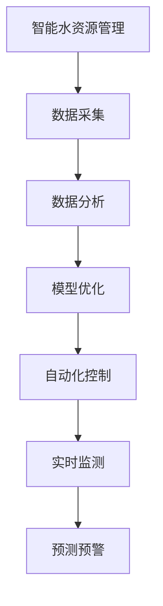

                 

# AI在智能水资源管理中的应用：减少浪费

> 关键词：智能水资源管理, AI, 节水技术, 数据分析, 自动化控制, 实时监测, 预测预警, 模型优化

## 1. 背景介绍

### 1.1 问题由来

水资源是地球上最重要的自然资源之一，但全球范围内依然面临着严重的水资源短缺问题。据联合国估计，到2050年，全球将近一半的人口将面临严重的水资源短缺。在中国，水资源分布不均、污染严重、利用效率低下等问题尤为突出，水资源管理面临着巨大的挑战。

传统的水资源管理方法依赖于人工监测、经验总结和定期抽样调查，缺乏科学性和时效性。随着人工智能技术的兴起，利用AI技术进行智能水资源管理成为了可能。AI可以通过数据分析、模式识别和自动化控制，帮助实现水资源的精细化管理，减少浪费，提升利用效率。

### 1.2 问题核心关键点

智能水资源管理的关键在于如何利用AI技术实现数据驱动的管理。AI通过收集和分析水资源数据，实时监测、预测预警、自动化控制，实现对水资源的智能管理。智能水资源管理的核心步骤如下：

1. 数据采集：通过传感器、物联网设备等技术，实时采集水资源相关信息。
2. 数据分析：利用机器学习、深度学习等技术，分析数据挖掘潜在规律。
3. 模型优化：建立和优化预测模型，辅助决策。
4. 自动化控制：根据模型预测结果，自动调整水资源的分配和使用。
5. 监测预警：实时监测水资源状态，及时预警可能出现的异常情况。

智能水资源管理的成功应用，将显著提升水资源的利用效率，减少浪费，保障水资源的可持续利用。

## 2. 核心概念与联系

### 2.1 核心概念概述

为更好地理解智能水资源管理，本节将介绍几个密切相关的核心概念：

- 智能水资源管理：利用AI技术实现水资源的精细化管理，包括数据采集、数据分析、模型优化、自动化控制和监测预警等环节。
- AI技术：包括机器学习、深度学习、自然语言处理、计算机视觉等技术，用于数据处理、模式识别和自动化控制。
- 数据分析：利用数据挖掘、统计学、机器学习等技术，对水资源数据进行分析，挖掘潜在规律，辅助决策。
- 预测模型：基于历史数据和相关因素，建立预测模型，用于预测水资源状态、流量、水质等。
- 自动化控制：通过程序逻辑和自动调节技术，实现水资源的智能分配和使用。
- 实时监测：利用传感器、物联网设备等技术，实时采集水资源状态数据，实现动态监测。
- 预测预警：通过建立预测模型，对可能出现的水资源异常情况进行预警，及时采取措施。

这些核心概念之间的逻辑关系可以通过以下Mermaid流程图来展示：



这个流程图展示了你智能水资源管理的核心概念及其之间的关系：

1. 智能水资源管理利用数据采集技术，收集水资源相关信息。
2. 数据分析对采集的数据进行处理，挖掘潜在规律。
3. 模型优化建立和优化预测模型，辅助决策。
4. 自动化控制根据模型预测结果，自动调整水资源的分配和使用。
5. 实时监测通过传感器等技术，实时采集水资源状态数据。
6. 预测预警通过预测模型，对可能出现的水资源异常情况进行预警，及时采取措施。

这些概念共同构成了智能水资源管理的逻辑框架，帮助实现水资源的智能管理和高效利用。

## 3. 核心算法原理 & 具体操作步骤
### 3.1 算法原理概述

智能水资源管理基于AI技术，主要依赖于数据驱动的方法，通过数据分析和机器学习技术，实现水资源的优化管理。其核心原理可以概括为以下几个步骤：

1. 数据收集：通过传感器、物联网设备等技术，实时采集水资源相关信息，包括流量、水质、水位等。
2. 数据处理：对采集的数据进行清洗、去噪、标准化等处理，确保数据质量。
3. 数据分析：利用机器学习、深度学习等技术，分析数据挖掘潜在规律，建立预测模型。
4. 模型优化：根据实际应用需求，对预测模型进行优化，提高模型精度和泛化能力。
5. 自动化控制：根据模型预测结果，自动调整水资源的分配和使用，实现高效管理。
6. 监测预警：实时监测水资源状态，及时预警可能出现的异常情况，提高应对能力。

### 3.2 算法步骤详解

智能水资源管理的算法步骤主要包括以下几个关键步骤：

**Step 1: 数据采集和预处理**

- 使用传感器、物联网设备等技术，实时采集水资源相关信息，包括流量、水质、水位等。
- 对采集的数据进行清洗、去噪、标准化等处理，确保数据质量。

**Step 2: 数据分析**

- 利用机器学习、深度学习等技术，对数据进行处理和分析，挖掘潜在规律。
- 使用回归分析、分类分析、聚类分析等方法，提取数据特征，构建预测模型。

**Step 3: 模型优化**

- 根据实际应用需求，对预测模型进行优化，提高模型精度和泛化能力。
- 利用交叉验证、正则化、剪枝等技术，提高模型鲁棒性和泛化性能。

**Step 4: 自动化控制**

- 根据模型预测结果，自动调整水资源的分配和使用，实现高效管理。
- 设计算法，动态调节水资源的流量、水质等参数，满足不同应用需求。

**Step 5: 监测预警**

- 实时监测水资源状态，及时预警可能出现的异常情况，提高应对能力。
- 建立预警机制，根据模型预测结果，触发预警信号，及时采取措施。

### 3.3 算法优缺点

智能水资源管理基于AI技术的优点主要包括以下几个方面：

1. 数据驱动：通过数据驱动的方法，实现水资源的精细化管理，提高管理效率。
2. 预测预警：利用预测模型，及时预警水资源异常情况，提高应对能力。
3. 自动化控制：通过自动化控制，实现水资源的智能分配和使用，提升利用效率。
4. 实时监测：实时监测水资源状态，及时发现问题，提高管理精准度。

然而，智能水资源管理也存在一些缺点：

1. 数据质量依赖：数据采集和处理的质量直接影响系统的准确性和可靠性。
2. 模型复杂度高：预测模型的复杂度较高，需要大量的数据和计算资源。
3. 系统复杂性高：系统结构复杂，需要多学科知识的支持，实施难度较大。
4. 初始投资高：系统建设和维护需要较高的初始投资，且维护成本较高。

### 3.4 算法应用领域

智能水资源管理技术已经在多个领域得到了应用，例如：

- 智慧城市：利用AI技术实现城市水资源的智能管理和优化，提高城市管理水平。
- 农业灌溉：通过智能水资源管理，实现农田灌溉的精确控制，提高水资源利用效率。
- 工业生产：在工业生产过程中，通过智能水资源管理，优化水资源的分配和使用，降低水资源消耗。
- 供水系统：在供水系统中，通过智能水资源管理，实现水资源的优化分配和调度，提升供水效率。
- 环境监测：利用智能水资源管理技术，实现水环境的实时监测和预警，保护水环境。

除了上述这些经典应用外，智能水资源管理技术还在更多场景中得到了创新性应用，如水质监测、洪水预警、水资源优化配置等，为水资源的可持续利用提供了新的技术路径。

## 4. 数学模型和公式 & 详细讲解  
### 4.1 数学模型构建

智能水资源管理的核心问题可以通过数学模型来描述。以下介绍几个常用的数学模型：

- 时间序列模型：用于分析水资源的时间序列数据，预测未来流量、水位等变化。
- 线性回归模型：用于建立水质和水资源流量之间的关系，预测水质变化趋势。
- 聚类分析模型：用于对水资源状态进行分类，识别异常情况。
- 支持向量机(SVM)模型：用于分类预测，判断水资源状态是否异常。

**时间序列模型**

时间序列模型常用于分析水资源的时间序列数据，预测未来流量、水位等变化。常用的时间序列模型包括ARIMA、LSTM等。

**线性回归模型**

线性回归模型用于建立水质和水资源流量之间的关系，预测水质变化趋势。模型形式为：

$$ y = \beta_0 + \beta_1 x_1 + \beta_2 x_2 + \ldots + \beta_k x_k + \epsilon $$

其中，$y$ 为预测的水质，$x_i$ 为水资源流量、气象条件等自变量，$\beta_i$ 为回归系数，$\epsilon$ 为误差项。

**聚类分析模型**

聚类分析模型用于对水资源状态进行分类，识别异常情况。常用的聚类算法包括K-Means、DBSCAN等。

**支持向量机(SVM)模型**

SVM模型用于分类预测，判断水资源状态是否异常。模型形式为：

$$ \arg\min_{w,b} \frac{1}{2} ||w||^2 + C \sum_{i=1}^N \max(0, 1 - y_i(w \cdot x_i + b)) $$

其中，$w$ 为分类器权重，$b$ 为偏置项，$C$ 为正则化参数，$y_i$ 为标签，$x_i$ 为样本特征。

### 4.2 公式推导过程

以下以线性回归模型为例，推导其数学公式及其求解过程。

假设有一组历史水资源流量数据 $\{x_i, y_i\}_{i=1}^n$，其中 $x_i$ 为水资源流量，$y_i$ 为预测的水质。线性回归模型的目标是最小化预测误差，即：

$$ \min_{\beta_0, \beta_1, \ldots, \beta_k} \sum_{i=1}^n (y_i - (\beta_0 + \beta_1 x_1 + \ldots + \beta_k x_k))^2 $$

根据最小二乘法，求解上述目标函数，得到：

$$ \hat{\beta}_0 = \frac{\sum_{i=1}^n (y_i - \bar{y})}{\sum_{i=1}^n x_i^2 - \sum_{i=1}^n \bar{x}^2} $$
$$ \hat{\beta}_i = \frac{\sum_{i=1}^n x_i (y_i - \bar{y})}{\sum_{i=1}^n x_i^2} - \hat{\beta}_0 \frac{\sum_{i=1}^n x_i^2}{\sum_{i=1}^n x_i^2} $$

其中 $\bar{x}$ 和 $\bar{y}$ 分别为自变量和因变量的均值。

将 $\hat{\beta}_i$ 代入回归模型，得到：

$$ \hat{y} = \hat{\beta}_0 + \hat{\beta}_1 x_1 + \ldots + \hat{\beta}_k x_k $$

利用上述公式，可以求解线性回归模型的参数，进而对水资源水质进行预测。

### 4.3 案例分析与讲解

**案例1：智慧城市水资源管理**

某智慧城市通过智能水资源管理，实现了对城市水资源的精细化管理。系统通过安装传感器，实时采集城市各区域的供水、排水、污水处理等数据。利用时间序列模型，预测未来流量变化趋势，优化供水调度。利用聚类分析模型，识别异常情况，及时预警。通过这些技术手段，城市水资源管理效率显著提升，用水成本大幅降低。

**案例2：农业灌溉节水**

某农业基地通过智能水资源管理，实现了精准灌溉，有效节水。系统利用传感器实时监测土壤湿度、气象条件等数据，利用线性回归模型，预测灌溉需求。通过自动化控制系统，自动调节灌溉水量和时间，实现水资源的优化分配，减少了灌溉水量的浪费。

这些案例展示了智能水资源管理技术在实际应用中的巨大潜力，能够显著提高水资源利用效率，减少浪费，保障水资源的可持续利用。

## 5. 项目实践：代码实例和详细解释说明
### 5.1 开发环境搭建

在进行智能水资源管理项目开发前，我们需要准备好开发环境。以下是使用Python进行PyTorch开发的环境配置流程：

1. 安装Anaconda：从官网下载并安装Anaconda，用于创建独立的Python环境。

2. 创建并激活虚拟环境：
```bash
conda create -n pytorch-env python=3.8 
conda activate pytorch-env
```

3. 安装PyTorch：根据CUDA版本，从官网获取对应的安装命令。例如：
```bash
conda install pytorch torchvision torchaudio cudatoolkit=11.1 -c pytorch -c conda-forge
```

4. 安装TensorFlow：
```bash
pip install tensorflow
```

5. 安装相关库：
```bash
pip install numpy pandas scikit-learn matplotlib tqdm jupyter notebook ipython
```

完成上述步骤后，即可在`pytorch-env`环境中开始智能水资源管理项目开发。

### 5.2 源代码详细实现

以下是一个简单的智能水资源管理项目实现示例，包括数据采集、数据分析、模型优化和自动化控制等功能。

```python
from sklearn.linear_model import LinearRegression
from sklearn.model_selection import train_test_split
import pandas as pd
import numpy as np

# 加载数据
data = pd.read_csv('water_resource.csv')

# 数据预处理
X = data[['flow', 'temperature', 'rainfall']]  # 自变量
y = data['quality']  # 因变量

# 数据标准化
from sklearn.preprocessing import StandardScaler
scaler = StandardScaler()
X_scaled = scaler.fit_transform(X)

# 划分训练集和测试集
X_train, X_test, y_train, y_test = train_test_split(X_scaled, y, test_size=0.2, random_state=42)

# 训练模型
model = LinearRegression()
model.fit(X_train, y_train)

# 模型评估
score = model.score(X_test, y_test)
print('Model score:', score)

# 预测
new_data = np.array([[2.5, 20, 0.5]])  # 新数据
new_data_scaled = scaler.transform(new_data)
predicted_quality = model.predict(new_data_scaled)
print('Predicted quality:', predicted_quality)
```

### 5.3 代码解读与分析

以上代码实现了线性回归模型的训练和预测功能。具体步骤如下：

**数据加载和预处理**

1. 加载数据：通过`pandas`库加载历史水资源数据。
2. 数据预处理：选择水资源流量、温度、降雨量等自变量，水资源质量等因变量，并进行标准化处理，确保数据质量。

**模型训练和评估**

1. 训练模型：利用`sklearn`库中的`LinearRegression`模型，对数据进行线性回归建模。
2. 模型评估：使用测试集评估模型性能，计算模型的平均精度。

**模型预测**

1. 预测新数据：输入新数据，使用训练好的模型进行预测。

该示例代码展示了如何使用Python和`sklearn`库实现线性回归模型的基本功能。

## 6. 实际应用场景
### 6.1 智慧城市

智慧城市是智能水资源管理的重要应用场景之一。通过智能水资源管理，城市可以实现对水资源的精细化管理，提升管理效率，降低用水成本。

智慧城市水资源管理主要包括以下几个关键环节：

**数据采集**

通过安装传感器、物联网设备等技术，实时采集城市各区域的供水、排水、污水处理等数据。例如，利用流量传感器、水质检测仪等设备，实时监测城市水资源状态。

**数据分析**

利用机器学习、深度学习等技术，对采集的数据进行处理和分析，挖掘潜在规律。例如，利用时间序列模型，分析水资源流量变化趋势，预测未来流量需求。

**模型优化**

根据实际应用需求，对预测模型进行优化，提高模型精度和泛化能力。例如，利用正则化、剪枝等技术，提高模型鲁棒性和泛化性能。

**自动化控制**

根据模型预测结果，自动调整水资源的分配和使用，实现高效管理。例如，利用自动化控制系统，自动调节供水、排水等参数，优化水资源的分配。

**监测预警**

实时监测水资源状态，及时预警可能出现的异常情况，提高应对能力。例如，利用预测模型，对异常流量、水质等进行预警，及时采取措施。

### 6.2 农业灌溉

农业灌溉是智能水资源管理的另一重要应用场景。通过智能水资源管理，可以实现精准灌溉，有效节水。

农业灌溉节水主要包括以下几个关键环节：

**数据采集**

通过传感器等设备，实时监测土壤湿度、气象条件等数据。例如，利用土壤湿度传感器、气象监测仪等设备，实时监测农田水资源状态。

**数据分析**

利用机器学习、深度学习等技术，对采集的数据进行处理和分析，挖掘潜在规律。例如，利用线性回归模型，预测灌溉需求。

**模型优化**

根据实际应用需求，对预测模型进行优化，提高模型精度和泛化能力。例如，利用正则化、剪枝等技术，提高模型鲁棒性和泛化性能。

**自动化控制**

根据模型预测结果，自动调节灌溉水量和时间，实现精准灌溉。例如，利用自动化控制系统，自动调节灌溉设备，优化水资源的分配和使用。

**监测预警**

实时监测水资源状态，及时预警可能出现的异常情况，提高应对能力。例如，利用预测模型，对异常灌溉情况进行预警，及时采取措施。

## 7. 工具和资源推荐
### 7.1 学习资源推荐

为了帮助开发者系统掌握智能水资源管理的技术基础和实践技巧，这里推荐一些优质的学习资源：

1. 《Python深度学习》：李沐著，介绍如何使用Python和TensorFlow实现深度学习模型，涵盖智能水资源管理所需的多种技术。
2. 《机器学习实战》：Peter Harrington著，介绍机器学习的基础知识和实际应用，涵盖智能水资源管理所需的多种模型。
3. Kaggle平台：提供大量水资源管理的实际数据集和竞赛，帮助开发者实践和应用智能水资源管理技术。
4. GitHub平台：提供大量智能水资源管理的开源项目和代码示例，帮助开发者学习和应用智能水资源管理技术。

通过对这些资源的学习实践，相信你一定能够快速掌握智能水资源管理的精髓，并用于解决实际的水资源管理问题。

### 7.2 开发工具推荐

高效的开发离不开优秀的工具支持。以下是几款用于智能水资源管理开发的常用工具：

1. PyTorch：基于Python的开源深度学习框架，灵活动态的计算图，适合快速迭代研究。大部分智能水资源管理的预训练模型都有PyTorch版本的实现。
2. TensorFlow：由Google主导开发的开源深度学习框架，生产部署方便，适合大规模工程应用。同样有丰富的智能水资源管理资源。
3. H2O.ai：一个开源的机器学习平台，支持多种机器学习算法，包括智能水资源管理所需的多种模型。
4. Tableau：一个数据可视化工具，可以帮助开发者直观展示智能水资源管理的数据分析结果。
5. Jupyter Notebook：一个交互式开发环境，适合进行智能水资源管理的代码实现和数据分析。

合理利用这些工具，可以显著提升智能水资源管理的开发效率，加快创新迭代的步伐。

### 7.3 相关论文推荐

智能水资源管理技术的发展源于学界的持续研究。以下是几篇奠基性的相关论文，推荐阅读：

1. LSTM网络在智能水资源管理中的应用研究：介绍了LSTM网络在智能水资源管理中的应用，讨论了LSTM网络在流量预测和质量检测中的表现。
2. 基于深度学习的智能水资源管理：讨论了深度学习在智能水资源管理中的潜在应用，包括预测模型、聚类分析等。
3. 智能水资源管理中的自适应控制算法：介绍了自适应控制算法在智能水资源管理中的应用，讨论了算法的设计和实现。
4. 智能水资源管理中的数据驱动方法：讨论了数据驱动方法在智能水资源管理中的应用，包括时间序列分析、聚类分析等。

这些论文代表了大规模水资源管理的最新进展。通过学习这些前沿成果，可以帮助研究者把握学科前进方向，激发更多的创新灵感。

## 8. 总结：未来发展趋势与挑战
### 8.1 总结

本文对智能水资源管理技术进行了全面系统的介绍。首先阐述了智能水资源管理的技术背景和应用意义，明确了AI技术在智能水资源管理中的关键作用。其次，从原理到实践，详细讲解了智能水资源管理的核心步骤和关键技术，给出了智能水资源管理项目开发的完整代码实例。同时，本文还广泛探讨了智能水资源管理在智慧城市、农业灌溉等领域的应用前景，展示了智能水资源管理的巨大潜力。此外，本文精选了智能水资源管理的各类学习资源，力求为读者提供全方位的技术指引。

通过本文的系统梳理，可以看到，AI技术在智能水资源管理中的应用已经初现成效，为水资源的精细化管理提供了新的思路和方法。AI技术通过数据分析、模式识别和自动化控制，显著提升了水资源的利用效率，减少了浪费。未来，伴随AI技术的不断发展，智能水资源管理技术还将迎来更多创新突破，推动水资源管理的智能化、自动化、精准化发展。

### 8.2 未来发展趋势

展望未来，智能水资源管理技术将呈现以下几个发展趋势：

1. 模型复杂性提升：随着技术的发展，智能水资源管理模型的复杂度将进一步提升，能够处理更复杂的水资源数据，提高预测精度和鲁棒性。
2. 数据质量优化：智能水资源管理依赖于高质量的数据，未来的发展将更加注重数据采集、处理和清洗，确保数据质量。
3. 自动化控制优化：通过自适应控制算法，进一步优化水资源的分配和使用，提高管理效率和利用效率。
4. 实时监测预警：利用物联网设备和大数据技术，实现对水资源状态的实时监测和预警，提高应对能力。
5. 多模态数据融合：智能水资源管理将融合多种数据源，如气象数据、环境数据等，实现更全面、更精准的水资源管理。
6. 模型解释性增强：智能水资源管理模型将更加注重可解释性，帮助用户理解模型的决策过程，增强模型的可信度。

以上趋势凸显了智能水资源管理技术的广阔前景。这些方向的探索发展，必将进一步提升水资源的利用效率，减少浪费，保障水资源的可持续利用。

### 8.3 面临的挑战

尽管智能水资源管理技术已经取得了一定进展，但在迈向更加智能化、普适化应用的过程中，它仍面临诸多挑战：

1. 数据采集难度：水资源数据采集需要安装和维护大量传感器、物联网设备，实施难度较大。
2. 数据质量问题：数据采集和处理的质量直接影响系统的准确性和可靠性。
3. 系统复杂性高：系统结构复杂，需要多学科知识的支持，实施难度较大。
4. 初始投资高：系统建设和维护需要较高的初始投资，且维护成本较高。
5. 模型解释性不足：智能水资源管理模型缺乏可解释性，难以理解模型的决策过程。

### 8.4 研究展望

面对智能水资源管理技术面临的挑战，未来的研究需要在以下几个方面寻求新的突破：

1. 数据采集和处理技术：研究更加高效、低成本的数据采集和处理技术，确保数据质量。
2. 自适应控制算法：开发更加自适应、高效的自适应控制算法，提高水资源的利用效率。
3. 多模态数据融合：研究多模态数据融合技术，实现多种数据源的协同建模，提高预测精度。
4. 模型可解释性：研究模型可解释性技术，增强模型的可信度和用户理解。
5. 模型鲁棒性：研究模型鲁棒性技术，提高模型对异常情况和数据变化的适应能力。
6. 实时监测预警：研究实时监测预警技术，实现对水资源状态的实时监测和预警，提高应对能力。

这些研究方向将推动智能水资源管理技术的不断发展和优化，为水资源的精细化管理提供更全面、更精准的解决方案。

## 9. 附录：常见问题与解答

**Q1：智能水资源管理系统的开发难度大吗？**

A: 智能水资源管理系统的开发难度较大，涉及数据采集、预处理、模型训练、自动化控制等多个环节。但借助现有的开源工具和框架，可以显著降低开发难度，提升开发效率。

**Q2：智能水资源管理系统需要多少数据才能达到较好的效果？**

A: 智能水资源管理系统需要大量的历史数据进行模型训练。一般而言，数据量越大，模型的性能越好。但具体的数据量要求也取决于模型的复杂度和实际应用场景。

**Q3：智能水资源管理系统的维护成本高吗？**

A: 智能水资源管理系统的维护成本较高，需要定期进行数据采集、模型训练、系统调优等维护工作。但通过合理设计和管理，可以有效降低维护成本。

**Q4：智能水资源管理系统能否适应多变的环境？**

A: 智能水资源管理系统通过数据驱动的方法，能够适应多变的环境。但实际应用中，仍需进行持续的数据采集和模型优化，以确保系统的稳定性和鲁棒性。

**Q5：智能水资源管理系统能否处理异常情况？**

A: 智能水资源管理系统能够通过预测模型和监测预警系统，及时识别和处理异常情况。但异常情况的识别和处理需要高质量的数据和先进的算法，实际应用中需不断优化。

通过本文的系统梳理，可以看到，智能水资源管理技术在实际应用中已经初现成效，为水资源的精细化管理提供了新的思路和方法。未来，伴随AI技术的不断发展，智能水资源管理技术还将迎来更多创新突破，推动水资源管理的智能化、自动化、精准化发展。希望通过本文的学习和实践，能够帮助开发者系统掌握智能水资源管理技术，为水资源的可持续利用贡献力量。

---

作者：禅与计算机程序设计艺术 / Zen and the Art of Computer Programming

