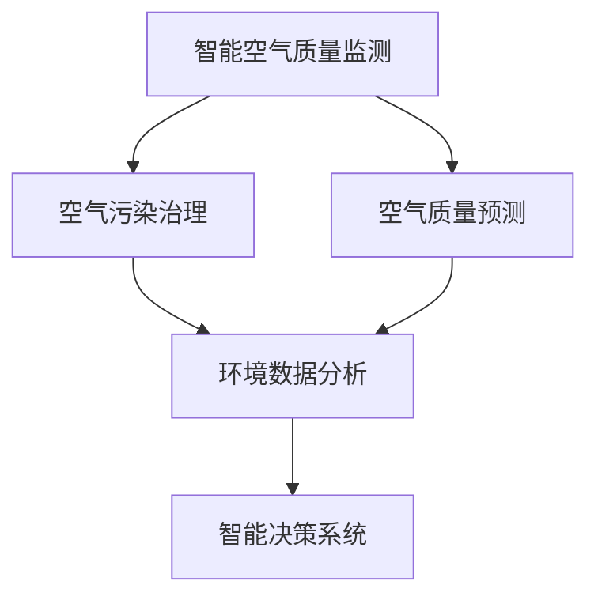

                 

# AI在智能空气污染控制中的应用：改善空气质量

> 关键词：智能空气质量监测,空气质量预测,空气污染治理,环境数据分析,人工智能算法,空气质量管理

## 1. 背景介绍

### 1.1 问题由来

随着工业化、城市化的发展，全球范围内的空气质量问题日益严峻。近年来，频繁发生的雾霾、沙尘暴、大气污染等环境事件，严重威胁人类的健康和生活质量。如何通过科技手段有效监测和治理空气污染，改善空气质量，已成为全球面临的重大挑战。

### 1.2 问题核心关键点

如何利用人工智能技术，特别是大数据和机器学习算法，建立精准的空气质量监测和预测系统，实现空气污染治理的智能化和精准化，是当前环境领域的一个重要研究方向。AI技术通过实时数据采集、模式识别和智能决策，能够为空气污染控制提供有效的技术支持。

### 1.3 问题研究意义

AI在智能空气污染控制中的应用，不仅可以提升空气质量监测的准确性和及时性，还能优化污染治理的策略和方法，提升公众参与度，促进环境保护。这不仅有助于改善环境质量，提高人民生活质量，也能推动绿色发展、可持续发展的理念深入人心。

## 2. 核心概念与联系

### 2.1 核心概念概述

为更好地理解AI在智能空气污染控制中的应用，本节将介绍几个密切相关的核心概念：

- 智能空气质量监测(Smart Air Quality Monitoring, SAQM)：通过传感器网络、卫星遥感、无人机等手段，实时采集空气质量数据，并进行精准监测和分析。

- 空气质量预测(Air Quality Prediction)：基于历史数据和实时监测数据，利用机器学习算法预测未来空气质量变化趋势。

- 空气污染治理(Air Pollution Control)：通过人工智能算法优化污染源治理、空气质量改善、应急响应等策略，实现环境治理的智能化。

- 环境数据分析(Environmental Data Analysis)：通过对大量环境数据进行分析和挖掘，揭示环境变化的规律和趋势，为决策提供科学依据。

- 人工智能算法(Artificial Intelligence Algorithms)：包括深度学习、强化学习、迁移学习等，在空气质量监测和预测、污染治理中发挥重要作用。

- 智能决策系统(Intelligent Decision System)：基于AI算法和环境数据，实现环境治理的智能决策和精准施策。

这些核心概念之间的逻辑关系可以通过以下Mermaid流程图来展示：



这个流程图展示了一些关键概念及其之间的联系：

1. 智能空气质量监测为后续的预测和治理提供数据支持。
2. 空气质量预测为污染治理提供科学依据，辅助制定应对策略。
3. 环境数据分析揭示环境变化的规律和趋势，为决策提供科学支持。
4. 智能决策系统综合考虑环境数据和AI算法，实现精准施策和动态调整。

## 3. 核心算法原理 & 具体操作步骤

### 3.1 算法原理概述

AI在智能空气污染控制中的应用，主要通过以下几个关键步骤实现：

1. **数据采集**：利用传感器网络、卫星遥感、无人机等手段，实时采集空气质量数据，包括PM2.5、PM10、SO2、NOx等污染物浓度。

2. **数据分析**：对采集的数据进行清洗、去噪和特征提取，将其转化为适合机器学习算法处理的格式。

3. **模型训练**：使用历史数据训练机器学习模型，如回归模型、分类模型、时序模型等，实现空气质量预测和污染源识别。

4. **模型应用**：将训练好的模型应用于实时数据，进行空气质量预测和污染源追踪。

5. **决策优化**：结合实时预测结果和环境数据，通过智能决策系统，优化污染治理策略，提升治理效果。

### 3.2 算法步骤详解

#### 3.2.1 数据采集与预处理

- **传感器网络**：在城市重点区域部署空气质量传感器，采集PM2.5、PM10等数据。
- **卫星遥感**：利用卫星遥感技术，获取大范围空气质量数据。
- **无人机监测**：使用无人机搭载传感器，进行高精度、高频率的空气质量监测。
- **数据清洗**：去除噪声、异常值，处理缺失数据。
- **特征提取**：提取污染物浓度、气象条件、人口密度等特征，生成训练样本。

#### 3.2.2 模型训练与选择

- **回归模型**：使用历史数据训练回归模型，预测未来污染物浓度。
- **时序模型**：利用时间序列数据，建立ARIMA、LSTM等时序模型，进行短期和长期空气质量预测。
- **分类模型**：使用分类算法，如随机森林、支持向量机等，识别污染源类型和污染事件。
- **集成学习**：结合多种模型，使用Bagging、Boosting等方法，提高预测准确性。

#### 3.2.3 模型应用与决策优化

- **实时预测**：将训练好的模型应用于实时数据，进行空气质量预测和污染源追踪。
- **预警与响应**：根据预测结果，启动预警机制，并优化污染治理策略。
- **动态调整**：实时监控数据和预测结果，动态调整治理方案，提升治理效果。

### 3.3 算法优缺点

AI在智能空气污染控制中的应用具有以下优点：

1. **高精度**：通过机器学习算法，可以实现高精度的空气质量预测和污染源识别。
2. **实时性**：利用传感器网络和无人机等技术，实现实时数据采集和处理。
3. **高效性**：自动化和智能化决策，提高治理效率，降低人力成本。
4. **灵活性**：模型可以根据环境变化进行动态调整和优化。

但同时，AI在空气污染控制中也存在一些缺点：

1. **数据依赖**：模型需要大量的历史数据和实时监测数据，数据获取成本较高。
2. **模型复杂**：高精度预测需要复杂的模型和大量的计算资源。
3. **模型偏见**：模型可能学习到数据的偏见，需要进行公平性校验。
4. **安全问题**：数据和模型可能被恶意篡改，需要加强安全防护。

### 3.4 算法应用领域

AI在智能空气污染控制中的应用，已广泛应用于以下几个领域：

- **城市空气质量监测**：利用传感器网络和无人机等技术，实现城市重点区域的空气质量实时监测。
- **大气污染预警**：基于历史数据和实时监测数据，预测大气污染事件，提前发布预警信息。
- **污染源识别**：使用分类算法，识别污染源类型和排放量，辅助污染治理。
- **应急响应**：根据空气质量预测和实时数据，优化应急响应策略，减少环境污染事件的影响。
- **环境数据分析**：通过大数据分析，揭示环境变化的规律和趋势，为政策制定提供依据。
- **智慧城市建设**：将AI技术应用于城市管理，提升城市治理的智能化水平。

## 4. 数学模型和公式 & 详细讲解 & 举例说明

### 4.1 数学模型构建

AI在智能空气污染控制中的应用，涉及多个数学模型。这里以空气质量预测为例，介绍回归模型的构建过程。

设 $y$ 为污染物浓度， $x_1, x_2, ..., x_n$ 为影响因素，包括温度、湿度、风速、人口密度等。回归模型可表示为：

$$
y = f(x) = \beta_0 + \sum_{i=1}^n \beta_i x_i + \epsilon
$$

其中 $\beta_0$ 为截距， $\beta_i$ 为回归系数， $\epsilon$ 为误差项。

### 4.2 公式推导过程

以线性回归模型为例，通过最小二乘法求解模型参数 $\beta_0, \beta_1, ..., \beta_n$：

$$
\min_{\beta_0, \beta_1, ..., \beta_n} \sum_{i=1}^N (y_i - f(x_i))^2
$$

通过矩阵运算和逆矩阵求解，得到参数估计值：

$$
\beta = (X^T X)^{-1} X^T y
$$

其中 $X = \begin{bmatrix} 1 & x_{i1} & ... & x_{in} \end{bmatrix}$，$y = \begin{bmatrix} y_1 & y_2 & ... & y_N \end{bmatrix}$。

### 4.3 案例分析与讲解

以北京市空气质量监测为例，使用历史数据训练线性回归模型，预测未来24小时的PM2.5浓度。

- **数据准备**：收集北京市PM2.5浓度、温度、湿度、风速、人口密度等数据，划分为训练集和测试集。
- **模型训练**：使用训练集数据，通过最小二乘法求解模型参数。
- **模型评估**：在测试集上评估模型预测效果，使用均方误差(MSE)作为评估指标。
- **模型应用**：将训练好的模型应用于实时数据，进行空气质量预测。

## 5. 项目实践：代码实例和详细解释说明

### 5.1 开发环境搭建

在进行空气质量监测系统开发前，我们需要准备好开发环境。以下是使用Python进行PyTorch开发的环境配置流程：

1. 安装Anaconda：从官网下载并安装Anaconda，用于创建独立的Python环境。

2. 创建并激活虚拟环境：
```bash
conda create -n air-quality-env python=3.8 
conda activate air-quality-env
```

3. 安装PyTorch：根据CUDA版本，从官网获取对应的安装命令。例如：
```bash
conda install pytorch torchvision torchaudio cudatoolkit=11.1 -c pytorch -c conda-forge
```

4. 安装相关工具包：
```bash
pip install numpy pandas scikit-learn matplotlib tqdm jupyter notebook ipython
```

完成上述步骤后，即可在`air-quality-env`环境中开始开发。

### 5.2 源代码详细实现

下面是使用PyTorch实现线性回归模型的代码：

```python
import torch
import torch.nn as nn
import torch.optim as optim
from sklearn.model_selection import train_test_split
from sklearn.metrics import mean_squared_error
import pandas as pd
import numpy as np

# 数据准备
data = pd.read_csv('air_quality_data.csv')
X = data.drop(['PM2.5'], axis=1)
y = data['PM2.5']

# 划分训练集和测试集
X_train, X_test, y_train, y_test = train_test_split(X, y, test_size=0.2, random_state=42)

# 定义模型
class LinearRegression(nn.Module):
    def __init__(self, input_dim, output_dim):
        super(LinearRegression, self).__init__()
        self.linear = nn.Linear(input_dim, output_dim)
    
    def forward(self, x):
        return self.linear(x)

# 模型训练
input_dim = X_train.shape[1]
output_dim = 1
model = LinearRegression(input_dim, output_dim)
criterion = nn.MSELoss()
optimizer = optim.SGD(model.parameters(), lr=0.01)

for epoch in range(1000):
    optimizer.zero_grad()
    y_pred = model(X_train)
    loss = criterion(y_pred, y_train)
    loss.backward()
    optimizer.step()
    
    if (epoch+1) % 100 == 0:
        print(f'Epoch {epoch+1}, Loss: {loss.item()}')

# 模型评估
model.eval()
y_pred = model(X_test)
mse = mean_squared_error(y_test, y_pred)
print(f'Test MSE: {mse}')

# 模型应用
real_data = pd.read_csv('real_time_data.csv')
real_data = real_data.drop(['time'], axis=1)
real_data = pd.DataFrame(real_data.values, columns=X.columns)
y_pred = model(real_data)
print(f'Predicted PM2.5: {y_pred}')
```

### 5.3 代码解读与分析

让我们再详细解读一下关键代码的实现细节：

**数据准备**：
- 使用Pandas读取数据集，划分训练集和测试集。
- 数据预处理：去除PM2.5列作为标签，其余列作为特征。

**模型定义**：
- 使用PyTorch定义线性回归模型，继承nn.Module，自定义前向传播函数。
- 模型训练：
  - 定义损失函数和优化器
  - 在每个epoch中，计算模型预测输出与真实标签之间的均方误差，并更新模型参数
  - 输出每个epoch的损失值

**模型评估**：
- 使用测试集数据，计算模型预测输出与真实标签之间的均方误差
- 输出测试集的评估结果

**模型应用**：
- 使用实时数据集，将数据转换为模型所需的输入格式
- 使用训练好的模型进行预测，输出预测结果

## 6. 实际应用场景

### 6.1 城市空气质量监测

智能城市空气质量监测系统，利用传感器网络和无人机等技术，实现城市重点区域的空气质量实时监测。系统通过传感器网络收集PM2.5、PM10等数据，利用机器学习算法进行数据处理和分析，实现高精度的空气质量监测。

### 6.2 大气污染预警

基于历史数据和实时监测数据，利用机器学习算法建立时序模型，预测未来24小时内的空气质量变化趋势。系统根据预测结果，及时发布预警信息，提前采取应对措施，减少空气污染事件的影响。

### 6.3 污染源识别

使用分类算法，识别污染源类型和排放量。系统通过传感器网络采集的数据，结合气象条件、人口密度等信息，使用分类算法识别污染源类型，并计算其排放量，辅助污染治理。

### 6.4 应急响应

根据空气质量预测和实时数据，优化应急响应策略。系统结合实时预测结果和环境数据，动态调整应急响应措施，减少环境污染事件的影响，提升应急响应效果。

## 7. 工具和资源推荐

### 7.1 学习资源推荐

为了帮助开发者系统掌握AI在智能空气污染控制中的应用，这里推荐一些优质的学习资源：

1. 《深度学习》系列书籍：深入浅出地介绍了深度学习的基本原理和应用，适合初学者入门。
2. CS229《机器学习》课程：斯坦福大学开设的机器学习明星课程，有Lecture视频和配套作业，带你深入理解机器学习算法。
3. 《Python深度学习》书籍：详细介绍Python和深度学习的结合，适合动手实践。
4. PyTorch官方文档：PyTorch的官方文档，提供了完整的API参考和样例代码，是学习PyTorch的重要资源。
5. Scikit-learn官方文档：Scikit-learn的官方文档，提供了丰富的机器学习算法和工具，适合应用开发。

通过对这些资源的学习实践，相信你一定能够快速掌握AI在智能空气污染控制中的应用，并用于解决实际的空气质量问题。

### 7.2 开发工具推荐

高效的开发离不开优秀的工具支持。以下是几款用于AI在智能空气污染控制中的应用开发的常用工具：

1. PyTorch：基于Python的开源深度学习框架，灵活动态的计算图，适合快速迭代研究。广泛应用于深度学习算法开发。
2. TensorFlow：由Google主导开发的开源深度学习框架，生产部署方便，适合大规模工程应用。广泛应用于深度学习算法开发。
3. Scikit-learn：Python的机器学习库，提供了丰富的机器学习算法和工具，适合应用开发。
4. Weights & Biases：模型训练的实验跟踪工具，可以记录和可视化模型训练过程中的各项指标，方便对比和调优。与主流深度学习框架无缝集成。
5. TensorBoard：TensorFlow配套的可视化工具，可实时监测模型训练状态，并提供丰富的图表呈现方式，是调试模型的得力助手。
6. Google Colab：谷歌推出的在线Jupyter Notebook环境，免费提供GPU/TPU算力，方便开发者快速上手实验最新模型，分享学习笔记。

合理利用这些工具，可以显著提升AI在智能空气污染控制中的应用开发的效率，加快创新迭代的步伐。

### 7.3 相关论文推荐

AI在智能空气污染控制中的应用，吸引了大量学者的关注和研究。以下是几篇奠基性的相关论文，推荐阅读：

1. "Predicting PM2.5 Concentrations Using Convolutional Neural Networks"（使用卷积神经网络预测PM2.5浓度）
2. "Air Quality Prediction Using LSTM Networks"（使用LSTM网络进行空气质量预测）
3. "Spatial-Temporal Prediction of Air Pollution"（时空预测空气污染）
4. "Adaptive Prediction of Air Quality"（自适应空气质量预测）
5. "Pollution Source Identification Using Deep Learning"（深度学习识别污染源）
6. "Intelligent Decision Support System for Air Pollution Control"（智能决策支持系统）

这些论文代表了大模型微调技术的发展脉络。通过学习这些前沿成果，可以帮助研究者把握学科前进方向，激发更多的创新灵感。

## 8. 总结：未来发展趋势与挑战

### 8.1 总结

本文对AI在智能空气污染控制中的应用进行了全面系统的介绍。首先阐述了智能空气污染控制的背景和意义，明确了AI技术在空气质量监测、预测和治理中的重要作用。其次，从原理到实践，详细讲解了AI技术在智能空气污染控制中的应用过程，包括数据采集、模型训练和决策优化等关键步骤。同时，本文还广泛探讨了AI技术在城市空气质量监测、大气污染预警、污染源识别和应急响应等多个领域的应用前景，展示了AI技术的广泛应用和巨大潜力。最后，本文精选了AI技术在智能空气污染控制中的应用的学习资源和开发工具，力求为读者提供全方位的技术指引。

通过本文的系统梳理，可以看到，AI在智能空气污染控制中的应用，不仅能够实现高精度的监测和预测，还能优化污染治理策略，提升治理效果，具有广阔的发展前景。未来，随着AI技术的不断进步，智能空气污染控制将迎来更多的创新和突破。

### 8.2 未来发展趋势

展望未来，AI在智能空气污染控制中的应用将呈现以下几个发展趋势：

1. **技术融合**：AI技术将与其他前沿技术如物联网、大数据、区块链等深度融合，实现更智能、更高效的空气质量监测和治理。
2. **模型集成**：多种AI模型将结合使用，构建更强大、更精准的预测和决策系统。
3. **数据驱动**：大量实时数据和传感器的广泛应用，将进一步提升监测和预测的准确性。
4. **普适化**：AI技术将更加普适，适用于不同规模、不同地域的空气污染监测和治理。
5. **人机协同**：AI技术将与人工干预相结合，实现智能决策和人工监督的协同作用。
6. **政策支撑**：政府将更多地采用AI技术，制定和优化环境政策，推动绿色发展。

这些趋势凸显了AI在智能空气污染控制中的重要作用和发展潜力。AI技术的不断进步，将为环境保护和治理提供更强大的支持，促进可持续发展。

### 8.3 面临的挑战

尽管AI在智能空气污染控制中的应用取得了显著进展，但在迈向更加智能化、普适化应用的过程中，仍面临诸多挑战：

1. **数据质量和获取成本**：高质量的数据获取成本较高，尤其是在大范围、高精度监测中。如何降低数据获取成本，提升数据质量，将是重要挑战。
2. **模型复杂度和计算资源**：AI模型的训练和预测需要大量计算资源，如何优化模型结构，提升计算效率，将是关键问题。
3. **模型公平性和偏见**：模型可能学习到数据的偏见，影响预测结果的公平性和公正性。如何避免模型偏见，确保公平性，需要更多研究。
4. **安全性和隐私保护**：数据和模型可能被恶意篡改，如何加强安全防护，保护数据隐私，将是重要课题。
5. **模型透明性和可解释性**：AI模型常常被视为"黑盒"系统，难以解释其内部工作机制。如何提高模型透明性和可解释性，将是重要研究方向。

### 8.4 研究展望

未来，AI在智能空气污染控制中的应用，需要在以下几个方面进行更深入的研究：

1. **多模态融合**：将视觉、声音、温度等多种数据融合，提升环境监测的全面性和准确性。
2. **环境认知**：构建环境认知模型，提高AI系统对环境的理解和感知能力。
3. **智能决策**：结合AI模型和人工干预，构建智能决策系统，优化污染治理策略。
4. **政策支持**：更多地采用AI技术，制定和优化环境政策，推动绿色发展。

这些研究方向将为AI在智能空气污染控制中的应用带来更多的突破，提升环境监测和治理的智能化水平，促进环境保护和可持续发展。

## 9. 附录：常见问题与解答

**Q1：AI在智能空气污染控制中的应用有哪些优势？**

A: AI在智能空气污染控制中的应用具有以下优势：

1. **高精度**：通过机器学习算法，可以实现高精度的空气质量监测和预测。
2. **实时性**：利用传感器网络和无人机等技术，实现实时数据采集和处理。
3. **高效性**：自动化和智能化决策，提高治理效率，降低人力成本。
4. **灵活性**：模型可以根据环境变化进行动态调整和优化。

**Q2：AI在智能空气污染控制中如何利用数据？**

A: AI在智能空气污染控制中主要利用以下数据：

1. **历史数据**：收集历史空气质量数据，建立模型进行预测和分析。
2. **实时数据**：利用传感器网络和无人机等技术，实时采集空气质量数据。
3. **环境数据**：结合气象、交通、人口密度等环境数据，提升监测和预测的准确性。
4. **用户数据**：收集公众反馈和参与数据，优化治理策略，提高公众参与度。

**Q3：AI在智能空气污染控制中面临哪些挑战？**

A: AI在智能空气污染控制中面临以下挑战：

1. **数据质量和获取成本**：高质量的数据获取成本较高，尤其是在大范围、高精度监测中。
2. **模型复杂度和计算资源**：AI模型的训练和预测需要大量计算资源。
3. **模型公平性和偏见**：模型可能学习到数据的偏见，影响预测结果的公平性。
4. **安全性和隐私保护**：数据和模型可能被恶意篡改，需要加强安全防护。
5. **模型透明性和可解释性**：AI模型常常被视为"黑盒"系统，难以解释其内部工作机制。

**Q4：未来AI在智能空气污染控制中如何发展？**

A: 未来AI在智能空气污染控制中将从以下几个方面发展：

1. **技术融合**：AI技术将与其他前沿技术如物联网、大数据、区块链等深度融合。
2. **模型集成**：多种AI模型将结合使用，构建更强大、更精准的预测和决策系统。
3. **数据驱动**：大量实时数据和传感器的广泛应用，将进一步提升监测和预测的准确性。
4. **普适化**：AI技术将更加普适，适用于不同规模、不同地域的空气污染监测和治理。
5. **人机协同**：AI技术将与人工干预相结合，实现智能决策和人工监督的协同作用。
6. **政策支撑**：更多地采用AI技术，制定和优化环境政策，推动绿色发展。

这些研究方向将为AI在智能空气污染控制中的应用带来更多的突破，提升环境监测和治理的智能化水平，促进环境保护和可持续发展。

---

作者：禅与计算机程序设计艺术 / Zen and the Art of Computer Programming

