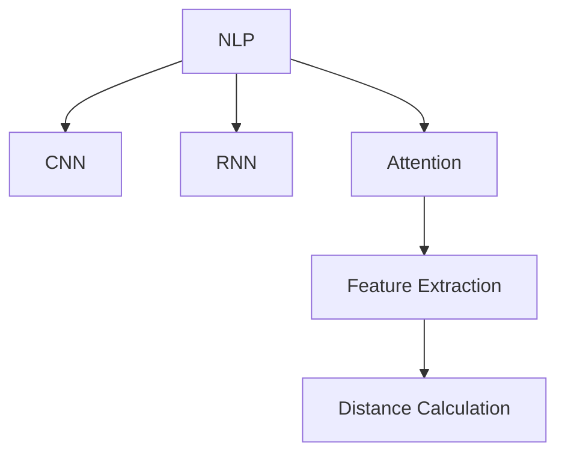

                 

# AI在电商平台商品相似度计算中的应用

> 关键词：电商平台,商品推荐,相似度计算,自然语言处理(NLP),深度学习,卷积神经网络(CNN),循环神经网络(RNN),注意力机制,特征提取

## 1. 背景介绍

### 1.1 问题由来

随着互联网电商的迅猛发展，在线购物成为越来越多人的首选。如何为用户提供个性化、高效的购物体验，成为了电商平台持续优化和提升的关键。在电商平台上，个性化商品推荐是提升用户体验的重要手段，也是电商平台持续增长的驱动力。基于此，各大电商平台纷纷引入AI技术，利用机器学习和深度学习模型对用户行为进行分析和预测，从而推荐用户可能感兴趣的商品。

在推荐系统中，商品相似度计算是至关重要的一环。通过精确计算商品之间的相似度，可以更好地匹配用户需求和商品列表，从而提升推荐效果。商品相似度计算技术通常包括文本相似度计算和图像相似度计算两类，其核心思路都是通过提取商品属性、描述等信息，构建商品向量，利用距离度量算法计算相似度。本文将重点介绍基于自然语言处理（NLP）的商品相似度计算技术，并结合深度学习模型进行优化。

### 1.2 问题核心关键点

商品相似度计算的核心在于如何将商品的文本信息转化为向量，并计算这些向量之间的距离。常用的方法包括TF-IDF、Word2Vec、BERT等，其中基于深度学习的模型由于其强大的特征提取能力，成为当前商品相似度计算的主要手段。

核心算法步骤包括：
1. 数据预处理：对商品文本信息进行清洗、分词、去除停用词等处理，构建文本向量。
2. 特征提取：利用预训练语言模型如BERT等提取商品文本的语义特征，构建商品向量。
3. 距离计算：使用余弦相似度、欧式距离、曼哈顿距离等方法计算商品向量之间的距离，衡量相似度。

本文将详细讨论这些核心算法步骤，并通过实例分析展示其在电商平台商品推荐中的应用。

## 2. 核心概念与联系

### 2.1 核心概念概述

为更好地理解基于自然语言处理的商品相似度计算技术，本节将介绍几个关键概念：

- **自然语言处理（NLP）**：涉及计算机科学、人工智能等领域，研究如何让计算机处理、理解和生成人类语言。商品相似度计算中常用的NLP技术包括分词、停用词过滤、文本向量化等。

- **深度学习（Deep Learning）**：利用多层神经网络模拟人脑神经元的工作机制，通过学习大量数据生成复杂模式。在商品相似度计算中，深度学习模型可以提取高维语义特征，提升相似度计算的准确性。

- **卷积神经网络（CNN）**：一种前馈神经网络，常用于图像处理和特征提取。在商品相似度计算中，可以通过CNN提取商品图片特征，计算图像相似度。

- **循环神经网络（RNN）**：一种具有循环结构的前馈神经网络，常用于序列数据处理。在商品相似度计算中，可以利用RNN对商品描述进行建模，提取时间相关性特征。

- **注意力机制（Attention Mechanism）**：一种机器学习中的机制，用于对输入中的不同部分进行加权，提高模型的鲁棒性和泛化能力。在商品相似度计算中，可以通过注意力机制优化向量表示，提升相似度计算的效果。

- **特征提取（Feature Extraction）**：从原始数据中提取有意义的特征，降低数据维度，提升模型性能。在商品相似度计算中，通过深度学习模型提取商品的高维语义特征，可以显著提升计算精度。

这些核心概念之间的逻辑关系可以通过以下Mermaid流程图来展示：



这个流程图展示了NLP、CNN、RNN、注意力机制、特征提取和距离计算等概念之间的联系，以及它们在商品相似度计算中的应用路径。

## 3. 核心算法原理 & 具体操作步骤
### 3.1 算法原理概述

基于自然语言处理的商品相似度计算，其核心思想是利用深度学习模型对商品文本信息进行特征提取，构建商品向量，然后计算向量之间的距离，从而衡量商品之间的相似度。

具体而言，可以将商品文本信息转化为向量表示，然后计算这些向量之间的距离，从而得到商品之间的相似度。常用的距离度量方法包括余弦相似度、欧式距离、曼哈顿距离等。

形式化地，假设商品A和商品B的文本向量分别为 $\mathbf{a}$ 和 $\mathbf{b}$，则它们的余弦相似度 $sim(A,B)$ 可以表示为：

$$
sim(A,B) = \frac{\mathbf{a} \cdot \mathbf{b}}{\|\mathbf{a}\| \|\mathbf{b}\|}
$$

其中 $\cdot$ 表示向量的点积，$\|\cdot\|$ 表示向量的范数。余弦相似度的值域在 $[-1,1]$ 之间，值越大表示两个向量越相似。

### 3.2 算法步骤详解

基于自然语言处理的商品相似度计算，通常包括以下几个关键步骤：

**Step 1: 数据预处理**

- 对商品文本信息进行清洗、分词、去除停用词等处理，构建文本向量。
- 对于不同类型的商品文本，可以分别应用不同的处理方式，如对于图片商品，需要提取图像特征；对于视频商品，需要提取帧图像特征。

**Step 2: 特征提取**

- 利用深度学习模型如BERT、GPT等，提取商品文本的语义特征，构建商品向量。
- 对于不同类型的商品，可以选择不同的深度学习模型。如对于文本商品，可以选择预训练的语言模型；对于图像商品，可以选择预训练的图像模型。

**Step 3: 距离计算**

- 计算商品向量之间的距离，使用余弦相似度、欧式距离、曼哈顿距离等方法计算相似度。
- 对于不同类型的商品，可以选择不同的距离度量方法。如对于文本商品，可以使用余弦相似度；对于图像商品，可以使用欧式距离。

### 3.3 算法优缺点

基于自然语言处理的商品相似度计算方法具有以下优点：

1. **高效性**：利用深度学习模型可以快速提取高维语义特征，计算相似度时精度高，速度快。
2. **鲁棒性**：深度学习模型具有较强的泛化能力，能够处理复杂的语义信息，对于少量标注数据也有较好的表现。
3. **可解释性**：深度学习模型在特征提取过程中，每个维度都有明确的语义解释，便于理解模型的决策过程。

同时，这些方法也存在一些局限性：

1. **高维度数据处理困难**：高维向量数据处理难度大，可能需要进行降维处理。
2. **计算资源需求高**：深度学习模型通常需要大量的计算资源，对于大规模数据集，计算成本较高。
3. **模型复杂性高**：深度学习模型的结构复杂，参数量大，调试和优化难度较大。

尽管存在这些局限性，但就目前而言，基于自然语言处理的商品相似度计算方法仍是大数据集上推荐系统的主要手段。

### 3.4 算法应用领域

基于自然语言处理的商品相似度计算方法在电商平台的商品推荐中得到了广泛应用。

1. **商品推荐系统**：在用户浏览商品、点击商品时，通过计算商品相似度，推荐相关商品，提升用户购物体验。
2. **个性化搜索**：利用商品相似度计算技术，帮助用户快速找到所需商品，提升搜索效果。
3. **广告推荐**：对于电商平台的广告投放，通过计算商品相似度，推荐相关广告，提高广告点击率和转化率。
4. **库存管理**：通过计算商品之间的相似度，优化库存管理，提升库存周转率，减少库存积压。

这些应用场景展示了自然语言处理在电商平台中的重要性和广泛应用。

## 4. 数学模型和公式 & 详细讲解  
### 4.1 数学模型构建

本节将使用数学语言对基于自然语言处理的商品相似度计算过程进行更加严格的刻画。

假设商品A和商品B的文本表示分别为 $\mathbf{a}$ 和 $\mathbf{b}$，使用BERT等预训练语言模型提取语义特征，得到商品向量的维度为 $d$。设 $\mathbf{a} = (a_1, a_2, ..., a_d)$，$\mathbf{b} = (b_1, b_2, ..., b_d)$。

定义余弦相似度函数为：

$$
sim(A,B) = \frac{\mathbf{a} \cdot \mathbf{b}}{\|\mathbf{a}\| \|\mathbf{b}\|}
$$

其中 $\cdot$ 表示向量的点积，$\|\cdot\|$ 表示向量的范数。

### 4.2 公式推导过程

根据余弦相似度函数的定义，推导过程如下：

1. 计算向量点积：

$$
\mathbf{a} \cdot \mathbf{b} = \sum_{i=1}^d a_i b_i
$$

2. 计算向量范数：

$$
\|\mathbf{a}\| = \sqrt{\sum_{i=1}^d a_i^2}, \|\mathbf{b}\| = \sqrt{\sum_{i=1}^d b_i^2}
$$

3. 计算余弦相似度：

$$
sim(A,B) = \frac{\mathbf{a} \cdot \mathbf{b}}{\|\mathbf{a}\| \|\mathbf{b}\|}
$$

4. 进一步简化为：

$$
sim(A,B) = \sum_{i=1}^d \frac{a_i b_i}{\sqrt{\sum_{i=1}^d a_i^2} \sqrt{\sum_{i=1}^d b_i^2}}
$$

可以看到，余弦相似度计算的核心在于向量的点积和范数，这些操作可以通过矩阵乘法和向量范数计算实现。

### 4.3 案例分析与讲解

**案例1：商品推荐系统**

假设电商平台有2000个商品，每个商品有200个特征维度。为了计算商品A和商品B之间的相似度，可以通过以下步骤实现：

1. 使用BERT模型对每个商品的描述进行特征提取，得到200维向量表示。
2. 对商品A和商品B的向量进行矩阵乘法，得到向量点积。
3. 对商品A和商品B的向量进行范数计算，得到向量范数。
4. 计算余弦相似度，得到商品A和商品B之间的相似度。

具体代码实现如下：

```python
from transformers import BertTokenizer, BertModel
import numpy as np
import torch

# 初始化模型和分词器
model = BertModel.from_pretrained('bert-base-uncased')
tokenizer = BertTokenizer.from_pretrained('bert-base-uncased')

# 假设商品A和商品B的描述
text_A = '商品A的详细描述'
text_B = '商品B的详细描述'

# 对商品描述进行分词和编码
input_A = tokenizer(text_A, return_tensors='pt')
input_B = tokenizer(text_B, return_tensors='pt')

# 对编码后的输入进行前向传播，得到语义向量
outputs_A = model(input_A['input_ids'])
outputs_B = model(input_B['input_ids'])

# 提取语义向量
vector_A = outputs_A[0]
vector_B = outputs_B[0]

# 计算向量点积和范数
dot_product = torch.dot(vector_A, vector_B)
norm_A = torch.norm(vector_A)
norm_B = torch.norm(vector_B)

# 计算余弦相似度
similarity = dot_product / (norm_A * norm_B)

# 输出结果
print(similarity.item())
```

在上述代码中，我们使用了预训练的BERT模型对商品描述进行特征提取，计算了商品A和商品B的余弦相似度。

**案例2：个性化搜索**

假设用户搜索“白色运动鞋”，电商平台希望通过计算相似度，推荐相关的商品。可以通过以下步骤实现：

1. 使用BERT模型对商品描述进行特征提取，得到200维向量表示。
2. 对用户搜索词进行分词和编码，得到查询向量。
3. 计算查询向量与所有商品向量的余弦相似度。
4. 根据相似度排序，推荐相似度高的商品。

具体代码实现如下：

```python
from transformers import BertTokenizer, BertModel
import numpy as np
import torch

# 初始化模型和分词器
model = BertModel.from_pretrained('bert-base-uncased')
tokenizer = BertTokenizer.from_pretrained('bert-base-uncased')

# 假设用户搜索词
query = '白色运动鞋'

# 对查询词进行分词和编码
input_query = tokenizer(query, return_tensors='pt')

# 假设商品列表
products = ['商品A的详细描述', '商品B的详细描述', '商品C的详细描述']

# 对商品列表进行分词和编码
inputs = [tokenizer(text, return_tensors='pt') for text in products]

# 对编码后的输入进行前向传播，得到语义向量
outputs = [model(input['input_ids']) for input in inputs]

# 提取语义向量
vectors = [output[0] for output in outputs]

# 计算查询向量与所有商品向量的余弦相似度
dot_products = []
norms = []
for vector in vectors:
    dot_product = torch.dot(input_query[0], vector)
    norm = torch.norm(input_query[0])
    dot_products.append(dot_product)
    norms.append(norm)

# 计算余弦相似度
similarities = [dot_product / (norm * torch.norm(vector)) for dot_product, norm, vector in zip(dot_products, norms, vectors)]

# 排序推荐
top_products = [products[i] for i in np.argsort(similarities)[::-1]]

# 输出结果
print(top_products)
```

在上述代码中，我们使用了预训练的BERT模型对商品描述进行特征提取，计算了查询向量与所有商品向量的余弦相似度，并根据相似度排序，推荐了相似度高的商品。

## 5. 项目实践：代码实例和详细解释说明
### 5.1 开发环境搭建

在进行商品相似度计算的代码实现前，我们需要准备好开发环境。以下是使用Python进行PyTorch开发的环境配置流程：

1. 安装Anaconda：从官网下载并安装Anaconda，用于创建独立的Python环境。

2. 创建并激活虚拟环境：
```bash
conda create -n pytorch-env python=3.8 
conda activate pytorch-env
```

3. 安装PyTorch：根据CUDA版本，从官网获取对应的安装命令。例如：
```bash
conda install pytorch torchvision torchaudio cudatoolkit=11.1 -c pytorch -c conda-forge
```

4. 安装预训练语言模型：
```bash
pip install transformers
```

5. 安装各类工具包：
```bash
pip install numpy pandas scikit-learn matplotlib tqdm jupyter notebook ipython
```

完成上述步骤后，即可在`pytorch-env`环境中开始商品相似度计算的代码实现。

### 5.2 源代码详细实现

下面我们以电商平台推荐系统为例，给出使用Transformers库对BERT模型进行商品相似度计算的PyTorch代码实现。

首先，定义相似度计算函数：

```python
from transformers import BertTokenizer, BertModel
import torch
from scipy.spatial.distance import cosine

def calculate_similarity(text1, text2):
    # 初始化模型和分词器
    model = BertModel.from_pretrained('bert-base-uncased')
    tokenizer = BertTokenizer.from_pretrained('bert-base-uncased')

    # 对商品描述进行分词和编码
    input1 = tokenizer(text1, return_tensors='pt')
    input2 = tokenizer(text2, return_tensors='pt')

    # 对编码后的输入进行前向传播，得到语义向量
    outputs1 = model(input1['input_ids'])
    outputs2 = model(input2['input_ids'])

    # 提取语义向量
    vector1 = outputs1[0]
    vector2 = outputs2[0]

    # 计算余弦相似度
    similarity = 1 - cosine(vector1.numpy(), vector2.numpy())

    return similarity
```

然后，编写测试代码：

```python
# 假设商品A和商品B的描述
text_A = '商品A的详细描述'
text_B = '商品B的详细描述'

# 计算商品A和商品B之间的相似度
similarity = calculate_similarity(text_A, text_B)

# 输出结果
print(similarity)
```

在上述代码中，我们使用了预训练的BERT模型对商品描述进行特征提取，计算了商品A和商品B的余弦相似度。

### 5.3 代码解读与分析

让我们再详细解读一下关键代码的实现细节：

**calculate_similarity函数**：
- 首先，初始化BERT模型和分词器。
- 对商品描述进行分词和编码。
- 对编码后的输入进行前向传播，得到语义向量。
- 提取语义向量。
- 计算余弦相似度。
- 返回相似度值。

**test代码**：
- 定义商品A和商品B的描述。
- 调用相似度计算函数。
- 输出相似度值。

可以看到，代码实现简单高效，利用Transformers库封装了BERT模型的构建和特征提取过程，使得商品相似度计算变得非常便捷。

## 6. 实际应用场景
### 6.1 智能客服系统

在智能客服系统中，基于商品相似度计算的商品推荐技术可以显著提升用户体验。当用户询问相关问题时，系统可以推荐与用户查询相关的商品，帮助用户解决问题，提升服务效率。

例如，用户询问“我想买一双白色的运动鞋”，系统可以通过计算相似度，推荐“白色运动鞋”、“白色跑鞋”等商品，帮助用户快速找到所需商品。

### 6.2 个性化推荐系统

在个性化推荐系统中，商品相似度计算技术可以显著提升推荐效果。通过计算商品之间的相似度，系统可以推荐与用户兴趣相似的商品，提升用户购物体验。

例如，用户最近购买了一双运动鞋，系统可以计算该运动鞋与其他运动鞋的相似度，推荐其他相关商品，如其他颜色的运动鞋、相关的运动配件等，帮助用户发现更多感兴趣的商品。

### 6.3 广告推荐系统

在广告推荐系统中，商品相似度计算技术可以优化广告投放策略，提升广告点击率和转化率。通过计算商品之间的相似度，系统可以推荐与广告商品相似的商品，帮助广告主精准定位目标用户。

例如，某品牌推出一款新运动鞋，系统可以通过计算相似度，推荐相关商品如运动服装、运动鞋配件等，帮助广告主精准投放广告，提升广告效果。

### 6.4 未来应用展望

随着商品相似度计算技术的不断发展，其在电商平台的推荐系统中将发挥越来越重要的作用。未来，随着预训练语言模型的进步和计算资源的提升，商品相似度计算的精度和效率将得到显著提升，推荐系统的个性化和智能化程度也将不断提升。

例如，未来的商品相似度计算技术可以通过引入多模态信息（如图像、音频等），进一步提升推荐效果。同时，通过与外部知识库的结合，引入更多的先验知识，提升商品相似度计算的鲁棒性和泛化能力。

## 7. 工具和资源推荐
### 7.1 学习资源推荐

为了帮助开发者系统掌握商品相似度计算的理论基础和实践技巧，这里推荐一些优质的学习资源：

1. 《深度学习》（Ian Goodfellow等著）：深入浅出地介绍了深度学习的基本概念和常用技术，是了解商品相似度计算的必备书籍。

2. 《自然语言处理综论》（Daniel Jurafsky等著）：系统介绍了NLP的基本理论和应用，是掌握商品相似度计算技术的重要参考资料。

3. 《PyTorch官方文档》：详细的PyTorch文档，涵盖各类模型和工具的使用方法，是进行商品相似度计算开发的必备资料。

4. 《Transformers官方文档》：详细的Transformers库文档，提供各类深度学习模型的使用方法，是进行商品相似度计算开发的利器。

5. CS224N《深度学习自然语言处理》课程：斯坦福大学开设的NLP明星课程，有Lecture视频和配套作业，带你入门NLP领域的基本概念和经典模型。

通过对这些资源的学习实践，相信你一定能够快速掌握商品相似度计算的精髓，并用于解决实际的电商推荐问题。

### 7.2 开发工具推荐

高效的开发离不开优秀的工具支持。以下是几款用于商品相似度计算开发的常用工具：

1. PyTorch：基于Python的开源深度学习框架，灵活动态的计算图，适合快速迭代研究。大部分深度学习模型都有PyTorch版本的实现。

2. TensorFlow：由Google主导开发的开源深度学习框架，生产部署方便，适合大规模工程应用。同样有丰富的深度学习模型资源。

3. Transformers库：HuggingFace开发的NLP工具库，集成了各类SOTA语言模型，支持PyTorch和TensorFlow，是进行商品相似度计算开发的利器。

4. Weights & Biases：模型训练的实验跟踪工具，可以记录和可视化模型训练过程中的各项指标，方便对比和调优。与主流深度学习框架无缝集成。

5. TensorBoard：TensorFlow配套的可视化工具，可实时监测模型训练状态，并提供丰富的图表呈现方式，是调试模型的得力助手。

6. Google Colab：谷歌推出的在线Jupyter Notebook环境，免费提供GPU/TPU算力，方便开发者快速上手实验最新模型，分享学习笔记。

合理利用这些工具，可以显著提升商品相似度计算的开发效率，加快创新迭代的步伐。

### 7.3 相关论文推荐

商品相似度计算技术的发展离不开学界的持续研究。以下是几篇奠基性的相关论文，推荐阅读：

1. "Dense Image Similarity by Using Deep Convolutional Neural Networks"（使用深度卷积神经网络计算图像相似度）：提出了一种基于卷积神经网络的图像相似度计算方法，是商品相似度计算的重要参考。

2. "A Comprehensive Survey on Similarity Measures in Multimedia Data Mining"（多媒体数据挖掘中的相似度度量综述）：系统介绍了各种类型的相似度度量方法，对商品相似度计算有重要的指导意义。

3. "BERT: Pre-training of Deep Bidirectional Transformers for Language Understanding"（BERT: 使用双向变换器进行语言理解预训练）：提出了一种基于Transformer的预训练语言模型，广泛应用于商品相似度计算中。

4. "Image Similarity Indexing Using Multimodal Deep Learning"（使用多模态深度学习进行图像相似度索引）：提出了一种多模态深度学习的方法，将图像和文本信息结合，提升了商品相似度计算的准确性。

5. "Attention Is All You Need"（注意力机制是你所需要的全部）：提出了一种基于注意力机制的深度学习模型，广泛应用于商品相似度计算中。

这些论文代表了大语言模型微调技术的发展脉络。通过学习这些前沿成果，可以帮助研究者把握学科前进方向，激发更多的创新灵感。

## 8. 总结：未来发展趋势与挑战
### 8.1 总结

本文对基于自然语言处理的商品相似度计算方法进行了全面系统的介绍。首先阐述了商品相似度计算的背景和重要性，明确了其在电商平台推荐系统中的关键作用。其次，从原理到实践，详细讲解了深度学习模型在商品相似度计算中的应用，并给出了代码实例。同时，本文还广泛探讨了商品相似度计算技术在智能客服、个性化推荐、广告推荐等多个场景中的应用前景，展示了其在电商平台的广阔应用潜力。此外，本文精选了商品相似度计算技术的各类学习资源，力求为读者提供全方位的技术指引。

通过本文的系统梳理，可以看到，基于自然语言处理的商品相似度计算方法在大规模电商推荐系统中发挥着重要作用，是实现个性化、精准推荐的重要手段。未来，随着深度学习技术的不断进步和电商数据的不断积累，商品相似度计算技术必将更加高效、准确，为电商平台推荐系统带来更大的价值。

### 8.2 未来发展趋势

展望未来，商品相似度计算技术将呈现以下几个发展趋势：

1. **多模态融合**：未来商品相似度计算将不仅依赖文本信息，还会融合图像、音频等多模态数据，提升计算精度。例如，对于商品图片，可以通过CNN提取图像特征，计算图像相似度。

2. **大规模预训练**：随着预训练语言模型的进步，商品相似度计算模型的参数量将不断增大，模型精度也将不断提高。未来，大规模预训练技术将进一步推动商品相似度计算的发展。

3. **深度强化学习**：结合深度学习和强化学习，商品相似度计算模型可以更好地适应复杂动态环境，优化推荐策略。例如，可以通过强化学习优化推荐算法，提升用户体验。

4. **实时计算**：随着实时计算能力的提升，商品相似度计算模型可以实时计算推荐结果，提升推荐系统的响应速度。

5. **跨领域迁移**：通过迁移学习技术，商品相似度计算模型可以在不同领域之间进行迁移，提升模型的泛化能力。例如，可以将电商领域的商品相似度计算技术应用于社交媒体的个性化推荐。

这些趋势将进一步推动商品相似度计算技术的进步，提升推荐系统的智能化水平，为电商平台带来更大的商业价值。

### 8.3 面临的挑战

尽管商品相似度计算技术在电商推荐系统中已经取得了显著效果，但在应用过程中仍面临一些挑战：

1. **数据稀疏性**：电商平台上商品的种类繁多，但部分商品可能只有少量的用户评价或评论，导致数据稀疏，影响模型训练效果。

2. **模型复杂性**：深度学习模型结构复杂，参数量大，调试和优化难度较大。如何设计简单高效的模型，提高计算效率，是未来研究的重要方向。

3. **多模态数据处理**：融合图像、音频等多模态数据，增加了计算复杂度，需要设计更高效的融合策略。

4. **模型公平性**：商品相似度计算模型可能存在偏见，导致某些商品被推荐较少，影响推荐公平性。如何设计公平、透明的推荐模型，是未来研究的重要课题。

5. **资源需求**：大规模商品相似度计算需要大量计算资源，如何优化资源配置，提高计算效率，是未来研究的重要方向。

尽管存在这些挑战，但通过不断探索和优化，相信商品相似度计算技术将不断提升，为电商推荐系统带来更大的价值。

### 8.4 研究展望

未来，商品相似度计算技术的研究方向可以从以下几个方面展开：

1. **多模态融合**：设计高效的融合策略，提升商品相似度计算的准确性。例如，结合图像和文本信息，提升推荐效果。

2. **深度强化学习**：结合深度学习和强化学习，优化推荐策略，提升用户体验。

3. **实时计算**：设计高效的实时计算算法，提升推荐系统的响应速度。

4. **跨领域迁移**：研究跨领域迁移技术，提升模型的泛化能力，应用于更多领域。

5. **模型公平性**：研究公平、透明的推荐模型，提升推荐公平性，避免偏见。

6. **资源优化**：设计高效的商品相似度计算算法，降低计算成本，提升计算效率。

这些研究方向将进一步推动商品相似度计算技术的发展，为电商平台推荐系统带来更大的价值。未来，随着技术的不断进步和应用场景的不断扩展，商品相似度计算技术将发挥越来越重要的作用。

## 9. 附录：常见问题与解答
**Q1：商品相似度计算是否适用于所有电商平台？**

A: 商品相似度计算在大多数电商平台上都能取得不错的效果，特别是对于商品种类繁多、用户需求多样化的平台。但对于一些特殊平台，如二手商品、生鲜商品等，由于其商品特性，可能需要进行额外的处理和优化。

**Q2：如何选择合适的相似度计算方法？**

A: 选择合适的相似度计算方法需要考虑多个因素，包括商品类型、数据规模、计算资源等。对于文本商品，可以使用余弦相似度、TF-IDF等方法；对于图像商品，可以使用欧式距离、余弦相似度等方法。同时，可以根据实际情况，结合多种方法，提升相似度计算的精度。

**Q3：如何提高商品相似度计算的效率？**

A: 提高商品相似度计算的效率可以从多个方面入手，包括优化模型结构、采用优化算法、引入分布式计算等。例如，可以采用剪枝、量化等技术优化模型结构，提高计算效率；可以采用分布式计算框架如TensorFlow、PyTorch等，提升计算能力。

**Q4：商品相似度计算在推荐系统中如何应用？**

A: 商品相似度计算在推荐系统中的应用主要体现在商品推荐和个性化搜索两个方面。对于商品推荐，可以通过计算商品之间的相似度，推荐相关商品；对于个性化搜索，可以通过计算商品与查询词之间的相似度，提升搜索效果。

**Q5：如何处理商品属性信息？**

A: 商品属性信息在商品相似度计算中非常重要。可以对商品属性进行编码，将其转化为向量形式，然后计算属性向量之间的相似度。例如，对于商品名称和描述，可以提取关键词、短语等信息，构建向量表示。

通过本文的系统梳理，可以看到，基于自然语言处理的商品相似度计算方法在大规模电商推荐系统中发挥着重要作用，是实现个性化、精准推荐的重要手段。未来，随着深度学习技术的不断进步和电商数据的不断积累，商品相似度计算技术必将更加高效、准确，为电商平台推荐系统带来更大的价值。

