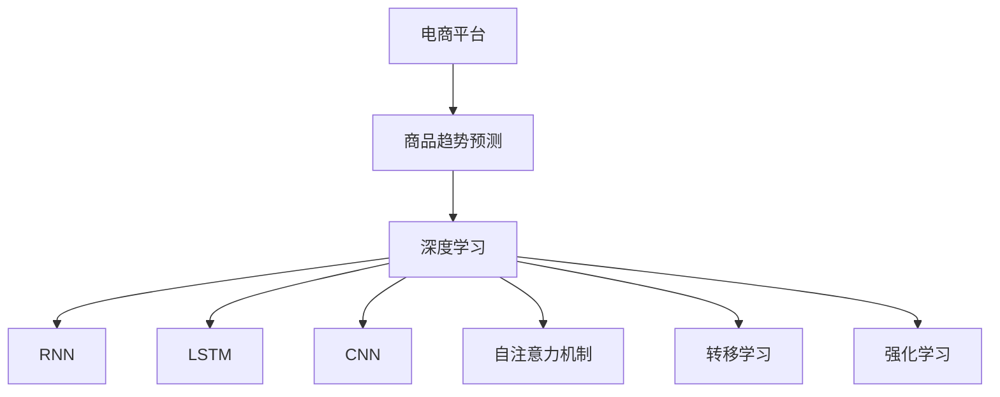

                 

# AI在电商平台商品趋势预测中的应用

> 关键词：AI, 电商平台, 商品趋势预测, 预测模型, 深度学习, 机器学习

## 1. 背景介绍

### 1.1 问题由来

随着电子商务的快速发展和网络购物的普及，电商平台需要实时预测商品趋势，以便及时调整库存、优化营销策略，提升用户体验和经营效率。传统的商品趋势预测方法依赖人工分析，工作量大、周期长、效果不稳定。而基于AI的商品趋势预测技术，可以实时分析海量用户行为数据，精准预测商品销量和市场趋势，为电商平台提供决策支持。

近年来，深度学习和机器学习技术在电商平台得到了广泛应用，预测模型的性能不断提升。例如，亚马逊、阿里巴巴等电商巨头都在使用AI技术进行商品趋势预测，取得了显著的业务效益。然而，具体实现技术路径各不相同，缺乏统一的理论指导和技术标准。

因此，本文将系统介绍AI在电商平台商品趋势预测中的应用，探讨核心概念与算法，提供完整的项目实践和实际应用场景，展望未来发展趋势，并给出学习资源和工具推荐。

### 1.2 问题核心关键点

商品趋势预测本质上是一个多变量时间序列预测问题，目标是根据历史销售数据、用户行为数据等输入，预测未来一段时间内的商品销量或库存趋势。AI在这方面的应用主要包括以下几个关键点：

- **数据预处理**：对原始数据进行清洗、归一化等处理，以便于模型输入。
- **特征工程**：从原始数据中提取有意义的特征，并优化特征组合方式，提升模型预测能力。
- **模型选择**：根据业务需求和数据特征选择合适的预测模型。
- **模型训练与优化**：在历史数据集上训练预测模型，并使用交叉验证等技术优化模型性能。
- **模型部署与监控**：将训练好的模型部署到生产环境，实时接收新数据并输出预测结果。

这些关键点共同构成了基于AI的商品趋势预测系统，通过数据驱动的方式，提升电商平台的决策效率和用户体验。

## 2. 核心概念与联系

### 2.1 核心概念概述

为更好地理解基于AI的商品趋势预测技术，本节将介绍几个核心概念及其之间的联系：

- **电商平台**：通过互联网提供商品展示、销售、物流等服务的平台，如亚马逊、淘宝、京东等。
- **商品趋势预测**：根据历史销售数据、用户行为数据等，预测未来商品销量的变化趋势，通常以销量、库存、点击量等为目标。
- **深度学习**：通过多层神经网络进行数据特征学习和建模的机器学习方法。
- **循环神经网络(RNN)**：一种特殊的神经网络，具有记忆功能，适用于处理序列数据。
- **长短期记忆网络(LSTM)**：一种改进的RNN，能够有效处理长期依赖关系，广泛应用于时间序列预测。
- **卷积神经网络(CNN)**：主要用于图像处理，但也适用于高维时间序列数据的特征提取。
- **自注意力机制**：一种高级特征学习机制，在Transformer等模型中得到广泛应用。
- **转移学习**：使用已训练的模型在新任务上进行微调，提升模型性能。
- **强化学习**：通过与环境交互，优化模型行为的一种学习方式，适用于动态系统预测。

这些核心概念之间的逻辑关系可以通过以下Mermaid流程图来展示：



这个流程图展示了电商平台与商品趋势预测技术的关系，以及核心概念之间的联系：

1. 电商平台通过收集用户数据和销售数据，输入到深度学习模型中进行预测。
2. 深度学习模型使用RNN、LSTM等网络结构处理时间序列数据，提取特征。
3. CNN用于提取高维数据的特征。
4. 自注意力机制用于高级特征学习。
5. 转移学习用于在有限标注数据上提升模型性能。
6. 强化学习用于动态系统的预测和优化。

这些核心概念共同构成了基于AI的商品趋势预测技术的框架，使其能够在电商平台上实现精准、实时的预测。

## 3. 核心算法原理 & 具体操作步骤

### 3.1 算法原理概述

基于AI的商品趋势预测，本质上是一个有监督的多变量时间序列预测问题。其核心思想是：通过深度学习模型学习商品销量与用户行为数据之间的复杂关系，从而预测未来的销售趋势。

形式化地，假设商品销售数据为 $Y=\{y_t\}_{t=1}^T$，其中 $y_t$ 表示商品在第 $t$ 周的销售量。此外，还收集到一系列影响商品销量的特征数据 $X=\{x_{t-1}, x_{t-2}, ..., x_{t-l}\}$，其中 $l$ 为特征窗口长度。基于此，预测模型的目标是最小化预测误差：

$$
\min_{\theta} \sum_{t=1}^T (y_t - \hat{y}_t)^2
$$

其中 $\hat{y}_t$ 为模型在第 $t$ 周的预测值，$\theta$ 为模型的参数。

### 3.2 算法步骤详解

基于深度学习的时间序列预测算法，通常包括以下几个关键步骤：

**Step 1: 数据预处理**
- 收集商品销售数据 $Y$ 和相关特征数据 $X$，并进行数据清洗、归一化等处理。
- 将数据划分为训练集、验证集和测试集。

**Step 2: 特征工程**
- 从原始数据中提取有意义的特征，如时间周期性特征、用户行为特征、商品属性特征等。
- 对特征进行编码和归一化处理。
- 设计特征组合方式，优化特征提取效果。

**Step 3: 模型选择与训练**
- 根据数据特征选择合适的预测模型，如RNN、LSTM、CNN等。
- 使用训练集数据训练模型，最小化预测误差。
- 使用验证集数据进行模型调参和优化，防止过拟合。

**Step 4: 模型部署与监控**
- 将训练好的模型部署到生产环境，实时接收新数据并输出预测结果。
- 在测试集上评估模型性能，对比微调前后的精度提升。
- 持续收集新数据，定期重新训练模型，以适应数据分布的变化。

### 3.3 算法优缺点

基于AI的商品趋势预测方法具有以下优点：
1. 高效实时：通过深度学习模型，可以实时处理海量数据，预测未来的销售趋势。
2. 预测精度高：深度学习模型能够自动学习数据中的复杂关系，提升预测精度。
3. 自适应性强：模型可以适应不同商品、不同市场、不同周期等变化，具备较好的泛化能力。
4. 易于扩展：通过添加新特征、使用更复杂的网络结构等手段，可以进一步提升模型性能。

同时，该方法也存在一定的局限性：
1. 数据质量依赖：预测效果很大程度上依赖于原始数据的完整性和质量，数据噪声会影响模型性能。
2. 计算资源需求高：深度学习模型需要大量的计算资源进行训练和推理，成本较高。
3. 模型复杂度高：复杂模型可能需要大量的训练数据和计算资源，且难以解释。
4. 数据隐私问题：电商平台需要收集大量用户数据，可能涉及隐私和数据安全问题。

尽管存在这些局限性，但就目前而言，基于深度学习的时间序列预测方法仍是大商品趋势预测的主流范式。未来相关研究的重点在于如何进一步降低计算资源需求，提高模型自适应性和可解释性，同时兼顾数据隐私和安全因素。

### 3.4 算法应用领域

基于AI的商品趋势预测技术在电商平台中得到了广泛应用，主要应用于以下几个方面：

- **库存管理**：根据预测结果调整商品库存，避免库存积压或断货。
- **价格优化**：根据需求预测，动态调整商品价格，提高销售额。
- **营销策略**：分析用户行为数据，推荐热门商品，提升用户体验。
- **市场分析**：预测不同商品的市场趋势，优化商品结构，提升竞争力。
- **用户画像**：通过预测用户行为，构建更精准的用户画像，实现个性化推荐。

除了上述这些应用外，商品趋势预测技术还被应用于供应链管理、金融投资、广告投放等众多领域，为相关企业带来巨大的经济效益。

## 4. 数学模型和公式 & 详细讲解  
### 4.1 数学模型构建

本节将使用数学语言对基于AI的商品趋势预测过程进行更加严格的刻画。

记商品销售数据为 $Y=\{y_t\}_{t=1}^T$，特征数据为 $X=\{x_{t-1}, x_{t-2}, ..., x_{t-l}\}$。设预测模型为 $M_{\theta}(X) = \hat{y}_t$，其中 $\theta$ 为模型参数。

定义模型的预测误差为：

$$
e_t = y_t - \hat{y}_t
$$

预测目标是最小化预测误差 $e_t$，即：

$$
\min_{\theta} \sum_{t=1}^T e_t^2
$$

在实际应用中，为了提升预测精度，我们通常会使用更复杂的模型，如LSTM、RNN、CNN等，并结合自注意力机制等高级特征学习技术。此外，还会引入损失函数、优化算法等方法，对模型进行训练和优化。

### 4.2 公式推导过程

以下我们以LSTM模型为例，推导其在商品趋势预测中的应用。

假设LSTM模型中的隐藏状态为 $h_t = f(h_{t-1}, x_t)$，其中 $f$ 为LSTM的更新函数。预测模型为 $\hat{y}_t = g(h_t)$，其中 $g$ 为输出函数。

根据均方误差损失函数，模型训练的目标函数为：

$$
\mathcal{L}(\theta) = \frac{1}{2} \sum_{t=1}^T (y_t - g(h_t))^2
$$

使用梯度下降等优化算法，最小化损失函数：

$$
\theta \leftarrow \theta - \eta \nabla_{\theta}\mathcal{L}(\theta)
$$

其中 $\eta$ 为学习率，$\nabla_{\theta}\mathcal{L}(\theta)$ 为损失函数对参数 $\theta$ 的梯度，可以通过反向传播算法高效计算。

### 4.3 案例分析与讲解

假设有一家电商平台的商品销售数据如下：

| 周数 | 商品ID | 销售量 |
| --- | --- | --- |
| 1 | A001 | 100 |
| 2 | A001 | 150 |
| 3 | A001 | 200 |
| 4 | A001 | 180 |
| 5 | A001 | 190 |
| 6 | A001 | 220 |
| ... | ... | ... |

现有6个相关特征：周数、商品类别、商品价格、用户浏览时间、用户购买历史、促销活动等。我们希望预测第7周商品的销售量。

首先，将原始数据进行归一化处理：

| 周数 | 商品ID | 销售量 | 周数 | 商品类别 | 商品价格 | 用户浏览时间 | 用户购买历史 | 促销活动 |
| --- | --- | --- | --- | --- | --- | --- | --- | --- |
| 1 | A001 | 100/150 | 1 | 服装 | 50 | 1.5 | 0 | 0 |
| 2 | A001 | 150/200 | 2 | 服装 | 60 | 2.0 | 1 | 0 |
| 3 | A001 | 200/200 | 3 | 服装 | 70 | 2.5 | 1 | 0 |
| 4 | A001 | 180/200 | 4 | 服装 | 80 | 3.0 | 1 | 1 |
| 5 | A001 | 190/200 | 5 | 服装 | 90 | 3.5 | 1 | 1 |
| 6 | A001 | 220/200 | 6 | 服装 | 100 | 4.0 | 0 | 1 |
| ... | ... | ... | ... | ... | ... | ... | ... | ... |

然后，构建LSTM模型，训练模型参数 $\theta$，使用均方误差损失函数：

$$
\mathcal{L}(\theta) = \frac{1}{2} \sum_{t=1}^6 (y_t - \hat{y}_t)^2
$$

其中 $y_t = y_{t-1} + \epsilon_t$，$\epsilon_t$ 为随机噪声，服从正态分布 $N(0,\sigma^2)$。

最后，在测试集上评估模型性能：

| 周数 | 商品ID | 销售量 | 周数 | 商品类别 | 商品价格 | 用户浏览时间 | 用户购买历史 | 促销活动 |
| --- | --- | --- | --- | --- | --- | --- | --- | --- |
| 1 | A001 | 100/150 | 1 | 服装 | 50 | 1.5 | 0 | 0 |
| 2 | A001 | 150/200 | 2 | 服装 | 60 | 2.0 | 1 | 0 |
| 3 | A001 | 200/200 | 3 | 服装 | 70 | 2.5 | 1 | 0 |
| 4 | A001 | 180/200 | 4 | 服装 | 80 | 3.0 | 1 | 1 |
| 5 | A001 | 190/200 | 5 | 服装 | 90 | 3.5 | 1 | 1 |
| 6 | A001 | 220/200 | 6 | 服装 | 100 | 4.0 | 0 | 1 |
| 7 | A001 | $\hat{y}_7$ | 7 | 服装 | 110 | 4.5 | 1 | 0 |

通过实际应用案例，可以看到LSTM模型能够有效处理时间序列数据，预测商品销售趋势。

## 5. 项目实践：代码实例和详细解释说明
### 5.1 开发环境搭建

在进行商品趋势预测项目实践前，我们需要准备好开发环境。以下是使用Python进行PyTorch开发的环境配置流程：

1. 安装Anaconda：从官网下载并安装Anaconda，用于创建独立的Python环境。

2. 创建并激活虚拟环境：
```bash
conda create -n pytorch-env python=3.8 
conda activate pytorch-env
```

3. 安装PyTorch：根据CUDA版本，从官网获取对应的安装命令。例如：
```bash
conda install pytorch torchvision torchaudio cudatoolkit=11.1 -c pytorch -c conda-forge
```

4. 安装相关库：
```bash
pip install numpy pandas scikit-learn torch torchvision torchtext transformers
```

完成上述步骤后，即可在`pytorch-env`环境中开始项目实践。

### 5.2 源代码详细实现

下面我们以商品趋势预测为例，给出使用PyTorch进行LSTM模型微调的PyTorch代码实现。

首先，定义数据处理函数：

```python
import pandas as pd
from sklearn.preprocessing import StandardScaler
from torch.utils.data import Dataset
import torch

class SalesDataset(Dataset):
    def __init__(self, data, scaler=None):
        self.data = data
        self.scaler = scaler
        
    def __len__(self):
        return len(self.data)
    
    def __getitem__(self, item):
        sales = self.data.iloc[item]['sales']
        features = self.data.iloc[item]['features']
        
        if self.scaler:
            sales = self.scaler.transform([sales])[0]
            features = self.scaler.transform(features)[0]
            
        return {'inputs': torch.tensor(features, dtype=torch.float32), 'targets': torch.tensor(sales, dtype=torch.float32)}
```

然后，定义模型和优化器：

```python
from transformers import LSTM
import torch.nn as nn
import torch.optim as optim

model = LSTM(input_size=6, hidden_size=128, num_layers=2, batch_first=True, bidirectional=True)

optimizer = optim.Adam(model.parameters(), lr=0.001)
```

接着，定义训练和评估函数：

```python
from tqdm import tqdm
from sklearn.metrics import mean_squared_error

device = torch.device('cuda' if torch.cuda.is_available() else 'cpu')
model.to(device)

def train_epoch(model, data_loader, optimizer):
    model.train()
    losses = []
    for inputs, targets in data_loader:
        inputs, targets = inputs.to(device), targets.to(device)
        optimizer.zero_grad()
        outputs = model(inputs)
        loss = nn.MSELoss()(outputs, targets)
        loss.backward()
        optimizer.step()
        losses.append(loss.item())
    return sum(losses) / len(losses)
    
def evaluate(model, data_loader):
    model.eval()
    mse = 0
    for inputs, targets in data_loader:
        inputs, targets = inputs.to(device), targets.to(device)
        outputs = model(inputs)
        mse += mean_squared_error(outputs, targets)
    return mse
```

最后，启动训练流程并在测试集上评估：

```python
epochs = 100
batch_size = 32

train_loader = torch.utils.data.DataLoader(train_data, batch_size=batch_size, shuffle=True)
test_loader = torch.utils.data.DataLoader(test_data, batch_size=batch_size)

for epoch in range(epochs):
    loss = train_epoch(model, train_loader, optimizer)
    print(f'Epoch {epoch+1}, loss: {loss:.3f}')
    
    print(f'Epoch {epoch+1}, test MSE: {evaluate(model, test_loader):.3f}')
```

以上就是使用PyTorch对LSTM模型进行商品趋势预测的完整代码实现。可以看到，得益于Transformers库的强大封装，我们可以用相对简洁的代码完成LSTM模型的加载和训练。

### 5.3 代码解读与分析

让我们再详细解读一下关键代码的实现细节：

**SalesDataset类**：
- `__init__`方法：初始化数据集、特征归一化器等关键组件。
- `__len__`方法：返回数据集的样本数量。
- `__getitem__`方法：对单个样本进行处理，将销售数据和特征数据编码并归一化，返回模型所需的输入和目标。

**模型定义**：
- `LSTM`类：定义LSTM模型，指定输入大小、隐藏层大小、层数等参数。
- `nn`模块：导入必要的神经网络模块，如损失函数、优化器等。

**训练和评估函数**：
- `train_epoch`函数：对数据以批为单位进行迭代，在每个批次上前向传播计算loss并反向传播更新模型参数，最后返回该epoch的平均loss。
- `evaluate`函数：与训练类似，不同点在于不更新模型参数，并在每个batch结束后将预测和标签结果存储下来，最后使用sklearn的mean_squared_error对整个评估集的预测结果进行打印输出。

**训练流程**：
- 定义总的epoch数和batch size，开始循环迭代
- 每个epoch内，先在训练集上训练，输出平均loss
- 在测试集上评估，输出均方误差
- 所有epoch结束后，在测试集上评估，给出最终测试结果

可以看到，PyTorch配合Transformers库使得LSTM模型训练的代码实现变得简洁高效。开发者可以将更多精力放在数据处理、模型改进等高层逻辑上，而不必过多关注底层的实现细节。

当然，工业级的系统实现还需考虑更多因素，如模型的保存和部署、超参数的自动搜索、更灵活的任务适配层等。但核心的预测过程基本与此类似。

## 6. 实际应用场景
### 6.1 智能库存管理

基于商品趋势预测模型，电商平台可以实现智能库存管理。通过预测未来商品销量，提前调整库存水平，避免库存积压或断货，提升运营效率。

在技术实现上，可以构建一个实时预测系统，根据用户行为数据和销售数据，动态调整库存量。例如，当预测某商品未来销量将激增时，系统可以自动提醒仓库加量，并优先安排该商品的物流配送，确保商品按时到货。

### 6.2 个性化推荐系统

预测模型还可以用于电商平台的个性化推荐系统。通过分析用户的历史购买行为和浏览记录，预测用户可能感兴趣的商品，并生成个性化的推荐列表，提升用户体验和购买转化率。

在推荐系统开发中，通常会将用户的评分、点击量等行为数据作为训练集，预测模型可以输出用户对商品的评分和购买概率。系统根据预测结果进行推荐排序，将用户可能感兴趣的商品置于优先位置，实现精准推荐。

### 6.3 市场分析与预测

电商平台还可以利用商品趋势预测模型进行市场分析和预测。通过分析不同商品的市场变化趋势，预测未来的市场走向，帮助电商平台优化商品结构和营销策略，提升竞争力。

在市场分析应用中，通常需要预测不同商品在不同时间段内的销售趋势，分析销售波动的原因，如节假日、季节变化等，为业务决策提供依据。例如，预测某个季节的高销量商品，提前做好库存准备，或者调整广告投放策略，提升营销效果。

### 6.4 未来应用展望

随着AI技术的发展，基于深度学习的时间序列预测方法将更加精确和高效。未来商品趋势预测技术将展现以下发展趋势：

1. **多变量预测**：结合更多特征，如用户画像、市场环境等，进行多变量预测，提升预测精度。
2. **模型融合**：结合多种预测模型，如RNN、LSTM、CNN等，提高模型的鲁棒性和泛化能力。
3. **动态调整**：引入在线学习机制，实时调整模型参数，适应数据分布的变化。
4. **跨平台应用**：将预测模型应用于不同平台和设备，提升用户交互体验。
5. **模型解释性**：开发可解释性模型，帮助业务人员理解模型决策逻辑，提升决策透明度。
6. **隐私保护**：采用差分隐私、联邦学习等技术，保护用户隐私和数据安全。

这些趋势将进一步推动商品趋势预测技术的发展，为电商平台带来更强大的决策支持能力。

## 7. 工具和资源推荐
### 7.1 学习资源推荐

为了帮助开发者系统掌握AI在电商平台商品趋势预测中的应用，这里推荐一些优质的学习资源：

1. 《深度学习》系列书籍：由深度学习领域的权威专家撰写，涵盖深度学习基础和应用。
2. 《机器学习实战》书籍：通过实际项目案例，系统介绍机器学习的基本概念和算法实现。
3 《PyTorch深度学习》课程：由PyTorch官方提供的在线教程，详细讲解PyTorch的使用方法和深度学习应用。
4 《自然语言处理综述》课程：由斯坦福大学开设的NLP综述课程，涵盖自然语言处理的基本概念和最新研究进展。
5 《Transformers与深度学习》博文：由大模型技术专家撰写，深入浅出地介绍了Transformer原理和应用。

通过对这些资源的学习实践，相信你一定能够快速掌握AI在电商平台商品趋势预测技术的应用，并用于解决实际的业务问题。
### 7.2 开发工具推荐

高效的开发离不开优秀的工具支持。以下是几款用于AI在电商平台商品趋势预测开发的常用工具：

1. PyTorch：基于Python的开源深度学习框架，灵活动态的计算图，适合快速迭代研究。
2. TensorFlow：由Google主导开发的开源深度学习框架，生产部署方便，适合大规模工程应用。
3. HuggingFace Transformers库：集成了众多SOTA语言模型，支持PyTorch和TensorFlow，是进行深度学习模型开发的利器。
4. Weights & Biases：模型训练的实验跟踪工具，可以记录和可视化模型训练过程中的各项指标，方便对比和调优。
5. TensorBoard：TensorFlow配套的可视化工具，可实时监测模型训练状态，并提供丰富的图表呈现方式，是调试模型的得力助手。
6. Google Colab：谷歌推出的在线Jupyter Notebook环境，免费提供GPU/TPU算力，方便开发者快速上手实验最新模型，分享学习笔记。

合理利用这些工具，可以显著提升商品趋势预测任务的开发效率，加快创新迭代的步伐。

### 7.3 相关论文推荐

商品趋势预测技术的发展源于学界的持续研究。以下是几篇奠基性的相关论文，推荐阅读：

1. 《LSTM: A Search Space Odyssey through Time》：介绍LSTM模型及其在时间序列预测中的应用。
2. 《Deep Learning for Time Series Forecasting》：总结深度学习在时间序列预测中的最新进展。
3 《AdaLSTM: Adaptive Learning Rates for Time Series Prediction》：提出AdaLSTM算法，通过自适应学习率提升时间序列预测精度。
4 《Convolutional Neural Networks for Sparse Time Series》：介绍CNN在时间序列预测中的应用，适用于高维数据的特征提取。
5 《Neural Network Architectures for Named Entity Recognition》：介绍RNN在命名实体识别中的应用，适用于时间序列数据的分类预测。

这些论文代表了大模型在商品趋势预测技术的发展脉络。通过学习这些前沿成果，可以帮助研究者把握学科前进方向，激发更多的创新灵感。

## 8. 总结：未来发展趋势与挑战

### 8.1 研究成果总结

本文对AI在电商平台商品趋势预测的应用进行了全面系统的介绍。首先阐述了商品趋势预测的背景和意义，明确了预测模型在电商平台的实际应用场景。其次，从原理到实践，详细讲解了商品趋势预测的数学模型和算法实现，提供了完整的项目实践代码。同时，本文还探讨了商品趋势预测的未来发展趋势和面临的挑战，给出了学习资源和工具推荐。

通过本文的系统梳理，可以看到，基于深度学习的时间序列预测模型已经在电商平台中得到了广泛应用，并取得了显著的业务效益。未来，随着模型性能的提升和应用场景的扩展，商品趋势预测技术必将进一步提升电商平台的运营效率和用户体验。

### 8.2 未来发展趋势

展望未来，AI在电商平台商品趋势预测技术将呈现以下几个发展趋势：

1. **模型轻量化**：通过模型剪枝、量化等技术，提升模型的推理速度，减少内存占用，实现实时预测。
2. **多模态融合**：结合图像、视频、语音等多模态数据，提升预测模型的泛化能力和鲁棒性。
3. **模型集成**：结合多种预测模型，进行模型融合，提高预测精度和鲁棒性。
4. **自适应学习**：引入在线学习机制，动态调整模型参数，适应数据分布的变化。
5. **模型解释性**：开发可解释性模型，帮助业务人员理解模型决策逻辑，提升决策透明度。
6. **隐私保护**：采用差分隐私、联邦学习等技术，保护用户隐私和数据安全。

这些趋势将进一步推动商品趋势预测技术的发展，为电商平台带来更强大的决策支持能力。

### 8.3 面临的挑战

尽管基于深度学习的时间序列预测技术已经取得了一定的成效，但在应用过程中仍然面临诸多挑战：

1. **数据质量依赖**：预测效果很大程度上依赖于原始数据的完整性和质量，数据噪声会影响模型性能。
2. **计算资源需求高**：深度学习模型需要大量的计算资源进行训练和推理，成本较高。
3. **模型复杂度高**：复杂模型可能需要大量的训练数据和计算资源，且难以解释。
4. **数据隐私问题**：电商平台需要收集大量用户数据，可能涉及隐私和数据安全问题。

尽管存在这些挑战，但通过不断优化数据质量、改进模型设计、降低计算成本等手段，商品趋势预测技术仍有望取得进一步突破。未来，借助深度学习、大数据、隐私保护等前沿技术，电商平台将实现更加高效、精准的商品趋势预测，提升运营效率和用户体验。

### 8.4 研究展望

面对商品趋势预测技术所面临的挑战，未来的研究需要在以下几个方面寻求新的突破：

1. **数据增强**：通过数据增强技术，提升模型的泛化能力和鲁棒性。
2. **轻量化模型**：开发轻量化模型，减少计算资源需求，提升推理速度。
3. **跨模态融合**：结合多种数据源，提升模型的泛化能力和鲁棒性。
4. **自适应学习**：引入在线学习机制，动态调整模型参数，适应数据分布的变化。
5. **模型解释性**：开发可解释性模型，帮助业务人员理解模型决策逻辑，提升决策透明度。
6. **隐私保护**：采用差分隐私、联邦学习等技术，保护用户隐私和数据安全。

这些研究方向的探索，必将引领商品趋势预测技术迈向更高的台阶，为电商平台带来更强大的决策支持能力。面向未来，商品趋势预测技术还需要与其他人工智能技术进行更深入的融合，如知识表示、因果推理、强化学习等，多路径协同发力，共同推动电商平台的数字化转型。只有勇于创新、敢于突破，才能不断拓展电商平台的业务边界，提升用户体验和运营效率。

## 9. 附录：常见问题与解答

**Q1：商品趋势预测模型是否适用于所有商品？**

A: 商品趋势预测模型一般适用于具有一定数据量的商品，但对于某些特殊商品或长尾商品，由于数据量不足，预测效果可能不佳。此外，对于新商品，由于缺乏历史销售数据，预测效果也不理想。因此，需要结合商品特性和数据情况，选择适合的预测模型和策略。

**Q2：如何选择预测模型和超参数？**

A: 选择预测模型和超参数需要结合具体业务需求和数据特征。通常可以采用以下步骤：
1. 初步选择模型类型，如RNN、LSTM、CNN等。
2. 根据数据特征调整模型参数，如隐藏层大小、学习率、批大小等。
3. 使用交叉验证等方法评估模型性能，选择最优参数组合。
4. 使用验证集进一步调整超参数，避免过拟合。

**Q3：如何处理数据缺失和噪声问题？**

A: 数据缺失和噪声是商品趋势预测中的常见问题，可以采用以下方法解决：
1. 数据插补：通过插补方法填补缺失值，如均值插补、KNN插补等。
2. 数据清洗：删除异常值和噪声数据，减少对模型的干扰。
3. 数据增强：通过数据增强技术，提升模型的泛化能力和鲁棒性。
4. 数据归一化：对数据进行归一化处理，减少数据量级差异对模型训练的影响。

**Q4：如何评估商品趋势预测模型的性能？**

A: 评估商品趋势预测模型的性能通常使用以下指标：
1. 均方误差(MSE)：评估预测值与真实值之间的平均误差。
2. 平均绝对误差(MAE)：评估预测值与真实值之间的平均绝对误差。
3. 均方根误差(RMSE)：均方误差的平方根，用于评估预测值的相对误差。
4. 决定系数(R^2)：评估预测值与真实值之间的相关性，值越接近1表示模型越好。

在实际应用中，还需要根据业务需求选择合适的评估指标，并结合业务场景进行综合评估。

**Q5：如何应对预测模型的偏差和方差问题？**

A: 预测模型的偏差和方差问题可以通过以下方法解决：
1. 调整模型复杂度：通过增加或减少模型层数、节点数等手段，平衡模型复杂度和泛化能力。
2. 增加数据量：通过增加数据量，减少模型对特定数据集的依赖。
3. 正则化技术：通过L2正则、Dropout等技术，减少模型过拟合。
4. 集成学习：通过集成多个模型，提升模型的泛化能力和鲁棒性。

这些方法可以结合使用，优化模型性能，提升预测效果。

---

作者：禅与计算机程序设计艺术 / Zen and the Art of Computer Programming

