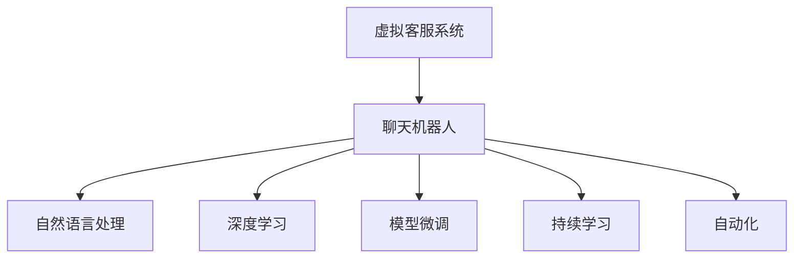

                 

# AI在虚拟客户服务中的应用：提供24/7支持

> 关键词：虚拟客服,自然语言处理(NLP),聊天机器人,对话系统,深度学习,用户支持,自动化

## 1. 背景介绍

随着互联网和移动互联网的迅速发展，客户服务成为各大企业提升竞争力的重要环节。但传统的客服模式存在诸多痛点：人力成本高、响应时间慢、工作时间有限等。在企业面临全时用户需求和竞争压力日益加剧的当下，如何以更低的成本、更快的速度、更高效的资源利用率，持续提供优质的客户服务？

近年来，AI技术，尤其是自然语言处理（NLP）和大规模预训练语言模型的发展，使得虚拟客服系统成为企业提升客户服务体验的重要选择。通过虚拟客服系统，企业可以24/7无间断地响应客户需求，实时提供智能、精准、个性化的服务，极大地提升了客户满意度，降低了运营成本。

本文将详细介绍虚拟客服系统，包括其核心技术原理、关键算法步骤、具体实现方法、实际应用场景等，以期为相关企业和开发者提供实用的参考和指导。

## 2. 核心概念与联系

### 2.1 核心概念概述

为更好地理解虚拟客服系统的设计与实现，本节将介绍几个密切相关的核心概念：

- **虚拟客服系统（Virtual Customer Service System）**：利用NLP和大规模预训练语言模型，通过聊天机器人等形式，实现24/7无间断自动响应用户需求，提供智能、精准、个性化的客户支持服务。

- **聊天机器人（Chatbot）**：一种基于NLP技术的AI应用，能够通过文字或语音进行自然语言交互，完成信息检索、自动回复、用户引导等功能。

- **深度学习（Deep Learning）**：一类基于多层神经网络的机器学习方法，通过大量数据进行训练，学习复杂的非线性映射关系。在大规模预训练语言模型中，深度学习是其核心的技术支撑。

- **自然语言处理（NLP）**：使计算机理解、处理和生成自然语言的能力，是AI技术中发展较成熟、应用广泛的领域。

- **模型微调（Model Fine-Tuning）**：在预训练模型的基础上，使用下游任务的少量标注数据，通过有监督学习优化模型在特定任务上的性能。在虚拟客服中，微调用于提升聊天机器人的智能回答能力。

- **持续学习（Continual Learning）**：模型不断从新数据中学习，同时保持已学习的知识，避免灾难性遗忘。虚拟客服系统通过持续学习，能不断更新知识库，提升服务质量。

- **自动化（Automation）**：通过AI技术实现自动化的客户服务，减少人工干预，提高响应速度和效率。

这些核心概念之间的逻辑关系可以通过以下Mermaid流程图来展示：



这个流程图展示了这个体系的主要组成部分和它们之间的联系：

1. **虚拟客服系统**：作为核心服务，通过聊天机器人提供自然语言交互。
2. **聊天机器人**：依托于自然语言处理和深度学习技术，实现自动回复、引导等功能。
3. **自然语言处理**：使计算机能够理解和生成自然语言，是聊天机器人的技术基础。
4. **深度学习**：通过大规模预训练语言模型，使机器具备强大的语言理解能力。
5. **模型微调**：通过下游任务的少量标注数据，优化模型在特定任务上的表现。
6. **持续学习**：不断从新数据中学习，保持知识更新。
7. **自动化**：实现全时无间断的客户服务。

## 3. 核心算法原理 & 具体操作步骤

### 3.1 算法原理概述

虚拟客服系统的核心算法基于深度学习和大规模预训练语言模型，通过自然语言处理技术，使计算机具备自然语言理解和生成的能力。其主要算法流程包括以下几个关键步骤：

1. **预训练模型选择**：选择合适的预训练语言模型，如GPT-3、BERT等，作为虚拟客服系统的基础模型。
2. **任务适配层设计**：根据具体客服任务，设计合适的任务适配层，如意图分类、实体抽取、对话管理等。
3. **数据准备与标注**：准备大量的对话数据，并对其进行标注，以便用于微调和模型训练。
4. **模型微调**：在预训练模型上，使用下游任务的少量标注数据进行微调，优化模型在特定任务上的性能。
5. **对话管理与用户引导**：引入对话管理策略，如上下文感知、用户意图识别、多轮对话管理等，提升用户体验。

### 3.2 算法步骤详解

下面详细介绍虚拟客服系统中的核心算法步骤。

**Step 1: 准备预训练模型和数据集**

1. **预训练模型选择**：选择合适的预训练语言模型，如GPT-3、BERT等，作为虚拟客服系统的基础模型。
2. **数据集准备**：准备大量的对话数据，并对其进行标注，以便用于微调和模型训练。标注数据应涵盖常见的客户服务场景，如问题回答、用户引导、错误处理等。

**Step 2: 添加任务适配层**

1. **意图分类**：设计意图分类器，识别客户提出的问题类别。通常使用线性分类器、CNN等方法进行实现。
2. **实体抽取**：抽取客户问题中的关键信息，如人名、地名、时间等。使用序列标注模型如BiLSTM、CRF等实现。
3. **对话管理**：设计对话管理器，维护上下文信息，控制对话流程。可以使用序列到序列模型、注意力机制等方法实现。

**Step 3: 设置微调超参数**

1. **学习率**：选择合适的小学习率，避免破坏预训练权重。一般从1e-5开始，逐步减小。
2. **批大小**：设置合适的批大小，提高训练效率。一般选择16-64。
3. **迭代轮数**：设置合适的迭代轮数，避免过拟合。一般选择10-20轮。
4. **正则化**：使用L2正则、Dropout等技术防止过拟合。

**Step 4: 执行梯度训练**

1. **前向传播**：将对话数据输入模型，前向传播计算损失函数。
2. **反向传播**：计算梯度，反向传播更新模型参数。
3. **优化器**：使用Adam、SGD等优化器进行参数更新。
4. **验证集评估**：周期性在验证集上评估模型性能，决定是否Early Stopping。
5. **迭代**：重复上述步骤，直至满足预设的迭代轮数或Early Stopping条件。

**Step 5: 测试和部署**

1. **测试集评估**：在测试集上评估微调后的模型性能，对比微调前后的精度提升。
2. **部署**：将微调后的模型集成到实际应用系统中，进行实时客户服务。
3. **持续学习**：定期收集新的对话数据，重新微调模型，保持服务质量。

### 3.3 算法优缺点

虚拟客服系统基于深度学习和大规模预训练语言模型，具有以下优点：

1. **高效性**：通过微调优化模型性能，能够在下游任务中快速达到较高精度，提升客户服务效率。
2. **可扩展性**：预训练模型可扩展至多种任务，只需设计合适的任务适配层，即可实现多任务处理。
3. **全天候服务**：24/7无间断地响应客户需求，提升用户体验。

同时，该方法也存在以下局限性：

1. **依赖标注数据**：微调效果依赖于标注数据的质量和数量，标注成本较高。
2. **过拟合风险**：下游任务标注数据较少时，可能出现过拟合。
3. **冷启动问题**：新任务或领域的数据较少时，模型可能无法有效适应。
4. **计算资源需求高**：预训练模型参数量大，计算和存储资源需求高。
5. **解释性不足**：模型内部决策过程缺乏可解释性，难以调试和优化。

尽管存在这些局限性，但虚拟客服系统的核心算法在实际应用中已经取得了显著的效果，被广泛用于电商、金融、客服等多个领域。未来相关研究将聚焦于降低标注数据需求、提升模型泛化能力、改进计算效率、增强模型可解释性等方面。

### 3.4 算法应用领域

虚拟客服系统的核心算法已广泛应用于电商、金融、客服等多个领域，以下是几个典型的应用场景：

1. **电商客户服务**：处理用户查询、订单处理、物流跟踪等任务。
2. **金融客户服务**：解答账户信息、交易记录、风险提示等金融问题。
3. **客服中心**：承担绝大部分客户咨询、投诉处理等任务，减轻人工客服压力。
4. **在线教育**：提供课程咨询、学习问题解答、作业批改等服务。
5. **健康咨询**：提供疾病咨询、医疗知识普及等健康服务。

以上场景展示了虚拟客服系统在不同领域的应用潜力，可以大幅提升用户体验和服务效率。未来，虚拟客服系统将在更多领域得到应用，为各行各业提供高质量的客户支持服务。

## 4. 数学模型和公式 & 详细讲解  
### 4.1 数学模型构建

虚拟客服系统的数学模型主要基于深度学习和大规模预训练语言模型，以神经网络为基础，结合自然语言处理技术。下面详细介绍虚拟客服系统中的数学模型构建。

假设预训练模型为 $M_{\theta}$，其中 $\theta$ 为预训练得到的模型参数。给定下游任务 $T$ 的标注数据集 $D=\{(x_i,y_i)\}_{i=1}^N$，其中 $x_i$ 为输入对话，$y_i$ 为输出标签，$y_i$ 可以表示为意图分类、实体抽取、对话管理等。微调的目标是找到新的模型参数 $\hat{\theta}$，使得：

$$
\hat{\theta}=\mathop{\arg\min}_{\theta} \mathcal{L}(M_{\theta},D)
$$

其中 $\mathcal{L}$ 为针对任务 $T$ 设计的损失函数，用于衡量模型预测输出与真实标签之间的差异。常见的损失函数包括交叉熵损失、均方误差损失等。

## 5. 项目实践：代码实例和详细解释说明

### 5.1 开发环境搭建

在进行虚拟客服系统的开发前，需要先准备好开发环境。以下是使用Python进行PyTorch开发的环境配置流程：

1. 安装Anaconda：从官网下载并安装Anaconda，用于创建独立的Python环境。

2. 创建并激活虚拟环境：
```bash
conda create -n virtual-customer python=3.8 
conda activate virtual-customer
```

3. 安装PyTorch：根据CUDA版本，从官网获取对应的安装命令。例如：
```bash
conda install pytorch torchvision torchaudio cudatoolkit=11.1 -c pytorch -c conda-forge
```

4. 安装Transformers库：
```bash
pip install transformers
```

5. 安装各类工具包：
```bash
pip install numpy pandas scikit-learn matplotlib tqdm jupyter notebook ipython
```

完成上述步骤后，即可在`virtual-customer`环境中开始开发虚拟客服系统。

### 5.2 源代码详细实现

下面以电商客户服务为例，给出使用Transformers库对GPT-3模型进行微调的PyTorch代码实现。

首先，定义电商客户服务任务的数据处理函数：

```python
from transformers import GPT3Tokenizer
from torch.utils.data import Dataset
import torch

class EcommerceCustomerServiceDataset(Dataset):
    def __init__(self, dialogues, intent_labels, entity_labels):
        self.dialogues = dialogues
        self.intent_labels = intent_labels
        self.entity_labels = entity_labels
        self.tokenizer = GPT3Tokenizer.from_pretrained('gpt3')
        
    def __len__(self):
        return len(self.dialogues)
    
    def __getitem__(self, item):
        dialogue = self.dialogues[item]
        intent_label = self.intent_labels[item]
        entity_label = self.entity_labels[item]
        
        encoding = self.tokenizer(dialogue, return_tensors='pt', max_length=512, padding='max_length', truncation=True)
        input_ids = encoding['input_ids'][0]
        attention_mask = encoding['attention_mask'][0]
        intent_labels = torch.tensor([intent_label], dtype=torch.long)
        entity_labels = torch.tensor([entity_label], dtype=torch.long)
        
        return {'input_ids': input_ids, 
                'attention_mask': attention_mask,
                'intent_labels': intent_labels,
                'entity_labels': entity_labels}

# 加载数据
tokenizer = GPT3Tokenizer.from_pretrained('gpt3')
dialogues = load_dialogues()
intent_labels = load_intent_labels()
entity_labels = load_entity_labels()

train_dataset = EcommerceCustomerServiceDataset(dialogues, intent_labels, entity_labels)
```

然后，定义模型和优化器：

```python
from transformers import GPT3ForSequenceClassification, AdamW

model = GPT3ForSequenceClassification.from_pretrained('gpt3', num_labels=2)
optimizer = AdamW(model.parameters(), lr=2e-5)
```

接着，定义训练和评估函数：

```python
from torch.utils.data import DataLoader
from tqdm import tqdm
from sklearn.metrics import classification_report

device = torch.device('cuda') if torch.cuda.is_available() else torch.device('cpu')
model.to(device)

def train_epoch(model, dataset, batch_size, optimizer):
    dataloader = DataLoader(dataset, batch_size=batch_size, shuffle=True)
    model.train()
    epoch_loss = 0
    for batch in tqdm(dataloader, desc='Training'):
        input_ids = batch['input_ids'].to(device)
        attention_mask = batch['attention_mask'].to(device)
        intent_labels = batch['intent_labels'].to(device)
        entity_labels = batch['entity_labels'].to(device)
        model.zero_grad()
        outputs = model(input_ids, attention_mask=attention_mask, labels=(intent_labels, entity_labels))
        loss = outputs.loss
        epoch_loss += loss.item()
        loss.backward()
        optimizer.step()
    return epoch_loss / len(dataloader)

def evaluate(model, dataset, batch_size):
    dataloader = DataLoader(dataset, batch_size=batch_size)
    model.eval()
    preds, labels = [], []
    with torch.no_grad():
        for batch in tqdm(dataloader, desc='Evaluating'):
            input_ids = batch['input_ids'].to(device)
            attention_mask = batch['attention_mask'].to(device)
            batch_labels = batch['intent_labels'].to(device), batch['entity_labels'].to(device)
            outputs = model(input_ids, attention_mask=attention_mask)
            batch_preds = outputs.logits.argmax(dim=2).to('cpu').tolist()
            batch_labels = batch_labels[0].tolist(), batch_labels[1].tolist()
            for pred_intent, pred_entity, label_intent, label_entity in zip(batch_preds, batch_labels[0], batch_labels[1], batch_labels[1]):
                preds.append((pred_intent, pred_entity))
                labels.append((label_intent, label_entity))
                
    print(classification_report(labels, preds))
```

最后，启动训练流程并在测试集上评估：

```python
epochs = 5
batch_size = 16

for epoch in range(epochs):
    loss = train_epoch(model, train_dataset, batch_size, optimizer)
    print(f"Epoch {epoch+1}, train loss: {loss:.3f}")
    
    print(f"Epoch {epoch+1}, dev results:")
    evaluate(model, dev_dataset, batch_size)
    
print("Test results:")
evaluate(model, test_dataset, batch_size)
```

以上就是使用PyTorch对GPT-3进行电商客户服务任务微调的完整代码实现。可以看到，得益于Transformers库的强大封装，我们可以用相对简洁的代码完成GPT-3模型的加载和微调。

### 5.3 代码解读与分析

让我们再详细解读一下关键代码的实现细节：

**EcommerceCustomerServiceDataset类**：
- `__init__`方法：初始化对话数据、意图标签、实体标签等关键组件，并定义分词器。
- `__len__`方法：返回数据集的样本数量。
- `__getitem__`方法：对单个样本进行处理，将对话数据输入编码为token ids，将意图和实体标签编码为数字，并对其进行定长padding，最终返回模型所需的输入。

**训练和评估函数**：
- 使用PyTorch的DataLoader对数据集进行批次化加载，供模型训练和推理使用。
- 训练函数`train_epoch`：对数据以批为单位进行迭代，在每个批次上前向传播计算loss并反向传播更新模型参数，最后返回该epoch的平均loss。
- 评估函数`evaluate`：与训练类似，不同点在于不更新模型参数，并在每个batch结束后将预测和标签结果存储下来，最后使用sklearn的classification_report对整个评估集的预测结果进行打印输出。

**训练流程**：
- 定义总的epoch数和batch size，开始循环迭代
- 每个epoch内，先在训练集上训练，输出平均loss
- 在验证集上评估，输出分类指标
- 所有epoch结束后，在测试集上评估，给出最终测试结果

可以看到，PyTorch配合Transformers库使得GPT-3微调的代码实现变得简洁高效。开发者可以将更多精力放在数据处理、模型改进等高层逻辑上，而不必过多关注底层的实现细节。

当然，工业级的系统实现还需考虑更多因素，如模型的保存和部署、超参数的自动搜索、更灵活的任务适配层等。但核心的微调范式基本与此类似。

## 6. 实际应用场景
### 6.1 电商客户服务

电商客户服务是虚拟客服系统的一个重要应用场景。通过虚拟客服系统，电商企业可以24/7无间断地响应用户需求，实时提供商品查询、订单处理、物流跟踪等服务，极大提升用户体验。

具体而言，电商客户服务系统可以采用以下技术：

1. **意图分类**：将客户问题分成意图类别，如咨询、订单处理、退货等，进行针对性回答。
2. **实体抽取**：从客户问题中抽取关键信息，如商品编号、订单号、物流号等，进行自动处理。
3. **对话管理**：维护上下文信息，根据客户意图和实体信息，生成多轮对话，进行智能引导。
4. **用户引导**：根据用户操作和反馈，动态调整对话流程，引导用户完成操作。

### 6.2 金融客户服务

金融客户服务是虚拟客服系统的另一个重要应用场景。金融客户需要快速、准确地解答各类金融问题，如账户信息、交易记录、风险提示等。

具体而言，金融客户服务系统可以采用以下技术：

1. **意图分类**：将客户问题分成意图类别，如账户查询、交易记录、风险提示等，进行针对性回答。
2. **实体抽取**：从客户问题中抽取关键信息，如账户号、交易号、风险类型等，进行自动处理。
3. **对话管理**：维护上下文信息，根据客户意图和实体信息，生成多轮对话，进行智能引导。
4. **用户引导**：根据用户操作和反馈，动态调整对话流程，引导用户完成操作。

### 6.3 客服中心

客服中心是虚拟客服系统的核心应用场景之一。客服中心需要处理绝大部分客户咨询、投诉处理等任务，减轻人工客服压力，提升服务效率。

具体而言，客服中心系统可以采用以下技术：

1. **意图分类**：将客户问题分成意图类别，如咨询、投诉、投诉处理等，进行针对性回答。
2. **实体抽取**：从客户问题中抽取关键信息，如客户ID、问题类型、处理状态等，进行自动处理。
3. **对话管理**：维护上下文信息，根据客户意图和实体信息，生成多轮对话，进行智能引导。
4. **用户引导**：根据用户操作和反馈，动态调整对话流程，引导用户完成操作。

### 6.4 未来应用展望

随着大语言模型和微调方法的不断发展，虚拟客服系统的应用前景将更加广阔。未来，虚拟客服系统将逐步实现以下发展趋势：

1. **智能度提升**：通过更先进的自然语言处理技术，虚拟客服系统的智能度将不断提升，能够更好地理解和回应客户需求。
2. **多模态交互**：虚拟客服系统将不仅仅局限于文本交互，还将引入语音、图像等多模态交互方式，提升用户体验。
3. **个性化服务**：通过分析用户行为和偏好，虚拟客服系统将提供更加个性化的服务，提升客户满意度。
4. **跨领域应用**：虚拟客服系统将在更多领域得到应用，如医疗、教育、政府服务等，提供高质量的客户支持服务。
5. **自动化管理**：通过自动化的任务管理和优化，虚拟客服系统将更加高效，降低人工干预，提升服务效率。
6. **实时学习**：通过持续学习，虚拟客服系统将不断更新知识库，提升服务质量，满足不断变化的客户需求。

## 7. 工具和资源推荐
### 7.1 学习资源推荐

为了帮助开发者系统掌握虚拟客服系统的设计与实现，这里推荐一些优质的学习资源：

1. 《深度学习》（Ian Goodfellow等著）：全面介绍深度学习的理论和实践，适合深度学习入门和进阶。
2. 《自然语言处理综论》（Daniel Jurafsky等著）：系统介绍自然语言处理技术，涵盖语言模型、情感分析、文本分类等。
3. 《Transformers 2.0: State-of-the-art Natural Language Processing》（Ronan Collobert等著）：介绍Transformer架构和预训练语言模型的最新进展。
4. 《TensorFlow实战》（Qi Chen等著）：深入介绍TensorFlow的实现原理和应用实践，适合TensorFlow学习和实践。
5. 《深度学习框架实战》（李沐等著）：介绍常用的深度学习框架，如TensorFlow、PyTorch等，适合深度学习框架学习和实践。

通过对这些资源的学习实践，相信你一定能够快速掌握虚拟客服系统的精髓，并用于解决实际的客户服务问题。

### 7.2 开发工具推荐

高效的开发离不开优秀的工具支持。以下是几款用于虚拟客服系统开发的常用工具：

1. PyTorch：基于Python的开源深度学习框架，灵活动态的计算图，适合快速迭代研究。
2. TensorFlow：由Google主导开发的开源深度学习框架，生产部署方便，适合大规模工程应用。
3. Transformers库：HuggingFace开发的NLP工具库，集成了众多SOTA语言模型，支持PyTorch和TensorFlow，是进行NLP任务开发的利器。
4. Weights & Biases：模型训练的实验跟踪工具，可以记录和可视化模型训练过程中的各项指标，方便对比和调优。
5. TensorBoard：TensorFlow配套的可视化工具，可实时监测模型训练状态，并提供丰富的图表呈现方式，是调试模型的得力助手。
6. Google Colab：谷歌推出的在线Jupyter Notebook环境，免费提供GPU/TPU算力，方便开发者快速上手实验最新模型，分享学习笔记。

合理利用这些工具，可以显著提升虚拟客服系统的开发效率，加快创新迭代的步伐。

### 7.3 相关论文推荐

虚拟客服系统的核心算法和技术已经吸引了广泛的研究关注，以下是几篇奠基性的相关论文，推荐阅读：

1. Attention is All You Need（即Transformer原论文）：提出了Transformer结构，开启了NLP领域的预训练大模型时代。
2. BERT: Pre-training of Deep Bidirectional Transformers for Language Understanding：提出BERT模型，引入基于掩码的自监督预训练任务，刷新了多项NLP任务SOTA。
3. Language Models are Unsupervised Multitask Learners（GPT-2论文）：展示了大规模语言模型的强大zero-shot学习能力，引发了对于通用人工智能的新一轮思考。
4. Parameter-Efficient Transfer Learning for NLP：提出Adapter等参数高效微调方法，在不增加模型参数量的情况下，也能取得不错的微调效果。
5. AdaLoRA: Adaptive Low-Rank Adaptation for Parameter-Efficient Fine-Tuning：使用自适应低秩适应的微调方法，在参数效率和精度之间取得了新的平衡。

这些论文代表了大语言模型微调技术的发展脉络。通过学习这些前沿成果，可以帮助研究者把握学科前进方向，激发更多的创新灵感。

## 8. 总结：未来发展趋势与挑战

### 8.1 总结

本文对虚拟客服系统进行了全面系统的介绍。首先阐述了虚拟客服系统的设计与实现背景，明确了其核心技术原理和关键算法步骤。其次，通过具体的代码实例，展示了虚拟客服系统在电商、金融等领域的实际应用。最后，探讨了虚拟客服系统的发展趋势和面临的挑战，给出了未来研究的展望。

通过本文的系统梳理，可以看到，虚拟客服系统依托于深度学习和大规模预训练语言模型，已经广泛应用于电商、金融、客服等多个领域，极大地提升了客户服务体验和效率。未来，随着相关技术的不断发展，虚拟客服系统将在更多领域得到应用，为各行各业提供高质量的客户支持服务。

### 8.2 未来发展趋势

展望未来，虚拟客服系统的发展趋势如下：

1. **智能度提升**：通过更先进的自然语言处理技术，虚拟客服系统的智能度将不断提升，能够更好地理解和回应客户需求。
2. **多模态交互**：虚拟客服系统将不仅仅局限于文本交互，还将引入语音、图像等多模态交互方式，提升用户体验。
3. **个性化服务**：通过分析用户行为和偏好，虚拟客服系统将提供更加个性化的服务，提升客户满意度。
4. **跨领域应用**：虚拟客服系统将在更多领域得到应用，如医疗、教育、政府服务等，提供高质量的客户支持服务。
5. **自动化管理**：通过自动化的任务管理和优化，虚拟客服系统将更加高效，降低人工干预，提升服务效率。
6. **实时学习**：通过持续学习，虚拟客服系统将不断更新知识库，提升服务质量，满足不断变化的客户需求。

### 8.3 面临的挑战

尽管虚拟客服系统已经取得了显著效果，但在迈向更加智能化、普适化应用的过程中，它仍面临诸多挑战：

1. **标注成本高**：微调效果依赖于标注数据的质量和数量，标注成本较高。如何降低标注数据需求，将是未来的重要研究方向。
2. **过拟合风险**：下游任务标注数据较少时，可能出现过拟合。如何改进模型泛化能力，提高模型鲁棒性，仍需进一步研究。
3. **计算资源需求高**：预训练模型参数量大，计算和存储资源需求高。如何优化模型结构，减少资源消耗，提升系统效率，是未来的重要课题。
4. **解释性不足**：模型内部决策过程缺乏可解释性，难以调试和优化。如何增强模型可解释性，提升系统透明度，将是一个重要的研究方向。
5. **安全性问题**：预训练语言模型可能学习到有害信息，如何确保模型输出的安全性，避免模型滥用，需要进一步保障。
6. **知识更新不足**：模型需要持续学习新知识，避免知识老化。如何设计更高效的持续学习机制，提升模型时效性，仍需进一步研究。

尽管存在这些挑战，但虚拟客服系统的核心算法在实际应用中已经取得了显著的效果，被广泛用于电商、金融、客服等多个领域。未来相关研究将聚焦于降低标注数据需求、提升模型泛化能力、改进计算效率、增强模型可解释性等方面。

### 8.4 研究展望

面对虚拟客服系统所面临的挑战，未来的研究需要在以下几个方面寻求新的突破：

1. **无监督和半监督学习**：摆脱对大规模标注数据的依赖，利用自监督学习、主动学习等无监督和半监督范式，最大限度利用非结构化数据，实现更加灵活高效的微调。
2. **参数高效和计算高效**：开发更加参数高效的微调方法，在固定大部分预训练参数的同时，只更新极少量的任务相关参数。同时优化微调模型的计算图，减少前向传播和反向传播的资源消耗，实现更加轻量级、实时性的部署。
3. **因果推断和对比学习**：引入因果推断和对比学习思想，增强虚拟客服系统建立稳定因果关系的能力，学习更加普适、鲁棒的语言表征。
4. **知识图谱和逻辑规则**：将符号化的先验知识，如知识图谱、逻辑规则等，与神经网络模型进行巧妙融合，引导虚拟客服系统学习更准确、合理的语言模型。
5. **多模态信息整合**：引入视觉、语音等多模态信息，提升虚拟客服系统的智能度和用户体验。
6. **因果分析和博弈论工具**：将因果分析方法引入虚拟客服系统，识别出模型决策的关键特征，增强输出解释的因果性和逻辑性。

这些研究方向的探索，将引领虚拟客服系统迈向更高的台阶，为构建安全、可靠、可解释、可控的智能客户服务系统铺平道路。面向未来，虚拟客服系统需要与其他人工智能技术进行更深入的融合，如知识表示、因果推理、强化学习等，多路径协同发力，共同推动自然语言理解和智能交互系统的进步。只有勇于创新、敢于突破，才能不断拓展虚拟客服系统的边界，让智能技术更好地造福人类社会。

## 9. 附录：常见问题与解答

**Q1：虚拟客服系统的核心算法基于深度学习，是否适用于所有NLP任务？**

A: 虚拟客服系统的核心算法基于深度学习，适用于大多数NLP任务，特别是那些具有明显意图分类和实体抽取需求的场景。但对于一些特定领域的任务，如医学、法律等，仅仅依靠通用语料预训练的模型可能难以很好地适应。此时需要在特定领域语料上进一步预训练，再进行微调，才能获得理想效果。此外，对于一些需要时效性、个性化很强的任务，如对话、推荐等，微调方法也需要针对性的改进优化。

**Q2：虚拟客服系统依赖标注数据，如何降低标注成本？**

A: 虚拟客服系统依赖标注数据，如何降低标注成本，是未来研究的重要方向。以下是一些降低标注成本的方法：

1. **无监督和半监督学习**：利用自监督学习、主动学习等无监督和半监督范式，最大限度利用非结构化数据，实现更加灵活高效的微调。
2. **无标签样本生成**：使用GAN等生成对抗网络，生成大量的无标签样本，用于训练虚拟客服系统。
3. **多任务学习**：在训练过程中，同时优化多个任务的目标，提升虚拟客服系统的泛化能力。
4. **迁移学习**：利用已有的预训练模型，在新的任务上进行微调，减少标注数据需求。

**Q3：虚拟客服系统如何避免过拟合？**

A: 避免过拟合是虚拟客服系统中的一个重要挑战。以下是一些避免过拟合的方法：

1. **数据增强**：通过回译、近义替换等方式扩充训练集，增加样本多样性。
2. **正则化**：使用L2正则、Dropout等技术防止过拟合。
3. **对抗训练**：引入对抗样本，提高模型鲁棒性，减少过拟合。
4. **模型裁剪**：去除不必要的层和参数，减小模型尺寸，加快推理速度。
5. **多模型集成**：训练多个虚拟客服模型，取平均输出，抑制过拟合。

**Q4：虚拟客服系统如何提升实时响应速度？**

A: 提升实时响应速度是虚拟客服系统的重要目标。以下是一些提升实时响应速度的方法：

1. **模型裁剪**：去除不必要的层和参数，减小模型尺寸，加快推理速度。
2. **量化加速**：将浮点模型转为定点模型，压缩存储空间，提高计算效率。
3. **模型并行**：使用模型并行技术，提升计算速度。
4. **模型压缩**：使用模型压缩技术，如剪枝、量化、蒸馏等，减小模型体积。
5. **缓存机制**：建立缓存机制，重复使用已生成的回答，减少计算量。

**Q5：虚拟客服系统的可解释性如何增强？**

A: 虚拟客服系统的可解释性是一个重要的研究方向。以下是一些增强虚拟客服系统可解释性的方法：

1. **可解释性模型**：使用可解释性模型，如LIME、SHAP等，对虚拟客服系统的决策过程进行解释。
2. **注意力机制**：引入注意力机制，解释虚拟客服系统在处理对话时关注的关键信息。
3. **推理过程可视化**：将虚拟客服系统的推理过程可视化，展示关键决策点和中间结果。
4. **知识图谱**：结合知识图谱，解释虚拟客服系统背后的知识表示和推理逻辑。
5. **用户反馈机制**：引入用户反馈机制，持续改进虚拟客服系统的可解释性。

通过这些方法，可以显著提升虚拟客服系统的可解释性，增强用户对系统的信任和满意度。

---

作者：禅与计算机程序设计艺术 / Zen and the Art of Computer Programming

