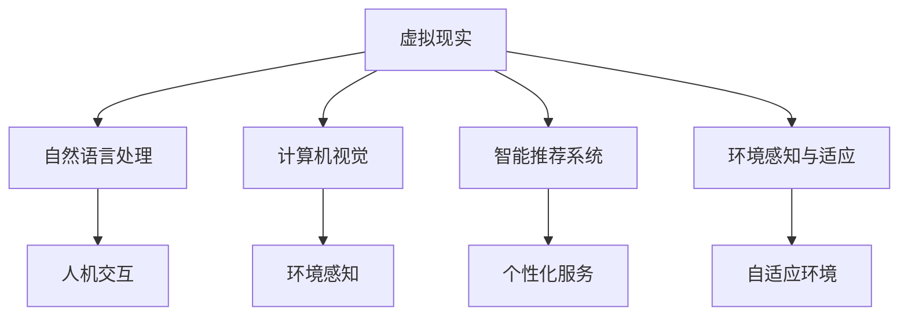

                 

# AI在虚拟现实中的应用：创造互动世界

> 关键词：虚拟现实(VR)、增强现实(AR)、自然语言处理(NLP)、计算机视觉(CV)、交互式娱乐、沉浸式体验

## 1. 背景介绍

### 1.1 问题由来

随着人工智能技术的飞速发展，虚拟现实（Virtual Reality，VR）和增强现实（Augmented Reality，AR）技术正在逐步融入人们的日常生活和工作中。然而，当前的虚拟和增强现实体验往往缺乏足够的交互性和智能性，无法真正沉浸用户。人工智能（AI）技术的引入，特别是自然语言处理（NLP）和计算机视觉（CV）等技术的进步，正在改变这一现状，使得虚拟现实和增强现实体验变得更加生动、交互、智能。

AI技术的引入，为VR和AR带来了新的交互方式和内容生成方式，进一步提升了用户的沉浸感和体验感。人工智能不仅可以实时处理用户输入，还能通过分析和理解用户行为，提供个性化的内容和服务，使得用户与虚拟环境的交互更加自然和流畅。

### 1.2 问题核心关键点

AI在虚拟现实和增强现实中的应用，主要集中在以下几个方面：

- **自然语言处理（NLP）**：利用NLP技术，使得用户可以通过自然语言与虚拟环境进行交互，提供更加便捷和自然的人机交互方式。
- **计算机视觉（CV）**：利用CV技术，实现对用户的面部表情、手势和动作的识别，使得虚拟环境能够实时响应用户的动作，提供更加丰富的互动体验。
- **智能推荐系统**：通过AI算法对用户行为进行分析，提供个性化的内容推荐，提升用户满意度。
- **环境感知与适应**：利用AI技术对环境进行感知和分析，使得虚拟环境能够适应不同的用户需求和场景，提供更加真实和个性化的体验。

这些技术的应用，使得AI在虚拟现实和增强现实中的应用前景广阔，为用户带来了前所未有的沉浸式体验。

### 1.3 问题研究意义

研究AI在虚拟现实和增强现实中的应用，具有重要意义：

- **提升用户体验**：通过智能交互和个性化推荐，使得虚拟现实和增强现实体验更加生动和自然，提升用户的沉浸感和满意度。
- **推动行业发展**：为虚拟现实和增强现实行业带来新的发展动力和方向，促进相关产业的创新和进步。
- **促进技术融合**：推动AI技术与其他技术（如VR、AR、NLP、CV等）的融合，形成新的应用场景和商业模式。
- **拓展应用范围**：拓展AI技术在娱乐、教育、医疗、训练等领域的应用，为社会带来新的价值。

## 2. 核心概念与联系

### 2.1 核心概念概述

为了更好地理解AI在虚拟现实和增强现实中的应用，本节将介绍几个密切相关的核心概念：

- **虚拟现实（VR）**：通过计算机技术生成虚拟环境，让用户可以沉浸其中，体验身临其境的感觉。
- **增强现实（AR）**：将数字信息叠加到现实环境中，使得用户在物理世界和数字世界之间实现无缝交互。
- **自然语言处理（NLP）**：利用AI技术处理和理解自然语言，实现人机交互。
- **计算机视觉（CV）**：利用AI技术处理和理解图像和视频信息，实现环境感知和交互。
- **智能推荐系统**：利用AI算法分析用户行为，提供个性化内容和服务。
- **环境感知与适应**：利用AI技术感知和适应环境变化，提升虚拟环境的互动性和真实感。

这些核心概念之间的逻辑关系可以通过以下Mermaid流程图来展示：



这个流程图展示的核心概念之间的联系：

- **VR与AR**：均为虚拟现实技术，通过计算机技术生成虚拟环境或将数字信息叠加到现实环境中。
- **NLP与CV**：通过AI技术实现对用户输入的自然语言和视觉信息的理解和处理。
- **智能推荐系统与环境感知**：通过AI算法分析用户行为和环境变化，提供个性化服务和环境适应。

这些核心概念共同构成了AI在虚拟现实和增强现实中的应用框架，使其能够提供更加生动、智能、个性化的体验。

## 3. 核心算法原理 & 具体操作步骤
### 3.1 算法原理概述

AI在虚拟现实和增强现实中的应用，主要基于以下几个核心算法原理：

- **自然语言处理（NLP）**：利用语言模型、词向量、Transformer等技术，实现自然语言理解和生成。
- **计算机视觉（CV）**：利用卷积神经网络（CNN）、循环神经网络（RNN）、Transformer等技术，实现图像和视频信息的处理和分析。
- **智能推荐系统**：利用协同过滤、深度学习等技术，分析用户行为和兴趣，提供个性化推荐。
- **环境感知与适应**：利用感知传感器和环境建模技术，实现对环境的感知和自适应。

### 3.2 算法步骤详解

AI在虚拟现实和增强现实中的应用，通常包括以下几个关键步骤：

**Step 1: 准备数据集**

- 收集虚拟现实和增强现实场景下的数据集，包括文本、图像、视频等。
- 进行数据预处理和标注，如文本分词、图像标注、视频剪辑等。
- 将数据集划分为训练集、验证集和测试集。

**Step 2: 构建模型**

- 选择合适的模型架构，如BERT、GPT、ResNet、Inception等。
- 使用深度学习框架（如TensorFlow、PyTorch等）搭建模型。
- 添加必要的任务适配层，如分类器、生成器、解码器等。

**Step 3: 训练模型**

- 使用训练集对模型进行训练，通过梯度下降等优化算法更新模型参数。
- 在验证集上评估模型性能，根据性能指标调整模型参数。
- 重复训练和验证，直至模型性能稳定。

**Step 4: 部署模型**

- 将训练好的模型保存和部署到目标设备或平台上。
- 集成交互界面，实现用户与虚拟环境的互动。
- 实时监测模型性能，根据用户反馈进行优化。

### 3.3 算法优缺点

AI在虚拟现实和增强现实中的应用，具有以下优点：

- **提升用户体验**：通过智能交互和个性化推荐，使得虚拟现实和增强现实体验更加生动和自然，提升用户的沉浸感和满意度。
- **降低开发成本**：AI技术可以自动处理大量数据，降低人工成本，加快开发进度。
- **增强互动性**：通过NLP和CV技术，实现对用户输入和行为的实时处理，增强虚拟环境的互动性。

同时，这些技术也存在一些局限性：

- **技术复杂性**：AI技术的应用需要较高的技术门槛，对开发人员的技术水平要求较高。
- **数据依赖**：AI模型的性能依赖于高质量的数据集，数据获取和标注成本较高。
- **计算资源消耗**：AI模型通常需要高性能的计算资源，对设备的要求较高。
- **隐私和安全问题**：AI模型处理用户数据时，可能存在隐私泄露和安全问题，需要严格的数据保护措施。

尽管存在这些局限性，但就目前而言，AI技术在虚拟现实和增强现实中的应用仍然是不可或缺的，将为未来的沉浸式体验带来革命性的改变。

### 3.4 算法应用领域

AI在虚拟现实和增强现实中的应用，已经广泛应用于以下几个领域：

- **智能交互**：通过NLP和CV技术，实现自然语言和手势的智能交互，提升用户体验。
- **个性化推荐**：利用智能推荐系统，根据用户行为和兴趣提供个性化内容。
- **环境感知与适应**：利用环境感知与适应技术，使得虚拟环境能够适应不同的用户需求和场景。
- **虚拟导引和培训**：通过虚拟现实技术，实现虚拟导引和培训，提升教育和培训效果。
- **娱乐和游戏**：利用虚拟现实和增强现实技术，实现沉浸式娱乐和游戏体验。

除了上述这些领域外，AI技术在虚拟现实和增强现实中的应用还在不断拓展，如医疗模拟、建筑设计、虚拟试衣等，为各行各业带来新的创新和价值。

## 4. 数学模型和公式 & 详细讲解 & 举例说明

### 4.1 数学模型构建

为了更好地理解AI在虚拟现实和增强现实中的应用，本节将介绍几个常用的数学模型：

- **自然语言处理（NLP）**：常用的数学模型包括词向量模型（如Word2Vec、GloVe）、Transformer模型等。
- **计算机视觉（CV）**：常用的数学模型包括卷积神经网络（CNN）、循环神经网络（RNN）、深度神经网络（DNN）等。
- **智能推荐系统**：常用的数学模型包括协同过滤模型、深度学习模型等。
- **环境感知与适应**：常用的数学模型包括感知传感器模型、环境建模模型等。

### 4.2 公式推导过程

以下我们以自然语言处理（NLP）为例，推导BERT模型的数学公式及其应用过程。

BERT模型是一种基于Transformer的双向语言模型，其数学公式如下：

$$
\text{BERT}(x) = \text{MLP}(\text{TransformerEncoder}(x))
$$

其中，$x$ 表示输入的文本，$\text{TransformerEncoder}$ 表示Transformer编码器，$\text{MLP}$ 表示全连接层。

具体而言，BERT模型由多层Transformer编码器组成，每一层编码器都包括多头自注意力机制和前向神经网络。Transformer编码器的数学公式如下：

$$
\text{TransformerEncoder}(x) = \text{Self-Attention}(x) + \text{FeedForward}(x)
$$

其中，$\text{Self-Attention}$ 表示自注意力机制，$\text{FeedForward}$ 表示前向神经网络。

在实践中，BERT模型通常使用预训练语言模型进行微调，以适应特定的自然语言处理任务。微调的数学公式如下：

$$
\theta = \mathop{\arg\min}_{\theta} \mathcal{L}(\theta, D)
$$

其中，$\theta$ 为模型参数，$\mathcal{L}$ 为损失函数，$D$ 为训练数据集。

通过在特定任务的数据集 $D$ 上进行微调，使得BERT模型能够更好地适应该任务，从而提升模型的性能。

### 4.3 案例分析与讲解

以下我们以情感分析任务为例，展示BERT模型在虚拟现实和增强现实中的应用：

- **任务描述**：情感分析任务的目标是识别文本中的情感倾向（如正面、负面、中性）。
- **数据准备**：收集虚拟现实和增强现实场景下的文本数据，进行数据预处理和标注。
- **模型构建**：搭建BERT模型，添加情感分类器作为任务适配层。
- **训练与评估**：使用标注数据对模型进行训练，在验证集上评估模型性能，根据性能指标调整模型参数。
- **部署与应用**：将训练好的模型部署到虚拟现实或增强现实平台，实现情感分析功能。

## 5. 项目实践：代码实例和详细解释说明

### 5.1 开发环境搭建

在进行AI在虚拟现实和增强现实中的应用实践前，我们需要准备好开发环境。以下是使用Python进行PyTorch开发的环境配置流程：

1. 安装Anaconda：从官网下载并安装Anaconda，用于创建独立的Python环境。

2. 创建并激活虚拟环境：
```bash
conda create -n ai-env python=3.8 
conda activate ai-env
```

3. 安装PyTorch：根据CUDA版本，从官网获取对应的安装命令。例如：
```bash
conda install pytorch torchvision torchaudio cudatoolkit=11.1 -c pytorch -c conda-forge
```

4. 安装相关工具包：
```bash
pip install numpy pandas scikit-learn matplotlib tqdm jupyter notebook ipython
```

完成上述步骤后，即可在`ai-env`环境中开始AI在虚拟现实和增强现实中的应用实践。

### 5.2 源代码详细实现

下面我们以情感分析任务为例，给出使用PyTorch对BERT模型进行微调的PyTorch代码实现。

首先，定义情感分析任务的数据处理函数：

```python
from transformers import BertTokenizer
from torch.utils.data import Dataset
import torch

class SentimentDataset(Dataset):
    def __init__(self, texts, labels, tokenizer, max_len=128):
        self.texts = texts
        self.labels = labels
        self.tokenizer = tokenizer
        self.max_len = max_len
        
    def __len__(self):
        return len(self.texts)
    
    def __getitem__(self, item):
        text = self.texts[item]
        label = self.labels[item]
        
        encoding = self.tokenizer(text, return_tensors='pt', max_length=self.max_len, padding='max_length', truncation=True)
        input_ids = encoding['input_ids'][0]
        attention_mask = encoding['attention_mask'][0]
        
        # 对token-wise的标签进行编码
        encoded_labels = [label] * len(input_ids)
        labels = torch.tensor(encoded_labels, dtype=torch.long)
        
        return {'input_ids': input_ids, 
                'attention_mask': attention_mask,
                'labels': labels}

# 加载预训练的BERT模型和 tokenizer
tokenizer = BertTokenizer.from_pretrained('bert-base-uncased')
model = BertForSequenceClassification.from_pretrained('bert-base-uncased', num_labels=3)

# 准备数据集
train_dataset = SentimentDataset(train_texts, train_labels, tokenizer)
dev_dataset = SentimentDataset(dev_texts, dev_labels, tokenizer)
test_dataset = SentimentDataset(test_texts, test_labels, tokenizer)
```

然后，定义训练和评估函数：

```python
from torch.utils.data import DataLoader
from tqdm import tqdm
from sklearn.metrics import accuracy_score

device = torch.device('cuda') if torch.cuda.is_available() else torch.device('cpu')
model.to(device)

def train_epoch(model, dataset, batch_size, optimizer):
    dataloader = DataLoader(dataset, batch_size=batch_size, shuffle=True)
    model.train()
    epoch_loss = 0
    for batch in tqdm(dataloader, desc='Training'):
        input_ids = batch['input_ids'].to(device)
        attention_mask = batch['attention_mask'].to(device)
        labels = batch['labels'].to(device)
        model.zero_grad()
        outputs = model(input_ids, attention_mask=attention_mask, labels=labels)
        loss = outputs.loss
        epoch_loss += loss.item()
        loss.backward()
        optimizer.step()
    return epoch_loss / len(dataloader)

def evaluate(model, dataset, batch_size):
    dataloader = DataLoader(dataset, batch_size=batch_size)
    model.eval()
    preds, labels = [], []
    with torch.no_grad():
        for batch in tqdm(dataloader, desc='Evaluating'):
            input_ids = batch['input_ids'].to(device)
            attention_mask = batch['attention_mask'].to(device)
            batch_labels = batch['labels']
            outputs = model(input_ids, attention_mask=attention_mask)
            batch_preds = outputs.logits.argmax(dim=1).to('cpu').tolist()
            batch_labels = batch_labels.to('cpu').tolist()
            for pred, label in zip(batch_preds, batch_labels):
                preds.append(pred)
                labels.append(label)
                
    return accuracy_score(labels, preds)

# 训练模型
epochs = 5
batch_size = 16

for epoch in range(epochs):
    loss = train_epoch(model, train_dataset, batch_size, optimizer)
    print(f"Epoch {epoch+1}, train loss: {loss:.3f}")
    
    print(f"Epoch {epoch+1}, dev results:")
    accuracy = evaluate(model, dev_dataset, batch_size)
    print(f"Dev accuracy: {accuracy:.3f}")
    
print("Test results:")
accuracy = evaluate(model, test_dataset, batch_size)
print(f"Test accuracy: {accuracy:.3f}")
```

以上就是使用PyTorch对BERT进行情感分析任务微调的完整代码实现。可以看到，得益于Transformers库的强大封装，我们可以用相对简洁的代码完成BERT模型的加载和微调。

### 5.3 代码解读与分析

让我们再详细解读一下关键代码的实现细节：

**SentimentDataset类**：
- `__init__`方法：初始化文本、标签、分词器等关键组件。
- `__len__`方法：返回数据集的样本数量。
- `__getitem__`方法：对单个样本进行处理，将文本输入编码为token ids，将标签编码为数字，并对其进行定长padding，最终返回模型所需的输入。

**训练和评估函数**：
- 使用PyTorch的DataLoader对数据集进行批次化加载，供模型训练和推理使用。
- 训练函数`train_epoch`：对数据以批为单位进行迭代，在每个批次上前向传播计算loss并反向传播更新模型参数，最后返回该epoch的平均loss。
- 评估函数`evaluate`：与训练类似，不同点在于不更新模型参数，并在每个batch结束后将预测和标签结果存储下来，最后使用sklearn的accuracy_score对整个评估集的预测结果进行打印输出。

**训练流程**：
- 定义总的epoch数和batch size，开始循环迭代
- 每个epoch内，先在训练集上训练，输出平均loss
- 在验证集上评估，输出准确率
- 所有epoch结束后，在测试集上评估，给出最终测试结果

可以看到，PyTorch配合Transformers库使得BERT微调的代码实现变得简洁高效。开发者可以将更多精力放在数据处理、模型改进等高层逻辑上，而不必过多关注底层的实现细节。

当然，工业级的系统实现还需考虑更多因素，如模型的保存和部署、超参数的自动搜索、更灵活的任务适配层等。但核心的微调范式基本与此类似。

## 6. 实际应用场景
### 6.1 智能交互

在虚拟现实和增强现实应用中，智能交互是一个重要的方面。通过自然语言处理（NLP）和计算机视觉（CV）技术，用户可以与虚拟环境进行自然、流畅的交互。

**案例分析**：虚拟客服系统

通过智能客服系统，用户可以与虚拟客服进行自然语言对话，解决各类问题。系统通过NLP技术理解用户输入，通过CV技术识别用户表情和手势，从而提供更加精准和个性化的服务。例如，用户在虚拟商店中选择商品时，系统可以通过CV技术识别用户的手势和表情，提供推荐和帮助，提升购物体验。

**技术实现**：使用预训练的BERT模型进行微调，添加情感分类器和意图识别器作为任务适配层，通过用户输入和面部表情进行情感分析和意图判断，提供个性化的服务。

### 6.2 个性化推荐

个性化推荐是增强现实应用中的重要功能之一。通过AI技术，系统可以根据用户的行为和偏好，提供个性化的内容推荐。

**案例分析**：虚拟图书馆

在虚拟图书馆中，用户可以通过VR设备进行浏览和阅读。系统通过NLP技术分析用户的浏览历史和搜索行为，通过CV技术识别用户的手势和表情，从而推荐相关的书籍和文章，提升用户的阅读体验。例如，用户通过手势翻阅书籍，系统可以实时推荐与当前书籍相关的其他书籍，形成阅读链条。

**技术实现**：使用预训练的BERT模型进行微调，添加推荐系统作为任务适配层，通过分析用户的行为和偏好，提供个性化的内容推荐。

### 6.3 环境感知与适应

环境感知与适应是虚拟现实和增强现实应用中的核心技术之一。通过AI技术，系统可以实时感知和适应环境变化，提升用户体验。

**案例分析**：虚拟会议系统

在虚拟会议系统中，用户可以通过VR设备进行沉浸式沟通和协作。系统通过CV技术感知用户的位置和动作，通过NLP技术理解用户的语音和文字输入，从而调整会议环境，提升用户的参与感和体验感。例如，用户调整位置时，系统可以实时调整摄像头视角，使其他用户可以看到用户的新位置。

**技术实现**：使用预训练的BERT模型进行微调，添加环境感知与适应模块作为任务适配层，通过感知传感器和环境建模技术，实现对环境的感知和自适应。

### 6.4 未来应用展望

随着AI技术在虚拟现实和增强现实中的应用不断深入，未来的应用前景将更加广阔。

**沉浸式娱乐**：未来的虚拟现实和增强现实系统将提供更加沉浸式的娱乐体验，如虚拟电影、游戏等，通过AI技术实现更加自然和个性化的互动。

**教育培训**：通过虚拟现实和增强现实技术，教育培训将变得更加生动和互动，如虚拟实验室、虚拟课堂等，通过AI技术提供个性化的教学和辅导。

**医疗模拟**：通过虚拟现实和增强现实技术，医疗模拟将变得更加真实和全面，如虚拟手术、虚拟解剖等，通过AI技术提供精确和安全的模拟环境。

**建筑设计**：通过虚拟现实和增强现实技术，建筑设计将变得更加高效和生动，如虚拟建筑展示、虚拟设计讨论等，通过AI技术提供个性化的设计方案和建议。

此外，在智慧城市、智能交通、虚拟试衣等领域，AI技术也将发挥重要作用，推动各行各业的创新和发展。相信随着技术的不断进步，AI在虚拟现实和增强现实中的应用将更加广泛和深入，为社会带来更多的变革和机遇。

## 7. 工具和资源推荐
### 7.1 学习资源推荐

为了帮助开发者系统掌握AI在虚拟现实和增强现实中的应用，这里推荐一些优质的学习资源：

1. **《深度学习》课程**：斯坦福大学开设的深度学习课程，涵盖深度学习的基本概念和经典算法，适合初学者入门。
2. **《TensorFlow实战》书籍**：介绍TensorFlow的使用方法和实战案例，适合有一定深度学习基础的开发者。
3. **《PyTorch深度学习》书籍**：介绍PyTorch的使用方法和实战案例，适合有一定深度学习基础的开发者。
4. **《NLP实战》书籍**：介绍自然语言处理技术的使用方法和实战案例，适合对NLP技术感兴趣的开发者。
5. **《计算机视觉》课程**：斯坦福大学开设的计算机视觉课程，涵盖计算机视觉的基本概念和经典算法，适合对CV技术感兴趣的开发者。

通过对这些资源的学习实践，相信你一定能够快速掌握AI在虚拟现实和增强现实中的应用精髓，并用于解决实际的NLP问题。

### 7.2 开发工具推荐

高效的开发离不开优秀的工具支持。以下是几款用于AI在虚拟现实和增强现实中的应用开发的常用工具：

1. **PyTorch**：基于Python的开源深度学习框架，灵活动态的计算图，适合快速迭代研究。
2. **TensorFlow**：由Google主导开发的开源深度学习框架，生产部署方便，适合大规模工程应用。
3. **Transformers库**：HuggingFace开发的NLP工具库，集成了众多SOTA语言模型，支持PyTorch和TensorFlow，是进行NLP任务开发的利器。
4. **Weights & Biases**：模型训练的实验跟踪工具，可以记录和可视化模型训练过程中的各项指标，方便对比和调优。
5. **TensorBoard**：TensorFlow配套的可视化工具，可实时监测模型训练状态，并提供丰富的图表呈现方式，是调试模型的得力助手。

合理利用这些工具，可以显著提升AI在虚拟现实和增强现实中的应用开发效率，加快创新迭代的步伐。

### 7.3 相关论文推荐

AI在虚拟现实和增强现实中的应用，源于学界的持续研究。以下是几篇奠基性的相关论文，推荐阅读：

1. **《DeepMind的AlphaGo》**：DeepMind通过AlphaGo在围棋领域取得突破，展示了AI在复杂决策游戏中的应用潜力。
2. **《虚拟现实技术的发展和应用》**：介绍虚拟现实技术的发展历程和应用场景，涵盖多领域的创新应用。
3. **《增强现实技术的发展和应用》**：介绍增强现实技术的发展历程和应用场景，涵盖多领域的创新应用。
4. **《计算机视觉在虚拟现实和增强现实中的应用》**：介绍计算机视觉技术在虚拟现实和增强现实中的应用，涵盖多领域的创新应用。
5. **《自然语言处理在虚拟现实和增强现实中的应用》**：介绍自然语言处理技术在虚拟现实和增强现实中的应用，涵盖多领域的创新应用。

这些论文代表了大语言模型微调技术的发展脉络。通过学习这些前沿成果，可以帮助研究者把握学科前进方向，激发更多的创新灵感。

## 8. 总结：未来发展趋势与挑战

### 8.1 总结

本文对AI在虚拟现实和增强现实中的应用进行了全面系统的介绍。首先阐述了虚拟现实和增强现实技术的发展背景和应用前景，明确了AI技术在其中的重要地位。其次，从原理到实践，详细讲解了AI在虚拟现实和增强现实中的应用数学模型和关键步骤，给出了具体的应用案例和代码实现。同时，本文还探讨了AI在虚拟现实和增强现实中的实际应用场景和未来发展趋势，展示了其广阔的应用前景。

通过本文的系统梳理，可以看到，AI在虚拟现实和增强现实中的应用正在迅速普及，为各行各业带来了新的创新和价值。未来，伴随AI技术和其他技术的进一步融合，虚拟现实和增强现实将进入更加智能、生动的时代，带来更多的变革和机遇。

### 8.2 未来发展趋势

展望未来，AI在虚拟现实和增强现实中的应用将呈现以下几个发展趋势：

1. **技术融合深化**：AI技术与VR、AR、NLP、CV等技术的融合将更加深入，形成更加全面和丰富的应用场景。
2. **沉浸式体验提升**：通过AI技术，提供更加沉浸式和个性化的用户体验，提升用户的参与感和满意度。
3. **跨领域应用拓展**：AI技术将在更多领域得到应用，如医疗、教育、训练等，为各行各业带来新的价值。
4. **交互方式创新**：通过NLP和CV技术，实现更加自然和丰富的交互方式，提升系统的互动性和智能化水平。
5. **个性化服务普及**：通过智能推荐系统和环境感知与适应技术，提供更加个性化的服务，提升用户的体验感。

这些趋势展示了AI在虚拟现实和增强现实中的巨大潜力和发展方向，相信未来将有更多的创新应用出现，为社会带来更多的变革和机遇。

### 8.3 面临的挑战

尽管AI在虚拟现实和增强现实中的应用前景广阔，但在迈向更加智能化和普适化的过程中，仍面临诸多挑战：

1. **技术复杂性**：AI技术的应用需要较高的技术门槛，对开发人员的技术水平要求较高。
2. **数据依赖**：AI模型的性能依赖于高质量的数据集，数据获取和标注成本较高。
3. **计算资源消耗**：AI模型通常需要高性能的计算资源，对设备的要求较高。
4. **隐私和安全问题**：AI模型处理用户数据时，可能存在隐私泄露和安全问题，需要严格的数据保护措施。
5. **交互真实性**：当前的虚拟现实和增强现实应用仍存在一定的交互真实性不足的问题，需要进一步提升。

尽管存在这些挑战，但通过技术进步和行业合作，这些难题有望得到逐步解决，AI在虚拟现实和增强现实中的应用将更加广泛和深入。

### 8.4 研究展望

面对AI在虚拟现实和增强现实中面临的挑战，未来的研究需要在以下几个方面寻求新的突破：

1. **提高数据质量**：开发更多高质量的数据集，提升数据标注的效率和准确性。
2. **优化模型性能**：改进模型架构和训练方法，提升模型的泛化能力和性能。
3. **降低计算成本**：优化模型结构和训练算法，降低计算资源消耗，实现更加轻量级的部署。
4. **提升交互真实性**：研究更自然的交互方式和更真实的交互效果，提升用户的沉浸感。
5. **增强安全性**：研究数据保护和隐私保护技术，确保数据和模型的安全性。

这些研究方向将为AI在虚拟现实和增强现实中的应用提供新的突破，进一步推动技术进步和行业发展。相信伴随技术进步和合作深化，AI在虚拟现实和增强现实中的应用将更加成熟和广泛，带来更多的创新和变革。

## 9. 附录：常见问题与解答

**Q1：AI在虚拟现实和增强现实中的应用是否只能通过深度学习模型实现？**

A: AI在虚拟现实和增强现实中的应用，除了深度学习模型，还可以使用其他机器学习模型，如逻辑回归、支持向量机等。但在实际应用中，深度学习模型由于其强大的非线性拟合能力，已经成为了主流技术。

**Q2：如何选择合适的虚拟现实和增强现实平台？**

A: 选择合适的虚拟现实和增强现实平台需要考虑以下几个方面：
1. 设备兼容性：选择兼容性良好的设备，如Oculus Rift、HTC Vive等。
2. 应用场景：选择适合应用场景的平台，如企业级协作平台、教育培训平台等。
3. 功能特性：选择功能丰富的平台，如提供自然语言交互、手势识别等功能。

**Q3：虚拟现实和增强现实应用中，如何提升交互的真实性？**

A: 提升虚拟现实和增强现实应用的交互真实性，可以从以下几个方面入手：
1. 使用高质量的3D建模技术，提升场景的真实感。
2. 结合计算机视觉技术，实现对用户面部表情和手势的实时感知和反馈。
3. 使用多感官融合技术，如视觉、听觉、触觉等，提升用户的沉浸感。

**Q4：虚拟现实和增强现实应用中，如何保护用户隐私？**

A: 保护用户隐私是虚拟现实和增强现实应用中的重要问题，可以从以下几个方面入手：
1. 数据匿名化：对用户数据进行匿名化处理，保护用户隐私。
2. 访问控制：限制数据访问权限，确保数据只用于合法用途。
3. 加密传输：使用加密技术，确保数据在传输过程中的安全性。

这些技术手段可以有效保护用户隐私，提升虚拟现实和增强现实应用的可信度。

**Q5：虚拟现实和增强现实应用中，如何提升用户参与度？**

A: 提升用户参与度是虚拟现实和增强现实应用的重要目标，可以从以下几个方面入手：
1. 设计有趣的内容：提供有趣的游戏、故事、模拟等，吸引用户参与。
2. 提供互动体验：通过AI技术实现自然语言交互、手势识别等，提升用户参与感。
3. 个性化推荐：利用AI技术提供个性化的内容推荐，提升用户满意度。

通过这些技术手段，可以有效提升用户的参与度，增加用户的沉浸感和体验感。

---

作者：禅与计算机程序设计艺术 / Zen and the Art of Computer Programming

