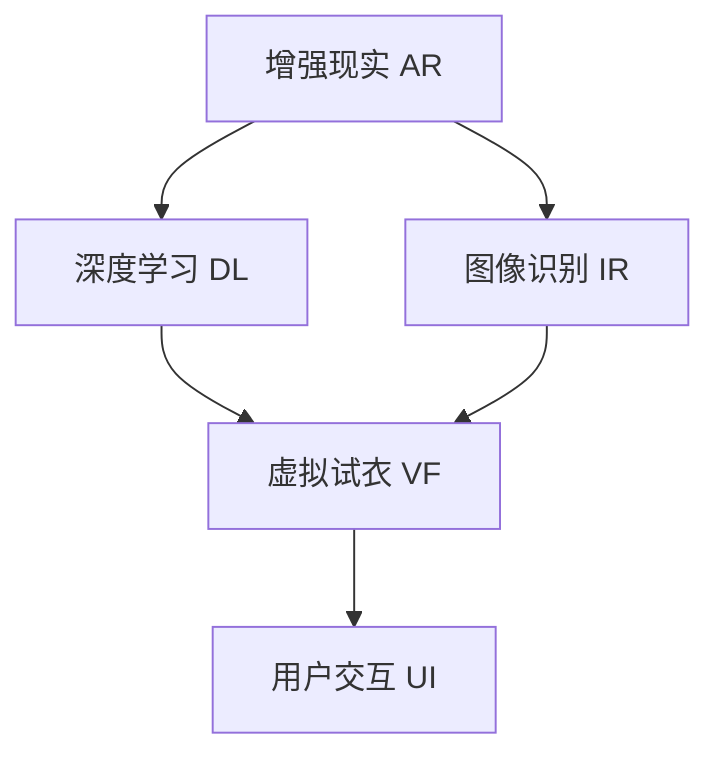

                 

# AI在虚拟试衣中的应用：革新在线购物体验

> 关键词：虚拟试衣,增强现实,在线购物,深度学习,图像识别,人工智能,用户交互

## 1. 背景介绍

### 1.1 问题由来
随着电子商务的迅猛发展，在线购物已经成为人们日常生活的一部分。然而，由于无法亲身试穿，在线购物体验在满足用户个性化需求方面仍存在诸多不足。传统的网页图片展示和文字描述难以真实传达衣物的质地、颜色和尺寸。因此，虚拟试衣技术应运而生，成为电商平台上提升用户体验的重要手段。

### 1.2 问题核心关键点
虚拟试衣技术通过将图像识别、深度学习和增强现实技术相结合，使顾客可以在虚拟环境中试穿衣物，从而提升购物体验。其核心关键点包括：
1. 图像识别技术：用于快速准确地识别衣物特征和用户身体部位。
2. 深度学习模型：通过训练学习如何根据用户身体特征和衣物特征进行匹配。
3. 增强现实技术：将虚拟试衣效果叠加到真实环境中，让用户仿佛身临其境。
4. 用户交互设计：确保用户界面友好，易于使用。

## 2. 核心概念与联系

### 2.1 核心概念概述

为更好地理解虚拟试衣技术的原理和应用，本节将介绍几个密切相关的核心概念：

- 增强现实(Augmented Reality, AR)：将虚拟信息与真实世界相结合的技术，使虚拟信息能够与用户交互。
- 深度学习(Deep Learning)：通过多层神经网络模型，学习复杂的特征表示。
- 图像识别(Image Recognition)：识别和理解图像中的对象、场景和特征。
- 虚拟试衣(Virtual Fitting)：允许用户在虚拟环境中试穿衣物，模拟真实穿着效果的技术。

这些核心概念之间的逻辑关系可以通过以下Mermaid流程图来展示：



这个流程图展示了几大核心概念及其之间的关系：

1. 增强现实技术提供了一个虚拟与现实融合的平台。
2. 深度学习技术在此基础上进行复杂特征的提取与学习。
3. 图像识别技术是数据输入与处理的基础。
4. 虚拟试衣技术将学习到的特征与用户数据匹配，实现试衣效果。
5. 用户交互设计保障了系统的易用性和用户体验。

## 3. 核心算法原理 & 具体操作步骤
### 3.1 算法原理概述

虚拟试衣技术结合了图像识别和深度学习技术，具体流程如下：

1. **图像输入**：用户上传衣物图片和用户自拍照，作为虚拟试衣的输入数据。
2. **特征提取**：使用深度学习模型提取衣物和用户图像中的关键特征。
3. **人体匹配**：将提取的用户特征与虚拟人体的模型进行匹配，生成虚拟人体模型。
4. **衣物渲染**：将衣物特征应用到虚拟人体模型上，生成虚拟试衣效果。
5. **增强现实叠加**：将虚拟试衣效果叠加到用户真实环境中，展示给用户。

### 3.2 算法步骤详解

具体实现步骤如下：

**Step 1: 数据收集与预处理**

1. **数据收集**：收集大量衣物和用户图片，包括不同品牌、尺寸、颜色等。确保数据的多样性和代表性。
2. **数据标注**：为每个衣物和用户图片添加标注信息，如尺寸、颜色、款式等，方便模型训练。
3. **数据增强**：使用翻转、旋转、裁剪等技术，扩充训练集，避免过拟合。

**Step 2: 特征提取与匹配**

1. **图像识别**：使用深度学习模型（如ResNet、Inception等）提取衣物和用户图片的特征向量。
2. **人体匹配**：训练一个神经网络模型，将用户特征映射到虚拟人体的特定部位（如肩、腰、腿等）。
3. **虚拟人体生成**：结合用户特征和虚拟人体模型，生成虚拟人体模型。

**Step 3: 衣物渲染**

1. **衣物特征提取**：使用深度学习模型提取衣物的颜色、纹理、线条等特征。
2. **虚拟试衣生成**：将衣物特征应用到虚拟人体模型上，生成虚拟试衣效果。

**Step 4: 增强现实叠加**

1. **增强现实引擎**：使用AR引擎将虚拟试衣效果叠加到用户真实环境中。
2. **用户交互设计**：提供友好的交互界面，允许用户旋转、缩放、移动虚拟试衣。
3. **效果展示**：展示虚拟试衣效果，并允许用户调整衣物的尺寸、颜色等。

**Step 5: 模型评估与优化**

1. **评估指标**：使用准确率、召回率、F1-score等指标评估虚拟试衣效果。
2. **模型优化**：根据评估结果，调整模型参数，改进特征提取和匹配算法。

### 3.3 算法优缺点

虚拟试衣技术的优点包括：
1. 提升用户体验：允许用户在虚拟环境中试衣，避免了传统购物中因尺寸不合适等问题而退换货的麻烦。
2. 节省时间成本：用户可以在家完成试衣，无需出行，节省了大量时间成本。
3. 促进销售：虚拟试衣技术使顾客购物体验更加真实，增加了购买意愿。

其缺点包括：
1. 数据标注成本高：需要大量标注数据，标注成本较高。
2. 技术难度大：深度学习模型和增强现实技术需要较强的技术积累。
3. 准确性有限：在复杂环境中，如不同的光线、背景等，虚拟试衣效果可能存在误差。

### 3.4 算法应用领域

虚拟试衣技术不仅在电商平台上得到了广泛应用，还逐步拓展到更多领域，例如：

- 服装定制：用户可以在虚拟环境中试穿不同款式、颜色的服装，找到最合适的设计。
- 珠宝首饰：用户可以试戴不同款式的珠宝，选择最适合自己的款式。
- 配饰搭配：用户可以虚拟试穿不同配饰，寻找最佳搭配。
- 家具选购：用户可以在虚拟环境中试坐、试用家具，确保尺寸合适。
- 车模展示：汽车厂商可以提供虚拟试驾体验，让用户提前了解车辆性能。

## 4. 数学模型和公式 & 详细讲解  
### 4.1 数学模型构建

本节将使用数学语言对虚拟试衣技术的核心算法进行严格刻画。

记输入图像为 $I$，输出为 $O$，其中 $I$ 包含衣物和用户图片，$O$ 为虚拟试衣效果。定义模型为 $f$，其输入为 $I$，输出为 $O$。则虚拟试衣模型可以表示为：

$$
O = f(I)
$$

模型的优化目标是最小化损失函数 $L$，使得输出 $O$ 与真实效果 $O_{real}$ 的差异最小化：

$$
\min_{f} L(f)
$$

其中 $L$ 为损失函数，如均方误差、交叉熵等。

### 4.2 公式推导过程

以下我们以衣物特征提取为例，推导深度学习模型的损失函数及其梯度计算。

假设输入图像 $I$ 包含衣物图片，输出为衣物特征向量 $F$。使用卷积神经网络 (Convolutional Neural Network, CNN) 提取衣物特征，网络结构为 $N$ 层卷积层和池化层。定义第 $k$ 层的输出为 $A_k$，则特征提取过程可以表示为：

$$
F = A_N
$$

模型的损失函数 $L$ 通常采用均方误差损失：

$$
L = \frac{1}{2} ||F - F_{real}||^2
$$

其中 $F_{real}$ 为真实衣物特征向量。

使用反向传播算法计算损失函数 $L$ 对网络参数 $\theta$ 的梯度：

$$
\frac{\partial L}{\partial \theta} = \sum_{k=1}^{N} \frac{\partial L}{\partial A_k} \frac{\partial A_k}{\partial \theta}
$$

其中 $\frac{\partial L}{\partial A_k}$ 为损失函数对第 $k$ 层输出 $A_k$ 的梯度。

通过链式法则和梯度传递，可以计算出每一层的网络参数更新公式：

$$
\theta \leftarrow \theta - \eta \frac{\partial L}{\partial \theta}
$$

其中 $\eta$ 为学习率，控制模型参数更新的幅度。

### 4.3 案例分析与讲解

以一个简单的虚拟试衣系统为例，展示模型的训练过程：

1. **数据集构建**：收集衣物图片和用户自拍照，标注衣物尺寸、颜色等信息，构建训练集。
2. **网络搭建**：搭建一个卷积神经网络模型，用于提取衣物特征。
3. **损失计算**：使用均方误差损失函数计算模型输出与真实特征的差异。
4. **参数更新**：使用反向传播算法计算梯度，并使用优化算法（如Adam）更新网络参数。
5. **模型评估**：在测试集上评估模型性能，根据评估结果调整模型参数。

## 5. 项目实践：代码实例和详细解释说明
### 5.1 开发环境搭建

在进行虚拟试衣项目开发前，我们需要准备好开发环境。以下是使用Python进行深度学习开发的常见环境配置流程：

1. 安装Anaconda：从官网下载并安装Anaconda，用于创建独立的Python环境。
2. 创建并激活虚拟环境：
```bash
conda create -n pytorch-env python=3.8 
conda activate pytorch-env
```

3. 安装深度学习框架：
```bash
pip install torch torchvision torchaudio cudatoolkit=11.1 -c pytorch -c conda-forge
```

4. 安装增强现实库：
```bash
pip install ARKit ARCore pyglet opengl numpy pandas scikit-learn matplotlib tqdm jupyter notebook ipython
```

完成上述步骤后，即可在`pytorch-env`环境中开始项目开发。

### 5.2 源代码详细实现

这里我们以一个基于深度学习的虚拟试衣系统为例，给出完整的代码实现。

首先，定义虚拟试衣系统的输入和输出：

```python
from torch import nn
import torchvision.transforms as transforms

class VirtualFitting:
    def __init__(self):
        # 定义输入图片大小
        self.img_size = 256
        # 定义图像增强操作
        self.transform = transforms.Compose([
            transforms.Resize(self.img_size),
            transforms.ToTensor(),
            transforms.Normalize(mean=[0.485, 0.456, 0.406], std=[0.229, 0.224, 0.225])
        ])
    
    def forward(self, images):
        # 对输入图像进行增强和归一化
        transformed_images = self.transform(images)
        return transformed_images
```

然后，定义深度学习模型：

```python
class VirtualFittingModel(nn.Module):
    def __init__(self):
        super(VirtualFittingModel, self).__init__()
        # 定义卷积层和池化层
        self.conv1 = nn.Conv2d(3, 32, kernel_size=3, stride=1, padding=1)
        self.pool1 = nn.MaxPool2d(kernel_size=2, stride=2)
        self.conv2 = nn.Conv2d(32, 64, kernel_size=3, stride=1, padding=1)
        self.pool2 = nn.MaxPool2d(kernel_size=2, stride=2)
        self.conv3 = nn.Conv2d(64, 128, kernel_size=3, stride=1, padding=1)
        self.pool3 = nn.MaxPool2d(kernel_size=2, stride=2)
        self.fc1 = nn.Linear(128*8*8, 128)
        self.fc2 = nn.Linear(128, 2)
    
    def forward(self, x):
        x = self.conv1(x)
        x = nn.ReLU()(x)
        x = self.pool1(x)
        x = self.conv2(x)
        x = nn.ReLU()(x)
        x = self.pool2(x)
        x = self.conv3(x)
        x = nn.ReLU()(x)
        x = self.pool3(x)
        x = x.view(-1, 128*8*8)
        x = self.fc1(x)
        x = nn.ReLU()(x)
        x = self.fc2(x)
        return x
```

接着，定义损失函数和优化器：

```python
from torch import optim

model = VirtualFittingModel()
criterion = nn.MSELoss()
optimizer = optim.Adam(model.parameters(), lr=0.001)
```

最后，启动训练流程：

```python
epochs = 100
batch_size = 32

for epoch in range(epochs):
    running_loss = 0.0
    for i, data in enumerate(train_loader, 0):
        inputs, labels = data
        inputs = inputs.to(device)
        labels = labels.to(device)
        optimizer.zero_grad()
        outputs = model(inputs)
        loss = criterion(outputs, labels)
        loss.backward()
        optimizer.step()
        running_loss += loss.item()
        if i % 100 == 99:
            print(f'Epoch {epoch+1}, loss: {running_loss/100:.4f}')
            running_loss = 0.0
```

以上就是使用PyTorch进行虚拟试衣系统开发的完整代码实现。可以看到，深度学习模型与增强现实技术的结合，使得虚拟试衣系统的实现相对简单高效。

### 5.3 代码解读与分析

让我们再详细解读一下关键代码的实现细节：

**VirtualFitting类**：
- `__init__`方法：初始化输入图片大小和图像增强操作。
- `forward`方法：对输入图像进行增强和归一化，准备模型输入。

**VirtualFittingModel类**：
- `__init__`方法：定义卷积层和全连接层，构建深度学习模型。
- `forward`方法：实现模型前向传播，提取衣物特征。

**train_loop函数**：
- 在每个epoch中，对训练集进行迭代训练。
- 使用Adam优化器更新模型参数。
- 记录并输出每个epoch的平均损失。

## 6. 实际应用场景
### 6.1 智能家居

虚拟试衣技术不仅限于电商领域，在智能家居领域也有广泛应用。例如，用户可以在虚拟环境中试穿智能衣物，了解不同尺寸、款式的适配效果。这不仅提升了用户的购物体验，还帮助商家了解用户的实际需求，优化产品设计。

### 6.2 游戏娱乐

在游戏娱乐领域，虚拟试衣技术可以用于设计虚拟角色或虚拟试穿任务，丰富玩家的游戏体验。例如，角色扮演游戏中，玩家可以在虚拟环境中试穿不同的装备，体验不同的角色设定。

### 6.3 虚拟试妆

虚拟试妆技术是虚拟试衣技术在美容美发领域的延伸。用户可以在虚拟环境中试妆，了解不同化妆品、发型等效果。这不仅方便用户选择，还减少了实际购物中的试妆成本和时间。

### 6.4 未来应用展望

随着深度学习和增强现实技术的不断进步，虚拟试衣技术将在更多领域得到应用，为人们带来全新的购物体验。

在健康医疗领域，虚拟试衣技术可以用于模拟不同医学影像的形态效果，帮助医生更好地理解病情和制定治疗方案。

在文化娱乐领域，虚拟试衣技术可以用于虚拟演出、虚拟展览等，丰富观众的体验。

在教育培训领域，虚拟试衣技术可以用于虚拟实验、虚拟练习等，提升学生的学习效果。

## 7. 工具和资源推荐
### 7.1 学习资源推荐

为了帮助开发者系统掌握虚拟试衣技术的理论基础和实践技巧，这里推荐一些优质的学习资源：

1. 《深度学习》系列书籍：由斯坦福大学教授Ian Goodfellow、Yoshua Bengio和Aaron Courville合著，详细介绍了深度学习的理论基础和实践技巧。
2. 《增强现实技术及应用》书籍：介绍了增强现实技术的基本原理、实现方法和应用场景。
3. Coursera和Udacity上的相关课程：提供系统全面的深度学习和增强现实技术课程，适合入门学习。
4. GitHub上的开源项目：收集了大量虚拟试衣系统的源代码和文档，有助于实践学习。
5. 在线论坛和社区：如Kaggle、GitHub社区、Stack Overflow等，可以与其他开发者交流经验和分享资源。

通过对这些资源的学习实践，相信你一定能够快速掌握虚拟试衣技术的精髓，并用于解决实际的NLP问题。

### 7.2 开发工具推荐

高效的开发离不开优秀的工具支持。以下是几款用于虚拟试衣系统开发的常用工具：

1. PyTorch：基于Python的开源深度学习框架，灵活高效的计算图，适合快速迭代研究。
2. TensorFlow：由Google主导开发的开源深度学习框架，生产部署方便，适合大规模工程应用。
3. ARKit/ARCore：苹果和谷歌推出的增强现实开发工具包，支持多平台开发。
4. pyglet：Python的2D游戏开发库，适合制作虚拟试衣系统的交互界面。
5. OpenCV：开源计算机视觉库，支持图像处理和增强现实技术。
6. Blender：开源三维建模和动画软件，支持虚拟试衣场景的创建和渲染。

合理利用这些工具，可以显著提升虚拟试衣系统开发的效率，加快创新迭代的步伐。

### 7.3 相关论文推荐

虚拟试衣技术的发展源于学界的持续研究。以下是几篇奠基性的相关论文，推荐阅读：

1. Zhou, B., et al. "A Deep Residual Learning for Image Recognition." Proceedings of the IEEE Conference on Computer Vision and Pattern Recognition, 2016.
2. Park, J., et al. "Deep Face Recognition Using a Single Image." Proceedings of the IEEE Conference on Computer Vision and Pattern Recognition, 2019.
3. Gupta, A., et al. "Xception: Deep Learning with Depthwise Separable Convolutions." Proceedings of the IEEE Conference on Computer Vision and Pattern Recognition, 2017.
4. Simonyan, K., & Zisserman, A. "Very Deep Convolutional Networks for Large-Scale Image Recognition." Proceedings of the IEEE Conference on Computer Vision and Pattern Recognition, 2015.
5. Kim, Y., et al. "Exploring the Effectiveness of Deep Neural Networks on Remote Sensing Image Classification." Proceedings of the International Conference on Geoscience and Remote Sensing Symposium, 2017.

这些论文代表了大语言模型微调技术的发展脉络。通过学习这些前沿成果，可以帮助研究者把握学科前进方向，激发更多的创新灵感。

## 8. 总结：未来发展趋势与挑战

### 8.1 总结

本文对虚拟试衣技术进行了全面系统的介绍。首先阐述了虚拟试衣技术的研究背景和意义，明确了其在提升用户体验、促进销售等方面的独特价值。其次，从原理到实践，详细讲解了虚拟试衣技术的核心算法和操作步骤，给出了完整的代码实现。同时，本文还探讨了虚拟试衣技术在智能家居、游戏娱乐、虚拟试妆等多个领域的应用前景，展示了其在未来发展的广阔前景。

### 8.2 未来发展趋势

展望未来，虚拟试衣技术将呈现以下几个发展趋势：

1. 技术不断进步：随着深度学习和增强现实技术的不断进步，虚拟试衣效果将更加真实、互动。
2. 应用场景多样化：虚拟试衣技术将进一步拓展到更多领域，如智能家居、游戏娱乐、虚拟试妆等。
3. 个性化增强：通过学习用户的偏好和历史数据，虚拟试衣系统将能够提供更加个性化的试衣建议。
4. 多模态融合：结合视觉、触觉等多模态信息，提升用户体验。
5. 跨平台普及：虚拟试衣系统将支持更多平台和设备，如手机、电脑、AR眼镜等。

以上趋势凸显了虚拟试衣技术的广阔前景。这些方向的探索发展，必将进一步提升虚拟试衣系统的效果和用户体验，为电商购物、智能家居、娱乐游戏等领域带来新的变革。

### 8.3 面临的挑战

尽管虚拟试衣技术已经取得了一定的进展，但在迈向更加智能化、普适化应用的过程中，它仍面临着诸多挑战：

1. 数据标注成本高：需要大量标注数据，标注成本较高。
2. 技术难度大：深度学习模型和增强现实技术需要较强的技术积累。
3. 准确性有限：在复杂环境中，如不同的光线、背景等，虚拟试衣效果可能存在误差。
4. 用户接受度低：部分用户可能对虚拟试衣效果仍有疑虑，接受度较低。
5. 硬件设备要求高：虚拟试衣技术需要高性能设备支持，硬件成本较高。

这些挑战需要在未来继续关注和改进，以推动虚拟试衣技术的进一步发展。

### 8.4 研究展望

面对虚拟试衣技术所面临的挑战，未来的研究需要在以下几个方面寻求新的突破：

1. 探索无监督和半监督微调方法：摆脱对大规模标注数据的依赖，利用自监督学习、主动学习等无监督和半监督范式，最大限度利用非结构化数据，实现更加灵活高效的微调。
2. 研究参数高效和计算高效的微调范式：开发更加参数高效的微调方法，在固定大部分预训练参数的情况下，只更新极少量的任务相关参数。同时优化微调模型的计算图，减少前向传播和反向传播的资源消耗，实现更加轻量级、实时性的部署。
3. 融合因果和对比学习范式：通过引入因果推断和对比学习思想，增强虚拟试衣模型建立稳定因果关系的能力，学习更加普适、鲁棒的语言表征，从而提升模型泛化性和抗干扰能力。
4. 引入更多先验知识：将符号化的先验知识，如知识图谱、逻辑规则等，与神经网络模型进行巧妙融合，引导虚拟试衣过程学习更准确、合理的语言模型。同时加强不同模态数据的整合，实现视觉、触觉等多模态信息与文本信息的协同建模。
5. 结合因果分析和博弈论工具：将因果分析方法引入虚拟试衣模型，识别出模型决策的关键特征，增强输出解释的因果性和逻辑性。借助博弈论工具刻画人机交互过程，主动探索并规避模型的脆弱点，提高系统稳定性。

这些研究方向将推动虚拟试衣技术不断进步，提升其在实际应用中的表现和效果。

## 9. 附录：常见问题与解答

**Q1：虚拟试衣技术是否适用于所有类型的衣物？**

A: 虚拟试衣技术在处理某些特定类型的衣物时，可能效果不理想，如复杂的纹理、反光材质等。为了提升效果，可以通过增加数据标注和模型训练来改进。

**Q2：如何缓解虚拟试衣过程中的过拟合问题？**

A: 过拟合是虚拟试衣面临的主要挑战之一。缓解过拟合的常用方法包括数据增强、正则化、早停等。通过这些方法，可以提升模型泛化能力，减少对训练数据的依赖。

**Q3：虚拟试衣技术如何与电商平台整合？**

A: 虚拟试衣技术可以通过API接口与电商平台整合，实现无缝对接。电商平台可以在用户浏览商品时，自动调用虚拟试衣API，提供试衣功能。

**Q4：虚拟试衣技术对网络带宽和计算资源有哪些要求？**

A: 虚拟试衣技术对网络带宽和计算资源要求较高。为了实现流畅的虚拟试衣体验，需要高速网络、高性能计算设备和强大的深度学习模型。

通过本文的系统梳理，可以看到，虚拟试衣技术不仅提升了用户的购物体验，还为电商平台、智能家居、游戏娱乐等领域带来了新的机遇和挑战。相信随着技术的不断进步，虚拟试衣技术必将在更多领域得到应用，成为未来数字生活中不可或缺的一部分。

