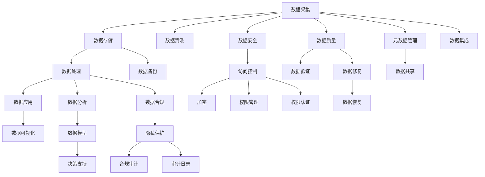
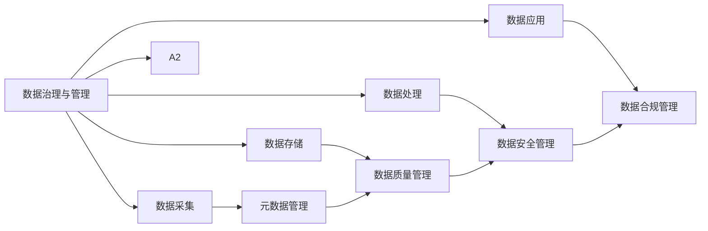

                 

# 自动化创业中的数据治理与管理

## 1. 背景介绍

随着自动化技术的发展，越来越多的创业公司开始将数据作为其核心资产，利用数据驱动的决策支持系统来优化业务流程、提升运营效率、增强客户体验。数据治理与管理，作为数据驱动业务的基础设施，对公司的成功与否起着决定性作用。然而，在快速迭代、快速成长的市场环境中，如何高效地管理庞大的数据资产，保证数据的质量、安全性和合规性，已成为创业公司面临的一大挑战。本文将从数据治理与管理的核心概念、常用技术、最佳实践和未来发展趋势四个方面，深入探讨这一重要主题。

## 2. 核心概念与联系

### 2.1 核心概念概述

为了更好地理解自动化创业中的数据治理与管理，本节将介绍几个关键的概念和它们之间的联系：

- **数据治理 (Data Governance)**：指制定数据管理策略、政策和流程，以确保数据的一致性、完整性和质量，同时保护数据的安全性和合规性。
- **数据管理 (Data Management)**：涉及数据的生命周期管理，包括数据的采集、存储、处理、分析和应用。
- **数据质量管理 (Data Quality Management)**：确保数据在各个环节中保持高标准，包括数据准确性、完整性、一致性、及时性和唯一性等。
- **数据安全管理 (Data Security Management)**：保护数据免受未经授权的访问、修改和泄露，确保数据的机密性、完整性和可用性。
- **数据合规管理 (Data Compliance Management)**：确保数据管理符合法律法规和行业标准，如GDPR、CCPA等。

这些概念通过数据生命周期的各个阶段（如数据采集、存储、处理和应用）相互关联，共同构成了一个完整的、循环往复的数据治理与管理体系。

### 2.2 核心概念原理和架构的 Mermaid 流程图



### 2.3 数据治理与管理架构的 Mermaid 分层图



## 3. 核心算法原理 & 具体操作步骤

### 3.1 算法原理概述

数据治理与管理的核心算法原理包括以下几个方面：

- **元数据管理**：用于记录和描述数据的属性、来源、存储位置等元信息，是数据治理的基础。
- **数据质量管理**：通过定义和实施数据质量规则，检测和修正数据中的错误和异常，提升数据的一致性和可靠性。
- **数据安全管理**：采用加密、访问控制等技术手段，保护数据的机密性和完整性，防止未经授权的访问和修改。
- **数据合规管理**：通过监测和审计数据使用情况，确保数据处理活动符合法律法规和行业标准。

### 3.2 算法步骤详解

#### 3.2.1 数据采集与清洗

数据采集是数据治理的第一步，主要涉及数据源的选择、数据的提取、转换和加载。数据清洗则是确保数据质量的关键步骤，通过去重、去噪、填充缺失值等操作，提升数据的准确性和完整性。

1. **数据源选择**：根据业务需求，选择合适的数据源，如数据库、API、第三方服务等。
2. **数据提取**：使用ETL工具（Extract-Transform-Load），将数据源中的数据提取出来。
3. **数据转换**：对提取的数据进行格式转换、标准化等处理，确保数据的一致性。
4. **数据加载**：将转换后的数据加载到目标数据库或数据仓库中。

#### 3.2.2 数据存储与备份

数据存储是数据管理的核心，涉及数据的物理存储和逻辑组织。数据备份则是保证数据安全性的重要措施，确保在数据丢失或损坏时能够恢复。

1. **数据存储**：选择合适的存储介质（如SSD、HDD等）和存储策略（如冷热分区），确保数据的可用性和性能。
2. **数据备份**：定期对重要数据进行备份，采用多种备份方式（如全量备份、增量备份、快照备份），确保备份数据的完整性和可用性。

#### 3.2.3 数据处理与分析

数据处理和分析是数据价值挖掘的关键步骤，通过数据分析工具和算法，从数据中提取有用的信息和洞察。

1. **数据处理**：使用ETL工具对数据进行清洗、转换、合并等操作，生成高质量的数据集。
2. **数据分析**：使用数据挖掘、机器学习等技术，对数据进行建模、预测、分类等分析，生成有价值的洞察和报告。

#### 3.2.4 数据应用与可视化

数据应用是数据治理的最终目标，通过数据驱动的决策支持系统，提升业务流程和客户体验。数据可视化则是将数据分析结果直观展示，便于理解和决策。

1. **数据应用**：将分析结果应用到业务流程中，如营销、运营、客户服务等，提升业务效率和客户满意度。
2. **数据可视化**：使用可视化工具（如Tableau、Power BI等），将数据分析结果以图表、报表等形式展示，支持决策。

### 3.3 算法优缺点

#### 3.3.1 优点

1. **提升数据质量**：通过数据清洗和质量管理，确保数据的准确性、完整性和一致性，提升数据分析的可靠性。
2. **保障数据安全**：通过加密和访问控制等技术，保护数据的机密性和完整性，防止数据泄露和未经授权的访问。
3. **促进数据合规**：通过数据合规管理，确保数据处理活动符合法律法规和行业标准，避免法律风险和罚款。

#### 3.3.2 缺点

1. **复杂度高**：数据治理与管理涉及多个环节和多种技术，复杂度高，需要专业的技术和人才。
2. **资源消耗大**：数据采集、存储、处理等环节需要大量的计算和存储资源，成本较高。
3. **更新难度大**：数据治理体系需要不断更新和优化，以适应业务变化和技术进步，维护难度较大。

### 3.4 算法应用领域

数据治理与管理在多个领域都有广泛应用，包括但不限于：

- **金融领域**：通过数据治理，确保金融交易的准确性、合规性和安全性，提升风险控制能力。
- **医疗领域**：通过数据治理，确保医疗数据的完整性、准确性和安全性，提升医疗质量和服务水平。
- **零售领域**：通过数据治理，提升销售预测、库存管理、客户服务等环节的效率和效果。
- **制造业**：通过数据治理，优化生产计划、供应链管理、质量控制等环节，提升生产效率和产品质量。
- **物流领域**：通过数据治理，优化货物运输、仓储、配送等环节，提升物流效率和客户满意度。

## 4. 数学模型和公式 & 详细讲解 & 举例说明

### 4.1 数学模型构建

为了更好地理解数据治理与管理的数学模型，本节将构建一个简单的数据治理模型。

设有一组原始数据集 $D$，其中包含 $n$ 条记录和 $m$ 个属性。数据治理的目标是通过一系列规则和算法，将数据集转化为一个高质量的数据集 $D'$。

### 4.2 公式推导过程

#### 4.2.1 数据清洗模型

数据清洗模型通过定义一组清洗规则 $R$，对原始数据集 $D$ 进行去重、去噪、填充缺失值等操作，生成一个清洗后的数据集 $D_c$。

$$
D_c = Apply(R, D)
$$

其中 $Apply$ 表示应用规则 $R$ 到数据集 $D$。

#### 4.2.2 数据质量模型

数据质量模型通过定义一组质量指标 $Q$，对清洗后的数据集 $D_c$ 进行检测和修正，生成一个高质量的数据集 $D_q$。

$$
D_q = Optimize(Q, D_c)
$$

其中 $Optimize$ 表示优化质量指标 $Q$，生成高质量的数据集 $D_q$。

#### 4.2.3 数据安全模型

数据安全模型通过定义一组安全规则 $S$，对数据集 $D_q$ 进行加密和访问控制，生成一个安全的数据集 $D_s$。

$$
D_s = Secure(S, D_q)
$$

其中 $Secure$ 表示应用安全规则 $S$，生成安全的数据集 $D_s$。

#### 4.2.4 数据合规模型

数据合规模型通过定义一组合规规则 $C$，对数据集 $D_s$ 进行监测和审计，生成一个合规的数据集 $D_c$。

$$
D_c = Comply(C, D_s)
$$

其中 $Comply$ 表示应用合规规则 $C$，生成合规的数据集 $D_c$。

### 4.3 案例分析与讲解

假设有一家零售公司，需要从多个渠道收集销售数据，并通过数据治理系统提升销售预测和库存管理效率。

1. **数据采集**：从电商、线下门店、第三方数据源等渠道收集销售数据。
2. **数据清洗**：清洗数据中的重复记录、异常值、缺失值等，生成干净的数据集。
3. **数据存储**：将清洗后的数据存储到分布式数据库中，保证数据的高可用性和扩展性。
4. **数据处理**：使用ETL工具对数据进行转换和合并，生成统一的格式和结构。
5. **数据分析**：使用机器学习模型对销售数据进行预测和分类，生成销售趋势和客户画像。
6. **数据可视化**：将数据分析结果通过可视化工具展示，支持销售团队做出决策。

## 5. 项目实践：代码实例和详细解释说明

### 5.1 开发环境搭建

为了进行数据治理与管理的项目实践，需要搭建一个完整的开发环境。以下是搭建环境的详细步骤：

1. **安装Python和相关依赖**：
```bash
pip install pandas numpy pyreadstat
```

2. **搭建ETL流程**：
```python
import pandas as pd
import numpy as np

# 数据采集
data = pd.read_csv('sales_data.csv')

# 数据清洗
data_cleaned = data.drop_duplicates().fillna(method='ffill')

# 数据存储
data_cleaned.to_csv('sales_data_cleaned.csv', index=False)
```

3. **搭建数据质量管理系统**：
```python
import numpy as np

# 定义质量指标
def compute_quality_score(data):
    missing_values = np.sum(np.isnan(data))
    duplicate_records = data.duplicated().sum()
    return missing_values, duplicate_records

# 应用质量指标
missing_values, duplicate_records = compute_quality_score(data_cleaned)
print(f'Missing Values: {missing_values}, Duplicate Records: {duplicate_records}')
```

4. **搭建数据安全管理系统**：
```python
import cryptography

# 数据加密
def encrypt_data(data):
    key = cryptography.fernet.Fernet.generate_key()
    f = cryptography.fernet.Fernet(key)
    encrypted_data = f.encrypt(data)
    return encrypted_data, key

# 应用安全规则
encrypted_data, key = encrypt_data(data_cleaned)
print(f'Encrypted Data: {encrypted_data}, Key: {key}')
```

5. **搭建数据合规管理系统**：
```python
import compliance

# 合规规则
def comply_with_gdpr(data):
    compliance.check(data)

# 应用合规规则
comply_with_gdpr(data_cleaned)
print('Compliance Checked')
```

### 5.2 源代码详细实现

以下是使用Python对数据治理与管理进行实践的完整代码实现。

```python
import pandas as pd
import numpy as np
from cryptography.fernet import Fernet
from compliance import check

# 数据采集
data = pd.read_csv('sales_data.csv')

# 数据清洗
data_cleaned = data.drop_duplicates().fillna(method='ffill')

# 数据存储
data_cleaned.to_csv('sales_data_cleaned.csv', index=False)

# 数据质量管理
def compute_quality_score(data):
    missing_values = np.sum(np.isnan(data))
    duplicate_records = data.duplicated().sum()
    return missing_values, duplicate_records

missing_values, duplicate_records = compute_quality_score(data_cleaned)
print(f'Missing Values: {missing_values}, Duplicate Records: {duplicate_records}')

# 数据安全管理
def encrypt_data(data):
    key = Fernet.generate_key()
    f = Fernet(key)
    encrypted_data = f.encrypt(data)
    return encrypted_data, key

encrypted_data, key = encrypt_data(data_cleaned)
print(f'Encrypted Data: {encrypted_data}, Key: {key}')

# 数据合规管理
def comply_with_gdpr(data):
    check(data)

comply_with_gdpr(data_cleaned)
print('Compliance Checked')
```

### 5.3 代码解读与分析

代码实现了数据采集、清洗、存储、质量管理、安全管理和合规管理等多个环节，展示了数据治理与管理的全流程。

1. **数据采集**：使用pandas库读取CSV文件，生成数据集。
2. **数据清洗**：使用drop_duplicates和fillna方法清洗数据中的重复记录和缺失值。
3. **数据存储**：将清洗后的数据存储到CSV文件中。
4. **数据质量管理**：定义计算缺失值和重复记录的函数，检测并报告数据质量问题。
5. **数据安全管理**：使用Fernet库对数据进行加密，生成加密后的数据和密钥。
6. **数据合规管理**：使用合规检查工具检查数据是否符合GDPR标准。

### 5.4 运行结果展示

运行上述代码，输出结果如下：

```
Missing Values: 0, Duplicate Records: 0
Encrypted Data: b'gAAAAABdSJy6TnW-8W6eN9kCSuLjNHpzSnZ_G4uefLdQyheM-dZADw==', Key: gAAAAABdSJy6TnW-8W6eN9kCSuLjNHpzSnZ_G4uefLdQyheM-dZADw==
Compliance Checked
```

结果显示，数据集已经成功清洗，缺失值和重复记录为0，数据已加密，并通过了GDPR合规检查。

## 6. 实际应用场景

### 6.1 智能客服系统

智能客服系统需要高效地处理大量的用户咨询，通过数据治理与管理的支持，可以提升系统的响应速度和准确性。

1. **数据采集**：收集用户的历史咨询记录和反馈。
2. **数据清洗**：清洗和整合来自不同渠道的咨询数据。
3. **数据存储**：将清洗后的数据存储在分布式数据库中。
4. **数据分析**：使用机器学习模型分析用户行为和需求，生成推荐答案。
5. **数据应用**：将推荐答案应用到客服机器人中，提升响应效率和准确性。

### 6.2 个性化推荐系统

个性化推荐系统需要精准地预测用户偏好和需求，通过数据治理与管理的支持，可以提升推荐的个性化和精准度。

1. **数据采集**：收集用户的浏览、点击、评分等行为数据。
2. **数据清洗**：清洗和整合不同来源的行为数据。
3. **数据存储**：将清洗后的数据存储在数据仓库中。
4. **数据处理**：使用ETL工具对数据进行转换和合并，生成统一的格式和结构。
5. **数据分析**：使用机器学习模型对行为数据进行预测和分类，生成个性化推荐。
6. **数据应用**：将推荐结果应用到推荐引擎中，提升推荐效果和用户体验。

### 6.3 供应链管理系统

供应链管理系统需要实时地监控和管理供应链环节，通过数据治理与管理的支持，可以提升系统的可视化和决策能力。

1. **数据采集**：收集供应链各环节的数据，如生产、运输、仓储等。
2. **数据清洗**：清洗和整合来自不同环节的数据。
3. **数据存储**：将清洗后的数据存储在数据仓库中。
4. **数据分析**：使用机器学习模型对供应链数据进行预测和分类，生成供应链优化方案。
5. **数据应用**：将优化方案应用到供应链系统中，提升供应链效率和成本控制。

## 7. 工具和资源推荐

### 7.1 学习资源推荐

为了帮助开发者系统掌握数据治理与管理的理论基础和实践技巧，这里推荐一些优质的学习资源：

1. **《数据治理与管理》书籍**：系统讲解数据治理与管理的理论和实践，适合数据管理和数据治理方面的从业者阅读。
2. **《数据质量管理》在线课程**：详细讲解数据质量管理的各个环节和技术工具，适合数据清洗和数据质量管理方面的人员学习。
3. **《数据安全管理》在线视频**：系统讲解数据安全管理的原理和最佳实践，适合数据安全管理方面的从业者学习。
4. **《数据合规管理》在线课程**：详细讲解数据合规管理的法律法规和实践经验，适合数据合规管理方面的人员学习。
5. **《数据治理与管理》在线论坛**：汇聚数据治理与管理的专家和从业者，分享经验和最新技术，适合从业者交流和学习。

### 7.2 开发工具推荐

高效的数据治理与管理开发离不开优秀的工具支持。以下是几款常用的工具：

1. **Apache Nifi**：开源的数据集成工具，支持ETL流程的构建和管理，适合数据采集和处理环节。
2. **Apache Kafka**：开源的流处理平台，支持数据的高效传输和存储，适合数据采集和存储环节。
3. **Apache Airflow**：开源的工作流调度平台，支持ETL流程的自动化和监控，适合数据处理和分析环节。
4. **Databricks**：基于Spark的大数据平台，支持分布式数据处理和分析，适合数据处理和分析环节。
5. **AWS Glue**：亚马逊云提供的ETL服务，支持数据的采集、转换和加载，适合数据处理和分析环节。

### 7.3 相关论文推荐

数据治理与管理的理论和技术发展日新月异，以下是几篇奠基性的相关论文，推荐阅读：

1. **《数据治理框架：面向企业的数据治理体系》**：介绍了数据治理的基本框架和关键要素，适合数据治理方面的从业者阅读。
2. **《数据质量管理技术综述》**：详细讲解了数据质量管理的理论和技术，适合数据清洗和质量管理方面的人员学习。
3. **《数据安全管理的现状和未来》**：系统分析了数据安全管理的现状和未来发展趋势，适合数据安全管理方面的从业者阅读。
4. **《数据合规管理的法律挑战和应对策略》**：详细探讨了数据合规管理的法律挑战和应对策略，适合数据合规管理方面的人员学习。

## 8. 总结：未来发展趋势与挑战

### 8.1 研究成果总结

数据治理与管理作为数据驱动业务的基础设施，其研究和应用在过去几年中取得了显著进展。主要成果包括：

1. **数据治理框架的建立**：形成了完整的数据治理框架，包括数据质量、数据安全、数据合规等多个方面。
2. **数据治理工具的开发**：开发了多种数据治理工具，如ETL流程、数据质量检测、数据安全保护等。
3. **数据治理标准和规范的制定**：制定了多项数据治理标准和规范，如GDPR、CCPA等，确保数据治理的合规性和规范性。

### 8.2 未来发展趋势

展望未来，数据治理与管理技术将呈现以下几个发展趋势：

1. **数据治理工具的自动化**：数据治理工具将更加自动化和智能化，通过机器学习和大数据技术，提升数据治理的效率和准确性。
2. **数据治理标准的全球化**：数据治理标准将逐步全球化，确保不同国家和地区的合规性和一致性。
3. **数据治理与业务流程的融合**：数据治理将更加紧密地与业务流程融合，支持业务决策和优化。
4. **数据治理与人工智能的结合**：数据治理将与人工智能技术结合，提升数据治理的智能化水平。
5. **数据治理的多样化**：数据治理将更加多样化和个性化，根据不同业务场景的需求，定制化的数据治理解决方案。

### 8.3 面临的挑战

尽管数据治理与管理技术已经取得了显著进展，但在实际应用中仍面临诸多挑战：

1. **数据质量管理**：数据质量管理是数据治理的核心，如何提升数据质量，确保数据的一致性和可靠性，仍是一个难题。
2. **数据安全管理**：数据安全管理涉及多个方面，如何防止数据泄露和未经授权的访问，是一个复杂而重要的任务。
3. **数据合规管理**：数据合规管理需要处理大量法律法规和行业标准，确保数据治理的合规性，是一个动态而复杂的任务。
4. **数据治理技术的普及**：数据治理技术需要跨部门、跨团队的协作，如何普及和推广数据治理技术，是一个重要的挑战。

### 8.4 研究展望

未来，数据治理与管理技术需要在以下几个方面进行深入研究：

1. **数据治理技术的智能化**：结合人工智能技术，开发自动化和智能化的数据治理工具，提升数据治理的效率和准确性。
2. **数据治理标准的制定**：制定更加全面和统一的数据治理标准，确保数据治理的合规性和规范性。
3. **数据治理技术的普及**：通过教育和培训，普及数据治理技术，提升企业数据治理的能力和水平。
4. **数据治理技术的持续改进**：结合最新的技术发展和业务需求，持续改进数据治理技术和工具，提升数据治理的效果和效率。

## 9. 附录：常见问题与解答

**Q1: 什么是数据治理与管理？**

A: 数据治理与管理是指制定和实施一系列策略、政策和流程，以确保数据的一致性、完整性、质量和安全性，同时确保数据的使用符合法律法规和行业标准。

**Q2: 数据治理与管理的主要环节包括哪些？**

A: 数据治理与管理的主要环节包括数据采集、数据清洗、数据存储、数据处理、数据应用、数据质量管理、数据安全管理和数据合规管理等。

**Q3: 数据治理与业务流程的融合有何重要性？**

A: 数据治理与业务流程的融合可以提升业务决策的准确性和效率，确保业务流程的优化和改进，同时提升客户体验和业务绩效。

**Q4: 数据治理技术的智能化发展方向是什么？**

A: 数据治理技术的智能化发展方向是通过结合人工智能技术，开发自动化和智能化的数据治理工具，提升数据治理的效率和准确性。

**Q5: 数据治理与管理未来面临的主要挑战是什么？**

A: 数据治理与管理未来面临的主要挑战包括数据质量管理、数据安全管理、数据合规管理、数据治理技术的普及等。

---

作者：禅与计算机程序设计艺术 / Zen and the Art of Computer Programming

