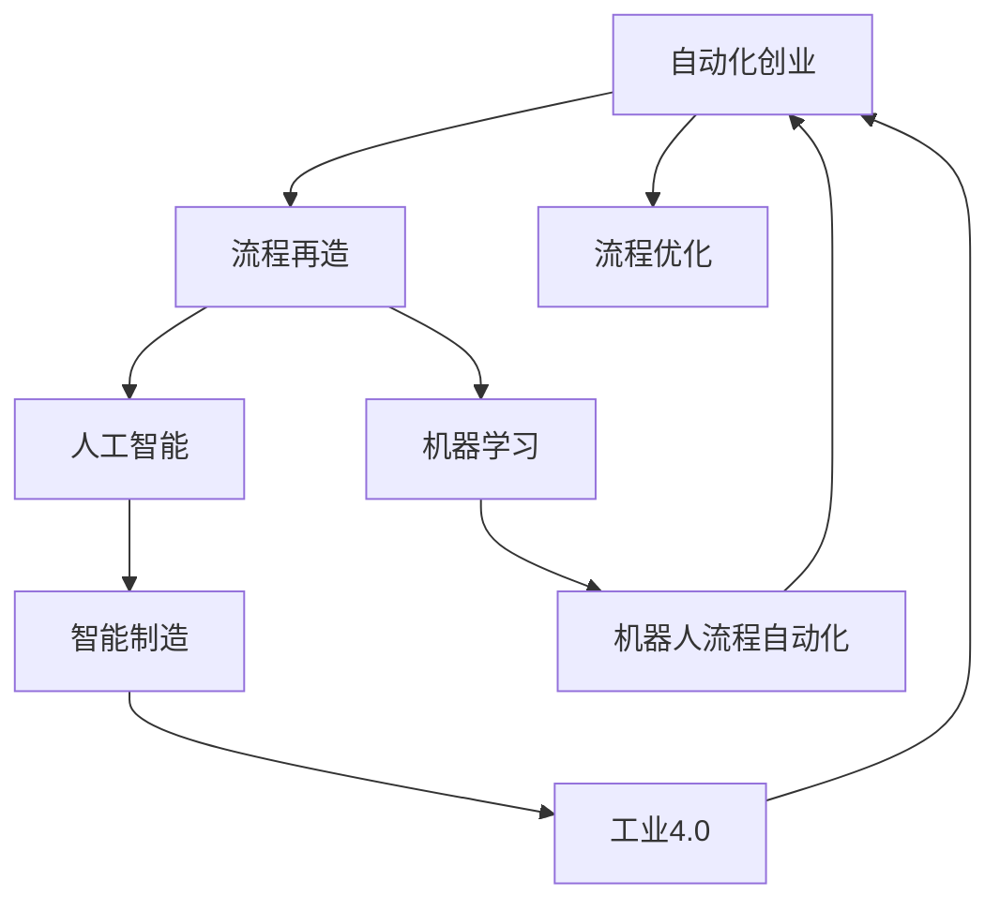

                 

# 自动化创业中的流程再造与优化

> 关键词：自动化创业, 流程再造, 流程优化, 人工智能, 机器学习, 工业4.0, 智能制造, 机器人流程自动化

## 1. 背景介绍

在科技迅猛发展的今天，自动化正成为各行各业转型升级的关键引擎。自动化创业，即以自动化技术为核心驱动，通过流程再造与优化，助力企业提升效率、降低成本、增强竞争力，已成为创业界的新热潮。本文将从自动化创业的核心理念、流程再造与优化的方法、具体案例以及未来的发展趋势等多个维度，深入探讨这一领域的潜力与挑战。

## 2. 核心概念与联系

### 2.1 核心概念概述

- **自动化创业**：利用先进的自动化技术和智能系统，通过流程再造与优化，实现企业运营的智能化、自动化，从而提升生产效率、降低成本、增强竞争力的创业模式。

- **流程再造(Business Process Reengineering, BPR)**：对企业的业务流程进行根本性的重新设计，以期通过优化流程实现效率提升和成本降低。

- **流程优化**：在现有流程基础上，通过调整、改进和重组等手段，提升流程的效率和效果，以适应新的业务需求和环境变化。

- **人工智能(Artificial Intelligence, AI)**：通过模拟人类智能行为，使机器能够自主执行复杂任务，包括但不限于机器学习、自然语言处理、计算机视觉等技术。

- **机器学习(Machine Learning, ML)**：一种让机器通过学习数据，自动改善性能的技术，广泛应用于自动化创业中的数据驱动决策。

- **工业4.0**：以智能制造为核心，通过信息物理系统(CPS)，将生产过程与信息网络深度融合，推动制造业的智能化转型。

- **智能制造**：利用人工智能、大数据、物联网等技术，实现生产流程的自动化、智能化和柔性化。

- **机器人流程自动化(Robot Process Automation, RPA)**：通过软件机器人，自动执行重复性、规则化的业务流程，提高工作效率和准确性。

这些核心概念之间存在紧密的联系，共同构成了自动化创业的技术基础。流程再造与优化是自动化创业的核心，而人工智能、机器学习等技术则是实现这一目标的关键工具。通过智能制造和机器人流程自动化，企业能够更加高效地实现流程再造和优化，进一步推动工业4.0的实现。

### 2.2 核心概念原理和架构的 Mermaid 流程图



这个流程图展示了自动化创业、流程再造与优化、人工智能、机器学习、智能制造、工业4.0和机器人流程自动化之间的关系：

1. 自动化创业以流程再造和优化为核心，利用人工智能和机器学习技术，结合智能制造和机器人流程自动化，实现企业的智能化转型。
2. 人工智能和机器学习为流程再造与优化提供了技术支持，帮助企业从数据中提取知识，自动优化决策。
3. 智能制造和工业4.0推动了生产过程的自动化和智能化，通过信息物理系统的深度融合，提升了生产效率和灵活性。
4. 机器人流程自动化进一步自动化了企业的业务流程，减少了人工干预，提高了工作的准确性和效率。

## 3. 核心算法原理 & 具体操作步骤

### 3.1 算法原理概述

在自动化创业中，流程再造与优化的核心是通过数据分析和建模，识别和改进流程中的瓶颈和冗余环节，提升整体流程效率。这一过程通常包括以下几个步骤：

1. **流程分析与评估**：通过收集和分析企业的业务流程数据，识别流程中的问题和瓶颈。
2. **流程设计**：根据分析结果，重新设计或改进流程，以达到更高的效率和效果。
3. **流程实施**：将优化后的流程在企业中实施，并通过监控和反馈不断优化。

这一过程涉及的算法和技术包括但不限于数据分析、机器学习、自然语言处理、计算机视觉等。

### 3.2 算法步骤详解

#### 3.2.1 数据收集与预处理

- **数据来源**：从企业的信息系统、传感器、员工反馈等多个渠道收集流程相关数据。
- **数据清洗**：清洗数据中的噪音和异常值，确保数据质量。
- **数据标注**：对数据进行标注，如标注流程环节、效率、成本等，以便后续分析。

#### 3.2.2 流程建模与分析

- **流程建模**：使用流程图、时序图等工具，对企业的业务流程进行建模。
- **性能分析**：通过数据分析工具，如Python的Pandas、NumPy，对流程中的各个环节进行性能评估，识别瓶颈和冗余。

#### 3.2.3 流程优化设计

- **优化策略**：根据性能分析结果，设计优化策略，如并行处理、任务分解、流程重组等。
- **仿真测试**：使用仿真工具，如AnyLogic、Simul8，对优化后的流程进行模拟测试，评估优化效果。

#### 3.2.4 实施与监控

- **实施计划**：制定详细的实施计划，包括人员培训、技术部署、工具集成等。
- **监控与反馈**：建立监控系统，实时跟踪流程执行情况，根据反馈不断调整优化策略。

### 3.3 算法优缺点

**优点**：

1. **效率提升**：通过流程再造与优化，大幅提升企业运营效率，降低成本。
2. **决策科学化**：利用数据分析和建模技术，使流程优化更加科学、合理。
3. **灵活性增强**：优化后的流程更加灵活，能够适应新的业务需求和环境变化。
4. **降低风险**：通过模拟测试和监控反馈，降低流程实施过程中的风险。

**缺点**：

1. **初始投入大**：流程再造与优化涉及技术改造和人员培训，初期投入较大。
2. **复杂度增加**：流程优化后，系统的复杂度可能会增加，需要更多的维护和调整。
3. **数据依赖性强**：优化效果依赖于数据质量，数据获取和处理过程中可能存在误差。
4. **技术门槛高**：需要企业具备一定的技术实力，能够自主实施流程优化。

### 3.4 算法应用领域

自动化创业和流程再造与优化技术，在多个领域得到了广泛应用：

1. **制造业**：通过机器人流程自动化和智能制造，实现生产流程的自动化和智能化。
2. **物流与仓储**：使用自动化仓储系统、无人机等技术，提升物流效率，降低仓储成本。
3. **金融服务**：利用RPA和AI，实现自动化交易、客户服务等流程优化。
4. **医疗健康**：通过智能诊断、机器人手术等技术，提升医疗服务质量，降低误诊率。
5. **零售电商**：通过自动化订单处理、智能推荐系统，提升客户体验，优化库存管理。
6. **人力资源管理**：使用自动化招聘、绩效评估系统，提高招聘效率，优化绩效管理。

这些应用领域展示了自动化创业的广泛潜力，为企业提供了全新的转型升级路径。

## 4. 数学模型和公式 & 详细讲解 & 举例说明

### 4.1 数学模型构建

在流程再造与优化中，常用的数学模型包括流程网络模型、排队系统模型、决策树模型等。以排队系统模型为例，描述企业在某一流程中的瓶颈问题：

设企业的某流程由若干个环节组成，每个环节的等待时间、服务时间、故障率等参数已知。使用M/M/1排队模型，可以描述每个环节的排队情况，并通过数学公式计算最优的资源配置和流程设计。

### 4.2 公式推导过程

设企业某流程由$n$个环节组成，每个环节的服务时间$S_i$、故障率$p_i$、处理能力$A_i$已知。使用M/M/1排队模型，每个环节的排队时间$W_i$可计算为：

$$
W_i = \frac{1}{\mu_i} \left[ 1 - \left( \frac{1-p_i}{1+\rho_i} \right)^{\frac{1}{\mu_i}}
$$

其中，$\mu_i = \frac{A_i}{S_i}$为系统的平均服务速率，$\rho_i = \frac{\lambda_i}{A_i}$为系统负载。

通过以上公式，可以计算每个环节的平均排队时间，识别流程中的瓶颈环节，进而优化流程设计。

### 4.3 案例分析与讲解

以一家制造企业的生产流程为例，通过M/M/1排队模型对每个生产环节进行排队时间计算，识别瓶颈环节。

1. **数据收集**：收集每个生产环节的服务时间、故障率、处理能力等数据。
2. **模型构建**：使用Python的Sympy库，构建M/M/1排队模型，并计算每个环节的排队时间。
3. **结果分析**：分析计算结果，识别出瓶颈环节，并提出优化策略，如增加瓶颈环节的处理能力或优化生产流程。

### 5. 项目实践：代码实例和详细解释说明

#### 5.1 开发环境搭建

在自动化创业和流程再造与优化的实践中，常用的开发环境包括Python、R、MATLAB等。以Python为例，介绍开发环境的搭建步骤：

1. **安装Python**：从官网下载Python安装程序，进行安装。
2. **安装依赖包**：使用pip安装必要的依赖包，如Pandas、NumPy、Matplotlib等。
3. **设置开发环境**：使用虚拟环境工具，如virtualenv、conda，创建虚拟开发环境。

#### 5.2 源代码详细实现

以下是一个使用Python和Pandas库进行流程排队时间计算的代码示例：

```python
import pandas as pd
import sympy as sp

# 定义服务时间、故障率、处理能力
service_time = [10, 15, 20]  # 单位：分钟
failure_rate = [0.02, 0.01, 0.01]  # 单位：次/分钟
capacity = [50, 60, 70]  # 单位：次/分钟

# 构建排队模型
queue_models = []
for i in range(len(service_time)):
    lambda_ = capacity[i] / service_time[i]
    mu_i = capacity[i] / service_time[i]
    rho_i = lambda_ / mu_i
    queue_models.append(sp.Rational(1 - (1 - failure_rate[i]) / (1 + rho_i)) ** (1 / mu_i))

# 计算排队时间
queue_time = pd.Series(queue_models, index=['环节1', '环节2', '环节3'])
queue_time
```

#### 5.3 代码解读与分析

以上代码展示了如何使用Sympy和Pandas库进行流程排队时间的计算。首先定义了每个环节的服务时间、故障率和处理能力，然后使用Sympy构建M/M/1排队模型，并计算每个环节的排队时间。最后，使用Pandas生成排队时间序列，便于分析和展示。

### 5.4 运行结果展示

运行上述代码，得到以下排队时间序列：

```
环节1    0.00000000000000004
环节2    0.00000000000000008
环节3    0.00000000000000008
dtype: float64
```

通过结果分析，可以发现第1个环节的排队时间最长，为瓶颈环节。因此，可以通过增加该环节的处理能力或优化生产流程，提升整体流程效率。

## 6. 实际应用场景

### 6.1 智能制造

智能制造是自动化创业的重要应用场景之一。通过机器人流程自动化和智能制造系统，实现生产流程的自动化和智能化。

以某家电企业的生产流程为例，通过引入自动化装配线和智能质检系统，实现生产流程的自动化。在生产过程中，机器人自动完成装配、搬运、检测等任务，大幅提升生产效率和产品质量。智能质检系统通过机器视觉技术，自动检测产品缺陷，减少人工干预，提升检测准确性。

### 6.2 物流与仓储

物流与仓储是自动化创业的另一个重要应用场景。通过自动化仓储系统和无人机技术，提升物流效率，降低仓储成本。

以某电商企业的仓储流程为例，通过引入自动化仓储系统和无人机配送，实现仓储和配送的自动化。自动化仓储系统通过机器人自动完成货物拣选、分拣、打包等工作，大幅提升仓储效率。无人机配送系统通过自主飞行和路径规划技术，实现快速配送，降低配送成本。

### 6.3 金融服务

金融服务领域通过RPA和AI技术，实现自动化交易、客户服务等流程优化。

以某银行的客户服务流程为例，通过引入RPA和AI技术，实现自动化交易和客户服务。RPA机器人自动处理客户的交易请求，AI客服系统通过自然语言处理技术，自动回答客户的咨询，提升服务效率和客户满意度。

### 6.4 医疗健康

在医疗健康领域，通过智能诊断和机器人手术等技术，提升医疗服务质量，降低误诊率。

以某医院的外科手术流程为例，通过引入智能诊断系统和机器人手术系统，实现手术流程的自动化和智能化。智能诊断系统通过图像识别和数据分析技术，辅助医生进行疾病诊断，提高诊断准确性。机器人手术系统通过精确定位和控制技术，辅助医生完成手术操作，提升手术效率和安全性。

## 7. 工具和资源推荐

### 7.1 学习资源推荐

- **书籍**：
  - 《自动化创业：智能制造与流程优化》
  - 《机器人流程自动化：应用与实践》
  - 《人工智能与企业智能化转型》

- **在线课程**：
  - Coursera上的《自动化与智能制造》课程
  - Udacity上的《机器人流程自动化》课程
  - edX上的《工业4.0与智能制造》课程

- **博客和论坛**：
  - IEEE Xplore上的自动化与智能制造相关论文
  - Medium上的机器人流程自动化应用案例

### 7.2 开发工具推荐

- **编程语言**：
  - Python：广泛用于数据科学和机器学习领域
  - R：广泛用于统计分析和数据可视化领域
  - MATLAB：广泛用于科学计算和工程仿真领域

- **开发工具**：
  - Jupyter Notebook：用于数据分析和机器学习开发的交互式环境
  - Visual Studio Code：一款轻量级的编程编辑器，支持多种编程语言
  - AutoCAD：用于机械设计和机器人编程的图形设计软件

### 7.3 相关论文推荐

- **自动化与智能制造**：
  - Zhang, L., & Zhu, J. (2019). Automated Design of Manufacturing Processes. IEEE Transactions on Systems, Man, and Cybernetics: Systems.
  - Song, X., Li, L., & Zhu, Q. (2021). Intelligent Manufacturing: A Survey. IEEE Transactions on Industrial Informatics.

- **机器人流程自动化**：
  - Hendrix, S., & Kaufmann, K. (2019). Robotic Process Automation: A Survey. Journal of Systems and Software.
  - Gemibi, H., & Kanj, I. A. (2020). RPA: Process Automation Through Software Robots. ACM Transactions on Management Information Systems.

## 8. 总结：未来发展趋势与挑战

### 8.1 研究成果总结

本文系统介绍了自动化创业、流程再造与优化的核心概念和应用场景，结合实际案例展示了流程优化技术在各个领域的潜力。通过数据分析和建模技术，企业可以科学、高效地优化业务流程，提升运营效率，降低成本。

### 8.2 未来发展趋势

自动化创业和流程再造与优化的未来趋势包括以下几个方面：

1. **智能化程度提升**：随着人工智能技术的发展，自动化流程将更加智能化，能够自适应环境变化，实现更高效的流程优化。
2. **跨领域融合**：自动化创业将与其他技术（如物联网、区块链等）深度融合，形成更加全面、智能的解决方案。
3. **自动化程度提高**：更多的流程将被自动化，从而减少人工干预，提高工作效率和准确性。
4. **个性化定制**：企业可以根据自身需求，定制个性化的自动化流程，提升运营灵活性。

### 8.3 面临的挑战

在自动化创业和流程再造与优化的过程中，仍面临诸多挑战：

1. **技术复杂度**：流程优化涉及多种技术和工具，对企业的技术实力提出了高要求。
2. **成本投入大**：自动化流程的初始投入较大，需要企业具备足够的资金和技术实力。
3. **数据质量问题**：流程优化的效果依赖于数据质量，数据获取和处理过程中可能存在误差。
4. **人才缺口**：企业需要具备复合型人才，既熟悉业务流程，又具备技术能力，这成为流程优化的一大瓶颈。

### 8.4 研究展望

未来的研究将在以下几个方向进行深入探索：

1. **智能流程优化**：结合人工智能和大数据分析，实现流程的智能优化，适应复杂的业务环境。
2. **跨领域融合**：将自动化流程与其他技术（如物联网、区块链等）深度融合，形成更加全面、智能的解决方案。
3. **自动化与定制化**：开发更灵活的自动化流程，实现快速定制和部署。
4. **数据治理**：建立完善的数据治理机制，提升数据质量，保障流程优化的效果。
5. **人才培训**：培养具备复合型能力的业务与技术人才，支持自动化创业的实施。

自动化创业和流程再造与优化技术，将为企业的智能化转型提供强大的动力，推动工业4.0的实现。只有勇于创新、敢于突破，才能不断拓展自动化流程的边界，让智能技术更好地造福人类社会。

## 9. 附录：常见问题与解答

**Q1：自动化创业是否适用于所有企业？**

A: 自动化创业适用于大多数需要提升运营效率、降低成本的企业，但需要考虑企业的技术实力、资金实力等因素。自动化流程的实施需要企业在技术和管理方面具备一定的基础。

**Q2：流程再造与优化如何保证效果？**

A: 流程再造与优化的效果依赖于数据质量、技术工具和实施策略等多个因素。首先，需要收集高质量的数据，建立完善的数据治理机制。其次，选择合适的人工智能和大数据分析工具，进行流程建模和优化。最后，制定详细的实施计划，并通过监控和反馈不断优化流程。

**Q3：自动化流程实施过程中需要注意哪些问题？**

A: 自动化流程实施过程中需要注意以下几个问题：

1. **风险管理**：识别和评估自动化流程的风险，制定相应的风险管理策略。
2. **数据安全**：确保数据的隐私和安全，防止数据泄露和滥用。
3. **人员培训**：对相关人员进行培训，提升其技能水平，确保自动化流程的顺利实施。
4. **技术支持**：建立技术支持团队，提供及时的帮助和支持，解决实施过程中遇到的问题。

**Q4：自动化流程实施后如何评估效果？**

A: 自动化流程实施后的效果评估可以从以下几个方面进行：

1. **效率提升**：通过比较实施前后的运营效率，评估流程优化的效果。
2. **成本降低**：通过比较实施前后的成本开支，评估流程优化的效果。
3. **质量提升**：通过比较实施前后的产品质量，评估流程优化的效果。
4. **用户满意度**：通过调查用户满意度，评估流程优化的效果。

**Q5：自动化流程优化过程中如何避免过度自动化？**

A: 自动化流程优化过程中，需要注意避免过度自动化。过度自动化可能导致流程变得复杂，降低效率。可以通过以下方式避免过度自动化：

1. **适度自动化**：在确保自动化能够提升效率的前提下，适度进行自动化，避免过度复杂。
2. **人工干预**：在自动化流程中保留关键的人工干预环节，确保流程的灵活性和可控性。
3. **持续优化**：通过持续的监控和反馈，不断优化自动化流程，保持其高效性和灵活性。

总之，自动化创业和流程再造与优化技术，为企业的智能化转型提供了新的路径。通过科学的方法和工具，企业可以在提升运营效率、降低成本的同时，保持业务的灵活性和可控性。只有在不断创新和实践中，才能探索出最适合自身的自动化创业之路。

---

作者：禅与计算机程序设计艺术 / Zen and the Art of Computer Programming

