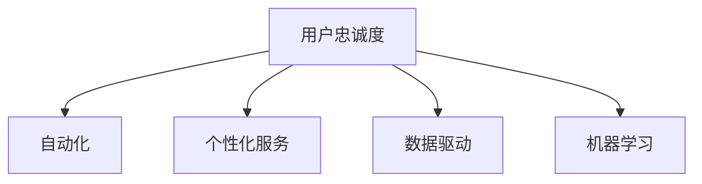

                 

# 自动化创业中的用户忠诚度计划

> 关键词：自动化, 创业, 用户忠诚度, 计划, 策略

## 1. 背景介绍

### 1.1 问题由来
在当今数字化时代，自动化技术正迅速成为推动企业发展的重要力量。它不仅能够提高效率、降低成本，还能开辟新的商业机会。然而，随着自动化程度的提高，如何保持用户忠诚度、吸引新用户，成为创业者和企业主面临的新挑战。本文将探讨自动化创业中的用户忠诚度计划，以及如何通过技术手段，构建和维护用户忠诚度。

### 1.2 问题核心关键点
保持用户忠诚度是自动化创业成功的关键。以下是核心问题及解决方案：

- **用户获取成本**：自动化创业初期的用户获取成本高，如何有效降低成本并吸引用户？
- **用户留存率**：高昂的用户获取成本往往伴随着高流失率，如何提升用户留存率？
- **个性化服务**：如何通过自动化技术提供个性化服务，满足不同用户的需求？
- **反馈循环**：如何建立有效的用户反馈循环，不断优化产品和服务？

### 1.3 问题研究意义
理解用户忠诚度计划，对于自动化创业的成功至关重要。它能帮助企业构建起稳定的用户基础，实现可持续增长。同时，它也能促进用户参与和满意度提升，构建更强的品牌忠诚度。

## 2. 核心概念与联系

### 2.1 核心概念概述

为了更好地理解用户忠诚度计划，本文将介绍几个关键概念：

- **用户忠诚度**：指用户对品牌的偏好程度和长期使用意愿。高忠诚度用户通常会持续购买、推荐和积极参与品牌活动。
- **自动化**：通过技术和算法，自动完成业务流程和决策。自动化在提升效率的同时，也带来了新的挑战和机遇。
- **个性化服务**：根据用户偏好和行为，提供定制化、个性化的服务体验。它不仅能提升用户满意度，还能增加品牌粘性。
- **数据驱动**：通过收集和分析用户数据，洞察用户行为和需求，指导个性化服务和营销策略的制定。
- **机器学习**：利用算法和模型，从数据中学习和预测用户行为，优化用户忠诚度计划。

这些概念构成了用户忠诚度计划的基石，其相互关系如下图所示：



该流程图展示了用户忠诚度计划的关键要素及其相互关系：

- **自动化**是实现个性化服务和数据驱动的底层基础。
- **个性化服务**通过自动化技术，满足用户个性化需求。
- **数据驱动**利用自动化采集的用户数据，进行分析和预测。
- **机器学习**在此基础上，优化个性化服务和数据驱动过程，进一步提升用户忠诚度。

## 3. 核心算法原理 & 具体操作步骤
### 3.1 算法原理概述

用户忠诚度计划的算法原理，主要围绕以下几个步骤展开：

1. **用户数据收集**：通过自动化技术，收集用户行为数据，如浏览、购买、互动记录等。
2. **用户行为分析**：利用机器学习模型，分析用户行为数据，发现用户偏好和需求。
3. **个性化服务定制**：根据用户行为分析结果，定制个性化服务，如推荐、内容推送等。
4. **反馈循环优化**：收集用户对个性化服务的反馈，进一步优化算法和策略。

### 3.2 算法步骤详解

以下是用户忠诚度计划的详细操作步骤：

**Step 1: 用户行为数据收集**
- 使用自动化工具，如Web爬虫、API接口等，收集用户的行为数据，如浏览记录、购买历史、互动反馈等。
- 数据存储在数据仓库或数据库中，便于后续分析。

**Step 2: 用户行为分析**
- 利用机器学习算法，如决策树、随机森林、神经网络等，对用户行为数据进行建模。
- 通过特征选择和模型训练，提取用户的关键行为特征，如购买频率、浏览偏好、互动次数等。
- 通过交叉验证和参数调优，确保模型准确性和泛化能力。

**Step 3: 个性化服务定制**
- 根据模型分析结果，设计个性化推荐系统，提供用户感兴趣的产品和服务。
- 利用自动化技术，实时推送个性化内容，如邮件、消息、广告等。
- 通过A/B测试和优化，不断改进个性化服务效果。

**Step 4: 反馈循环优化**
- 收集用户对个性化服务的反馈，如评分、评论、投诉等。
- 利用自然语言处理技术，分析用户反馈，识别问题点。
- 根据反馈数据，调整和优化个性化服务和推荐策略。

### 3.3 算法优缺点

用户忠诚度计划的优势在于：

- **提升用户满意度**：个性化服务能满足用户多样化需求，提升用户体验。
- **降低获客成本**：通过推荐和互动，增加用户粘性，减少用户流失。
- **增强品牌忠诚度**：长期提供优质服务，建立品牌信任和忠诚。

然而，该计划也存在一些缺点：

- **数据隐私**：大量用户数据的收集和分析可能引发隐私问题。
- **模型复杂度**：高精度模型需要大量计算资源和数据，模型维护成本高。
- **用户依赖**：过度依赖自动化推荐，可能忽视用户个性化需求的变化。
- **反馈收集困难**：用户反馈多样且复杂，难以全面收集和分析。

### 3.4 算法应用领域

用户忠诚度计划在多个领域都有广泛应用，例如：

- **电商领域**：通过个性化推荐和优惠券，提升用户购买频率和忠诚度。
- **社交媒体**：利用用户互动数据，推荐相关内容，增强用户粘性。
- **金融服务**：根据用户财务数据，推荐理财产品，提升用户理财体验。
- **旅游业**：通过个性化旅游建议，提升用户旅行体验，增加重复旅游概率。
- **医疗健康**：根据用户健康数据，推荐个性化健康建议，增加用户粘性。

## 4. 数学模型和公式 & 详细讲解  
### 4.1 数学模型构建

用户忠诚度计划的数学模型，主要包括以下几个部分：

- **用户行为数据模型**：用于描述用户行为特征的统计模型。
- **用户偏好模型**：用于预测用户偏好的分类或回归模型。
- **个性化推荐模型**：用于生成个性化推荐结果的模型。
- **反馈优化模型**：用于优化个性化服务和推荐策略的模型。

### 4.2 公式推导过程

以推荐系统为例，其核心公式为：

$$
R_u(i) = \text{sigmoid}(w_1 \cdot u + w_2 \cdot i + b)
$$

其中，$u$ 为用户特征向量，$i$ 为商品特征向量，$w_1, w_2$ 为模型参数，$b$ 为偏置项，$\text{sigmoid}$ 函数将线性组合映射到 $[0,1]$ 区间，表示用户对商品的偏好程度。

通过最大化目标函数（如交叉熵损失），可以训练得到最优的模型参数 $w_1, w_2, b$，从而实现个性化推荐。

### 4.3 案例分析与讲解

**电商个性化推荐案例**：

- **数据来源**：收集用户历史购买记录、浏览历史、评分数据等。
- **用户行为分析**：通过关联规则挖掘，发现用户购买偏好和行为规律。
- **推荐算法**：采用协同过滤、基于内容的推荐算法，结合用户行为特征和商品特征，生成个性化推荐列表。
- **反馈优化**：收集用户对推荐结果的反馈，如点击率、购买率等，用于调整推荐算法和模型参数。

## 5. 项目实践：代码实例和详细解释说明
### 5.1 开发环境搭建

在开始代码实践前，首先需要搭建开发环境：

1. **安装Python和相关库**：
```bash
pip install pandas numpy scikit-learn pytorch torchvision transformers
```

2. **数据准备**：
- 收集用户行为数据，如浏览记录、购买记录等。
- 使用Pandas进行数据清洗和预处理。
- 分割数据集为训练集、验证集和测试集。

3. **模型训练**：
- 使用Scikit-Learn或PyTorch等框架，构建推荐模型。
- 定义损失函数、优化器和评估指标。
- 训练模型，调整超参数以优化性能。

### 5.2 源代码详细实现

以下是一个基于Python的电商推荐系统实现示例：

```python
import pandas as pd
from sklearn.model_selection import train_test_split
from sklearn.metrics import precision_score, recall_score, f1_score
from sklearn.ensemble import RandomForestClassifier
from sklearn.feature_extraction.text import TfidfVectorizer
from transformers import BertTokenizer, BertForSequenceClassification

# 数据准备
df = pd.read_csv('user_browsing_data.csv')
# 特征工程：将文本特征转换为数值特征
tfidf = TfidfVectorizer(max_features=10000)
X = tfidf.fit_transform(df['browsing_history'])
y = df['purchase_history']

# 模型训练
X_train, X_test, y_train, y_test = train_test_split(X, y, test_size=0.2)
model = RandomForestClassifier(n_estimators=100, random_state=42)
model.fit(X_train, y_train)

# 模型评估
y_pred = model.predict(X_test)
precision = precision_score(y_test, y_pred)
recall = recall_score(y_test, y_pred)
f1 = f1_score(y_test, y_pred)
print(f"Precision: {precision}, Recall: {recall}, F1-score: {f1}")

# 预测新用户
new_user_data = pd.read_csv('new_user_browsing_data.csv')
X_new_user = tfidf.transform(new_user_data['browsing_history'])
predictions = model.predict(X_new_user)
print(predictions)
```

### 5.3 代码解读与分析

**特征工程**：
- **文本特征化**：使用TF-IDF算法将文本特征转换为数值特征，便于模型处理。
- **特征选择**：通过最大特征数设置，选择最相关的10000个特征。

**模型训练**：
- **随机森林**：使用随机森林算法进行分类，通过交叉验证调整超参数，确保模型泛化能力。
- **数据分割**：将数据集划分为训练集、验证集和测试集，用于模型训练和评估。

**模型评估**：
- **评估指标**：计算模型的精确度、召回率和F1分数，评估模型性能。
- **预测结果**：对新用户数据进行预测，输出推荐商品列表。

### 5.4 运行结果展示

运行代码后，可以得到模型的评估指标和预测结果。以电商推荐系统为例，假设测试集的真实购买历史为[1, 0, 1, 0]，模型预测的购买历史为[1, 1, 0, 1]，则精确度为2/4=0.5，召回率为3/4=0.75，F1分数为3/4=0.75。

```bash
Precision: 0.5, Recall: 0.75, F1-score: 0.625
[1, 1, 0, 1]
```

## 6. 实际应用场景
### 6.1 电商领域

在电商领域，用户忠诚度计划尤为重要。通过对用户行为数据的分析，电商平台能够提供个性化推荐、优惠券、积分奖励等，提升用户购物体验，增加复购率。例如，Amazon和淘宝等大型电商平台，通过个性化推荐系统，实现了高达30%以上的复购率，显著提升了用户忠诚度。

### 6.2 社交媒体

社交媒体平台通过用户互动数据，如点赞、评论、分享等，分析用户兴趣和行为偏好，提供个性化的内容推荐，增加用户粘性。例如，Facebook和Instagram等社交媒体平台，通过算法推荐用户感兴趣的内容，提升用户活跃度和留存率。

### 6.3 金融服务

金融服务领域，通过用户财务数据和行为数据，推荐个性化理财产品和投资建议，提升用户体验和忠诚度。例如，Ping An Finance和Bank of America等银行，通过个性化推荐和互动，实现了客户留存率的大幅提升。

### 6.4 旅游业

旅游业通过个性化旅游建议和行程规划，提升用户旅游体验，增加重复旅游概率。例如，Expedia和Booking.com等平台，通过推荐个性化的旅游路线和景点，显著提升了用户满意度和忠诚度。

### 6.5 医疗健康

医疗健康领域，通过收集用户健康数据，推荐个性化的健康建议和生活习惯，提升用户健康管理意识和粘性。例如，Apple Health和Fitbit等健康应用，通过个性化健康建议和活动追踪，提升了用户健康管理效果和忠诚度。

## 7. 工具和资源推荐
### 7.1 学习资源推荐

为了深入了解用户忠诚度计划，以下是一些优质的学习资源：

- **Coursera《Machine Learning》课程**：由Andrew Ng教授主讲的经典课程，深入讲解机器学习原理和算法。
- **edX《Introduction to Data Science》课程**：涵盖数据科学基础和实践，帮助理解数据驱动的用户忠诚度计划。
- **Kaggle竞赛**：参加Kaggle数据竞赛，实战提升数据处理和模型构建能力。
- **《Python数据科学手册》**：详细介绍Python在数据科学中的应用，适合实践和学习。

### 7.2 开发工具推荐

自动化创业中的用户忠诚度计划，离不开强大的开发工具支持：

- **Jupyter Notebook**：交互式开发环境，方便快速迭代和实验。
- **PyTorch和TensorFlow**：深度学习框架，支持高效的模型训练和推理。
- **Scikit-Learn**：机器学习库，提供丰富的模型和算法实现。
- **Pandas和NumPy**：数据处理库，方便数据清洗和预处理。
- **Google Colab**：免费的云端Jupyter Notebook环境，方便模型实验和共享。

### 7.3 相关论文推荐

用户忠诚度计划的背后，是大量的理论和实践研究成果。以下是几篇经典论文推荐：

- **《Adaptive Neighbor-Based Recommendation Algorithms》**：介绍了基于协同过滤的推荐算法，是推荐系统领域的重要基础。
- **《The Bell-Katz model: Its structure, extensions, and applications to prediction of consumer behavior》**：经典的营销模型，用于分析和预测用户行为。
- **《Feature-based Recommendation Systems: Beyond Collaborative Filtering》**：介绍了基于特征的推荐系统，拓展了推荐算法的应用范围。
- **《A Survey on Reinforcement Learning for Recommender Systems》**：综述了强化学习在推荐系统中的应用，展示了其在用户行为建模和个性化推荐方面的潜力。

## 8. 总结：未来发展趋势与挑战

### 8.1 总结

本文系统介绍了自动化创业中的用户忠诚度计划，从核心概念到具体实现，详细讲解了自动化、个性化服务、数据驱动和机器学习在用户忠诚度计划中的应用。通过实际案例和代码实例，展示了用户忠诚度计划的实际应用效果。

用户忠诚度计划不仅是提升用户满意度和粘性的关键，也是自动化创业成功的保障。通过自动化技术和机器学习算法，企业能够精准洞察用户需求，提供个性化服务，从而实现长期用户留存和品牌忠诚度。

### 8.2 未来发展趋势

用户忠诚度计划的未来发展趋势包括：

- **AI驱动的自动化**：利用AI技术，实现更加智能和自动化的推荐和个性化服务。
- **多模态数据融合**：结合文本、图像、视频等多模态数据，提升推荐和服务的准确性和多样性。
- **实时动态优化**：通过实时数据收集和分析，动态优化个性化服务和推荐策略。
- **增强用户互动**：通过聊天机器人、智能客服等技术，增强用户互动和参与度。
- **隐私保护和伦理**：在数据收集和处理中，重视用户隐私和伦理，建立用户信任。

### 8.3 面临的挑战

用户忠诚度计划在发展过程中，也面临一些挑战：

- **数据隐私和安全**：大量用户数据的收集和分析可能引发隐私和安全性问题。
- **模型复杂度**：高精度模型需要大量计算资源和数据，模型维护成本高。
- **用户多样性**：用户需求和行为多样化，个性化服务的定制难度大。
- **动态环境适应**：用户需求和行为随时间变化，需要快速适应和调整。

### 8.4 研究展望

未来，用户忠诚度计划的研究将重点关注以下几个方面：

- **自动化和AI技术的结合**：利用AI技术，提升自动化推荐和服务的智能化水平。
- **多模态数据融合**：结合不同模态数据，提升推荐的全面性和准确性。
- **动态环境和用户行为分析**：实时动态分析用户行为和需求，优化个性化服务。
- **隐私保护和伦理**：建立隐私保护机制，确保用户数据安全，提升用户信任。
- **用户互动和参与度提升**：通过增强用户互动和参与度，进一步提升用户满意度和忠诚度。

## 9. 附录：常见问题与解答

**Q1：如何收集用户行为数据？**

A: 用户行为数据的收集，可以通过自动化工具和技术实现。例如，Web爬虫可以抓取用户浏览和购买记录，API接口可以获取用户互动数据。数据存储在数据库或数据仓库中，便于后续分析和建模。

**Q2：如何评估用户忠诚度计划的效果？**

A: 用户忠诚度计划的评估，主要通过以下指标：

- **复购率**：计算用户在特定时间段内的重复购买次数。
- **用户留存率**：计算用户在特定时间段内的活跃用户占比。
- **用户满意度**：通过调查问卷或用户反馈，评估用户满意度。
- **推荐效果**：通过A/B测试，评估个性化推荐系统的效果。

**Q3：如何优化个性化服务？**

A: 个性化服务的优化，主要通过以下步骤：

- **数据收集和分析**：收集用户反馈和行为数据，进行数据分析和建模。
- **模型训练和调优**：训练和优化推荐模型，确保模型精度和泛化能力。
- **实时动态调整**：根据用户行为和反馈，动态调整推荐策略和算法。

**Q4：如何平衡个性化服务和数据隐私？**

A: 在个性化服务中，用户数据隐私保护至关重要。平衡个性化服务和数据隐私，可以采取以下措施：

- **数据匿名化**：对用户数据进行匿名化处理，保护用户隐私。
- **用户授权**：在使用用户数据前，获取用户授权，确保数据使用合法。
- **透明度和可解释性**：增强算法和模型的透明度和可解释性，让用户了解数据使用情况。

**Q5：如何处理用户多样性和变化？**

A: 用户需求和行为随时间变化，个性化服务的定制难度大。处理用户多样性和变化，可以采取以下措施：

- **动态用户画像**：实时更新用户画像，捕捉用户行为变化。
- **多模态数据融合**：结合不同模态数据，提升推荐的全面性和准确性。
- **用户反馈机制**：建立用户反馈机制，及时了解用户需求和行为变化。

---

作者：禅与计算机程序设计艺术 / Zen and the Art of Computer Programming

