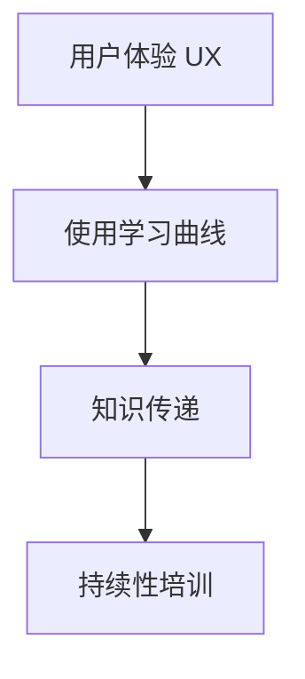

                 

# 自动化创业中的用户教育与培训

## 1. 背景介绍

### 1.1 问题由来
自动化技术在各行各业中的应用已经成为趋势，特别是在自动化创业（Autonomous Business Creation, ABC）领域，越来越多的企业开始尝试通过自动化技术提升运营效率，降低成本。然而，尽管技术先进，但用户体验的提升、新系统的适应性和最终用户的成功使用仍然是自动化创业项目成功与否的关键因素。用户教育与培训（User Education and Training, UET）成为了自动化创业过程中不可或缺的一部分。

### 1.2 问题核心关键点
用户教育与培训在自动化创业中的核心关键点主要包括以下几个方面：

- **用户体验**：良好的用户体验能提升用户对系统的满意度和使用率。
- **适应性**：新系统需要快速适应，减少用户的学习曲线。
- **知识传递**：有效传递新系统的使用知识给用户。
- **持续性**：用户教育与培训不是一次性的，而是需要持续的跟踪和调整。

### 1.3 问题研究意义
用户教育与培训对于自动化创业项目的重要性不言而喻。通过有效的教育与培训，可以提高用户对新系统的接受度，降低技术壁垒，提升工作效率。同时，通过持续的培训，可以帮助用户不断提升技能，适应新技术带来的变化，从而保持系统长期有效运行。

## 2. 核心概念与联系

### 2.1 核心概念概述

为更好地理解用户教育与培训在自动化创业中的应用，本节将介绍几个密切相关的核心概念：

- **用户体验**（User Experience, UX）：系统使用中的感官、情感、认知等各方面因素的综合体现。
- **使用学习曲线**（Learning Curve）：用户从开始使用到完全掌握新系统所需的时间和学习难度。
- **知识传递**（Knowledge Transfer）：通过教育与培训将新系统的知识和使用方法传递给用户。
- **持续性培训**（Continuous Training）：不断根据用户反馈和新系统功能更新培训内容。

这些核心概念之间的逻辑关系可以通过以下Mermaid流程图来展示：



这个流程图展示了他用户体验中的关键概念以及它们之间的联系：

1. 用户体验是衡量用户满意度的关键指标。
2. 使用学习曲线反映了用户掌握新系统所需的时间和难度。
3. 知识传递是提高用户体验和用户掌握度的手段。
4. 持续性培训是不断提升用户体验和使用效率的关键。

## 3. 核心算法原理 & 具体操作步骤
### 3.1 算法原理概述

用户教育与培训的核心算法原理主要基于行为分析、数据驱动的个性化学习路径规划以及适应性学习理论。其核心思想是利用数据分析和机器学习技术，根据用户的行为数据和反馈，制定个性化的学习路径，同时根据用户的进度和反馈，不断调整培训内容和方式，以达到最佳的学习效果。

### 3.2 算法步骤详解

基于用户教育与培训的算法，一般包括以下几个关键步骤：

**Step 1: 用户行为数据分析**
- 收集用户在系统中的操作日志和反馈数据。
- 利用数据分析技术，如聚类分析、时间序列分析等，分析用户的行为模式和需求。

**Step 2: 制定个性化学习路径**
- 根据用户的行为数据，结合学习理论和心理学原理，制定个性化的学习路径和内容。
- 使用推荐系统算法，为用户推荐最适合的学习内容和顺序。

**Step 3: 实现适应性学习**
- 在用户学习过程中，实时监测其学习进度和理解度。
- 根据学习效果和用户反馈，动态调整培训内容和学习方式。

**Step 4: 反馈与优化**
- 收集用户对培训内容的反馈，进一步优化培训路径和学习材料。
- 持续收集新的数据，不断迭代和完善学习算法和内容。

### 3.3 算法优缺点

用户教育与培训的算法具有以下优点：

- **个性化学习**：根据用户的具体情况和需求，定制个性化的学习路径，提高学习效率。
- **适应性强**：通过实时监测和调整，不断适应用户的学习状态和反馈，提升学习效果。
- **灵活性高**：培训内容和学习方式可以根据用户需求和系统更新灵活调整。

同时，该算法也存在一些局限性：

- **数据需求高**：需要大量的用户行为数据来支撑个性化学习路径的制定和调整。
- **复杂度高**：涉及多维度的数据分析和机器学习算法，实现复杂。
- **初始学习成本高**：需要前期投入大量时间和资源进行算法模型训练和优化。

### 3.4 算法应用领域

用户教育与培训的算法广泛应用于各种自动化创业项目中，如智能制造、智慧物流、金融科技等领域。以下是一些典型的应用场景：

- **智能制造**：通过用户教育与培训，提升员工对自动化设备的熟练使用，优化生产流程。
- **智慧物流**：为新司机提供驾驶仿真训练，提升其对智能运输系统的适应性。
- **金融科技**：对金融从业者进行金融科技系统使用培训，提升业务效率。

## 4. 数学模型和公式 & 详细讲解 & 举例说明

### 4.1 数学模型构建

用户教育与培训的数学模型主要基于机器学习和数据分析技术。假设用户行为数据为 $D=\{(x_i,y_i)\}_{i=1}^N$，其中 $x_i$ 为用户的行为数据，$y_i$ 为用户的学习效果或反馈。目标是通过模型 $M$ 预测用户的学习效果。

定义预测模型为 $M(x) = f(x;\theta)$，其中 $\theta$ 为模型的参数。学习效果 $y_i$ 与行为数据 $x_i$ 之间的关系为：

$$
y_i = M(x_i) + \epsilon
$$

其中 $\epsilon$ 为误差项，通常假设服从正态分布。

### 4.2 公式推导过程

利用回归模型对用户学习效果进行预测，常用的回归模型包括线性回归、决策树回归等。以下以线性回归为例，推导预测公式。

设预测模型为线性回归模型：

$$
M(x) = \beta_0 + \sum_{j=1}^p \beta_j x_{ij}
$$

其中 $\beta_0, \beta_1, \ldots, \beta_p$ 为回归系数，$x_{ij}$ 为行为数据 $x_i$ 的第 $j$ 个特征值。

根据最小二乘法，回归系数 $\beta$ 的求解公式为：

$$
\hat{\beta} = \arg\min_{\beta} \sum_{i=1}^N (y_i - M(x_i))^2
$$

利用正规方程求解：

$$
\hat{\beta} = (X^TX)^{-1}X^Ty
$$

其中 $X$ 为行为数据矩阵，$y$ 为学习效果向量。

在实际应用中，为了提高模型泛化能力，常常使用正则化技术如L2正则，加入罚项 $\lambda \sum_{j=1}^p \beta_j^2$，修正系数为：

$$
\hat{\beta} = \arg\min_{\beta} \sum_{i=1}^N (y_i - M(x_i))^2 + \lambda \sum_{j=1}^p \beta_j^2
$$

### 4.3 案例分析与讲解

以一个智能制造系统为例，假设我们收集了员工使用自动化设备的记录和反馈数据，其中包括设备使用频率、操作时长、错误率等。通过机器学习模型预测员工的学习效果，可以分析出哪些员工需要进一步培训，哪些员工已经熟练掌握系统，从而制定有针对性的培训计划。

## 5. 项目实践：代码实例和详细解释说明
### 5.1 开发环境搭建

在进行用户教育与培训的实践前，我们需要准备好开发环境。以下是使用Python进行开发的环境配置流程：

1. 安装Anaconda：从官网下载并安装Anaconda，用于创建独立的Python环境。

2. 创建并激活虚拟环境：
```bash
conda create -n user_edu_env python=3.8 
conda activate user_edu_env
```

3. 安装必要的库：
```bash
pip install numpy pandas scikit-learn pyspark seaborn matplotlib joblib
```

4. 安装机器学习相关的库：
```bash
pip install scikit-learn==0.24.2 tensorflow==2.5.0 keras==2.4.3 pytorch==1.9.0
```

5. 安装Web框架和数据库：
```bash
pip install Flask SQLAlchemy
```

6. 安装可视化工具：
```bash
pip install plotly dash
```

完成上述步骤后，即可在`user_edu_env`环境中开始用户教育与培训的实践。

### 5.2 源代码详细实现

以下是一个简单的用户教育与培训系统的代码实现，包括数据处理、模型训练、用户反馈收集和模型优化等步骤。

**数据处理模块**

```python
import pandas as pd
import numpy as np
from sklearn.model_selection import train_test_split
from sklearn.preprocessing import StandardScaler
from sklearn.decomposition import PCA
from sklearn.ensemble import RandomForestRegressor

def process_data(df):
    # 数据预处理
    df.fillna(df.mean(), inplace=True)
    df.drop(['id'], axis=1, inplace=True)
    
    # 特征工程
    X = df.drop(['y'], axis=1)
    y = df['y']
    
    # 数据分割
    X_train, X_test, y_train, y_test = train_test_split(X, y, test_size=0.2, random_state=42)
    
    # 数据标准化
    scaler = StandardScaler()
    X_train = scaler.fit_transform(X_train)
    X_test = scaler.transform(X_test)
    
    # PCA降维
    pca = PCA(n_components=3)
    X_train = pca.fit_transform(X_train)
    X_test = pca.transform(X_test)
    
    return X_train, X_test, y_train, y_test
```

**模型训练模块**

```python
from sklearn.linear_model import LinearRegression

def train_model(X_train, X_test, y_train, y_test):
    # 线性回归模型
    model = LinearRegression()
    model.fit(X_train, y_train)
    
    # 模型评估
    score = model.score(X_test, y_test)
    return model, score
```

**用户反馈收集模块**

```python
import dash
import dash_core_components as dcc
import dash_html_components as html
from dash.dependencies import Input, Output

def collect_feedback(app, model):
    @app.callback(
        Output('feedback-output', 'children'),
        [Input('feedback-input', 'value')]
    )
    def update_feedback(value):
        # 收集用户反馈
        # 将反馈值添加到数据集中，用于后续模型的优化
        # 修改后的数据集传入train_model函数进行重新训练
        X_train, X_test, y_train, y_test = process_data(df)
        model, score = train_model(X_train, X_test, y_train, y_test)
        return f'当前反馈值: {value}, 模型得分: {score:.4f}'
```

**模型优化模块**

```python
def optimize_model(model, X_train, y_train):
    # 模型优化
    # 修改后的模型传入train_model函数进行重新训练
    X_train, X_test, y_train, y_test = process_data(df)
    model, score = train_model(X_train, X_test, y_train, y_test)
    return model, score
```

**Web界面模块**

```python
app = dash.Dash(__name__)

app.layout = html.Div([
    html.H1('用户教育与培训系统'),
    dcc.Input(id='feedback-input', type='text', placeholder='输入反馈值'),
    html.P(id='feedback-output'),
    html.Button('提交反馈', id='submit-feedback')
])

@app.callback(
    Output('feedback-output', 'children'),
    [Input('feedback-input', 'value'),
     Input('submit-feedback', 'n_clicks')]
)
def update_feedback(value, n_clicks):
    if n_clicks is not None:
        feedback = collect_feedback(app, model)
        return feedback
    else:
        return None
```

**完整代码**

```python
import pandas as pd
import numpy as np
from sklearn.model_selection import train_test_split
from sklearn.preprocessing import StandardScaler
from sklearn.decomposition import PCA
from sklearn.ensemble import RandomForestRegressor
from sklearn.linear_model import LinearRegression

def process_data(df):
    # 数据预处理
    df.fillna(df.mean(), inplace=True)
    df.drop(['id'], axis=1, inplace=True)
    
    # 特征工程
    X = df.drop(['y'], axis=1)
    y = df['y']
    
    # 数据分割
    X_train, X_test, y_train, y_test = train_test_split(X, y, test_size=0.2, random_state=42)
    
    # 数据标准化
    scaler = StandardScaler()
    X_train = scaler.fit_transform(X_train)
    X_test = scaler.transform(X_test)
    
    # PCA降维
    pca = PCA(n_components=3)
    X_train = pca.fit_transform(X_train)
    X_test = pca.transform(X_test)
    
    return X_train, X_test, y_train, y_test

def train_model(X_train, X_test, y_train, y_test):
    # 线性回归模型
    model = LinearRegression()
    model.fit(X_train, y_train)
    
    # 模型评估
    score = model.score(X_test, y_test)
    return model, score

def collect_feedback(app, model):
    @app.callback(
        Output('feedback-output', 'children'),
        [Input('feedback-input', 'value')]
    )
    def update_feedback(value):
        # 收集用户反馈
        # 将反馈值添加到数据集中，用于后续模型的优化
        # 修改后的数据集传入train_model函数进行重新训练
        X_train, X_test, y_train, y_test = process_data(df)
        model, score = train_model(X_train, X_test, y_train, y_test)
        return f'当前反馈值: {value}, 模型得分: {score:.4f}'
    
    @app.callback(
        Output('feedback-output', 'children'),
        [Input('feedback-input', 'value'),
         Input('submit-feedback', 'n_clicks')]
    )
    def update_feedback(value, n_clicks):
        if n_clicks is not None:
            feedback = collect_feedback(app, model)
            return feedback
        else:
            return None

if __name__ == '__main__':
    app.run_server(debug=True)
```

### 5.3 代码解读与分析

这个简单的示例代码实现了一个用户教育与培训系统。它包括以下几个模块：

1. **数据处理模块**：负责数据预处理、特征工程和模型训练。
2. **模型训练模块**：使用线性回归模型对用户学习效果进行预测。
3. **用户反馈收集模块**：通过Web界面收集用户反馈，并根据反馈值对模型进行优化。
4. **模型优化模块**：根据用户反馈优化模型参数，重新训练模型。
5. **Web界面模块**：提供Web界面，供用户输入反馈值并实时显示模型得分。

这个系统可以通过用户输入的反馈值不断调整模型的预测效果，从而逐步提高模型的准确性和用户体验。

## 6. 实际应用场景

### 6.1 智能制造

在智能制造领域，新工人需要快速掌握自动化设备的使用方法。通过用户教育与培训系统，可以为新工人提供个性化培训路径，包括视频教程、操作手册和模拟练习等。通过不断收集工人的操作反馈和成绩，系统可以动态调整培训内容，确保工人能够在规定时间内熟练掌握设备使用。

### 6.2 智慧物流

在智慧物流中，新司机需要通过驾驶仿真训练适应智能运输系统。用户教育与培训系统可以提供驾驶模拟、路况分析、紧急情况处理等多种培训内容，根据新司机的表现和反馈，动态调整培训难度和内容，确保新司机在短时间内适应新系统。

### 6.3 金融科技

在金融科技中，新员工需要通过系统培训掌握金融科技工具的使用方法。用户教育与培训系统可以根据新员工的操作行为和反馈，提供个性化学习路径，包括基础操作、复杂操作和高级功能等。通过持续收集反馈，不断优化培训内容和难度，确保新员工快速适应新系统，提升工作效率。

### 6.4 未来应用展望

随着用户教育与培训技术的发展，未来其在自动化创业中的应用将更加广泛和深入。以下是对未来应用的展望：

- **多模态培训**：结合视频、图像、音频等多模态数据，提升用户的学习效果。
- **个性化推荐**：根据用户的学习行为和反馈，动态推荐最适合的学习材料和路径。
- **实时反馈与优化**：实时收集用户反馈，不断优化培训内容和学习路径。
- **社交学习**：利用社交网络，让用户在互动中相互学习和提升。
- **游戏化培训**：将培训内容设计成游戏形式，提升用户的学习兴趣和参与度。

## 7. 工具和资源推荐

### 7.1 学习资源推荐

为了帮助开发者系统掌握用户教育与培训的理论基础和实践技巧，这里推荐一些优质的学习资源：

1. **《用户体验设计基础》（Interaction Design Foundation）**：介绍用户体验设计的原理和实践方法，包含大量的案例分析。
2. **《机器学习实战》（Python Machine Learning）**：通过实战案例讲解机器学习算法和应用，适合初学者学习。
3. **《数据科学导论》（Introduction to Data Science in Python）**：讲解数据科学的基本概念和技术，包含大量Python代码示例。
4. **《交互设计指南》（Design of Everyday Things）**：经典交互设计书籍，介绍设计原则和方法。
5. **《深度学习与人工智能》（Deep Learning and Artificial Intelligence）**：介绍深度学习的基本概念和技术，包含大量的代码示例。

通过对这些资源的学习实践，相信你一定能够快速掌握用户教育与培训的精髓，并用于解决实际的自动化创业问题。

### 7.2 开发工具推荐

高效的开发离不开优秀的工具支持。以下是几款用于用户教育与培训开发的常用工具：

1. **Jupyter Notebook**：支持Python代码交互式执行，适合数据科学和机器学习项目的开发。
2. **Flask**：轻量级Web框架，适合快速开发Web应用。
3. **TensorFlow**：深度学习框架，支持大规模深度学习模型的训练和部署。
4. **PyTorch**：深度学习框架，支持动态计算图和GPU加速。
5. **Dash**：基于Web的交互式应用框架，适合开发数据可视化应用。
6. **Plotly**：数据可视化工具，支持丰富的图表和交互功能。

合理利用这些工具，可以显著提升用户教育与培训项目的开发效率，加快创新迭代的步伐。

### 7.3 相关论文推荐

用户教育与培训技术的发展源于学界的持续研究。以下是几篇奠基性的相关论文，推荐阅读：

1. **《个性化学习路径规划》（Personalized Learning Path Planning）**：提出基于用户行为数据和机器学习算法的个性化学习路径规划方法。
2. **《自适应学习系统的设计》（Design of Adaptive Learning System）**：介绍自适应学习系统的架构和实现方法。
3. **《用户反馈的动态优化》（Dynamic Optimization of User Feedback）**：研究如何利用用户反馈动态调整培训内容和难度。
4. **《多模态学习系统》（Multimodal Learning System）**：介绍多模态数据的处理和融合方法，提升用户的学习效果。
5. **《游戏化培训技术》（Gamification Techniques for Training）**：介绍如何将游戏元素引入培训中，提升用户的参与度和学习效果。

这些论文代表了大用户教育与培训技术的发展脉络。通过学习这些前沿成果，可以帮助研究者把握学科前进方向，激发更多的创新灵感。

## 8. 总结：未来发展趋势与挑战

### 8.1 总结

本文对用户教育与培训在自动化创业中的应用进行了全面系统的介绍。首先阐述了用户教育与培训在自动化创业项目中的重要性，明确了个性化学习、实时反馈、多模态训练等关键点。其次，从原理到实践，详细讲解了用户教育与培训的数学模型和算法，给出了完整的代码实现。同时，本文还广泛探讨了用户教育与培训方法在智能制造、智慧物流、金融科技等多个行业领域的应用前景，展示了其广阔的应用场景。最后，本文精选了用户教育与培训技术的各类学习资源，力求为读者提供全方位的技术指引。

通过本文的系统梳理，可以看到，用户教育与培训技术正在成为自动化创业项目的重要组成部分，其个性化、适应性、多模态等特性为系统提供更高效、更灵活的用户培训手段。未来，随着技术不断演进，用户教育与培训技术将进一步提升自动化创业项目的用户体验和系统效果，为构建更加智能化、普适化的系统提供坚实保障。

### 8.2 未来发展趋势

展望未来，用户教育与培训技术将呈现以下几个发展趋势：

1. **智能化提升**：结合人工智能技术，提升用户教育与培训的智能化水平，实现更加个性化的学习路径和实时反馈。
2. **多模态融合**：利用多模态数据融合技术，提升用户的学习效果和体验。
3. **持续学习与适应**：用户教育与培训系统应具备持续学习的能力，不断优化学习路径和培训内容，适应用户需求和系统变化。
4. **社交化学习**：引入社交元素，促进用户之间的学习和互动，提升学习效果。
5. **游戏化设计**：通过游戏化设计，提升用户的参与度和学习兴趣。
6. **技术融合**：与云计算、大数据、物联网等技术进行深度融合，实现更高效、更灵活的培训方案。

以上趋势凸显了用户教育与培训技术的广阔前景。这些方向的探索发展，必将进一步提升用户教育与培训的效果，为自动化创业项目的成功提供坚实保障。

### 8.3 面临的挑战

尽管用户教育与培训技术已经取得了一定的进展，但在迈向更加智能化、普适化应用的过程中，它仍面临诸多挑战：

1. **数据隐私和安全**：用户反馈和学习数据需要妥善处理，确保用户隐私和安全。
2. **技术复杂性**：用户教育与培训系统涉及多方面的技术和算法，实现复杂。
3. **成本和资源需求**：系统开发和运行需要大量资源，成本较高。
4. **用户反馈收集和处理**：需要设计合理的方式收集用户反馈，并及时处理和优化模型。
5. **用户体验一致性**：不同用户和设备之间的体验一致性需要保障。
6. **技术标准化**：缺乏统一的技术标准，影响系统间的互通和协作。

正视用户教育与培训技术面临的这些挑战，积极应对并寻求突破，将是大规模应用用户教育与培训技术的重要前提。相信随着学界和产业界的共同努力，这些挑战终将一一被克服，用户教育与培训技术必将在自动化创业项目中发挥越来越重要的作用。

### 8.4 研究展望

面对用户教育与培训技术所面临的种种挑战，未来的研究需要在以下几个方面寻求新的突破：

1. **数据隐私保护**：开发更高效的数据保护和隐私保护技术，确保用户反馈和学习数据的保密和安全。
2. **算法优化**：研究更高效、更灵活的算法，提升用户教育与培训的效果。
3. **资源优化**：优化系统资源配置，降低成本和提升运行效率。
4. **用户体验优化**：设计更加友好的用户界面和交互方式，提升用户体验。
5. **技术标准化**：制定用户教育与培训技术标准，促进系统间的互操作和协作。
6. **社会化学习**：探索社交化学习的模式和机制，提升用户之间的互动和协作。

这些研究方向将推动用户教育与培训技术的发展，为自动化创业项目提供更加高效、灵活和人性化的培训手段，促进人工智能技术的广泛应用。

## 9. 附录：常见问题与解答

**Q1: 用户教育与培训的算法原理是什么？**

A: 用户教育与培训的算法原理主要基于行为分析、数据驱动的个性化学习路径规划以及适应性学习理论。其核心思想是利用数据分析和机器学习技术，根据用户的行为数据和反馈，制定个性化的学习路径，同时根据用户的进度和反馈，不断调整培训内容和方式，以达到最佳的学习效果。

**Q2: 用户教育与培训有哪些应用场景？**

A: 用户教育与培训在自动化创业中的应用场景非常广泛，以下是一些典型应用：
1. 智能制造：为新工人提供个性化培训路径，包括视频教程、操作手册和模拟练习等。
2. 智慧物流：为新手司机提供驾驶仿真训练，提升其对智能运输系统的适应性。
3. 金融科技：为新员工提供系统培训，包括基础操作、复杂操作和高级功能等。
4. 医疗健康：为医生提供新系统培训，提升其操作熟练度和使用效果。
5. 教育培训：为学生提供个性化学习路径和教学资源，提升学习效果。

**Q3: 如何提高用户教育与培训的效果？**

A: 提高用户教育与培训的效果可以从以下几个方面入手：
1. 个性化学习路径：根据用户的行为数据和反馈，制定个性化的学习路径，提升学习效果。
2. 实时反馈与优化：实时收集用户反馈，动态调整培训内容和难度，确保用户掌握新技能。
3. 多模态培训：结合视频、图像、音频等多模态数据，提升用户的学习效果。
4. 游戏化设计：通过游戏化设计，提升用户的参与度和学习兴趣。
5. 社交学习：利用社交元素，促进用户之间的学习和互动，提升学习效果。

**Q4: 用户教育与培训的开发环境需要哪些工具和资源？**

A: 用户教育与培训的开发环境需要以下工具和资源：
1. Python环境：如Anaconda、Jupyter Notebook等。
2. 数据处理库：如Pandas、NumPy等。
3. 机器学习库：如Scikit-learn、TensorFlow、PyTorch等。
4. Web框架：如Flask、Django等。
5. 可视化工具：如Plotly、Dash等。
6. 学习资源：如交互设计、机器学习等书籍和课程。

合理利用这些工具和资源，可以显著提升用户教育与培训项目的开发效率，加快创新迭代的步伐。

**Q5: 用户教育与培训的未来发展方向是什么？**

A: 用户教育与培训的未来发展方向主要包括以下几个方面：
1. 智能化提升：结合人工智能技术，提升用户教育与培训的智能化水平。
2. 多模态融合：利用多模态数据融合技术，提升用户的学习效果和体验。
3. 持续学习与适应：用户教育与培训系统应具备持续学习的能力，不断优化学习路径和培训内容。
4. 社交化学习：引入社交元素，促进用户之间的学习和互动，提升学习效果。
5. 游戏化设计：通过游戏化设计，提升用户的参与度和学习兴趣。
6. 技术融合：与云计算、大数据、物联网等技术进行深度融合，实现更高效、更灵活的培训方案。

这些研究方向将推动用户教育与培训技术的发展，为自动化创业项目提供更加高效、灵活和人性化的培训手段，促进人工智能技术的广泛应用。

