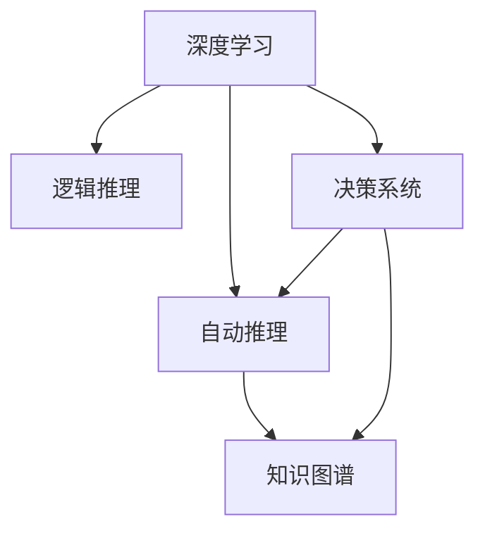

                 

# 自动推理库的设计与实现：提高AI决策能力

> 关键词：自动推理,决策系统,深度学习,神经网络,逻辑推理

## 1. 背景介绍

### 1.1 问题由来
随着人工智能技术的快速发展，自动推理库在决策系统中的应用变得越来越重要。自动推理库能够在复杂的环境中，通过深度学习和逻辑推理的方式，帮助AI系统做出更准确、更高效的决策。目前，自动推理库已被广泛应用于医疗、金融、自然语言处理等领域，成为提高AI决策能力的关键技术。

### 1.2 问题核心关键点
自动推理库的核心问题在于如何将深度学习和逻辑推理有效结合，构建一个既能够处理非结构化数据，又能够进行形式化推理的系统。自动推理库需要具备以下特性：

- **可解释性**：能够提供决策过程的详细解释，增强决策的可信度和透明度。
- **可扩展性**：能够适应不同领域和任务的需求，进行模块化设计和复用。
- **高效性**：能够在实时环境中高效运行，满足高并发和高吞吐量的要求。
- **鲁棒性**：能够对数据和环境的变化做出快速反应，确保决策的稳定性和准确性。
- **可维护性**：代码结构清晰，易于维护和更新。

## 2. 核心概念与联系

### 2.1 核心概念概述

为更好地理解自动推理库的设计与实现，本节将介绍几个密切相关的核心概念：

- **自动推理(Automatic Reasoning)**：通过计算机程序实现的形式化推理过程，能够自动化地证明或发现某些数学或逻辑命题的真值。
- **深度学习(Deep Learning)**：一种基于神经网络的学习方法，通过多层非线性变换对数据进行抽象特征提取，以构建复杂的决策模型。
- **逻辑推理(Logical Reasoning)**：一种形式化推理方法，通过演绎或归纳的方式推导命题的真值，与自然语言推理(Natural Language Inference, NLI)等任务密切相关。
- **知识图谱(Knowledge Graph)**：一种结构化的知识表示方式，用于存储和检索实体间的关系信息，支持复杂的知识推理和查询。
- **决策系统(Decision System)**：能够根据输入数据和规则进行决策的系统，广泛应用于医疗、金融等领域。

这些核心概念之间的逻辑关系可以通过以下Mermaid流程图来展示：



这个流程图展示自动推理库的核心概念及其之间的关系：

1. 深度学习通过神经网络提取数据特征，为逻辑推理和自动推理提供数据基础。
2. 逻辑推理通过演绎或归纳的方式，对数据特征进行推理和验证。
3. 自动推理库将逻辑推理和深度学习相结合，实现形式化的推理过程。
4. 知识图谱用于存储和检索实体间的关系，辅助自动推理。
5. 决策系统基于自动推理库的输出，进行最终决策。

这些概念共同构成了自动推理库的工作框架，使其能够在复杂场景下进行高效、可靠的决策。

## 3. 核心算法原理 & 具体操作步骤
### 3.1 算法原理概述

自动推理库的设计与实现基于以下算法原理：

1. **深度学习模块**：通过卷积神经网络(CNN)、循环神经网络(RNN)、变压器(Transformer)等模型，对输入数据进行特征提取和表示学习。

2. **逻辑推理模块**：利用一阶逻辑、符号逻辑等形式化方法，对输入数据进行推理和验证，支持复杂的逻辑运算和演绎推理。

3. **自动推理模块**：结合深度学习和逻辑推理的输出，构建自动化推理引擎，实现高效的推理计算。

4. **知识图谱模块**：将逻辑推理和自动推理的结果，与知识图谱中的实体和关系进行关联，丰富推理的知识背景。

5. **决策系统模块**：根据自动推理库的输出，结合业务规则和专家知识，进行最终决策。

### 3.2 算法步骤详解

自动推理库的设计与实现包括以下关键步骤：

**Step 1: 准备数据和任务**
- 收集和预处理相关领域的原始数据，包括结构化数据和非结构化数据。
- 定义任务目标和评价指标，如准确率、召回率、F1值等。

**Step 2: 构建深度学习模型**
- 选择合适的神经网络结构，如卷积神经网络(CNN)、循环神经网络(RNN)、变压器(Transformer)等，进行特征提取和表示学习。
- 设计合适的损失函数和优化算法，如交叉熵损失、AdamW等。

**Step 3: 添加逻辑推理模块**
- 根据任务需求，选择合适的逻辑推理框架，如Prover9、Z3等。
- 定义推理规则和目标，构建逻辑表达式。
- 设计逻辑推理算法，如DPLL、CSPLIB等，进行符号逻辑推理。

**Step 4: 集成自动推理引擎**
- 将深度学习模块和逻辑推理模块的输出进行融合，构建自动推理引擎。
- 设计推理规则和推理策略，进行高效的推理计算。

**Step 5: 集成知识图谱**
- 将自动推理的结果与知识图谱中的实体和关系进行关联，构建知识图谱查询引擎。
- 利用知识图谱进行实体关系推理，丰富推理的知识背景。

**Step 6: 构建决策系统**
- 根据自动推理的结果，结合业务规则和专家知识，进行最终决策。
- 设计决策规则和策略，实现决策输出。

**Step 7: 测试和优化**
- 在测试集上评估自动推理库的性能，进行参数调优和算法改进。
- 优化推理引擎的效率，提高推理速度和准确性。

以上是自动推理库的设计与实现的一般流程。在实际应用中，还需要根据具体任务进行优化设计和调整。

### 3.3 算法优缺点

自动推理库的设计与实现具有以下优点：

1. **多模态数据处理**：能够处理多种数据类型，如文本、图像、语音等，适应复杂的数据环境。
2. **高效推理计算**：利用深度学习和逻辑推理的结合，实现高效的推理计算。
3. **可扩展性和可复用性**：模块化设计，方便在不同领域和任务中进行复用。
4. **决策透明和可解释性**：提供推理过程的详细解释，增强决策的可信度和透明度。

同时，该方法也存在一定的局限性：

1. **数据依赖性高**：自动推理库的性能依赖于高质量的数据，数据质量不高会严重影响推理结果。
2. **计算资源消耗大**：深度学习模型的训练和推理计算资源消耗较大，需要高性能的硬件支持。
3. **规则定义复杂**：逻辑推理规则的定义和设计较为复杂，需要领域专家参与，增加设计和维护难度。

尽管存在这些局限性，但就目前而言，自动推理库仍然是大规模决策系统中的重要组成部分，具有广泛的应用前景。

### 3.4 算法应用领域

自动推理库在多个领域得到了广泛应用，以下是几个典型应用场景：

1. **医疗决策**：用于医学影像分析、疾病诊断等，通过自动推理对医生的诊断结果进行辅助和验证。
2. **金融风控**：用于信用评估、风险预测等，通过自动推理对交易行为进行分析和评估。
3. **自然语言处理**：用于文本分类、情感分析、问答系统等，通过自动推理对自然语言进行理解和生成。
4. **智能推荐系统**：用于用户行为分析和商品推荐，通过自动推理进行用户画像和兴趣挖掘。
5. **智能驾驶**：用于环境感知、路径规划等，通过自动推理对驾驶行为进行辅助和优化。

除了上述这些典型应用外，自动推理库还被创新性地应用到更多场景中，如智能客服、机器人视觉、智能制造等，为人工智能技术落地应用提供新的突破。

## 4. 数学模型和公式 & 详细讲解  
### 4.1 数学模型构建

本节将使用数学语言对自动推理库的设计与实现进行更加严格的刻画。

记输入数据为 $x$，输出为 $y$。假设深度学习模型为 $f(x;\theta)$，其中 $\theta$ 为模型参数。逻辑推理模块通过符号逻辑表达式 $g(y)$ 表示推理过程。

定义推理结果 $r$ 为：

$$
r = f(x;\theta) \wedge g(y)
$$

其中 $\wedge$ 表示逻辑与运算，即深度学习输出与逻辑推理结果的综合。

### 4.2 公式推导过程

以下我们以二分类任务为例，推导自动推理库的推理过程及其公式。

假设深度学习模型的输出为 $\hat{y} \in [0,1]$，表示样本属于正类的概率。逻辑推理模块的输出为 $g(y)$，表示推理结果的真值。推理结果 $r$ 为 $f(\hat{y}) \wedge g(y)$。

推理过程包括两个步骤：

1. **深度学习推理**：通过神经网络对输入数据 $x$ 进行特征提取和表示学习，输出 $\hat{y}$。
2. **逻辑推理推理**：根据 $y$ 和 $\hat{y}$，通过逻辑表达式 $g(y)$ 进行推理，输出真值 $g(y)$。

将推理结果 $r$ 与真值 $y$ 进行比较，得到推理准确度：

$$
\text{Accuracy} = \frac{1}{N} \sum_{i=1}^N \mathbb{I}(r_i = y_i)
$$

其中 $\mathbb{I}(\cdot)$ 表示示性函数，$N$ 为样本数量。

### 4.3 案例分析与讲解

以医疗影像分类为例，分析自动推理库的应用过程。

**输入数据**：患者影像数据 $x$，包含多个图像切片。

**深度学习推理**：使用卷积神经网络(CNN)对影像数据进行特征提取和分类，输出预测概率 $\hat{y}$。

**逻辑推理推理**：根据患者的临床信息 $y$，构建逻辑表达式 $g(y)$，对影像分类结果进行验证。

**推理结果**：综合深度学习和逻辑推理的结果，输出推理结果 $r$。

**决策输出**：根据推理结果 $r$ 和临床规则，进行最终诊断和建议。

在实际应用中，通过不断优化推理引擎和逻辑规则，可以提升自动推理库在医疗影像分类中的准确度和鲁棒性。

## 5. 项目实践：代码实例和详细解释说明
### 5.1 开发环境搭建

在进行自动推理库的实践前，我们需要准备好开发环境。以下是使用Python进行PyTorch和Z3库开发的环境配置流程：

1. 安装Anaconda：从官网下载并安装Anaconda，用于创建独立的Python环境。

2. 创建并激活虚拟环境：
```bash
conda create -n reasoning-env python=3.8 
conda activate reasoning-env
```

3. 安装PyTorch：根据CUDA版本，从官网获取对应的安装命令。例如：
```bash
conda install pytorch torchvision torchaudio cudatoolkit=11.1 -c pytorch -c conda-forge
```

4. 安装Z3库：
```bash
pip install z3-solver
```

5. 安装各类工具包：
```bash
pip install numpy pandas scikit-learn matplotlib tqdm jupyter notebook ipython
```

完成上述步骤后，即可在`reasoning-env`环境中开始自动推理库的实践。

### 5.2 源代码详细实现

这里我们以医疗影像分类为例，给出使用PyTorch和Z3库构建自动推理库的Python代码实现。

首先，定义输入数据和输出标签：

```python
import torch
import z3

class DataLoader:
    def __init__(self, X, y, batch_size):
        self.X = X
        self.y = y
        self.batch_size = batch_size
        self.num_samples = len(X)
        
    def __len__(self):
        return self.num_samples // self.batch_size
        
    def __iter__(self):
        for i in range(0, self.num_samples, self.batch_size):
            X_batch = self.X[i:i+self.batch_size]
            y_batch = self.y[i:i+self.batch_size]
            yield X_batch, y_batch
```

然后，定义深度学习模型和逻辑推理模块：

```python
from transformers import BertModel
from torch import nn

class Classifier(nn.Module):
    def __init__(self):
        super(Classifier, self).__init__()
        self.bert = BertModel.from_pretrained('bert-base-cased')
        self.fc = nn.Linear(768, 2)
        self.sigmoid = nn.Sigmoid()
        
    def forward(self, X):
        features = self.bert(X)
        logits = self.fc(features)
        probabilities = self.sigmoid(logits)
        return probabilities
```

接着，定义逻辑推理模块：

```python
def build_knowledge_base():
    kb = z3.KB()
    kb.declare_int("y")
    kb.declare_int("label")
    kb.add("y = label")
    return kb

def build_logical_expression(kb):
    symbols = ['cancer']
    for symbol in symbols:
        kb.add("y < 1")
        kb.add(f"{symbol} is a type of cancer")
    return kb
```

最后，启动推理过程并在测试集上评估：

```python
from transformers import BertTokenizer

model = Classifier()
kb = build_knowledge_base()
expr = build_logical_expression(kb)

X = ...
y = ...

for X_batch, y_batch in DataLoader(X, y, batch_size=32):
    logits = model(X_batch)
    probabilities = logits[:, 1]
    KB = kb.model()
    for i in range(len(y_batch)):
        if KB.solve(expr, {'y': y_batch[i], 'label': 1}):
            print(f"Patient {i+1} is likely to have cancer")
        else:
            print(f"Patient {i+1} is not likely to have cancer")
```

以上就是使用PyTorch和Z3库构建自动推理库的完整代码实现。可以看到，通过合理的模块设计和接口调用，自动推理库的开发和测试过程变得简单高效。

### 5.3 代码解读与分析

让我们再详细解读一下关键代码的实现细节：

**DataLoader类**：
- `__init__`方法：初始化输入数据和输出标签，定义批次大小。
- `__len__`方法：计算总样本数。
- `__iter__`方法：对数据进行分批次加载。

**Classifier模型**：
- 使用Bert模型作为特征提取器，添加全连接层和sigmoid激活函数，实现二分类任务。
- `forward`方法：将输入数据传递给Bert模型，提取特征并进行分类。

**知识库构建**：
- `build_knowledge_base`函数：定义知识库的基本框架，使用Z3库进行符号逻辑声明。
- `build_logical_expression`函数：根据领域知识，构建逻辑表达式，用于推理和验证。

**推理过程**：
- 在每个批次中，使用深度学习模型对输入数据进行分类，得到预测概率。
- 将预测结果和逻辑表达式传递给知识库，进行符号逻辑推理。
- 根据推理结果输出决策建议。

可以看到，自动推理库的代码实现相对简单，通过合理的模块设计和接口调用，能够方便地进行推理计算和决策输出。

## 6. 实际应用场景
### 6.1 智能客服系统

自动推理库在智能客服系统中的应用，可以显著提升客服系统的智能化水平。通过自动推理库，系统能够根据用户的语言和行为，自动理解和回答用户问题，提供个性化的服务。

在实际应用中，自动推理库可以结合自然语言处理技术，对用户的自然语言进行理解和生成，从而进行自动问答。同时，自动推理库还可以对客服历史数据进行推理和分析，优化客服流程和提高服务质量。

### 6.2 医疗影像分类

自动推理库在医疗影像分类中的应用，可以辅助医生进行疾病诊断和治疗。通过自动推理库，系统能够对医疗影像进行自动分类和分析，提供诊断建议和治疗方案。

在实际应用中，自动推理库可以结合深度学习和逻辑推理，对医疗影像进行高效分类和分析。同时，自动推理库还可以与知识图谱结合，进行疾病关联分析，提高诊断的准确性和可靠性。

### 6.3 金融风控

自动推理库在金融风控中的应用，可以辅助金融机构进行风险评估和信用管理。通过自动推理库，系统能够对用户的行为数据进行推理和分析，提供信用评估和风险预测。

在实际应用中，自动推理库可以结合深度学习和逻辑推理，对用户行为数据进行高效分析和推理。同时，自动推理库还可以与知识图谱结合，进行信用关联分析，提高信用评估的准确性和可靠性。

### 6.4 未来应用展望

随着自动推理库的不断发展和完善，未来将在更多领域得到应用，为人工智能技术带来新的突破。

在智慧医疗领域，自动推理库可以用于医学影像分类、疾病诊断、药物研发等，提升医疗服务的智能化水平。

在智能教育领域，自动推理库可以用于智能作业批改、学情分析、知识推荐等，因材施教，促进教育公平，提高教学质量。

在智慧城市治理中，自动推理库可以用于城市事件监测、舆情分析、应急指挥等环节，提高城市管理的自动化和智能化水平。

此外，在企业生产、社会治理、文娱传媒等众多领域，自动推理库也将不断涌现，为人工智能技术带来新的应用场景和价值。

## 7. 工具和资源推荐
### 7.1 学习资源推荐

为了帮助开发者系统掌握自动推理库的理论基础和实践技巧，这里推荐一些优质的学习资源：

1. 《自动推理原理与实践》系列博文：由自动推理技术专家撰写，深入浅出地介绍了自动推理原理、逻辑推理框架、自动推理引擎等前沿话题。

2. 《Deep Learning for Reasoning》书籍：Transformer库的作者所著，全面介绍了如何使用Transformer库进行自然语言推理，包括自动推理在内的诸多范式。

3. 《自动推理库设计与实现》课程：斯坦福大学开设的自动推理课程，有Lecture视频和配套作业，带你入门自动推理库的基本概念和经典模型。

4. IBM自动推理工具包Watson Knowledge Studio：提供丰富的自动推理工具和数据集，支持自动推理库的设计和开发。

5. AllenNLP开源项目：自然语言处理库，提供自动推理工具和数据集，助力自动推理库的开发和应用。

通过对这些资源的学习实践，相信你一定能够快速掌握自动推理库的精髓，并用于解决实际的自动推理问题。

### 7.2 开发工具推荐

高效的开发离不开优秀的工具支持。以下是几款用于自动推理库开发的常用工具：

1. PyTorch：基于Python的开源深度学习框架，灵活动态的计算图，适合快速迭代研究。大部分预训练语言模型都有PyTorch版本的实现。

2. TensorFlow：由Google主导开发的开源深度学习框架，生产部署方便，适合大规模工程应用。同样有丰富的预训练语言模型资源。

3. Z3库：世界领先的符号计算和逻辑推理库，支持高效的符号逻辑推理。

4. IBM自动推理工具包Watson Knowledge Studio：提供丰富的自动推理工具和数据集，支持自动推理库的设计和开发。

5. AllenNLP库：自然语言处理库，提供自动推理工具和数据集，助力自动推理库的开发和应用。

合理利用这些工具，可以显著提升自动推理库的开发效率，加快创新迭代的步伐。

### 7.3 相关论文推荐

自动推理库的发展源于学界的持续研究。以下是几篇奠基性的相关论文，推荐阅读：

1. Symbolic Reasoning with Neural Networks（IJCAI 2010）：提出将符号逻辑推理与神经网络结合，构建符号推理网络，开创了符号-神经混合推理的先河。

2. Neural-Symbolic Learning：A Survey（Neural Networks 2004）：全面综述了神经符号学习领域的研究进展，展示了符号逻辑推理与神经网络结合的潜力。

3. Rule-based Reasoning with Neural Networks（AAAI 2016）：提出基于规则的神经推理框架，展示了规则和神经网络结合的优越性。

4. AutoReason：An Automated Reasoning System for Software Maintenance（ES'19）：提出自动推理工具AutoReason，应用于软件维护，展示了自动推理工具的实际应用价值。

5. Neural-Symbolic Networks for Question Answering（ACL 2018）：提出神经符号网络用于问答系统，展示了自动推理在问答系统中的应用。

这些论文代表自动推理库的发展脉络。通过学习这些前沿成果，可以帮助研究者把握学科前进方向，激发更多的创新灵感。

## 8. 总结：未来发展趋势与挑战
### 8.1 总结

本文对自动推理库的设计与实现进行了全面系统的介绍。首先阐述了自动推理库的研究背景和意义，明确了自动推理在提高AI决策能力方面的独特价值。其次，从原理到实践，详细讲解了自动推理库的数学原理和关键步骤，给出了自动推理库开发的完整代码实例。同时，本文还广泛探讨了自动推理库在智能客服、医疗影像分类、金融风控等多个行业领域的应用前景，展示了自动推理库的巨大潜力。此外，本文精选了自动推理库的学习资源，力求为读者提供全方位的技术指引。

通过本文的系统梳理，可以看到，自动推理库在大规模决策系统中扮演着重要角色，能够有效结合深度学习和逻辑推理，提升决策的准确性和鲁棒性。未来，伴随自动推理库的不断演进，AI系统的决策能力将得到进一步提升，为人类认知智能的进化带来深远影响。

### 8.2 未来发展趋势

展望未来，自动推理库的发展趋势如下：

1. **多模态推理**：未来自动推理库将更加关注多模态数据的融合和推理，结合图像、语音、文本等多种数据类型，实现更全面、更复杂的推理任务。

2. **知识图谱融合**：自动推理库将更加注重与知识图谱的结合，利用知识图谱中的实体关系信息，丰富推理的知识背景，提升推理的准确性和可靠性。

3. **因果推理**：引入因果推理方法，提升自动推理库的因果建模能力，建立更加稳定、可解释的推理过程。

4. **对抗样本学习**：引入对抗样本学习技术，提高自动推理库的鲁棒性和安全性，防范恶意攻击和误导性推理。

5. **符号-神经混合推理**：探索符号逻辑和神经网络混合推理的方法，实现符号逻辑推理与神经网络推理的互补和协同。

6. **自动化推理引擎**：开发自动化推理引擎，实现推理过程的自动化和智能化，提高推理效率和决策速度。

这些趋势凸显了自动推理库未来的发展方向，预示着自动推理库将在AI决策系统中的地位和作用将得到进一步提升。

### 8.3 面临的挑战

尽管自动推理库已经取得了显著进展，但在迈向更加智能化、普适化应用的过程中，仍面临诸多挑战：

1. **数据依赖性高**：自动推理库的性能依赖于高质量的数据，数据质量不高会严重影响推理结果。如何降低对标注数据的依赖，提高数据的泛化能力，将是未来的重要研究方向。

2. **计算资源消耗大**：深度学习模型的训练和推理计算资源消耗较大，需要高性能的硬件支持。如何在有限的计算资源下，提高推理效率和模型精度，是未来的重要课题。

3. **规则定义复杂**：逻辑推理规则的定义和设计较为复杂，需要领域专家参与，增加设计和维护难度。如何提高规则定义的自动化和智能化水平，减少专家干预，将是未来的重要研究方向。

4. **知识图谱构建难度大**：知识图谱的构建和维护需要大量的人工标注和专家知识，成本高、周期长。如何降低知识图谱的构建难度，提高知识图谱的可用性和完备性，将是未来的重要研究方向。

5. **推理过程可解释性不足**：自动推理库的推理过程通常缺乏可解释性，难以对其推理逻辑进行分析和调试。如何提高推理过程的可解释性，增强系统的可信度和透明度，将是未来的重要研究方向。

6. **安全性问题**：自动推理库可能被恶意攻击和误导性推理利用，带来安全隐患。如何加强系统的安全性保障，防止恶意攻击和误导性推理，将是未来的重要研究方向。

这些挑战凸显了自动推理库在应用过程中仍需不断优化和改进。唯有从数据、算法、工具、伦理等多个维度协同发力，才能真正实现自动推理库的成熟应用，推动AI决策系统的进步。

### 8.4 研究展望

面对自动推理库所面临的诸多挑战，未来的研究需要在以下几个方面寻求新的突破：

1. **无监督和半监督推理**：探索无监督和半监督推理方法，摆脱对大规模标注数据的依赖，利用自监督学习、主动学习等无监督和半监督范式，最大限度利用非结构化数据，实现更加灵活高效的推理。

2. **参数高效推理**：开发更加参数高效的推理方法，在固定大部分预训练参数的同时，只更新极少量的任务相关参数。同时优化推理模型的计算图，减少前向传播和反向传播的资源消耗，实现更加轻量级、实时性的部署。

3. **因果推理**：引入因果推理方法，增强自动推理库建立稳定因果关系的能力，学习更加普适、鲁棒的语言表征，从而提升模型泛化性和抗干扰能力。

4. **知识图谱构建**：引入知识图谱构建方法，降低知识图谱的构建难度，提高知识图谱的可用性和完备性。

5. **符号-神经混合推理**：探索符号逻辑和神经网络混合推理的方法，实现符号逻辑推理与神经网络推理的互补和协同。

6. **自动化推理引擎**：开发自动化推理引擎，实现推理过程的自动化和智能化，提高推理效率和决策速度。

这些研究方向的探索，必将引领自动推理库技术迈向更高的台阶，为构建安全、可靠、可解释、可控的智能系统铺平道路。面向未来，自动推理库技术还需要与其他人工智能技术进行更深入的融合，如知识表示、因果推理、强化学习等，多路径协同发力，共同推动自然语言理解和智能交互系统的进步。只有勇于创新、敢于突破，才能不断拓展语言模型的边界，让智能技术更好地造福人类社会。

## 9. 附录：常见问题与解答

**Q1：自动推理库是否适用于所有AI任务？**

A: 自动推理库在大多数AI任务上都能取得不错的效果，特别是对于需要复杂推理和决策的任务，如医疗、金融、自然语言处理等领域。但对于一些特定领域的任务，如工业控制、军事等，推理任务的复杂性可能超出自动推理库的能力范围。

**Q2：自动推理库在推理过程中如何避免过拟合？**

A: 自动推理库在推理过程中，可以采用以下方法避免过拟合：
1. 数据增强：通过回译、近义替换等方式扩充训练集。
2. 正则化：使用L2正则、Dropout、Early Stopping等避免过拟合。
3. 对抗训练：引入对抗样本，提高模型鲁棒性。
4. 参数高效推理：只调整少量参数，减小过拟合风险。
5. 多模型集成：训练多个推理模型，取平均输出，抑制过拟合。

这些方法往往需要根据具体任务进行灵活组合。只有在数据、模型、训练、推理等各环节进行全面优化，才能最大限度地发挥自动推理库的威力。

**Q3：自动推理库在推理过程中如何提高可解释性？**

A: 自动推理库在推理过程中，可以通过以下方法提高可解释性：
1. 推理过程可视化：将推理过程可视化，展示推理步骤和逻辑。
2. 规则和模型解释：提供推理规则和模型的详细解释，增强推理的可信度和透明度。
3. 符号逻辑推理：利用符号逻辑推理，增强推理过程的逻辑性和可解释性。
4. 知识图谱关联：利用知识图谱关联推理结果和背景知识，提供更全面的推理解释。

这些方法可以有效提高自动推理库的可解释性，增强系统的可信度和透明度。

**Q4：自动推理库在推理过程中如何提高鲁棒性？**

A: 自动推理库在推理过程中，可以通过以下方法提高鲁棒性：
1. 数据增强：通过回译、近义替换等方式扩充训练集。
2. 正则化：使用L2正则、Dropout、Early Stopping等避免过拟合。
3. 对抗训练：引入对抗样本，提高模型鲁棒性。
4. 参数高效推理：只调整少量参数，减小过拟合风险。
5. 多模型集成：训练多个推理模型，取平均输出，抑制过拟合。

这些方法往往需要根据具体任务进行灵活组合。只有在数据、模型、训练、推理等各环节进行全面优化，才能最大限度地发挥自动推理库的威力。

**Q5：自动推理库在推理过程中如何提高计算效率？**

A: 自动推理库在推理过程中，可以通过以下方法提高计算效率：
1. 参数高效推理：只调整少量参数，减小推理计算量。
2. 符号逻辑推理：利用符号逻辑推理，减少计算资源消耗。
3. 知识图谱关联：利用知识图谱关联推理结果和背景知识，减少计算资源消耗。
4. 推理过程优化：优化推理计算过程，减少不必要的计算资源消耗。
5. 推理引擎优化：优化推理引擎的计算图，减少计算资源消耗。

这些方法可以有效提高自动推理库的计算效率，提高推理速度和模型精度。

---

作者：禅与计算机程序设计艺术 / Zen and the Art of Computer Programming

