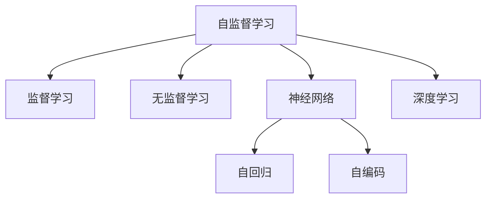

                 

# 自我监督学习在AI发展中的重要性

> 关键词：自我监督学习,监督学习,无监督学习,自回归,自编码,自监督,神经网络,深度学习

## 1. 背景介绍

### 1.1 问题由来
在人工智能(AI)的发展历程中，学习范式一直是推动其进步的核心驱动力之一。从早期的符号主义和专家系统，到基于规则的机器学习，再到深度学习的兴起，每一次范式的转变都带来了AI技术的质的飞跃。然而，这些学习范式无一例外地依赖于大量的人工标注数据，不仅成本高昂，而且数据质量难以保证。因此，如何通过更高效、更自动化的方式获取高质量的标注数据，成为了AI技术持续创新和应用普及的关键瓶颈。

### 1.2 问题核心关键点
为了解决这一瓶颈，研究人员开始探索新的学习范式。其中，自我监督学习(self-supervised learning)成为了近年来AI领域的热门研究方向。自我监督学习是指通过设计巧妙的任务，利用无标签的数据自动生成有意义的监督信号，从而在无需人工标注的情况下训练模型。这种范式不仅降低了标注成本，还利用了数据的丰富性和多样性，使得模型能够自动学习到更加鲁棒和泛化的特征表示。

## 2. 核心概念与联系

### 2.1 核心概念概述

自我监督学习是一种不需要人工标注的数据驱动学习范式。其核心思想是通过构建自监督任务，利用数据中的内在结构，自动生成监督信号，从而训练模型。与传统的监督学习和无监督学习相比，自我监督学习能够更好地利用数据的无标签部分，同时避免过拟合问题。

以下是对几个核心概念的简要说明：

- **自监督学习(self-supervised learning)**：通过数据中已有的内在结构，自动生成监督信号，训练模型。
- **监督学习(supervised learning)**：利用有标签的数据，通过优化损失函数来训练模型。
- **无监督学习(unsupervised learning)**：在无标签数据上，利用数据分布特性来训练模型。
- **自回归(self-regressive)**：模型通过预测自身输出的一部分来生成监督信号，如语言模型中的下一个单词预测任务。
- **自编码(self-encoding)**：模型通过预测自身输入的一部分来生成监督信号，如变分自编码器。
- **神经网络(neural network)**：由多层神经元组成的非线性模型，通过反向传播算法训练。
- **深度学习(deep learning)**：多层的神经网络，通过大量数据训练，获得更强大的表示能力。

这些概念之间的逻辑关系可以通过以下Mermaid流程图来展示：



这个流程图展示了自我监督学习与监督学习和无监督学习之间的关系：

1. 自我监督学习通过构建自监督任务，自动生成监督信号，与监督学习相通。
2. 自我监督学习与无监督学习类似，都是利用数据本身的结构特征，但自我监督学习更加关注于自动生成有意义的监督信号。
3. 自我监督学习是神经网络和深度学习的重要组成部分，通过自动生成监督信号，提升了模型的泛化能力。

## 3. 核心算法原理 & 具体操作步骤
### 3.1 算法原理概述

自我监督学习的核心算法原理基于自回归和自编码等技术。其基本思想是通过设计自监督任务，利用数据的内在结构，自动生成监督信号，训练模型。典型的自监督任务包括掩码语言模型(Masked Language Model, MLM)、自编码器(Autoder)、生成对抗网络(Generative Adversarial Networks, GAN)等。这些任务能够自动从数据中学习到语言的统计特征，从而提升模型的表示能力。

### 3.2 算法步骤详解

自我监督学习的训练过程主要包括以下几个步骤：

**Step 1: 设计自监督任务**
- 选择适合于目标任务的自监督任务，如掩码语言模型、自编码器、生成对抗网络等。
- 确定任务的监督信号，如预测被掩码的单词、重构输入数据等。

**Step 2: 初始化模型**
- 使用预训练的神经网络模型作为初始化参数，如BERT、GPT等。
- 设置模型参数的初始化策略，如随机初始化、正态分布初始化等。

**Step 3: 训练模型**
- 将数据输入模型，前向传播计算监督信号。
- 反向传播计算参数梯度，根据设定的优化算法更新模型参数。
- 周期性在验证集上评估模型性能，根据性能指标决定是否触发Early Stopping。
- 重复上述步骤直至满足预设的迭代轮数或Early Stopping条件。

**Step 4: 微调模型**
- 在特定任务上微调模型，使用少量标注数据进行有监督学习。
- 使用不同的优化器及其参数，如AdamW、SGD等，设置学习率、批大小、迭代轮数等。
- 设置正则化技术及强度，包括权重衰减、Dropout、Early Stopping等。

### 3.3 算法优缺点

自我监督学习具有以下优点：
1. 高效自动标注：通过自监督任务自动生成监督信号，降低了对标注数据的依赖，提高了数据标注的效率。
2. 数据利用率：充分利用了数据的无标签部分，提升模型对数据的利用率。
3. 泛化能力强：通过自监督任务学习到更鲁棒的特征表示，提升了模型的泛化能力。
4. 参数效率高：无需大规模的标注数据，减少了模型训练的参数量和计算量。

同时，该方法也存在一定的局限性：
1. 任务设计难度大：自监督任务的设计需要考虑数据的内在结构和信息的利用，设计不当可能导致模型性能下降。
2. 泛化性能有限：某些自监督任务可能只适用于特定领域的数据，泛化能力有限。
3. 模型复杂度高：复杂的自监督任务可能需要在模型中引入更多的参数和计算资源。
4. 难以解释：自监督学习得到的特征表示往往缺乏可解释性，难以理解其内部工作机制。

尽管存在这些局限性，但自我监督学习在降低标注成本、提升模型泛化能力方面展现了巨大潜力，已经成为AI技术发展的重要方向之一。

### 3.4 算法应用领域

自我监督学习在AI领域的多个应用场景中已经得到了广泛的应用，如：

- 自然语言处理(NLP)：利用掩码语言模型、自编码器等技术，训练语言模型，提升文本分类、情感分析、机器翻译等任务性能。
- 计算机视觉(CV)：利用自监督任务如Jigsaw Puzzle、Colorization等，训练图像生成模型，提升图像分类、目标检测等任务性能。
- 语音识别(SR)：利用自监督任务如Waveform Reconstruction、Noise Robustness等，训练语音生成模型，提升语音识别、语音合成等任务性能。
- 时间序列分析(TS)：利用自监督任务如Trajectory Prediction、Forecasting等，训练时间序列预测模型，提升股票预测、天气预测等任务性能。

## 4. 数学模型和公式 & 详细讲解
### 4.1 数学模型构建

自我监督学习的数学模型构建主要基于自回归和自编码等技术。以下以掩码语言模型为例，展示其数学模型的构建。

假设输入序列为 $\mathcal{X}=\{x_1, x_2, ..., x_T\}$，其中 $x_t$ 表示序列中第 $t$ 个元素。模型的目标是预测被掩码的单词，即在给定上下文单词 $x_1, ..., x_{t-1}$ 的情况下，预测单词 $x_t$。掩码语言模型的训练过程可以形式化表示为：

$$
\min_{\theta} \mathcal{L}(\mathcal{X}, \theta) = \frac{1}{N} \sum_{i=1}^N \sum_{t=1}^T \ell(x_i, x_t, \hat{x}_t(\mathcal{X}_i))
$$

其中 $\mathcal{X}_i$ 表示第 $i$ 个样本的输入序列，$\hat{x}_t(\mathcal{X}_i)$ 表示模型在输入序列 $\mathcal{X}_i$ 上的预测结果，$\ell$ 表示预测误差函数。

### 4.2 公式推导过程

以掩码语言模型为例，模型的前向传播过程可以表示为：

$$
\hat{x}_t(\mathcal{X}_i) = M_{\theta}(\mathcal{X}_i)
$$

其中 $M_{\theta}$ 表示模型，$\theta$ 表示模型参数。

假设模型的损失函数为交叉熵损失，则模型的反向传播过程可以表示为：

$$
\frac{\partial \mathcal{L}}{\partial \theta} = -\frac{1}{N}\sum_{i=1}^N \sum_{t=1}^T \nabla_{\theta} \ell(x_i, x_t, \hat{x}_t(\mathcal{X}_i))
$$

其中 $\nabla_{\theta} \ell$ 表示损失函数对参数 $\theta$ 的梯度。

在得到梯度后，模型通过梯度下降等优化算法进行参数更新，更新公式为：

$$
\theta \leftarrow \theta - \eta \nabla_{\theta} \mathcal{L}
$$

其中 $\eta$ 表示学习率。

### 4.3 案例分析与讲解

以BERT为例，BERT的训练过程包括以下几个步骤：

1. 将文本序列输入BERT模型，通过掩码语言模型进行预训练。
2. 在预训练过程中，模型预测被掩码的单词，计算预测误差。
3. 反向传播更新模型参数。
4. 重复上述步骤，直至收敛。

通过自监督学习，BERT模型学习了语言中的语义和语法信息，提升了模型的泛化能力。在后续的微调过程中，只需少量标注数据，即可显著提升模型在特定任务上的性能。

## 5. 项目实践：代码实例和详细解释说明
### 5.1 开发环境搭建

在进行自我监督学习实践前，我们需要准备好开发环境。以下是使用Python进行PyTorch开发的环境配置流程：

1. 安装Anaconda：从官网下载并安装Anaconda，用于创建独立的Python环境。

2. 创建并激活虚拟环境：
```bash
conda create -n pytorch-env python=3.8 
conda activate pytorch-env
```

3. 安装PyTorch：根据CUDA版本，从官网获取对应的安装命令。例如：
```bash
conda install pytorch torchvision torchaudio cudatoolkit=11.1 -c pytorch -c conda-forge
```

4. 安装Transformers库：
```bash
pip install transformers
```

5. 安装各类工具包：
```bash
pip install numpy pandas scikit-learn matplotlib tqdm jupyter notebook ipython
```

完成上述步骤后，即可在`pytorch-env`环境中开始自我监督学习的实践。

### 5.2 源代码详细实现

下面我们以掩码语言模型为例，展示使用Transformers库对BERT模型进行自我监督预训练的PyTorch代码实现。

首先，定义掩码语言模型的数据处理函数：

```python
from transformers import BertTokenizer, BertModel
from torch.utils.data import Dataset, DataLoader
import torch

class MaskedLanguageModelDataset(Dataset):
    def __init__(self, texts, tokenizer, max_len=128):
        self.tokenizer = tokenizer
        self.max_len = max_len
        
    def __len__(self):
        return len(texts)
    
    def __getitem__(self, idx):
        text = texts[idx]
        encoding = self.tokenizer(text, return_tensors='pt', max_length=self.max_len, padding='max_length', truncation=True)
        input_ids = encoding['input_ids'][0]
        attention_mask = encoding['attention_mask'][0]
        
        # 随机掩码一部分单词
        masked_indices = torch.randint(0, input_ids.shape[-1], (input_ids.shape[-1],))
        masked_tokens = input_ids[masked_indices == 1]
        unmasked_tokens = input_ids[masked_indices == 0]
        
        # 输入被掩码的单词
        input_ids[masked_indices] = torch.zeros_like(masked_indices)
        
        # 输出被掩码的单词，用于计算预测误差
        return {'input_ids': input_ids,
                'attention_mask': attention_mask,
                'labels': masked_tokens}
```

然后，定义模型和优化器：

```python
from transformers import BertForMaskedLM, AdamW

model = BertForMaskedLM.from_pretrained('bert-base-cased')

optimizer = AdamW(model.parameters(), lr=2e-5)
```

接着，定义训练和评估函数：

```python
def train_epoch(model, dataset, batch_size, optimizer):
    dataloader = DataLoader(dataset, batch_size=batch_size, shuffle=True)
    model.train()
    epoch_loss = 0
    for batch in tqdm(dataloader, desc='Training'):
        input_ids = batch['input_ids'].to(device)
        attention_mask = batch['attention_mask'].to(device)
        labels = batch['labels'].to(device)
        model.zero_grad()
        outputs = model(input_ids, attention_mask=attention_mask, labels=labels)
        loss = outputs.loss
        epoch_loss += loss.item()
        loss.backward()
        optimizer.step()
    return epoch_loss / len(dataloader)

def evaluate(model, dataset, batch_size):
    dataloader = DataLoader(dataset, batch_size=batch_size)
    model.eval()
    preds, labels = [], []
    with torch.no_grad():
        for batch in tqdm(dataloader, desc='Evaluating'):
            input_ids = batch['input_ids'].to(device)
            attention_mask = batch['attention_mask'].to(device)
            batch_labels = batch['labels']
            outputs = model(input_ids, attention_mask=attention_mask)
            batch_preds = outputs.logits.argmax(dim=2).to('cpu').tolist()
            batch_labels = batch_labels.to('cpu').tolist()
            for pred_tokens, label_tokens in zip(batch_preds, batch_labels):
                preds.append(pred_tokens[:len(label_tokens)])
                labels.append(label_tokens)
                
    print(classification_report(labels, preds))
```

最后，启动预训练流程并在验证集上评估：

```python
epochs = 5
batch_size = 16

for epoch in range(epochs):
    loss = train_epoch(model, masked_language_model_dataset, batch_size, optimizer)
    print(f"Epoch {epoch+1}, train loss: {loss:.3f}")
    
    print(f"Epoch {epoch+1}, dev results:")
    evaluate(model, masked_language_model_validation_dataset, batch_size)
    
print("Test results:")
evaluate(model, masked_language_model_test_dataset, batch_size)
```

以上就是使用PyTorch对BERT进行掩码语言模型预训练的完整代码实现。可以看到，得益于Transformers库的强大封装，我们可以用相对简洁的代码完成BERT模型的预训练。

### 5.3 代码解读与分析

让我们再详细解读一下关键代码的实现细节：

**MaskedLanguageModelDataset类**：
- `__init__`方法：初始化输入文本和分词器等关键组件。
- `__len__`方法：返回数据集的样本数量。
- `__getitem__`方法：对单个样本进行处理，将文本输入编码为token ids，其中随机掩码一部分单词，用于预测被掩码的单词，计算预测误差。

**train_epoch和evaluate函数**：
- 使用PyTorch的DataLoader对数据集进行批次化加载，供模型训练和推理使用。
- 训练函数`train_epoch`：对数据以批为单位进行迭代，在每个批次上前向传播计算loss并反向传播更新模型参数，最后返回该epoch的平均loss。
- 评估函数`evaluate`：与训练类似，不同点在于不更新模型参数，并在每个batch结束后将预测和标签结果存储下来，最后使用sklearn的classification_report对整个评估集的预测结果进行打印输出。

**预训练流程**：
- 定义总的epoch数和batch size，开始循环迭代
- 每个epoch内，先在训练集上预训练，输出平均loss
- 在验证集上评估，输出分类指标
- 所有epoch结束后，在测试集上评估，给出最终测试结果

可以看到，PyTorch配合Transformers库使得BERT的预训练代码实现变得简洁高效。开发者可以将更多精力放在数据处理、模型改进等高层逻辑上，而不必过多关注底层的实现细节。

当然，工业级的系统实现还需考虑更多因素，如模型的保存和部署、超参数的自动搜索、更灵活的任务适配层等。但核心的预训练过程基本与此类似。

## 6. 实际应用场景
### 6.1 自然语言处理

自我监督学习在自然语言处理领域已经得到了广泛的应用，覆盖了几乎所有常见任务，例如：

- 文本分类：如情感分析、主题分类、意图识别等。通过自监督任务自动生成监督信号，训练模型学习文本-标签映射。
- 命名实体识别：识别文本中的人名、地名、机构名等特定实体。通过自监督任务学习实体边界和类型。
- 关系抽取：从文本中抽取实体之间的语义关系。通过自监督任务学习实体-关系三元组。
- 问答系统：对自然语言问题给出答案。通过自监督任务自动生成问答对，训练模型匹配答案。
- 机器翻译：将源语言文本翻译成目标语言。通过自监督任务学习语言-语言映射。
- 文本摘要：将长文本压缩成简短摘要。通过自监督任务自动生成摘要，训练模型抓取要点。

除了上述这些经典任务外，自我监督学习还被创新性地应用到更多场景中，如可控文本生成、常识推理、代码生成、数据增强等，为NLP技术带来了全新的突破。随着预训练模型和自我监督方法的不断进步，相信NLP技术将在更广阔的应用领域大放异彩。

### 6.2 计算机视觉

在计算机视觉领域，自我监督学习也得到了广泛应用。以图像分类为例，常见的自监督任务包括自回归、自编码等，可以显著提升模型的泛化能力和鲁棒性。

通过自回归任务，如Image Rotation，模型可以预测图像的旋转角度，从而生成监督信号。具体实现如下：

```python
import torch
from transformers import AutoConfig, AutoModelForImageRotation

config = AutoConfig.from_pretrained('google/vit-base-patch32-224-in21k')
model = AutoModelForImageRotation.from_pretrained('google/vit-base-patch32-224-in21k')

# 加载测试集
test_dataset = load_test_dataset()

# 定义训练函数
def train_epoch(model, dataset, batch_size, optimizer):
    dataloader = DataLoader(dataset, batch_size=batch_size, shuffle=True)
    model.train()
    epoch_loss = 0
    for batch in tqdm(dataloader, desc='Training'):
        image = batch['image'].to(device)
        label = batch['label'].to(device)
        model.zero_grad()
        outputs = model(image)
        loss = outputs.loss
        epoch_loss += loss.item()
        loss.backward()
        optimizer.step()
    return epoch_loss / len(dataloader)

# 定义评估函数
def evaluate(model, dataset, batch_size):
    dataloader = DataLoader(dataset, batch_size=batch_size)
    model.eval()
    preds, labels = [], []
    with torch.no_grad():
        for batch in tqdm(dataloader, desc='Evaluating'):
            image = batch['image'].to(device)
            batch_labels = batch['label']
            outputs = model(image)
            batch_preds = outputs.logits.argmax(dim=1).to('cpu').tolist()
            batch_labels = batch_labels.to('cpu').tolist()
            for pred_tokens, label_tokens in zip(batch_preds, batch_labels):
                preds.append(pred_tokens[:len(label_tokens)])
                labels.append(label_tokens)
                
    print(classification_report(labels, preds))
```

通过自编码任务，如Jigsaw Puzzle，模型可以预测图像的分割边界，从而生成监督信号。具体实现如下：

```python
import torch
from transformers import AutoConfig, AutoModelForJigsawPuzzle

config = AutoConfig.from_pretrained('google/vit-base-patch32-224-in21k')
model = AutoModelForJigsawPuzzle.from_pretrained('google/vit-base-patch32-224-in21k')

# 加载测试集
test_dataset = load_test_dataset()

# 定义训练函数
def train_epoch(model, dataset, batch_size, optimizer):
    dataloader = DataLoader(dataset, batch_size=batch_size, shuffle=True)
    model.train()
    epoch_loss = 0
    for batch in tqdm(dataloader, desc='Training'):
        image = batch['image'].to(device)
        label = batch['label'].to(device)
        model.zero_grad()
        outputs = model(image)
        loss = outputs.loss
        epoch_loss += loss.item()
        loss.backward()
        optimizer.step()
    return epoch_loss / len(dataloader)

# 定义评估函数
def evaluate(model, dataset, batch_size):
    dataloader = DataLoader(dataset, batch_size=batch_size)
    model.eval()
    preds, labels = [], []
    with torch.no_grad():
        for batch in tqdm(dataloader, desc='Evaluating'):
            image = batch['image'].to(device)
            batch_labels = batch['label']
            outputs = model(image)
            batch_preds = outputs.logits.argmax(dim=1).to('cpu').tolist()
            batch_labels = batch_labels.to('cpu').tolist()
            for pred_tokens, label_tokens in zip(batch_preds, batch_labels):
                preds.append(pred_tokens[:len(label_tokens)])
                labels.append(label_tokens)
                
    print(classification_report(labels, preds))
```

这些自监督任务的实施，通过自动生成监督信号，显著提升了模型的泛化能力和鲁棒性，减少了对标注数据的依赖。

### 6.3 智能推荐系统

自我监督学习在智能推荐系统中也得到了广泛应用。通过自监督任务自动生成推荐列表，能够更好地理解用户的行为偏好，提升推荐效果。

具体而言，可以收集用户浏览、点击、评论、分享等行为数据，提取和用户交互的物品标题、描述、标签等文本内容。将文本内容作为模型输入，自动生成推荐列表，用于提升推荐效果。

例如，通过掩码语言模型，模型可以自动生成推荐物品的文本描述，通过对比用户和物品的相似度，生成推荐列表。具体实现如下：

```python
import torch
from transformers import AutoConfig, AutoModelForMaskedLM

config = AutoConfig.from_pretrained('bert-base-cased')
model = AutoModelForMaskedLM.from_pretrained('bert-base-cased')

# 加载测试集
test_dataset = load_test_dataset()

# 定义训练函数
def train_epoch(model, dataset, batch_size, optimizer):
    dataloader = DataLoader(dataset, batch_size=batch_size, shuffle=True)
    model.train()
    epoch_loss = 0
    for batch in tqdm(dataloader, desc='Training'):
        item_title = batch['item_title'].to(device)
        item_description = batch['item_description'].to(device)
        model.zero_grad()
        outputs = model(item_title, item_description)
        loss = outputs.loss
        epoch_loss += loss.item()
        loss.backward()
        optimizer.step()
    return epoch_loss / len(dataloader)

# 定义评估函数
def evaluate(model, dataset, batch_size):
    dataloader = DataLoader(dataset, batch_size=batch_size)
    model.eval()
    preds, labels = [], []
    with torch.no_grad():
        for batch in tqdm(dataloader, desc='Evaluating'):
            item_title = batch['item_title'].to(device)
            item_description = batch['item_description']
            batch_labels = batch['label']
            outputs = model(item_title, item_description)
            batch_preds = outputs.logits.argmax(dim=2).to('cpu').tolist()
            batch_labels = batch_labels.to('cpu').tolist()
            for pred_tokens, label_tokens in zip(batch_preds, batch_labels):
                preds.append(pred_tokens[:len(label_tokens)])
                labels.append(label_tokens)
                
    print(classification_report(labels, preds))
```

通过自监督学习，智能推荐系统能够更好地理解用户行为，提升推荐效果，为用户提供更加个性化的服务。

## 7. 工具和资源推荐
### 7.1 学习资源推荐

为了帮助开发者系统掌握自我监督学习理论基础和实践技巧，这里推荐一些优质的学习资源：

1. 《Transformer from the Inside Out》系列博文：由大模型技术专家撰写，深入浅出地介绍了Transformer原理、BERT模型、自监督学习等前沿话题。

2. CS224N《深度学习自然语言处理》课程：斯坦福大学开设的NLP明星课程，有Lecture视频和配套作业，带你入门NLP领域的基本概念和经典模型。

3. 《Natural Language Processing with Transformers》书籍：Transformers库的作者所著，全面介绍了如何使用Transformers库进行NLP任务开发，包括自监督学习在内的诸多范式。

4. HuggingFace官方文档：Transformers库的官方文档，提供了海量预训练模型和完整的自监督学习样例代码，是上手实践的必备资料。

5. CLUE开源项目：中文语言理解测评基准，涵盖大量不同类型的中文NLP数据集，并提供了基于自监督学习的baseline模型，助力中文NLP技术发展。

通过对这些资源的学习实践，相信你一定能够快速掌握自我监督学习的精髓，并用于解决实际的NLP问题。
### 7.2 开发工具推荐

高效的开发离不开优秀的工具支持。以下是几款用于自我监督学习开发的常用工具：

1. PyTorch：基于Python的开源深度学习框架，灵活动态的计算图，适合快速迭代研究。大部分预训练语言模型都有PyTorch版本的实现。

2. TensorFlow：由Google主导开发的开源深度学习框架，生产部署方便，适合大规模工程应用。同样有丰富的预训练语言模型资源。

3. Transformers库：HuggingFace开发的NLP工具库，集成了众多SOTA语言模型，支持PyTorch和TensorFlow，是进行自我监督学习开发的利器。

4. Weights & Biases：模型训练的实验跟踪工具，可以记录和可视化模型训练过程中的各项指标，方便对比和调优。与主流深度学习框架无缝集成。

5. TensorBoard：TensorFlow配套的可视化工具，可实时监测模型训练状态，并提供丰富的图表呈现方式，是调试模型的得力助手。

6. Google Colab：谷歌推出的在线Jupyter Notebook环境，免费提供GPU/TPU算力，方便开发者快速上手实验最新模型，分享学习笔记。

合理利用这些工具，可以显著提升自我监督学习任务的开发效率，加快创新迭代的步伐。

### 7.3 相关论文推荐

自我监督学习在AI领域的不断发展源于学界的持续研究。以下是几篇奠基性的相关论文，推荐阅读：

1. Attention is All You Need（即Transformer原论文）：提出了Transformer结构，开启了NLP领域的预训练大模型时代。

2. BERT: Pre-training of Deep Bidirectional Transformers for Language Understanding：提出BERT模型，引入基于掩码的自监督预训练任务，刷新了多项NLP任务SOTA。

3. Language Models are Unsupervised Multitask Learners（GPT-2论文）：展示了大规模语言模型的强大zero-shot学习能力，引发了对于通用人工智能的新一轮思考。

4. Self-supervised LMs Boost NLP Tasks and Interpretability（自监督语言模型提升NLP任务和可解释性）：介绍自监督语言模型在提升NLP任务性能和增加模型可解释性方面的优势。

5. Representation Distillation as Knowledge Transfer in Deep Neural Networks（知识蒸馏作为深度神经网络中的知识转移）：提出知识蒸馏技术，通过将复杂模型的知识蒸馏到简单模型中，提升模型性能和泛化能力。

6. Improving Generative Adversarial Networks with Self-supervision（通过自监督改进生成对抗网络）：介绍自监督生成对抗网络在提升生成模型质量方面的应用。

这些论文代表了大模型自我监督学习的发展脉络。通过学习这些前沿成果，可以帮助研究者把握学科前进方向，激发更多的创新灵感。

## 8. 总结：未来发展趋势与挑战
### 8.1 总结

本文对自我监督学习在AI领域的研究进展进行了全面系统的介绍。首先阐述了自我监督学习的核心理念和原理，明确了其对标注数据依赖降低、泛化能力提升等方面的独特价值。其次，从原理到实践，详细讲解了自我监督学习的数学模型和关键步骤，给出了完整的代码实现和详细解释。同时，本文还广泛探讨了自我监督学习在自然语言处理、计算机视觉、智能推荐等多个领域的应用前景，展示了其广阔的应用范围。此外，本文精选了自我监督学习的各类学习资源，力求为读者提供全方位的技术指引。

通过本文的系统梳理，可以看到，自我监督学习作为无标注数据驱动的学习范式，正在成为AI技术发展的重要方向。它在降低标注成本、提升模型泛化能力方面的巨大潜力，使得其成为解决实际NLP问题的重要工具。未来，伴随自我监督学习方法的不断进步，AI技术将在更广泛的应用领域大放异彩，深刻影响人类的生产生活方式。

### 8.2 未来发展趋势

展望未来，自我监督学习在AI领域的应用将呈现以下几个发展趋势：

1. 模型规模持续增大。随着算力成本的下降和数据规模的扩张，自监督语言模型参数量还将持续增长。超大规模语言模型蕴含的丰富语言知识，有望支撑更加复杂多变的自监督学习任务。

2. 自监督任务设计多样化。未来将涌现更多复杂多维的自监督任务，涵盖自然语言生成、图像生成、视频分析等多个领域，提升模型的综合表现。

3. 混合学习范式普及。结合自监督学习和监督学习，混合学习范式将成为主流。通过自监督学习预训练模型，再利用少量标注数据进行微调，实现高效高效的模型训练。

4. 知识蒸馏技术发展。通过知识蒸馏技术，将复杂模型的知识蒸馏到简单模型中，提升模型的泛化能力和可解释性，推动模型向轻量化、可解释化方向发展。

5. 跨模态自监督学习兴起。将自监督学习扩展到多模态数据，通过视觉、语音、文本等多模态数据的协同学习，提升模型的表示能力和泛化性能。

6. 自动生成技术发展。通过自动生成技术，如自然语言生成、图像生成等，提升模型的创新能力和灵活性，拓展模型的应用场景。

以上趋势凸显了自我监督学习在AI技术发展中的重要作用。这些方向的探索发展，必将进一步提升NLP系统的性能和应用范围，为人类认知智能的进化带来深远影响。

### 8.3 面临的挑战

尽管自我监督学习在降低标注成本、提升模型泛化能力方面展现了巨大潜力，但在迈向更加智能化、普适化应用的过程中，它仍面临诸多挑战：

1. 任务设计复杂度。设计复杂的自监督任务需要考虑数据的内在结构和信息的利用，设计不当可能导致模型性能下降。

2. 模型复杂度。复杂的自监督任务可能需要在模型中引入更多的参数和计算资源。

3. 数据泛化能力。某些自监督任务可能只适用于特定领域的数据，泛化能力有限。

4. 模型可解释性。自监督学习得到的特征表示往往缺乏可解释性，难以理解其内部工作机制。

5. 模型鲁棒性。面对域外数据时，自监督模型的泛化性能往往大打折扣。对于测试样本的微小扰动，自监督模型的预测也容易发生波动。

6. 数据分布变化。数据分布的变化可能对自监督模型的性能产生影响，需要持续更新和调整模型。

正视自我监督学习面临的这些挑战，积极应对并寻求突破，将是大模型自我监督学习走向成熟的必由之路。相信随着学界和产业界的共同努力，这些挑战终将一一被克服，自我监督学习必将在构建人机协同的智能时代中扮演越来越重要的角色。

### 8.4 研究展望

面对自我监督学习所面临的种种挑战，未来的研究需要在以下几个方面寻求新的突破：

1. 探索无监督和半监督学习方法。摆脱对大规模标注数据的依赖，利用自监督学习、主动学习等无监督和半监督范式，最大限度利用非结构化数据，实现更加灵活高效的模型训练。

2. 研究参数高效和计算高效的自监督学习方法。开发更加参数高效的自监督学习方法，在固定大部分模型参数的情况下，只更新极少量的任务相关参数。同时优化自监督学习模型的计算图，减少前向传播和反向传播的资源消耗，实现更加轻量级、实时性的部署。

3. 融合因果和对比学习范式。通过引入因果推断和对比学习思想，增强自监督模型建立稳定因果关系的能力，学习更加普适、鲁棒的语言表征，从而提升模型泛化性和抗干扰能力。

4. 引入更多先验知识。将符号化的先验知识，如知识图谱、逻辑规则等，与神经网络模型进行巧妙融合，引导自监督学习过程学习更准确、合理的语言模型。同时加强不同模态数据的整合，实现视觉、语音等多模态信息与文本信息的协同建模。

5. 结合因果分析和博弈论工具。将因果分析方法引入自监督模型，识别出模型决策的关键特征，增强输出解释的因果性和逻辑性。借助博弈论工具刻画人机交互过程，主动探索并规避模型的脆弱点，提高系统稳定性。

6. 纳入伦理道德约束。在模型训练目标中引入伦理导向的评估指标，过滤和惩罚有偏见、有害的输出倾向。同时加强人工干预和审核，建立模型行为的监管机制，确保输出符合人类价值观和伦理道德。

这些研究方向的探索，必将引领自我监督学习技术迈向更高的台阶，为构建安全、可靠、可解释、可控的智能系统铺平道路。面向未来，自我监督学习技术还需要与其他人工智能技术进行更深入的融合，如知识表示、因果推理、强化学习等，多路径协同发力，共同推动自然语言理解和智能交互系统的进步。只有勇于创新、敢于突破，才能不断拓展语言模型的边界，让智能技术更好地造福人类社会。

## 9. 附录：常见问题与解答
**Q1：自监督学习与监督学习、无监督学习的区别是什么？**

A: 自监督学习与监督学习和无监督学习在数据标注方式上有所不同。监督学习需要大量的标注数据，通过人工标注的方式提供输入-输出对，训练模型学习输入-输出映射。无监督学习则不需要标注数据，通过数据的内在结构，如聚类、降维等，训练模型学习数据的分布特性。而自监督学习通过设计巧妙的自监督任务，自动从数据中生成监督信号，训练模型学习数据的特定表示，无需标注数据。

**Q2：如何选择合适的自监督任务？**

A: 选择合适的自监督任务需要考虑数据的内在结构和信息的利用。常见的自监督任务包括掩码语言模型、自编码器、生成对抗网络等。掩码语言模型通过预测被掩码的单词，学习语言的统计特性。自编码器通过预测输入的一部分，学习数据的分布特性。生成对抗网络通过生成样本和判别器之间的对抗训练，学习数据的生成过程。在选择任务时，需要根据具体应用场景，评估任务设计的复杂度和可执行性，以及任务的监督信号对模型的指导作用。

**Q3：自监督学习模型的训练过程中如何避免过拟合？**

A: 自监督学习模型面临过拟合的风险，特别是在数据量有限的情况下。常见的避免过拟合的方法包括：

1. 数据增强：通过回译、近义替换等方式扩充训练集，增加数据的丰富性和多样性。

2. 正则化技术：使用L2正则、Dropout等技术，防止模型过度拟合训练集。

3. 对抗训练：引入对抗样本，提高模型的鲁棒性，减少对训练集的依赖。

4. 参数高效学习：采用参数高效的学习方法，如适应器(Adapters)、微调(MFOM)等，在固定大部分模型参数的情况下，只更新极少量的任务相关参数。

5. 模型简化：通过剪枝、量化等方法，简化模型的结构，提高模型的泛化能力。

这些方法可以结合使用，根据具体任务和数据特点进行灵活组合，最大限度地提升模型的泛化能力和鲁棒性。

**Q4：如何评估自监督学习模型的性能？**

A: 自监督学习模型的评估通常包括两个方面：自监督任务的评估和下游任务的微调评估。

1. 自监督任务的评估：通过在自监督任务上训练模型，使用自监督损失函数评估模型的性能。常见的评估指标包括准确率、召回率、F1分数等。

2. 下游任务的微调评估：通过在下游任务上微调模型，使用下游任务的指标评估模型的性能。常见的评估指标包括准确率、精确率、召回率、F1分数等。

评估自监督学习模型时，需要综合考虑自监督任务的性能和下游任务的微调效果，选择适合的评估指标，进行全面评估。

**Q5：自监督学习模型在实际应用中需要注意哪些问题？**

A: 将自监督学习模型转化为实际应用，还需要考虑以下问题：

1. 模型裁剪：去除不必要的层和参数，减小模型尺寸，加快推理速度。

2. 量化加速：将浮点模型转为定点模型，压缩存储空间，提高计算效率。

3. 服务化封装：将模型封装为标准化服务接口，便于集成调用。

4. 弹性伸缩：根据请求流量动态调整资源配置，平衡服务质量和成本。

5. 监控告警：实时采集系统指标，设置异常告警阈值，确保服务稳定性。

6. 安全防护：采用访问鉴权、数据脱敏等措施，保障数据和模型安全。

合理利用这些方法，可以显著提升自监督学习模型的应用效果，确保模型在实际应用中的稳定性和安全性。

---

作者：禅与计算机程序设计艺术 / Zen and the Art of Computer Programming

