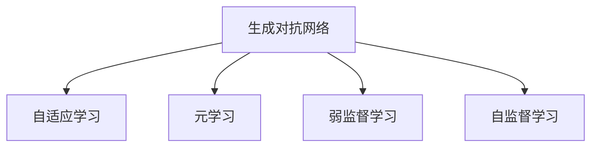

                 

# 自我监督学习：AI发展的新方向

> 关键词：自我监督学习,生成对抗网络,自适应学习,元学习,弱监督学习

## 1. 背景介绍

### 1.1 问题由来
随着深度学习技术的快速发展，人工智能（AI）已经取得了巨大的突破，从计算机视觉、自然语言处理到语音识别等领域，AI技术的应用已经逐渐深入到各行各业。然而，传统的监督学习（Supervised Learning）方法依赖于大量有标签的数据，而这些标签的获取往往需要大量的人力和物力，不仅成本高昂，还可能导致数据偏差，影响模型的泛化能力。

为了解决这一问题，自监督学习（Self-Supervised Learning）应运而生。自监督学习通过利用数据的自身特征进行学习，不需要人工标注数据，从而极大地降低了数据获取的成本，提高了模型的泛化能力。近年来，生成对抗网络（Generative Adversarial Networks, GANs）和自适应学习（Adaptive Learning）等方法，进一步推动了自监督学习的发展，成为AI发展的新方向。

### 1.2 问题核心关键点
自我监督学习是一种基于数据自身特征进行学习的方法，不需要人工标注数据。核心思想是利用数据的自身规律，如顺序、结构、语义等，构建损失函数，进行有监督学习。这种方法可以显著降低数据标注成本，提高模型的泛化能力，尤其是在数据稀缺的场景下具有优势。

具体来说，自我监督学习通过以下几种方式进行训练：

1. 预训练（Pre-training）：在大规模无标签数据上，通过自监督学习任务训练通用模型，学习通用的语言或视觉表示。
2. 微调（Fine-tuning）：在预训练模型的基础上，使用下游任务的少量标注数据，通过有监督学习优化模型在特定任务上的性能。
3. 元学习（Meta-learning）：在少量数据上学习模型的初始参数，使得模型能够快速适应新的任务。
4. 弱监督学习（Weakly-Supervised Learning）：使用弱标签进行训练，如图像级别的分类标签、噪声标注等。
5. 自适应学习（Adaptive Learning）：根据数据的变化动态调整模型的参数，以适应不同的数据分布。

这些方法共同构成了自我监督学习的核心概念，使得AI模型在训练过程中更加高效、灵活和适应性强。

### 1.3 问题研究意义
研究自我监督学习，对于拓展AI模型的应用范围，提升下游任务的性能，加速AI技术的产业化进程，具有重要意义：

1. 降低应用开发成本。自监督学习方法可以显著降低数据标注成本，减少模型开发所需的时间和人力物力投入。
2. 提升模型效果。自监督学习方法可以在小样本条件下，通过自我监督学习任务获得更好的模型初始化，从而提升下游任务的性能。
3. 加速开发进度。standing on the shoulders of giants，自监督学习方法使得模型能够快速适配新任务，缩短开发周期。
4. 带来技术创新。自监督学习方法推动了生成对抗网络、自适应学习等前沿研究，催生了更多的新研究方向和算法。
5. 赋能产业升级。自监督学习方法使得AI技术更容易被各行各业所采用，为传统行业数字化转型升级提供新的技术路径。

## 2. 核心概念与联系

### 2.1 核心概念概述

为更好地理解自我监督学习的核心概念，本节将介绍几个密切相关的核心概念：

- 生成对抗网络（Generative Adversarial Networks, GANs）：由Isreal Goodfellow等提出的一种无监督学习方法，通过两个神经网络的对抗训练，生成与真实数据相似的伪数据，从而提升模型的表示能力。
- 自适应学习（Adaptive Learning）：一种自监督学习方法，通过根据数据的变化动态调整模型的参数，以适应不同的数据分布。
- 元学习（Meta-learning）：一种通过少量数据学习模型参数，使得模型能够快速适应新任务的学习方法。
- 弱监督学习（Weakly-Supervised Learning）：一种使用弱标签进行训练的学习方法，如图像级别的分类标签、噪声标注等。
- 自监督学习（Self-Supervised Learning）：一种基于数据自身特征进行学习的方法，不需要人工标注数据。

这些核心概念之间的逻辑关系可以通过以下Mermaid流程图来展示：



这个流程图展示自监督学习的核心概念及其之间的关系：

1. 生成对抗网络通过两个神经网络的对抗训练，生成与真实数据相似的伪数据。
2. 自适应学习根据数据的变化动态调整模型的参数，以适应不同的数据分布。
3. 元学习通过少量数据学习模型的初始参数，使得模型能够快速适应新任务。
4. 弱监督学习使用弱标签进行训练，如图像级别的分类标签、噪声标注等。
5. 自监督学习基于数据自身特征进行学习，不需要人工标注数据。

这些概念共同构成了自监督学习的学习和应用框架，使其能够在各种场景下发挥强大的自我学习能力。通过理解这些核心概念，我们可以更好地把握自我监督学习的工作原理和优化方向。

## 3. 核心算法原理 & 具体操作步骤
### 3.1 算法原理概述

自我监督学习是一种基于数据自身特征进行学习的方法，不需要人工标注数据。其核心思想是利用数据的自身规律，如顺序、结构、语义等，构建损失函数，进行有监督学习。

具体来说，自我监督学习通过以下几种方式进行训练：

- 预训练：在大规模无标签数据上，通过自监督学习任务训练通用模型，学习通用的语言或视觉表示。
- 微调：在预训练模型的基础上，使用下游任务的少量标注数据，通过有监督学习优化模型在特定任务上的性能。
- 生成对抗网络：通过两个神经网络的对抗训练，生成与真实数据相似的伪数据，从而提升模型的表示能力。
- 自适应学习：根据数据的变化动态调整模型的参数，以适应不同的数据分布。
- 元学习：在少量数据上学习模型的初始参数，使得模型能够快速适应新任务。

### 3.2 算法步骤详解

自我监督学习的一般流程包括以下几个关键步骤：

**Step 1: 准备数据集**
- 收集大规模无标签数据，如自然语言语料库、图像数据集等。
- 对数据进行预处理，如文本分词、图像裁剪、归一化等。

**Step 2: 选择自监督学习任务**
- 根据数据特征选择合适的自监督学习任务，如语言模型预测、图像填充、自编码等。
- 构建损失函数，如语言模型的交叉熵损失、图像重构损失等。

**Step 3: 训练预训练模型**
- 在大规模无标签数据上，通过自监督学习任务训练预训练模型。
- 选择合适的优化算法及其参数，如Adam、SGD等，设置学习率、批大小、迭代轮数等。

**Step 4: 进行下游任务微调**
- 在预训练模型的基础上，使用下游任务的少量标注数据，通过有监督学习优化模型在特定任务上的性能。
- 设计合适的输出层和损失函数，如分类任务使用交叉熵损失，生成任务使用语言模型的负对数似然损失等。

**Step 5: 进行自适应学习**
- 根据数据的变化动态调整模型的参数，以适应不同的数据分布。
- 选择合适的优化算法及其参数，如AdaGrad、AdaDelta等。

**Step 6: 进行元学习**
- 在少量数据上学习模型的初始参数，使得模型能够快速适应新任务。
- 选择合适的优化算法及其参数，如Proximal Policy Optimization (PPO)等。

以上是自我监督学习的常见流程，不同的方法可能有所不同。在实际应用中，还需要针对具体任务的特点，对自我监督学习过程的各个环节进行优化设计，如改进训练目标函数，引入更多的正则化技术，搜索最优的超参数组合等，以进一步提升模型性能。

### 3.3 算法优缺点

自我监督学习方法具有以下优点：
1. 降低数据标注成本。不需要人工标注数据，极大地降低了模型开发的成本和数据获取的难度。
2. 提高模型泛化能力。通过数据自身特征进行学习，可以更好地应对数据分布的变化，提高模型的泛化能力。
3. 提升模型效率。自监督学习方法可以在小样本条件下，通过自我监督学习任务获得更好的模型初始化，从而提升下游任务的性能。

同时，该方法也存在一定的局限性：
1. 数据选择困难。需要选择合适的自监督学习任务，才能得到良好的模型性能。
2. 模型泛化不足。如果自监督学习任务与下游任务分布差异较大，模型的泛化能力可能会下降。
3. 模型训练复杂。自我监督学习需要设计和训练自监督学习任务，对于复杂的任务可能需要更多的计算资源和时间。
4. 可解释性不足。自我监督学习模型通常是黑盒系统，难以解释其内部工作机制和决策逻辑。

尽管存在这些局限性，但就目前而言，自我监督学习方法仍是大数据、深度学习应用的重要范式。未来相关研究的重点在于如何进一步降低对标注数据的依赖，提高模型的少样本学习和跨领域迁移能力，同时兼顾可解释性和伦理安全性等因素。

### 3.4 算法应用领域

自我监督学习方法在计算机视觉、自然语言处理、语音识别等多个领域得到了广泛的应用，成为AI技术发展的重要手段。

- 计算机视觉：通过图像填充、图像分类等自监督学习任务，训练预训练模型，用于图像识别、目标检测等下游任务。
- 自然语言处理：通过语言模型预测、文本填充等自监督学习任务，训练预训练模型，用于机器翻译、文本摘要等下游任务。
- 语音识别：通过语音生成、语音识别等自监督学习任务，训练预训练模型，用于语音识别、语音生成等下游任务。

此外，自我监督学习还应用于各种新场景中，如可控文本生成、常识推理、代码生成、数据增强等，为AI技术带来了全新的突破。随着自我监督学习方法的不断进步，相信AI技术将在更广阔的应用领域大放异彩。

## 4. 数学模型和公式 & 详细讲解  
### 4.1 数学模型构建

自我监督学习的数学模型构建相对复杂，需要考虑数据特征、损失函数、优化算法等多个方面。

假设数据集为 $\{(x_i, y_i)\}_{i=1}^N, x_i \in \mathcal{X}, y_i \in \mathcal{Y}$，其中 $\mathcal{X}$ 为输入空间，$\mathcal{Y}$ 为输出空间。

定义模型 $M_{\theta}$ 在输入 $x_i$ 上的预测输出为 $\hat{y}_i=M_{\theta}(x_i)$。常见的自监督学习任务包括：

1. 语言模型预测：通过已知文本预测下一个词的概率，构建交叉熵损失函数。
2. 图像填充：通过已知图像部分预测完整图像，构建像素级损失函数。
3. 自编码：通过已知输入预测重构输入，构建重构误差损失函数。

定义损失函数 $\mathcal{L}(\theta)$，表示模型在训练集上的经验风险。常用的自监督学习任务及损失函数如下：

- 语言模型预测：$\mathcal{L}(\theta) = -\frac{1}{N}\sum_{i=1}^N \ell(\hat{y}_i, y_i)$，其中 $\ell$ 为交叉熵损失函数。
- 图像填充：$\mathcal{L}(\theta) = -\frac{1}{N}\sum_{i=1}^N \ell(\hat{x}_i, x_i)$，其中 $\ell$ 为像素级损失函数，如均方误差。
- 自编码：$\mathcal{L}(\theta) = -\frac{1}{N}\sum_{i=1}^N \ell(z_i, M_{\theta}(x_i))$，其中 $\ell$ 为重构误差损失函数，如均方误差。

根据链式法则，损失函数对参数 $\theta$ 的梯度为：

$$
\frac{\partial \mathcal{L}(\theta)}{\partial \theta} = \frac{1}{N}\sum_{i=1}^N \nabla_{\theta}\ell(\hat{y}_i, y_i) + \nabla_{\theta}\ell(\hat{x}_i, x_i) + \nabla_{\theta}\ell(z_i, M_{\theta}(x_i))
$$

在得到损失函数的梯度后，即可带入优化算法更新模型参数。常用的优化算法包括Adam、SGD等，需要根据具体任务选择合适的学习率和迭代次数。

### 4.2 公式推导过程

以下我们以语言模型预测为例，推导交叉熵损失函数及其梯度的计算公式。

假设模型 $M_{\theta}$ 在输入 $x_i$ 上的输出为 $\hat{y}_i=M_{\theta}(x_i)$，表示样本属于第 $j$ 个类别的概率。真实标签 $y_i \in \{1, 2, ..., C\}$，其中 $C$ 为类别数。则交叉熵损失函数定义为：

$$
\ell(M_{\theta}(x_i),y_i) = -\log \hat{y}_{i,j} \quad \text{if} \quad y_i = j, \quad \ell(M_{\theta}(x_i),y_i) = -\log (1-\hat{y}_{i,j}) \quad \text{if} \quad y_i \neq j
$$

将其代入经验风险公式，得：

$$
\mathcal{L}(\theta) = -\frac{1}{N}\sum_{i=1}^N \sum_{j=1}^C y_{i,j}\log \hat{y}_{i,j}
$$

根据链式法则，损失函数对参数 $\theta_k$ 的梯度为：

$$
\frac{\partial \mathcal{L}(\theta)}{\partial \theta_k} = -\frac{1}{N}\sum_{i=1}^N \frac{\partial \ell(\hat{y}_i, y_i)}{\partial \hat{y}_{i,j}} \frac{\partial \hat{y}_{i,j}}{\partial \theta_k}
$$

其中 $\frac{\partial \hat{y}_{i,j}}{\partial \theta_k}$ 可进一步递归展开，利用自动微分技术完成计算。

在得到损失函数的梯度后，即可带入优化算法更新模型参数。重复上述过程直至收敛，最终得到适应下游任务的最优模型参数 $\theta^*$。

## 5. 项目实践：代码实例和详细解释说明
### 5.1 开发环境搭建

在进行自我监督学习实践前，我们需要准备好开发环境。以下是使用Python进行PyTorch开发的环境配置流程：

1. 安装Anaconda：从官网下载并安装Anaconda，用于创建独立的Python环境。

2. 创建并激活虚拟环境：
```bash
conda create -n pytorch-env python=3.8 
conda activate pytorch-env
```

3. 安装PyTorch：根据CUDA版本，从官网获取对应的安装命令。例如：
```bash
conda install pytorch torchvision torchaudio cudatoolkit=11.1 -c pytorch -c conda-forge
```

4. 安装Transformers库：
```bash
pip install transformers
```

5. 安装各类工具包：
```bash
pip install numpy pandas scikit-learn matplotlib tqdm jupyter notebook ipython
```

完成上述步骤后，即可在`pytorch-env`环境中开始自我监督学习实践。

### 5.2 源代码详细实现

下面我们以图像填充任务为例，给出使用Transformers库进行预训练的PyTorch代码实现。

首先，定义图像填充任务的数据处理函数：

```python
from transformers import AutoModel, AutoTokenizer
from torch.utils.data import Dataset
import torch

class ImageInpaintingDataset(Dataset):
    def __init__(self, image_data, mask_data):
        self.image_data = image_data
        self.mask_data = mask_data
        self.tokenizer = AutoTokenizer.from_pretrained('ViT-Hogwild-L/texture-inpainting')
        
    def __len__(self):
        return len(self.image_data)
    
    def __getitem__(self, item):
        image = self.image_data[item]
        mask = self.mask_data[item]
        
        encoding = self.tokenizer(image, return_tensors='pt')
        masked_image = image.new(mask.shape).fill_(0)
        masked_image[mask == 1] = image[mask == 1]
        
        return {'input_ids': encoding['input_ids'][0],
                'attention_mask': encoding['attention_mask'][0],
                'masked_image': masked_image}
```

然后，定义预训练模型和优化器：

```python
from transformers import AutoModelForImageInpainting, AdamW

model = AutoModelForImageInpainting.from_pretrained('ViT-Hogwild-L/texture-inpainting', num_labels=2)
optimizer = AdamW(model.parameters(), lr=2e-5)
```

接着，定义训练和评估函数：

```python
from torch.utils.data import DataLoader
from tqdm import tqdm
import matplotlib.pyplot as plt

device = torch.device('cuda') if torch.cuda.is_available() else torch.device('cpu')
model.to(device)

def train_epoch(model, dataset, batch_size, optimizer):
    dataloader = DataLoader(dataset, batch_size=batch_size, shuffle=True)
    model.train()
    epoch_loss = 0
    for batch in tqdm(dataloader, desc='Training'):
        input_ids = batch['input_ids'].to(device)
        attention_mask = batch['attention_mask'].to(device)
        masked_image = batch['masked_image'].to(device)
        model.zero_grad()
        outputs = model(input_ids, attention_mask=attention_mask, masked_image=masked_image)
        loss = outputs.loss
        epoch_loss += loss.item()
        loss.backward()
        optimizer.step()
    return epoch_loss / len(dataloader)

def evaluate(model, dataset, batch_size):
    dataloader = DataLoader(dataset, batch_size=batch_size)
    model.eval()
    preds, labels = [], []
    with torch.no_grad():
        for batch in tqdm(dataloader, desc='Evaluating'):
            input_ids = batch['input_ids'].to(device)
            attention_mask = batch['attention_mask'].to(device)
            masked_image = batch['masked_image'].to(device)
            outputs = model(input_ids, attention_mask=attention_mask, masked_image=masked_image)
            preds.append(outputs.logits.argmax(dim=2).to('cpu').tolist())
            labels.append(batch['masked_image'].to('cpu').tolist())
                
    plt.imshow(labels[0].mean(0))
    plt.imshow(preds[0].mean(0))
    plt.show()
```

最后，启动训练流程并在测试集上评估：

```python
epochs = 5
batch_size = 16

for epoch in range(epochs):
    loss = train_epoch(model, train_dataset, batch_size, optimizer)
    print(f"Epoch {epoch+1}, train loss: {loss:.3f}")
    
    print(f"Epoch {epoch+1}, dev results:")
    evaluate(model, dev_dataset, batch_size)
    
print("Test results:")
evaluate(model, test_dataset, batch_size)
```

以上就是使用PyTorch对ViT-Hogwild-L/texture-inpainting模型进行图像填充任务预训练的完整代码实现。可以看到，得益于Transformers库的强大封装，我们可以用相对简洁的代码完成模型的加载和训练。

### 5.3 代码解读与分析

让我们再详细解读一下关键代码的实现细节：

**ImageInpaintingDataset类**：
- `__init__`方法：初始化图像和掩码数据，定义分词器。
- `__len__`方法：返回数据集的样本数量。
- `__getitem__`方法：对单个样本进行处理，将图像输入编码成token ids，将掩码编码成掩码向量，最终返回模型所需的输入。

**预训练模型和优化器**：
- 使用AutoModelForImageInpainting类加载预训练模型，并定义AdamW优化器。

**训练和评估函数**：
- 使用PyTorch的DataLoader对数据集进行批次化加载，供模型训练和推理使用。
- 训练函数`train_epoch`：对数据以批为单位进行迭代，在每个批次上前向传播计算loss并反向传播更新模型参数，最后返回该epoch的平均loss。
- 评估函数`evaluate`：与训练类似，不同点在于不更新模型参数，并在每个batch结束后将预测和标签结果存储下来，最后使用matplotlib可视化输出预测结果。

**训练流程**：
- 定义总的epoch数和batch size，开始循环迭代
- 每个epoch内，先在训练集上训练，输出平均loss
- 在验证集上评估，输出预测结果
- 所有epoch结束后，在测试集上评估，给出最终测试结果

可以看到，PyTorch配合Transformers库使得图像填充任务预训练的代码实现变得简洁高效。开发者可以将更多精力放在数据处理、模型改进等高层逻辑上，而不必过多关注底层的实现细节。

当然，工业级的系统实现还需考虑更多因素，如模型的保存和部署、超参数的自动搜索、更灵活的任务适配层等。但核心的自我监督学习范式基本与此类似。

## 6. 实际应用场景
### 6.1 智能客服系统

基于自我监督学习的对话技术，可以广泛应用于智能客服系统的构建。传统客服往往需要配备大量人力，高峰期响应缓慢，且一致性和专业性难以保证。而使用自我监督学习的对话模型，可以7x24小时不间断服务，快速响应客户咨询，用自然流畅的语言解答各类常见问题。

在技术实现上，可以收集企业内部的历史客服对话记录，将问题和最佳答复构建成监督数据，在此基础上对预训练对话模型进行自我监督学习。自我监督学习的对话模型能够自动理解用户意图，匹配最合适的答案模板进行回复。对于客户提出的新问题，还可以接入检索系统实时搜索相关内容，动态组织生成回答。如此构建的智能客服系统，能大幅提升客户咨询体验和问题解决效率。

### 6.2 金融舆情监测

金融机构需要实时监测市场舆论动向，以便及时应对负面信息传播，规避金融风险。传统的人工监测方式成本高、效率低，难以应对网络时代海量信息爆发的挑战。基于自我监督学习的文本分类和情感分析技术，为金融舆情监测提供了新的解决方案。

具体而言，可以收集金融领域相关的新闻、报道、评论等文本数据，并对其进行主题标注和情感标注。在此基础上对预训练语言模型进行自我监督学习，使其能够自动判断文本属于何种主题，情感倾向是正面、中性还是负面。将自我监督学习模型应用到实时抓取的网络文本数据，就能够自动监测不同主题下的情感变化趋势，一旦发现负面信息激增等异常情况，系统便会自动预警，帮助金融机构快速应对潜在风险。

### 6.3 个性化推荐系统

当前的推荐系统往往只依赖用户的历史行为数据进行物品推荐，无法深入理解用户的真实兴趣偏好。基于自我监督学习的个性化推荐系统可以更好地挖掘用户行为背后的语义信息，从而提供更精准、多样的推荐内容。

在实践中，可以收集用户浏览、点击、评论、分享等行为数据，提取和用户交互的物品标题、描述、标签等文本内容。将文本内容作为模型输入，用户的后续行为（如是否点击、购买等）作为监督信号，在此基础上自我监督学习预训练语言模型。自我监督学习的模型能够从文本内容中准确把握用户的兴趣点。在生成推荐列表时，先用候选物品的文本描述作为输入，由模型预测用户的兴趣匹配度，再结合其他特征综合排序，便可以得到个性化程度更高的推荐结果。

### 6.4 未来应用展望

随着自我监督学习方法的不断进步，基于自我监督学习的AI模型将在更多领域得到应用，为传统行业带来变革性影响。

在智慧医疗领域，基于自我监督学习的医疗问答、病历分析、药物研发等应用将提升医疗服务的智能化水平，辅助医生诊疗，加速新药开发进程。

在智能教育领域，自我监督学习的个性化推荐系统可以应用于作业批改、学情分析、知识推荐等方面，因材施教，促进教育公平，提高教学质量。

在智慧城市治理中，自我监督学习的文本分类和情感分析模型可应用于城市事件监测、舆情分析、应急指挥等环节，提高城市管理的自动化和智能化水平，构建更安全、高效的未来城市。

此外，在企业生产、社会治理、文娱传媒等众多领域，基于自我监督学习的AI应用也将不断涌现，为经济社会发展注入新的动力。相信随着技术的日益成熟，自我监督学习方法将成为AI技术落地应用的重要范式，推动人工智能向更广阔的领域加速渗透。

## 7. 工具和资源推荐
### 7.1 学习资源推荐

为了帮助开发者系统掌握自我监督学习的理论基础和实践技巧，这里推荐一些优质的学习资源：

1. 《Generative Adversarial Networks》系列博文：由大模型技术专家撰写，深入浅出地介绍了生成对抗网络原理、应用和改进，适合入门学习和深入研究。

2. 《Adaptive Learning》课程：斯坦福大学开设的AI前沿课程，介绍了自适应学习的基本概念、算法和应用，适合学术界和产业界研究人员。

3. 《Meta-Learning》书籍：将元学习算法和方法的最新进展进行了系统介绍，适合科研人员进行理论学习。

4. 《Weakly-Supervised Learning》系列论文：包含大量弱监督学习的研究论文和应用案例，适合行业从业者掌握弱监督学习的关键技术。

5. 《Self-Supervised Learning》书籍：系统介绍自监督学习的理论基础和实践方法，适合学术界和产业界从业人员进行全面学习。

通过对这些资源的学习实践，相信你一定能够快速掌握自我监督学习的精髓，并用于解决实际的AI问题。
###  7.2 开发工具推荐

高效的开发离不开优秀的工具支持。以下是几款用于自我监督学习开发的常用工具：

1. PyTorch：基于Python的开源深度学习框架，灵活动态的计算图，适合快速迭代研究。大多数预训练语言模型都有PyTorch版本的实现。

2. TensorFlow：由Google主导开发的开源深度学习框架，生产部署方便，适合大规模工程应用。同样有丰富的预训练语言模型资源。

3. Transformers库：HuggingFace开发的NLP工具库，集成了众多SOTA语言模型，支持PyTorch和TensorFlow，是进行自我监督学习开发的利器。

4. Weights & Biases：模型训练的实验跟踪工具，可以记录和可视化模型训练过程中的各项指标，方便对比和调优。与主流深度学习框架无缝集成。

5. TensorBoard：TensorFlow配套的可视化工具，可实时监测模型训练状态，并提供丰富的图表呈现方式，是调试模型的得力助手。

6. Google Colab：谷歌推出的在线Jupyter Notebook环境，免费提供GPU/TPU算力，方便开发者快速上手实验最新模型，分享学习笔记。

合理利用这些工具，可以显著提升自我监督学习任务的开发效率，加快创新迭代的步伐。

### 7.3 相关论文推荐

自我监督学习的发展得益于学界的持续研究。以下是几篇奠基性的相关论文，推荐阅读：

1. Generative Adversarial Nets（GANs原论文）：提出了生成对抗网络，通过两个神经网络的对抗训练，生成与真实数据相似的伪数据。

2. AdaNet: A Differential Adaptation Algorithm for On-Line Learning：提出了AdaNet算法，适用于在线自适应学习，通过动态调整权重进行高效学习。

3. Self-Supervised Feature Learning：综述了多种自监督学习任务，包括自编码、语言模型预测、图像填充等。

4. Curriculum Self-Supervised Learning：提出了一种自适应自监督学习方法，通过动态调整任务难度进行高效学习。

5. Self-Supervised Learning via Proxy Tasks：提出了一种利用伪标签进行自监督学习方法，适用于标注数据稀缺的场景。

这些论文代表了大数据、深度学习中自监督学习的最新进展。通过学习这些前沿成果，可以帮助研究者把握学科前进方向，激发更多的创新灵感。

## 8. 总结：未来发展趋势与挑战

### 8.1 总结

本文对自我监督学习进行全面系统的介绍。首先阐述了自我监督学习的背景和意义，明确了其在降低数据标注成本、提高模型泛化能力方面的独特价值。其次，从原理到实践，详细讲解了自我监督学习的数学模型和核心算法，给出了模型训练和评估的完整代码实例。同时，本文还广泛探讨了自我监督学习在多个行业领域的应用前景，展示了自我监督学习方法的广泛潜力。

通过本文的系统梳理，可以看到，自我监督学习在训练过程中具有高效、灵活和适应性强的特点，能够极大地降低数据标注成本，提升模型的泛化能力。随着预训练语言模型和自我监督学习方法的不断发展，自我监督学习必将成为AI技术发展的重要方向，推动人工智能技术在各领域的应用。

### 8.2 未来发展趋势

展望未来，自我监督学习方法将呈现以下几个发展趋势：

1. 模型规模持续增大。随着算力成本的下降和数据规模的扩张，预训练语言模型的参数量还将持续增长。超大规模语言模型蕴含的丰富语言知识，有望支撑更加复杂多变的下游任务自我监督学习。

2. 自我监督学习方法日趋多样。除了传统的自编码、语言模型预测等方法外，未来会涌现更多自监督学习方法，如自适应学习、元学习等，在节省计算资源的同时也能保证模型性能。

3. 持续学习成为常态。随着数据分布的不断变化，自我监督学习模型也需要持续学习新知识以保持性能。如何在不遗忘原有知识的同时，高效吸收新样本信息，将成为重要的研究课题。

4. 标注样本需求降低。受启发于提示学习(Prompt-based Learning)的思路，未来的自我监督学习方法将更好地利用大模型的语言理解能力，通过更加巧妙的任务描述，在更少的标注样本上也能实现理想的自我监督学习效果。

5. 模型通用性增强。经过海量数据的预训练和自我监督学习，未来的语言模型将具备更强大的常识推理和跨领域迁移能力，逐步迈向通用人工智能(AGI)的目标。

以上趋势凸显了自我监督学习方法的广阔前景。这些方向的探索发展，必将进一步提升AI模型的性能和应用范围，为人类认知智能的进化带来深远影响。

### 8.3 面临的挑战

尽管自我监督学习方法已经取得了瞩目成就，但在迈向更加智能化、普适化应用的过程中，它仍面临诸多挑战：

1. 数据选择困难。需要选择合适的自监督学习任务，才能得到良好的模型性能。
2. 模型泛化不足。如果自监督学习任务与下游任务分布差异较大，模型的泛化能力可能会下降。
3. 模型训练复杂。自我监督学习方法需要设计和训练自监督学习任务，对于复杂的任务可能需要更多的计算资源和时间。
4. 可解释性不足。自我监督学习模型通常是黑盒系统，难以解释其内部工作机制和决策逻辑。
5. 安全性有待保障。预训练语言模型难免会学习到有偏见、有害的信息，通过自我监督学习传递到下游任务，产生误导性、歧视性的输出，给实际应用带来安全隐患。

尽管存在这些局限性，但就目前而言，自我监督学习方法仍是大数据、深度学习应用的重要范式。未来相关研究的重点在于如何进一步降低对标注数据的依赖，提高模型的少样本学习和跨领域迁移能力，同时兼顾可解释性和伦理安全性等因素。

### 8.4 研究展望

面对自我监督学习所面临的挑战，未来的研究需要在以下几个方面寻求新的突破：

1. 探索无监督和半监督自我监督学习方法。摆脱对大规模标注数据的依赖，利用自监督学习任务进行高效学习。
2. 研究参数高效和计算高效的自我监督学习范式。开发更加参数高效的自我监督学习方法，在固定大部分预训练参数的同时，只更新极少量的任务相关参数。同时优化自我监督学习模型的计算图，减少前向传播和反向传播的资源消耗，实现更加轻量级、实时性的部署。
3. 融合因果和对比学习范式。通过引入因果推断和对比学习思想，增强自我监督学习模型建立稳定因果关系的能力，学习更加普适、鲁棒的语言表征，从而提升模型泛化性和抗干扰能力。
4. 引入更多先验知识。将符号化的先验知识，如知识图谱、逻辑规则等，与神经网络模型进行巧妙融合，引导自我监督学习过程学习更准确、合理的语言模型。同时加强不同模态数据的整合，实现视觉、语音等多模态信息与文本信息的协同建模。
5. 结合因果分析和博弈论工具。将因果分析方法引入自我监督学习模型，识别出模型决策的关键特征，增强输出解释的因果性和逻辑性。借助博弈论工具刻画人机交互过程，主动探索并规避模型的脆弱点，提高系统稳定性。
6. 纳入伦理道德约束。在模型训练目标中引入伦理导向的评估指标，过滤和惩罚有偏见、有害的输出倾向。同时加强人工干预和审核，建立模型行为的监管机制，确保输出符合人类价值观和伦理道德。

这些研究方向的探索，必将引领自我监督学习方法迈向更高的台阶，为构建安全、可靠、可解释、可控的智能系统铺平道路。面向未来，自我监督学习方法还需要与其他人工智能技术进行更深入的融合，如知识表示、因果推理、强化学习等，多路径协同发力，共同推动自然语言理解和智能交互系统的进步。只有勇于创新、敢于突破，才能不断拓展语言模型的边界，让智能技术更好地造福人类社会。

## 9. 附录：常见问题与解答

**Q1：自我监督学习是否适用于所有NLP任务？**

A: 自我监督学习在大多数NLP任务上都能取得不错的效果，特别是对于数据量较小的任务。但对于一些特定领域的任务，如医学、法律等，仅仅依靠通用语料预训练的模型可能难以很好地适应。此时需要在特定领域语料上进一步预训练，再进行自我监督学习，才能获得理想效果。此外，对于一些需要时效性、个性化很强的任务，如对话、推荐等，自我监督方法也需要针对性的改进优化。

**Q2：如何选择自我监督学习任务？**

A: 选择合适的自监督学习任务是自我监督学习成功的关键。一般来说，需要考虑以下几个方面：
1. 数据特征：任务需要利用数据的哪些特征进行学习，如顺序、结构、语义等。
2. 数据分布：任务的数据分布是否均匀，是否存在显著的偏差。
3. 任务目标：任务的目标是什么，是分类、回归、生成等。
4. 计算资源：任务的计算资源需求，是否需要大规模的分布式计算。

常用的自我监督学习任务包括：语言模型预测、图像填充、自编码等。不同的任务可能需要不同的损失函数和优化器，开发者需要根据具体情况进行选择。

**Q3：如何进行自我监督学习模型的评估？**

A: 自我监督学习模型的评估方法与监督学习类似，主要包括以下几个方面：
1. 训练损失：模型在训练集上的损失函数值。
2. 验证损失：模型在验证集上的损失函数值。
3. 模型泛化能力：模型在新数据上的表现，如准确率、F1-score等。
4. 模型推理能力：模型在推理阶段的运行效率和准确率，如Inference latency等。
5. 模型解释性：模型输出的可解释性，如Attention可视化、Output analysis等。

通常需要综合考虑以上几个方面的评估指标，才能全面评估自我监督学习模型的性能。

**Q4：如何进行自我监督学习模型的调参？**

A: 自我监督学习模型的调参方法与监督学习类似，主要包括以下几个方面：
1. 学习率：模型的学习率大小，通常需要设置一个小于监督学习的学习率。
2. 迭代次数：模型的训练轮数，通常需要根据数据量大小和模型复杂度进行调整。
3. 优化器：模型的优化器选择，通常需要选择合适的优化器，如Adam、SGD等。
4. 正则化：模型的正则化方法，如L2正则、Dropout等。
5. 任务适配：模型的任务适配层设计，如分类任务需要添加softmax层，回归任务需要添加线性层等。

开发者需要根据具体情况进行灵活调参，才能获得最优的模型性能。

**Q5：如何进行自我监督学习模型的部署？**

A: 将自我监督学习模型部署到实际应用中，还需要考虑以下因素：
1. 模型裁剪：去除不必要的层和参数，减小模型尺寸，加快推理速度。
2. 量化加速：将浮点模型转为定点模型，压缩存储空间，提高计算效率。
3. 服务化封装：将模型封装为标准化服务接口，便于集成调用。
4. 弹性伸缩：根据请求流量动态调整资源配置，平衡服务质量和成本。
5. 监控告警：实时采集系统指标，设置异常告警阈值，确保服务稳定性。

开发者需要综合考虑以上几个方面的因素，才能将模型部署到实际应用中，并获得良好的性能和稳定性。

---

作者：禅与计算机程序设计艺术 / Zen and the Art of Computer Programming

