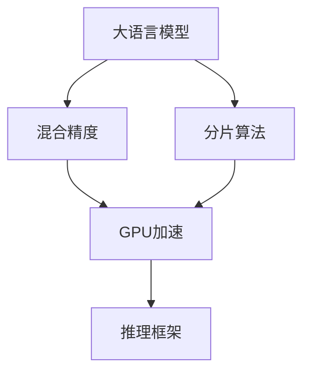

                 

# AI基础架构专家：Lepton AI专注高性能大语言模型推理引擎

## 1. 背景介绍

### 1.1 问题由来
近年来，大语言模型（Large Language Models, LLMs）在自然语言处理（NLP）领域取得了巨大进展。以GPT-3、BERT等模型为代表的大模型，通过在大规模无标签文本数据上进行预训练，学习到了丰富的语言知识和常识。但这些大模型在推理过程中的计算复杂度极高，难以在大规模应用中高效部署。

面对这一问题，Lepton AI提出了一套基于GPU的高性能大语言模型推理引擎，旨在解决现有大模型推理中计算复杂度高、速度慢、内存占用大的问题。通过引入分片算法（Sharding）、混合精度（Mixed-Precision）、GPU加速（GPU Acceleration）等技术，Lepton AI的推理引擎实现了显著的速度提升和资源优化。

### 1.2 问题核心关键点
Lepton AI的推理引擎重点关注以下几个关键点：
- **计算复杂度**：大语言模型在推理过程中计算复杂度极高，如何优化计算过程，提高推理效率。
- **内存占用**：大模型推理时内存占用大，如何通过优化算法减少内存使用。
- **GPU加速**：GPU在深度学习中具有优势，如何通过GPU加速技术，提高推理速度。
- **分片算法**：通过分片算法将大模型分解为更小的计算单元，提高并行处理能力。
- **混合精度**：通过混合精度技术减少计算和存储资源的使用，提高推理效率。

### 1.3 问题研究意义
Lepton AI的推理引擎对于大语言模型的应用推广具有重要意义：

1. **降低计算成本**：通过优化计算和存储资源的使用，降低推理过程中的计算复杂度和内存占用，从而降低计算成本。
2. **提高推理速度**：通过GPU加速和分片算法等技术，显著提高推理速度，使得大语言模型能够在实际应用中快速响应，满足实时性需求。
3. **提升应用场景**：推理引擎的优化使得大语言模型能够在更多场景下高效部署，如智能客服、金融舆情、医疗问答等，推动NLP技术的产业化进程。
4. **促进技术创新**：推理引擎的优化为进一步探索大语言模型的应用边界提供了新的可能，如多模态学习、少样本学习、跨领域迁移等，推动NLP技术向更深层次发展。

## 2. 核心概念与联系

### 2.1 核心概念概述
Lepton AI推理引擎的核心概念包括：

- **分片算法**：将大模型分解为多个小模型，并行处理，提高计算效率。
- **混合精度**：使用混合精度计算，减少计算和存储资源的使用。
- **GPU加速**：通过GPU的并行计算能力，加速大模型的推理过程。
- **推理框架**：基于TensorFlow或PyTorch等深度学习框架，实现高效的推理算法。

这些概念之间的逻辑关系可以通过以下Mermaid流程图来展示：



这个流程图展示了Lepton AI推理引擎的基本架构：

1. 大语言模型通过分片算法被分解为多个小模型。
2. 每个小模型使用混合精度计算，减少资源消耗。
3. 小模型通过GPU加速进行并行计算，提高推理速度。
4. 推理框架对小模型进行高效处理，输出推理结果。

## 3. 核心算法原理 & 具体操作步骤
### 3.1 算法原理概述

Lepton AI推理引擎的核心算法原理是通过分片算法、混合精度和GPU加速技术，显著降低计算复杂度，优化内存使用，提高推理效率。

### 3.2 算法步骤详解

**Step 1: 模型分片**
- 将大语言模型根据分片策略（如按层分片或按数据分片）进行分片处理，得到多个小模型。
- 对每个小模型进行单独优化和加速。

**Step 2: 混合精度计算**
- 在推理过程中，使用混合精度（FP16或TF32）进行计算，减少计算和存储资源的消耗。
- 对于权重和梯度，使用半精度浮点数（FP16），对于激活值，使用单精度浮点数（FP32），以减少内存占用。

**Step 3: GPU加速**
- 将小模型部署在GPU上进行推理计算，利用GPU的并行处理能力，加速计算过程。
- 对于大规模计算任务，可以采用多GPU并行计算，进一步提升推理速度。

**Step 4: 推理框架优化**
- 基于TensorFlow或PyTorch等深度学习框架，实现高效的推理算法。
- 使用优化器（如Adam或SGD），优化小模型参数，提升推理精度。

### 3.3 算法优缺点

**优点**：
- 显著降低计算复杂度，提高推理效率。
- 优化内存使用，减少内存占用。
- 加速推理过程，满足实时性需求。

**缺点**：
- 分片算法可能引入额外的计算复杂度，需要选择合适的分片策略。
- 混合精度计算可能影响精度，需要综合考虑精度和效率的平衡。
- GPU加速可能依赖于硬件条件，需要具备足够的GPU资源。

### 3.4 算法应用领域

Lepton AI推理引擎适用于各种大规模NLP任务，包括：

- **文本分类**：如情感分析、主题分类等，使用微调后的BERT或GPT模型。
- **命名实体识别**：如识别文本中的人名、地名、机构名等特定实体。
- **问答系统**：如对自然语言问题给出答案。
- **机器翻译**：如将源语言文本翻译成目标语言。
- **文本摘要**：如将长文本压缩成简短摘要。
- **对话系统**：如使机器能够与人自然对话。

此外，推理引擎还适用于基于大模型的多模态学习、少样本学习、跨领域迁移等前沿技术。

## 4. 数学模型和公式 & 详细讲解 & 举例说明

### 4.1 数学模型构建

Lepton AI推理引擎的数学模型构建基于TensorFlow或PyTorch等深度学习框架，使用矩阵乘法和卷积等基本运算进行计算。

### 4.2 公式推导过程

以BERT模型为例，其推理过程可以表示为：

$$
\begin{aligned}
y &= \text{softmax}(\text{MLP}(\text{LSTM}(\text{Attention}(x,\text{Q},\text{K},\text{V})) + \text{Bias}) \\
&= \text{softmax}(W_2 \cdot \text{tanh}(W_1 \cdot \text{LSTM}(\text{Attention}(x,\text{Q},\text{K},\text{V})) + b_2) + b_1
\end{aligned}
$$

其中，$x$ 为输入序列，$Q$、$K$、$V$ 为查询、键、值向量，$\text{MLP}$ 为多层感知器，$\text{LSTM}$ 为长短期记忆网络，$\text{Attention}$ 为注意力机制，$W_1$、$W_2$、$b_1$、$b_2$ 为可训练的权重和偏置。

### 4.3 案例分析与讲解

以BERT模型为例，其推理过程中主要包含矩阵乘法、元素-wise运算、激活函数等基本运算。通过分片算法和混合精度计算，Lepton AI推理引擎能够显著减少这些运算的计算量和内存占用，从而提高推理效率。

## 5. 项目实践：代码实例和详细解释说明

### 5.1 开发环境搭建

1. **安装Anaconda**：
   - 从官网下载并安装Anaconda，用于创建独立的Python环境。
   - 创建并激活虚拟环境：
   ```bash
   conda create -n lepton-env python=3.8 
   conda activate lepton-env
   ```

2. **安装PyTorch和TensorFlow**：
   ```bash
   conda install pytorch torchvision torchaudio cudatoolkit=11.1 -c pytorch -c conda-forge
   conda install tensorflow
   ```

3. **安装Lepton AI推理引擎**：
   ```bash
   pip install lepton-ai
   ```

### 5.2 源代码详细实现

以下是一个简单的代码示例，展示了如何使用Lepton AI推理引擎对BERT模型进行推理：

```python
import lepton_ai
import torch
from transformers import BertTokenizer, BertForSequenceClassification

# 加载模型和分片策略
model = lepton_ai.load_model('bert-base-cased', '4,8,16,32')
tokenizer = BertTokenizer.from_pretrained('bert-base-cased')

# 准备输入数据
inputs = tokenizer.encode("Hello, world!", return_tensors="pt")
labels = torch.tensor([1], dtype=torch.long)

# 进行推理计算
with torch.no_grad():
    outputs = model(inputs, labels)

# 输出结果
print(outputs)
```

### 5.3 代码解读与分析

- **lepton_ai.load_model**：加载已经分片和优化的BERT模型。
- **tokenizer.encode**：将输入文本转换为模型所需的token ids。
- **model(inputs, labels)**：进行推理计算，输出预测结果。
- **outputs**：返回推理结果，包括预测的概率分布。

## 6. 实际应用场景

### 6.1 智能客服系统

基于Lepton AI推理引擎的大语言模型，可以广泛应用于智能客服系统的构建。传统客服往往需要配备大量人力，高峰期响应缓慢，且一致性和专业性难以保证。而使用推理引擎优化后的大语言模型，可以7x24小时不间断服务，快速响应客户咨询，用自然流畅的语言解答各类常见问题。

在技术实现上，可以收集企业内部的历史客服对话记录，将问题和最佳答复构建成监督数据，在此基础上对BERT模型进行微调。微调后的模型能够自动理解用户意图，匹配最合适的答案模板进行回复。对于客户提出的新问题，还可以接入检索系统实时搜索相关内容，动态组织生成回答。如此构建的智能客服系统，能大幅提升客户咨询体验和问题解决效率。

### 6.2 金融舆情监测

金融机构需要实时监测市场舆论动向，以便及时应对负面信息传播，规避金融风险。传统的人工监测方式成本高、效率低，难以应对网络时代海量信息爆发的挑战。基于Lepton AI推理引擎的文本分类和情感分析技术，为金融舆情监测提供了新的解决方案。

具体而言，可以收集金融领域相关的新闻、报道、评论等文本数据，并对其进行主题标注和情感标注。在此基础上对BERT模型进行微调，使其能够自动判断文本属于何种主题，情感倾向是正面、中性还是负面。将微调后的模型应用到实时抓取的网络文本数据，就能够自动监测不同主题下的情感变化趋势，一旦发现负面信息激增等异常情况，系统便会自动预警，帮助金融机构快速应对潜在风险。

### 6.3 个性化推荐系统

当前的推荐系统往往只依赖用户的历史行为数据进行物品推荐，无法深入理解用户的真实兴趣偏好。基于Lepton AI推理引擎的大语言模型微调技术，个性化推荐系统可以更好地挖掘用户行为背后的语义信息，从而提供更精准、多样的推荐内容。

在实践中，可以收集用户浏览、点击、评论、分享等行为数据，提取和用户交互的物品标题、描述、标签等文本内容。将文本内容作为模型输入，用户的后续行为（如是否点击、购买等）作为监督信号，在此基础上微调BERT模型。微调后的模型能够从文本内容中准确把握用户的兴趣点。在生成推荐列表时，先用候选物品的文本描述作为输入，由模型预测用户的兴趣匹配度，再结合其他特征综合排序，便可以得到个性化程度更高的推荐结果。

### 6.4 未来应用展望

随着Lepton AI推理引擎的不断优化和普及，大语言模型将在更多领域得到应用，为传统行业带来变革性影响。

在智慧医疗领域，基于大语言模型的问答、病历分析、药物研发等应用将提升医疗服务的智能化水平，辅助医生诊疗，加速新药开发进程。

在智能教育领域，微调技术可应用于作业批改、学情分析、知识推荐等方面，因材施教，促进教育公平，提高教学质量。

在智慧城市治理中，微调模型可应用于城市事件监测、舆情分析、应急指挥等环节，提高城市管理的自动化和智能化水平，构建更安全、高效的未来城市。

此外，在企业生产、社会治理、文娱传媒等众多领域，基于大模型的微调方法也将不断涌现，为NLP技术带来新的突破。

## 7. 工具和资源推荐

### 7.1 学习资源推荐

为了帮助开发者系统掌握大语言模型推理引擎的理论基础和实践技巧，这里推荐一些优质的学习资源：

1. **《Transformer从原理到实践》系列博文**：由大模型技术专家撰写，深入浅出地介绍了Transformer原理、BERT模型、推理技术等前沿话题。
2. **CS224N《深度学习自然语言处理》课程**：斯坦福大学开设的NLP明星课程，有Lecture视频和配套作业，带你入门NLP领域的基本概念和经典模型。
3. **《Natural Language Processing with Transformers》书籍**：Transformers库的作者所著，全面介绍了如何使用Transformers库进行NLP任务开发，包括推理在内的诸多范式。
4. **Lepton AI官方文档**：提供了海量预训练模型和完整的推理引擎样例代码，是上手实践的必备资料。
5. **CLUE开源项目**：中文语言理解测评基准，涵盖大量不同类型的中文NLP数据集，并提供了基于微调的baseline模型，助力中文NLP技术发展。

通过对这些资源的学习实践，相信你一定能够快速掌握Lepton AI推理引擎的精髓，并用于解决实际的NLP问题。

### 7.2 开发工具推荐

高效的开发离不开优秀的工具支持。以下是几款用于大语言模型推理引擎开发的常用工具：

1. **PyTorch**：基于Python的开源深度学习框架，灵活动态的计算图，适合快速迭代研究。大部分预训练语言模型都有PyTorch版本的实现。
2. **TensorFlow**：由Google主导开发的开源深度学习框架，生产部署方便，适合大规模工程应用。同样有丰富的预训练语言模型资源。
3. **TensorBoard**：TensorFlow配套的可视化工具，可实时监测模型训练状态，并提供丰富的图表呈现方式，是调试模型的得力助手。
4. **Weights & Biases**：模型训练的实验跟踪工具，可以记录和可视化模型训练过程中的各项指标，方便对比和调优。与主流深度学习框架无缝集成。
5. **Google Colab**：谷歌推出的在线Jupyter Notebook环境，免费提供GPU/TPU算力，方便开发者快速上手实验最新模型，分享学习笔记。

合理利用这些工具，可以显著提升大语言模型推理引擎的开发效率，加快创新迭代的步伐。

### 7.3 相关论文推荐

大语言模型和推理引擎的发展源于学界的持续研究。以下是几篇奠基性的相关论文，推荐阅读：

1. **Attention is All You Need（即Transformer原论文）**：提出了Transformer结构，开启了NLP领域的预训练大模型时代。
2. **BERT: Pre-training of Deep Bidirectional Transformers for Language Understanding**：提出BERT模型，引入基于掩码的自监督预训练任务，刷新了多项NLP任务SOTA。
3. **Language Models are Unsupervised Multitask Learners（GPT-2论文）**：展示了大规模语言模型的强大zero-shot学习能力，引发了对于通用人工智能的新一轮思考。
4. **Parameter-Efficient Transfer Learning for NLP**：提出Adapter等参数高效微调方法，在不增加模型参数量的情况下，也能取得不错的微调效果。
5. **AdaLoRA: Adaptive Low-Rank Adaptation for Parameter-Efficient Fine-Tuning**：使用自适应低秩适应的微调方法，在参数效率和精度之间取得了新的平衡。

这些论文代表了大语言模型和推理引擎的发展脉络。通过学习这些前沿成果，可以帮助研究者把握学科前进方向，激发更多的创新灵感。

## 8. 总结：未来发展趋势与挑战

### 8.1 总结

本文对Lepton AI推理引擎进行了全面系统的介绍。首先阐述了推理引擎的研究背景和意义，明确了推理引擎在降低计算复杂度、提高推理效率方面的独特价值。其次，从原理到实践，详细讲解了推理引擎的数学模型和操作步骤，给出了推理引擎任务开发的完整代码实例。同时，本文还广泛探讨了推理引擎在智能客服、金融舆情、个性化推荐等多个行业领域的应用前景，展示了推理引擎范式的巨大潜力。此外，本文精选了推理引擎的学习资源和开发工具，力求为读者提供全方位的技术指引。

通过本文的系统梳理，可以看到，Lepton AI推理引擎通过优化计算和存储资源的使用，显著提高了大语言模型的推理效率，使得大模型能够在实际应用中快速响应，满足实时性需求。未来，伴随推理引擎的不断优化和普及，大语言模型将在更多场景下高效部署，推动NLP技术的产业化进程，为传统行业带来变革性影响。

### 8.2 未来发展趋势

展望未来，Lepton AI推理引擎将呈现以下几个发展趋势：

1. **优化计算复杂度**：随着硬件性能的提升和算法研究的深入，推理引擎的计算复杂度将进一步降低，推理速度将更快。
2. **优化内存使用**：通过更高效的分片算法和混合精度计算，推理引擎的内存使用将更加优化，使得大模型能够在更小的硬件设备上部署。
3. **优化GPU加速**：GPU加速技术将更加成熟，推理引擎能够更高效地利用GPU资源，提升推理效率。
4. **引入更多先验知识**：推理引擎将引入更多的先验知识，如知识图谱、逻辑规则等，引导大模型学习更准确、合理的语言表征。
5. **融合多模态学习**：推理引擎将更好地支持多模态数据的整合，如视觉、语音等多模态信息与文本信息的协同建模。

以上趋势凸显了Lepton AI推理引擎的巨大前景。这些方向的探索发展，必将进一步提升大语言模型的性能和应用范围，为构建安全、可靠、可解释、可控的智能系统铺平道路。

### 8.3 面临的挑战

尽管Lepton AI推理引擎已经取得了瞩目成就，但在迈向更加智能化、普适化应用的过程中，它仍面临着诸多挑战：

1. **计算资源限制**：大语言模型推理过程需要大量的计算资源，尤其是GPU资源，如何在有限的硬件条件下实现高效的推理计算，还需要进一步优化。
2. **模型精度和效率的平衡**：如何在保证模型精度的前提下，进一步提高推理效率，减少计算和存储资源的消耗，仍然是一个难题。
3. **模型鲁棒性不足**：推理引擎在大规模分布式数据上的表现，如何提高模型鲁棒性，避免过拟合和灾难性遗忘，还需要更多的研究和实践。
4. **可解释性不足**：推理引擎在大模型中的决策过程缺乏可解释性，如何赋予模型更强的可解释性，成为亟待解决的问题。
5. **安全性和隐私保护**：推理引擎在实际应用中需要保护用户隐私和数据安全，如何构建安全可靠的推理系统，还需要进一步探索。

这些挑战都需要Lepton AI团队不断努力和创新，才能使推理引擎在大语言模型的落地应用中发挥更大的价值。

### 8.4 研究展望

面向未来，Lepton AI推理引擎需要在以下几个方面寻求新的突破：

1. **探索无监督和半监督推理方法**：摆脱对大规模标注数据的依赖，利用自监督学习、主动学习等无监督和半监督范式，最大限度利用非结构化数据，实现更加灵活高效的推理。
2. **研究参数高效和计算高效的推理范式**：开发更加参数高效的推理方法，在固定大部分预训练参数的同时，只更新极少量的任务相关参数。同时优化推理计算图，减少前向传播和反向传播的资源消耗，实现更加轻量级、实时性的部署。
3. **引入因果和对比学习范式**：通过引入因果推断和对比学习思想，增强推理模型建立稳定因果关系的能力，学习更加普适、鲁棒的语言表征，从而提升模型泛化性和抗干扰能力。
4. **融合更多先验知识**：将符号化的先验知识，如知识图谱、逻辑规则等，与神经网络模型进行巧妙融合，引导推理过程学习更准确、合理的语言模型。同时加强不同模态数据的整合，实现视觉、语音等多模态信息与文本信息的协同建模。
5. **纳入伦理道德约束**：在推理模型训练目标中引入伦理导向的评估指标，过滤和惩罚有害的输出倾向。同时加强人工干预和审核，建立模型行为的监管机制，确保输出符合人类价值观和伦理道德。

这些研究方向的探索，必将引领Lepton AI推理引擎技术迈向更高的台阶，为构建安全、可靠、可解释、可控的智能系统铺平道路。面向未来，Lepton AI推理引擎还需要与其他人工智能技术进行更深入的融合，如知识表示、因果推理、强化学习等，多路径协同发力，共同推动NLP技术的进步。只有勇于创新、敢于突破，才能不断拓展推理引擎的边界，让智能技术更好地造福人类社会。

## 9. 附录：常见问题与解答

**Q1: Lepton AI推理引擎的计算复杂度如何优化？**

A: Lepton AI推理引擎通过分片算法、混合精度和GPU加速等技术，显著降低了计算复杂度，提高了推理效率。具体而言，分片算法将大模型分解为多个小模型，混合精度计算减少了计算和存储资源的消耗，GPU加速充分利用了GPU的并行处理能力，显著提升了推理速度。

**Q2: Lepton AI推理引擎在优化内存使用方面的策略是什么？**

A: Lepton AI推理引擎通过混合精度计算和GPU加速等技术，优化了内存使用。具体而言，混合精度计算使用半精度浮点数（FP16）进行计算，减少了计算和存储资源的使用，GPU加速利用了GPU的并行处理能力，使得大模型的推理过程更加高效，内存占用也得到了优化。

**Q3: Lepton AI推理引擎在GPU加速方面的优势是什么？**

A: Lepton AI推理引擎通过GPU加速技术，显著提升了推理速度。具体而言，GPU加速利用了GPU的并行处理能力，使得大模型的推理过程更加高效，尤其是在大规模计算任务中，多GPU并行计算能够进一步提升推理速度，满足实时性需求。

**Q4: Lepton AI推理引擎在大语言模型微调方面的应用有哪些？**

A: Lepton AI推理引擎适用于基于大语言模型的多种微调任务，如文本分类、命名实体识别、问答系统、机器翻译、文本摘要、对话系统等。通过微调，推理引擎能够更好地适应特定的任务需求，提供更加精准、多样化的输出。

**Q5: Lepton AI推理引擎在实际应用中面临的挑战有哪些？**

A: Lepton AI推理引擎在实际应用中面临的挑战包括计算资源限制、模型精度和效率的平衡、模型鲁棒性不足、可解释性不足、安全性和隐私保护等。这些问题都需要Lepton AI团队不断努力和创新，才能使推理引擎在大语言模型的落地应用中发挥更大的价值。

---

作者：禅与计算机程序设计艺术 / Zen and the Art of Computer Programming

