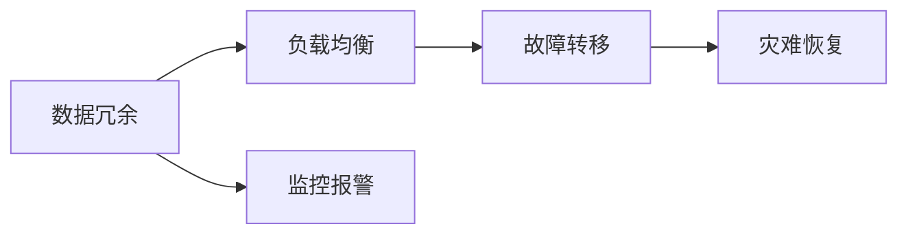

                 

# AI基础设施的高可用性：Lepton AI的容错设计

> 关键词：高可用性, 容错设计, Lepton AI, AI基础设施, 分布式系统

## 1. 背景介绍

在现代社会，人工智能（AI）技术的深度应用已变得密不可分。AI技术不仅在各行各业中起着核心作用，更是推动社会进步的关键动力。然而，AI技术的成功离不开强大而可靠的基础设施支撑。特别是对于大规模AI系统，基础设施的高可用性（High Availability, HA）设计至关重要，这直接关系到AI系统能否在实际应用中稳定运行、高效率地处理复杂任务。

### 1.1 问题由来

AI基础设施的高可用性涉及硬件、软件、数据和网络等各方面的综合设计。当前，许多AI应用依赖于大数据集群、分布式计算框架和云端存储服务。这些基础设施需要通过合理的设计和高效的管理，保障在各种异常情况下系统的正常运行。在实际应用中，AI基础设施的可靠性问题常常会导致系统崩溃、数据丢失和业务中断，给企业带来巨大的经济损失。

### 1.2 问题核心关键点

为了确保AI基础设施的高可用性，需要综合考虑以下几个关键点：

- **冗余设计**：通过硬件或软件冗余，防止单点故障，确保系统的容错能力。
- **故障转移**：在系统发生故障时，快速切换到备份系统，保障服务不中断。
- **监控与报警**：实时监控系统运行状态，快速发现并响应异常，防止问题扩大。
- **灾难恢复**：在系统遭受灾难性故障时，能够快速恢复服务，确保业务连续性。

本文将从Lepton AI的容错设计出发，探讨高可用性在AI基础设施中的实现方法，并通过系统分析和具体案例，提供实用的技术指导。

## 2. 核心概念与联系

### 2.1 核心概念概述

为更好地理解AI基础设施的高可用性设计，本节将介绍几个关键概念及其相互联系。

- **高可用性（High Availability, HA）**：指系统在规定时间内能够正常运行的能力，通常用“9\*”表示，如“9\*99%”意味着系统每年最多只能有0.01%的宕机时间。

- **冗余（Redundancy）**：通过配置多个组件，在其中一个组件故障时，可以由其他组件接替其功能，从而保障系统的连续运行。

- **故障转移（Failover）**：当某个组件出现故障时，自动切换到备用组件，确保系统的正常运行。

- **监控与报警（Monitoring and Alerting）**：通过实时监控系统状态，及时发现并响应故障，防止问题进一步扩大。

- **灾难恢复（Disaster Recovery, DR）**：在系统遭受灾难性故障时，能够快速恢复关键服务，最小化业务中断影响。

这些概念共同构成了AI基础设施高可用性的核心框架，通过合理的设计和配置，可以大大提高系统的稳定性和可靠性。

### 2.2 核心概念原理和架构的 Mermaid 流程图



这个流程图展示了AI基础设施高可用性的核心流程：数据冗余提供基础保障，负载均衡实现流畅负载，故障转移保证服务连续，监控报警实时响应，灾难恢复快速恢复。

## 3. 核心算法原理 & 具体操作步骤

### 3.1 算法原理概述

AI基础设施的高可用性设计，本质上是通过冗余、故障转移、监控报警和灾难恢复等机制，构建一套完整的系统保障体系。其核心算法原理包括：

- **冗余算法**：通过在系统中配置冗余组件，确保系统在单一故障下仍能继续运行。
- **故障转移算法**：当故障发生时，通过智能决策将负载转移到健康组件，保障系统服务连续性。
- **监控与报警算法**：通过实时监控系统运行状态，及时发现异常，采取快速响应措施。
- **灾难恢复算法**：在系统发生灾难性故障时，通过备份数据和恢复机制，快速恢复系统服务。

### 3.2 算法步骤详解

以下是高可用性设计的基本操作步骤：

**Step 1: 设计冗余结构**
- 在硬件层面，如服务器、存储设备等，配置冗余电源和网络接口，确保单点故障下系统的连续运行。
- 在软件层面，如数据库、应用服务等，配置冗余服务器，通过主备或主动复制等方式实现数据同步。

**Step 2: 实现故障转移**
- 在系统设计中，预先配置故障转移策略，当某一组件（如数据库、负载均衡器等）故障时，自动切换到备份组件。
- 常见的故障转移策略包括主备模式、主动复制模式等，需根据具体场景选择合适的策略。

**Step 3: 监控与报警**
- 部署监控工具，实时监控系统运行状态，包括CPU、内存、磁盘、网络等指标。
- 设定告警阈值，当系统指标超出正常范围时，自动触发告警，通知运维人员进行排查和处理。

**Step 4: 灾难恢复**
- 制定灾难恢复计划，包括数据备份、恢复脚本、恢复流程等，确保在系统遭受灾难性故障时，能够快速恢复关键服务。
- 定期进行灾难恢复演练，测试恢复流程和数据的完整性，确保灾难发生时能够有效应对。

### 3.3 算法优缺点

**优点：**
- **提高系统可靠性**：通过冗余和故障转移机制，系统在单点故障下仍能稳定运行。
- **减少业务中断**：实时监控和告警机制能够快速响应异常，最小化业务中断时间。
- **增强故障恢复能力**：灾难恢复计划和演练确保在系统遭受重大故障时，能够快速恢复服务。

**缺点：**
- **成本较高**：冗余和故障转移机制的配置需要额外的硬件和软件投入。
- **复杂性增加**：高可用性设计需要系统架构的复杂性增加，可能影响系统的灵活性和扩展性。
- **维护难度大**：高可用性系统的运维和监控需要更加精细化的管理，增加维护难度。

### 3.4 算法应用领域

高可用性设计在AI基础设施中具有广泛的应用前景，尤其是在以下领域：

- **云计算平台**：云服务提供商通过高可用性设计，保障云计算服务的稳定性和可靠性。
- **大数据系统**：大数据平台通过冗余和故障转移机制，确保数据存储和处理的连续性。
- **AI训练和推理系统**：AI训练和推理系统通过高可用性设计，保障模型训练和推理服务的稳定性。
- **智能客服系统**：智能客服系统通过高可用性设计，确保在高峰期也能提供流畅的用户服务。

## 4. 数学模型和公式 & 详细讲解 & 举例说明

### 4.1 数学模型构建

在高可用性设计中，数学模型主要应用于监控与告警和灾难恢复两个环节。

**监控模型**：
- 定义系统监控指标 $X = (X_1, X_2, ..., X_n)$，其中 $X_i$ 表示系统运行中的第 $i$ 个指标。
- 定义告警阈值 $\theta$，当 $X_i$ 超过 $\theta$ 时，触发告警。

**灾难恢复模型**：
- 定义数据备份策略，如备份频率、备份策略、恢复时间等。
- 定义恢复流程，如数据验证、服务重启等。

### 4.2 公式推导过程

以下以一个简单的监控模型为例，推导告警机制的计算公式。

**告警模型**：
- 假设系统运行中有一个关键指标 $X$，其正常范围为 $(L_1, U_1)$。
- 当 $X$ 超过上界 $U_1$ 或低于下界 $L_1$ 时，触发告警。

公式表示为：
$$
\begin{cases}
警报状态 = 1, & X > U_1 \\
警报状态 = 0, & L_1 \leq X \leq U_1
\end{cases}
$$

其中 $警报状态$ 表示当前是否触发告警，1表示告警，0表示正常。

### 4.3 案例分析与讲解

**案例：云计算平台的高可用性设计**
- **监控设计**：通过部署Prometheus等监控工具，实时监控云计算平台的CPU使用率、内存使用率、网络带宽等指标。设定告警阈值，当指标超过阈值时，触发告警，通知运维人员处理。
- **故障转移设计**：配置多台虚拟机作为备份，当某一虚拟机故障时，自动切换到备份虚拟机，确保服务不中断。
- **灾难恢复设计**：定期备份虚拟机快照和数据，制定详细的恢复流程，确保在发生重大故障时能够快速恢复服务。

## 5. 项目实践：代码实例和详细解释说明

### 5.1 开发环境搭建

要实现高可用性设计，首先需要搭建一套完整的开发环境，包括：

- **服务器环境**：安装Linux操作系统，配置冗余电源和网络接口。
- **网络环境**：构建负载均衡集群，配置多台服务器，确保单点故障下系统的连续运行。
- **监控工具**：部署Prometheus、Grafana等监控工具，实时监控系统运行状态。

### 5.2 源代码详细实现

以下是一个基于Prometheus和Grafana的高可用性监控系统的实现示例。

**Prometheus配置**：
```yaml
global:
  scrape_interval: 10s
  evaluation_interval: 10s

route:
  rule_files:
    - /path/to/rules.yml

scrape_configs:
  - job_name: 'cloud监控'
    scheme: http
    groups:
      - targets:
          - http://localhost:9090
          - http://localhost:9091
```

**监控规则**：
```yaml
groups:
  - name: '监控规则'
    rules:
      - alert: 'CPU使用率过高'
        expr: 'rate(cpu_usage[1m]) > 90'
        for: 1m
        labels:
          severity: warning
      - alert: '内存使用率过高'
        expr: 'memory_usage > 80'
        for: 1m
        labels:
          severity: warning
```

**Grafana仪表板**：
- **数据源配置**：添加Prometheus数据源，确保监控数据可以被展示在仪表板上。
- **仪表板设计**：设计监控仪表板，展示CPU使用率、内存使用率等关键指标，设定告警阈值，并在异常情况触发告警。

### 5.3 代码解读与分析

在上述代码示例中，Prometheus通过规则配置，实时监控系统的运行状态，并将告警信息发送给Grafana。Grafana则通过仪表板设计，展示关键指标，并在异常情况触发告警。通过这套配置，可以实时监控系统的运行状态，快速响应异常情况，保障系统的连续性和稳定性。

## 6. 实际应用场景

### 6.1 云计算平台

云计算平台通过高可用性设计，保障服务的稳定性和可靠性。例如，Amazon Web Services（AWS）和Microsoft Azure通过高可用性设计，确保在全球范围内提供高质量的云服务。

### 6.2 大数据系统

大数据系统通过冗余和故障转移机制，确保数据存储和处理的连续性。例如，Apache Hadoop和Apache Spark通过高可用性设计，保障大规模数据处理任务不中断。

### 6.3 AI训练和推理系统

AI训练和推理系统通过高可用性设计，保障模型训练和推理服务的稳定性。例如，TensorFlow和PyTorch通过高可用性设计，确保模型训练和推理服务的连续性。

### 6.4 未来应用展望

随着AI技术的不断发展和应用场景的不断扩展，高可用性设计将成为AI基础设施建设的重要方向。未来，高可用性设计将进一步融合云计算、大数据、边缘计算等技术，构建更加灵活、高效、可靠的基础设施平台。

## 7. 工具和资源推荐

### 7.1 学习资源推荐

为深入理解AI基础设施的高可用性设计，推荐以下学习资源：

1. **《高可用性系统设计》**：深入解析高可用性系统的设计理念和实现方法，适合系统架构师和运维工程师学习。
2. **《云计算基础》**：全面介绍云计算平台的架构和设计原理，重点关注高可用性设计。
3. **《大数据技术基础》**：详细讲解大数据系统的设计和实现，包括高可用性设计。
4. **《AI基础设施建设》**：涵盖AI基础设施的各个方面，包括高可用性设计、分布式系统、数据管理等。

### 7.2 开发工具推荐

高可用性设计需要多种工具的协同工作，推荐以下开发工具：

1. **Prometheus**：开源监控工具，适用于实时监控系统运行状态。
2. **Grafana**：开源仪表板工具，适用于展示监控数据，设定告警阈值。
3. **Kubernetes**：开源容器编排工具，适用于构建高可用的分布式系统。
4. **Elasticsearch**：开源搜索和分析引擎，适用于大数据存储和查询。

### 7.3 相关论文推荐

以下是几篇关于高可用性设计的经典论文，推荐阅读：

1. **《大规模分布式系统的可靠性与可用性》**：探讨大规模分布式系统的可靠性设计，适合系统架构师阅读。
2. **《云计算平台的高可用性设计》**：详细介绍云计算平台的高可用性设计，适合云服务提供商阅读。
3. **《大数据系统的容错设计》**：分析大数据系统的容错设计原理和实现方法，适合大数据系统开发者阅读。

## 8. 总结：未来发展趋势与挑战

### 8.1 研究成果总结

高可用性设计是AI基础设施建设的重要方向，通过冗余、故障转移、监控报警和灾难恢复等机制，保障系统的稳定性和可靠性。当前，高可用性设计在各个领域得到了广泛应用，取得了显著效果。

### 8.2 未来发展趋势

未来，高可用性设计将呈现以下发展趋势：

1. **融合云计算和大数据**：高可用性设计将进一步融合云计算和大数据技术，构建灵活、高效、可靠的基础设施平台。
2. **引入AI技术**：通过AI技术进行异常检测和故障预测，提高系统的可靠性和智能化水平。
3. **多层次高可用性设计**：从硬件、软件、数据等多层次构建高可用性设计，确保系统的全面可靠性。

### 8.3 面临的挑战

尽管高可用性设计取得了一定的成效，但仍然面临以下挑战：

1. **复杂性增加**：高可用性设计需要复杂的架构和配置，增加了系统复杂性，可能影响系统的灵活性和扩展性。
2. **维护难度大**：高可用性系统的运维和监控需要精细化的管理，增加了维护难度。
3. **成本高**：冗余和故障转移机制的配置需要额外的硬件和软件投入。

### 8.4 研究展望

为应对这些挑战，未来的研究需要在以下几个方面寻求新的突破：

1. **简化设计**：通过自动化工具和算法，简化高可用性设计的配置和管理。
2. **引入AI技术**：通过AI技术进行异常检测和故障预测，提高系统的可靠性和智能化水平。
3. **多层次设计**：从硬件、软件、数据等多层次构建高可用性设计，确保系统的全面可靠性。

## 9. 附录：常见问题与解答

**Q1：高可用性设计是否适用于所有系统？**

A: 高可用性设计适用于所有需要稳定运行的系统，尤其是对于关键业务系统尤为重要。例如，金融系统、医疗系统、工业控制系统等，都要求高可用性设计来保障业务连续性。

**Q2：高可用性设计是否会显著增加成本？**

A: 高可用性设计需要额外的硬件和软件投入，确实会增加一定的成本。但通过合理配置，可以在保障高可靠性的前提下，尽量减少额外成本。

**Q3：高可用性设计是否会降低系统的灵活性？**

A: 高可用性设计确实会增加系统的复杂性，但通过模块化设计和自动化工具，可以在一定程度上减少对系统灵活性的影响。例如，使用Kubernetes进行容器编排，可以灵活管理分布式系统。

**Q4：高可用性设计如何应对灾难性故障？**

A: 高可用性设计通过备份和灾难恢复计划，可以应对灾难性故障。例如，定期备份数据，制定详细的恢复流程，确保在系统遭受重大故障时能够快速恢复服务。

通过本文的系统梳理，可以看到，高可用性设计是AI基础设施建设的重要方向，通过冗余、故障转移、监控报警和灾难恢复等机制，保障系统的稳定性和可靠性。未来，高可用性设计将继续融合云计算、大数据、AI等技术，构建更加灵活、高效、可靠的基础设施平台。总之，高可用性设计需要系统架构师、运维工程师和开发人员的共同努力，不断优化和改进，方能确保AI系统在实际应用中的可靠性和稳定性。

