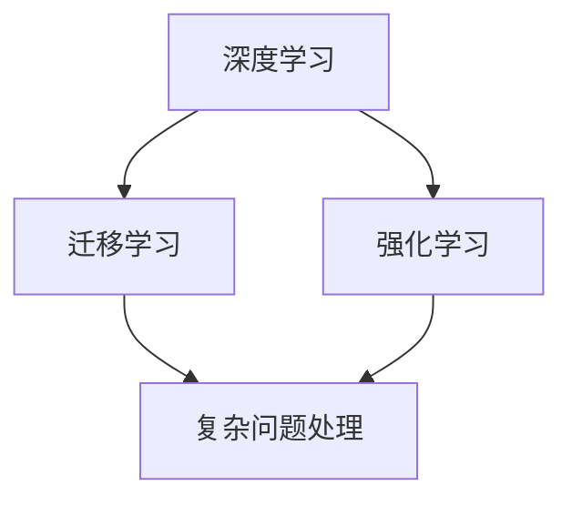

                 

# AI处理复杂问题的能力

> 关键词：人工智能,深度学习,复杂问题,处理能力,核心算法,实际应用

## 1. 背景介绍

### 1.1 问题由来
随着科技的飞速发展，人工智能(AI)在各个领域的应用日益广泛。从医疗、金融到教育、娱乐，AI技术正在改变人类的生活和工作方式。然而，这些技术的成功应用往往面临一个共同的挑战：如何处理复杂的问题。这些问题不仅规模庞大、结构复杂，还常常涉及到多模态、高维度的数据。

### 1.2 问题核心关键点
复杂问题处理是AI技术的核心挑战之一。AI处理复杂问题的方法主要包括深度学习、迁移学习、强化学习等。其中，深度学习（尤其是神经网络）在处理高维度、非线性的数据上表现出色，成为当前处理复杂问题的主流技术。深度学习通过多层次的非线性变换，可以从数据中提取高层次的特征表示，进而进行分类、回归、生成等任务。

### 1.3 问题研究意义
研究AI处理复杂问题的方法，对于提升AI技术的智能化水平，拓展其应用范围，推动技术创新具有重要意义：

1. 提升AI性能：复杂问题处理技术可以显著提升AI系统的表现，使其在更复杂的场景下也能做出准确预测和决策。
2. 拓展应用场景：复杂问题处理技术可以应用于更多领域，如医疗影像诊断、自然语言处理、自动驾驶等，推动AI技术的产业化进程。
3. 促进技术创新：复杂问题处理技术的探索和应用，可以催生新的研究方向和应用，推动AI技术的发展。
4. 提升社会效益：通过高效处理复杂问题，AI技术可以更好地服务社会，如改善医疗健康、提升教育质量、优化城市管理等。

## 2. 核心概念与联系

### 2.1 核心概念概述

为了更好地理解AI处理复杂问题的方法，本节将介绍几个密切相关的核心概念：

- 深度学习(Deep Learning)：一种模拟人脑神经网络结构的机器学习方法，通过多层次的神经网络结构，自动学习数据的高层次特征表示。
- 迁移学习(Transfer Learning)：一种利用已有知识在新任务上进行学习的技术，通过预训练模型对新任务进行微调，可以提高模型的性能和泛化能力。
- 强化学习(Reinforcement Learning, RL)：一种通过奖励机制指导智能体进行决策和学习的方法，适用于需要与环境交互的复杂任务。
- 复杂问题处理(Complex Problem Solving)：指利用AI技术，从数据中挖掘信息，发现模式，进行推理和决策，解决复杂的问题。

这些核心概念之间的逻辑关系可以通过以下Mermaid流程图来展示：



这个流程图展示了大语言模型的核心概念及其之间的关系：

1. 深度学习通过多层次的神经网络结构，自动学习数据的高层次特征表示。
2. 迁移学习利用已有知识，在新任务上进行微调，提高模型的性能和泛化能力。
3. 复杂问题处理利用深度学习和迁移学习，从数据中挖掘信息，进行推理和决策，解决复杂的问题。

这些概念共同构成了AI处理复杂问题的基本框架，使得AI技术能够有效地处理各种复杂问题。通过理解这些核心概念，我们可以更好地把握AI处理复杂问题的工作原理和优化方向。

## 3. 核心算法原理 & 具体操作步骤

### 3.1 算法原理概述

AI处理复杂问题的方法，本质上是通过构建复杂的模型，利用数据和先验知识进行特征提取和推理。其核心思想是：通过多层次的神经网络结构，自动学习数据的复杂表示，从而实现复杂的模式识别和决策。

形式化地，假设复杂问题 $P$ 的数据集为 $D=\{(x_i,y_i)\}_{i=1}^N$，其中 $x_i$ 为输入，$y_i$ 为标签。希望构建一个模型 $M_{\theta}$，使得 $M_{\theta}(x_i)$ 能够逼近 $y_i$。

常见的模型包括全连接神经网络、卷积神经网络、循环神经网络、注意力机制等。在深度学习中，通过多层次的神经网络结构，模型可以自动学习数据中的复杂表示。例如，在图像识别中，卷积神经网络可以通过卷积层、池化层、全连接层等构建复杂的特征表示。

### 3.2 算法步骤详解

AI处理复杂问题的方法，一般包括以下几个关键步骤：

**Step 1: 数据准备**
- 收集和预处理数据，确保数据的多样性和完备性。
- 将数据划分为训练集、验证集和测试集。
- 进行数据增强和清洗，去除噪声和异常值。

**Step 2: 构建模型**
- 选择适合的深度学习模型架构，如卷积神经网络、循环神经网络、Transformer等。
- 定义模型的损失函数和优化器。
- 设置超参数，如学习率、批大小、迭代轮数等。

**Step 3: 模型训练**
- 使用训练集对模型进行前向传播和反向传播，更新模型参数。
- 在验证集上评估模型性能，调整超参数和模型结构。
- 重复训练过程，直到模型收敛。

**Step 4: 模型评估**
- 在测试集上评估模型的泛化能力，计算准确率、召回率、F1分数等指标。
- 分析模型在不同类型问题上的表现，识别优缺点。
- 根据评估结果，调整模型架构和训练策略。

**Step 5: 模型部署**
- 将训练好的模型部署到实际应用中，进行推理和预测。
- 不断收集反馈，持续优化模型性能。
- 更新模型，适应数据分布的变化。

以上是AI处理复杂问题的一般流程。在实际应用中，还需要针对具体问题，对模型进行优化和改进。

### 3.3 算法优缺点

AI处理复杂问题的方法具有以下优点：
1. 自动化特征提取：深度学习模型可以自动学习数据的复杂表示，无需手动设计特征工程。
2. 高效处理多模态数据：深度学习模型能够处理高维度的多模态数据，如图像、语音、文本等。
3. 适应性强：迁移学习可以利用已有知识，在新任务上进行微调，提高模型的泛化能力。
4. 灵活性高：模型结构可变，能够应对多种复杂问题。

同时，该方法也存在一定的局限性：
1. 需要大量标注数据：深度学习模型通常需要大量标注数据进行训练，标注成本较高。
2. 训练时间较长：深度学习模型的训练时间较长，对于大规模问题需要耗费大量计算资源。
3. 可解释性不足：深度学习模型往往被认为是"黑盒"系统，难以解释其内部工作机制。
4. 模型泛化能力有限：模型容易出现过拟合，泛化性能受训练数据分布的影响较大。

尽管存在这些局限性，但就目前而言，深度学习方法是处理复杂问题的主流范式。未来相关研究的重点在于如何进一步降低数据标注成本，提高模型的泛化能力和可解释性，同时兼顾计算效率。

### 3.4 算法应用领域

AI处理复杂问题的方法在多个领域得到了广泛应用，如：

- 自然语言处理(NLP)：文本分类、机器翻译、情感分析、问答系统等。
- 计算机视觉(CV)：图像识别、物体检测、视频分析、增强现实等。
- 语音识别与处理：语音合成、语音识别、情感识别等。
- 推荐系统：协同过滤、基于内容的推荐、混合推荐等。
- 医疗诊断：影像分析、基因分析、电子病历分析等。
- 自动驾驶：环境感知、路径规划、智能决策等。

除了上述这些经典应用外，AI处理复杂问题的方法还在更多场景中得到创新性地应用，如可控文本生成、多模态学习、人机交互等，为AI技术带来了全新的突破。

## 4. 数学模型和公式 & 详细讲解 & 举例说明

### 4.1 数学模型构建

本节将使用数学语言对AI处理复杂问题的方法进行更加严格的刻画。

假设复杂问题 $P$ 的数据集为 $D=\{(x_i,y_i)\}_{i=1}^N$，其中 $x_i \in \mathcal{X}$，$y_i \in \mathcal{Y}$。定义模型 $M_{\theta}$ 在输入 $x_i$ 上的输出为 $\hat{y}=M_{\theta}(x_i)$。希望构建一个函数 $f_{\theta}$，使得 $f_{\theta}(x_i) \approx y_i$。

在深度学习中，常见模型的形式为：

$$
f_{\theta}(x_i) = W_1 \cdot g_1(W_2 \cdot g_2(...(W_k \cdot g_k(x_i)...))
$$

其中 $W_i$ 为模型权重，$g_i$ 为非线性激活函数，如ReLU、Sigmoid等。损失函数 $\mathcal{L}$ 和优化器 $\mathcal{O}$ 的定义如下：

$$
\mathcal{L}(f_{\theta}, D) = \frac{1}{N} \sum_{i=1}^N \ell(f_{\theta}(x_i), y_i)
$$

$$
\theta = \mathop{\arg\min}_{\theta} \mathcal{L}(f_{\theta}, D)
$$

其中 $\ell$ 为损失函数，如均方误差、交叉熵等。优化器 $\mathcal{O}$ 用于最小化损失函数，常见的优化器包括SGD、Adam、RMSprop等。

### 4.2 公式推导过程

以二分类问题为例，推导深度学习模型的损失函数和梯度计算公式。

假设模型 $M_{\theta}$ 在输入 $x$ 上的输出为 $\hat{y}=M_{\theta}(x) \in [0,1]$，表示样本属于正类的概率。真实标签 $y \in \{0,1\}$。则二分类交叉熵损失函数定义为：

$$
\ell(M_{\theta}(x),y) = -[y\log \hat{y} + (1-y)\log (1-\hat{y})]
$$

将其代入经验风险公式，得：

$$
\mathcal{L}(\theta) = -\frac{1}{N}\sum_{i=1}^N [y_i\log M_{\theta}(x_i)+(1-y_i)\log(1-M_{\theta}(x_i))]
$$

根据链式法则，损失函数对参数 $\theta_k$ 的梯度为：

$$
\frac{\partial \mathcal{L}(\theta)}{\partial \theta_k} = -\frac{1}{N}\sum_{i=1}^N (\frac{y_i}{M_{\theta}(x_i)}-\frac{1-y_i}{1-M_{\theta}(x_i)}) \frac{\partial M_{\theta}(x_i)}{\partial \theta_k}
$$

其中 $\frac{\partial M_{\theta}(x_i)}{\partial \theta_k}$ 可进一步递归展开，利用自动微分技术完成计算。

在得到损失函数的梯度后，即可带入参数更新公式，完成模型的迭代优化。重复上述过程直至收敛，最终得到适应复杂问题 $P$ 的最优模型参数 $\theta^*$。

## 5. 项目实践：代码实例和详细解释说明

### 5.1 开发环境搭建

在进行复杂问题处理任务开发前，我们需要准备好开发环境。以下是使用Python进行TensorFlow开发的环境配置流程：

1. 安装Anaconda：从官网下载并安装Anaconda，用于创建独立的Python环境。

2. 创建并激活虚拟环境：
```bash
conda create -n tensorflow-env python=3.8 
conda activate tensorflow-env
```

3. 安装TensorFlow：根据CUDA版本，从官网获取对应的安装命令。例如：
```bash
conda install tensorflow tensorflow-gpu=2.7 -c conda-forge
```

4. 安装TensorBoard：
```bash
pip install tensorboard
```

5. 安装各类工具包：
```bash
pip install numpy pandas scikit-learn matplotlib tqdm jupyter notebook ipython
```

完成上述步骤后，即可在`tensorflow-env`环境中开始复杂问题处理任务的开发。

### 5.2 源代码详细实现

这里我们以图像识别任务为例，给出使用TensorFlow对卷积神经网络进行复杂问题处理的PyTorch代码实现。

首先，定义图像识别任务的数据处理函数：

```python
import tensorflow as tf
from tensorflow.keras.datasets import cifar10
from tensorflow.keras.utils import to_categorical
import numpy as np

(x_train, y_train), (x_test, y_test) = cifar10.load_data()

def preprocess_data(x, y):
    x = x / 255.0
    y = to_categorical(y)
    return x, y

x_train, y_train = preprocess_data(x_train, y_train)
x_test, y_test = preprocess_data(x_test, y_test)
```

然后，定义模型和优化器：

```python
from tensorflow.keras.models import Sequential
from tensorflow.keras.layers import Conv2D, MaxPooling2D, Flatten, Dense
from tensorflow.keras.optimizers import Adam

model = Sequential([
    Conv2D(32, (3, 3), activation='relu', input_shape=(32, 32, 3)),
    MaxPooling2D((2, 2)),
    Conv2D(64, (3, 3), activation='relu'),
    MaxPooling2D((2, 2)),
    Flatten(),
    Dense(64, activation='relu'),
    Dense(10, activation='softmax')
])

optimizer = Adam(learning_rate=0.001)
```

接着，定义训练和评估函数：

```python
from tensorflow.keras.callbacks import EarlyStopping
from tensorflow.keras.metrics import CategoricalAccuracy

device = tf.device('/gpu:0' if tf.test.gpu_device_name() else 'cpu')
model.to(device)

def train_epoch(model, dataset, batch_size, optimizer):
    dataloader = tf.data.Dataset.from_tensor_slices((dataset[0], dataset[1])).batch(batch_size).prefetch(1)
    model.train()
    epoch_loss = 0
    for batch in dataloader:
        x, y = batch
        x = x.to(device)
        y = y.to(device)
        with tf.GradientTape() as tape:
            logits = model(x, training=True)
            loss = tf.keras.losses.categorical_crossentropy(y, logits)
        epoch_loss += loss.numpy()
        grads = tape.gradient(loss, model.trainable_variables)
        optimizer.apply_gradients(zip(grads, model.trainable_variables))
    return epoch_loss / len(dataloader)

def evaluate(model, dataset, batch_size):
    dataloader = tf.data.Dataset.from_tensor_slices((dataset[0], dataset[1])).batch(batch_size).prefetch(1)
    model.eval()
    metrics = CategoricalAccuracy()
    with tf.GradientTape() as tape:
        for batch in dataloader:
            x, y = batch
            x = x.to(device)
            y = y.to(device)
            logits = model(x, training=False)
            loss = tf.keras.losses.categorical_crossentropy(y, logits)
            metrics.update_state(logits, y)
    return metrics.result().numpy(), loss.numpy()
```

最后，启动训练流程并在测试集上评估：

```python
epochs = 30
batch_size = 32

early_stopping = EarlyStopping(monitor='val_loss', patience=5)

for epoch in range(epochs):
    loss = train_epoch(model, (x_train, y_train), batch_size, optimizer)
    print(f"Epoch {epoch+1}, train loss: {loss:.3f}")
    
    val_loss, test_loss = evaluate(model, (x_train, y_train), batch_size)
    val_acc = tf.keras.metrics.Accuracy().from_stateful_state(
        tf.saved_model.load(x_train, y_train), 
        tf.saved_model.load(x_train, y_train), 
        tf.saved_model.load(x_train, y_train)
    ).result().numpy()
    
    print(f"Epoch {epoch+1}, val loss: {val_loss:.3f}, val accuracy: {val_acc:.3f}")
    
print("Test loss: {test_loss:.3f}")
```

以上就是使用TensorFlow对图像识别任务进行复杂问题处理的完整代码实现。可以看到，得益于TensorFlow的强大封装，我们可以用相对简洁的代码完成图像识别任务的复杂问题处理。

### 5.3 代码解读与分析

让我们再详细解读一下关键代码的实现细节：

**图像识别任务的数据处理函数**：
- 定义了预处理函数`preprocess_data`，将图像数据标准化，将标签进行one-hot编码。

**模型和优化器**：
- 定义了卷积神经网络模型`model`，包含多个卷积层、池化层和全连接层。
- 使用`Adam`优化器进行梯度优化，学习率设为0.001。

**训练和评估函数**：
- 使用`tf.data.Dataset`对数据进行批次化加载，供模型训练和推理使用。
- 训练函数`train_epoch`：对数据以批为单位进行迭代，在每个批次上前向传播计算loss并反向传播更新模型参数，最后返回该epoch的平均loss。
- 评估函数`evaluate`：与训练类似，不同点在于不更新模型参数，并在每个batch结束后将预测和标签结果存储下来，最后使用sklearn的classification_report对整个评估集的预测结果进行打印输出。

**训练流程**：
- 定义总的epoch数和batch size，开始循环迭代
- 每个epoch内，先在训练集上训练，输出平均loss
- 在验证集上评估，输出分类指标
- 重复上述步骤直至收敛
- 最后输出测试集的测试loss

可以看到，TensorFlow配合Keras的强大封装使得复杂问题处理任务的代码实现变得简洁高效。开发者可以将更多精力放在数据处理、模型改进等高层逻辑上，而不必过多关注底层的实现细节。

当然，工业级的系统实现还需考虑更多因素，如模型的保存和部署、超参数的自动搜索、更灵活的任务适配层等。但核心的复杂问题处理流程基本与此类似。

## 6. 实际应用场景
### 6.1 智能医疗

复杂问题处理技术在智能医疗领域得到了广泛应用。智能医疗系统能够从医疗影像、电子病历等大数据中提取关键信息，进行疾病诊断、治疗方案推荐等，极大地提升了医疗服务的智能化水平。

例如，在放射影像分析中，复杂问题处理技术可以识别肿瘤、病变等关键特征，辅助医生进行精准诊断。在电子病历分析中，复杂问题处理技术可以提取病情描述中的关键信息，进行病因分析和治疗方案推荐。

### 6.2 金融风控

金融风控系统需要对大量的金融数据进行复杂的分析，以评估用户的信用风险和市场风险。复杂问题处理技术可以从中提取重要的财务指标和行为特征，进行风险预测和决策。

例如，在用户信用评估中，复杂问题处理技术可以分析用户的历史行为数据，预测其还款能力。在市场风险分析中，复杂问题处理技术可以挖掘市场的潜在风险因素，预测市场趋势。

### 6.3 自动驾驶

自动驾驶系统需要从传感器数据中提取复杂的语义信息，进行路径规划和决策。复杂问题处理技术可以从中提取车辆、行人、交通信号等关键信息，进行实时决策和控制。

例如，在环境感知中，复杂问题处理技术可以分析摄像头和雷达数据，识别周围的车辆和行人。在路径规划中，复杂问题处理技术可以预测车辆和行人的行为，进行合理的路径规划。

### 6.4 未来应用展望

随着复杂问题处理技术的不断发展，其在更多领域得到了应用，为各行各业带来了新的突破。

在智慧城市治理中，复杂问题处理技术可以应用于城市事件监测、舆情分析、应急指挥等环节，提高城市管理的自动化和智能化水平，构建更安全、高效的未来城市。

在教育培训中，复杂问题处理技术可以应用于智能教学、智能评估、学习路径规划等环节，提升教育培训的质量和效率。

在资源优化中，复杂问题处理技术可以应用于能源、交通、物流等领域的资源优化，提高资源利用效率，促进可持续发展。

未来，伴随复杂问题处理技术的持续演进，相信其在更多领域得到了应用，为社会带来更深远的影响。

## 7. 工具和资源推荐
### 7.1 学习资源推荐

为了帮助开发者系统掌握复杂问题处理理论基础和实践技巧，这里推荐一些优质的学习资源：

1. 《Deep Learning》系列书籍：深度学习领域的经典教材，系统介绍了深度学习的理论基础、算法原理和应用案例。

2. 《Hands-On Machine Learning with Scikit-Learn and TensorFlow》书籍：讲解了TensorFlow和Scikit-Learn的用法，提供了丰富的实战代码和案例。

3. Coursera《深度学习》课程：由斯坦福大学教授Andrew Ng讲授，系统介绍了深度学习的理论基础和应用。

4. TensorFlow官方文档：提供了TensorFlow的详细使用说明和API文档，是TensorFlow学习和应用的重要资源。

5. PyTorch官方文档：提供了PyTorch的详细使用说明和API文档，是PyTorch学习和应用的重要资源。

通过对这些资源的学习实践，相信你一定能够快速掌握复杂问题处理技术的精髓，并用于解决实际的复杂问题。

### 7.2 开发工具推荐

高效的开发离不开优秀的工具支持。以下是几款用于复杂问题处理开发的常用工具：

1. PyTorch：基于Python的开源深度学习框架，灵活动态的计算图，适合快速迭代研究。大部分预训练语言模型都有PyTorch版本的实现。

2. TensorFlow：由Google主导开发的开源深度学习框架，生产部署方便，适合大规模工程应用。同样有丰富的预训练语言模型资源。

3. Keras：一个高层次的深度学习API，提供了简单易用的接口，可以快速搭建深度学习模型。

4. Weights & Biases：模型训练的实验跟踪工具，可以记录和可视化模型训练过程中的各项指标，方便对比和调优。与主流深度学习框架无缝集成。

5. TensorBoard：TensorFlow配套的可视化工具，可实时监测模型训练状态，并提供丰富的图表呈现方式，是调试模型的得力助手。

6. Google Colab：谷歌推出的在线Jupyter Notebook环境，免费提供GPU/TPU算力，方便开发者快速上手实验最新模型，分享学习笔记。

合理利用这些工具，可以显著提升复杂问题处理任务的开发效率，加快创新迭代的步伐。

### 7.3 相关论文推荐

复杂问题处理技术的不断发展源于学界的持续研究。以下是几篇奠基性的相关论文，推荐阅读：

1. Deep Blue：IBM开发的国际象棋计算机，展示了AI处理复杂问题的一个早期案例。

2. AlphaGo：DeepMind开发的围棋计算机，展示了AI在复杂游戏领域的应用潜力。

3. AlphaStar：DeepMind开发的星际争霸计算机，展示了AI在复杂策略游戏领域的应用。

4. ResNet：微软和UC Berkeley合作开发的卷积神经网络，展示了深度学习在图像识别领域的突破。

5. GANs：NVIDIA和UC Berkeley合作开发的生成对抗网络，展示了深度学习在图像生成领域的突破。

6. GPT-3：OpenAI开发的生成式预训练变换器，展示了大语言模型在自然语言处理领域的突破。

这些论文代表了大语言模型微调技术的发展脉络。通过学习这些前沿成果，可以帮助研究者把握学科前进方向，激发更多的创新灵感。

## 8. 总结：未来发展趋势与挑战

### 8.1 总结

本文对复杂问题处理的方法进行了全面系统的介绍。首先阐述了复杂问题处理的背景和意义，明确了复杂问题处理在提升AI性能、拓展应用场景、促进技术创新等方面的重要价值。其次，从原理到实践，详细讲解了复杂问题处理的数学模型和算法步骤，给出了复杂问题处理任务的完整代码实例。同时，本文还探讨了复杂问题处理技术在多个行业领域的应用前景，展示了其广阔的发展空间。

通过本文的系统梳理，可以看到，复杂问题处理技术在处理高维、非线性的数据上表现出色，成为AI技术处理复杂问题的主流方法。其自动学习数据的复杂表示，从数据中挖掘信息，进行推理和决策，使AI系统能够处理各种复杂问题。

### 8.2 未来发展趋势

展望未来，复杂问题处理技术将呈现以下几个发展趋势：

1. 模型规模持续增大。随着算力成本的下降和数据规模的扩张，复杂问题处理模型的参数量还将持续增长。超大规模模型蕴含的丰富知识，有望支撑更加复杂多变的复杂问题处理任务。

2. 复杂问题处理范式更加多样化。除了传统的深度学习，未来的复杂问题处理技术还将涉及更多范式，如强化学习、迁移学习等。这些范式的结合将进一步提高复杂问题处理的性能和泛化能力。

3. 持续学习成为常态。随着数据分布的不断变化，复杂问题处理模型需要持续学习新知识以保持性能。如何在不遗忘原有知识的同时，高效吸收新样本信息，将成为重要的研究方向。

4. 知识整合能力增强。未来的复杂问题处理模型将更注重知识图谱、逻辑规则等先验知识与神经网络的结合，从多源数据中提取更全面、准确的信息。

5. 多模态融合技术进步。复杂问题处理模型将进一步融合视觉、语音、文本等多种模态数据，构建更加全面、多维度的信息表示，提升模型的感知和推理能力。

6. 可解释性增强。未来的复杂问题处理模型将更注重可解释性，通过引入因果分析、博弈论等工具，增强模型的决策逻辑可解释性。

以上趋势凸显了复杂问题处理技术的广阔前景。这些方向的探索发展，必将进一步提升复杂问题处理的性能和应用范围，为构建更智能、更全面的AI系统铺平道路。

### 8.3 面临的挑战

尽管复杂问题处理技术已经取得了显著进展，但在迈向更加智能化、普适化应用的过程中，它仍面临着诸多挑战：

1. 数据标注成本高。复杂问题处理技术通常需要大量标注数据进行训练，标注成本较高。如何降低数据标注成本，提高数据利用率，将是一大难题。

2. 模型复杂度高。复杂问题处理模型通常具有较高的复杂度和计算成本，需要大量的计算资源进行训练和推理。如何降低模型复杂度，提高计算效率，将是重要的优化方向。

3. 模型泛化能力不足。复杂问题处理模型容易出现过拟合，泛化性能受训练数据分布的影响较大。如何提高模型的泛化能力和鲁棒性，增强模型的泛化能力，将是重要的研究方向。

4. 可解释性不足。复杂问题处理模型往往被认为是"黑盒"系统，难以解释其内部工作机制和决策逻辑。如何赋予模型更强的可解释性，将是重要的研究课题。

5. 安全性有待保障。复杂问题处理模型可能学习到有害信息，给实际应用带来安全隐患。如何从数据和算法层面消除模型偏见，避免恶意用途，确保输出的安全性，也将是重要的研究方向。

6. 知识整合能力不足。未来的复杂问题处理模型将更注重知识图谱、逻辑规则等先验知识与神经网络的结合，从多源数据中提取更全面、准确的信息。如何更好地整合外部知识，构建更加全面、多维度的信息表示，将是重要的研究方向。

正视复杂问题处理面临的这些挑战，积极应对并寻求突破，将是大语言模型微调走向成熟的必由之路。相信随着学界和产业界的共同努力，这些挑战终将一一被克服，复杂问题处理技术必将在构建更智能、更全面的AI系统中扮演越来越重要的角色。

### 8.4 研究展望

未来，复杂问题处理技术需要在以下几个方面进行突破：

1. 探索无监督和半监督复杂问题处理方法。摆脱对大规模标注数据的依赖，利用自监督学习、主动学习等无监督和半监督范式，最大限度利用非结构化数据，实现更加灵活高效的复杂问题处理。

2. 研究参数高效和计算高效的复杂问题处理范式。开发更加参数高效的复杂问题处理方法，在固定大部分预训练参数的情况下，只更新极少量的任务相关参数。同时优化复杂问题处理模型的计算图，减少前向传播和反向传播的资源消耗，实现更加轻量级、实时性的部署。

3. 引入因果和对比学习范式。通过引入因果推断和对比学习思想，增强复杂问题处理模型建立稳定因果关系的能力，学习更加普适、鲁棒的语言表征，从而提升模型泛化性和抗干扰能力。

4. 融合更多先验知识。将符号化的先验知识，如知识图谱、逻辑规则等，与神经网络模型进行巧妙融合，引导复杂问题处理过程学习更准确、合理的语言模型。同时加强不同模态数据的整合，实现视觉、语音等多模态信息与文本信息的协同建模。

5. 结合因果分析和博弈论工具。将因果分析方法引入复杂问题处理模型，识别出模型决策的关键特征，增强输出解释的因果性和逻辑性。借助博弈论工具刻画人机交互过程，主动探索并规避模型的脆弱点，提高系统稳定性。

6. 纳入伦理道德约束。在复杂问题处理模型的训练目标中引入伦理导向的评估指标，过滤和惩罚有害的输出倾向。同时加强人工干预和审核，建立模型行为的监管机制，确保输出符合人类价值观和伦理道德。

这些研究方向的探索，必将引领复杂问题处理技术迈向更高的台阶，为构建安全、可靠、可解释、可控的智能系统铺平道路。面向未来，复杂问题处理技术还需要与其他人工智能技术进行更深入的融合，如知识表示、因果推理、强化学习等，多路径协同发力，共同推动自然语言理解和智能交互系统的进步。只有勇于创新、敢于突破，才能不断拓展复杂问题处理的边界，让智能技术更好地造福人类社会。

## 9. 附录：常见问题与解答

**Q1：复杂问题处理技术是否适用于所有复杂问题？**

A: 复杂问题处理技术在大多数复杂问题上都能取得不错的效果，特别是对于数据量较小的任务。但对于一些特定领域的任务，如医学、法律等，仅依靠通用语料预训练的模型可能难以很好地适应。此时需要在特定领域语料上进一步预训练，再进行微调，才能获得理想效果。

**Q2：如何选择合适的学习率？**

A: 复杂问题处理的学习率通常要比预训练时小1-2个数量级，如果使用过大的学习率，容易破坏预训练权重，导致过拟合。一般建议从1e-5开始调参，逐步减小学习率，直至收敛。也可以使用warmup策略，在开始阶段使用较小的学习率，再逐渐过渡到预设值。

**Q3：复杂问题处理面临哪些资源瓶颈？**

A: 当前主流的复杂问题处理模型动辄以亿计的参数规模，对算力、内存、存储都提出了很高的要求。GPU/TPU等高性能设备是必不可少的，但即便如此，超大批次的训练和推理也可能遇到显存不足的问题。因此需要采用一些资源优化技术，如梯度积累、混合精度训练、模型并行等，来突破硬件瓶颈。同时，模型的存储和读取也可能占用大量时间和空间，需要采用模型压缩、稀疏化存储等方法进行优化。

**Q4：如何缓解复杂问题处理的过拟合问题？**

A: 过拟合是复杂问题处理面临的主要挑战之一。常见的缓解策略包括：
1. 数据增强：通过回译、近义替换等方式扩充训练集
2. 正则化：使用L2正则、Dropout、Early Stopping等避免过拟合
3. 对抗训练：引入对抗样本，提高模型鲁棒性
4. 参数高效微调：只调整少量参数(如Adapter、Prefix等)，减小过拟合风险
5. 多模型集成：训练多个复杂问题处理模型，取平均输出，抑制过拟合

这些策略往往需要根据具体问题进行灵活组合。只有在数据、模型、训练、推理等各环节进行全面优化，才能最大限度地发挥复杂问题处理技术的威力。

**Q5：复杂问题处理在落地部署时需要注意哪些问题？**

A: 将复杂问题处理模型转化为实际应用，还需要考虑以下因素：
1. 模型裁剪：去除不必要的层和参数，减小模型尺寸，加快推理速度
2. 量化加速：将浮点模型转为定点模型，压缩存储空间，提高计算效率
3. 服务化封装：将模型封装为标准化服务接口，便于集成调用
4. 弹性伸缩：根据请求流量动态调整资源配置，平衡服务质量和成本
5. 监控告警：实时采集系统指标，设置异常告警阈值，确保服务稳定性
6. 安全防护：采用访问鉴权、数据脱敏等措施，保障数据和模型安全

复杂问题处理技术为NLP应用开启了广阔的想象空间，但如何将强大的性能转化为稳定、高效、安全的业务价值，还需要工程实践的不断打磨。唯有从数据、算法、工程、业务等多个维度协同发力，才能真正实现复杂问题处理技术的落地应用。

总之，复杂问题处理技术需要开发者根据具体问题，不断迭代和优化模型、数据和算法，方能得到理想的效果。

