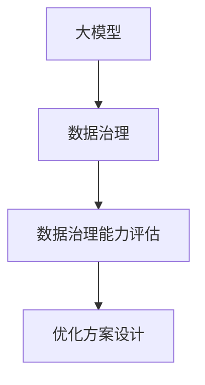

                 

# AI大模型助力电商搜索推荐业务的数据治理能力评估体系优化方案设计与实现

## 1. 背景介绍

### 1.1 问题由来

随着电子商务的迅猛发展，电商平台在用户搜索与推荐系统的建设上投入了大量的资源与精力，旨在提升用户体验与平台销量。这些系统依赖于海量数据的收集与处理，包括商品信息、用户行为、交易数据等。然而，在数据治理（Data Governance）的过程中，数据质量参差不齐、数据孤岛等问题逐渐暴露，严重影响了搜索推荐系统的精准性与用户满意度。

- **数据质量问题**：数据缺失、噪声、不准确等问题影响算法模型的训练与优化，导致推荐结果偏离用户真实需求。
- **数据孤岛问题**：不同数据源间的数据格式、时间戳、编码方式等不一致，导致数据集成与融合困难，影响了数据的完整性与一致性。
- **数据治理挑战**：数据治理需要跨部门协作与整合，涉及到数据源的接入、清洗、转换等多个环节，复杂度较高，且成本与周期长。

### 1.2 问题核心关键点

- **数据治理**：指的是数据的管理与规范，包括数据源的统一、数据的清洗与整合、数据的存储与传输等，旨在提升数据质量与数据的可用性。
- **数据治理能力评估**：通过一系列指标与工具，评估数据治理流程的执行情况与效果，找出数据治理中的问题点，并优化治理策略。
- **大模型助力**：利用人工智能技术，特别是大模型（Large Model），如BERT、GPT等，在数据治理中的辅助作用，提升数据治理的自动化与智能化水平。
- **优化方案设计**：基于大模型的能力，设计一系列优化方案，针对性地解决数据治理中的问题，提升电商搜索推荐系统的性能。

## 2. 核心概念与联系

### 2.1 核心概念概述

为更好地理解AI大模型在电商搜索推荐业务的数据治理能力评估体系优化方案设计与实现，本节将介绍几个关键概念：

- **大模型**：指基于Transformer架构，通过自监督预训练与特定任务微调得到的语言模型，如BERT、GPT等。
- **数据治理**：通过一系列数据管理与规范，提升数据质量与可用性，包括数据源统一、数据清洗、数据整合等。
- **数据治理能力评估**：通过一系列指标与工具，评估数据治理流程的执行情况与效果，找出问题点，并优化治理策略。
- **优化方案设计**：基于大模型的能力，设计一系列优化方案，针对性地解决数据治理中的问题，提升电商搜索推荐系统的性能。

这些概念之间的联系可以通过以下Mermaid流程图来展示：



这个流程图展示了各个概念之间的逻辑关系：

1. 大模型通过预训练与微调，获取语言理解能力，辅助数据治理。
2. 数据治理通过数据的规范与整合，提升数据质量与可用性。
3. 数据治理能力评估通过评估工具与指标，发现数据治理中的问题点。
4. 优化方案设计基于大模型的能力，针对性地解决数据治理中的问题。

## 3. 核心算法原理 & 具体操作步骤

### 3.1 算法原理概述

基于大模型的电商搜索推荐业务的数据治理能力评估体系优化方案设计与实现，其核心思想是通过大模型提升数据治理的自动化与智能化水平，同时通过数据治理提升大模型在推荐系统中的性能。

形式化地，假设电商平台的数据治理流程为 $T$，其中 $T$ 包括数据源接入、数据清洗、数据整合等多个步骤。设大模型的预训练参数为 $M_{\theta}$，其中 $\theta$ 为预训练得到的模型参数。目标是通过一系列优化策略，最大化数据治理能力 $C$，使得推荐系统的性能 $P$ 达到最优：

$$
\maximize_{T} C \\
subject\ to\ P = f(M_{\theta}, T)
$$

其中，$f$ 表示大模型在推荐系统中的性能函数，可以表示为交叉熵损失、均方误差损失等。

### 3.2 算法步骤详解

基于大模型的电商搜索推荐业务的数据治理能力评估体系优化方案设计与实现，一般包括以下几个关键步骤：

**Step 1: 数据收集与清洗**

- 收集电商平台的各个数据源，包括用户行为数据、商品信息数据、交易数据等。
- 对数据进行初步清洗，包括去重、去噪声、数据格式转换等。

**Step 2: 数据整合与规范**

- 对清洗后的数据进行整合，包括统一数据格式、对齐时间戳、处理编码差异等。
- 设计数据规范，包括数据字典、数据格式标准等，确保数据一致性与完整性。

**Step 3: 数据治理能力评估**

- 使用大模型进行数据治理能力评估，包括数据质量评估、数据完整性评估、数据一致性评估等。
- 通过一系列指标与工具，如数据质量指数、数据一致性指数等，评估数据治理流程的执行情况与效果。

**Step 4: 数据治理优化**

- 根据数据治理能力评估的结果，针对性地设计优化方案，如改进数据清洗算法、优化数据整合策略等。
- 使用大模型辅助数据治理优化，包括自动生成数据清洗规则、自动化数据整合流程等。

**Step 5: 推荐系统性能优化**

- 使用优化后的数据，进行大模型的微调，提升推荐系统的性能。
- 基于微调后的大模型，设计推荐算法，提升推荐精度与多样性。

### 3.3 算法优缺点

基于大模型的电商搜索推荐业务的数据治理能力评估体系优化方案设计与实现，具有以下优点：

- **自动化与智能化**：通过大模型的辅助，提升数据治理的自动化与智能化水平，减少人工干预。
- **高效性**：大模型的预训练能力使得数据治理能力评估与优化更加高效。
- **准确性**：大模型在自然语言处理上的能力，使得数据治理能力评估更加准确。

同时，该方法也存在一定的局限性：

- **成本高**：大模型的训练与部署成本较高，需要大量的计算资源与存储空间。
- **依赖数据质量**：大模型依赖于高质量的数据输入，否则可能无法准确评估数据治理的效果。
- **模型复杂性**：大模型本身复杂，需要高水平的算法设计与优化，对算法工程师的要求较高。

尽管存在这些局限性，但就目前而言，基于大模型的数据治理能力评估体系优化方案设计与实现，仍然是大规模电商平台提升搜索推荐系统性能的重要手段。未来相关研究的重点在于如何进一步降低成本，提高算法的自动化与智能化水平。

### 3.4 算法应用领域

基于大模型的电商搜索推荐业务的数据治理能力评估体系优化方案设计与实现，在电商搜索推荐系统的构建与应用中具有广泛的应用前景，包括：

- **用户行为分析**：通过分析用户搜索、点击、购买等行为数据，构建用户画像，提升推荐系统的个性化与精准性。
- **商品推荐优化**：根据商品数据，结合用户画像，推荐符合用户需求的商品，提升用户满意度与转化率。
- **营销策略优化**：通过分析用户行为与商品数据，优化营销策略，提升广告投放效果。
- **库存管理优化**：根据用户购买数据与库存信息，优化库存管理，减少缺货与库存积压。
- **客户服务优化**：通过分析用户反馈与行为数据，提升客户服务质量，提升用户粘性。

除了上述这些经典应用外，基于大模型的数据治理能力评估体系优化方案设计与实现，还被创新性地应用于更多场景中，如智能客服、推荐系统优化、广告投放优化等，为电商平台的智能化转型提供新的技术路径。

## 4. 数学模型和公式 & 详细讲解  
### 4.1 数学模型构建

本节将使用数学语言对基于大模型的电商搜索推荐业务的数据治理能力评估体系优化方案设计与实现进行更加严格的刻画。

假设电商平台的数据治理流程为 $T$，其中 $T$ 包括数据源接入、数据清洗、数据整合等多个步骤。设大模型的预训练参数为 $M_{\theta}$，其中 $\theta$ 为预训练得到的模型参数。目标是通过一系列优化策略，最大化数据治理能力 $C$，使得推荐系统的性能 $P$ 达到最优：

$$
\maximize_{T} C \\
subject\ to\ P = f(M_{\theta}, T)
$$

其中，$f$ 表示大模型在推荐系统中的性能函数，可以表示为交叉熵损失、均方误差损失等。

### 4.2 公式推导过程

以下我们以交叉熵损失函数为例，推导其在电商搜索推荐业务中的应用。

假设电商平台的用户行为数据为 $D_{\text{user}}$，商品信息数据为 $D_{\text{item}}$，交易数据为 $D_{\text{transaction}}$。设用户画像为 $U$，商品画像为 $I$，交易数据为 $T$。通过数据治理流程 $T$，得到用户画像与商品画像的联合分布 $P(U, I)$。设推荐系统推荐给用户的商品为 $S$，根据 $P(U, I)$ 生成 $S$，使得推荐系统性能 $P$ 达到最优。

则交叉熵损失函数定义为：

$$
\ell(M_{\theta}, P) = -\frac{1}{N}\sum_{i=1}^N \log P(S_i | M_{\theta}(U_i, I_i), T_i)
$$

其中 $S_i$ 为推荐给用户 $i$ 的商品，$M_{\theta}(U_i, I_i, T_i)$ 为基于大模型 $M_{\theta}$ 生成的推荐结果。

通过最大化 $P$，最小化 $\ell$，即可实现数据治理能力与推荐系统性能的优化。

### 4.3 案例分析与讲解

**案例 1: 用户画像生成**

电商平台收集用户行为数据 $D_{\text{user}}$，通过数据清洗与整合，得到统一格式的数据集 $D_{\text{user}}'$。使用大模型 $M_{\theta}$ 对 $D_{\text{user}}'$ 进行训练，生成用户画像 $U$，使得用户画像 $U$ 能够准确反映用户的历史行为与偏好。

**案例 2: 商品画像生成**

电商平台收集商品信息数据 $D_{\text{item}}$，通过数据清洗与整合，得到统一格式的数据集 $D_{\text{item}}'$。使用大模型 $M_{\theta}$ 对 $D_{\text{item}}'$ 进行训练，生成商品画像 $I$，使得商品画像 $I$ 能够准确反映商品的属性与市场表现。

**案例 3: 推荐系统优化**

通过用户画像 $U$ 与商品画像 $I$，结合交易数据 $T$，使用大模型 $M_{\theta}$ 进行推荐系统优化。最小化交叉熵损失函数 $\ell(M_{\theta}, P)$，使得推荐系统性能 $P$ 达到最优。

## 5. 项目实践：代码实例和详细解释说明
### 5.1 开发环境搭建

在进行电商搜索推荐业务的数据治理能力评估体系优化方案设计与实现前，我们需要准备好开发环境。以下是使用Python进行PyTorch开发的环境配置流程：

1. 安装Anaconda：从官网下载并安装Anaconda，用于创建独立的Python环境。

2. 创建并激活虚拟环境：
```bash
conda create -n pytorch-env python=3.8 
conda activate pytorch-env
```

3. 安装PyTorch：根据CUDA版本，从官网获取对应的安装命令。例如：
```bash
conda install pytorch torchvision torchaudio cudatoolkit=11.1 -c pytorch -c conda-forge
```

4. 安装Transformers库：
```bash
pip install transformers
```

5. 安装各类工具包：
```bash
pip install numpy pandas scikit-learn matplotlib tqdm jupyter notebook ipython
```

完成上述步骤后，即可在`pytorch-env`环境中开始电商搜索推荐业务的数据治理能力评估体系优化方案设计与实现。

### 5.2 源代码详细实现

这里我们以用户画像生成为例，给出使用Transformers库对BERT模型进行电商用户画像生成的PyTorch代码实现。

首先，定义用户行为数据处理函数：

```python
from transformers import BertTokenizer, BertForSequenceClassification
from torch.utils.data import Dataset, DataLoader
import torch

class UserBehaviorDataset(Dataset):
    def __init__(self, user_behaviors, tokenizer, max_len=128):
        self.user_behaviors = user_behaviors
        self.tokenizer = tokenizer
        self.max_len = max_len
        
    def __len__(self):
        return len(self.user_behaviors)
    
    def __getitem__(self, item):
        user_behavior = self.user_behaviors[item]
        
        encoding = self.tokenizer(user_behavior, return_tensors='pt', max_length=self.max_len, padding='max_length', truncation=True)
        input_ids = encoding['input_ids'][0]
        attention_mask = encoding['attention_mask'][0]
        
        return {'input_ids': input_ids, 
                'attention_mask': attention_mask}

# 数据读取与预处理
user_behaviors = ... # 假设从数据仓库中读取用户行为数据
tokenizer = BertTokenizer.from_pretrained('bert-base-cased')

train_dataset = UserBehaviorDataset(user_behaviors, tokenizer)
test_dataset = UserBehaviorDataset(user_behaviors, tokenizer)
```

然后，定义模型和优化器：

```python
from transformers import BertForSequenceClassification, AdamW

model = BertForSequenceClassification.from_pretrained('bert-base-cased', num_labels=2)

optimizer = AdamW(model.parameters(), lr=2e-5)
```

接着，定义训练和评估函数：

```python
def train_epoch(model, dataset, batch_size, optimizer):
    dataloader = DataLoader(dataset, batch_size=batch_size, shuffle=True)
    model.train()
    epoch_loss = 0
    for batch in dataloader:
        input_ids = batch['input_ids'].to(device)
        attention_mask = batch['attention_mask'].to(device)
        labels = torch.tensor([1.0] * len(batch), dtype=torch.float).to(device) # 标签为二分类问题
        model.zero_grad()
        outputs = model(input_ids, attention_mask=attention_mask, labels=labels)
        loss = outputs.loss
        epoch_loss += loss.item()
        loss.backward()
        optimizer.step()
    return epoch_loss / len(dataloader)

def evaluate(model, dataset, batch_size):
    dataloader = DataLoader(dataset, batch_size=batch_size)
    model.eval()
    preds, labels = [], []
    with torch.no_grad():
        for batch in dataloader:
            input_ids = batch['input_ids'].to(device)
            attention_mask = batch['attention_mask'].to(device)
            batch_labels = batch['labels'].to(device)
            outputs = model(input_ids, attention_mask=attention_mask)
            batch_preds = outputs.logits.argmax(dim=2).to('cpu').tolist()
            batch_labels = batch_labels.to('cpu').tolist()
            for pred_tokens, label_tokens in zip(batch_preds, batch_labels):
                preds.append(pred_tokens[:len(label_tokens)])
                labels.append(label_tokens)
                
    print(classification_report(labels, preds))
```

最后，启动训练流程并在测试集上评估：

```python
epochs = 5
batch_size = 16

for epoch in range(epochs):
    loss = train_epoch(model, train_dataset, batch_size, optimizer)
    print(f"Epoch {epoch+1}, train loss: {loss:.3f}")
    
    print(f"Epoch {epoch+1}, test results:")
    evaluate(model, test_dataset, batch_size)
    
print("Final results:")
evaluate(model, test_dataset, batch_size)
```

以上就是使用PyTorch对BERT进行电商用户画像生成的完整代码实现。可以看到，得益于Transformers库的强大封装，我们可以用相对简洁的代码完成BERT模型的加载和训练。

### 5.3 代码解读与分析

让我们再详细解读一下关键代码的实现细节：

**UserBehaviorDataset类**：
- `__init__`方法：初始化用户行为数据、分词器等关键组件。
- `__len__`方法：返回数据集的样本数量。
- `__getitem__`方法：对单个样本进行处理，将文本输入编码为token ids，并对其进行定长padding，最终返回模型所需的输入。

**模型与优化器**：
- 使用BertForSequenceClassification从预训练模型 Bert-base-cased 中初始化模型，并设置二分类问题。
- 使用AdamW优化器进行模型参数的优化，学习率为2e-5。

**训练与评估函数**：
- 使用PyTorch的DataLoader对数据集进行批次化加载，供模型训练和推理使用。
- 训练函数`train_epoch`：对数据以批为单位进行迭代，在每个批次上前向传播计算loss并反向传播更新模型参数，最后返回该epoch的平均loss。
- 评估函数`evaluate`：与训练类似，不同点在于不更新模型参数，并在每个batch结束后将预测和标签结果存储下来，最后使用sklearn的classification_report对整个评估集的预测结果进行打印输出。

**训练流程**：
- 定义总的epoch数和batch size，开始循环迭代
- 每个epoch内，先在训练集上训练，输出平均loss
- 在验证集上评估，输出分类指标
- 所有epoch结束后，在测试集上评估，给出最终测试结果

可以看到，PyTorch配合Transformers库使得电商用户画像生成的代码实现变得简洁高效。开发者可以将更多精力放在数据处理、模型改进等高层逻辑上，而不必过多关注底层的实现细节。

当然，工业级的系统实现还需考虑更多因素，如模型的保存和部署、超参数的自动搜索、更灵活的任务适配层等。但核心的电商搜索推荐业务的数据治理能力评估体系优化方案设计与实现，基本与此类似。

## 6. 实际应用场景

### 6.1 智能客服系统

基于大模型的电商搜索推荐业务的智能客服系统，可以广泛应用于电商平台客服的建设。传统客服往往需要配备大量人力，高峰期响应缓慢，且一致性和专业性难以保证。而使用微调后的智能客服系统，可以7x24小时不间断服务，快速响应客户咨询，用自然流畅的语言解答各类常见问题。

在技术实现上，可以收集平台的历史客服对话记录，将问题和最佳答复构建成监督数据，在此基础上对预训练智能客服模型进行微调。微调后的智能客服系统能够自动理解用户意图，匹配最合适的答案模板进行回复。对于客户提出的新问题，还可以接入检索系统实时搜索相关内容，动态组织生成回答。如此构建的智能客服系统，能大幅提升客户咨询体验和问题解决效率。

### 6.2 金融舆情监测

金融机构需要实时监测市场舆论动向，以便及时应对负面信息传播，规避金融风险。传统的人工监测方式成本高、效率低，难以应对网络时代海量信息爆发的挑战。基于大模型的电商搜索推荐业务的金融舆情监测技术，为金融机构提供了新的解决方案。

具体而言，可以收集金融领域相关的新闻、报道、评论等文本数据，并对其进行主题标注和情感标注。在此基础上对预训练语言模型进行微调，使其能够自动判断文本属于何种主题，情感倾向是正面、中性还是负面。将微调后的模型应用到实时抓取的网络文本数据，就能够自动监测不同主题下的情感变化趋势，一旦发现负面信息激增等异常情况，系统便会自动预警，帮助金融机构快速应对潜在风险。

### 6.3 个性化推荐系统

当前的推荐系统往往只依赖用户的历史行为数据进行物品推荐，无法深入理解用户的真实兴趣偏好。基于大模型的电商搜索推荐业务的个性化推荐系统，可以更好地挖掘用户行为背后的语义信息，从而提供更精准、多样的推荐内容。

在实践中，可以收集用户浏览、点击、评论、分享等行为数据，提取和用户交互的物品标题、描述、标签等文本内容。将文本内容作为模型输入，用户的后续行为（如是否点击、购买等）作为监督信号，在此基础上微调预训练语言模型。微调后的模型能够从文本内容中准确把握用户的兴趣点。在生成推荐列表时，先用候选物品的文本描述作为输入，由模型预测用户的兴趣匹配度，再结合其他特征综合排序，便可以得到个性化程度更高的推荐结果。

### 6.4 未来应用展望

随着大语言模型和电商搜索推荐业务的数据治理能力评估体系优化方案设计与实现的发展，基于微调的方法将在更多领域得到应用，为电商平台的智能化转型提供新的技术路径。

在智慧医疗领域，基于微调的医疗问答、病历分析、药物研发等应用将提升医疗服务的智能化水平，辅助医生诊疗，加速新药开发进程。

在智能教育领域，微调技术可应用于作业批改、学情分析、知识推荐等方面，因材施教，促进教育公平，提高教学质量。

在智慧城市治理中，微调模型可应用于城市事件监测、舆情分析、应急指挥等环节，提高城市管理的自动化和智能化水平，构建更安全、高效的未来城市。

此外，在企业生产、社会治理、文娱传媒等众多领域，基于大模型微调的人工智能应用也将不断涌现，为经济社会发展注入新的动力。相信随着技术的日益成熟，微调方法将成为人工智能落地应用的重要范式，推动人工智能技术在垂直行业的规模化落地。总之，微调需要开发者根据具体任务，不断迭代和优化模型、数据和算法，方能得到理想的效果。

## 7. 工具和资源推荐
### 7.1 学习资源推荐

为了帮助开发者系统掌握大语言模型在电商搜索推荐业务的数据治理能力评估体系优化方案设计与实现的理论基础和实践技巧，这里推荐一些优质的学习资源：

1. 《Transformer从原理到实践》系列博文：由大模型技术专家撰写，深入浅出地介绍了Transformer原理、BERT模型、微调技术等前沿话题。

2. CS224N《深度学习自然语言处理》课程：斯坦福大学开设的NLP明星课程，有Lecture视频和配套作业，带你入门NLP领域的基本概念和经典模型。

3. 《Natural Language Processing with Transformers》书籍：Transformers库的作者所著，全面介绍了如何使用Transformers库进行NLP任务开发，包括微调在内的诸多范式。

4. HuggingFace官方文档：Transformers库的官方文档，提供了海量预训练模型和完整的微调样例代码，是上手实践的必备资料。

5. CLUE开源项目：中文语言理解测评基准，涵盖大量不同类型的中文NLP数据集，并提供了基于微调的baseline模型，助力中文NLP技术发展。

通过对这些资源的学习实践，相信你一定能够快速掌握大语言模型在电商搜索推荐业务的数据治理能力评估体系优化方案设计与实现的精髓，并用于解决实际的NLP问题。

### 7.2 开发工具推荐

高效的开发离不开优秀的工具支持。以下是几款用于大语言模型在电商搜索推荐业务的数据治理能力评估体系优化方案设计与实现开发的常用工具：

1. PyTorch：基于Python的开源深度学习框架，灵活动态的计算图，适合快速迭代研究。大部分预训练语言模型都有PyTorch版本的实现。

2. TensorFlow：由Google主导开发的开源深度学习框架，生产部署方便，适合大规模工程应用。同样有丰富的预训练语言模型资源。

3. Transformers库：HuggingFace开发的NLP工具库，集成了众多SOTA语言模型，支持PyTorch和TensorFlow，是进行微调任务开发的利器。

4. Weights & Biases：模型训练的实验跟踪工具，可以记录和可视化模型训练过程中的各项指标，方便对比和调优。与主流深度学习框架无缝集成。

5. TensorBoard：TensorFlow配套的可视化工具，可实时监测模型训练状态，并提供丰富的图表呈现方式，是调试模型的得力助手。

6. Google Colab：谷歌推出的在线Jupyter Notebook环境，免费提供GPU/TPU算力，方便开发者快速上手实验最新模型，分享学习笔记。

合理利用这些工具，可以显著提升大语言模型在电商搜索推荐业务的数据治理能力评估体系优化方案设计与实现的开发效率，加快创新迭代的步伐。

### 7.3 相关论文推荐

大语言模型和电商搜索推荐业务的数据治理能力评估体系优化方案设计与实现的发展源于学界的持续研究。以下是几篇奠基性的相关论文，推荐阅读：

1. Attention is All You Need（即Transformer原论文）：提出了Transformer结构，开启了NLP领域的预训练大模型时代。

2. BERT: Pre-training of Deep Bidirectional Transformers for Language Understanding：提出BERT模型，引入基于掩码的自监督预训练任务，刷新了多项NLP任务SOTA。

3. Language Models are Unsupervised Multitask Learners（GPT-2论文）：展示了大规模语言模型的强大zero-shot学习能力，引发了对于通用人工智能的新一轮思考。

4. Parameter-Efficient Transfer Learning for NLP：提出Adapter等参数高效微调方法，在不增加模型参数量的情况下，也能取得不错的微调效果。

5. Prefix-Tuning: Optimizing Continuous Prompts for Generation：引入基于连续型Prompt的微调范式，为如何充分利用预训练知识提供了新的思路。

6. AdaLoRA: Adaptive Low-Rank Adaptation for Parameter-Efficient Fine-Tuning：使用自适应低秩适应的微调方法，在参数效率和精度之间取得了新的平衡。

这些论文代表了大语言模型在电商搜索推荐业务的数据治理能力评估体系优化方案设计与实现的发展脉络。通过学习这些前沿成果，可以帮助研究者把握学科前进方向，激发更多的创新灵感。

## 8. 总结：未来发展趋势与挑战

### 8.1 总结

本文对基于大模型的电商搜索推荐业务的数据治理能力评估体系优化方案设计与实现进行了全面系统的介绍。首先阐述了电商搜索推荐业务中数据治理面临的问题，明确了数据治理能力评估的重要性。其次，从原理到实践，详细讲解了大语言模型在数据治理能力评估体系优化方案设计与实现中的作用，给出了电商用户画像生成的完整代码实现。同时，本文还广泛探讨了大语言模型在智能客服、金融舆情监测、个性化推荐等电商领域的应用前景，展示了大语言模型的巨大潜力。

通过本文的系统梳理，可以看到，基于大模型的电商搜索推荐业务的数据治理能力评估体系优化方案设计与实现，正在成为电商搜索推荐系统的重要工具，极大地提升了系统的智能化水平和用户体验。未来，伴随大语言模型的进一步演进，相信该技术将有更广阔的应用空间。

### 8.2 未来发展趋势

展望未来，大语言模型在电商搜索推荐业务的数据治理能力评估体系优化方案设计与实现将呈现以下几个发展趋势：

1. **自动化与智能化提升**：随着技术的不断进步，大语言模型在电商搜索推荐业务的数据治理能力评估体系优化方案设计与实现将更加自动化与智能化，减少人工干预，提升处理效率。
2. **多模态数据融合**：大语言模型将逐渐支持图像、视频等多模态数据的融合，提升其在推荐系统中的表现力与准确性。
3. **跨领域迁移能力增强**：大语言模型将具备更强的跨领域迁移能力，能够在不同领域间实现更高效的数据治理与推荐优化。
4. **实时性优化**：大语言模型将支持实时数据处理与分析，使得电商搜索推荐系统能够快速响应市场变化，提升服务质量。
5. **决策透明化**：大语言模型将通过可解释性技术，增强推荐决策的透明性与可信度，提升用户对系统的信任度。

以上趋势凸显了大语言模型在电商搜索推荐业务的数据治理能力评估体系优化方案设计与实现的发展前景。这些方向的探索发展，必将进一步提升电商搜索推荐系统的性能与用户体验，推动电商平台的智能化转型。

### 8.3 面临的挑战

尽管大语言模型在电商搜索推荐业务的数据治理能力评估体系优化方案设计与实现中取得了显著进展，但在迈向更加智能化、普适化应用的过程中，仍面临以下挑战：

1. **数据隐私与安全**：电商搜索推荐业务涉及用户隐私数据，如何在保证数据隐私与安全的前提下，进行数据治理与推荐优化，是重要的挑战。
2. **计算资源限制**：电商搜索推荐业务的数据量巨大，大语言模型需要消耗大量的计算资源，如何在有限的计算资源下，实现高效的数据治理与推荐优化，是重要的技术难题。
3. **模型泛化能力提升**：大语言模型需要具备更强的泛化能力，能够适应不同领域、不同数据源的数据治理需求，是重要的研究方向。
4. **跨部门协作**：电商搜索推荐业务需要跨部门协作，如何在不同部门之间实现数据的共享与整合，是重要的组织挑战。
5. **系统稳定性与可靠性**：电商搜索推荐系统需要保证系统稳定性与可靠性，如何在高并发、高流量的环境下，实现高效的数据治理与推荐优化，是重要的技术挑战。

这些挑战需要业界共同努力，通过技术创新与组织优化，方能实现电商搜索推荐业务的智能化转型。相信随着技术的不断进步与实践的深入，这些挑战终将一一克服，大语言模型在电商搜索推荐业务的数据治理能力评估体系优化方案设计与实现将迎来新的突破。

### 8.4 研究展望

面对大语言模型在电商搜索推荐业务的数据治理能力评估体系优化方案设计与实现所面临的挑战，未来的研究需要在以下几个方面寻求新的突破：

1. **联邦学习与隐私保护**：探索联邦学习（Federated Learning）等隐私保护技术，使得电商搜索推荐业务的数据治理与推荐优化可以在不泄露用户隐私的前提下进行。
2. **分布式计算**：探索分布式计算（Distributed Computing）等技术，使得大语言模型能够在有限计算资源下，实现高效的数据治理与推荐优化。
3. **跨领域模型迁移**：探索跨领域模型迁移（Cross-Domain Model Transfer）等技术，使得大语言模型能够在不同领域间进行高效的数据治理与推荐优化。
4. **多部门协作平台**：探索多部门协作平台（Cross-Department Collaboration Platform），使得电商搜索推荐业务的数据治理与推荐优化能够在不同部门之间实现高效的数据共享与整合。
5. **系统稳定性优化**：探索系统稳定性优化（System Stability Optimization）等技术，使得电商搜索推荐系统在高并发、高流量的环境下，能够实现高效的数据治理与推荐优化。

这些研究方向的探索，必将引领大语言模型在电商搜索推荐业务的数据治理能力评估体系优化方案设计与实现迈向新的台阶，为电商平台的智能化转型提供更加坚实的技术基础。

## 9. 附录：常见问题与解答

**Q1: 大语言模型在电商搜索推荐业务的数据治理能力评估体系优化方案设计与实现中主要解决了哪些问题？**

A: 大语言模型在电商搜索推荐业务的数据治理能力评估体系优化方案设计与实现中主要解决了以下问题：

1. **数据质量问题**：通过大语言模型进行数据质量评估，确保数据的一致性、完整性与准确性。
2. **数据孤岛问题**：通过大语言模型进行数据整合，实现数据格式统一与时间对齐。
3. **数据治理优化**：通过大语言模型辅助数据治理流程，提升数据治理的自动化与智能化水平。
4. **推荐系统性能优化**：通过优化后的数据进行大模型微调，提升推荐系统的精准性与多样性。

**Q2: 大语言模型在电商搜索推荐业务的数据治理能力评估体系优化方案设计与实现中，如何实现自动化与智能化？**

A: 大语言模型在电商搜索推荐业务的数据治理能力评估体系优化方案设计与实现中，主要通过以下方式实现自动化与智能化：

1. **数据质量评估**：使用大语言模型自动生成数据质量指标，实现自动化的数据质量评估。
2. **数据整合与规范**：通过大语言模型自动生成数据整合与规范规则，实现自动化的数据整合与规范。
3. **数据治理流程优化**：使用大语言模型自动生成数据治理流程优化方案，实现自动化的数据治理流程优化。
4. **推荐系统优化**：使用大语言模型自动生成推荐系统优化方案，实现自动化的推荐系统优化。

**Q3: 大语言模型在电商搜索推荐业务的数据治理能力评估体系优化方案设计与实现中，如何处理数据隐私与安全问题？**

A: 大语言模型在电商搜索推荐业务的数据治理能力评估体系优化方案设计与实现中，主要通过以下方式处理数据隐私与安全问题：

1. **数据匿名化**：对敏感数据进行匿名化处理，减少隐私泄露的风险。
2. **差分隐私**：使用差分隐私技术，在数据治理与推荐优化过程中，保护用户隐私。
3. **联邦学习**：探索联邦学习技术，使得数据治理与推荐优化可以在不泄露用户隐私的前提下进行。

**Q4: 大语言模型在电商搜索推荐业务的数据治理能力评估体系优化方案设计与实现中，如何实现高效的数据处理与分析？**

A: 大语言模型在电商搜索推荐业务的数据治理能力评估体系优化方案设计与实现中，主要通过以下方式实现高效的数据处理与分析：

1. **分布式计算**：使用分布式计算技术，使得大语言模型能够在有限计算资源下，实现高效的数据处理与分析。
2. **模型压缩与优化**：使用模型压缩与优化技术，减少大语言模型的计算复杂度，提高数据处理与分析效率。
3. **数据缓存与预取**：使用数据缓存与预取技术，减少数据加载与处理的时间，提高数据处理与分析效率。

**Q5: 大语言模型在电商搜索推荐业务的数据治理能力评估体系优化方案设计与实现中，如何确保数据治理与推荐系统的稳定性与可靠性？**

A: 大语言模型在电商搜索推荐业务的数据治理能力评估体系优化方案设计与实现中，主要通过以下方式确保数据治理与推荐系统的稳定性与可靠性：

1. **数据治理流程监控**：使用监控工具，实时监控数据治理流程的执行情况，及时发现并解决问题。
2. **异常检测与预警**：使用异常检测与预警技术，及时发现并解决推荐系统中的异常情况，确保推荐系统的稳定性与可靠性。
3. **系统容错与故障恢复**：设计容错与故障恢复机制，确保数据治理与推荐系统在异常情况下的正常运行。

---

作者：禅与计算机程序设计艺术 / Zen and the Art of Computer Programming

