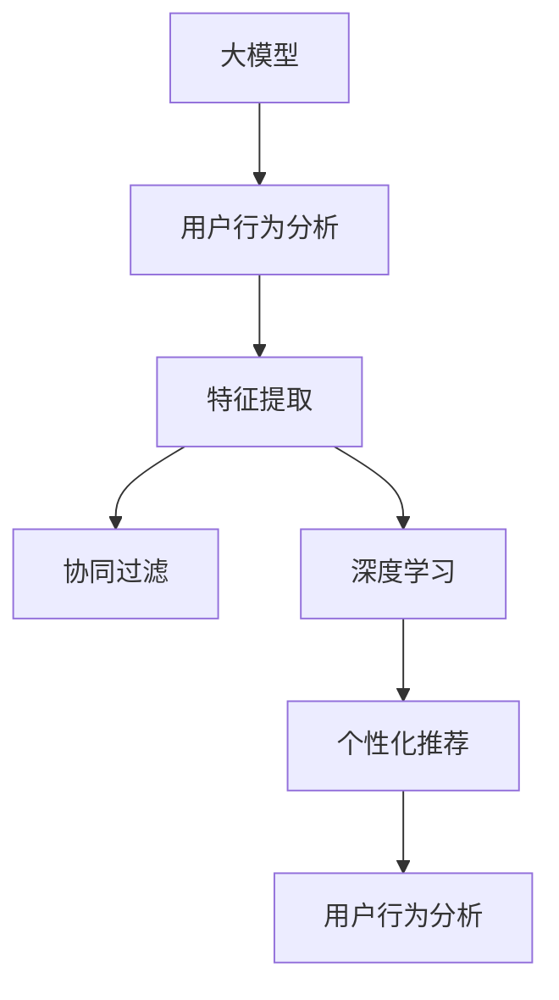

                 

# AI大模型在个性化搜索推荐中的应用探索

> 关键词：大模型,个性化推荐系统,深度学习,搜索推荐,用户行为分析,协同过滤,自然语言处理,神经网络

## 1. 背景介绍

### 1.1 问题由来
在信息爆炸的互联网时代，搜索引擎已不再是简单的信息检索工具，更是一个个性化信息推荐的平台。搜索引擎的推荐功能，可以通过对用户查询行为和历史数据的分析，预测用户可能感兴趣的内容，提升用户体验和信息获取效率。传统推荐系统多依赖于用户行为数据，难以捕捉用户的深层次兴趣和需求。大模型的涌现，为个性化搜索推荐带来了新的思路。

### 1.2 问题核心关键点
现代推荐系统在利用大模型的过程中，主要面临以下核心问题：
1. **数据需求**：不同用户的查询意图和兴趣多样，数据标注工作量大。
2. **特征表示**：如何高效地将用户和物品的特征转化为机器可理解的形式。
3. **推荐效率**：大模型的计算复杂度高，实时推荐能力有待提升。
4. **跨领域通用性**：如何构建通用模型，支持不同领域的信息推荐。

## 2. 核心概念与联系

### 2.1 核心概念概述

为更好地理解AI大模型在个性化搜索推荐中的应用，我们首先介绍几个关键概念：

- **AI大模型**：以深度神经网络为代表的模型，参数量庞大，能高效地进行特征提取和模式学习。如BERT、GPT等。
- **推荐系统**：通过分析用户历史行为和偏好，推荐个性化内容。常分为基于协同过滤和基于内容的推荐系统。
- **深度学习**：利用神经网络进行特征提取和模式学习的技术。通过多层神经网络构建复杂特征表示，增强推荐效果。
- **协同过滤**：通过用户或物品的相似度计算推荐内容，常用于数据稀疏场景。
- **自然语言处理(NLP)**：利用大模型处理自然语言，进行文本特征提取和语义理解。

这些概念相互交织，共同构成了个性化搜索推荐的核心框架，推动了推荐技术的不断演进。

### 2.2 核心概念原理和架构的 Mermaid 流程图



该流程图展示了从用户行为分析到大模型特征提取，再到协同过滤和深度学习推荐的推荐流程：

1. **用户行为分析**：通过记录和分析用户的历史查询和浏览行为，提取用户兴趣特征。
2. **特征提取**：利用大模型对用户和物品进行特征提取，生成向量表示。
3. **协同过滤**：基于用户和物品的相似度计算，推荐相似的物品或用户。
4. **深度学习推荐**：通过多层神经网络，学习复杂特征表示，提升推荐精度。
5. **个性化推荐**：综合用户特征和物品特征，生成个性化推荐结果。

## 3. 核心算法原理 & 具体操作步骤
### 3.1 算法原理概述

个性化搜索推荐的核心在于高效地进行用户行为分析、特征提取和模式学习。AI大模型通过预训练获得的广泛知识，可以更高效地处理自然语言特征，提升推荐精度。

基于大模型的个性化搜索推荐主要流程如下：
1. **用户行为分析**：通过用户的历史查询、点击、浏览等行为，生成用户行为序列。
2. **特征提取**：利用大模型对用户行为序列进行编码，生成用户兴趣向量。
3. **物品表示学习**：对推荐物品的标题、描述等文本信息进行编码，生成物品特征向量。
4. **协同过滤**：通过计算用户和物品的相似度，推荐相似的物品。
5. **深度学习推荐**：利用神经网络学习用户和物品的复杂特征表示，提升推荐效果。

### 3.2 算法步骤详解

以下详细介绍基于大模型的个性化搜索推荐的算法步骤：

**Step 1: 数据准备**
- 收集用户的历史查询记录、点击行为、浏览历史等数据。
- 对数据进行清洗和标注，确保数据质量和多样性。

**Step 2: 用户行为序列生成**
- 将用户的查询行为、点击行为等序列化，生成用户行为序列。
- 通过一定的编码方式，将行为序列转化为机器可理解的形式，如序列嵌入等。

**Step 3: 特征提取**
- 利用大模型对用户行为序列进行编码，生成用户兴趣向量。
- 对推荐物品的文本信息进行编码，生成物品特征向量。

**Step 4: 协同过滤推荐**
- 基于用户和物品的相似度计算，推荐相似的物品。
- 可以使用基于邻域的相似度计算方法，如余弦相似度、Pearson相关系数等。

**Step 5: 深度学习推荐**
- 利用神经网络模型对用户和物品的复杂特征进行学习。
- 常用的模型包括循环神经网络(RNN)、长短期记忆网络(LSTM)、Transformer等。

**Step 6: 个性化推荐**
- 综合用户特征和物品特征，生成个性化推荐结果。
- 可以采用基于排序的推荐方法，如点乘排序、矩阵分解等。

### 3.3 算法优缺点

基于大模型的个性化搜索推荐方法具有以下优点：
1. **高精度**：大模型通过大规模预训练，能够捕捉到复杂的语义信息，提升推荐精度。
2. **广泛适用**：可以应用于多种信息推荐场景，包括文本、图片、视频等。
3. **高效特征提取**：大模型能够高效地处理大规模自然语言数据，减少特征工程工作量。
4. **动态适应**：大模型能够实时学习和更新用户兴趣，提升推荐的时效性。

同时，该方法也存在一些局限性：
1. **数据依赖性**：推荐效果依赖于标注数据的丰富程度，缺乏标注数据时难以发挥优势。
2. **计算资源需求高**：大模型计算复杂度高，需要高性能计算资源支持。
3. **黑盒性质**：大模型的复杂性导致其内部工作机制难以解释，难以进行可解释性分析。
4. **过拟合风险**：在标注数据不足的情况下，大模型容易过拟合，导致泛化性能下降。

尽管存在这些局限性，但就目前而言，基于大模型的推荐方法在推荐精度和效果上仍处于领先地位，广泛应用于电商、新闻、视频等多个领域。

### 3.4 算法应用领域

基于大模型的个性化搜索推荐，已经在电商、新闻、视频等多个领域得到了广泛应用。

- **电商推荐**：电商网站可以根据用户浏览记录和点击行为，推荐商品和广告。例如Amazon使用深度学习推荐系统，提升商品推荐准确率。
- **新闻推荐**：新闻平台可以根据用户的阅读历史和点击行为，推荐相关新闻。例如今日头条利用深度学习模型，个性化推荐新闻内容。
- **视频推荐**：视频平台可以根据用户的观看历史和评分数据，推荐相似视频。例如Netflix使用协同过滤和深度学习混合推荐方法，提升推荐效果。
- **旅游推荐**：旅游应用可以根据用户的旅行记录和评分，推荐旅游目的地。例如携程使用基于深度学习的推荐系统，提升旅游目的地推荐效果。

## 4. 数学模型和公式 & 详细讲解  
### 4.1 数学模型构建

本节将介绍基于大模型的个性化搜索推荐的数学模型。

记用户行为序列为 $x=\{x_i\}_{i=1}^n$，物品特征向量为 $y=\{y_j\}_{j=1}^m$。其中 $x_i$ 和 $y_j$ 分别表示用户行为和物品特征的编码表示。

定义用户兴趣向量为 $u_x = W_x x$，物品特征向量为 $u_y = W_y y$，其中 $W_x$ 和 $W_y$ 为用户和物品的嵌入矩阵。推荐系统的目标函数为：

$$
\min_{\theta} \frac{1}{N} \sum_{i=1}^N \sum_{j=1}^m (r_{ij} - u_x^T u_y)^2
$$

其中 $r_{ij}$ 为样本 $(i,j)$ 的真实评分。

### 4.2 公式推导过程

根据目标函数，定义损失函数为：

$$
\mathcal{L} = \frac{1}{N} \sum_{i=1}^N \sum_{j=1}^m (r_{ij} - u_x^T u_y)^2
$$

通过反向传播算法计算损失函数对嵌入矩阵 $W_x$ 和 $W_y$ 的梯度，进行参数更新：

$$
\frac{\partial \mathcal{L}}{\partial W_x} = -2 \frac{1}{N} \sum_{i=1}^N \sum_{j=1}^m (r_{ij} - u_x^T u_y) \frac{\partial u_x}{\partial W_x} \frac{\partial u_y}{\partial W_y} y_j
$$

$$
\frac{\partial \mathcal{L}}{\partial W_y} = -2 \frac{1}{N} \sum_{i=1}^N \sum_{j=1}^m (r_{ij} - u_x^T u_y) u_x \frac{\partial u_y}{\partial W_y}
$$

其中 $\frac{\partial u_x}{\partial W_x}$ 和 $\frac{\partial u_y}{\partial W_y}$ 为嵌入矩阵的求导结果，通过链式法则和矩阵求导公式计算得到。

### 4.3 案例分析与讲解

**电商推荐案例**：假设电商平台收集到用户浏览记录 $x=\{(商品ID,浏览时间)\}_{i=1}^n$，和用户的评分数据 $y=\{(商品ID,评分)\}_{j=1}^m$。首先对用户行为序列进行编码，生成用户兴趣向量 $u_x$ 和物品特征向量 $u_y$，然后利用深度学习模型进行特征学习和相似度计算，生成推荐结果。

**新闻推荐案例**：新闻平台收集到用户阅读历史 $x=\{(文章ID,阅读时间)\}_{i=1}^n$，和用户的评分数据 $y=\{(文章ID,评分)\}_{j=1}^m$。首先对用户行为序列进行编码，生成用户兴趣向量 $u_x$ 和物品特征向量 $u_y$，然后利用协同过滤方法计算相似度，生成推荐结果。

## 5. 项目实践：代码实例和详细解释说明
### 5.1 开发环境搭建

在进行推荐系统开发前，我们需要准备好开发环境。以下是使用Python进行TensorFlow开发的Python环境配置流程：

1. 安装Anaconda：从官网下载并安装Anaconda，用于创建独立的Python环境。

2. 创建并激活虚拟环境：
```bash
conda create -n tf-env python=3.8 
conda activate tf-env
```

3. 安装TensorFlow：根据CUDA版本，从官网获取对应的安装命令。例如：
```bash
pip install tensorflow==2.7
```

4. 安装各类工具包：
```bash
pip install numpy pandas scikit-learn matplotlib tqdm jupyter notebook ipython
```

完成上述步骤后，即可在`tf-env`环境中开始推荐系统开发。

### 5.2 源代码详细实现

这里我们以电商推荐系统为例，给出使用TensorFlow进行深度学习推荐系统的PyTorch代码实现。

首先，定义推荐系统的基本架构：

```python
import tensorflow as tf
from tensorflow.keras.layers import Input, Embedding, Dot, Dense

user_input = Input(shape=(max_seq_length,), dtype='int32')
user_embedding = Embedding(user_embed_size, embedding_size)(user_input)

item_input = Input(shape=(max_seq_length,), dtype='int32')
item_embedding = Embedding(item_embed_size, embedding_size)(item_input)

dot_product = Dot(axes=1)([user_embedding, item_embedding])
dot_output = Dense(1, activation='sigmoid')(dot_product)

model = tf.keras.Model(inputs=[user_input, item_input], outputs=dot_output)
model.compile(loss='binary_crossentropy', optimizer='adam', metrics=['accuracy'])
```

接着，加载数据集和进行模型训练：

```python
from tensorflow.keras.datasets import mnist
from tensorflow.keras.preprocessing.sequence import pad_sequences

(x_train, y_train), (x_test, y_test) = mnist.load_data()

# 将数据转换为模型输入所需的格式
x_train = pad_sequences(x_train, maxlen=max_seq_length)
x_test = pad_sequences(x_test, maxlen=max_seq_length)
y_train = to_categorical(y_train)
y_test = to_categorical(y_test)

# 训练模型
model.fit([x_train, x_train], y_train, epochs=num_epochs, batch_size=batch_size, validation_data=([x_test, x_test], y_test), verbose=1)
```

最后，在测试集上评估模型的性能：

```python
test_loss, test_accuracy = model.evaluate([x_test, x_test], y_test, verbose=1)
print('Test accuracy:', test_accuracy)
```

以上就是使用TensorFlow进行电商推荐系统深度学习模型的完整代码实现。可以看到，TensorFlow提供了便捷的Keras API，使得模型构建和训练过程变得简单高效。

### 5.3 代码解读与分析

让我们再详细解读一下关键代码的实现细节：

**Input层**：用于输入用户和物品的行为序列，形状为`(max_seq_length,)`。

**Embedding层**：将行为序列转换为向量表示，使用`Embedding`层进行嵌入操作。

**Dot层**：计算用户和物品的相似度，使用`Dot`层进行点乘操作。

**Dense层**：输出推荐结果，使用`Dense`层进行全连接操作。

**model.compile**：定义模型的损失函数、优化器和评估指标。

**model.fit**：训练模型，输入训练集和测试集。

**model.evaluate**：在测试集上评估模型性能，输出准确率。

## 6. 实际应用场景
### 6.1 电商推荐

电商推荐是推荐系统最早的应用之一，通过分析用户浏览记录和评分数据，推荐商品和广告，提高用户购买转化率。基于大模型的电商推荐系统，能够高效地处理自然语言数据，捕捉用户的多样化需求。

在技术实现上，可以收集用户的浏览记录和评分数据，通过文本处理和编码操作，生成用户行为序列和物品特征向量。然后，利用深度学习模型，对用户和物品的特征进行学习和相似度计算，生成推荐结果。

### 6.2 新闻推荐

新闻推荐系统通过对用户的阅读历史和评分数据进行分析和建模，推荐用户可能感兴趣的新闻内容。大模型的引入，使得新闻推荐系统能够处理大规模自然语言数据，捕捉用户的长尾需求。

在实践中，可以收集用户的阅读历史和评分数据，通过文本处理和编码操作，生成用户行为序列和物品特征向量。然后，利用协同过滤或深度学习模型，对用户和物品的特征进行相似度计算，生成推荐结果。

### 6.3 视频推荐

视频推荐系统通过对用户的观看历史和评分数据进行分析和建模，推荐用户可能感兴趣的视频内容。大模型的引入，使得视频推荐系统能够处理大规模视频数据，捕捉用户的多样化需求。

在实践中，可以收集用户的观看历史和评分数据，通过视频处理和编码操作，生成用户行为序列和物品特征向量。然后，利用协同过滤或深度学习模型，对用户和物品的特征进行相似度计算，生成推荐结果。

## 7. 工具和资源推荐
### 7.1 学习资源推荐

为了帮助开发者系统掌握大模型在推荐系统中的应用，这里推荐一些优质的学习资源：

1. 《深度学习推荐系统》课程：由斯坦福大学开设的推荐系统经典课程，涵盖了从协同过滤到深度学习等多种推荐算法。

2. 《TensorFlow实战》书籍：TensorFlow官方出版的实战指南，详细介绍了TensorFlow在推荐系统中的应用。

3. 《推荐系统》书籍：详细介绍推荐系统的理论基础和实际应用，适合初学者和中级开发者。

4. Kaggle竞赛：参加Kaggle的推荐系统竞赛，实战练习推荐算法，提升实战能力。

5. PyTorch官方文档：详细介绍了PyTorch在推荐系统中的应用，适合深度学习开发者。

通过对这些资源的学习实践，相信你一定能够快速掌握大模型在推荐系统中的应用，并用于解决实际的推荐问题。
### 7.2 开发工具推荐

高效的开发离不开优秀的工具支持。以下是几款用于推荐系统开发的常用工具：

1. TensorFlow：由Google主导开发的深度学习框架，生产部署方便，适合大规模工程应用。

2. PyTorch：基于Python的开源深度学习框架，灵活动态的计算图，适合快速迭代研究。

3. Weights & Biases：模型训练的实验跟踪工具，可以记录和可视化模型训练过程中的各项指标，方便对比和调优。

4. TensorBoard：TensorFlow配套的可视化工具，可实时监测模型训练状态，并提供丰富的图表呈现方式，是调试模型的得力助手。

5. Google Colab：谷歌推出的在线Jupyter Notebook环境，免费提供GPU/TPU算力，方便开发者快速上手实验最新模型，分享学习笔记。

合理利用这些工具，可以显著提升推荐系统开发效率，加快创新迭代的步伐。

### 7.3 相关论文推荐

推荐系统领域的研究十分活跃，以下是几篇经典论文，推荐阅读：

1. Matrix Factorization Techniques for Recommender Systems：提出矩阵分解算法，通过分解用户-物品矩阵，生成推荐结果。

2. Neural Collaborative Filtering：利用神经网络对协同过滤算法进行改进，提高推荐效果。

3. Deep Personalized Ranking using Multi-Task Learning：通过多任务学习，结合用户和物品的特征，提升推荐效果。

4. Sequence-aware Recommender Networks：提出序列网络，通过记忆和预测，提升推荐的时效性和精度。

5. Learning Deep Architectures for Latent Variable Modeling：通过深度架构学习，提升推荐系统的复杂特征表示能力。

这些论文代表了推荐系统领域的经典研究成果，适合深入理解推荐算法的理论基础和应用实践。

## 8. 总结：未来发展趋势与挑战
### 8.1 总结

本文对基于大模型的个性化搜索推荐方法进行了全面系统的介绍。首先阐述了推荐系统的背景和个性化推荐的应用，明确了大模型在推荐系统中的关键作用。其次，从原理到实践，详细讲解了推荐系统的数学模型和实现步骤，给出了推荐系统开发的完整代码实例。同时，本文还广泛探讨了推荐系统在大模型中的应用场景，展示了其广阔的应用前景。最后，精选了推荐系统的各类学习资源，力求为开发者提供全方位的技术指引。

通过本文的系统梳理，可以看到，大模型在推荐系统中扮演了至关重要的角色，极大地提升了推荐精度和效果。随着大模型技术的不断进步，推荐系统将在更多领域得到应用，为各行各业带来新的业务价值。未来，伴随大模型技术的持续演进，推荐系统必将在各行业继续扮演重要的角色。

### 8.2 未来发展趋势

展望未来，推荐系统在大模型应用方面将呈现以下几个发展趋势：

1. **多模态融合**：将大模型应用于多模态数据融合，提升推荐系统对复杂场景的理解能力。例如，将文本、图像、视频等多模态信息进行融合，提升推荐效果。

2. **实时推荐**：利用流式数据处理和实时学习技术，提升推荐系统的时间效率和用户响应速度。例如，实时分析用户行为，动态生成推荐结果。

3. **自适应推荐**：通过持续学习和用户反馈，实现推荐系统的自适应调整。例如，根据用户行为反馈，动态调整推荐策略和算法。

4. **跨领域推荐**：将大模型应用于不同领域的推荐系统，提升推荐系统的泛化能力和跨领域适应能力。例如，将推荐系统应用于电商、新闻、音乐等多个领域。

5. **可解释性增强**：提高推荐系统的可解释性，增强用户的信任和接受度。例如，引入可解释性技术，解释推荐系统的决策过程。

6. **隐私保护**：加强用户数据隐私保护，确保数据安全。例如，采用差分隐私技术，保护用户隐私。

以上趋势凸显了推荐系统在大模型应用中的广阔前景。这些方向的探索发展，必将进一步提升推荐系统的性能和应用范围，为各行业带来新的业务价值。

### 8.3 面临的挑战

尽管大模型在推荐系统中的应用取得了瞩目成就，但在迈向更加智能化、普适化应用的过程中，它仍面临着诸多挑战：

1. **数据依赖性**：推荐效果依赖于标注数据的丰富程度，缺乏标注数据时难以发挥优势。如何进一步降低推荐系统对标注样本的依赖，将是一大难题。

2. **计算资源需求高**：大模型计算复杂度高，需要高性能计算资源支持。如何在保持推荐效果的前提下，优化资源使用，降低计算成本，将是重要的优化方向。

3. **黑盒性质**：大模型的复杂性导致其内部工作机制难以解释，难以进行可解释性分析。如何赋予推荐系统更强的可解释性，将是亟待攻克的难题。

4. **过拟合风险**：在标注数据不足的情况下，大模型容易过拟合，导致泛化性能下降。如何构建稳健的推荐系统，避免过拟合，确保其泛化能力，仍需深入研究。

5. **隐私保护**：推荐系统涉及用户行为数据的处理和分析，用户隐私保护尤为重要。如何在保证推荐效果的同时，保障用户数据隐私，是一个重要的挑战。

6. **可扩展性**：推荐系统在大规模数据和高并发流量的情况下，系统可扩展性需要得到保障。如何在保证性能的同时，优化系统架构，提升扩展能力，是一个重要的挑战。

这些挑战表明，尽管大模型在推荐系统中展现出巨大潜力，但如何在技术层面和应用层面进行全面优化，仍需要持续努力和探索。

### 8.4 研究展望

面对推荐系统在大模型应用中所面临的挑战，未来的研究需要在以下几个方面寻求新的突破：

1. **多模态推荐**：将大模型应用于多模态数据融合，提升推荐系统对复杂场景的理解能力。例如，将文本、图像、视频等多模态信息进行融合，提升推荐效果。

2. **实时推荐**：利用流式数据处理和实时学习技术，提升推荐系统的时间效率和用户响应速度。例如，实时分析用户行为，动态生成推荐结果。

3. **自适应推荐**：通过持续学习和用户反馈，实现推荐系统的自适应调整。例如，根据用户行为反馈，动态调整推荐策略和算法。

4. **跨领域推荐**：将大模型应用于不同领域的推荐系统，提升推荐系统的泛化能力和跨领域适应能力。例如，将推荐系统应用于电商、新闻、音乐等多个领域。

5. **可解释性增强**：提高推荐系统的可解释性，增强用户的信任和接受度。例如，引入可解释性技术，解释推荐系统的决策过程。

6. **隐私保护**：加强用户数据隐私保护，确保数据安全。例如，采用差分隐私技术，保护用户隐私。

这些研究方向将推动推荐系统在大模型应用中的不断进步，为各行业带来新的业务价值。未来，伴随大模型技术的持续演进，推荐系统必将在各行业继续扮演重要的角色。

## 9. 附录：常见问题与解答
----------------------------------------------------------------

**Q1：大模型在推荐系统中的优势是什么？**

A: 大模型在推荐系统中的优势主要体现在以下几个方面：

1. **高效特征提取**：大模型能够高效地处理大规模自然语言数据，减少特征工程工作量。

2. **高精度推荐**：大模型通过大规模预训练，能够捕捉到复杂的语义信息，提升推荐精度。

3. **广泛适用性**：可以应用于多种信息推荐场景，包括文本、图片、视频等。

4. **动态适应**：大模型能够实时学习和更新用户兴趣，提升推荐的时效性。

**Q2：推荐系统如何进行用户行为序列生成？**

A: 推荐系统通常通过记录和分析用户的历史查询、点击、浏览等行为，生成用户行为序列。具体步骤如下：

1. 收集用户的历史查询记录、点击行为、浏览历史等数据。

2. 对数据进行清洗和标注，确保数据质量和多样性。

3. 将用户的行为序列进行编码，转化为机器可理解的形式，如序列嵌入等。

**Q3：推荐系统如何进行特征提取？**

A: 推荐系统通常通过大模型对用户和物品进行特征提取，生成向量表示。具体步骤如下：

1. 收集用户的历史查询记录、点击行为、浏览历史等数据。

2. 对数据进行清洗和标注，确保数据质量和多样性。

3. 利用大模型对用户行为序列进行编码，生成用户兴趣向量。

4. 对推荐物品的文本信息进行编码，生成物品特征向量。

**Q4：推荐系统如何进行协同过滤推荐？**

A: 推荐系统通常通过计算用户和物品的相似度，推荐相似的物品。具体步骤如下：

1. 收集用户的历史查询记录、点击行为、浏览历史等数据。

2. 对数据进行清洗和标注，确保数据质量和多样性。

3. 利用大模型对用户行为序列进行编码，生成用户兴趣向量。

4. 对推荐物品的文本信息进行编码，生成物品特征向量。

5. 基于用户和物品的相似度计算，推荐相似的物品。

**Q5：推荐系统如何进行深度学习推荐？**

A: 推荐系统通常通过利用神经网络模型对用户和物品的复杂特征进行学习，提升推荐效果。具体步骤如下：

1. 收集用户的历史查询记录、点击行为、浏览历史等数据。

2. 对数据进行清洗和标注，确保数据质量和多样性。

3. 利用大模型对用户行为序列进行编码，生成用户兴趣向量。

4. 对推荐物品的文本信息进行编码，生成物品特征向量。

5. 利用深度学习模型对用户和物品的特征进行学习和相似度计算，生成推荐结果。

**Q6：推荐系统如何进行个性化推荐？**

A: 推荐系统通常通过综合用户特征和物品特征，生成个性化推荐结果。具体步骤如下：

1. 收集用户的历史查询记录、点击行为、浏览历史等数据。

2. 对数据进行清洗和标注，确保数据质量和多样性。

3. 利用大模型对用户行为序列进行编码，生成用户兴趣向量。

4. 对推荐物品的文本信息进行编码，生成物品特征向量。

5. 利用深度学习模型对用户和物品的特征进行学习和相似度计算，生成推荐结果。

6. 综合用户特征和物品特征，生成个性化推荐结果。

**Q7：推荐系统如何进行多模态融合？**

A: 推荐系统通常通过将大模型应用于多模态数据融合，提升推荐系统对复杂场景的理解能力。具体步骤如下：

1. 收集用户的历史查询记录、点击行为、浏览历史等数据。

2. 对数据进行清洗和标注，确保数据质量和多样性。

3. 利用大模型对用户行为序列进行编码，生成用户兴趣向量。

4. 对推荐物品的文本信息进行编码，生成物品特征向量。

5. 利用深度学习模型对用户和物品的特征进行学习和相似度计算，生成推荐结果。

6. 将文本、图像、视频等多模态信息进行融合，提升推荐效果。

以上是对大模型在个性化搜索推荐中的详细介绍。通过本文的系统梳理，可以看到，大模型在推荐系统中的应用前景广阔，有待进一步探索和优化。

