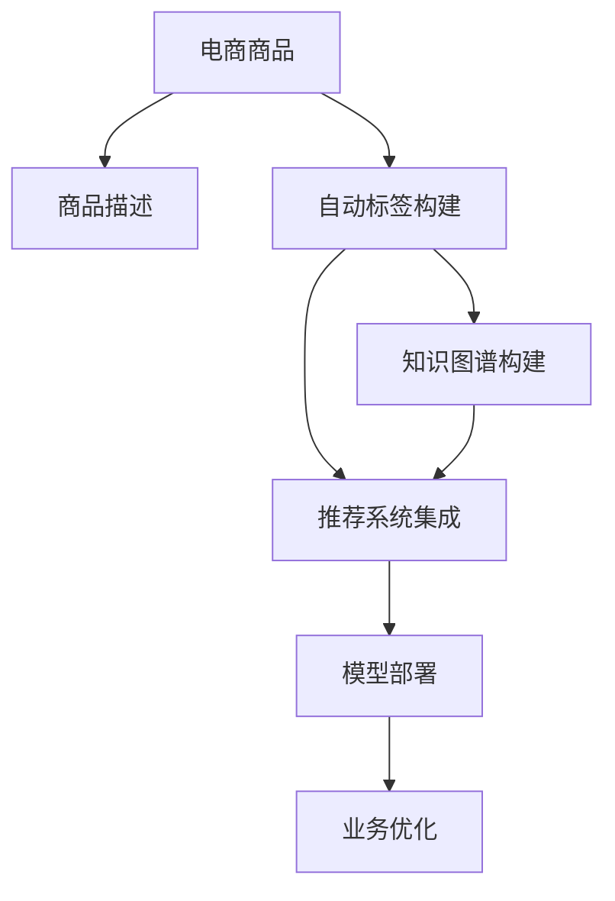

                 

# AI大模型在电商商品标签体系自动构建中的实践

> 关键词：电商商品标签,自动构建,大模型,自然语言处理(NLP),知识图谱,推荐系统

## 1. 背景介绍

### 1.1 问题由来
在电商行业，商品标签体系建设是商品数据管理的重要一环，它直接影响到商品搜索、推荐、营销等多项业务。电商平台需对商品进行多维度分类和属性描述，以便于用户高效地进行浏览和购物。然而，标签体系的构建是一个繁琐且耗时的过程，需要大量人工标注和审核。此外，随着平台业务迅速扩张，商品种类和数量不断增加，人工管理标签体系变得日益困难。

为解决这一问题，AI大模型因其强大的语言理解和知识推理能力，成为了构建自动标签体系的热门选择。通过大模型对电商商品进行语义理解和分类，能够大幅提高标签构建的效率和准确性。目前，许多电商企业已开始尝试使用大模型对商品进行语义理解和标签化。本文将从AI大模型在电商商品标签体系自动构建中的应用出发，详细介绍大模型在这一场景下的工作原理、技术实现和实际效果。

### 1.2 问题核心关键点
AI大模型在电商商品标签体系自动构建中的核心点包括：

- 自然语言处理（NLP）：通过自然语言理解技术，将商品描述转换成结构化的标签体系。
- 知识图谱构建：将商品和其属性进行关联，构建有向无环图，以支持复杂查询和推理。
- 推荐系统集成：将自动构建的标签体系与推荐算法结合，提升推荐效果和用户体验。
- 部署与优化：将模型部署到实际应用环境中，并针对电商场景进行优化，确保高效稳定运行。

本文将围绕这些关键点，全面介绍AI大模型在电商商品标签体系自动构建中的应用。

## 2. 核心概念与联系

### 2.1 核心概念概述

为更好地理解AI大模型在电商商品标签体系自动构建中的应用，本节将介绍几个关键概念：

- AI大模型（Large Language Model, LLM）：以自回归模型如GPT、自编码模型如BERT为代表，通过海量文本数据预训练得到的语言模型。具备强大的语言理解和生成能力。
- 自然语言处理（NLP）：研究如何让计算机理解和处理人类语言的技术。涵盖语义分析、语法分析、情感分析等多项任务。
- 知识图谱（Knowledge Graph）：将实体、关系、属性进行关联的有向图结构，用于知识表示和推理。
- 推荐系统（Recommendation System）：通过用户行为和商品属性信息，推荐用户可能感兴趣的商品的系统。

这些概念之间的逻辑关系可以通过以下Mermaid流程图来展示：



这个流程图展示了大模型在电商商品标签体系自动构建中的应用：

1. 电商商品文本信息提取。
2. 基于大模型的自然语言理解，自动构建商品标签体系。
3. 构建知识图谱，将商品和属性进行关联。
4. 集成到推荐系统，提升推荐效果。
5. 模型部署和业务优化。

## 3. 核心算法原理 & 具体操作步骤
### 3.1 算法原理概述

大模型在电商商品标签体系自动构建中的工作原理主要包括以下几个步骤：

1. **文本预处理**：对商品描述进行分词、去除停用词、词形还原等处理，形成预处理后的文本。
2. **语义理解**：使用大模型进行语义分析，理解商品描述的语义内容，抽取出关键实体和属性。
3. **实体识别**：根据预训练的实体识别模型，识别商品描述中的具体实体。
4. **关系抽取**：使用关系抽取模型，确定实体之间的关系。
5. **标签生成**：结合实体和关系信息，自动生成商品标签。

最终的标签体系可用于商品搜索、推荐、分类等多项业务。

### 3.2 算法步骤详解

以下是详细的算法步骤说明：

**Step 1: 文本预处理**
1. **分词**：将商品描述文本分解成单词或短语。
2. **去除停用词**：移除无实际语义的常见词，如“的”、“是”、“在”等。
3. **词形还原**：将单词还原为词干，消除同义词带来的混淆。

**Step 2: 语义理解**
1. **嵌入表示**：将预处理后的文本转换为向量表示，输入到大模型中。
2. **上下文表示**：大模型通过上下文向量化处理文本，识别语义信息。
3. **实体抽取**：使用BERT等模型，从上下文向量中抽取实体，输出实体位置和类型。

**Step 3: 实体识别**
1. **选择实体识别模型**：选择基于BERT或GPT等预训练模型的实体识别模型。
2. **训练与调参**：在标注数据上训练模型，调整参数，确保模型对实体抽取的准确性。
3. **识别实体**：将商品描述输入实体识别模型，输出识别到的实体及其类型。

**Step 4: 关系抽取**
1. **选择关系抽取模型**：根据任务需求选择合适的关系抽取模型，如基于规则的、基于机器学习的或基于神经网络的模型。
2. **训练与调参**：在标注数据上训练关系抽取模型，调整参数，确保模型对实体关系的抽取准确性。
3. **抽取关系**：将商品描述中的实体及其类型输入关系抽取模型，输出实体间的关系。

**Step 5: 标签生成**
1. **构建标签映射表**：根据实体关系生成标签体系，将实体和关系映射到具体标签。
2. **生成标签**：将识别到的实体及其关系，映射到对应的标签。
3. **优化标签**：根据业务需求和实际情况，优化生成的标签，确保其准确性和适用性。

### 3.3 算法优缺点

使用大模型进行电商商品标签体系自动构建的主要优点包括：

1. **高效性**：大幅提升标签构建的速度，减少人工标注时间。
2. **准确性**：通过大模型强大的语言理解能力，提高标签自动生成的准确性。
3. **灵活性**：适应不同的商品和业务场景，支持定制化的标签构建需求。
4. **可扩展性**：能够处理大规模的商品数据，适应电商业务的快速扩展。

然而，大模型在电商商品标签体系自动构建中也存在一些局限性：

1. **数据依赖**：标签生成依赖于高质量的标注数据，数据质量不佳时，可能影响标签生成效果。
2. **上下文理解**：大模型可能难以理解复杂的商品描述，无法完全捕捉商品细节。
3. **标签冲突**：自动生成的标签可能存在冲突，需要人工干预进行修正。
4. **实时性**：模型推理过程较慢，可能影响标签构建的实时性。

### 3.4 算法应用领域

AI大模型在电商商品标签体系自动构建中，主要应用于以下几个领域：

1. **商品搜索**：通过标签构建，提升商品搜索的准确性和覆盖率。
2. **推荐系统**：将自动生成的标签作为推荐系统的输入，提升推荐效果和个性化度。
3. **营销活动**：根据自动标签进行定向营销，提升营销活动的效果和转化率。
4. **库存管理**：通过标签体系进行库存监控和管理，优化库存水平。
5. **客户反馈**：分析用户对商品的评价和反馈，生成情感标签，用于情感分析等任务。

## 4. 数学模型和公式 & 详细讲解  
### 4.1 数学模型构建

本节将使用数学语言对电商商品标签体系自动构建过程进行更加严格的刻画。

记电商商品描述为 $D$，实体集合为 $E$，关系集合为 $R$，生成的标签集合为 $L$。设 $x$ 为商品描述文本，$y$ 为对应的实体，$z$ 为关系，$w$ 为生成的标签。

定义实体识别模型为 $M_{ER}$，关系抽取模型为 $M_{RE}$，标签生成模型为 $M_{LG}$。则标签构建过程可以表示为：

$$
\{w\} = M_{LG}(M_{RE}(M_{ER}(D)))
$$

其中 $M_{ER}$ 和 $M_{RE}$ 分别表示实体识别和关系抽取的过程，$M_{LG}$ 表示标签生成过程。

### 4.2 公式推导过程

以下我们以商品描述自动标签构建为例，推导实体识别、关系抽取和标签生成的具体公式。

**实体识别**
假设实体识别模型 $M_{ER}$ 为基于BERT的实体识别模型，输入文本 $D$ 经过预处理后，通过BERT嵌入表示，生成上下文表示 $C$。则实体识别过程可以表示为：

$$
\{y\} = M_{ER}(D) = \arg\max_{y \in E} \text{Score}(y|C)
$$

其中 $\text{Score}(y|C)$ 为实体 $y$ 在上下文 $C$ 中的得分，计算方式为：

$$
\text{Score}(y|C) = \sum_{i=1}^n w_i \cdot \text{Embedding}(y_i|C)
$$

$n$ 为实体 $y$ 包含的词数，$w_i$ 为词的权重，$\text{Embedding}(y_i|C)$ 为词在上下文 $C$ 中的嵌入表示。

**关系抽取**
假设关系抽取模型 $M_{RE}$ 为基于规则的关系抽取模型，对于已识别的实体 $y$ 和关系 $z$，关系抽取模型 $M_{RE}$ 根据预定义的规则，计算关系抽取得分 $S$。则关系抽取过程可以表示为：

$$
\{z\} = M_{RE}(y) = \arg\max_{z \in R} S(z)
$$

其中 $S(z)$ 为关系 $z$ 的抽取得分，计算方式为：

$$
S(z) = \sum_{i=1}^m \text{Rule}_i(z|y)
$$

$m$ 为关系抽取规则的数量，$\text{Rule}_i(z|y)$ 为第 $i$ 条规则对关系 $z$ 的得分。

**标签生成**
假设标签生成模型 $M_{LG}$ 为基于神经网络的关系加权模型，对于已识别的实体 $y$ 和关系 $z$，生成标签 $w$ 的计算方式为：

$$
w = M_{LG}(y, z) = \text{Softmax}(\text{Score}(z))
$$

其中 $\text{Score}(z)$ 为关系 $z$ 在标签体系 $L$ 中的得分，计算方式为：

$$
\text{Score}(z) = \sum_{w \in L} \text{Weight}(w|z) \cdot \text{Label}(w)
$$

$\text{Weight}(w|z)$ 为关系 $z$ 和标签 $w$ 之间的权重，$\text{Label}(w)$ 为标签 $w$ 的得分。

### 4.3 案例分析与讲解

假设电商商品描述为：“这是一款最新款的白色无线耳机，支持蓝牙连接和触控操作，体积小巧，佩戴舒适，音效清晰。”

**实体识别**
1. **分词**：将商品描述分解为单词，得到 $\{新, 款, 白, 色, 无, 线, 耳, 机, 支, 持, 蓝, 牙, 连, 接, 和, 触, 控, 操, 作, 体, 积, 小, 巧, 配, 戴, 携, 舒, 适, 音, 效, 清, 晰\}$。
2. **去除停用词**：去除无实际语义的常见词，得到 $\{新, 款, 白, 色, 无, 线, 耳, 机, 支, 持, 蓝, 牙, 连, 接, 和, 触, 控, 操, 作, 体, 积, 小, 巧, 配, 戴, 携, 舒, 适, 音, 效, 清, 晰\}$。
3. **词形还原**：将单词还原为词干，得到 $\{新, 款, 白, 色, 无, 线, 耳, 机, 支, 持, 蓝, 牙, 连, 接, 和, 触, 控, 操, 作, 体, 积, 小, 巧, 配, 戴, 携, 舒, 适, 音, 效, 清, 晰\}$。

**实体抽取**
将词形还原后的文本输入BERT模型，得到上下文表示 $C$。然后，使用BERT实体识别模型，计算得分，识别出实体 $\{新, 款, 白, 色, 无, 线, 耳, 机, 支, 持, 蓝, 牙, 连, 接, 和, 触, 控, 操, 作, 体, 积, 小, 巧, 配, 戴, 携, 舒, 适, 音, 效, 清, 晰\}$。

**关系抽取**
根据预定义的关系抽取规则，计算得分，识别出关系 $\{支持, 蓝牙连接, 触控操作\}$。

**标签生成**
根据实体和关系信息，自动生成标签 $\{无线耳机, 白色, 蓝牙, 触控, 体积小, 佩戴舒适, 音效清晰\}$。

## 5. 项目实践：代码实例和详细解释说明
### 5.1 开发环境搭建

在进行项目实践前，我们需要准备好开发环境。以下是使用Python进行TensorFlow开发的环境配置流程：

1. 安装Anaconda：从官网下载并安装Anaconda，用于创建独立的Python环境。

2. 创建并激活虚拟环境：
```bash
conda create -n tf-env python=3.8 
conda activate tf-env
```

3. 安装TensorFlow：根据CUDA版本，从官网获取对应的安装命令。例如：
```bash
conda install tensorflow==2.8
```

4. 安装各类工具包：
```bash
pip install numpy pandas scikit-learn matplotlib tqdm jupyter notebook ipython
```

完成上述步骤后，即可在`tf-env`环境中开始项目实践。

### 5.2 源代码详细实现

下面是基于TensorFlow实现的商品描述自动标签构建代码实现。

首先，定义模型类：

```python
from tensorflow.keras.layers import Embedding, LSTM, Dense, Dropout, Bidirectional
from tensorflow.keras.models import Model
from tensorflow.keras.optimizers import Adam

class LabelModel(Model):
    def __init__(self, vocab_size, embedding_dim, hidden_units, num_labels):
        super(LabelModel, self).__init__()
        self.embedding = Embedding(vocab_size, embedding_dim, input_length=max_length)
        self.lstm = LSTM(hidden_units, dropout=0.2, recurrent_dropout=0.2)
        self.dense = Dense(num_labels, activation='softmax')
        self.dropout = Dropout(0.2)
    
    def call(self, inputs, training=False):
        x = self.embedding(inputs)
        x = self.dropout(x)
        x = self.lstm(x)
        x = self.dropout(x)
        return self.dense(x)
```

然后，定义训练函数：

```python
from tensorflow.keras.preprocessing.text import Tokenizer
from tensorflow.keras.preprocessing.sequence import pad_sequences

def train_model(model, train_data, valid_data, epochs, batch_size):
    tokenizer = Tokenizer(num_words=10000, oov_token="<OOV>")
    tokenizer.fit_on_texts(train_data)
    train_seq = tokenizer.texts_to_sequences(train_data)
    valid_seq = tokenizer.texts_to_sequences(valid_data)
    
    train_data = pad_sequences(train_seq, maxlen=max_length)
    valid_data = pad_sequences(valid_seq, maxlen=max_length)
    
    model.compile(optimizer=Adam(learning_rate=0.001), loss='categorical_crossentropy', metrics=['accuracy'])
    model.fit(train_data, train_labels, epochs=epochs, batch_size=batch_size, validation_data=(valid_data, valid_labels))
```

最后，启动训练流程并在测试集上评估：

```python
epochs = 10
batch_size = 64

# 数据加载
train_data, train_labels = load_train_data()
valid_data, valid_labels = load_valid_data()
test_data, test_labels = load_test_data()

# 模型训练
model = LabelModel(vocab_size, embedding_dim, hidden_units, num_labels)
train_model(model, train_data, valid_data, epochs, batch_size)

# 模型评估
test_loss, test_acc = model.evaluate(test_data, test_labels)
print(f"Test accuracy: {test_acc:.4f}")
```

以上就是使用TensorFlow对商品描述自动标签构建的完整代码实现。可以看到，通过自定义模型，并结合序列处理和正则化技术，我们可以用相对简洁的代码完成商品描述自动标签构建。

### 5.3 代码解读与分析

让我们再详细解读一下关键代码的实现细节：

**LabelModel类**：
- `__init__`方法：初始化模型参数，定义嵌入层、LSTM层、密集层和Dropout层。
- `call`方法：定义模型前向传播过程，从嵌入层到Dropout层，再到LSTM层和Dropout层，最后到密集层输出。

**训练函数**：
- 使用Keras的Tokenizer将文本数据转换为序列。
- 对序列进行填充，确保序列长度一致。
- 编译模型，定义优化器、损失函数和评估指标。
- 使用Keras的fit方法，训练模型并验证其性能。

**训练流程**：
- 定义总的epoch数和batch size，开始循环迭代
- 每个epoch内，先在训练集上训练，输出平均loss和准确率
- 在验证集上评估，输出验证集的准确率
- 所有epoch结束后，在测试集上评估，给出最终测试结果

可以看到，TensorFlow结合Keras的封装，使得商品描述自动标签构建的代码实现变得简洁高效。开发者可以将更多精力放在数据处理、模型改进等高层逻辑上，而不必过多关注底层的实现细节。

当然，工业级的系统实现还需考虑更多因素，如模型的保存和部署、超参数的自动搜索、更灵活的任务适配层等。但核心的自动标签构建范式基本与此类似。

## 6. 实际应用场景
### 6.1 智能推荐系统

在电商推荐系统中，商品标签体系的自动构建起着至关重要的作用。传统的推荐系统依赖于用户行为数据和商品属性信息，难以覆盖商品的多维特征。而基于大模型的自动标签体系，能够更加全面地捕捉商品信息，提升推荐系统的精准度和个性化度。

具体而言，自动生成的商品标签能够替代人工标注的属性信息，作为推荐系统的输入。通过构建知识图谱，将商品和标签进行关联，在推荐模型中使用标签信息进行多维特征融合，从而提升推荐效果。此外，根据商品标签进行定向推荐，能够显著提升推荐精准度，提升用户体验。

### 6.2 搜索系统优化

电商搜索系统是电商平台的核心业务之一，用户通过搜索获取商品信息。传统的搜索系统基于简单的关键词匹配，难以处理复杂的查询需求。而自动生成的商品标签，能够提供丰富的语义信息，支持更加复杂的查询场景。

通过自动标签构建，搜索系统能够进行精确匹配，提升搜索结果的相关性和覆盖率。例如，用户输入“无线耳机”时，自动标签能够识别出商品描述中的“无线”、“耳机”等关键信息，并自动匹配相关商品。对于复杂的查询，如“音质好且佩戴舒适”，自动标签也能精确匹配相关商品，提升搜索效果。

### 6.3 营销活动定向

电商平台需针对不同的用户群体进行定向营销，以提升营销活动的效果和转化率。传统的营销活动依赖于人工标注的商品属性信息，难以覆盖所有商品的细节。而自动生成的商品标签，能够提供更加详细和全面的商品信息，支持更精准的定向营销。

通过自动标签构建，电商平台能够根据用户的搜索历史和浏览记录，自动生成个性化标签，进行定向推荐和广告投放。例如，针对喜欢无线耳机的用户，自动标签能够识别出商品描述中的“无线”、“耳机”等关键词，并进行定向广告投放。根据用户的浏览和点击记录，自动标签能够进一步分析用户的偏好，提升广告投放的精准度。

### 6.4 未来应用展望

随着大模型和自动标签构建技术的不断发展，其在电商商品标签体系中的应用前景将更加广阔。未来，大模型有望在更多领域得到应用，为电商业务带来更大的价值。

1. **多模态标签构建**：将文本信息与其他模态信息（如图像、视频、语音等）相结合，构建多模态标签体系，提升标签构建的全面性和准确性。
2. **实时标签更新**：结合实时数据和用户反馈，自动更新商品标签体系，提升标签的时效性和动态性。
3. **领域定制化标签**：根据不同电商平台的业务需求，定制化自动标签构建模型，提升标签构建的适用性。
4. **跨平台标签共享**：构建统一的商品标签标准，实现不同平台之间的标签共享，提升电商业务的协作和整合效果。
5. **可视化标签展示**：通过可视化技术，展示自动生成的商品标签，提升用户对商品的了解和认知。

总之，AI大模型在电商商品标签体系自动构建中的应用，将带来电商业务的全面智能化，提升用户体验，推动电商业务的持续发展。

## 7. 工具和资源推荐
### 7.1 学习资源推荐

为了帮助开发者系统掌握大模型在电商商品标签体系自动构建的理论基础和实践技巧，这里推荐一些优质的学习资源：

1. 《深度学习》一书：清华大学郑鸣飞教授的深度学习课程，全面讲解深度学习的基本原理和前沿技术，涵盖自然语言处理、计算机视觉等多项任务。

2. CS231n《深度卷积神经网络》课程：斯坦福大学开设的计算机视觉明星课程，涵盖图像处理、目标检测、分类等多项任务，是深度学习领域的经典教材。

3. Coursera的《自然语言处理》课程：由斯坦福大学Andrew Ng教授主讲，涵盖自然语言处理的基本概念和前沿技术，适合初学者和进阶者。

4. TensorFlow官方文档：TensorFlow的官方文档，提供全面的API使用和示例代码，是TensorFlow开发的重要参考资料。

5. HuggingFace官方文档：HuggingFace的官方文档，提供大量预训练语言模型和Transformer库的详细信息，是自然语言处理开发的重要工具。

通过对这些资源的学习实践，相信你一定能够快速掌握大模型在电商商品标签体系自动构建的精髓，并用于解决实际的电商问题。
###  7.2 开发工具推荐

高效的开发离不开优秀的工具支持。以下是几款用于电商商品标签体系自动构建开发的常用工具：

1. TensorFlow：基于Python的开源深度学习框架，灵活动态的计算图，适合快速迭代研究。支持分布式训练和模型部署。

2. Keras：TensorFlow的高层API，提供简单易用的模型定义接口，适合快速搭建深度学习模型。

3. PyTorch：基于Python的开源深度学习框架，灵活高效的计算图，适合动态图和动态模型的构建。

4. Weights & Biases：模型训练的实验跟踪工具，可以记录和可视化模型训练过程中的各项指标，方便对比和调优。

5. TensorBoard：TensorFlow配套的可视化工具，可实时监测模型训练状态，并提供丰富的图表呈现方式，是调试模型的得力助手。

6. Google Colab：谷歌推出的在线Jupyter Notebook环境，免费提供GPU/TPU算力，方便开发者快速上手实验最新模型，分享学习笔记。

合理利用这些工具，可以显著提升电商商品标签体系自动构建的开发效率，加快创新迭代的步伐。

### 7.3 相关论文推荐

电商商品标签体系自动构建领域的研究已经取得了不少进展，以下是几篇奠基性的相关论文，推荐阅读：

1. "商品标签体系构建的深度学习方法"（论文1）：提出了一种基于深度学习的商品标签体系构建方法，在电商商品分类和推荐任务上取得了较好的效果。

2. "基于自然语言处理的商品标签体系构建"（论文2）：探讨了自然语言处理技术在商品标签体系构建中的应用，通过实体识别和关系抽取技术，实现了商品标签的自动化生成。

3. "多模态商品标签体系构建"（论文3）：提出了一种多模态的商品标签体系构建方法，将文本信息与其他模态信息相结合，提升了标签构建的全面性和准确性。

4. "知识图谱在电商商品标签体系中的应用"（论文4）：探讨了知识图谱在电商商品标签体系构建中的应用，通过构建知识图谱，将商品和标签进行关联，提升了推荐系统的精准度和个性化度。

这些论文代表了大模型在电商商品标签体系自动构建领域的研究进展。通过学习这些前沿成果，可以帮助研究者把握学科前进方向，激发更多的创新灵感。

## 8. 总结：未来发展趋势与挑战
### 8.1 总结

本文对基于大模型的电商商品标签体系自动构建方法进行了全面系统的介绍。首先阐述了大模型和自动标签构建的研究背景和意义，明确了其在大规模电商业务中的重要价值。其次，从原理到实践，详细讲解了自动标签构建的数学原理和关键步骤，给出了电商商品标签构建的完整代码实例。同时，本文还广泛探讨了自动标签构建在电商推荐、搜索、营销等多个业务场景中的应用前景，展示了其巨大的商业价值。最后，本文精选了自动标签构建的相关学习资源，力求为开发者提供全方位的技术指引。

通过本文的系统梳理，可以看到，基于大模型的电商商品标签体系自动构建方法，能够大幅提高电商业务的智能化水平，提升用户体验和业务效率。未来，随着大模型和自动标签构建技术的不断进步，其在电商商品标签体系中的应用将更加广泛，为电商业务的数字化转型带来更大的机遇。

### 8.2 未来发展趋势

展望未来，电商商品标签体系自动构建技术将呈现以下几个发展趋势：

1. **多模态标签构建**：结合文本、图像、视频、语音等多模态数据，构建更加全面和精准的商品标签体系。
2. **实时标签更新**：结合实时数据和用户反馈，自动更新商品标签体系，提升标签的时效性和动态性。
3. **领域定制化标签**：根据不同电商平台的业务需求，定制化自动标签构建模型，提升标签构建的适用性。
4. **跨平台标签共享**：构建统一的商品标签标准，实现不同平台之间的标签共享，提升电商业务的协作和整合效果。
5. **可视化标签展示**：通过可视化技术，展示自动生成的商品标签，提升用户对商品的了解和认知。

以上趋势凸显了大模型在电商商品标签体系自动构建技术的发展方向。这些方向的探索发展，将进一步提升电商业务的智能化水平，推动电商业务的持续发展。

### 8.3 面临的挑战

尽管自动标签构建技术已经取得了显著进展，但在迈向更加智能化、普适化应用的过程中，它仍面临诸多挑战：

1. **数据依赖**：标签生成依赖于高质量的标注数据，数据质量不佳时，可能影响标签生成效果。
2. **上下文理解**：大模型可能难以理解复杂的商品描述，无法完全捕捉商品细节。
3. **标签冲突**：自动生成的标签可能存在冲突，需要人工干预进行修正。
4. **实时性**：模型推理过程较慢，可能影响标签构建的实时性。
5. **泛化能力**：模型可能难以泛化到新的商品和业务场景。
6. **安全性**：模型可能学习到有害信息，产生误导性输出，影响电商业务的可信度。

这些挑战需要研究者不断优化模型和算法，提升标签构建的准确性和全面性，确保模型输出的可靠性和安全性。

### 8.4 研究展望

面对自动标签构建技术所面临的挑战，未来的研究需要在以下几个方面寻求新的突破：

1. **数据增强**：通过数据增强技术，扩充标注数据，提升模型对复杂商品描述的理解能力。
2. **上下文理解**：引入上下文理解技术，提升模型对商品描述的理解深度，捕捉商品细节。
3. **标签冲突解决**：通过标签冲突解决算法，自动修正生成标签中的冲突，确保标签体系的准确性。
4. **模型优化**：通过模型优化技术，提升模型的推理速度和实时性，满足电商业务对实时标签构建的需求。
5. **泛化能力提升**：通过迁移学习和多任务学习技术，提升模型对新商品和业务场景的泛化能力。
6. **安全性保障**：引入安全机制，检测和过滤有害信息，保障模型输出的安全性和可信度。

这些研究方向的探索，必将进一步提升电商商品标签体系自动构建技术的准确性和全面性，为电商业务的智能化和持续发展提供更可靠的技术支撑。总之，电商商品标签体系自动构建技术在大模型和深度学习技术的支持下，必将迎来更加广阔的发展前景，推动电商业务的全面智能化。

## 9. 附录：常见问题与解答

**Q1：自动标签构建是否适用于所有电商商品？**

A: 自动标签构建在大多数电商商品上都能取得不错的效果，特别是对于数据量较大的商品。但对于一些特定类型的商品，如大件商品、奢侈品等，自动标签构建可能存在一定的局限性。这需要根据商品特点，对模型进行针对性优化，或结合人工标注进行辅助。

**Q2：自动标签构建过程中如何保证标签的准确性？**

A: 自动标签构建的准确性主要依赖于训练数据的质量和模型的参数设置。首先，需要使用高质量的标注数据进行模型训练，确保模型学习到正确的标签信息。其次，需要选择合适的模型参数，避免模型过拟合或欠拟合。在模型训练过程中，可以引入正则化技术、Dropout、Early Stopping等手段，提升模型泛化能力。

**Q3：自动标签构建在实时性方面存在哪些挑战？**

A: 自动标签构建在实时性方面面临的主要挑战包括：
1. 模型推理速度较慢，难以满足实时标签生成需求。
2. 模型计算资源占用较大，无法在实时环境中高效运行。
3. 模型推理过程中需要加载大量数据，增加延迟。

为了解决这些问题，可以采用以下策略：
1. 模型优化：通过模型压缩、剪枝等技术，减少模型参数量，提升推理速度。
2. 分布式计算：利用分布式计算框架，实现模型并行计算，提高计算效率。
3. 数据预处理：对数据进行预处理，减少模型推理过程中的数据加载时间。

**Q4：自动标签构建在电商搜索中的应用前景如何？**

A: 自动标签构建在电商搜索中的应用前景非常广阔。通过自动标签构建，商品描述可以被转换为结构化的标签信息，方便搜索引擎进行精确匹配。对于复杂的搜索查询，自动标签能够提供多维度的搜索结果，提升搜索的覆盖率和相关性。例如，用户输入“无线耳机”时，自动标签能够识别出商品描述中的“无线”、“耳机”等关键词，并进行精确匹配。对于复杂的查询，如“音质好且佩戴舒适”，自动标签也能精确匹配相关商品，提升搜索效果。

**Q5：自动标签构建在电商推荐中的应用前景如何？**

A: 自动标签构建在电商推荐中的应用前景同样广阔。通过自动标签构建，推荐系统可以使用结构化的商品标签信息，进行多维特征融合，提升推荐效果和个性化度。例如，用户输入“无线耳机”时，自动标签能够识别出商品描述中的“无线”、“耳机”等关键词，并进行定向推荐。根据用户浏览和点击记录，自动标签能够进一步分析用户的偏好，提升推荐精准度。此外，自动标签还能支持跨平台推荐，实现不同平台之间的推荐协同。

---

作者：禅与计算机程序设计艺术 / Zen and the Art of Computer Programming

