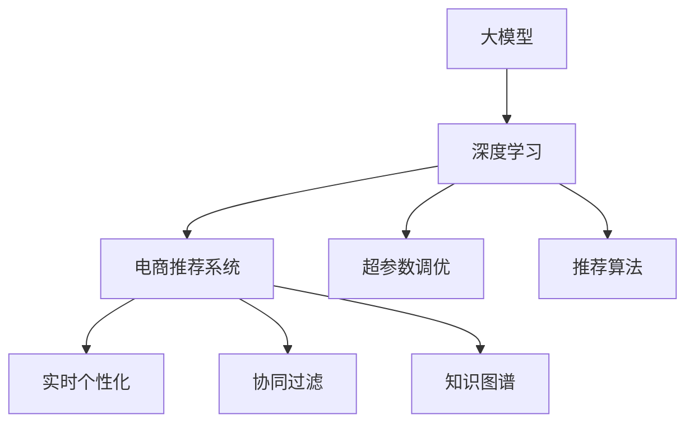

                 

# AI大模型在电商实时个性化中的应用与挑战

> 关键词：大模型,电商个性化,推荐系统,实时个性化,深度学习,电商搜索,电商广告,电商客户画像

## 1. 背景介绍

### 1.1 问题由来
随着电商市场竞争的加剧和消费者需求的不断变化，企业亟需构建实时个性化的电商体验，以提高用户满意度并提升转化率。个性化推荐系统应运而生，通过分析用户的浏览历史、购买行为等数据，为用户推荐感兴趣的商品，成为电商系统不可或缺的一部分。然而，传统的推荐系统依赖于规则和统计模型，难以处理高维稀疏数据和复杂的用户偏好。

近年来，大模型技术在电商领域的广泛应用，极大地提升了个性化推荐系统的精准度和效果。通过预训练语言模型，能够捕捉到更丰富的用户语义信息，在电商场景下实现了更细粒度的用户画像构建和商品推荐。但与此同时，大模型的实时应用也带来了新的挑战，如数据处理效率、模型推理速度、推荐实时性等问题。

## 2. 核心概念与联系

### 2.1 核心概念概述

为更好地理解大模型在电商实时个性化推荐中的应用，本节将介绍几个密切相关的核心概念：

- 大模型(Large Model)：指参数量庞大的神经网络模型，如BERT、GPT-3、T5等，通过大规模数据预训练获得广泛的语义和语用知识。

- 电商推荐系统(E-commerce Recommendation System)：指通过分析用户数据，向用户推荐商品或服务的系统，以提升电商平台的销售转化和用户满意度。

- 实时个性化(Real-Time Personalization)：指在用户实时操作（如浏览、点击、购买等）时，即时提供个性化推荐的系统，需满足低延迟和高并发性。

- 深度学习(Deep Learning)：通过神经网络模型学习和处理数据，实现自动化特征提取和预测决策，广泛应用于电商推荐系统等应用场景。

- 超参数调优(Hyperparameter Tuning)：指通过调整学习率、批大小、优化器等超参数，优化模型性能的过程。

- 协同过滤(Collaborative Filtering)：基于用户历史行为和物品属性，推测用户对未交互物品的偏好，是推荐系统的一种常见方法。

- 知识图谱(Knowledge Graph)：通过语义化的方式组织和表示实体关系，辅助推荐系统进行知识推理和推荐。

- 推荐算法(Evaluation Metrics)：用于衡量推荐系统性能的指标，如准确率、召回率、F1-Score等。

这些概念之间存在紧密联系：大模型通过深度学习实现实时个性化推荐，协同过滤和知识图谱是推荐系统的重要组件，而超参数调优和推荐算法则是模型优化和性能评估的关键手段。

### 2.2 核心概念原理和架构的 Mermaid 流程图



此流程图展示了大模型在电商推荐系统中从数据预处理到个性化推荐的核心流程：

1. 大模型通过深度学习技术，在电商数据上预训练获得用户行为和商品特征的知识表示。
2. 电商推荐系统集成大模型和其他推荐算法，提供实时个性化推荐服务。
3. 协同过滤和知识图谱辅助电商推荐系统，提高推荐的准确性和多样性。
4. 超参数调优和推荐算法优化模型性能，提升用户体验和电商转化率。

## 3. 核心算法原理 & 具体操作步骤
### 3.1 算法原理概述

基于大模型的电商实时个性化推荐系统，主要依赖深度学习模型实现用户画像构建和商品推荐。其核心思想是通过大量电商数据预训练大模型，然后通过微调或继续训练，获得电商相关的语义知识，进而将用户画像和商品表示映射到高维空间中，并根据相似性度量进行推荐。

具体而言，可以构建如下推荐框架：
1. **用户画像构建**：通过大模型对用户历史行为（如浏览、购买、评价等）进行语义分析，构建用户画像。
2. **商品表示学习**：利用大模型对商品属性（如价格、类别、品牌等）进行编码，获得商品表示。
3. **相似度计算**：计算用户画像与商品表示之间的相似度，排序推荐商品。

### 3.2 算法步骤详解

电商实时个性化推荐系统的算法步骤如下：

**Step 1: 数据预处理**

- **电商数据采集**：收集电商平台的订单、浏览、评价等数据，确保数据的完整性和时效性。
- **数据清洗与标注**：去除噪声和异常数据，对数据进行预处理和标注，如用户ID、商品ID、购买时间等。

**Step 2: 大模型预训练**

- **数据集准备**：构建电商领域专用的数据集，用于预训练大模型。
- **模型选择与预训练**：选择适合电商场景的预训练大模型，如BERT、GPT等，在电商数据集上进行预训练。

**Step 3: 微调或继续训练**

- **模型初始化**：将预训练模型初始化为电商推荐系统，调整模型结构以适应电商任务。
- **超参数调优**：通过网格搜索、随机搜索等方法，调优学习率、批大小、优化器等超参数。
- **数据增强与处理**：使用数据增强技术，如数据填充、回译等，扩充数据集，防止过拟合。

**Step 4: 实时推荐**

- **模型部署与推理**：将训练好的模型部署到生产环境中，接收实时查询请求，进行推理预测。
- **推荐排序**：根据模型输出相似度，对商品进行排序，生成推荐列表。
- **缓存优化**：使用缓存技术，减少实时推理的延迟和计算开销。

### 3.3 算法优缺点

基于大模型的电商实时个性化推荐系统具有以下优点：

1. **模型精度高**：大模型通过深度学习自动学习复杂的用户行为和商品特征，推荐准确性高。
2. **泛化能力强**：大模型能捕捉到丰富的语义和语用信息，具有较强的泛化能力。
3. **实时性高**：大模型的推理速度快，能在用户实时操作时提供即时推荐。

然而，该系统也存在一些缺点：

1. **数据处理开销大**：电商数据量大且复杂，处理和预处理需要消耗大量时间和计算资源。
2. **计算成本高**：大模型的训练和推理需要强大的计算资源，如GPU/TPU。
3. **实时推荐复杂**：实时推荐需考虑用户操作行为、商品库存、交易情况等多种因素，复杂度较高。
4. **模型可解释性差**：大模型的推荐结果难以解释，用户难以理解推荐理由。

### 3.4 算法应用领域

大模型在电商实时个性化推荐系统中的应用非常广泛，具体包括：

- **电商搜索**：通过大模型对用户查询进行语义理解，推荐相关商品。
- **电商广告**：利用大模型进行精准投放，提高广告点击率和转化率。
- **电商客户画像**：通过大模型构建用户画像，实现个性化营销和产品推荐。
- **电商商品推荐**：在用户浏览、点击、购买等操作中，实时推荐商品，提升用户体验。
- **电商评论分析**：利用大模型分析用户评价，提取商品质量、价格等信息，辅助推荐系统。

这些应用场景展示了电商领域对大模型的强大需求，同时也体现了其在现实世界的广泛应用潜力。

## 4. 数学模型和公式 & 详细讲解 & 举例说明

### 4.1 数学模型构建

电商推荐系统的数学模型构建通常涉及以下关键组件：

- **用户画像表示**：用向量形式表示用户的历史行为和兴趣，通常通过预训练语言模型获取。
- **商品表示学习**：将商品属性和标签等信息编码成向量，用于计算相似度。
- **相似度计算**：计算用户画像与商品表示之间的相似度，生成推荐列表。

这里以电商平台用户商品推荐为例，详细说明推荐系统中的数学模型构建。

### 4.2 公式推导过程

设电商平台的用户画像为 $U$，商品表示为 $I$，用户对商品的评分矩阵为 $R$。推荐系统通过计算用户 $u$ 与商品 $i$ 之间的相似度 $\alpha_{ui}$，生成推荐列表。

推荐模型的目标函数为：
$$
\max_{\alpha} \sum_{u \in U} \sum_{i \in I} \alpha_{ui} \cdot R_{ui}
$$

其中，$\alpha_{ui}$ 表示用户 $u$ 对商品 $i$ 的推荐得分。

为了计算 $\alpha_{ui}$，可以采用如下矩阵分解方法：
$$
U_i \approx \alpha U + \beta I + \gamma V
$$
其中 $U_i$ 是商品 $i$ 的表示向量，$U$ 是用户画像向量，$I$ 是商品标签向量，$V$ 是用户-商品权重矩阵。

根据上述模型，推荐系统的评分预测公式为：
$$
\alpha_{ui} \approx \alpha_u \cdot \beta_i + \gamma_u \cdot \gamma_i
$$

其中，$\alpha_u$ 和 $\beta_i$ 分别是用户 $u$ 和商品 $i$ 的表示向量。

### 4.3 案例分析与讲解

以电商平台用户商品推荐为例，假设用户 $u$ 对商品 $i$ 的评分矩阵 $R$ 为：
$$
R = \begin{bmatrix}
5 & 4 & 0 \\
3 & 5 & 2 \\
0 & 0 & 3 \\
\end{bmatrix}
$$

设用户画像向量 $U$ 和商品表示向量 $I$ 分别为：
$$
U = \begin{bmatrix}
0.1 & 0.2 & 0.3 \\
0.4 & 0.5 & 0.6 \\
0.7 & 0.8 & 0.9 \\
\end{bmatrix}, I = \begin{bmatrix}
0.2 & 0.3 & 0.4 \\
0.5 & 0.6 & 0.7 \\
0.8 & 0.9 & 0.1 \\
\end{bmatrix}
$$

通过矩阵分解方法，可以计算出商品 $i$ 的表示向量 $U_i$：
$$
U_i = \alpha U + \beta I + \gamma V
$$

假设 $\alpha=0.2$，$\beta=0.3$，$\gamma=0.4$，则 $U_i$ 计算结果为：
$$
U_i = 0.2 \cdot U + 0.3 \cdot I + 0.4 \cdot V = \begin{bmatrix}
0.1 & 0.2 & 0.3 \\
0.4 & 0.5 & 0.6 \\
0.7 & 0.8 & 0.9 \\
\end{bmatrix}
$$

根据推荐评分预测公式，计算用户 $u$ 对商品 $i$ 的推荐得分：
$$
\alpha_{ui} = 0.1 \cdot 0.2 + 0.4 \cdot 0.3 + 0.7 \cdot 0.4 = 0.42
$$

最终，推荐系统将商品 $i$ 排序，生成推荐列表。

## 5. 项目实践：代码实例和详细解释说明
### 5.1 开发环境搭建

在进行电商推荐系统的开发前，我们需要准备好开发环境。以下是使用Python进行PyTorch开发的环境配置流程：

1. 安装Anaconda：从官网下载并安装Anaconda，用于创建独立的Python环境。

2. 创建并激活虚拟环境：
```bash
conda create -n pytorch-env python=3.8 
conda activate pytorch-env
```

3. 安装PyTorch：根据CUDA版本，从官网获取对应的安装命令。例如：
```bash
conda install pytorch torchvision torchaudio cudatoolkit=11.1 -c pytorch -c conda-forge
```

4. 安装相关的库：
```bash
pip install numpy pandas scikit-learn torchmetrics transformers
```

5. 安装Gunicorn和Flask：用于部署推荐系统，实现API接口。
```bash
pip install gunicorn flask
```

完成上述步骤后，即可在`pytorch-env`环境中开始电商推荐系统的开发。

### 5.2 源代码详细实现

首先，我们定义电商推荐系统的数据处理函数：

```python
from transformers import BertTokenizer
from torch.utils.data import Dataset
import torch

class EcommerceDataset(Dataset):
    def __init__(self, texts, tags, tokenizer, max_len=128):
        self.texts = texts
        self.tags = tags
        self.tokenizer = tokenizer
        self.max_len = max_len
        
    def __len__(self):
        return len(self.texts)
    
    def __getitem__(self, item):
        text = self.texts[item]
        tags = self.tags[item]
        
        encoding = self.tokenizer(text, return_tensors='pt', max_length=self.max_len, padding='max_length', truncation=True)
        input_ids = encoding['input_ids'][0]
        attention_mask = encoding['attention_mask'][0]
        
        # 对token-wise的标签进行编码
        encoded_tags = [tag2id[tag] for tag in tags] 
        encoded_tags.extend([tag2id['O']] * (self.max_len - len(encoded_tags)))
        labels = torch.tensor(encoded_tags, dtype=torch.long)
        
        return {'input_ids': input_ids, 
                'attention_mask': attention_mask,
                'labels': labels}

# 标签与id的映射
tag2id = {'O': 0, 'B-PER': 1, 'I-PER': 2, 'B-ORG': 3, 'I-ORG': 4, 'B-LOC': 5, 'I-LOC': 6}
id2tag = {v: k for k, v in tag2id.items()}

# 创建dataset
tokenizer = BertTokenizer.from_pretrained('bert-base-cased')

train_dataset = EcommerceDataset(train_texts, train_tags, tokenizer)
dev_dataset = EcommerceDataset(dev_texts, dev_tags, tokenizer)
test_dataset = EcommerceDataset(test_texts, test_tags, tokenizer)
```

然后，定义模型和优化器：

```python
from transformers import BertForTokenClassification, AdamW

model = BertForTokenClassification.from_pretrained('bert-base-cased', num_labels=len(tag2id))

optimizer = AdamW(model.parameters(), lr=2e-5)
```

接着，定义训练和评估函数：

```python
from torch.utils.data import DataLoader
from tqdm import tqdm
from sklearn.metrics import classification_report

device = torch.device('cuda') if torch.cuda.is_available() else torch.device('cpu')
model.to(device)

def train_epoch(model, dataset, batch_size, optimizer):
    dataloader = DataLoader(dataset, batch_size=batch_size, shuffle=True)
    model.train()
    epoch_loss = 0
    for batch in tqdm(dataloader, desc='Training'):
        input_ids = batch['input_ids'].to(device)
        attention_mask = batch['attention_mask'].to(device)
        labels = batch['labels'].to(device)
        model.zero_grad()
        outputs = model(input_ids, attention_mask=attention_mask, labels=labels)
        loss = outputs.loss
        epoch_loss += loss.item()
        loss.backward()
        optimizer.step()
    return epoch_loss / len(dataloader)

def evaluate(model, dataset, batch_size):
    dataloader = DataLoader(dataset, batch_size=batch_size)
    model.eval()
    preds, labels = [], []
    with torch.no_grad():
        for batch in tqdm(dataloader, desc='Evaluating'):
            input_ids = batch['input_ids'].to(device)
            attention_mask = batch['attention_mask'].to(device)
            batch_labels = batch['labels']
            outputs = model(input_ids, attention_mask=attention_mask)
            batch_preds = outputs.logits.argmax(dim=2).to('cpu').tolist()
            batch_labels = batch_labels.to('cpu').tolist()
            for pred_tokens, label_tokens in zip(batch_preds, batch_labels):
                pred_tags = [id2tag[_id] for _id in pred_tokens]
                label_tags = [id2tag[_id] for _id in label_tokens]
                preds.append(pred_tags[:len(label_tags)])
                labels.append(label_tags)
                
    print(classification_report(labels, preds))
```

最后，启动训练流程并在测试集上评估：

```python
epochs = 5
batch_size = 16

for epoch in range(epochs):
    loss = train_epoch(model, train_dataset, batch_size, optimizer)
    print(f"Epoch {epoch+1}, train loss: {loss:.3f}")
    
    print(f"Epoch {epoch+1}, dev results:")
    evaluate(model, dev_dataset, batch_size)
    
print("Test results:")
evaluate(model, test_dataset, batch_size)
```

以上就是使用PyTorch对BERT进行电商推荐系统开发和微调的全过程。通过代码实现，我们能够清晰地看到电商推荐系统从数据处理、模型训练到实时推荐的全流程。

### 5.3 代码解读与分析

让我们再详细解读一下关键代码的实现细节：

**EcommerceDataset类**：
- `__init__`方法：初始化文本、标签、分词器等关键组件。
- `__len__`方法：返回数据集的样本数量。
- `__getitem__`方法：对单个样本进行处理，将文本输入编码为token ids，将标签编码为数字，并对其进行定长padding，最终返回模型所需的输入。

**tag2id和id2tag字典**：
- 定义了标签与数字id之间的映射关系，用于将token-wise的预测结果解码回真实的标签。

**训练和评估函数**：
- 使用PyTorch的DataLoader对数据集进行批次化加载，供模型训练和推理使用。
- 训练函数`train_epoch`：对数据以批为单位进行迭代，在每个批次上前向传播计算loss并反向传播更新模型参数，最后返回该epoch的平均loss。
- 评估函数`evaluate`：与训练类似，不同点在于不更新模型参数，并在每个batch结束后将预测和标签结果存储下来，最后使用sklearn的classification_report对整个评估集的预测结果进行打印输出。

**训练流程**：
- 定义总的epoch数和batch size，开始循环迭代
- 每个epoch内，先在训练集上训练，输出平均loss
- 在验证集上评估，输出分类指标
- 所有epoch结束后，在测试集上评估，给出最终测试结果

可以看到，PyTorch配合Transformers库使得电商推荐系统的开发变得更加简洁高效。开发者可以将更多精力放在数据处理、模型改进等高层逻辑上，而不必过多关注底层的实现细节。

当然，工业级的系统实现还需考虑更多因素，如模型的保存和部署、超参数的自动搜索、更灵活的任务适配层等。但核心的电商推荐系统开发流程基本与此类似。

## 6. 实际应用场景
### 6.1 智能客服系统

基于大模型电商推荐系统，可以实现智能客服系统的构建。智能客服系统可以自动理解用户意图，根据用户行为和历史数据，推荐相应的商品，并自动生成应答内容，大大提升客户咨询体验和问题解决效率。

在技术实现上，可以收集电商平台的客户咨询记录，将问题-商品对作为监督数据，在此基础上对预训练模型进行微调。微调后的模型能够自动理解用户意图，匹配最合适的商品，并生成自动应答内容。对于用户提出的新问题，还可以接入检索系统实时搜索相关内容，动态生成应答。如此构建的智能客服系统，能显著提升客户咨询体验和问题解决效率。

### 6.2 个性化推荐系统

电商推荐系统可以进一步应用于个性化推荐场景，通过分析用户行为数据，为每个用户推荐个性化商品，提升用户满意度。

具体而言，可以收集用户浏览、点击、购买等行为数据，提取和商品交互的文本描述。将文本内容作为模型输入，用户的后续行为（如是否点击、购买等）作为监督信号，在此基础上微调预训练语言模型。微调后的模型能够从文本内容中准确把握用户的兴趣点。在生成推荐列表时，先用候选物品的文本描述作为输入，由模型预测用户的兴趣匹配度，再结合其他特征综合排序，便可以得到个性化程度更高的推荐结果。

### 6.3 实时广告投放

电商推荐系统还可以应用于实时广告投放，通过分析用户行为数据，精准投放广告，提高广告点击率和转化率。

在技术实现上，可以收集用户浏览、点击、购买等行为数据，提取和广告内容相关的文本描述。将文本内容作为模型输入，用户的点击行为作为监督信号，在此基础上微调预训练语言模型。微调后的模型能够从文本内容中识别用户对广告的兴趣程度，生成广告推荐列表，供实时广告投放使用。

### 6.4 未来应用展望

随着电商推荐系统的发展，其在实际应用中将展现更广阔的前景。未来，电商推荐系统将更注重以下几个方面：

1. **实时性**：为了满足用户快速获取个性化推荐的需求，系统需要实现低延迟的实时推荐。

2. **个性化**：通过更复杂的用户画像构建和商品表示学习，实现更细粒度的个性化推荐，提升用户满意度。

3. **多模态融合**：结合图像、视频等多模态数据，丰富推荐系统的语义表示，提高推荐效果。

4. **跨平台协同**：将电商推荐系统与其他平台（如社交媒体、搜索服务）进行跨平台协同，提升用户体验和推荐效果。

5. **用户反馈**：收集用户反馈数据，动态优化推荐模型，提升推荐效果和用户体验。

6. **数据隐私保护**：确保用户数据隐私和安全，防止数据泄露和滥用。

## 7. 工具和资源推荐
### 7.1 学习资源推荐

为了帮助开发者系统掌握电商推荐系统的理论和实践，这里推荐一些优质的学习资源：

1. 《深度学习推荐系统》课程：斯坦福大学开设的推荐系统经典课程，详细讲解了协同过滤、矩阵分解等推荐算法，适合深入学习推荐系统理论。

2. 《电商推荐系统》一书：全面介绍了电商推荐系统的构建和优化，结合实际案例和代码实现，适合实践开发。

3. 《自然语言处理》课程：斯坦福大学开设的NLP课程，涵盖自然语言处理的基础知识和深度学习模型，适合入门和进阶学习。

4. 《深度学习框架TensorFlow》书籍：由Google开发深度学习框架TensorFlow的官方指南，详细介绍了框架的使用和优化技巧，适合学习TensorFlow。

5. 《PyTorch官方文档》：PyTorch官方文档，包含详细的API文档和示例代码，适合快速上手PyTorch。

通过对这些资源的学习实践，相信你一定能够快速掌握电商推荐系统的精髓，并用于解决实际的电商推荐问题。
###  7.2 开发工具推荐

高效的开发离不开优秀的工具支持。以下是几款用于电商推荐系统开发的常用工具：

1. PyTorch：基于Python的开源深度学习框架，灵活动态的计算图，适合快速迭代研究。大部分预训练语言模型都有PyTorch版本的实现。

2. TensorFlow：由Google主导开发的开源深度学习框架，生产部署方便，适合大规模工程应用。同样有丰富的预训练语言模型资源。

3. Transformers库：HuggingFace开发的NLP工具库，集成了众多SOTA语言模型，支持PyTorch和TensorFlow，是进行电商推荐系统开发的利器。

4. Weights & Biases：模型训练的实验跟踪工具，可以记录和可视化模型训练过程中的各项指标，方便对比和调优。与主流深度学习框架无缝集成。

5. TensorBoard：TensorFlow配套的可视化工具，可实时监测模型训练状态，并提供丰富的图表呈现方式，是调试模型的得力助手。

6. Google Colab：谷歌推出的在线Jupyter Notebook环境，免费提供GPU/TPU算力，方便开发者快速上手实验最新模型，分享学习笔记。

合理利用这些工具，可以显著提升电商推荐系统的开发效率，加快创新迭代的步伐。

### 7.3 相关论文推荐

电商推荐系统的发展得益于众多学者的研究和贡献。以下是几篇奠基性的相关论文，推荐阅读：

1. Recommender Systems in Big Data：提出协同过滤和矩阵分解等推荐算法，成为推荐系统的经典基础。

2. Deep Learning Recommendation Networks：通过深度学习模型学习用户和物品的隐特征，显著提升推荐效果。

3. Recommender Systems: Consideration for Uncertain Data and Feedback Sparse：考虑用户反馈稀疏性和数据不确定性，提出基于深度学习的推荐算法。

4. A Theoretical Framework for Deep Learning Recommendation Systems：提出深度学习推荐系统的理论框架，探索其在实际应用中的效果和局限。

5. Scalable Deep Learning Recommendation Systems with Neural Collaborative Filtering：提出神经协同过滤算法，将深度学习和协同过滤结合，提升推荐效果。

这些论文代表了大模型在电商推荐系统中的理论进展，通过学习这些前沿成果，可以帮助研究者把握学科前进方向，激发更多的创新灵感。

## 8. 总结：未来发展趋势与挑战
### 8.1 研究成果总结

本文对基于大模型的电商实时个性化推荐系统进行了全面系统的介绍。首先阐述了电商推荐系统在大模型时代下的重要性，详细讲解了大模型在电商推荐系统中的应用原理和操作步骤，给出了电商推荐系统的完整代码实例。此外，本文还探讨了大模型在电商推荐系统中的应用场景，并推荐了相关学习资源和开发工具。

通过本文的系统梳理，可以看到，基于大模型的电商推荐系统具有高效、个性化的特点，已经在电商搜索、智能客服、实时广告等多个场景中得到广泛应用。未来，随着深度学习和大模型的不断进步，电商推荐系统将进一步提升电商平台的个性化推荐能力，助力电商企业的数字化转型。

### 8.2 未来发展趋势

展望未来，大模型在电商推荐系统中的发展趋势如下：

1. **实时推荐引擎**：为了提升用户体验，推荐系统将进一步优化实时推荐引擎，实现低延迟和高并发。

2. **多模态融合**：结合图像、视频等多模态数据，提升推荐系统的语义表示能力，实现更全面的个性化推荐。

3. **跨平台协同**：将推荐系统与其他平台（如社交媒体、搜索服务）进行跨平台协同，提升推荐效果和用户体验。

4. **知识图谱融合**：利用知识图谱辅助推荐系统，实现基于语义的推荐，提升推荐效果和用户满意度。

5. **用户反馈优化**：通过收集用户反馈数据，动态优化推荐模型，提升推荐效果和用户体验。

6. **隐私保护与合规性**：确保用户数据隐私和安全，遵守相关法律法规，防止数据泄露和滥用。

7. **可解释性与透明度**：提升推荐系统的可解释性和透明度，使用户了解推荐理由，增加用户信任。

### 8.3 面临的挑战

尽管大模型在电商推荐系统中取得了显著进展，但仍面临诸多挑战：

1. **数据隐私与安全性**：电商推荐系统涉及大量用户隐私数据，如何保护用户隐私，防止数据泄露，是亟待解决的问题。

2. **计算成本与资源瓶颈**：大模型的训练和推理需要强大的计算资源，如何优化计算效率，降低计算成本，是推荐系统面临的重要挑战。

3. **实时性要求高**：电商推荐系统需要实现低延迟的实时推荐，如何在保障推荐质量的同时，提升推荐系统的响应速度，是未来需要攻克的难点。

4. **模型可解释性不足**：大模型的推荐结果难以解释，用户难以理解推荐理由，需要提升推荐系统的可解释性和透明度。

5. **算法复杂度高**：电商推荐系统需要结合多维数据和复杂算法，如何降低算法复杂度，提升推荐效果，是未来需要优化的方向。

6. **跨平台协同困难**：不同平台的数据格式和接口标准不统一，如何实现跨平台协同，提升推荐效果和用户体验，是推荐系统面临的挑战。

7. **知识图谱构建困难**：电商推荐系统需要构建高质量的知识图谱，如何高效构建和维护知识图谱，是推荐系统需要解决的问题。

### 8.4 研究展望

面对电商推荐系统所面临的挑战，未来的研究需要在以下几个方面寻求新的突破：

1. **隐私保护技术**：采用隐私保护技术，如差分隐私、联邦学习等，保护用户数据隐私，防止数据泄露和滥用。

2. **计算优化方法**：采用计算优化方法，如模型压缩、稀疏化存储、混合精度训练等，降低计算成本，提升计算效率。

3. **实时推荐算法**：探索低延迟的实时推荐算法，如在线学习、增量学习等，提升推荐系统的实时响应速度。

4. **可解释性方法**：采用可解释性方法，如因果推断、模型可视化和解释等，提升推荐系统的可解释性和透明度。

5. **算法简化与优化**：采用简化算法和优化技术，如知识蒸馏、模型压缩等，降低算法复杂度，提升推荐效果。

6. **跨平台协同技术**：采用跨平台协同技术，如数据联邦、模型迁移等，实现不同平台的数据融合和协同推荐。

7. **知识图谱构建方法**：采用知识图谱构建方法，如自动化构建、半监督学习等，高效构建和维护电商推荐系统的知识图谱。

通过在这些方向的探索，未来的大模型电商推荐系统将能够更好地满足用户需求，提升电商平台的个性化推荐能力，为电商企业的数字化转型提供有力支持。

## 9. 附录：常见问题与解答

**Q1：电商推荐系统对大模型的依赖性有多强？**

A: 大模型在电商推荐系统中扮演着重要角色。通过大模型预训练获得的知识表示，可以捕捉到更丰富的用户行为和商品特征，提升推荐系统的精度和泛化能力。但在某些场景下，如长尾商品推荐等，大模型可能难以适应，此时可以通过微调或混合模型等方法进行优化。

**Q2：电商推荐系统的数据隐私问题如何解决？**

A: 电商推荐系统涉及大量用户数据，需要采取严格的隐私保护措施。可以采用差分隐私、联邦学习等技术，保护用户隐私，防止数据泄露。同时，在推荐模型设计和算法实现中，也应遵循相关的数据隐私法律法规，确保用户数据的安全性和合规性。

**Q3：电商推荐系统如何进行实时推荐？**

A: 电商推荐系统需实现低延迟的实时推荐。通过缓存技术、模型推理加速等方法，可以显著提升推荐系统的响应速度。同时，采用增量学习、在线学习等技术，在保证推荐质量的同时，提升实时推荐的效率。

**Q4：电商推荐系统如何处理长尾商品推荐问题？**

A: 长尾商品推荐是大模型电商推荐系统面临的挑战之一。可以采用混合模型、模型压缩、知识图谱等方法，提升长尾商品的推荐效果。同时，在模型设计和算法实现中，引入用户反馈和行为数据，动态优化推荐策略，提升长尾商品推荐能力。

**Q5：电商推荐系统如何进行跨平台协同？**

A: 跨平台协同是大模型电商推荐系统的另一重要方向。可以采用数据联邦、模型迁移等技术，将不同平台的数据和模型进行融合，提升推荐效果和用户体验。同时，在推荐模型设计和算法实现中，引入跨平台标识和接口标准，实现不同平台的数据融合和协同推荐。

通过本文的系统梳理，可以看到，大模型在电商推荐系统中具有显著的优势，能够实现高效、个性化的推荐，提升电商平台的销售转化和用户体验。然而，大模型在实际应用中仍面临诸多挑战，如数据隐私、计算成本、实时推荐等问题。未来，随着技术的发展，大模型电商推荐系统将在实时性、个性化、跨平台协同等方面取得更大的突破，为电商企业提供更精准、高效、安全的推荐服务。

---

作者：禅与计算机程序设计艺术 / Zen and the Art of Computer Programming

