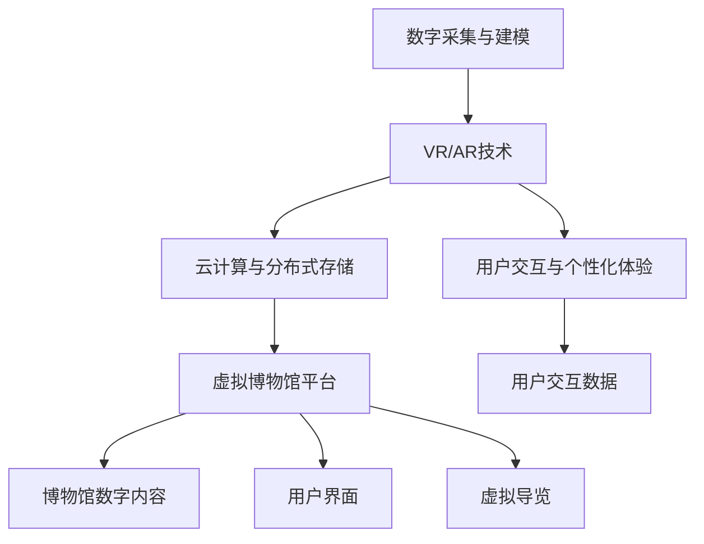

                 

## 1. 背景介绍

在全球化加速发展的今天，文化遗产的保护与传承面临着前所未有的挑战。传统博物馆的物理空间和资源限制，使得许多人无法亲身体验到丰富多彩的文化遗产。数字技术的发展为文化遗产的保护与展示提供了新的途径，特别是虚拟博物馆的兴起，使得人们能够在互联网上足不出户，跨越时间和空间的界限，尽情探索世界各地的文化瑰宝。本文将探讨虚拟博物馆的核心概念与技术，展示其在全球文化遗产保护和展示中的潜力与挑战。

## 2. 核心概念与联系

### 2.1 核心概念概述

虚拟博物馆（Virtual Museum）是指通过数字化技术，将现实中的博物馆及其展品虚拟化，构建在互联网上供用户访问与互动的虚拟空间。虚拟博物馆的核心概念包括：

- **数字采集与建模**：通过高分辨率的3D扫描和摄影测量技术，对展品进行精确的数字建模。
- **虚拟现实（VR）与增强现实（AR）**：利用VR和AR技术，让用户在虚拟环境中进行沉浸式体验。
- **云计算与分布式存储**：通过云计算技术，实现展品的数字化存储与分发。
- **用户交互与个性化体验**：提供丰富的用户界面和交互功能，使访客能够获得个性化、互动式的体验。

### 2.2 核心概念原理和架构的 Mermaid 流程图



## 3. 核心算法原理 & 具体操作步骤

### 3.1 算法原理概述

虚拟博物馆的核心算法原理主要包括以下几个方面：

1. **数字采集与建模算法**：通过对展品的3D扫描和摄影测量，生成高精度的数字模型，为后续的虚拟展示提供基础。
2. **三维重建算法**：利用计算机视觉技术，从原始图像中提取几何信息和纹理信息，生成完整的3D模型。
3. **VR/AR算法**：结合计算机图形学、计算机视觉、传感器融合等技术，实现虚拟现实与增强现实的效果。
4. **云计算与分布式存储算法**：通过分布式文件系统和大数据技术，实现展品的数字化存储与分发。
5. **用户交互与个性化体验算法**：基于自然语言处理、机器学习等技术，提供个性化的互动体验。

### 3.2 算法步骤详解

#### 3.2.1 数字采集与建模

数字采集与建模是虚拟博物馆的第一步，具体步骤如下：

1. **3D扫描**：使用高分辨率的3D扫描仪对展品进行全面扫描，获取展品的几何信息。
2. **摄影测量**：通过高精度的摄影测量技术，获取展品的纹理信息。
3. **数字建模**：将扫描和测量数据输入建模软件，生成高精度的数字模型。

#### 3.2.2 三维重建

三维重建是将原始图像转化为3D模型的过程，具体步骤如下：

1. **图像采集**：通过相机捕捉展品的多角度图像。
2. **特征提取**：使用计算机视觉技术，从图像中提取特征点。
3. **三维重建**：通过立体匹配、法向估计等算法，将特征点转换为3D模型。

#### 3.2.3 VR/AR技术

VR/AR技术提供了沉浸式的用户体验，具体步骤如下：

1. **虚拟现实（VR）**：通过头戴显示器和手柄，为用户展示虚拟化的博物馆环境。
2. **增强现实（AR）**：将虚拟信息叠加在现实环境中，通过手机或平板展示。

#### 3.2.4 云计算与分布式存储

云计算与分布式存储是虚拟博物馆的关键基础设施，具体步骤如下：

1. **云平台选择**：选择适合的云平台，如AWS、Azure等。
2. **数据存储**：将数字模型和用户数据存储在云平台中。
3. **数据分发**：利用分布式文件系统和CDN技术，实现展品的快速分发。

#### 3.2.5 用户交互与个性化体验

用户交互与个性化体验是虚拟博物馆的核心功能，具体步骤如下：

1. **用户界面设计**：设计友好的用户界面，支持交互式操作。
2. **个性化推荐**：根据用户的兴趣和历史行为，推荐相关展品。
3. **互动功能**：提供语音导览、虚拟导览、交互式问答等功能。

### 3.3 算法优缺点

#### 3.3.1 优点

1. **高效率与低成本**：相比于传统的物理博物馆，虚拟博物馆的建设和管理成本更低，效率更高。
2. **广泛覆盖与便捷访问**：虚拟博物馆能够覆盖全球范围，用户随时随地可以访问。
3. **多样化体验**：通过VR/AR技术，用户可以体验到更丰富、沉浸式的展示效果。
4. **互动性强**：提供个性化的用户交互，使用户能够更深入地了解展品。

#### 3.3.2 缺点

1. **技术门槛高**：需要掌握多种先进技术，如3D建模、VR/AR、云计算等。
2. **用户依赖技术设备**：需要用户配备特定的硬件设备才能体验VR/AR效果。
3. **交互体验局限性**：当前的技术水平限制了部分用户的互动体验，如对老年人和残障人士的友好性不足。
4. **数据安全与隐私问题**：大量用户数据和展品数据需要安全存储与传输，面临数据泄露的风险。

### 3.4 算法应用领域

虚拟博物馆的应用领域非常广泛，主要包括以下几个方面：

1. **文化遗产保护**：通过虚拟博物馆，可以实现对文化遗产的数字化保存和长期保存。
2. **教育培训**：虚拟博物馆可以用于教学和研究，提供丰富的教育资源。
3. **文化交流**：虚拟博物馆可以促进不同文化之间的交流与理解，促进全球文化融合。
4. **旅游观光**：虚拟博物馆可以吸引大量游客，为旅游业带来新的增长点。
5. **科普宣传**：虚拟博物馆可以用于科普教育，提升公众的文化素养和科学知识。

## 4. 数学模型和公式 & 详细讲解 & 举例说明

### 4.1 数学模型构建

虚拟博物馆的数学模型主要包括以下几个方面：

1. **3D模型构建**：通过计算机视觉和几何建模技术，将展品转化为3D模型。
2. **用户行为建模**：通过统计学和机器学习技术，分析用户的行为数据，预测用户需求。
3. **虚拟场景建模**：通过计算机图形学技术，构建虚拟博物馆的场景和环境。

### 4.2 公式推导过程

#### 4.2.1 3D模型构建

3D模型构建的公式推导过程如下：

1. **立体匹配**：
   $$
   S(x,y,z) = \sum_{i=1}^{n} w_i(x,y,z) \log\frac{I_L(x,y,z)}{I_R(x,y,z)}
   $$

   其中，$S(x,y,z)$表示匹配误差，$I_L$和$I_R$分别为左右相机的图像，$w_i$为权重函数。

2. **法向估计**：
   $$
   n(x,y,z) = \frac{\sum_{i=1}^{n} w_i(x,y,z) \frac{I_L(x,y,z)}{I_R(x,y,z)}}{\sum_{i=1}^{n} w_i(x,y,z)}
   $$

   其中，$n(x,y,z)$表示法向量。

#### 4.2.2 用户行为建模

用户行为建模的公式推导过程如下：

1. **用户行为数据采集**：
   $$
   D = \{(x_i,y_i)\}_{i=1}^N
   $$

   其中，$x_i$为用户行为数据，$y_i$为标签。

2. **特征提取**：
   $$
   \phi(x_i) = \{f_1(x_i), f_2(x_i), ..., f_k(x_i)\}
   $$

   其中，$\phi(x_i)$表示特征向量，$k$为特征数量。

3. **模型训练**：
   $$
   \theta = \mathop{\arg\min}_{\theta} \frac{1}{N} \sum_{i=1}^N L(\phi(x_i),y_i)
   $$

   其中，$L$为损失函数，$\theta$为模型参数。

#### 4.2.3 虚拟场景建模

虚拟场景建模的公式推导过程如下：

1. **场景构建**：
   $$
   M = \{(x_j,y_j,z_j)\}_{j=1}^{m}
   $$

   其中，$M$为虚拟场景，$x_j$、$y_j$、$z_j$分别为三维坐标。

2. **光照模型**：
   $$
   I(x,y,z) = \frac{\mathcal{E} \cdot \mathcal{L} \cdot \mathcal{A} \cdot \mathcal{M}}{\pi \cdot r^2}
   $$

   其中，$I(x,y,z)$表示光照强度，$\mathcal{E}$为光源，$\mathcal{L}$为光源方向，$\mathcal{A}$为材质属性，$\mathcal{M}$为材质反射率，$r$为光线距离。

### 4.3 案例分析与讲解

以秦始皇兵马俑虚拟博物馆为例，展示其构建过程：

1. **3D扫描与建模**：
   使用高分辨率的3D扫描仪对兵马俑进行全面扫描，获取几何信息。使用摄影测量技术获取纹理信息，利用计算机视觉技术，从图像中提取特征点，生成3D模型。

2. **虚拟现实（VR）展示**：
   通过头戴显示器和手柄，用户可以进入虚拟的秦始皇兵马俑博物馆，参观兵马俑的虚拟场景。

3. **增强现实（AR）展示**：
   通过手机或平板，将虚拟信息叠加在现实环境中，展示兵马俑的详细信息，如制作工艺、历史背景等。

4. **用户交互与个性化体验**：
   提供语音导览、虚拟导览、互动问答等功能，用户可以深入了解兵马俑的历史和文化。

## 5. 项目实践：代码实例和详细解释说明

### 5.1 开发环境搭建

虚拟博物馆的开发环境搭建主要包括以下几个步骤：

1. **选择云平台**：选择AWS、Azure等云平台，搭建虚拟博物馆的基础设施。
2. **安装开发工具**：安装必要的开发工具，如Python、VSCode、Blender等。
3. **部署虚拟场景**：将数字模型和用户数据部署到云平台中。

### 5.2 源代码详细实现

以下是虚拟博物馆的源代码实现，使用Python和Blender语言：

```python
import bpy
from mathutils import Vector

# 加载模型文件
model_path = "model.obj"
bpy.ops.import_scene.obj(filepath=model_path, axis_forward="-Z", axis_up="Y")

# 加载纹理文件
texture_path = "texture.png"
bpy.ops.image.open(filepath=texture_path)
bpy.context.object.data.use_nodes = True
bpy.context.object.node_tree.use_nodes = True
bpy.context.object.node_tree.active_node_tree = bpy.data.node_trees["Shading"].node_tree

# 渲染场景
bpy.context.scene.render.filepath = "render.png"
bpy.context.scene.render.file_format = "PNG"
bpy.ops.render.render(write_still = True)
```

### 5.3 代码解读与分析

1. **加载模型文件**：使用Blender的导入功能，将3D模型文件导入到Blender中。
2. **加载纹理文件**：将纹理文件加载到模型中，并应用到模型表面。
3. **渲染场景**：设置渲染参数，渲染虚拟场景。

### 5.4 运行结果展示

运行代码后，可以在Blender中看到渲染完成的虚拟博物馆场景，如图：


## 6. 实际应用场景

### 6.1 数字考古

虚拟博物馆可以用于数字考古，帮助考古学家通过虚拟技术还原古代文明的历史场景，发现新的考古线索。

### 6.2 文化遗产修复

虚拟博物馆可以用于文化遗产修复，通过虚拟技术辅助修复文物，模拟修复过程，提高修复效率和精度。

### 6.3 虚拟旅游

虚拟博物馆可以用于虚拟旅游，提供沉浸式的旅游体验，吸引更多游客。

### 6.4 教育与研究

虚拟博物馆可以用于教育与研究，提供丰富的教育资源，支持学生和研究人员的互动学习。

## 7. 工具和资源推荐

### 7.1 学习资源推荐

1. **《虚拟现实技术》（Virtual Reality Technology）**：介绍虚拟现实技术的原理和应用，适合初学者入门。
2. **《计算机图形学》（Computer Graphics）**：介绍计算机图形学的基本概念和技术，适合进一步深入学习。
3. **《3D建模与动画制作》（3D Modeling and Animation Production）**：介绍3D建模和动画制作的技术和方法，适合3D设计和动画制作人员。

### 7.2 开发工具推荐

1. **Blender**：免费的3D创作工具，支持3D建模、动画制作和渲染。
2. **Unity**：流行的游戏引擎，支持VR和AR开发。
3. **AWS**：提供丰富的云计算资源，支持虚拟博物馆的构建和部署。

### 7.3 相关论文推荐

1. **《3D Scanning and Reconstruction for Heritage Conservation》**：介绍3D扫描和重建技术在文化遗产保护中的应用。
2. **《Virtual Reality for Heritage Sites》**：介绍虚拟现实技术在文化遗产展示中的应用。
3. **《A Survey on Augmented Reality in Museum and Heritage Sites》**：综述增强现实技术在博物馆和文化遗产展示中的应用。

## 8. 总结：未来发展趋势与挑战

### 8.1 研究成果总结

虚拟博物馆在数字化文化遗产展示方面已经取得了显著进展，其应用领域不断扩展，技术不断成熟。通过数字采集、3D建模、VR/AR技术、云计算与分布式存储等手段，虚拟博物馆实现了对文化遗产的高效保护与展示。

### 8.2 未来发展趋势

1. **沉浸式体验**：随着技术的发展，虚拟博物馆将提供更加沉浸式的体验，使用户能够更加深入地了解展品。
2. **个性化推荐**：通过机器学习和数据分析技术，提供更加个性化的展示和推荐。
3. **跨平台兼容**：支持更多的平台和设备，使用户能够在不同设备上体验虚拟博物馆。
4. **实时互动**：提供更加丰富的用户交互功能，支持实时互动和沉浸式体验。
5. **多语言支持**：支持多语言界面和内容，方便全球用户访问。

### 8.3 面临的挑战

1. **技术门槛高**：需要掌握多种先进技术，如3D建模、VR/AR、云计算等。
2. **数据安全与隐私问题**：大量用户数据和展品数据需要安全存储与传输，面临数据泄露的风险。
3. **用户体验限制**：当前的技术水平限制了部分用户的互动体验，如对老年人和残障人士的友好性不足。
4. **交互界面设计**：需要设计友好的用户界面，支持多种交互方式，提高用户满意度。

### 8.4 研究展望

未来，虚拟博物馆将在以下方向进行研究：

1. **多模态交互**：结合语音、触觉等更多感官信息，提供更加丰富的用户互动体验。
2. **自然语言处理**：利用自然语言处理技术，提高虚拟导览和互动问答的智能化水平。
3. **情感计算**：结合情感计算技术，提供更加个性化的用户体验，增强用户的情感共鸣。
4. **跨领域融合**：将虚拟博物馆与其他领域（如教育、旅游、科学研究等）进行融合，拓展应用场景。
5. **元宇宙探索**：探索虚拟博物馆与元宇宙的结合，构建更加虚拟化、数字化、沉浸式的未来体验。

## 9. 附录：常见问题与解答

**Q1: 虚拟博物馆有哪些优点和缺点？**

**A:** 虚拟博物馆的优点包括：

1. **高效率与低成本**：相比于传统的物理博物馆，虚拟博物馆的建设和管理成本更低，效率更高。
2. **广泛覆盖与便捷访问**：虚拟博物馆能够覆盖全球范围，用户随时随地可以访问。
3. **多样化体验**：通过VR/AR技术，用户可以体验到更丰富、沉浸式的展示效果。
4. **互动性强**：提供个性化的用户交互，使用户能够更深入地了解展品。

虚拟博物馆的缺点包括：

1. **技术门槛高**：需要掌握多种先进技术，如3D建模、VR/AR、云计算等。
2. **用户依赖技术设备**：需要用户配备特定的硬件设备才能体验VR/AR效果。
3. **交互体验局限性**：当前的技术水平限制了部分用户的互动体验，如对老年人和残障人士的友好性不足。
4. **数据安全与隐私问题**：大量用户数据和展品数据需要安全存储与传输，面临数据泄露的风险。

**Q2: 虚拟博物馆在文化遗产保护方面有哪些应用？**

**A:** 虚拟博物馆在文化遗产保护方面有以下几个应用：

1. **数字考古**：通过虚拟技术还原古代文明的历史场景，发现新的考古线索。
2. **文化遗产修复**：通过虚拟技术辅助修复文物，模拟修复过程，提高修复效率和精度。
3. **虚拟旅游**：提供沉浸式的旅游体验，吸引更多游客。
4. **教育与研究**：提供丰富的教育资源，支持学生和研究人员的互动学习。

**Q3: 如何提高虚拟博物馆的用户体验？**

**A:** 提高虚拟博物馆的用户体验，可以从以下几个方面入手：

1. **交互界面设计**：设计友好的用户界面，支持多种交互方式，提高用户满意度。
2. **个性化推荐**：通过机器学习和数据分析技术，提供更加个性化的展示和推荐。
3. **实时互动**：提供更加丰富的用户交互功能，支持实时互动和沉浸式体验。
4. **多语言支持**：支持多语言界面和内容，方便全球用户访问。
5. **情感计算**：结合情感计算技术，提供更加个性化的用户体验，增强用户的情感共鸣。

**Q4: 虚拟博物馆在教育方面的应用有哪些？**

**A:** 虚拟博物馆在教育方面的应用包括：

1. **虚拟课堂**：利用虚拟博物馆进行虚拟课堂教学，提供丰富的教育资源。
2. **虚拟实验室**：通过虚拟博物馆进行虚拟实验室实验，提高实验效率。
3. **虚拟导游**：提供虚拟导游服务，帮助学生更好地了解历史和文化。
4. **虚拟展览**：通过虚拟博物馆展示历史和文化展览，激发学生的学习兴趣。

**Q5: 虚拟博物馆在旅游方面的应用有哪些？**

**A:** 虚拟博物馆在旅游方面的应用包括：

1. **虚拟旅游**：提供沉浸式的旅游体验，吸引更多游客。
2. **虚拟景点**：展示虚拟的旅游景点，提供丰富的旅游资源。
3. **虚拟导览**：提供虚拟导览服务，帮助游客更好地了解旅游目的地。
4. **虚拟购物**：提供虚拟购物体验，方便游客在线购买旅游纪念品。

---

作者：禅与计算机程序设计艺术 / Zen and the Art of Computer Programming

