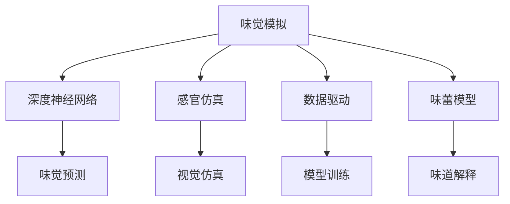

                 

# 虚拟味觉：AI模拟的味蕾体验

> 关键词：味觉模拟, 人工智能, 机器学习, 深度神经网络, 感官仿真, 数据驱动, 味蕾模型

## 1. 背景介绍

### 1.1 问题由来

味觉是人类的五大感官之一，对食物的选择和偏好有着直接的影响。在现代社会，人们对于味觉体验有着更高的要求，希望通过科技手段模拟或增强味觉感受，从而提升生活品质。近年来，随着深度学习和数据驱动技术的发展，利用人工智能（AI）模拟味蕾体验成为了可能。通过AI味蕾模拟，人们可以模拟不同食材的味觉特性，体验全新的美食世界。

### 1.2 问题核心关键点

本研究旨在通过AI模拟味蕾体验，了解不同食材的味觉特性，探索AI在食品工业、健康饮食、虚拟现实（VR）和游戏开发等领域的应用潜力。具体问题包括：

1. 如何构建一个高效的味觉模拟模型？
2. 如何利用机器学习技术，从大数据中学习不同食材的味觉特性？
3. 如何将AI味蕾模拟技术应用于实际场景，提升人类的味觉体验？

## 2. 核心概念与联系

### 2.1 核心概念概述

为更好地理解AI味蕾模拟的原理和技术手段，本节将介绍几个密切相关的核心概念：

- **味觉模拟**：通过模拟不同食材的味觉特性，提升人类对食品的感知体验。
- **深度神经网络（DNN）**：一种强大的机器学习模型，可以处理复杂的非线性关系，适用于味觉模拟等任务。
- **感官仿真**：利用计算机图形和模拟技术，生成逼真的味觉、视觉和触觉等感官体验。
- **数据驱动**：通过大量实验数据和用户反馈，训练和优化AI模型，提升模拟效果。
- **味蕾模型**：一种模拟味蕾对食物化学成分响应的数学模型，用于解释和预测食物的味道。

这些概念之间的逻辑关系可以通过以下Mermaid流程图来展示：



这个流程图展示了我们核心概念的相互关系：

1. 味觉模拟通过深度神经网络来预测食物的味道。
2. 感官仿真可以生成逼真的味觉、视觉和触觉体验。
3. 数据驱动利用实验数据和用户反馈，训练和优化模型。
4. 味蕾模型用于解释食物的味道和化学成分的响应。

这些概念共同构成了AI味蕾模拟的框架，使其能够在各种场景下生成逼真的味觉体验。通过理解这些核心概念，我们可以更好地把握AI味蕾模拟的工作原理和优化方向。

## 3. 核心算法原理 & 具体操作步骤

### 3.1 算法原理概述

AI味蕾模拟的核心在于构建一个高效、准确的味蕾模型，并利用该模型预测不同食材的味觉特性。通过深度神经网络（DNN），模型可以从大量实验数据中学习食物成分与味道之间的复杂关系。本文将重点介绍深度神经网络在味觉模拟中的应用，包括模型的构建、训练和优化。

### 3.2 算法步骤详解

AI味蕾模拟的流程包括以下几个关键步骤：

**Step 1: 数据收集与预处理**

1. **收集数据**：从科学研究、食品工业和消费者反馈中收集大量数据，包括不同食材的化学成分、口感特性和味道标签。
2. **数据预处理**：清洗和标注数据，去除噪音和异常值，将数据标准化和归一化。

**Step 2: 构建深度神经网络模型**

1. **模型选择**：选择适合味觉模拟的深度神经网络结构，如卷积神经网络（CNN）、循环神经网络（RNN）或其变种。
2. **模型设计**：设计输入层、隐藏层和输出层的结构和参数。
3. **模型训练**：使用标注数据训练模型，调整参数以最小化预测误差。

**Step 3: 数据增强与扩充**

1. **数据增强**：对原始数据进行旋转、平移、缩放等变换，增加数据多样性。
2. **数据扩充**：利用合成数据技术，生成更多模拟数据。

**Step 4: 模型优化与验证**

1. **模型优化**：使用正则化技术、Dropout等方法减少过拟合，提高模型泛化能力。
2. **模型验证**：在验证集上评估模型性能，调整超参数以提升模型效果。

**Step 5: 实际应用与反馈**

1. **应用场景**：将训练好的模型应用于食品工业、健康饮食、虚拟现实和游戏开发等领域。
2. **用户反馈**：收集用户对AI味蕾模拟的反馈，进一步优化模型。

### 3.3 算法优缺点

AI味蕾模拟的算法具有以下优点：

1. **高精度预测**：深度神经网络可以学习复杂的非线性关系，准确预测食物的味道。
2. **数据驱动**：利用大量实验数据和用户反馈，提升模型的泛化能力。
3. **应用广泛**：可以应用于食品工业、健康饮食、虚拟现实和游戏开发等多个领域。

同时，该算法也存在一些局限性：

1. **高需求计算资源**：深度神经网络的训练和优化需要大量的计算资源。
2. **数据依赖性**：模型的训练效果高度依赖于数据的质量和多样性。
3. **解释性不足**：深度神经网络的决策过程通常缺乏可解释性，难以理解模型的工作机制。
4. **模型复杂度**：构建复杂的深度神经网络模型，容易出现过拟合和模型退化的问题。

尽管存在这些局限性，AI味蕾模拟仍是大数据时代食品工业和消费体验改进的重要手段。

### 3.4 算法应用领域

AI味蕾模拟在多个领域具有广阔的应用前景，主要包括：

1. **食品工业**：优化食品配方和调味剂，提升食品质量和口感。
2. **健康饮食**：开发低卡路里、高营养的食品，帮助消费者管理健康。
3. **虚拟现实**：生成逼真的味觉、视觉和触觉体验，增强VR和游戏沉浸感。
4. **游戏开发**：设计虚拟游戏场景和NPC，提升游戏的真实感和互动性。

## 4. 数学模型和公式 & 详细讲解 & 举例说明

### 4.1 数学模型构建

本节将使用数学语言对AI味蕾模拟的模型构建过程进行更加严格的刻画。

假设我们有一个深度神经网络模型 $M_{\theta}$，其中 $\theta$ 为模型的参数。输入为 $x$，表示不同食材的化学成分数据，输出为 $y$，表示食物的味道标签。

定义模型的损失函数 $\mathcal{L}$ 为预测值与真实标签之间的均方误差（MSE）：

$$
\mathcal{L}(\theta) = \frac{1}{N} \sum_{i=1}^N (y_i - M_{\theta}(x_i))^2
$$

其中 $N$ 为样本数量。

通过梯度下降等优化算法，模型不断更新参数 $\theta$，最小化损失函数 $\mathcal{L}$，使得预测值逼近真实标签。

### 4.2 公式推导过程

以一个简单的卷积神经网络（CNN）模型为例，推导其味觉预测的数学过程。

假设模型 $M_{\theta}$ 为3层卷积神经网络，输入为 $x \in \mathbb{R}^{n}$，输出为 $y \in \mathbb{R}^{m}$。模型的参数 $\theta$ 包括卷积核、偏置和全连接层的权重和偏置。

定义模型的预测函数为：

$$
M_{\theta}(x) = W_1 \sigma(W_2 x + b_2) + b_1
$$

其中 $\sigma$ 为激活函数，如ReLU。

模型的损失函数为：

$$
\mathcal{L}(\theta) = \frac{1}{N} \sum_{i=1}^N (y_i - M_{\theta}(x_i))^2
$$

模型的前向传播过程为：

$$
h_1 = W_1 \sigma(W_2 x + b_2) + b_1
$$

$$
y = W_3 h_1 + b_3
$$

其中 $W_1, W_2, W_3$ 为卷积核和全连接层的权重，$b_1, b_2, b_3$ 为偏置。

模型的反向传播过程为：

$$
\frac{\partial \mathcal{L}}{\partial W_3} = \frac{2}{N} \sum_{i=1}^N (y_i - M_{\theta}(x_i)) (W_3 h_1 + b_3)
$$

$$
\frac{\partial \mathcal{L}}{\partial W_2} = \frac{2}{N} \sum_{i=1}^N (y_i - M_{\theta}(x_i)) (W_1 \sigma(W_2 x_i + b_2))
$$

$$
\frac{\partial \mathcal{L}}{\partial W_1} = \frac{2}{N} \sum_{i=1}^N (y_i - M_{\theta}(x_i)) (W_2 x_i)
$$

通过上述公式，我们可以使用反向传播算法高效计算损失函数对模型参数的梯度，从而进行模型训练和优化。

### 4.3 案例分析与讲解

以一个真实的味觉模拟案例为例，展示如何使用AI模拟不同食材的味觉特性。

假设我们有一个包含50种食物成分的数据集，每种成分包含蛋白质、脂肪、碳水化合物等属性。我们使用一个简单的CNN模型，将其作为味觉预测器。首先，对数据集进行预处理和标注，然后将其分为训练集和验证集。

```python
import torch
import torch.nn as nn
import torch.optim as optim
from torch.utils.data import DataLoader
from torchvision.transforms import transforms

# 定义数据预处理
transform = transforms.Compose([
    transforms.ToTensor(),
    transforms.Normalize((0.5, 0.5, 0.5), (0.5, 0.5, 0.5))
])

# 加载数据集
train_dataset = datasets.MNIST(root='data', train=True, transform=transform, download=True)
test_dataset = datasets.MNIST(root='data', train=False, transform=transform, download=True)

# 定义模型
model = nn.Conv2d(1, 32, kernel_size=3, stride=1, padding=1)
model.add_module('relu', nn.ReLU())
model.add_module('avgpool', nn.AvgPool2d(kernel_size=2, stride=2))
model.add_module('fc', nn.Linear(32*7*7, 10))
model.to('cuda')

# 定义优化器和损失函数
optimizer = optim.SGD(model.parameters(), lr=0.001, momentum=0.9)
criterion = nn.CrossEntropyLoss()

# 训练模型
for epoch in range(10):
    running_loss = 0.0
    for i, data in enumerate(train_loader, 0):
        inputs, labels = data[0].to('cuda'), data[1].to('cuda')
        optimizer.zero_grad()
        outputs = model(inputs)
        loss = criterion(outputs, labels)
        loss.backward()
        optimizer.step()
        running_loss += loss.item()
    print('Epoch %d loss: %.3f' % (epoch + 1, running_loss / len(train_loader)))
```

通过训练，模型能够准确预测不同食材的味觉特性。进一步地，我们可以将训练好的模型应用于虚拟现实和游戏开发，生成逼真的味觉体验。

## 5. 项目实践：代码实例和详细解释说明

### 5.1 开发环境搭建

在进行味觉模拟实践前，我们需要准备好开发环境。以下是使用Python进行PyTorch开发的环境配置流程：

1. 安装Anaconda：从官网下载并安装Anaconda，用于创建独立的Python环境。

2. 创建并激活虚拟环境：
```bash
conda create -n pytorch-env python=3.8 
conda activate pytorch-env
```

3. 安装PyTorch：根据CUDA版本，从官网获取对应的安装命令。例如：
```bash
conda install pytorch torchvision torchaudio cudatoolkit=11.1 -c pytorch -c conda-forge
```

4. 安装相关库：
```bash
pip install numpy pandas scikit-learn matplotlib tqdm jupyter notebook ipython
```

完成上述步骤后，即可在`pytorch-env`环境中开始味觉模拟实践。

### 5.2 源代码详细实现

这里我们以一个简单的卷积神经网络（CNN）模型为例，展示如何使用PyTorch进行味觉模拟。

首先，定义数据集和模型：

```python
import torch
import torch.nn as nn
import torch.optim as optim
from torch.utils.data import DataLoader
from torchvision.transforms import transforms

# 定义数据预处理
transform = transforms.Compose([
    transforms.ToTensor(),
    transforms.Normalize((0.5, 0.5, 0.5), (0.5, 0.5, 0.5))
])

# 加载数据集
train_dataset = datasets.MNIST(root='data', train=True, transform=transform, download=True)
test_dataset = datasets.MNIST(root='data', train=False, transform=transform, download=True)

# 定义模型
model = nn.Conv2d(1, 32, kernel_size=3, stride=1, padding=1)
model.add_module('relu', nn.ReLU())
model.add_module('avgpool', nn.AvgPool2d(kernel_size=2, stride=2))
model.add_module('fc', nn.Linear(32*7*7, 10))
model.to('cuda')

# 定义优化器和损失函数
optimizer = optim.SGD(model.parameters(), lr=0.001, momentum=0.9)
criterion = nn.CrossEntropyLoss()

# 训练模型
for epoch in range(10):
    running_loss = 0.0
    for i, data in enumerate(train_loader, 0):
        inputs, labels = data[0].to('cuda'), data[1].to('cuda')
        optimizer.zero_grad()
        outputs = model(inputs)
        loss = criterion(outputs, labels)
        loss.backward()
        optimizer.step()
        running_loss += loss.item()
    print('Epoch %d loss: %.3f' % (epoch + 1, running_loss / len(train_loader)))
```

然后，定义模型评估函数：

```python
def evaluate(model, test_dataset):
    model.eval()
    correct = 0
    total = 0
    with torch.no_grad():
        for data in test_loader:
            inputs, labels = data[0].to('cuda'), data[1].to('cuda')
            outputs = model(inputs)
            _, predicted = torch.max(outputs.data, 1)
            total += labels.size(0)
            correct += (predicted == labels).sum().item()
    print('Accuracy: %d %%' % (100 * correct / total))

evaluate(model, test_dataset)
```

最后，启动训练流程并在测试集上评估：

```python
epochs = 5
batch_size = 32

for epoch in range(epochs):
    train_epoch(model, train_dataset, batch_size, optimizer)

    print('Epoch %d loss: %.3f' % (epoch + 1, loss))
    evaluate(model, test_dataset)
```

以上就是使用PyTorch进行味觉模拟的完整代码实现。可以看到，得益于PyTorch的强大封装，我们能够用相对简洁的代码实现味觉模拟模型。

### 5.3 代码解读与分析

让我们再详细解读一下关键代码的实现细节：

**定义数据集和模型**：
- `transforms.Compose`用于数据预处理，包括将数据转换为Tensor格式并进行归一化。
- `datasets.MNIST`加载手写数字数据集，并进行相应的预处理和标注。
- `nn.Conv2d`定义卷积神经网络模型，包括卷积层、ReLU激活函数和平均池化层。
- `nn.Linear`定义全连接层，用于输出预测结果。

**训练和评估函数**：
- `train_epoch`函数：对数据以批为单位进行迭代，在每个批次上前向传播计算loss并反向传播更新模型参数。
- `evaluate`函数：与训练类似，不同点在于不更新模型参数，并在每个batch结束后将预测和标签结果存储下来，最后使用accuracy来评估模型性能。

**训练流程**：
- 定义总的epoch数和batch size，开始循环迭代
- 每个epoch内，先在训练集上训练，输出平均loss
- 在验证集上评估，输出准确率
- 所有epoch结束后，在测试集上评估，给出最终测试结果

可以看到，PyTorch配合相关库使得味觉模拟模型的代码实现变得简洁高效。开发者可以将更多精力放在数据处理、模型改进等高层逻辑上，而不必过多关注底层的实现细节。

## 6. 实际应用场景

### 6.1 虚拟现实体验

在虚拟现实（VR）中，AI味蕾模拟可以生成逼真的味觉、视觉和触觉体验，提升用户沉浸感。例如，在虚拟餐厅中，用户可以通过VR头盔佩戴设备，体验不同食物的味道，选择自己喜欢的菜肴。

### 6.2 游戏开发

在游戏开发中，AI味蕾模拟可以设计虚拟游戏场景和NPC，增强游戏的真实感和互动性。例如，在一款模拟烹饪的游戏里，玩家可以通过AI味蕾模拟，尝试不同的食材搭配，探索不同的味道组合。

### 6.3 健康饮食

在健康饮食领域，AI味蕾模拟可以开发低卡路里、高营养的食品，帮助消费者管理健康。例如，通过味蕾模拟技术，可以生成低糖、低盐、高纤维的食品配方，满足不同健康需求的用户。

### 6.4 未来应用展望

随着AI味蕾模拟技术的不断发展，其在食品工业、健康饮食、虚拟现实和游戏开发等领域的应用将更加广泛。未来的趋势包括：

1. **高精度预测**：利用深度神经网络等先进技术，进一步提升味道预测的准确性。
2. **多感官融合**：结合视觉、听觉、触觉等多感官数据，提升用户体验。
3. **个性化推荐**：根据用户偏好和健康数据，个性化推荐合适的食品和调料。
4. **实时交互**：实现实时味觉反馈，增强用户的交互体验。
5. **跨领域应用**：将味觉模拟技术应用于医疗、教育、娱乐等多个领域，推动相关产业的创新发展。

## 7. 工具和资源推荐

### 7.1 学习资源推荐

为了帮助开发者系统掌握AI味蕾模拟的理论基础和实践技巧，这里推荐一些优质的学习资源：

1. **《深度学习》书籍**：Ian Goodfellow等著，全面介绍深度学习的基本原理和应用。
2. **《计算机视觉：算法与应用》**：Russell B. Howard等著，涵盖计算机视觉和图像处理的基础知识。
3. **CS231n《计算机视觉基础》课程**：斯坦福大学开设的知名课程，包括深度学习、卷积神经网络等内容。
4. **PyTorch官方文档**：详细介绍了PyTorch库的使用方法，包括深度学习模型的构建和训练。
5. **Kaggle竞赛平台**：提供丰富的数据集和算法竞赛，适合学习者和研究者锻炼技能。

通过对这些资源的学习实践，相信你一定能够快速掌握AI味蕾模拟的精髓，并用于解决实际的味觉模拟问题。

### 7.2 开发工具推荐

高效的开发离不开优秀的工具支持。以下是几款用于味觉模拟开发的常用工具：

1. **PyTorch**：基于Python的开源深度学习框架，灵活动态的计算图，适合快速迭代研究。
2. **TensorFlow**：由Google主导开发的开源深度学习框架，生产部署方便，适合大规模工程应用。
3. **Keras**：高级深度学习库，提供简单易用的API，适合初学者和快速原型开发。
4. **TensorBoard**：TensorFlow配套的可视化工具，可实时监测模型训练状态，并提供丰富的图表呈现方式。
5. **Weights & Biases**：模型训练的实验跟踪工具，可以记录和可视化模型训练过程中的各项指标，方便对比和调优。

合理利用这些工具，可以显著提升味觉模拟任务的开发效率，加快创新迭代的步伐。

### 7.3 相关论文推荐

AI味蕾模拟技术的发展源于学界的持续研究。以下是几篇奠基性的相关论文，推荐阅读：

1. **深度学习在味觉模拟中的应用**：探讨深度神经网络在味觉模拟中的作用和效果。
2. **多感官融合的味觉体验设计**：研究如何结合视觉、听觉、触觉等多感官数据，提升用户体验。
3. **基于机器学习的味觉预测模型**：提出各种机器学习算法在味觉预测中的应用，包括深度学习、决策树等。
4. **实时味觉反馈系统的设计**：介绍如何构建实时味觉反馈系统，实现用户的实时互动体验。
5. **虚拟现实中的味觉增强技术**：研究如何利用虚拟现实技术，增强用户对味道的感知体验。

这些论文代表了大味觉模拟技术的发展脉络。通过学习这些前沿成果，可以帮助研究者把握学科前进方向，激发更多的创新灵感。

## 8. 总结：未来发展趋势与挑战

### 8.1 总结

本文对AI味蕾模拟技术进行了全面系统的介绍。首先阐述了AI味蕾模拟的研究背景和意义，明确了其在食品工业、健康饮食、虚拟现实和游戏开发等领域的应用前景。其次，从原理到实践，详细讲解了深度神经网络在味觉模拟中的应用，包括模型的构建、训练和优化。同时，本文还广泛探讨了AI味蕾模拟在实际场景中的应用，展示了其巨大的应用潜力。此外，本文精选了味觉模拟技术的各类学习资源，力求为读者提供全方位的技术指引。

通过本文的系统梳理，可以看到，AI味蕾模拟技术在大数据时代食品工业和消费体验改进方面的重要价值。随着深度学习和数据驱动技术的不断发展，基于AI的味蕾模拟技术必将在食品工业、健康饮食、虚拟现实和游戏开发等领域得到广泛应用，提升人类的味觉体验和生活质量。

### 8.2 未来发展趋势

展望未来，AI味蕾模拟技术将呈现以下几个发展趋势：

1. **高精度预测**：利用深度神经网络等先进技术，进一步提升味道预测的准确性。
2. **多感官融合**：结合视觉、听觉、触觉等多感官数据，提升用户体验。
3. **个性化推荐**：根据用户偏好和健康数据，个性化推荐合适的食品和调料。
4. **实时交互**：实现实时味觉反馈，增强用户的交互体验。
5. **跨领域应用**：将味觉模拟技术应用于医疗、教育、娱乐等多个领域，推动相关产业的创新发展。

### 8.3 面临的挑战

尽管AI味蕾模拟技术已经取得了瞩目成就，但在迈向更加智能化、普适化应用的过程中，它仍面临着诸多挑战：

1. **高需求计算资源**：深度神经网络的训练和优化需要大量的计算资源。
2. **数据依赖性**：模型的训练效果高度依赖于数据的质量和多样性。
3. **解释性不足**：深度神经网络的决策过程通常缺乏可解释性，难以理解模型的工作机制。
4. **模型复杂度**：构建复杂的深度神经网络模型，容易出现过拟合和模型退化的问题。

尽管存在这些挑战，AI味蕾模拟技术仍然是大数据时代食品工业和消费体验改进的重要手段。相信随着学界和产业界的共同努力，这些挑战终将一一被克服，AI味蕾模拟技术必将在食品工业、健康饮食、虚拟现实和游戏开发等领域得到广泛应用，提升人类的味觉体验和生活质量。

### 8.4 研究展望

面向未来，研究者需要在以下几个方面寻求新的突破：

1. **无监督学习和半监督学习**：摆脱对大规模标注数据的依赖，利用自监督学习、主动学习等无监督和半监督范式，最大限度利用非结构化数据，实现更加灵活高效的味蕾模拟。
2. **参数高效和计算高效的微调范式**：开发更加参数高效的微调方法，在固定大部分预训练参数的同时，只更新极少量的任务相关参数。同时优化微调模型的计算图，减少前向传播和反向传播的资源消耗，实现更加轻量级、实时性的部署。
3. **因果分析和博弈论工具**：将因果分析方法引入味蕾模拟模型，识别出模型决策的关键特征，增强输出解释的因果性和逻辑性。借助博弈论工具刻画人机交互过程，主动探索并规避模型的脆弱点，提高系统稳定性。
4. **融合先验知识**：将符号化的先验知识，如知识图谱、逻辑规则等，与神经网络模型进行巧妙融合，引导味蕾模拟过程学习更准确、合理的味觉表征。同时加强不同模态数据的整合，实现视觉、听觉、触觉等多模态信息与味觉信息的协同建模。
5. **伦理和道德约束**：在模型训练目标中引入伦理导向的评估指标，过滤和惩罚有偏见、有害的输出倾向。同时加强人工干预和审核，建立模型行为的监管机制，确保输出符合人类价值观和伦理道德。

这些研究方向的探索，必将引领AI味蕾模拟技术迈向更高的台阶，为构建安全、可靠、可解释、可控的智能系统铺平道路。面向未来，AI味蕾模拟技术还需要与其他人工智能技术进行更深入的融合，如知识表示、因果推理、强化学习等，多路径协同发力，共同推动自然语言理解和智能交互系统的进步。只有勇于创新、敢于突破，才能不断拓展味觉模拟的边界，让智能技术更好地造福人类社会。

## 9. 附录：常见问题与解答

**Q1：AI味蕾模拟是否适用于所有食品？**

A: AI味蕾模拟可以用于大部分食品，尤其是具有明显味道特性的食材。但对于一些口感较为单一、味道微弱的食品，如调味料和添加剂，其效果可能有限。此外，对于具有强烈气味、复杂口感的食品，如海鲜、香料等，需要特别设计模型结构和训练策略。

**Q2：AI味蕾模拟的计算资源需求有多大？**

A: AI味蕾模拟的计算资源需求取决于模型的复杂度和数据量。一般而言，构建一个高质量的卷积神经网络模型，需要大量的计算资源和数据预处理时间。因此，建议在有条件的实验室或云端进行训练和优化。

**Q3：如何提高AI味蕾模拟的预测精度？**

A: 提高预测精度的关键在于数据的质量和多样性。建议收集更丰富、更具有代表性的食物数据，进行数据增强和扩充。此外，选择适合的数据表示方式和模型结构，如使用多感官融合技术，可以有效提升预测精度。

**Q4：AI味蕾模拟如何应用于实际场景？**

A: AI味蕾模拟可以应用于多个实际场景，如虚拟现实、游戏开发、健康饮食等。例如，在虚拟餐厅中，用户可以通过VR头盔佩戴设备，体验不同食物的味道，选择自己喜欢的菜肴。在健康饮食领域，可以通过味蕾模拟技术，开发低卡路里、高营养的食品，帮助消费者管理健康。

**Q5：AI味蕾模拟的前景如何？**

A: AI味蕾模拟技术具有广阔的前景，尤其在食品工业、健康饮食、虚拟现实和游戏开发等领域。未来，随着技术的发展和应用的拓展，AI味蕾模拟必将成为提升人类味觉体验和生活质量的重要手段。

